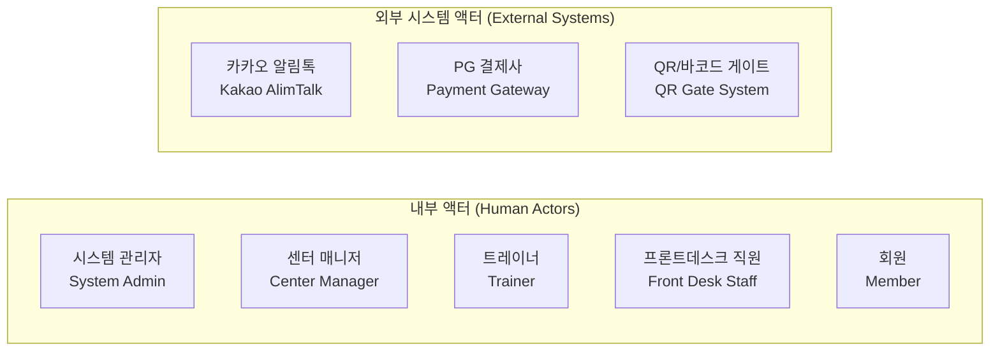
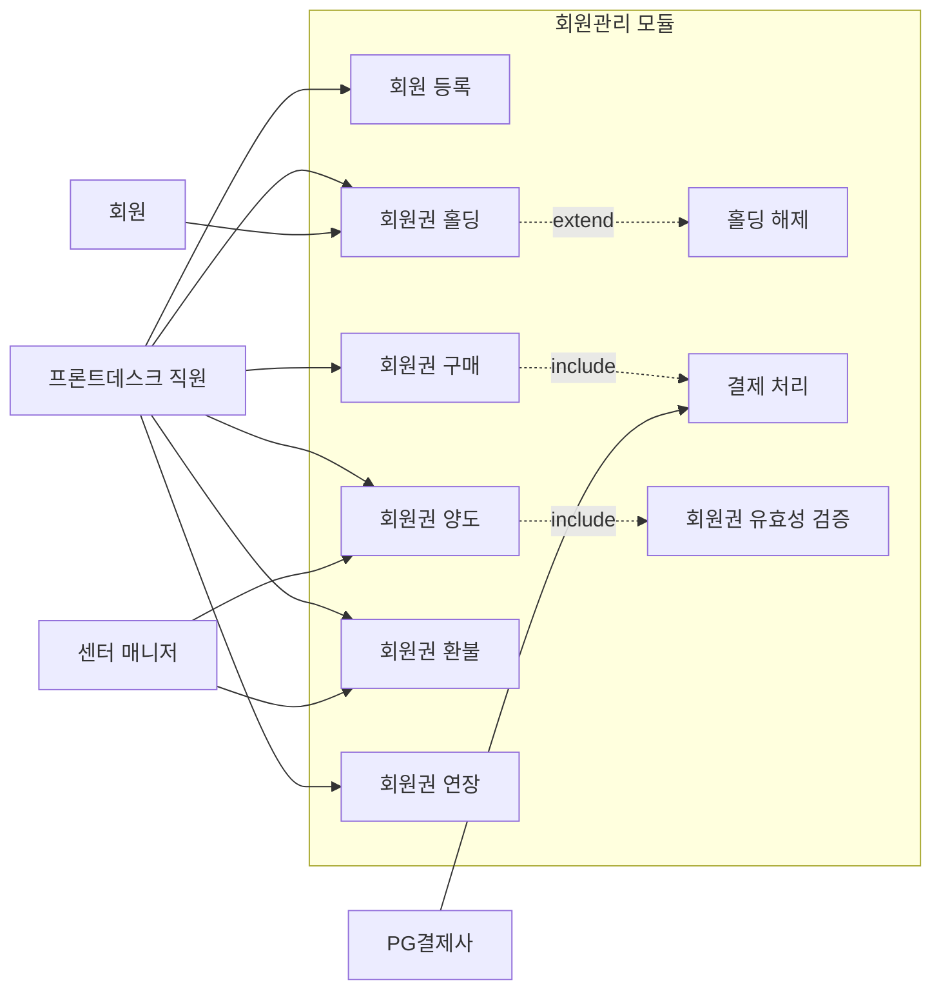
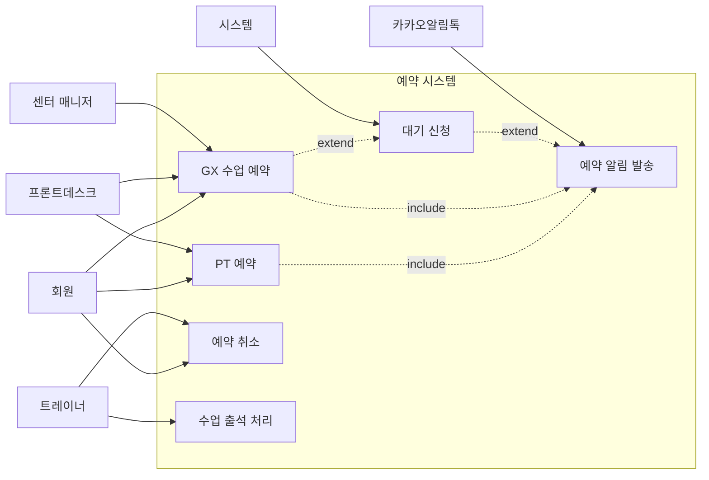

# 요구사항 분석서 및 유스케이스 정의서

**프로젝트명:** 중소형 헬스장 웹 기반 회원관리 시스템 (GYM CRM)
**문서 버전:** v1.0
**작성일:** 2026-02-20
**작성자:** 시스템 분석팀
**상태:** 초안 (Draft)

---

## 목차

1. [프로젝트 개요](#1-프로젝트-개요)
2. [이해관계자 분석](#2-이해관계자-분석)
3. [기능 요구사항 (FR)](#3-기능-요구사항-fr)
4. [비기능 요구사항 (NFR)](#4-비기능-요구사항-nfr)
5. [유스케이스 정의](#5-유스케이스-정의)
6. [제약사항 및 가정](#6-제약사항-및-가정)
7. [요구사항 추적 매트릭스](#7-요구사항-추적-매트릭스)

---

## 1. 프로젝트 개요

### 1.1 프로젝트명

**GYM CRM - 중소형 헬스장 웹 기반 회원관리 시스템**

### 1.2 목적

중소형 헬스장 운영에 필요한 회원관리, 예약, 출입통제, 매출정산, CRM 메시지 기능을 하나의 통합 플랫폼으로 제공하여 운영 효율성을 극대화하고 회원 만족도를 향상시킨다.

### 1.3 배경

중소형 헬스장은 대부분 수기 장부, 분산된 엑셀 파일, 개별 앱 등을 혼용하여 운영하고 있어 다음과 같은 문제가 발생한다.

- **운영 비효율:** 회원 정보 이중 입력, 회원권 만료일 수기 추적으로 인한 누락
- **매출 손실:** 홀딩/양도/환불 처리의 불투명성으로 인한 수익 관리 어려움
- **고객 이탈:** 만료 사전 안내 부재, 예약 불편으로 인한 회원 이탈
- **보안 취약:** 수기 출입 기록으로 인한 무단 출입 통제 불가

본 시스템은 이러한 문제를 해결하기 위한 통합 디지털 운영 플랫폼이다.

### 1.4 범위 (Scope)

본 프로젝트의 범위는 다음과 같다.

**포함 범위 (In-Scope)**

| 구분 | 내용 |
|------|------|
| 회원 관리 | 신규 등록, 회원권(기간제/횟수제) 양도/홀딩/환불 처리 |
| 상품 관리 | 헬스 이용권, GX(그룹운동), PT(1:1) 상품 구성 및 가격 설정 |
| 예약 시스템 | 트레이너별 스케줄 설정, 실시간 수업 예약 및 대기 신청 |
| 출입 통제 | 모바일 QR코드/바코드 연동 키오스크/게이트 제어 |
| 라커룸 관리 | 라커 배정, 만료일 관리, 키 분실 처리 |
| 매출/정산 | 기간별 매출 리포트, 트레이너 수업 횟수 기반 급여 정산 |
| CRM 메시지 | 만료 임박/생일/이벤트 문자·알림톡 자동 발송 |

**제외 범위 (Out-of-Scope)**

- 회계/세무 ERP 연동
- 헬스장 운동 프로그램 콘텐츠 관리
- 식단 관리 및 체성분 분석 기능
- 모바일 앱 (iOS/Android) 네이티브 개발 (모바일 웹 최적화로 대체)

### 1.5 기술 스택

| 구분 | 기술 |
|------|------|
| 인프라 | AWS EC2, AWS RDS |
| 백엔드 | Java Spring Boot 3.0 |
| 프론트엔드 | React.js + TypeScript (관리자 포털) |
| 데이터베이스 | PostgreSQL |
| 외부 연동 | 카카오 알림톡 API, PG사 결제 API, QR/바코드 게이트 SDK |

---

## 2. 이해관계자 분석

### 2.1 액터(Actor) 식별

시스템과 상호작용하는 모든 사람 및 외부 시스템을 식별한다.

### 2.2 액터별 역할 및 책임

#### 2.2.1 시스템 관리자 (System Admin)

| 항목 | 내용 |
|------|------|
| 정의 | 시스템 전체를 관리하는 최고 권한 사용자 (예: IT 운영 담당자) |
| 주요 역할 | 사용자 계정 생성/권한 관리, 시스템 설정, 데이터 백업/복구 |
| 책임 | 시스템 안정성 확보, 보안 정책 수립 및 적용 |
| 접근 채널 | 웹 관리자 포털 |

#### 2.2.2 센터 매니저 (Center Manager)

| 항목 | 내용 |
|------|------|
| 정의 | 헬스장 전반 운영을 담당하는 관리자 (점장, 운영 매니저) |
| 주요 역할 | 상품 등록/가격 설정, 매출 리포트 조회, 트레이너 급여 정산, CRM 캠페인 설정 |
| 책임 | 수익 관리, 운영 지표 모니터링, 회원 서비스 품질 관리 |
| 접근 채널 | 웹 관리자 포털 |

#### 2.2.3 트레이너 (Trainer)

| 항목 | 내용 |
|------|------|
| 정의 | PT(1:1 퍼스널 트레이닝) 및 GX(그룹 운동) 수업을 진행하는 강사 |
| 주요 역할 | 개인 스케줄 등록/관리, 담당 회원 PT 일지 작성, 수업 예약 확인 |
| 책임 | 예약 수업 이행, 회원 운동 기록 관리 |
| 접근 채널 | 웹 관리자 포털 (제한된 권한) |

#### 2.2.4 프론트데스크 직원 (Front Desk Staff)

| 항목 | 내용 |
|------|------|
| 정의 | 헬스장 데스크에서 회원 응대 및 현장 업무를 처리하는 직원 |
| 주요 역할 | 신규 회원 등록, 회원권 판매/처리(양도·홀딩·환불), 라커 배정, 현장 결제 접수 |
| 책임 | 회원 정보 정확성 유지, 현장 민원 처리 |
| 접근 채널 | 웹 관리자 포털 (데스크 전용 권한) |

#### 2.2.5 회원 (Member)

| 항목 | 내용 |
|------|------|
| 정의 | 헬스장 서비스를 이용하는 등록 고객 |
| 주요 역할 | 수업 예약/취소, 회원권 현황 조회, QR코드 출입, 회원 정보 변경 |
| 책임 | 예약 시간 준수, 회원권 기간 내 이용 |
| 접근 채널 | 모바일 웹 (반응형), QR 코드 |

#### 2.2.6 카카오 알림톡 (Kakao AlimTalk)

| 항목 | 내용 |
|------|------|
| 정의 | 카카오 비즈니스 플랫폼의 알림톡 발송 외부 시스템 |
| 역할 | GYM CRM 시스템으로부터 발송 요청을 수신하여 회원에게 알림톡 전송 |
| 연동 방식 | REST API (HTTP/HTTPS) |

#### 2.2.7 PG 결제사 (Payment Gateway)

| 항목 | 내용 |
|------|------|
| 정의 | 카드 결제, 계좌이체 등 온라인 결제를 처리하는 외부 결제 시스템 |
| 역할 | 회원권 결제 승인/취소, 결제 결과 콜백 전달 |
| 연동 방식 | REST API, 결제 결과 Webhook |

#### 2.2.8 QR/바코드 게이트 (QR Gate System)

| 항목 | 내용 |
|------|------|
| 정의 | 헬스장 출입구에 설치된 키오스크 및 게이트 하드웨어/소프트웨어 |
| 역할 | 회원 QR/바코드 스캔 후 GYM CRM에 출입 인증 요청, 게이트 개폐 수신 |
| 연동 방식 | REST API (실시간 인증 요청/응답) |

---

## 3. 기능 요구사항 (FR)

요구사항 ID 체계: `FR-{모듈코드}-{순번 3자리}`

| 모듈 | 코드 |
|------|------|
| 회원관리 | MBR |
| 상품관리 | PRD |
| 예약시스템 | RSV |
| 출입통제 | ACC |
| 라커관리 | LKR |
| 매출정산 | SAL |
| CRM메시지 | CRM |

**우선순위 기준**

- **필수 (Must Have):** 시스템 운영에 반드시 필요한 핵심 기능
- **선택 (Should Have):** 운영 효율성을 높이는 중요 기능, 1차 오픈 후 포함 가능
- **향후 (Could Have):** 중장기 로드맵에 포함하는 부가 기능

---

### 3.1 회원관리 모듈 (MBR)

| 요구사항 ID | 요구사항명 | 설명 | 우선순위 | 관련 액터 |
|-------------|------------|------|----------|-----------|
| FR-MBR-001 | 신규 회원 등록 | 이름, 연락처, 생년월일, 성별, 사진, 비상연락처 등 기본 정보를 입력하여 회원을 등록한다. 중복 회원(연락처 기준) 검증을 수행한다. | 필수 | 프론트데스크 |
| FR-MBR-002 | 회원 정보 조회/수정 | 회원 목록 검색(이름/연락처/회원번호) 및 개별 회원 상세 정보(회원권, 예약 이력, 출입 이력) 조회 및 수정한다. | 필수 | 프론트데스크, 센터 매니저 |
| FR-MBR-003 | 회원 탈퇴 처리 | 회원 탈퇴 요청 시 잔여 회원권을 확인하고, 환불 처리 후 회원 상태를 '탈퇴'로 변경한다. 개인정보는 법정 보관 기간 준수 후 파기한다. | 필수 | 프론트데스크, 센터 매니저 |
| FR-MBR-004 | 회원권 구매 등록 | 회원에게 특정 상품(기간제/횟수제)을 연결하여 회원권을 생성한다. 결제 수단(현금/카드/PG)을 기록한다. | 필수 | 프론트데스크 |
| FR-MBR-005 | 회원권 양도 처리 | 기존 회원의 잔여 회원권(기간 또는 잔여 횟수)을 다른 회원에게 이전한다. 양도 수수료 설정이 가능하다. | 필수 | 프론트데스크, 센터 매니저 |
| FR-MBR-006 | 회원권 홀딩 처리 | 부상, 여행 등 사유로 회원권 사용을 일시 정지(홀딩)한다. 홀딩 기간만큼 만료일이 자동 연장된다. 최대 홀딩 횟수/기간은 상품별로 설정한다. | 필수 | 프론트데스크, 회원 |
| FR-MBR-007 | 회원권 환불 처리 | 잔여 기간 또는 잔여 횟수에 비례하여 환불 금액을 자동 계산한다. 위약금 정책을 반영한다. 결제 수단에 따라 환불 방법(계좌이체/카드 취소)을 처리한다. | 필수 | 프론트데스크, 센터 매니저 |
| FR-MBR-008 | 회원권 연장 | 회원 요청에 의해 기간제 회원권의 만료일을 연장한다. 연장 금액을 추가 결제한다. | 필수 | 프론트데스크 |
| FR-MBR-009 | 회원 사진 등록/관리 | 회원 등록 시 증명사진을 업로드하여 데스크에서 식별할 수 있도록 한다. | 선택 | 프론트데스크 |
| FR-MBR-010 | 회원 메모 기능 | 회원별 특이사항(부상 이력, VIP 등급, 선호도 등)을 자유 형식 메모로 기록한다. | 선택 | 프론트데스크, 트레이너 |

---

### 3.2 상품관리 모듈 (PRD)

| 요구사항 ID | 요구사항명 | 설명 | 우선순위 | 관련 액터 |
|-------------|------------|------|----------|-----------|
| FR-PRD-001 | 상품 등록 | 상품명, 상품 유형(헬스권/GX/PT), 금액, 기간 또는 횟수, 홀딩 허용 여부/최대 기간, 양도 허용 여부를 설정하여 상품을 등록한다. | 필수 | 센터 매니저, 시스템 관리자 |
| FR-PRD-002 | 상품 수정/비활성화 | 기존 상품 정보를 수정하거나 판매를 중단(비활성화)한다. 이미 발급된 회원권에는 영향을 주지 않는다. | 필수 | 센터 매니저 |
| FR-PRD-003 | 기간제 상품 설정 | 1개월, 3개월, 6개월, 12개월 등 기간 단위로 상품을 구성한다. | 필수 | 센터 매니저 |
| FR-PRD-004 | 횟수제 상품 설정 | PT 10회, PT 20회 등 이용 횟수 단위로 상품을 구성한다. 유효기간(회원권 소멸 기한)을 함께 설정한다. | 필수 | 센터 매니저 |
| FR-PRD-005 | GX 수업 상품 설정 | GX 수업별(요가, 필라테스, 스피닝 등) 이용 횟수 또는 기간 상품을 구성한다. 수업 정원을 설정한다. | 필수 | 센터 매니저 |
| FR-PRD-006 | PT 트레이너 연결 상품 | PT 상품에 특정 트레이너를 연결하여 해당 트레이너 전용 PT 상품을 구성할 수 있다. | 선택 | 센터 매니저 |
| FR-PRD-007 | 상품 할인/프로모션 설정 | 특정 기간 동안 상품에 정률 또는 정액 할인을 적용하는 프로모션을 설정한다. | 선택 | 센터 매니저 |
| FR-PRD-008 | 상품 목록 조회 | 판매 중인 전체 상품 목록을 유형별, 상태별로 필터링하여 조회한다. | 필수 | 센터 매니저, 프론트데스크 |

---

### 3.3 예약시스템 모듈 (RSV)

| 요구사항 ID | 요구사항명 | 설명 | 우선순위 | 관련 액터 |
|-------------|------------|------|----------|-----------|
| FR-RSV-001 | 트레이너 스케줄 설정 | 트레이너별 주간 가용 시간을 설정한다. 반복 스케줄(매주 동일) 또는 날짜별 개별 설정이 가능하다. | 필수 | 트레이너, 센터 매니저 |
| FR-RSV-002 | GX 수업 스케줄 등록 | GX 수업별 요일/시간/담당 트레이너/정원을 설정하여 수업 스케줄을 등록한다. | 필수 | 센터 매니저 |
| FR-RSV-003 | PT 예약 신청 | 회원이 담당 트레이너의 가용 시간을 확인하고 PT 수업을 예약한다. 예약 시 잔여 횟수가 차감(예약 확정 시점 또는 수업 완료 시점 선택 가능)된다. | 필수 | 회원, 프론트데스크 |
| FR-RSV-004 | GX 수업 예약 신청 | 회원이 원하는 GX 수업에 예약을 신청한다. 정원 초과 시 대기 신청이 자동 처리된다. | 필수 | 회원, 프론트데스크 |
| FR-RSV-005 | 예약 취소 | 회원 또는 직원이 예약을 취소한다. 취소 정책(n시간 전 취소 시 횟수 미차감 등)을 설정할 수 있다. | 필수 | 회원, 프론트데스크, 트레이너 |
| FR-RSV-006 | 대기 자동 전환 | GX 예약 취소 발생 시 대기 순번에 따라 자동으로 예약 전환 처리하고 해당 회원에게 알림을 발송한다. | 필수 | 시스템, 회원 |
| FR-RSV-007 | 트레이너 예약 현황 조회 | 트레이너별 일간/주간 예약 현황을 캘린더 형태로 조회한다. | 필수 | 트레이너, 센터 매니저 |
| FR-RSV-008 | 수업 출석 처리 | 수업 완료 후 트레이너 또는 직원이 출석을 확인하고, 횟수제 회원권의 잔여 횟수를 차감한다. | 필수 | 트레이너, 프론트데스크 |
| FR-RSV-009 | 예약 알림 발송 | 예약 확정 시 즉시 알림, 수업 전 n시간 전 리마인드 알림을 자동 발송한다. | 필수 | 시스템, 카카오 알림톡 |
| FR-RSV-010 | 노쇼(No-Show) 처리 | 수업 시작 후 일정 시간 내 출석 미확인 시 노쇼로 처리한다. 노쇼 횟수 누적 시 예약 제한 정책을 적용할 수 있다. | 선택 | 트레이너, 시스템 |

---

### 3.4 출입통제 모듈 (ACC)

| 요구사항 ID | 요구사항명 | 설명 | 우선순위 | 관련 액터 |
|-------------|------------|------|----------|-----------|
| FR-ACC-001 | 회원 QR코드 발급 | 회원 등록 시 고유 QR코드를 자동 생성하여 모바일 웹에서 표시한다. QR코드는 보안을 위해 일정 주기로 갱신(Dynamic QR)한다. | 필수 | 시스템, 회원 |
| FR-ACC-002 | QR/바코드 출입 인증 | 게이트/키오스크에서 QR 또는 바코드 스캔 시 GYM CRM에 실시간 인증 요청을 전송한다. 유효 회원권 보유 여부를 검증하고 결과를 게이트에 응답한다. | 필수 | QR게이트, 시스템 |
| FR-ACC-003 | 출입 이력 기록 | 인증 성공/실패 모든 출입 시도를 일시, 회원, 게이트 위치와 함께 기록한다. | 필수 | 시스템 |
| FR-ACC-004 | 출입 현황 모니터링 | 현재 헬스장 내 체류 인원수 및 당일 출입 이력을 실시간으로 조회한다. | 필수 | 센터 매니저, 프론트데스크 |
| FR-ACC-005 | 비정상 출입 알림 | 유효 회원권이 없는 회원의 출입 시도, 만료된 QR 사용 시도 등 비정상 출입을 감지하여 관리자에게 즉시 알림을 발송한다. | 필수 | 시스템, 센터 매니저 |
| FR-ACC-006 | 게이트 수동 제어 | 관리자가 특정 게이트를 원격으로 개방하거나 잠금 처리할 수 있다. | 선택 | 센터 매니저, 시스템 관리자 |
| FR-ACC-007 | 운영 시간 제한 | 헬스장 운영 시간을 설정하고, 운영 시간 외 출입 시도를 자동 차단한다. | 선택 | 센터 매니저 |

---

### 3.5 라커관리 모듈 (LKR)

| 요구사항 ID | 요구사항명 | 설명 | 우선순위 | 관련 액터 |
|-------------|------------|------|----------|-----------|
| FR-LKR-001 | 라커 현황 조회 | 전체 라커의 상태(사용중/빈자리/점검중)를 시각적 맵 형태로 조회한다. | 필수 | 프론트데스크 |
| FR-LKR-002 | 라커 배정 | 회원에게 특정 라커를 배정한다. 배정 시 이용 기간 및 요금을 설정한다. 라커 요금은 회원권과 별도로 관리한다. | 필수 | 프론트데스크 |
| FR-LKR-003 | 라커 반납 처리 | 회원이 라커를 반납할 때 상태를 '빈자리'로 변경하고, 잔여 기간에 대한 환불 여부를 처리한다. | 필수 | 프론트데스크 |
| FR-LKR-004 | 라커 만료 관리 | 라커 계약 만료일이 도래하면 자동으로 회원에게 연장 안내 메시지를 발송한다. 만료 후 일정 기간 내 미연장 시 자동 반납 처리한다. | 필수 | 시스템, 프론트데스크 |
| FR-LKR-005 | 키 분실 처리 | 라커 키 분실 시 분실 비용을 청구하고, 키 교체 이력을 기록한다. | 필수 | 프론트데스크 |
| FR-LKR-006 | 라커 구역/등급 관리 | 라커를 구역(남성/여성/일반/VIP 등)과 등급(일반/프리미엄)으로 구분하여 관리하고 가격을 차등 적용한다. | 선택 | 센터 매니저 |

---

### 3.6 매출/정산 모듈 (SAL)

| 요구사항 ID | 요구사항명 | 설명 | 우선순위 | 관련 액터 |
|-------------|------------|------|----------|-----------|
| FR-SAL-001 | 매출 대시보드 | 오늘의 매출, 이번 달 누적 매출, 신규 회원수, 만료 예정 회원수를 대시보드 형태로 표시한다. | 필수 | 센터 매니저 |
| FR-SAL-002 | 기간별 매출 리포트 | 일별/주별/월별/연도별 매출을 상품 유형(헬스권/GX/PT/라커)별로 조회한다. 엑셀 다운로드를 지원한다. | 필수 | 센터 매니저 |
| FR-SAL-003 | 결제 수단별 매출 조회 | 현금, 카드, 계좌이체 등 결제 수단별 매출을 집계하여 조회한다. | 필수 | 센터 매니저 |
| FR-SAL-004 | 환불/취소 내역 조회 | 기간별 환불 및 결제 취소 내역을 조회한다. 순매출(총매출 - 환불) 계산을 자동화한다. | 필수 | 센터 매니저 |
| FR-SAL-005 | 트레이너 수업 횟수 집계 | 트레이너별 월간 완료 PT 수업 횟수를 자동 집계한다. | 필수 | 센터 매니저, 트레이너 |
| FR-SAL-006 | 트레이너 급여 정산 | 수업 횟수 기반 단가를 설정하고, 집계된 수업 횟수에 단가를 적용하여 월별 급여를 자동 계산한다. 정산서를 PDF로 출력할 수 있다. | 필수 | 센터 매니저 |
| FR-SAL-007 | 미수금 관리 | 분할납부 또는 후불 처리된 미수금 현황을 조회하고, 납부 예정일 알림을 발송한다. | 선택 | 센터 매니저, 프론트데스크 |
| FR-SAL-008 | 일일 마감 정산 | 당일 발생한 전체 수납 내역을 마감하고 정산 보고서를 생성한다. | 향후 | 센터 매니저, 프론트데스크 |

---

### 3.7 CRM 메시지 모듈 (CRM)

| 요구사항 ID | 요구사항명 | 설명 | 우선순위 | 관련 액터 |
|-------------|------------|------|----------|-----------|
| FR-CRM-001 | 만료 임박 자동 알림 | 회원권 만료 7일 전, 3일 전, 당일에 만료 임박 메시지를 자동 발송한다. 발송 일수는 설정 가능하다. | 필수 | 시스템, 카카오 알림톡 |
| FR-CRM-002 | 생일 축하 메시지 | 회원 생일 당일에 생일 축하 메시지를 자동 발송한다. 메시지에 쿠폰 또는 이벤트 안내를 포함할 수 있다. | 필수 | 시스템, 카카오 알림톡 |
| FR-CRM-003 | 이벤트 안내 메시지 | 특정 회원 그룹(전체/특정 상품 이용자/지역 등)을 타깃으로 이벤트 안내 메시지를 발송한다. | 필수 | 센터 매니저, 카카오 알림톡 |
| FR-CRM-004 | 메시지 템플릿 관리 | 알림톡/SMS 메시지 템플릿을 등록하고 관리한다. 카카오 알림톡 템플릿 심사 상태를 표시한다. | 필수 | 센터 매니저, 시스템 관리자 |
| FR-CRM-005 | 발송 이력 조회 | 발송된 메시지의 수신자, 발송 시각, 발송 결과(성공/실패)를 조회한다. | 필수 | 센터 매니저 |
| FR-CRM-006 | 수신 거부 관리 | 회원이 메시지 수신을 거부할 수 있으며, 수신 거부 회원에게는 마케팅 메시지를 발송하지 않는다. 정보성 알림(예약 확정 등)은 수신 거부 대상에서 제외한다. | 필수 | 시스템, 회원 |
| FR-CRM-007 | 장기 미방문 회원 대상 발송 | 마지막 출입일 기준 n일 이상 방문하지 않은 회원에게 재방문 유도 메시지를 발송한다. | 선택 | 시스템, 센터 매니저 |
| FR-CRM-008 | 발송 예약 기능 | 특정 날짜/시간에 메시지 발송을 예약한다. | 선택 | 센터 매니저 |

---

## 4. 비기능 요구사항 (NFR)

요구사항 ID 체계: `NFR-{순번 3자리}`

### 4.1 성능 요구사항

| 요구사항 ID | 요구사항명 | 설명 | 측정 기준 |
|-------------|------------|------|-----------|
| NFR-001 | 페이지 응답 시간 | 일반적인 조회/등록 화면의 응답 시간은 3초 이내여야 한다. | P95 기준, 3초 이내 |
| NFR-002 | QR 출입 인증 응답 시간 | QR 스캔 후 게이트 개폐까지의 응답 시간은 2초 이내여야 한다. | P99 기준, 2초 이내 |
| NFR-003 | 동시 접속자 처리 | 시스템은 최소 50명의 동시 접속자를 안정적으로 처리해야 한다. (중소형 헬스장 기준) | 동시 접속자 50명, 정상 응답률 99% 이상 |
| NFR-004 | 대용량 데이터 조회 | 회원 수 5,000명, 거래 내역 10만 건 이상 환경에서도 리포트 조회 시간이 10초를 초과하지 않아야 한다. | 리포트 조회 10초 이내 |

### 4.2 보안 요구사항

| 요구사항 ID | 요구사항명 | 설명 | 측정 기준 |
|-------------|------------|------|-----------|
| NFR-010 | 인증 및 인가 | 모든 API 엔드포인트는 JWT 기반 인증을 적용한다. 역할 기반 접근 제어(RBAC)를 통해 액터별 접근 가능한 기능을 제한한다. | OWASP 기준 준수 |
| NFR-011 | 개인정보 암호화 | 회원의 연락처, 생년월일 등 개인식별정보(PII)는 AES-256 알고리즘으로 암호화하여 저장한다. | AES-256 적용 확인 |
| NFR-012 | 통신 암호화 | 클라이언트-서버 간 모든 통신은 HTTPS(TLS 1.2 이상)를 사용한다. | TLS 1.2 이상 |
| NFR-013 | 비밀번호 정책 | 관리자 계정 비밀번호는 최소 8자 이상, 영문/숫자/특수문자 조합을 요구한다. 90일마다 변경을 권고한다. | 정책 적용 여부 확인 |
| NFR-014 | QR 코드 보안 | QR 코드는 Dynamic 방식으로 일정 주기(최대 5분)마다 갱신하여 QR 코드 복사·재사용을 방지한다. | 갱신 주기 5분 이내 |
| NFR-015 | 감사 로그 | 민감 데이터 조회, 회원권 처리(양도/홀딩/환불), 계정 관리 작업에 대한 감사 로그를 기록한다. 로그는 최소 1년 보존한다. | 감사 로그 1년 보존 |
| NFR-016 | 개인정보보호법 준수 | 개인정보보호법, 정보통신망법 등 관련 법규를 준수하며, 탈퇴 회원 개인정보는 법정 기간(5년) 후 파기한다. | 법적 요건 충족 |

### 4.3 가용성 요구사항

| 요구사항 ID | 요구사항명 | 설명 | 측정 기준 |
|-------------|------------|------|-----------|
| NFR-020 | 서비스 가용성 | 시스템은 연간 99.5% 이상의 가용성을 유지해야 한다. (연간 허용 다운타임 약 44시간) | 월별 업타임 모니터링 |
| NFR-021 | 정기 점검 | 정기 점검은 헬스장 비운영 시간대(새벽 2시~5시)에 진행하며, 2주 전 사전 공지한다. | 운영 시간 외 점검 |
| NFR-022 | 데이터 백업 | 데이터베이스는 매일 자동 백업하며, 백업 데이터는 최소 30일 보존한다. RTO 4시간, RPO 24시간을 목표로 한다. | RTO 4시간, RPO 24시간 |

### 4.4 확장성 요구사항

| 요구사항 ID | 요구사항명 | 설명 | 측정 기준 |
|-------------|------------|------|-----------|
| NFR-030 | 수평 확장성 | AWS EC2 오토스케일링을 활용하여 트래픽 증가 시 서버를 자동으로 확장할 수 있어야 한다. | 오토스케일링 정책 적용 |
| NFR-031 | 다중 지점 지원 | 향후 동일 브랜드 내 복수 지점을 단일 시스템으로 관리할 수 있는 멀티 테넌시 구조를 설계한다. | 설계 문서 검토 |
| NFR-032 | API 버전 관리 | 외부 연동 API(QR게이트, PG사 등)는 버전 관리를 적용하여 하위 호환성을 유지한다. | API 버전 정책 적용 |

### 4.5 사용성 요구사항

| 요구사항 ID | 요구사항명 | 설명 | 측정 기준 |
|-------------|------------|------|-----------|
| NFR-040 | 반응형 웹 | 관리자 포털은 PC 및 태블릿 환경을 지원한다. 회원용 모바일 웹은 스마트폰(iOS/Android) 브라우저에 최적화한다. | 주요 브라우저/기기 테스트 |
| NFR-041 | 직관적 UI | 프론트데스크 직원이 별도 교육 없이 핵심 기능(회원 등록, 회원권 처리)을 2시간 이내에 습득할 수 있어야 한다. | 사용성 테스트 |
| NFR-042 | 오류 메시지 명확성 | 사용자 입력 오류 발생 시 원인과 해결 방법을 명확하게 안내하는 메시지를 표시한다. | UI/UX 검토 |
| NFR-043 | 다국어 지원 | 1차 버전은 한국어 단일 언어를 지원한다. 향후 영어 지원을 위한 i18n 구조를 설계에 반영한다. | 설계 반영 여부 확인 |

---

## 5. 유스케이스 정의

### 5.1 유스케이스 다이어그램

#### 5.1.1 전체 시스템 유스케이스 개요

```mermaid
graph TB
    subgraph "GYM CRM 시스템"
        subgraph "회원관리"
            UC01[UC-01 회원 등록]
            UC02[UC-02 회원권 구매]
            UC03[UC-03 회원권 양도]
            UC04[UC-04 회원권 홀딩]
        end

        subgraph "예약 시스템"
            UC05[UC-05 PT 예약]
            UC06[UC-06 GX 수업 예약]
        end

        subgraph "출입 통제"
            UC07[UC-07 QR 출입 인증]
        end

        subgraph "라커관리"
            UC08[UC-08 라커 배정]
        end

        subgraph "매출/정산"
            UC09[UC-09 매출 리포트 조회]
        end

        subgraph "CRM 메시지"
            UC10[UC-10 CRM 메시지 발송]
        end
    end

    FD[프론트데스크 직원] --> UC01
    FD --> UC02
    FD --> UC03
    FD --> UC04
    FD --> UC08

    MB[회원] --> UC02
    MB --> UC05
    MB --> UC06
    MB --> UC07

    TR[트레이너] --> UC05

    CM[센터 매니저] --> UC09
    CM --> UC10

    SA[시스템 관리자] --> UC10

    QRG[QR게이트] --> UC07
    KAK[카카오알림톡] --> UC10
    PGW[PG결제사] --> UC02
```

#### 5.1.2 회원관리 상세 유스케이스

#### 5.1.3 예약시스템 상세 유스케이스

---

### 5.2 유스케이스 상세 기술서

---

#### UC-01: 회원 등록

| 항목 | 내용 |
|------|------|
| **유스케이스 ID** | UC-01 |
| **유스케이스명** | 회원 등록 |
| **관련 요구사항** | FR-MBR-001, FR-MBR-009 |
| **액터** | 프론트데스크 직원 (주), 센터 매니저 (부) |
| **사전조건** | - 액터가 시스템에 로그인되어 있다. |
| **사후조건** | - 신규 회원 정보가 데이터베이스에 저장된다. - 회원 고유 번호 및 QR코드가 자동 생성된다. |

**기본 흐름 (Main Flow)**

| 단계 | 액터/시스템 | 설명 |
|------|-------------|------|
| 1 | 프론트데스크 직원 | '신규 회원 등록' 메뉴를 선택한다. |
| 2 | 시스템 | 회원 정보 입력 폼을 표시한다. |
| 3 | 프론트데스크 직원 | 이름, 연락처(휴대폰), 생년월일, 성별, 비상연락처, 개인정보 수집 동의 여부를 입력한다. |
| 4 | 시스템 | 입력된 연락처로 중복 회원 여부를 검증한다. |
| 5 | 시스템 | 중복이 없으면 회원 정보를 저장하고, 고유 회원번호를 부여한다. |
| 6 | 시스템 | 회원 고유의 QR코드를 생성하고 데이터베이스에 등록한다. |
| 7 | 시스템 | 등록 완료 메시지와 신규 회원 상세 화면을 표시한다. |

**대안 흐름 (Alternative Flow)**

- **A1. 사진 업로드 (단계 3 이후)**
  - A1-1: 프론트데스크 직원이 회원 증명사진을 업로드한다.
  - A1-2: 시스템은 이미지를 리사이징하여 저장한다.
  - A1-3: 기본 흐름 단계 4로 복귀한다.

**예외 흐름 (Exception Flow)**

- **E1. 중복 회원 존재 (단계 4)**
  - E1-1: 시스템이 동일 연락처의 기존 회원을 감지한다.
  - E1-2: 시스템이 중복 경고와 함께 기존 회원 정보를 표시한다.
  - E1-3: 프론트데스크 직원이 기존 회원 사용 여부를 선택하거나 연락처를 수정하여 재시도한다.

- **E2. 필수 항목 미입력 (단계 4)**
  - E2-1: 시스템이 미입력 필수 항목을 강조 표시하고 오류 메시지를 표시한다.
  - E2-2: 프론트데스크 직원이 정보를 보완하여 단계 3으로 복귀한다.

---

#### UC-02: 회원권 구매

| 항목 | 내용 |
|------|------|
| **유스케이스 ID** | UC-02 |
| **유스케이스명** | 회원권 구매 |
| **관련 요구사항** | FR-MBR-004, FR-PRD-008 |
| **액터** | 프론트데스크 직원 (주), PG결제사 (부) |
| **사전조건** | - 구매 대상 회원이 시스템에 등록되어 있다. - 구매할 상품이 시스템에 등록되어 있다. |
| **사후조건** | - 회원권이 생성되고 회원에게 연결된다. - 결제 내역이 기록된다. - 회원에게 구매 확인 알림톡이 발송된다. |

**기본 흐름 (Main Flow)**

| 단계 | 액터/시스템 | 설명 |
|------|-------------|------|
| 1 | 프론트데스크 직원 | 대상 회원을 검색하여 선택한다. |
| 2 | 시스템 | 선택된 회원의 현재 회원권 보유 현황을 표시한다. |
| 3 | 프론트데스크 직원 | '회원권 구매' 버튼을 클릭한다. |
| 4 | 시스템 | 구매 가능한 상품 목록을 표시한다. |
| 5 | 프론트데스크 직원 | 상품을 선택하고 시작일과 결제 수단을 지정한다. |
| 6 | 시스템 | 선택 상품 기준으로 금액, 만료일(또는 잔여횟수), 홀딩 조건을 계산하여 최종 구매 정보를 표시한다. |
| 7 | 프론트데스크 직원 | 구매 정보를 확인하고 '결제 진행' 버튼을 클릭한다. |
| 8 | 시스템 | 선택한 결제 수단에 따라 결제를 처리한다. (카드의 경우 PG사 API 연동) |
| 9 | PG결제사 | 결제 승인 결과를 시스템에 콜백으로 전달한다. |
| 10 | 시스템 | 결제 승인 확인 후 회원권을 생성하고 회원에게 연결한다. |
| 11 | 시스템 | 구매 확인 알림톡을 회원에게 발송한다. |
| 12 | 시스템 | 결제 완료 화면과 영수증 정보를 표시한다. |

**대안 흐름 (Alternative Flow)**

- **A1. 현금 결제 (단계 8)**
  - A1-1: 프론트데스크 직원이 현금 수납 금액을 입력한다.
  - A1-2: 시스템이 거스름돈을 계산하여 표시한다.
  - A1-3: 프론트데스크 직원이 수납 확인 버튼을 클릭한다.
  - A1-4: 기본 흐름 단계 10으로 복귀한다.

- **A2. 프로모션 할인 적용 (단계 5 이후)**
  - A2-1: 시스템이 현재 적용 가능한 프로모션을 자동으로 감지하여 할인금액을 표시한다.
  - A2-2: 프론트데스크 직원이 할인 적용 여부를 선택한다.
  - A2-3: 기본 흐름 단계 6으로 복귀한다.

**예외 흐름 (Exception Flow)**

- **E1. PG 결제 실패 (단계 9)**
  - E1-1: PG사에서 결제 거부 응답을 수신한다.
  - E1-2: 시스템이 실패 사유(잔액 부족, 한도 초과 등)를 표시한다.
  - E1-3: 프론트데스크 직원이 결제 수단을 변경하거나 결제를 취소한다.

---

#### UC-03: 회원권 양도

| 항목 | 내용 |
|------|------|
| **유스케이스 ID** | UC-03 |
| **유스케이스명** | 회원권 양도 |
| **관련 요구사항** | FR-MBR-005 |
| **액터** | 프론트데스크 직원 (주), 센터 매니저 (승인) |
| **사전조건** | - 양도인(Transferor) 회원이 양도 가능한 유효 회원권을 보유하고 있다. - 해당 상품의 양도 허용 옵션이 활성화되어 있다. - 양수인(Transferee) 회원이 시스템에 등록되어 있다. |
| **사후조건** | - 양도인의 기존 회원권이 '양도 완료' 상태로 변경된다. - 양수인에게 잔여 기간/횟수가 이전된 새 회원권이 생성된다. - 양도 수수료가 발생한 경우 결제 내역이 기록된다. |

**기본 흐름 (Main Flow)**

| 단계 | 액터/시스템 | 설명 |
|------|-------------|------|
| 1 | 프론트데스크 직원 | 양도인 회원을 검색하여 보유 회원권을 확인한다. |
| 2 | 프론트데스크 직원 | 양도할 회원권을 선택하고 '양도' 버튼을 클릭한다. |
| 3 | 시스템 | 해당 회원권의 양도 가능 여부(상품 정책, 홀딩 여부 등)를 검증한다. |
| 4 | 프론트데스크 직원 | 양수인 회원을 검색하여 선택한다. |
| 5 | 시스템 | 잔여 기간/횟수, 양도 수수료를 계산하여 양도 정보 요약을 표시한다. |
| 6 | 프론트데스크 직원 | 정보를 확인하고 양도 신청을 제출한다. |
| 7 | 시스템 | 양도인의 회원권 상태를 '양도 완료'로 변경하고, 양수인에게 신규 회원권을 생성한다. |
| 8 | 시스템 | 양도 수수료가 있는 경우 결제를 처리한다. |
| 9 | 시스템 | 양도인과 양수인 모두에게 양도 완료 알림톡을 발송한다. |

**예외 흐름 (Exception Flow)**

- **E1. 양도 불가 회원권 (단계 3)**
  - E1-1: 시스템이 해당 상품의 양도 불가 정책을 확인한다.
  - E1-2: 시스템이 양도 불가 사유(상품 정책, 홀딩 중 등)를 명시한 오류 메시지를 표시한다.
  - E1-3: 유스케이스를 종료한다.

- **E2. 양수인 이미 유효 회원권 보유 (단계 4 이후)**
  - E2-1: 시스템이 양수인의 기존 회원권 보유 현황을 경고로 표시한다.
  - E2-2: 프론트데스크 직원이 양도 진행 여부를 최종 확인한다.

---

#### UC-04: 회원권 홀딩

| 항목 | 내용 |
|------|------|
| **유스케이스 ID** | UC-04 |
| **유스케이스명** | 회원권 홀딩 |
| **관련 요구사항** | FR-MBR-006 |
| **액터** | 프론트데스크 직원 (주), 회원 (모바일 웹 신청) |
| **사전조건** | - 회원이 유효한 기간제 회원권을 보유하고 있다. - 해당 상품의 홀딩 허용 옵션이 활성화되어 있다. - 해당 회원의 잔여 홀딩 가능 횟수/기간이 남아 있다. |
| **사후조건** | - 회원권 상태가 '홀딩 중'으로 변경된다. - 홀딩 시작일부터 만료일 산정이 중단된다. - 홀딩 해제 시 잔여 기간만큼 만료일이 자동 연장된다. |

**기본 흐름 (Main Flow)**

| 단계 | 액터/시스템 | 설명 |
|------|-------------|------|
| 1 | 프론트데스크 직원 | 대상 회원의 회원권 상세 화면에서 '홀딩 신청' 버튼을 클릭한다. |
| 2 | 시스템 | 홀딩 가능 여부(잔여 홀딩 횟수, 잔여 기간 충분 여부)를 검증한다. |
| 3 | 프론트데스크 직원 | 홀딩 시작일, 종료일, 사유를 입력한다. |
| 4 | 시스템 | 홀딩 기간, 변경 후 만료 예정일을 계산하여 미리보기를 표시한다. |
| 5 | 프론트데스크 직원 | 내용을 확인하고 홀딩을 확정한다. |
| 6 | 시스템 | 회원권 상태를 '홀딩 중'으로 변경하고 홀딩 이력을 기록한다. |
| 7 | 시스템 | 회원에게 홀딩 처리 완료 알림톡을 발송한다. |

**대안 흐름 (Alternative Flow)**

- **A1. 즉시 홀딩 적용 (단계 3)**
  - A1-1: 시작일을 오늘 날짜로 지정하면 시스템이 즉시 회원권을 홀딩 상태로 전환한다.

- **A2. 홀딩 해제 (연장 유스케이스)**
  - A2-1: 프론트데스크 직원이 홀딩 중인 회원권의 '홀딩 해제' 버튼을 클릭한다.
  - A2-2: 시스템이 실제 홀딩 적용 일수를 계산하고 새 만료일을 산정한다.
  - A2-3: 시스템이 회원권을 '활성' 상태로 변경하고 만료일을 업데이트한다.

**예외 흐름 (Exception Flow)**

- **E1. 홀딩 잔여 횟수 초과 (단계 2)**
  - E1-1: 시스템이 해당 회원권의 홀딩 잔여 횟수가 0임을 표시한다.
  - E1-2: 유스케이스를 종료한다. (센터 매니저 승인 시 예외 처리 가능)

---

#### UC-05: PT 예약

| 항목 | 내용 |
|------|------|
| **유스케이스 ID** | UC-05 |
| **유스케이스명** | PT 예약 |
| **관련 요구사항** | FR-RSV-001, FR-RSV-003, FR-RSV-009 |
| **액터** | 회원 (주), 프론트데스크 직원 (대리 예약), 트레이너 (스케줄 제공) |
| **사전조건** | - 회원이 유효한 PT 횟수제 회원권을 보유하고 있다. - 담당 트레이너가 스케줄을 시스템에 등록하였다. |
| **사후조건** | - PT 예약이 생성된다. - 회원과 트레이너 모두에게 예약 확정 알림이 발송된다. |

**기본 흐름 (Main Flow)**

| 단계 | 액터/시스템 | 설명 |
|------|-------------|------|
| 1 | 회원 | 모바일 웹에서 '예약' 메뉴 > 'PT 예약'을 선택한다. |
| 2 | 시스템 | 담당 트레이너 정보와 잔여 PT 횟수를 표시한다. |
| 3 | 회원 | 원하는 날짜를 선택한다. |
| 4 | 시스템 | 해당 날짜의 트레이너 가용 시간대를 표시한다. |
| 5 | 회원 | 원하는 시간을 선택한다. |
| 6 | 시스템 | 예약 요약(날짜, 시간, 트레이너, 잔여 횟수)을 표시하고 확인을 요청한다. |
| 7 | 회원 | 예약을 확정한다. |
| 8 | 시스템 | 예약을 데이터베이스에 저장한다. |
| 9 | 시스템 | 회원과 트레이너에게 예약 확정 알림톡을 발송한다. |
| 10 | 시스템 | 수업 시작 2시간 전 리마인드 알림을 발송 스케줄에 등록한다. |

**예외 흐름 (Exception Flow)**

- **E1. 잔여 횟수 없음 (단계 2)**
  - E1-1: 시스템이 잔여 PT 횟수 0을 표시하고 추가 구매를 안내한다.
  - E1-2: 유스케이스를 종료한다.

- **E2. 해당 시간 예약 중복 (단계 8)**
  - E2-1: 다른 회원이 동시에 동일 시간을 예약하여 선점된 경우 시스템이 "이미 예약된 시간입니다" 오류를 표시한다.
  - E2-2: 회원이 다른 시간을 선택한다. 단계 4로 복귀한다.

---

#### UC-06: GX 수업 예약

| 항목 | 내용 |
|------|------|
| **유스케이스 ID** | UC-06 |
| **유스케이스명** | GX 수업 예약 |
| **관련 요구사항** | FR-RSV-002, FR-RSV-004, FR-RSV-006 |
| **액터** | 회원 (주), 시스템 (대기 자동 전환) |
| **사전조건** | - 회원이 해당 GX 수업에 유효한 회원권을 보유하고 있다. - GX 수업 스케줄이 시스템에 등록되어 있다. |
| **사후조건** | - 예약 또는 대기 신청이 완료된다. - 예약 완료 시 확인 알림이 발송된다. |

**기본 흐름 (Main Flow)**

| 단계 | 액터/시스템 | 설명 |
|------|-------------|------|
| 1 | 회원 | 모바일 웹에서 'GX 수업 예약'을 선택한다. |
| 2 | 시스템 | 이번 주 GX 수업 스케줄(수업명, 시간, 강사, 잔여 정원)을 표시한다. |
| 3 | 회원 | 예약할 수업을 선택한다. |
| 4 | 시스템 | 수업 상세 정보(정원, 현재 예약 인원, 잔여 정원)를 표시하고 예약 확인을 요청한다. |
| 5 | 회원 | 예약을 확정한다. |
| 6 | 시스템 | 예약을 저장하고 잔여 정원을 1 감소시킨다. |
| 7 | 시스템 | 회원에게 예약 확정 알림을 발송한다. |

**대안 흐름 (Alternative Flow)**

- **A1. 정원 초과 시 대기 신청 (단계 4)**
  - A1-1: 잔여 정원이 0인 경우 시스템이 '대기 신청' 옵션을 표시한다.
  - A1-2: 회원이 대기 신청을 선택한다.
  - A1-3: 시스템이 대기 번호를 부여하고 대기 신청을 저장한다.
  - A1-4: 시스템이 회원에게 대기 번호와 알림 안내를 발송한다.

- **A2. 대기 자동 전환 (예약 취소 발생 시)**
  - A2-1: 기존 예약자가 예약을 취소한다.
  - A2-2: 시스템이 해당 수업의 대기 1번 회원을 확인한다.
  - A2-3: 시스템이 대기 회원의 예약을 자동으로 확정한다.
  - A2-4: 시스템이 해당 회원에게 예약 전환 알림톡을 발송한다.

**예외 흐름 (Exception Flow)**

- **E1. 유효 GX 회원권 없음 (단계 1)**
  - E1-1: 시스템이 해당 GX 수업에 유효한 회원권이 없음을 안내하고 상품 안내 화면으로 연결한다.

---

#### UC-07: QR 출입 인증

| 항목 | 내용 |
|------|------|
| **유스케이스 ID** | UC-07 |
| **유스케이스명** | QR 출입 인증 |
| **관련 요구사항** | FR-ACC-001, FR-ACC-002, FR-ACC-003, FR-ACC-005 |
| **액터** | 회원 (QR 제시), QR게이트 시스템 (스캐너), 시스템 (인증 서버) |
| **사전조건** | - 회원이 모바일 웹에 로그인되어 유효한 QR코드를 표시할 수 있다. - QR게이트가 네트워크에 연결되어 GYM CRM과 통신 가능한 상태이다. |
| **사후조건** | - 인증 성공 시 게이트가 개방되고 출입 이력이 기록된다. - 인증 실패 시 게이트가 잠금 상태를 유지하고 실패 이력이 기록된다. |

**기본 흐름 (Main Flow)**

| 단계 | 액터/시스템 | 설명 |
|------|-------------|------|
| 1 | 회원 | 모바일 웹에서 QR코드 화면을 표시한다. |
| 2 | QR게이트 | QR코드를 스캔하고 GYM CRM 인증 API에 인증 요청을 전송한다. (회원 고유 토큰, 스캔 시각, 게이트 ID 포함) |
| 3 | 시스템 | 수신한 QR 토큰의 유효성(위변조, 만료 여부)을 검증한다. |
| 4 | 시스템 | 해당 회원의 유효 회원권 보유 여부를 검증한다. |
| 5 | 시스템 | 인증 성공 응답을 QR게이트에 반환한다. |
| 6 | QR게이트 | 게이트를 개방한다. |
| 7 | 시스템 | 출입 이력(회원, 일시, 게이트, 방향)을 데이터베이스에 기록한다. |

**예외 흐름 (Exception Flow)**

- **E1. 유효 회원권 없음 (단계 4)**
  - E1-1: 시스템이 인증 실패(MEMBERSHIP_EXPIRED) 응답을 반환한다.
  - E1-2: QR게이트가 게이트를 잠금 상태로 유지하고 거부 신호를 표시한다.
  - E1-3: 시스템이 비정상 출입 시도 이력을 기록하고 관리자에게 알림을 발송한다.

- **E2. 만료된 QR 토큰 (단계 3)**
  - E2-1: 시스템이 인증 실패(QR_EXPIRED) 응답을 반환한다.
  - E2-2: QR게이트가 게이트를 잠금 상태로 유지한다.
  - E2-3: 회원이 모바일 웹을 새로고침하여 새 QR코드를 발급받는다.

- **E3. 네트워크 단절 (단계 2)**
  - E3-1: QR게이트가 설정된 타임아웃(2초) 내 응답을 수신하지 못한다.
  - E3-2: QR게이트가 오프라인 모드로 전환하여 최근 캐시된 회원 목록으로 로컬 인증을 시도한다. (오프라인 허용 시간 최대 1시간)

---

#### UC-08: 라커 배정

| 항목 | 내용 |
|------|------|
| **유스케이스 ID** | UC-08 |
| **유스케이스명** | 라커 배정 |
| **관련 요구사항** | FR-LKR-001, FR-LKR-002 |
| **액터** | 프론트데스크 직원 (주) |
| **사전조건** | - 배정 대상 회원이 시스템에 등록되어 있다. - 배정 가능한 빈 라커가 존재한다. |
| **사후조건** | - 라커가 해당 회원에게 배정되고 상태가 '사용 중'으로 변경된다. - 라커 이용 요금 결제 내역이 기록된다. |

**기본 흐름 (Main Flow)**

| 단계 | 액터/시스템 | 설명 |
|------|-------------|------|
| 1 | 프론트데스크 직원 | 라커 관리 화면에서 전체 라커 현황 맵을 조회한다. |
| 2 | 프론트데스크 직원 | 빈 라커 중 배정할 라커를 선택한다. |
| 3 | 시스템 | 선택한 라커의 정보(구역, 등급, 요금)를 표시하고 배정 대상 회원 선택을 요청한다. |
| 4 | 프론트데스크 직원 | 배정할 회원을 검색하여 선택한다. |
| 5 | 프론트데스크 직원 | 라커 이용 시작일과 종료일을 입력한다. |
| 6 | 시스템 | 이용 기간에 따른 요금을 계산하여 표시한다. |
| 7 | 프론트데스크 직원 | 결제 수단을 선택하고 결제를 완료한다. |
| 8 | 시스템 | 라커 배정 정보를 저장하고 라커 상태를 '사용 중'으로 변경한다. |
| 9 | 시스템 | 회원에게 라커 배정 완료 알림을 발송한다. |

**예외 흐름 (Exception Flow)**

- **E1. 해당 회원 이미 라커 보유 (단계 4)**
  - E1-1: 시스템이 해당 회원의 기존 라커 보유 현황을 경고로 표시한다.
  - E1-2: 프론트데스크 직원이 추가 배정 여부를 선택한다. (동일 회원 복수 라커 정책에 따름)

---

#### UC-09: 매출 리포트 조회

| 항목 | 내용 |
|------|------|
| **유스케이스 ID** | UC-09 |
| **유스케이스명** | 매출 리포트 조회 |
| **관련 요구사항** | FR-SAL-001, FR-SAL-002, FR-SAL-003, FR-SAL-004 |
| **액터** | 센터 매니저 (주) |
| **사전조건** | - 센터 매니저가 시스템에 로그인되어 있다. - 조회 대상 기간의 매출 데이터가 존재한다. |
| **사후조건** | - 요청한 기간의 매출 리포트가 화면에 표시된다. - 필요 시 엑셀 파일로 다운로드된다. |

**기본 흐름 (Main Flow)**

| 단계 | 액터/시스템 | 설명 |
|------|-------------|------|
| 1 | 센터 매니저 | 매출/정산 메뉴에서 '매출 리포트'를 선택한다. |
| 2 | 시스템 | 기본값으로 당월 매출 대시보드(총 매출, 상품별 매출, 결제 수단별 매출)를 표시한다. |
| 3 | 센터 매니저 | 조회 기간(시작일, 종료일), 조회 유형(일별/주별/월별), 상품 유형 필터를 설정한다. |
| 4 | 시스템 | 조건에 맞는 매출 데이터를 집계하여 차트와 표 형태로 표시한다. |
| 5 | 센터 매니저 | (선택) '엑셀 다운로드' 버튼을 클릭한다. |
| 6 | 시스템 | 조회 결과를 엑셀 파일(.xlsx)로 생성하여 다운로드한다. |

**예외 흐름 (Exception Flow)**

- **E1. 조회 기간 내 데이터 없음 (단계 4)**
  - E1-1: 시스템이 "해당 기간의 매출 데이터가 없습니다" 메시지를 표시한다.

- **E2. 대용량 데이터 조회 지연 (단계 4)**
  - E2-1: 조회 처리 시간이 5초를 초과하는 경우 시스템이 로딩 인디케이터를 표시한다.
  - E2-2: 최대 10초 내에 결과를 반환한다. 10초 초과 시 오류 메시지를 표시하고 기간을 축소하도록 안내한다.

---

#### UC-10: CRM 메시지 발송

| 항목 | 내용 |
|------|------|
| **유스케이스 ID** | UC-10 |
| **유스케이스명** | CRM 메시지 발송 |
| **관련 요구사항** | FR-CRM-001, FR-CRM-002, FR-CRM-003, FR-CRM-004, FR-CRM-005, FR-CRM-006 |
| **액터** | 센터 매니저 (수동 발송), 시스템 (자동 발송), 카카오 알림톡 (발송 채널) |
| **사전조건** | - 발송할 메시지 템플릿이 등록 및 카카오 심사 승인되어 있다. - 대상 회원의 연락처 및 수신 동의 정보가 등록되어 있다. |
| **사후조건** | - 메시지 발송 요청이 카카오 알림톡 API에 전달된다. - 발송 결과(성공/실패)가 시스템에 기록된다. |

**기본 흐름 (Manual 발송 Main Flow)**

| 단계 | 액터/시스템 | 설명 |
|------|-------------|------|
| 1 | 센터 매니저 | CRM 메시지 메뉴에서 '메시지 발송'을 선택한다. |
| 2 | 시스템 | 메시지 유형(알림톡/SMS), 템플릿, 수신 대상 그룹 선택 화면을 표시한다. |
| 3 | 센터 매니저 | 발송할 템플릿을 선택한다. |
| 4 | 시스템 | 선택한 템플릿의 미리보기를 표시한다. |
| 5 | 센터 매니저 | 수신 대상(전체/특정 상품 이용자/선별 회원)을 설정한다. |
| 6 | 시스템 | 수신 거부 회원을 제외한 발송 대상 인원수를 표시한다. |
| 7 | 센터 매니저 | 즉시 발송 또는 예약 발송 시간을 설정하고 발송을 확정한다. |
| 8 | 시스템 | 발송 대상 목록을 배치로 처리하여 카카오 알림톡 API에 발송 요청을 전송한다. |
| 9 | 카카오 알림톡 | 메시지를 수신 회원의 카카오톡으로 전송하고 결과를 시스템에 응답한다. |
| 10 | 시스템 | 발송 결과를 저장하고 발송 이력 화면을 갱신한다. |

**대안 흐름 (자동 발송)**

- **A1. 만료 임박 자동 발송**
  - A1-1: 시스템 스케줄러가 매일 오전 9시에 만료 7일/3일/당일 해당 회원 목록을 조회한다.
  - A1-2: 시스템이 해당 템플릿으로 자동 발송 요청을 생성한다.
  - A1-3: 기본 흐름 단계 8로 진입한다.

**예외 흐름 (Exception Flow)**

- **E1. 카카오 알림톡 발송 실패 (단계 9)**
  - E1-1: 카카오 API가 오류 응답을 반환한다.
  - E1-2: 시스템이 SMS로 자동 폴백(Fallback) 발송을 시도한다.
  - E1-3: SMS도 실패한 경우 발송 실패로 기록하고 관리자에게 알림을 발송한다.

- **E2. 수신 거부 회원 포함 (단계 6)**
  - E2-1: 시스템이 수신 거부 회원을 자동으로 대상에서 제외하고 제외 인원수를 표시한다.

---

## 6. 제약사항 및 가정

### 6.1 기술적 제약사항

| 구분 | 제약사항 | 영향 |
|------|----------|------|
| 인프라 | AWS 리전은 서울(ap-northeast-2)을 사용한다. | 데이터 주권 확보, 국내 법규 준수 |
| 데이터베이스 | PostgreSQL 14 이상을 사용한다. | 특정 DB 기능(JSON 컬럼, Full-text Search) 활용 가능 |
| 결제 연동 | PG사 API는 HTTP 콜백(Webhook) 기반이므로 방화벽에서 PG사 IP를 화이트리스트에 등록해야 한다. | 인프라 설정 필요 |
| QR게이트 연동 | QR게이트 벤더사의 SDK 및 API 규격에 따라 연동 방식이 결정된다. | 벤더 선정 후 상세 설계 필요 |
| 카카오 알림톡 | 알림톡 템플릿은 카카오 심사(최대 7영업일)를 거쳐야 사용 가능하다. | 개발 일정에 심사 기간 반영 필요 |
| 브라우저 지원 | Chrome 90+, Safari 14+, Edge 90+ 이상을 지원한다. Internet Explorer는 지원하지 않는다. | 레거시 브라우저 사용 환경 확인 필요 |

### 6.2 비즈니스 제약사항

| 구분 | 제약사항 | 영향 |
|------|----------|------|
| 환불 정책 | 환불 계산 기준(소비자 분쟁 해결 기준 준수: 1개월 이내 10%, 1~3개월 이내 사용비율 공제 등)은 헬스장별 자체 정책을 시스템에 설정하여 적용한다. | 환불 정책 설정 UI 필요 |
| 개인정보 | 수집하는 개인정보 항목은 개인정보보호법 제15조에 의거 수집 목적에 한정한다. | 수집 항목 최소화 원칙 준수 |
| 결제 취소 | PG사를 통한 카드 결제는 결제일로부터 최대 6개월 이내에 취소 가능하다. 6개월 초과 시 현금 환불로 처리한다. | 환불 처리 로직 분기 필요 |
| 트레이너 급여 정산 | 급여 정산 기준(수업 완료 기준/예약 기준)은 헬스장 운영 정책에 따라 시스템에서 선택 가능해야 한다. | 설정 옵션 제공 필요 |

### 6.3 가정사항 (Assumptions)

| ID | 가정사항 | 검증 필요 여부 |
|----|----------|----------------|
| ASM-001 | 헬스장은 단일 지점을 기준으로 1차 개발하며, 멀티 지점 지원은 2차 개발에서 추가한다. | 확인 완료 |
| ASM-002 | 회원의 모바일 기기는 인터넷 연결 가능한 스마트폰이며, 카카오톡이 설치되어 있다고 가정한다. | 검증 필요 |
| ASM-003 | QR게이트 하드웨어는 발주처가 별도 구매하며, 본 프로젝트는 소프트웨어 연동 API만 개발한다. | 확인 완료 |
| ASM-004 | 카카오 비즈니스 채널(플러스친구) 계정은 헬스장이 사전 개설 및 검수 완료한 상태에서 개발을 시작한다. | 검증 필요 |
| ASM-005 | PG사는 국내 주요 PG사(KG이니시스, NHN KCP, 토스페이먼츠 중 1개)를 선정하여 연동한다. PG사 계약은 발주처가 진행한다. | 검증 필요 |
| ASM-006 | 트레이너 급여에는 4대 보험, 세금 공제 등 급여 계산이 포함되지 않는다. 단순 수업 횟수 × 단가의 지급 금액만 산출한다. | 확인 완료 |
| ASM-007 | 초기 데이터 이전(기존 회원 데이터 마이그레이션)은 별도 프로젝트로 진행하며 본 프로젝트 범위에 포함하지 않는다. | 확인 완료 |
| ASM-008 | 동시 사용 예상 인원은 헬스장 최대 동시 체류 회원 수 기준 100명 이내로 가정한다. | 검증 필요 |

---

## 7. 요구사항 추적 매트릭스

요구사항 누락 방지와 설계 일관성 확보를 위해 핵심 기능 요구사항(FR)을 아키텍처/DB/API 문서와 추적한다.

| 요구사항 ID | 요구사항 요약 | 아키텍처 설계 반영 | DB 설계 반영 | API 설계 반영 |
|-------------|---------------|--------------------|--------------|----------------|
| FR-MBR-001 | 신규 회원 등록 | `member` 모듈 + RBAC | `members` | `POST /api/v1/members` |
| FR-MBR-004 | 회원권 구매 등록 | `member/product/payment` 연계 | `member_memberships`, `payments`, `payment_details` | `POST /api/v1/members/{memberId}/memberships` |
| FR-MBR-006 | 회원권 홀딩 처리 | `MembershipPolicyService` | `membership_holds` | `POST /api/v1/members/{memberId}/memberships/{membershipId}/hold` |
| FR-RSV-003 | PT 예약 신청 | `reservation` 모듈 + 분산 락 | `trainer_schedules`, `reservations` | `POST /api/v1/reservations` |
| FR-ACC-002 | QR/바코드 출입 인증 | `access` 모듈 + 게이트 연동 | `qr_codes`, `access_logs` | `POST /api/v1/access/check-in` |
| FR-LKR-002 | 라커 배정 | `locker` 모듈 | `lockers`, `locker_assignments` | `POST /api/v1/lockers/{lockerId}/assign` |
| FR-SAL-002 | 기간별 매출 리포트 | `settlement` 모듈 | `payments`, `settlements` | `GET /api/v1/reports/revenue` |
| FR-CRM-001 | 만료 임박 자동 알림 | `crm` 모듈 + 스케줄러 | `message_templates`, `message_logs` | `POST /api/v1/messages/auto-rules` |

---

## 부록 (Appendix)

### A. 용어 정의

| 용어 | 정의 |
|------|------|
| 기간제 회원권 | 특정 기간(예: 1개월, 3개월) 동안 헬스장 이용이 가능한 회원권 |
| 횟수제 회원권 | 정해진 횟수(예: PT 10회) 동안 수업 이용이 가능한 회원권 |
| 홀딩 (Holding) | 부상, 여행 등의 사유로 회원권 사용을 일시 정지하는 기능 |
| 양도 (Transfer) | 기존 회원의 잔여 회원권을 다른 회원에게 이전하는 행위 |
| GX (Group Exercise) | 강사 지도 하에 그룹으로 진행되는 단체 운동 수업 |
| PT (Personal Training) | 트레이너가 회원 1인을 대상으로 진행하는 1:1 개인 운동 지도 |
| QR게이트 | QR 또는 바코드 스캔으로 헬스장 출입을 통제하는 키오스크/게이트 장치 |
| PG사 (Payment Gateway) | 온라인 결제 처리를 중개하는 결제 대행사 |
| 알림톡 | 카카오톡 비즈니스 채널을 통해 발송되는 정보성/마케팅 메시지 |
| 노쇼 (No-Show) | 예약 후 수업에 참석하지 않고 사전 취소도 하지 않는 행위 |
| RBAC | Role-Based Access Control, 역할 기반 접근 제어 |
| RPO | Recovery Point Objective, 목표 복구 시점 |
| RTO | Recovery Time Objective, 목표 복구 시간 |

### B. 문서 이력

| 버전 | 일자 | 작성자 | 변경 내용 |
|------|------|--------|-----------|
| v0.1 | 2026-02-20 | 시스템 분석팀 | 초안 작성 |
| v1.0 | 2026-02-20 | 시스템 분석팀 | 전체 섹션 완성 및 검토 완료 |

---

*본 문서는 GYM CRM 프로젝트의 요구사항 분석 및 유스케이스 정의를 위한 기초 문서입니다. 프로젝트 진행 과정에서 이해관계자와의 협의에 따라 내용이 변경될 수 있으며, 변경 사항은 문서 이력에 기록합니다.*
