# 시스템 아키텍처 설계서

**프로젝트명:** 중소형 헬스장 웹 기반 회원관리 시스템 (GYM CRM)
**문서 버전:** v1.0
**작성일:** 2026-02-20
**문서 분류:** 기밀

---

## 목차

1. [시스템 개요](#1-시스템-개요)
2. [시스템 컨텍스트 다이어그램](#2-시스템-컨텍스트-다이어그램)
3. [컨테이너 다이어그램](#3-컨테이너-다이어그램)
4. [컴포넌트 설계](#4-컴포넌트-설계)
5. [인프라 아키텍처 (AWS)](#5-인프라-아키텍처-aws)
6. [보안 아키텍처](#6-보안-아키텍처)
7. [외부 시스템 연동](#7-외부-시스템-연동)
8. [공통 모듈 설계](#8-공통-모듈-설계)

---

## 1. 시스템 개요

### 1.1 아키텍처 목표

| 목표 | 설명 | 측정 지표 |
|------|------|-----------|
| **가용성** | 영업 시간(06:00~24:00) 동안 99.5% 이상 가용성 보장 | 월간 다운타임 3.6시간 이내 |
| **응답 성능** | 일반 API 응답 시간 200ms 이내, 리포트 조회 1초 이내 | P95 기준 |
| **확장성** | 단일 지점 최대 5,000명 회원, 다중 지점 확장 가능 | 수평 확장 지원 |
| **보안성** | 개인정보 보호법 준수, 결제 정보 PCI-DSS 수준 보호 | 감사 로그 100% 기록 |
| **유지보수성** | 도메인별 모듈 분리로 독립적 개발/배포 가능 | 모듈간 순환 의존 0건 |
| **운영 효율** | 장애 발생 시 5분 이내 감지, 30분 이내 복구 | MTTR 30분 이내 |

### 1.2 설계 원칙

#### SOLID 원칙 적용

| 원칙 | 적용 방안 |
|------|-----------|
| **SRP** (단일 책임) | 각 도메인 모듈은 하나의 비즈니스 영역만 담당. Service 계층은 비즈니스 로직, Repository는 데이터 접근만 처리 |
| **OCP** (개방-폐쇄) | 결제 모듈의 PG사 전환, 메시지 발송 채널 추가 시 기존 코드 수정 없이 새 구현체 추가 가능하도록 인터페이스 기반 설계 |
| **LSP** (리스코프 치환) | 회원권 타입(기간제/횟수제)은 공통 인터페이스를 구현하며 상호 치환 가능 |
| **ISP** (인터페이스 분리) | 결제 인터페이스를 승인/취소/조회로 분리. 메시지 인터페이스를 SMS/알림톡/푸시로 분리 |
| **DIP** (의존성 역전) | Service 계층은 구체 클래스가 아닌 인터페이스에 의존. Spring DI를 통한 구현체 주입 |

#### 12-Factor App 적용

| Factor | 적용 방안 |
|--------|-----------|
| **I. Codebase** | Git 단일 리포지토리, 환경별 브랜치 전략(main/develop/feature) |
| **II. Dependencies** | Gradle을 통한 명시적 의존성 관리, Spring Boot Starter BOM 활용 |
| **III. Config** | application-{profile}.yml + AWS Systems Manager Parameter Store로 환경변수 외부화 |
| **IV. Backing Services** | PostgreSQL, Redis, SQS를 교체 가능한 부착 리소스로 취급 |
| **V. Build, Release, Run** | GitHub Actions CI/CD 파이프라인에서 빌드/릴리스/실행 단계 엄격 분리 |
| **VI. Processes** | 무상태(Stateless) API 서버. 세션 정보는 Redis에 저장 |
| **VII. Port Binding** | Spring Boot 내장 Tomcat을 통한 자체 포트 바인딩 (8080) |
| **VIII. Concurrency** | EC2 Auto Scaling Group을 통한 프로세스 수평 확장 |
| **IX. Disposability** | Graceful Shutdown 설정, 빠른 기동 시간(15초 이내) 보장 |
| **X. Dev/Prod Parity** | Docker 컨테이너 기반으로 개발/스테이징/운영 환경 동일 구성 |
| **XI. Logs** | 표준 출력(stdout) 로그 -> CloudWatch Logs 수집 |
| **XII. Admin Processes** | Flyway DB 마이그레이션, Spring Batch 일회성 작업 관리 |

### 1.3 기술 스택 상세

#### Backend

| 구분 | 기술 | 버전 | 선정 사유 |
|------|------|------|-----------|
| **Language** | Java | 21 (LTS) | Virtual Threads 지원, 장기 지원 버전 |
| **Framework** | Spring Boot | 3.2.x | Java 21 완전 지원, 생산성 극대화 |
| **ORM** | Spring Data JPA + QueryDSL | 5.0+ / 5.1+ | 타입 안전 동적 쿼리, 복잡한 정산 쿼리 대응 |
| **Security** | Spring Security | 6.2.x | JWT 기반 인증, 메서드 레벨 인가 |
| **Validation** | Jakarta Validation | 3.0 | 입력값 검증 표준화 |
| **API 문서화** | SpringDoc OpenAPI | 2.3.x | Swagger UI 자동 생성, API 명세 관리 |
| **DB Migration** | Flyway | 10.x | 버전 관리 기반 스키마 마이그레이션 |
| **Build Tool** | Gradle | 8.x | 빌드 성능, 유연한 스크립트 구성 |

#### Frontend

| 구분 | 기술 | 버전 | 선정 사유 |
|------|------|------|-----------|
| **Language** | TypeScript | 5.x | 타입 안전성, 대규모 코드베이스 유지보수성 |
| **Framework** | React.js | 18.x | 컴포넌트 기반 UI, 풍부한 생태계 |
| **상태 관리** | Zustand | 4.x | 경량, 간결한 API, React 18 Concurrent 호환 |
| **서버 상태** | TanStack Query | 5.x | API 캐싱, 자동 리페칭, 낙관적 업데이트 |
| **라우팅** | React Router | 6.x | SPA 라우팅 표준 |
| **UI Library** | Ant Design | 5.x | 관리자 페이지에 최적화된 풍부한 컴포넌트 |
| **차트** | Recharts | 2.x | 매출 리포트 시각화 |
| **빌드** | Vite | 5.x | 빠른 HMR, 최적화된 프로덕션 빌드 |

#### Infrastructure

| 구분 | 기술 | 선정 사유 |
|------|------|-----------|
| **Cloud** | AWS | 국내 리전(ap-northeast-2) 가용, 관리형 서비스 활용 |
| **Compute** | EC2 (t3.medium) | 초기 비용 최적화, 필요 시 인스턴스 타입 변경 |
| **Database** | RDS PostgreSQL 16 | JSONB 지원, 복잡한 정산 쿼리 성능, 관리형 서비스 |
| **Cache** | ElastiCache Redis 7.x | 세션 관리, 예약 실시간 조회 캐싱, 분산 락 |
| **Message Queue** | Amazon SQS | 메시지 발송 비동기 처리, 완전 관리형 |
| **Storage** | S3 | 회원 사진, 계약서 PDF 등 정적 파일 저장 |
| **CDN** | CloudFront | React SPA 정적 자산 배포, HTTPS 종단 |
| **DNS** | Route 53 | 도메인 관리, 헬스 체크 |
| **CI/CD** | GitHub Actions | 코드 리뷰 자동화, 빌드/배포 파이프라인 |
| **Monitoring** | CloudWatch + Grafana | 메트릭 수집, 대시보드, 알림 |

---

## 2. 시스템 컨텍스트 다이어그램

아래 다이어그램은 C4 모델의 Context Level로, GYM CRM 시스템과 외부 액터/시스템 간의 관계를 보여준다.

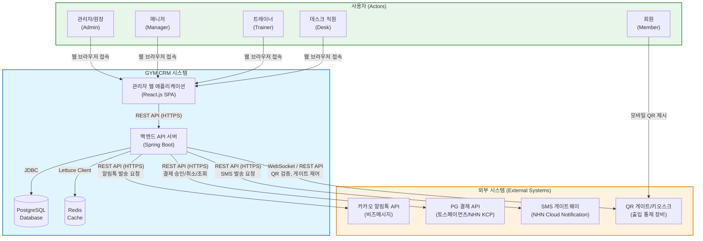

### 2.1 외부 시스템 연동 요약

| 외부 시스템 | 연동 방식 | 데이터 흐름 | 장애 대응 |
|------------|-----------|-------------|-----------|
| **카카오 알림톡** | REST API (HTTPS) | 시스템 -> 카카오 (단방향) | SQS 큐 기반 재시도, SMS 폴백 |
| **PG 결제** | REST API (HTTPS) | 양방향 (승인 요청/결과 콜백) | 트랜잭션 상태 추적, 수동 확인 |
| **SMS 게이트웨이** | REST API (HTTPS) | 시스템 -> SMS (단방향) | SQS 큐 기반 재시도, 최대 3회 |
| **QR 게이트** | WebSocket + REST API | 양방향 (QR 검증/게이트 제어) | 로컬 캐시 폴백, 오프라인 모드 |

---

## 3. 컨테이너 다이어그램

C4 모델의 Container Level로, 시스템 내부의 주요 컨테이너(실행 단위)와 그 관계를 나타낸다.

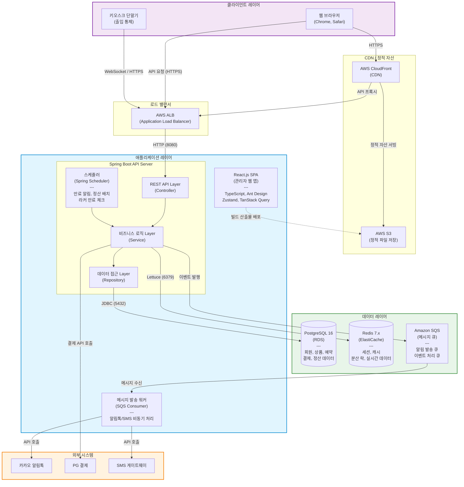

### 3.1 컨테이너 상세 설명

| 컨테이너 | 기술 스택 | 역할 | 스케일링 전략 |
|----------|-----------|------|--------------|
| **React.js SPA** | React 18, TypeScript, Vite | 관리자용 웹 인터페이스 제공 | CloudFront + S3 (정적 배포) |
| **Spring Boot API** | Java 21, Spring Boot 3.2 | 비즈니스 로직 처리, REST API 제공 | EC2 Auto Scaling (CPU 70% 기준) |
| **Spring Scheduler** | Spring Boot 내장 | 배치 작업(만료 알림, 정산, 라커 체크) | 단일 인스턴스 (ShedLock 분산 락) |
| **메시지 발송 워커** | Spring Boot + SQS Listener | 알림톡/SMS 비동기 발송 처리 | SQS 큐 깊이 기반 자동 스케일링 |
| **PostgreSQL** | RDS PostgreSQL 16 | 영속 데이터 저장 (OLTP) | Read Replica (읽기 부하 분산) |
| **Redis** | ElastiCache Redis 7.x | 세션, 캐시, 실시간 예약 현황 | 클러스터 모드 (필요 시) |
| **Amazon SQS** | 완전 관리형 큐 | 메시지 발송 비동기 처리, 이벤트 버퍼링 | 자동 (관리형 서비스) |
| **S3** | 객체 스토리지 | 정적 파일, 회원 사진, 계약서 저장 | 자동 (관리형 서비스) |

### 3.2 데이터 흐름 상세

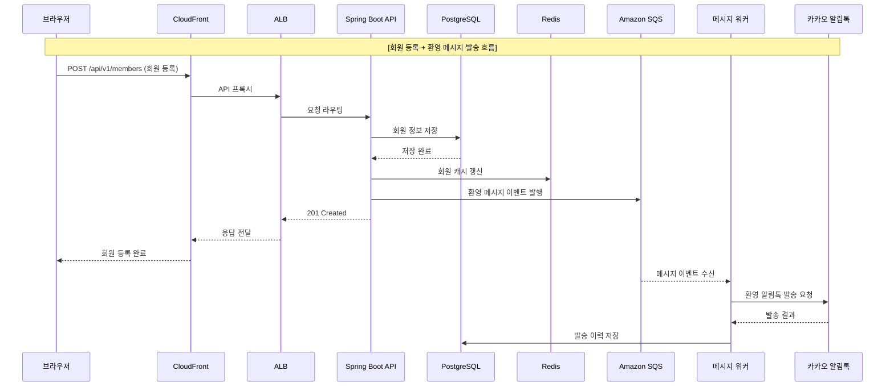

---

## 4. 컴포넌트 설계

### 4.1 Backend 레이어 구조

시스템은 Layered Architecture를 기반으로 하되, 도메인별 모듈 분리를 통해 모듈형 모놀리스(Modular Monolith) 아키텍처를 채택한다.

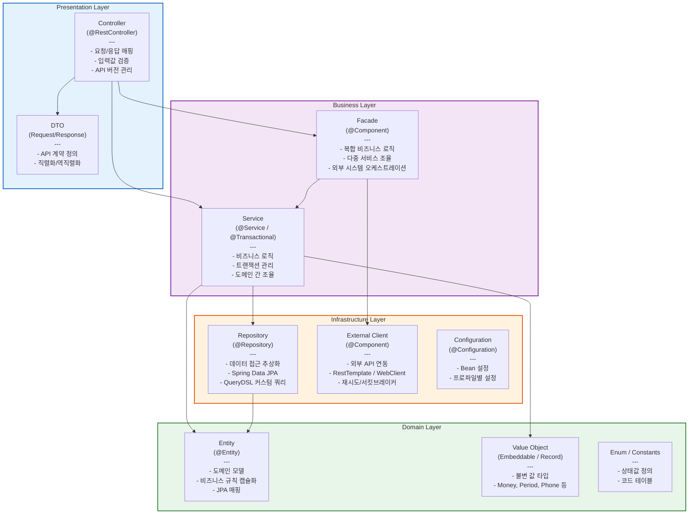

### 4.2 패키지 구조

```
com.gym
├── GymCrmApplication.java                    # Spring Boot 메인 클래스
│
├── member/                                    # 회원 관리 모듈
│   ├── controller/
│   │   └── MemberController.java
│   ├── dto/
│   │   ├── request/
│   │   │   ├── MemberCreateRequest.java
│   │   │   ├── MemberUpdateRequest.java
│   │   │   ├── MembershipTransferRequest.java
│   │   │   ├── MembershipHoldRequest.java
│   │   │   └── MembershipRefundRequest.java
│   │   └── response/
│   │       ├── MemberResponse.java
│   │       ├── MemberDetailResponse.java
│   │       ├── MemberListResponse.java
│   │       └── MembershipResponse.java
│   ├── service/
│   │   ├── MemberService.java
│   │   ├── MembershipService.java
│   │   └── MembershipPolicyService.java
│   ├── repository/
│   │   ├── MemberRepository.java
│   │   ├── MembershipRepository.java
│   │   └── MemberQueryRepository.java        # QueryDSL 커스텀 쿼리
│   ├── entity/
│   │   ├── Member.java
│   │   ├── Membership.java
│   │   ├── MembershipHold.java
│   │   └── MembershipTransferHistory.java
│   └── enums/
│       ├── MemberStatus.java                  # ACTIVE, INACTIVE, WITHDRAWN
│       ├── MembershipType.java                # PERIOD, COUNT
│       └── Gender.java
│
├── product/                                   # 상품 관리 모듈
│   ├── controller/
│   │   └── ProductController.java
│   ├── dto/
│   │   ├── request/
│   │   │   ├── ProductCreateRequest.java
│   │   │   └── ProductUpdateRequest.java
│   │   └── response/
│   │       ├── ProductResponse.java
│   │       └── ProductListResponse.java
│   ├── service/
│   │   └── ProductService.java
│   ├── repository/
│   │   ├── ProductRepository.java
│   │   └── ProductQueryRepository.java
│   ├── entity/
│   │   ├── Product.java
│   │   ├── ProductOption.java
│   │   └── ProductCategory.java
│   └── enums/
│       ├── ProductType.java                   # GYM, GX, PT
│       └── ProductStatus.java                 # ACTIVE, INACTIVE, DISCONTINUED
│
├── reservation/                               # 예약 시스템 모듈
│   ├── controller/
│   │   ├── ReservationController.java
│   │   └── ScheduleController.java
│   ├── dto/
│   │   ├── request/
│   │   │   ├── ReservationCreateRequest.java
│   │   │   ├── ScheduleCreateRequest.java
│   │   │   └── WaitlistRequest.java
│   │   └── response/
│   │       ├── ReservationResponse.java
│   │       ├── ScheduleResponse.java
│   │       ├── AvailableSlotResponse.java
│   │       └── WaitlistResponse.java
│   ├── service/
│   │   ├── ReservationService.java
│   │   ├── ScheduleService.java
│   │   ├── WaitlistService.java
│   │   └── ReservationLockService.java        # Redis 분산 락 기반 동시성 제어
│   ├── repository/
│   │   ├── ReservationRepository.java
│   │   ├── ScheduleRepository.java
│   │   ├── WaitlistRepository.java
│   │   └── ReservationQueryRepository.java
│   ├── entity/
│   │   ├── Reservation.java
│   │   ├── TrainerSchedule.java
│   │   ├── ClassSchedule.java
│   │   └── Waitlist.java
│   └── enums/
│       ├── ReservationStatus.java             # CONFIRMED, CANCELLED, COMPLETED, NO_SHOW
│       └── ScheduleSlotStatus.java            # AVAILABLE, BOOKED, BLOCKED
│
├── access/                                    # 출입 통제 모듈
│   ├── controller/
│   │   ├── AccessController.java
│   │   └── QrController.java
│   ├── dto/
│   │   ├── request/
│   │   │   └── AccessVerifyRequest.java
│   │   └── response/
│   │       ├── AccessLogResponse.java
│   │       ├── QrCodeResponse.java
│   │       └── GateControlResponse.java
│   ├── service/
│   │   ├── AccessService.java
│   │   ├── QrCodeService.java
│   │   └── GateControlService.java
│   ├── repository/
│   │   ├── AccessLogRepository.java
│   │   └── AccessLogQueryRepository.java
│   ├── entity/
│   │   └── AccessLog.java
│   └── enums/
│       ├── AccessType.java                    # QR, BARCODE, MANUAL
│       └── AccessResult.java                  # GRANTED, DENIED, EXPIRED
│
├── locker/                                    # 라커룸 관리 모듈
│   ├── controller/
│   │   └── LockerController.java
│   ├── dto/
│   │   ├── request/
│   │   │   ├── LockerAssignRequest.java
│   │   │   └── LockerKeyLostRequest.java
│   │   └── response/
│   │       ├── LockerResponse.java
│   │       ├── LockerStatusResponse.java
│   │       └── LockerMapResponse.java
│   ├── service/
│   │   └── LockerService.java
│   ├── repository/
│   │   ├── LockerRepository.java
│   │   └── LockerAssignmentRepository.java
│   ├── entity/
│   │   ├── Locker.java
│   │   └── LockerAssignment.java
│   └── enums/
│       ├── LockerStatus.java                  # AVAILABLE, OCCUPIED, MAINTENANCE, BROKEN
│       └── LockerZone.java                    # MALE, FEMALE, PREMIUM
│
├── settlement/                                # 매출/정산 모듈
│   ├── controller/
│   │   ├── SalesController.java
│   │   └── SettlementController.java
│   ├── dto/
│   │   ├── request/
│   │   │   ├── PaymentCreateRequest.java
│   │   │   ├── RefundRequest.java
│   │   │   └── SettlementPeriodRequest.java
│   │   └── response/
│   │       ├── SalesReportResponse.java
│   │       ├── DailySalesResponse.java
│   │       ├── PaymentResponse.java
│   │       ├── TrainerSettlementResponse.java
│   │       └── SettlementSummaryResponse.java
│   ├── service/
│   │   ├── PaymentService.java
│   │   ├── SalesReportService.java
│   │   ├── SettlementService.java
│   │   └── TrainerPayrollService.java
│   ├── repository/
│   │   ├── PaymentRepository.java
│   │   ├── PaymentQueryRepository.java
│   │   └── SettlementRepository.java
│   ├── entity/
│   │   ├── Payment.java
│   │   ├── PaymentDetail.java
│   │   ├── Refund.java
│   │   └── TrainerSettlement.java
│   └── enums/
│       ├── PaymentMethod.java                 # CARD, CASH, TRANSFER, MIXED
│       ├── PaymentStatus.java                 # COMPLETED, PARTIAL_REFUND, FULL_REFUND, CANCELLED
│       └── SettlementStatus.java              # CALCULATED, CONFIRMED, PAID
│
├── crm/                                       # CRM 메시지 모듈
│   ├── controller/
│   │   ├── MessageController.java
│   │   └── TemplateController.java
│   ├── dto/
│   │   ├── request/
│   │   │   ├── MessageSendRequest.java
│   │   │   └── TemplateCreateRequest.java
│   │   └── response/
│   │       ├── MessageLogResponse.java
│   │       └── TemplateResponse.java
│   ├── service/
│   │   ├── CrmMessageService.java
│   │   ├── MessageTemplateService.java
│   │   ├── ExpirationNotifyService.java       # 만료 임박 알림
│   │   ├── BirthdayNotifyService.java         # 생일 축하 알림
│   │   └── EventNotifyService.java            # 이벤트 안내 알림
│   ├── scheduler/
│   │   ├── ExpirationCheckScheduler.java      # 매일 09:00 만료 임박 체크
│   │   ├── BirthdayCheckScheduler.java        # 매일 08:00 생일 회원 체크
│   │   └── LockerExpirationScheduler.java     # 매일 09:00 라커 만료 체크
│   ├── repository/
│   │   ├── MessageLogRepository.java
│   │   └── MessageTemplateRepository.java
│   ├── entity/
│   │   ├── MessageLog.java
│   │   └── MessageTemplate.java
│   └── enums/
│       ├── MessageChannel.java                # ALIMTALK, SMS, LMS, PUSH
│       ├── MessageStatus.java                 # QUEUED, SENT, DELIVERED, FAILED
│       └── MessageType.java                   # EXPIRATION, BIRTHDAY, EVENT, WELCOME
│
├── common/                                    # 공통 모듈
│   ├── config/
│   │   ├── SecurityConfig.java
│   │   ├── JpaConfig.java
│   │   ├── RedisConfig.java
│   │   ├── SqsConfig.java
│   │   ├── WebConfig.java                     # CORS, Interceptor 설정
│   │   ├── SwaggerConfig.java
│   │   └── AsyncConfig.java
│   ├── security/
│   │   ├── jwt/
│   │   │   ├── JwtTokenProvider.java
│   │   │   ├── JwtAuthenticationFilter.java
│   │   │   └── JwtProperties.java
│   │   ├── CustomUserDetailsService.java
│   │   ├── CustomUserDetails.java
│   │   └── SecurityUtils.java
│   ├── auth/
│   │   ├── controller/
│   │   │   └── AuthController.java
│   │   ├── dto/
│   │   │   ├── LoginRequest.java
│   │   │   ├── TokenResponse.java
│   │   │   └── RefreshTokenRequest.java
│   │   ├── service/
│   │   │   └── AuthService.java
│   │   ├── entity/
│   │   │   ├── User.java
│   │   │   └── RefreshToken.java
│   │   └── repository/
│   │       ├── UserRepository.java
│   │       └── RefreshTokenRepository.java
│   ├── exception/
│   │   ├── GlobalExceptionHandler.java
│   │   ├── BusinessException.java
│   │   ├── ErrorCode.java
│   │   ├── ErrorResponse.java
│   │   └── exceptions/
│   │       ├── EntityNotFoundException.java
│   │       ├── DuplicateException.java
│   │       ├── UnauthorizedException.java
│   │       ├── ForbiddenException.java
│   │       ├── InvalidStateException.java
│   │       ├── ExternalApiException.java
│   │       └── ConcurrencyException.java
│   ├── response/
│   │   ├── ApiResponse.java                   # 표준 응답 래퍼
│   │   └── PageResponse.java                  # 페이징 응답 래퍼
│   ├── entity/
│   │   └── BaseEntity.java                    # id, createdAt, updatedAt, createdBy, updatedBy
│   ├── util/
│   │   ├── PhoneNumberUtils.java
│   │   ├── DateTimeUtils.java
│   │   └── MaskingUtils.java                  # 개인정보 마스킹
│   ├── annotation/
│   │   ├── CurrentUser.java                   # 현재 로그인 사용자 주입
│   │   └── RoleRequired.java                  # 역할 기반 접근 제어
│   ├── event/
│   │   ├── DomainEvent.java                   # 도메인 이벤트 기본 클래스
│   │   ├── MemberRegisteredEvent.java
│   │   ├── MembershipExpiringSoonEvent.java
│   │   ├── PaymentCompletedEvent.java
│   │   └── ReservationConfirmedEvent.java
│   └── external/
│       ├── kakao/
│       │   ├── KakaoAlimtalkClient.java
│       │   ├── KakaoAlimtalkRequest.java
│       │   └── KakaoAlimtalkResponse.java
│       ├── pg/
│       │   ├── PgPaymentClient.java           # 인터페이스
│       │   ├── TossPaymentClient.java         # 토스페이먼츠 구현체
│       │   ├── KcpPaymentClient.java          # NHN KCP 구현체
│       │   ├── PaymentApproveRequest.java
│       │   └── PaymentApproveResponse.java
│       └── sms/
│           ├── SmsClient.java
│           ├── SmsRequest.java
│           └── SmsResponse.java
```

### 4.3 모듈별 핵심 클래스/인터페이스 목록

#### 4.3.1 member (회원 관리)

| 클래스/인터페이스 | 유형 | 핵심 책임 |
|-------------------|------|-----------|
| `MemberController` | Controller | 회원 CRUD API 엔드포인트 (/api/v1/members) |
| `MemberService` | Service | 회원 등록, 수정, 조회, 탈퇴 비즈니스 로직 |
| `MembershipService` | Service | 회원권 발급, 양도, 홀딩, 환불 처리 로직 |
| `MembershipPolicyService` | Service | 양도 가능 여부, 홀딩 잔여 일수, 환불 금액 계산 정책 |
| `MemberRepository` | Repository | 회원 엔티티 CRUD, 이름/전화번호 검색 |
| `MemberQueryRepository` | Repository | 복합 조건 검색, 만료 임박 회원 조회 (QueryDSL) |
| `Member` | Entity | 회원 도메인 모델 (이름, 연락처, 생년월일, 상태, 등록일) |
| `Membership` | Entity | 회원권 도메인 모델 (타입, 시작일, 종료일/잔여횟수, 상태) |
| `MembershipHold` | Entity | 홀딩 이력 (시작일, 종료일, 사유) |

#### 4.3.2 product (상품 관리)

| 클래스/인터페이스 | 유형 | 핵심 책임 |
|-------------------|------|-----------|
| `ProductController` | Controller | 상품 CRUD API 엔드포인트 (/api/v1/products) |
| `ProductService` | Service | 상품 등록, 수정, 가격 설정, 판매 상태 관리 |
| `Product` | Entity | 상품 도메인 모델 (이름, 타입, 기간/횟수, 기본가격) |
| `ProductOption` | Entity | 상품 옵션 (예: PT 10회/20회/30회 패키지별 가격) |
| `ProductCategory` | Entity | 상품 카테고리 (GYM, GX, PT) |

#### 4.3.3 reservation (예약 시스템)

| 클래스/인터페이스 | 유형 | 핵심 책임 |
|-------------------|------|-----------|
| `ReservationController` | Controller | 예약 생성/취소/조회 API |
| `ScheduleController` | Controller | 트레이너 스케줄 관리 API |
| `ReservationService` | Service | 예약 생성, 취소, 완료 처리, 잔여 횟수 차감 |
| `ScheduleService` | Service | 트레이너별 시간대 설정, 가용 슬롯 조회 |
| `WaitlistService` | Service | 대기 신청 관리, 취소 발생 시 자동 예약 전환 |
| `ReservationLockService` | Service | Redis Redisson 기반 분산 락으로 동시 예약 방지 |
| `Reservation` | Entity | 예약 도메인 모델 (회원, 트레이너, 일시, 상태) |
| `TrainerSchedule` | Entity | 트레이너 근무 스케줄 (요일, 시작/종료 시간) |
| `Waitlist` | Entity | 대기 목록 (회원, 원하는 일시, 대기 순번) |

#### 4.3.4 access (출입 통제)

| 클래스/인터페이스 | 유형 | 핵심 책임 |
|-------------------|------|-----------|
| `AccessController` | Controller | 출입 기록 조회 API |
| `QrController` | Controller | QR 코드 생성/검증 API (키오스크 연동) |
| `AccessService` | Service | 출입 권한 검증, 출입 로그 기록 |
| `QrCodeService` | Service | 동적 QR 코드 생성 (TOTP 기반, 30초 유효) |
| `GateControlService` | Service | 게이트 장비 오픈/클로즈 명령 전송 |
| `AccessLog` | Entity | 출입 기록 (회원, 일시, 방식, 결과) |

#### 4.3.5 locker (라커룸 관리)

| 클래스/인터페이스 | 유형 | 핵심 책임 |
|-------------------|------|-----------|
| `LockerController` | Controller | 라커 배정/반납/조회 API |
| `LockerService` | Service | 라커 배정, 반납, 키 분실 처리, 만료 체크 |
| `Locker` | Entity | 라커 도메인 모델 (번호, 구역, 상태) |
| `LockerAssignment` | Entity | 라커 배정 이력 (회원, 라커, 시작일, 만료일) |

#### 4.3.6 settlement (매출/정산)

| 클래스/인터페이스 | 유형 | 핵심 책임 |
|-------------------|------|-----------|
| `SalesController` | Controller | 매출 리포트 조회 API |
| `SettlementController` | Controller | 트레이너 정산 API |
| `PaymentService` | Service | 결제 처리, PG 연동, 환불 처리 |
| `SalesReportService` | Service | 일별/월별/기간별 매출 리포트 생성 |
| `TrainerPayrollService` | Service | 트레이너별 수업 횟수 집계, 급여 계산 |
| `Payment` | Entity | 결제 도메인 모델 (금액, 방법, 상태, PG 거래번호) |
| `TrainerSettlement` | Entity | 트레이너 정산 (기간, 수업 횟수, 정산 금액) |

#### 4.3.7 crm (CRM 메시지)

| 클래스/인터페이스 | 유형 | 핵심 책임 |
|-------------------|------|-----------|
| `MessageController` | Controller | 메시지 발송/이력 조회 API |
| `TemplateController` | Controller | 메시지 템플릿 관리 API |
| `CrmMessageService` | Service | 메시지 발송 오케스트레이션 (채널 선택, 큐 발행) |
| `ExpirationNotifyService` | Service | 만료 임박 회원 추출 및 알림 생성 (D-7, D-3, D-1) |
| `BirthdayNotifyService` | Service | 당일 생일 회원 추출 및 축하 메시지 생성 |
| `ExpirationCheckScheduler` | Scheduler | 매일 09:00 만료 임박 회원 배치 체크 |
| `BirthdayCheckScheduler` | Scheduler | 매일 08:00 생일 회원 배치 체크 |
| `MessageLog` | Entity | 메시지 발송 이력 (수신자, 채널, 내용, 상태, 발송일시) |
| `MessageTemplate` | Entity | 메시지 템플릿 (타입, 채널, 제목, 본문, 변수) |

### 4.4 모듈 간 의존 관계

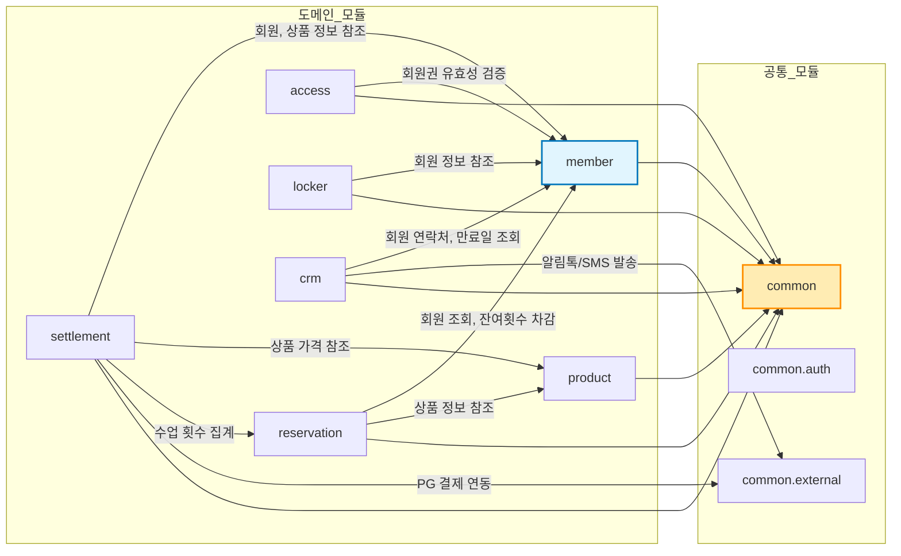

> **의존 규칙**: 모든 도메인 모듈은 `common`에 의존할 수 있으나, `common`은 어떤 도메인 모듈에도 의존하지 않는다. 도메인 모듈 간 의존은 인터페이스를 통해 간접적으로 수행하며, 순환 의존이 발생하지 않도록 한다.

---

## 5. 인프라 아키텍처 (AWS)

### 5.1 네트워크 토폴로지

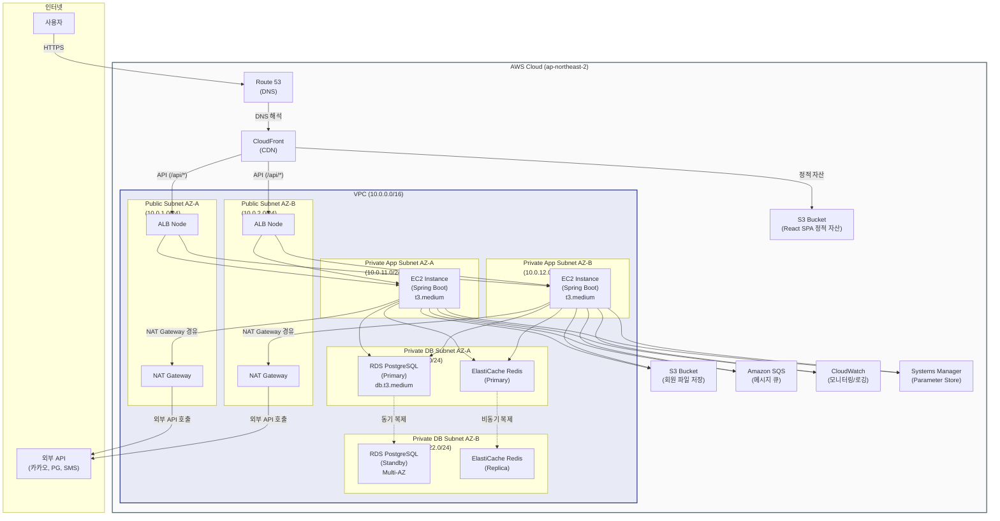

### 5.2 AWS 리소스 구성 상세

| 리소스 | 사양 | 수량 | 월 예상 비용 (USD) | 비고 |
|--------|------|------|-------------------|------|
| **EC2** | t3.medium (2 vCPU, 4GB) | 2대 | ~$60 | Auto Scaling (2~4대) |
| **RDS PostgreSQL** | db.t3.medium, 100GB gp3 | 1 (Multi-AZ) | ~$130 | 자동 백업 7일 보관 |
| **ElastiCache Redis** | cache.t3.small | 1+1 Replica | ~$50 | 세션/캐시 저장 |
| **ALB** | Application Load Balancer | 1 | ~$25 | HTTPS 종단, 헬스 체크 |
| **S3** | Standard | 2 Bucket | ~$5 | 정적 자산 + 파일 저장 |
| **CloudFront** | Standard | 1 Distribution | ~$10 | SPA 배포, API 프록시 |
| **Route 53** | Hosted Zone | 1 | ~$1 | DNS 관리 |
| **NAT Gateway** | - | 2 (AZ별) | ~$65 | 외부 API 통신용 |
| **SQS** | Standard Queue | 2 | ~$1 | 메시지 큐 |
| **CloudWatch** | Logs + Metrics | - | ~$15 | 모니터링, 로그 수집 |
| **Systems Manager** | Parameter Store | - | 무료 (Standard) | 설정값 관리 |
| **합계** | | | **~$362/월** | 초기 운영 기준 |

### 5.3 환경 분리 전략

```mermaid
graph LR
    subgraph DEV["개발 환경 (dev)"]
        DEV_EC2["EC2 t3.small x1"]
        DEV_RDS["RDS db.t3.micro<br/>(Single-AZ)"]
        DEV_REDIS["Redis cache.t3.micro"]
    end

    subgraph STG["스테이징 환경 (staging)"]
        STG_EC2["EC2 t3.medium x1"]
        STG_RDS["RDS db.t3.small<br/>(Single-AZ)"]
        STG_REDIS["Redis cache.t3.small"]
    end

    subgraph PROD["운영 환경 (production)"]
        PROD_EC2["EC2 t3.medium x2<br/>(Auto Scaling)"]
        PROD_RDS["RDS db.t3.medium<br/>(Multi-AZ)"]
        PROD_REDIS["Redis cache.t3.small<br/>(+ Replica)"]
    end

    DEV -->|"develop 브랜치<br/>자동 배포"| STG
    STG -->|"release 브랜치<br/>수동 승인 후 배포"| PROD

    style DEV fill:#e8f5e9,stroke:#2e7d32
    style STG fill:#fff3e0,stroke:#f57c00
    style PROD fill:#ffebee,stroke:#c62828
```

| 구분 | 개발 (dev) | 스테이징 (staging) | 운영 (production) |
|------|-----------|-------------------|------------------|
| **목적** | 개발/디버깅 | QA 테스트, 통합 검증 | 실 서비스 운영 |
| **배포 트리거** | feature 브랜치 Push | develop 브랜치 Merge | release 태그 + 수동 승인 |
| **DB 데이터** | 테스트 시드 데이터 | 운영 마스킹 데이터 | 실 데이터 |
| **외부 연동** | Mock/Sandbox API | Sandbox API | Production API |
| **도메인** | dev.gym-crm.example.com | staging.gym-crm.example.com | gym-crm.example.com |
| **SSL** | ACM (자동 갱신) | ACM (자동 갱신) | ACM (자동 갱신) |
| **모니터링** | 기본 CloudWatch | CloudWatch + 알림 | CloudWatch + Grafana + PagerDuty |
| **월 비용** | ~$50 | ~$100 | ~$362 |

### 5.4 CI/CD 파이프라인

```mermaid
graph LR
    subgraph Source["소스 관리"]
        GIT["GitHub Repository"]
    end

    subgraph CI["CI (GitHub Actions)"]
        BUILD["Build<br/>(Gradle)"]
        TEST["Unit/Integration Test"]
        LINT["코드 품질 검사<br/>(SonarQube)"]
        DOCKER["Docker Image 빌드"]
        ECR["ECR Push"]
    end

    subgraph CD["CD (GitHub Actions)"]
        DEPLOY_DEV["Dev 배포<br/>(자동)"]
        DEPLOY_STG["Staging 배포<br/>(자동)"]
        APPROVAL["수동 승인"]
        DEPLOY_PROD["Production 배포<br/>(Blue-Green)"]
    end

    GIT -->|"Push/PR"| BUILD
    BUILD --> TEST
    TEST --> LINT
    LINT --> DOCKER
    DOCKER --> ECR
    ECR --> DEPLOY_DEV
    DEPLOY_DEV --> DEPLOY_STG
    DEPLOY_STG --> APPROVAL
    APPROVAL -->|"승인"| DEPLOY_PROD

    style Source fill:#e8eaf6,stroke:#283593
    style CI fill:#e1f5fe,stroke:#0277bd
    style CD fill:#e8f5e9,stroke:#2e7d32
```

---

## 6. 보안 아키텍처

### 6.1 인증/인가 흐름

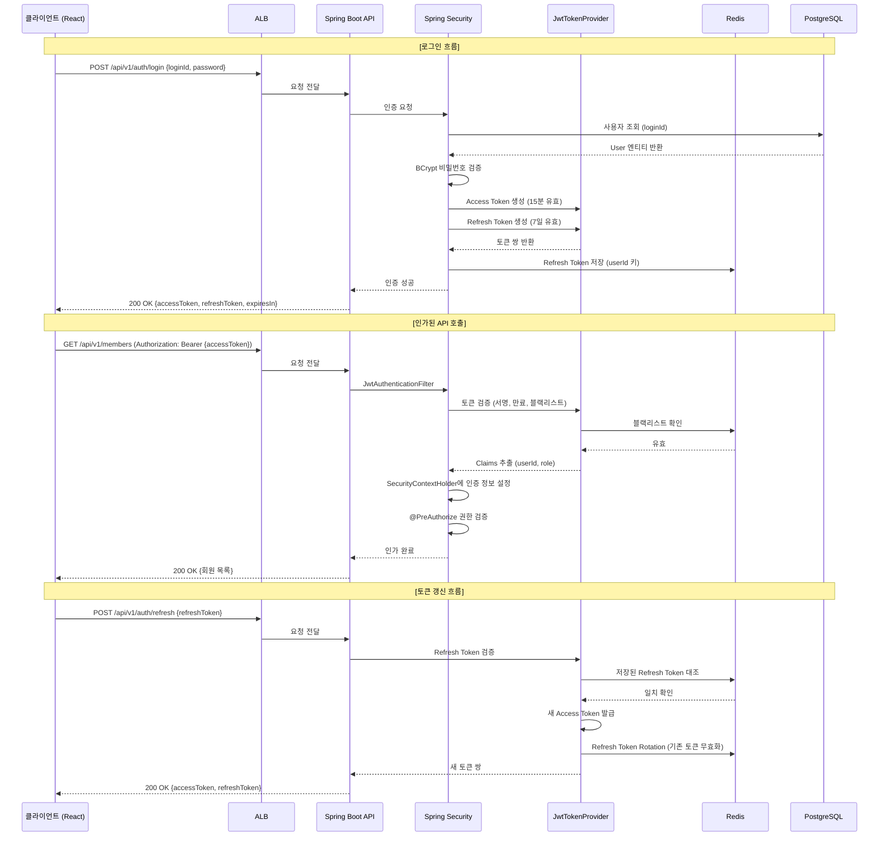

### 6.2 JWT 토큰 설계

| 항목 | Access Token | Refresh Token |
|------|-------------|---------------|
| **유효 기간** | 15분 | 7일 |
| **저장 위치 (클라이언트)** | 메모리 (JavaScript 변수) | HttpOnly Secure Cookie |
| **저장 위치 (서버)** | 저장 안 함 (Stateless) | Redis (userId 키) |
| **Payload** | userId, loginId, role, gymId | userId, tokenId |
| **알고리즘** | HS512 (HMAC-SHA512) | HS512 (HMAC-SHA512) |
| **갱신 전략** | Refresh Token으로 재발급 | Rotation (재발급 시 기존 폐기) |
| **로그아웃** | 블랙리스트 등록 (Redis, TTL=남은유효시간) | Redis에서 삭제 |

### 6.3 역할 기반 접근 제어 (RBAC)

#### 역할 정의

| 역할 | 코드 | 설명 | 부여 대상 |
|------|------|------|-----------|
| **ADMIN** | `ROLE_ADMIN` | 시스템 최고 관리자, 모든 기능 접근 가능 | 헬스장 원장/대표 |
| **MANAGER** | `ROLE_MANAGER` | 운영 관리자, 매출/정산 열람, 직원 관리 | 부원장/매니저 |
| **TRAINER** | `ROLE_TRAINER` | 본인 스케줄/예약 관리, 담당 회원 조회 | PT 트레이너 |
| **DESK** | `ROLE_DESK` | 데스크 업무, 회원 등록, 출입 관리 | 프론트 데스크 직원 |
| **MEMBER** | `ROLE_MEMBER` | 본인 정보 조회 (향후 회원앱 확장 시) | 회원 |

#### 기능별 접근 권한 매트릭스

| 기능 | ADMIN | MANAGER | TRAINER | DESK | MEMBER |
|------|:-----:|:-------:|:-------:|:-----:|:------:|
| 회원 등록/수정 | O | O | X | O | X |
| 회원 삭제 | O | X | X | X | X |
| 회원 조회 | O | O | 담당만 | O | 본인만 |
| 상품 관리 | O | O | X | X | X |
| 예약 관리 (전체) | O | O | X | O | X |
| 본인 스케줄 관리 | O | O | O | X | X |
| 출입 로그 조회 | O | O | X | O | X |
| 라커 관리 | O | O | X | O | X |
| 매출 리포트 | O | O | X | X | X |
| 트레이너 정산 | O | O | 본인만 | X | X |
| CRM 메시지 관리 | O | O | X | X | X |
| 시스템 설정 | O | X | X | X | X |
| 사용자 계정 관리 | O | X | X | X | X |

#### Spring Security 적용 예시

```java
@Configuration
@EnableMethodSecurity(prePostEnabled = true)
public class SecurityConfig {
    // ...
}

// Controller 레벨 적용
@RestController
@RequestMapping("/api/v1/members")
@PreAuthorize("hasAnyRole('ADMIN', 'MANAGER', 'DESK')")
public class MemberController {

    @GetMapping
    public ApiResponse<PageResponse<MemberListResponse>> getMembers(...) { ... }

    @PostMapping
    public ApiResponse<MemberResponse> createMember(...) { ... }

    @DeleteMapping("/{memberId}")
    @PreAuthorize("hasRole('ADMIN')")  // 삭제는 ADMIN만
    public ApiResponse<Void> deleteMember(...) { ... }
}

// Service 레벨 적용 (트레이너 담당 회원만 조회)
@Service
public class ReservationService {

    @PreAuthorize("hasRole('TRAINER') and @securityUtils.isOwnSchedule(#trainerId)")
    public List<ReservationResponse> getTrainerReservations(Long trainerId) { ... }
}
```

### 6.4 보안 계층별 대책

| 계층 | 보안 대책 | 구현 방법 |
|------|-----------|-----------|
| **네트워크** | HTTPS 강제, TLS 1.2+ | ACM 인증서 + ALB HTTPS 리스너, HTTP->HTTPS 리다이렉트 |
| **네트워크** | VPC 격리 | Private Subnet에 EC2/RDS 배치, Security Group으로 포트 제한 |
| **네트워크** | DDoS 방어 | AWS Shield Standard (자동), CloudFront + WAF (SQL Injection, XSS 차단) |
| **API** | CORS 제한 | 허용 도메인만 명시적 등록 (gym-crm.example.com) |
| **API** | Rate Limiting | Spring Cloud Gateway 또는 Bucket4j 기반 IP당 요청 제한 (100 req/min) |
| **API** | 입력값 검증 | Jakarta Validation + Custom Validator, SQL Injection 방지 (JPA 파라미터 바인딩) |
| **API** | CSRF 방지 | SPA 특성상 JWT 사용 시 CSRF 토큰 불필요 (Cookie는 SameSite=Strict) |
| **데이터** | 전송 암호화 | TLS 1.2+ (클라이언트-서버, 서버-DB, 서버-Redis) |
| **데이터** | 저장 암호화 | RDS 스토리지 암호화 (AES-256), S3 서버 사이드 암호화 (SSE-S3) |
| **데이터** | 민감 정보 암호화 | 주민번호, 카드번호 등 AES-256 컬럼 레벨 암호화 |
| **데이터** | 비밀번호 해싱 | BCrypt (Strength 12) |
| **데이터** | 개인정보 마스킹 | 로그/리포트 출력 시 이름(김*호), 전화번호(010-****-5678), 이메일 마스킹 |
| **인프라** | 시크릿 관리 | AWS Systems Manager Parameter Store (SecureString), 코드에 하드코딩 금지 |
| **인프라** | 접근 제어 | IAM Role 기반 EC2 권한, SSH 키 페어 제한, 접속 IP 화이트리스트 |
| **감사** | 감사 로그 | 모든 CUD 작업 감사 로그 기록 (누가, 언제, 무엇을, 어떻게) |
| **감사** | 로그인 이력 | 로그인 성공/실패 기록, 5회 실패 시 계정 잠금 (30분) |

---

## 7. 외부 시스템 연동

### 7.1 카카오 알림톡 API 연동

#### 연동 구조

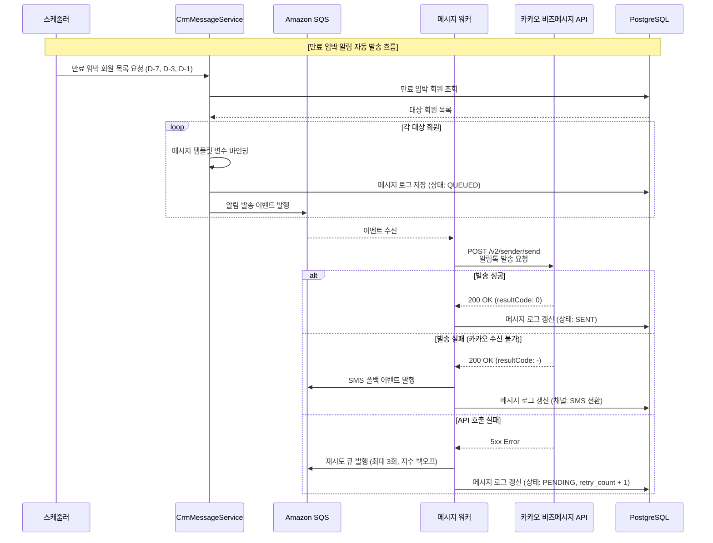

#### 연동 상세

| 항목 | 내용 |
|------|------|
| **API 제공자** | 카카오 비즈메시지 (bizmsg.kakao.com) |
| **인증 방식** | API Key + Sender Key (발신 프로필) |
| **주요 API** | 알림톡 발송 (`POST /v2/sender/send`) |
| **템플릿 관리** | 카카오 비즈니스 채널에서 사전 등록/검수 필요 |
| **변수 바인딩** | `#{회원명}`, `#{만료일}`, `#{상품명}` 등 치환 변수 |
| **발송 제한** | 일 100,000건 (기본), 초당 50건 |
| **폴백 전략** | 알림톡 수신 불가 시 SMS 자동 전환 |
| **비용** | 알림톡 건당 약 8원, SMS 폴백 시 건당 약 20원 |

#### 주요 알림톡 템플릿

| 템플릿 | 발송 시점 | 내용 예시 |
|--------|-----------|-----------|
| **회원권 만료 임박** | D-7, D-3, D-1 | "[GYM] #{회원명}님, 회원권이 #{남은일수}일 후 만료됩니다." |
| **환영 메시지** | 회원 등록 직후 | "[GYM] #{회원명}님, 가입을 환영합니다!" |
| **예약 확인** | 예약 완료 시 | "[GYM] #{회원명}님, #{날짜} #{시간} #{트레이너}님 수업이 예약되었습니다." |
| **예약 취소** | 취소 완료 시 | "[GYM] 예약이 취소되었습니다." |
| **생일 축하** | 생일 당일 08:00 | "[GYM] #{회원명}님, 생일 축하드립니다!" |
| **결제 완료** | 결제 직후 | "[GYM] #{금액}원 결제가 완료되었습니다." |
| **라커 만료 임박** | D-3 | "[GYM] #{회원명}님, 라커(#{번호}) 이용기간이 곧 만료됩니다." |

### 7.2 PG 결제 연동 (토스페이먼츠 / NHN KCP)

#### 연동 구조

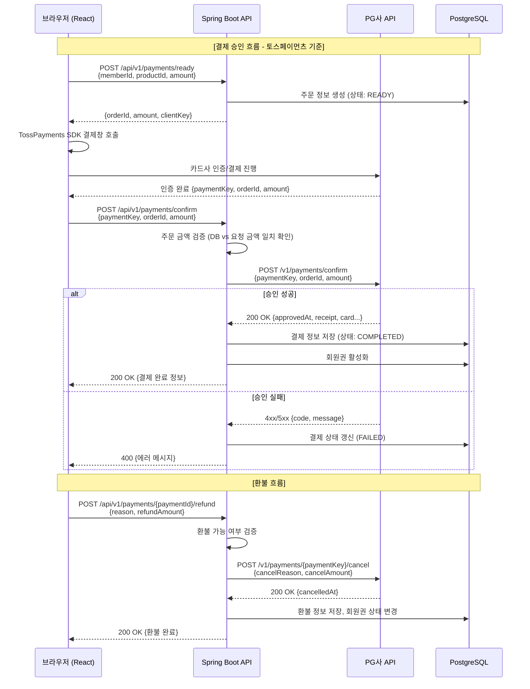

#### PG 연동 설계 (Strategy 패턴)

```java
// PG 결제 클라이언트 인터페이스
public interface PgPaymentClient {
    PaymentApproveResponse approve(PaymentApproveRequest request);
    PaymentCancelResponse cancel(String paymentKey, PaymentCancelRequest request);
    PaymentQueryResponse query(String paymentKey);
}

// 토스페이먼츠 구현체
@Component
@ConditionalOnProperty(name = "payment.pg.provider", havingValue = "toss")
public class TossPaymentClient implements PgPaymentClient {
    // RestClient + 재시도 로직 구현
}

// NHN KCP 구현체
@Component
@ConditionalOnProperty(name = "payment.pg.provider", havingValue = "kcp")
public class KcpPaymentClient implements PgPaymentClient {
    // RestClient + 재시도 로직 구현
}
```

| 항목 | 토스페이먼츠 | NHN KCP |
|------|-------------|---------|
| **인증 방식** | Secret Key (Base64 Basic Auth) | Site Code + Site Key |
| **결제 방식** | 클라이언트 SDK 인증 + 서버 승인 | 클라이언트 SDK 인증 + 서버 승인 |
| **지원 결제수단** | 카드, 가상계좌, 간편결제, 계좌이체 | 카드, 가상계좌, 간편결제, 계좌이체 |
| **수수료** | 카드 2.5~3.3% | 카드 2.5~3.3% |
| **정산 주기** | 영업일 기준 D+2 | 영업일 기준 D+2 |
| **API 문서** | docs.tosspayments.com | docs.kcp.co.kr |

### 7.3 QR코드 생성 및 게이트 연동

#### QR 출입 흐름

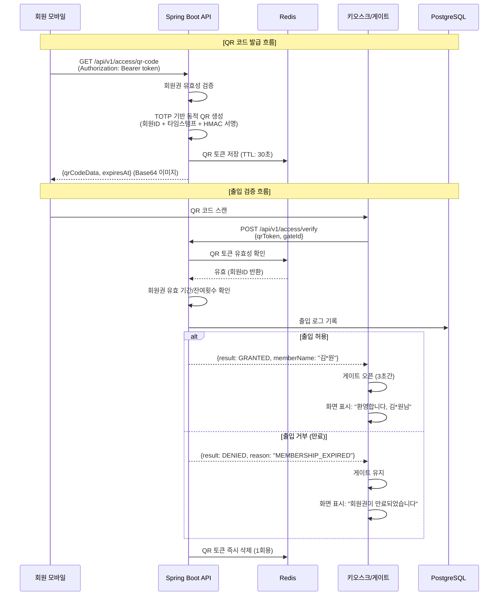

#### QR 코드 설계 상세

| 항목 | 내용 |
|------|------|
| **QR 포맷** | JSON `{"t": "qr_token_value", "e": 1708419600}` -> Base64 인코딩 |
| **토큰 생성** | `HMAC-SHA256(memberId + timestamp + nonce, secretKey)` |
| **유효 기간** | 30초 (TOTP 방식, 재생 공격 방지) |
| **1회 사용** | 검증 후 Redis에서 즉시 삭제 (중복 사용 방지) |
| **오프라인 모드** | 키오스크 로컬에 최근 회원 목록 캐시, API 장애 시 폴백 |
| **게이트 통신** | REST API (키오스크 -> 서버), WebSocket (서버 -> 키오스크 푸시) |
| **바코드 지원** | Code128 바코드 대안 제공 (회원 카드용) |

#### 키오스크/게이트 연동 프로토콜

| 항목 | 내용 |
|------|------|
| **통신 프로토콜** | HTTPS REST API (키오스크 -> 서버), WebSocket (실시간 푸시) |
| **키오스크 인증** | Device API Key (게이트별 고유 키) + IP 화이트리스트 |
| **요청 타임아웃** | 3초 (타임아웃 시 로컬 캐시 폴백) |
| **하트비트** | 30초 간격 WebSocket Ping, 3회 실패 시 장비 오프라인 알림 |
| **게이트 제어** | 오픈 명령 -> 3초 후 자동 닫힘, 비상 시 수동 오픈 |

### 7.4 SMS 발송 게이트웨이

#### 연동 설계

| 항목 | 내용 |
|------|------|
| **서비스** | NHN Cloud Notification Service (구 Toast SMS) |
| **인증** | App Key + Secret Key |
| **API** | `POST /sms/v3.0/appKeys/{appKey}/sender/sms` (단문) |
| | `POST /sms/v3.0/appKeys/{appKey}/sender/mms` (장문) |
| **용도** | 카카오 알림톡 폴백, 인증번호 발송 |
| **발송 제한** | 광고성 SMS: 08:00~21:00만 발송 (정보통신망법 준수) |
| **비용** | SMS 건당 약 20원, LMS 건당 약 50원 |
| **재시도** | 실패 시 3회 재시도 (5초, 30초, 3분 간격) |

#### 메시지 발송 우선순위

```
1차: 카카오 알림톡 (비용 효율적, 리치 메시지)
  ↓ (수신 불가 시)
2차: SMS/LMS (폴백, 모든 휴대폰 수신 가능)
  ↓ (발송 실패 시)
3차: 실패 로그 기록 + 관리자 알림
```

---

## 8. 공통 모듈 설계

### 8.1 예외 처리 전략

#### Global Exception Handler

```java
@RestControllerAdvice
@Slf4j
public class GlobalExceptionHandler {

    /**
     * 비즈니스 예외 처리
     * - 예측 가능한 업무 규칙 위반 (회원권 만료, 잔여횟수 부족 등)
     */
    @ExceptionHandler(BusinessException.class)
    public ResponseEntity<ApiResponse<Void>> handleBusinessException(BusinessException e) {
        log.warn("Business exception: {}", e.getMessage());
        ErrorCode errorCode = e.getErrorCode();
        return ResponseEntity
            .status(errorCode.getHttpStatus())
            .body(ApiResponse.error(errorCode.getCode(), errorCode.getMessage()));
    }

    /**
     * 엔티티 미발견 예외
     */
    @ExceptionHandler(EntityNotFoundException.class)
    public ResponseEntity<ApiResponse<Void>> handleEntityNotFound(EntityNotFoundException e) {
        log.warn("Entity not found: {}", e.getMessage());
        return ResponseEntity
            .status(HttpStatus.NOT_FOUND)
            .body(ApiResponse.error("NOT_FOUND", e.getMessage()));
    }

    /**
     * 입력값 검증 실패
     */
    @ExceptionHandler(MethodArgumentNotValidException.class)
    public ResponseEntity<ApiResponse<List<FieldErrorDetail>>> handleValidation(
            MethodArgumentNotValidException e) {
        List<FieldErrorDetail> fieldErrors = e.getBindingResult()
            .getFieldErrors()
            .stream()
            .map(fe -> new FieldErrorDetail(fe.getField(), fe.getDefaultMessage(),
                                             String.valueOf(fe.getRejectedValue())))
            .toList();

        log.warn("Validation failed: {}", fieldErrors);
        return ResponseEntity
            .status(HttpStatus.BAD_REQUEST)
            .body(ApiResponse.error("VALIDATION_ERROR", "입력값 검증에 실패했습니다.", fieldErrors));
    }

    /**
     * 인증 실패
     */
    @ExceptionHandler(UnauthorizedException.class)
    public ResponseEntity<ApiResponse<Void>> handleUnauthorized(UnauthorizedException e) {
        return ResponseEntity
            .status(HttpStatus.UNAUTHORIZED)
            .body(ApiResponse.error("UNAUTHORIZED", "인증이 필요합니다."));
    }

    /**
     * 권한 부족
     */
    @ExceptionHandler(ForbiddenException.class)
    public ResponseEntity<ApiResponse<Void>> handleForbidden(ForbiddenException e) {
        return ResponseEntity
            .status(HttpStatus.FORBIDDEN)
            .body(ApiResponse.error("FORBIDDEN", "접근 권한이 없습니다."));
    }

    /**
     * 동시성 충돌 (낙관적 락)
     */
    @ExceptionHandler(OptimisticLockingFailureException.class)
    public ResponseEntity<ApiResponse<Void>> handleOptimisticLock(
            OptimisticLockingFailureException e) {
        log.warn("Optimistic lock conflict: {}", e.getMessage());
        return ResponseEntity
            .status(HttpStatus.CONFLICT)
            .body(ApiResponse.error("CONFLICT", "다른 사용자가 동시에 수정했습니다. 다시 시도해주세요."));
    }

    /**
     * 외부 API 호출 실패
     */
    @ExceptionHandler(ExternalApiException.class)
    public ResponseEntity<ApiResponse<Void>> handleExternalApi(ExternalApiException e) {
        log.error("External API error: {} - {}", e.getServiceName(), e.getMessage());
        return ResponseEntity
            .status(HttpStatus.SERVICE_UNAVAILABLE)
            .body(ApiResponse.error("EXTERNAL_SERVICE_ERROR",
                "외부 서비스 연동 중 오류가 발생했습니다. 잠시 후 다시 시도해주세요."));
    }

    /**
     * 예상치 못한 서버 오류
     */
    @ExceptionHandler(Exception.class)
    public ResponseEntity<ApiResponse<Void>> handleUnexpected(Exception e) {
        log.error("Unexpected error occurred", e);
        return ResponseEntity
            .status(HttpStatus.INTERNAL_SERVER_ERROR)
            .body(ApiResponse.error("INTERNAL_ERROR", "서버 내부 오류가 발생했습니다."));
    }
}
```

#### ErrorCode 열거형

```java
@Getter
@RequiredArgsConstructor
public enum ErrorCode {

    // Common
    INVALID_INPUT("C001", "잘못된 입력값입니다.", HttpStatus.BAD_REQUEST),
    ENTITY_NOT_FOUND("C002", "요청한 리소스를 찾을 수 없습니다.", HttpStatus.NOT_FOUND),
    UNAUTHORIZED("C003", "인증이 필요합니다.", HttpStatus.UNAUTHORIZED),
    FORBIDDEN("C004", "접근 권한이 없습니다.", HttpStatus.FORBIDDEN),
    INTERNAL_ERROR("C005", "서버 내부 오류가 발생했습니다.", HttpStatus.INTERNAL_SERVER_ERROR),

    // Member
    MEMBER_NOT_FOUND("M001", "회원을 찾을 수 없습니다.", HttpStatus.NOT_FOUND),
    DUPLICATE_PHONE("M002", "이미 등록된 전화번호입니다.", HttpStatus.CONFLICT),
    MEMBERSHIP_EXPIRED("M003", "회원권이 만료되었습니다.", HttpStatus.BAD_REQUEST),
    MEMBERSHIP_NO_REMAINING("M004", "잔여 횟수가 없습니다.", HttpStatus.BAD_REQUEST),
    HOLD_LIMIT_EXCEEDED("M005", "홀딩 가능 횟수를 초과했습니다.", HttpStatus.BAD_REQUEST),
    TRANSFER_NOT_ALLOWED("M006", "양도가 불가능한 회원권입니다.", HttpStatus.BAD_REQUEST),

    // Reservation
    SCHEDULE_NOT_AVAILABLE("R001", "선택한 시간대는 예약이 불가합니다.", HttpStatus.CONFLICT),
    RESERVATION_ALREADY_EXISTS("R002", "이미 예약이 존재합니다.", HttpStatus.CONFLICT),
    RESERVATION_CANCEL_DEADLINE("R003", "취소 가능 시간이 지났습니다.", HttpStatus.BAD_REQUEST),
    WAITLIST_FULL("R004", "대기 인원이 초과되었습니다.", HttpStatus.BAD_REQUEST),

    // Access
    ACCESS_DENIED_EXPIRED("A001", "회원권이 만료되어 출입이 불가합니다.", HttpStatus.FORBIDDEN),
    QR_INVALID("A002", "유효하지 않은 QR 코드입니다.", HttpStatus.BAD_REQUEST),
    QR_EXPIRED("A003", "QR 코드가 만료되었습니다.", HttpStatus.BAD_REQUEST),

    // Locker
    LOCKER_NOT_AVAILABLE("L001", "사용 가능한 라커가 없습니다.", HttpStatus.CONFLICT),
    LOCKER_ALREADY_ASSIGNED("L002", "이미 라커가 배정되어 있습니다.", HttpStatus.CONFLICT),

    // Payment
    PAYMENT_AMOUNT_MISMATCH("P001", "결제 금액이 일치하지 않습니다.", HttpStatus.BAD_REQUEST),
    PAYMENT_ALREADY_COMPLETED("P002", "이미 완료된 결제입니다.", HttpStatus.CONFLICT),
    REFUND_AMOUNT_EXCEEDED("P003", "환불 금액이 결제 금액을 초과합니다.", HttpStatus.BAD_REQUEST),
    PG_APPROVE_FAILED("P004", "PG 결제 승인에 실패했습니다.", HttpStatus.BAD_GATEWAY),

    // CRM
    MESSAGE_TEMPLATE_NOT_FOUND("CM001", "메시지 템플릿을 찾을 수 없습니다.", HttpStatus.NOT_FOUND),
    MESSAGE_SEND_FAILED("CM002", "메시지 발송에 실패했습니다.", HttpStatus.SERVICE_UNAVAILABLE);

    private final String code;
    private final String message;
    private final HttpStatus httpStatus;
}
```

#### 예외 클래스 계층

```
RuntimeException
  └── BusinessException (추상 클래스, ErrorCode 포함)
        ├── EntityNotFoundException
        ├── DuplicateException
        ├── UnauthorizedException
        ├── ForbiddenException
        ├── InvalidStateException      // 비즈니스 규칙 위반
        ├── ExternalApiException        // 외부 API 호출 실패
        └── ConcurrencyException        // 동시성 충돌
```

### 8.2 로깅 전략

#### 로깅 프레임워크 구성

| 항목 | 설정 |
|------|------|
| **API** | SLF4J 2.x |
| **구현체** | Logback 1.4.x (Spring Boot 기본 내장) |
| **출력 대상** | stdout (콘솔) -> CloudWatch Logs Agent 수집 |
| **로그 파일** | 운영 환경은 stdout만 (12-Factor App), 개발 환경은 파일 병행 |
| **보관 기간** | CloudWatch: 30일, S3 아카이브: 1년 |

#### 로그 레벨 정책

| 레벨 | 사용 기준 | 예시 |
|------|-----------|------|
| **ERROR** | 즉시 조치 필요한 오류, 시스템 비정상 | DB 연결 실패, PG 결제 승인 오류, 미처리 예외 |
| **WARN** | 주의가 필요하나 서비스 중단은 아닌 상황 | 비즈니스 예외, 외부 API 재시도, 느린 쿼리 |
| **INFO** | 주요 비즈니스 이벤트 기록 | 회원 등록, 결제 완료, 출입 기록, 스케줄러 실행 |
| **DEBUG** | 개발/디버깅용 상세 정보 | API 요청/응답 상세, SQL 쿼리 파라미터 |
| **TRACE** | 프레임워크 레벨 추적 (운영 환경 비활성화) | Spring Security 필터 체인 추적 |

#### 환경별 로그 레벨

| 패키지 | dev | staging | production |
|--------|-----|---------|------------|
| `com.gym` | DEBUG | INFO | INFO |
| `com.gym.common.security` | DEBUG | INFO | WARN |
| `org.springframework` | INFO | WARN | WARN |
| `org.hibernate.SQL` | DEBUG | WARN | WARN |
| `org.hibernate.type.descriptor.sql` | TRACE | WARN | ERROR |

#### 로그 포맷

```
로그 패턴:
%d{yyyy-MM-dd HH:mm:ss.SSS} [%thread] [%X{traceId}] [%X{userId}] %-5level %logger{36} - %msg%n
```

| 필드 | 설명 |
|------|------|
| `traceId` | 요청별 고유 추적 ID (UUID, MDC에 저장) |
| `userId` | 인증된 사용자 ID (MDC에 저장) |
| `thread` | 처리 스레드명 |
| `level` | 로그 레벨 |
| `logger` | 로거 이름 (클래스명) |
| `msg` | 로그 메시지 |

#### API 요청/응답 로깅 (Interceptor)

```java
@Component
@Slf4j
public class ApiLoggingInterceptor implements HandlerInterceptor {

    @Override
    public boolean preHandle(HttpServletRequest request, HttpServletResponse response,
                             Object handler) {
        String traceId = UUID.randomUUID().toString().substring(0, 8);
        MDC.put("traceId", traceId);

        request.setAttribute("startTime", System.currentTimeMillis());

        log.info("[API Request] {} {} | IP={} | User-Agent={}",
            request.getMethod(),
            request.getRequestURI(),
            request.getRemoteAddr(),
            request.getHeader("User-Agent"));

        return true;
    }

    @Override
    public void afterCompletion(HttpServletRequest request, HttpServletResponse response,
                                Object handler, Exception ex) {
        long duration = System.currentTimeMillis() - (long) request.getAttribute("startTime");

        log.info("[API Response] {} {} | Status={} | Duration={}ms",
            request.getMethod(),
            request.getRequestURI(),
            response.getStatus(),
            duration);

        if (duration > 3000) {
            log.warn("[Slow API] {} {} took {}ms",
                request.getMethod(), request.getRequestURI(), duration);
        }

        MDC.clear();
    }
}
```

### 8.3 API 응답 표준 포맷

#### 성공 응답 구조

```java
@Getter
@NoArgsConstructor(access = AccessLevel.PRIVATE)
public class ApiResponse<T> {

    private boolean success;
    private T data;
    private ErrorDetail error;
    private String traceId;
    private LocalDateTime timestamp;

    // 성공 응답 (데이터 포함)
    public static <T> ApiResponse<T> ok(T data) {
        ApiResponse<T> response = new ApiResponse<>();
        response.success = true;
        response.data = data;
        response.traceId = MDC.get("traceId");
        response.timestamp = LocalDateTime.now();
        return response;
    }

    // 성공 응답 (데이터 없음)
    public static ApiResponse<Void> ok() {
        return ok(null);
    }

    // 에러 응답
    public static <T> ApiResponse<T> error(String code, String message) {
        ApiResponse<T> response = new ApiResponse<>();
        response.success = false;
        response.error = new ErrorDetail(code, message, null);
        response.traceId = MDC.get("traceId");
        response.timestamp = LocalDateTime.now();
        return response;
    }

    // 에러 응답 (상세 정보 포함)
    public static <T> ApiResponse<T> error(String code, String message, T details) {
        ApiResponse<T> response = new ApiResponse<>();
        response.success = false;
        response.error = new ErrorDetail(code, message, details);
        response.traceId = MDC.get("traceId");
        response.timestamp = LocalDateTime.now();
        return response;
    }

    @Getter
    @AllArgsConstructor
    private static class ErrorDetail {
        private String code;
        private String message;
        private Object details;
    }
}
```

#### 응답 예시

**성공 응답 (단건 조회)**

```json
{
  "success": true,
  "data": {
    "memberId": 1024,
    "name": "김철수",
    "phone": "010-1234-5678",
    "status": "ACTIVE",
    "membership": {
      "type": "PERIOD",
      "productName": "헬스 3개월 이용권",
      "startDate": "2026-01-15",
      "endDate": "2026-04-14",
      "remainingDays": 53
    }
  },
  "error": null,
  "traceId": "a1b2c3d4",
  "timestamp": "2026-02-20T14:30:00"
}
```

**성공 응답 (페이징 목록)**

```json
{
  "success": true,
  "data": {
    "content": [
      { "memberId": 1024, "name": "김철수", "status": "ACTIVE" },
      { "memberId": 1025, "name": "이영희", "status": "ACTIVE" }
    ],
    "page": 0,
    "size": 20,
    "totalElements": 847,
    "totalPages": 43,
    "first": true,
    "last": false
  },
  "error": null,
  "traceId": "e5f6g7h8",
  "timestamp": "2026-02-20T14:30:00"
}
```

**에러 응답**

```json
{
  "success": false,
  "data": null,
  "error": {
    "code": "M003",
    "message": "회원권이 만료되었습니다.",
    "details": null
  },
  "traceId": "i9j0k1l2",
  "timestamp": "2026-02-20T14:30:00"
}
```

**검증 에러 응답**

```json
{
  "success": false,
  "data": null,
  "error": {
    "code": "VALIDATION_ERROR",
    "message": "입력값 검증에 실패했습니다.",
    "details": [
      { "field": "name", "message": "이름은 필수입니다.", "rejectedValue": "" },
      { "field": "phone", "message": "올바른 전화번호 형식이 아닙니다.", "rejectedValue": "12345" }
    ]
  },
  "traceId": "m3n4o5p6",
  "timestamp": "2026-02-20T14:30:00"
}
```

### 8.4 페이징/정렬 공통 처리

#### 페이징 응답 래퍼

```java
@Getter
@NoArgsConstructor(access = AccessLevel.PRIVATE)
public class PageResponse<T> {

    private List<T> content;
    private int page;
    private int size;
    private long totalElements;
    private int totalPages;
    private boolean first;
    private boolean last;

    public static <T> PageResponse<T> from(Page<T> page) {
        PageResponse<T> response = new PageResponse<>();
        response.content = page.getContent();
        response.page = page.getNumber();
        response.size = page.getSize();
        response.totalElements = page.getTotalElements();
        response.totalPages = page.getTotalPages();
        response.first = page.isFirst();
        response.last = page.isLast();
        return response;
    }

    // Entity -> DTO 변환과 함께 페이징 래핑
    public static <E, D> PageResponse<D> from(Page<E> page, Function<E, D> converter) {
        PageResponse<D> response = new PageResponse<>();
        response.content = page.getContent().stream().map(converter).toList();
        response.page = page.getNumber();
        response.size = page.getSize();
        response.totalElements = page.getTotalElements();
        response.totalPages = page.getTotalPages();
        response.first = page.isFirst();
        response.last = page.isLast();
        return response;
    }
}
```

#### 페이징/정렬 요청 처리

```java
// Controller에서의 사용
@GetMapping
public ApiResponse<PageResponse<MemberListResponse>> getMembers(
        @RequestParam(required = false) String keyword,
        @RequestParam(required = false) MemberStatus status,
        @RequestParam(defaultValue = "0") int page,
        @RequestParam(defaultValue = "20") int size,
        @RequestParam(defaultValue = "createdAt,desc") String[] sort) {

    Pageable pageable = PageableUtils.of(page, size, sort);
    Page<Member> members = memberService.searchMembers(keyword, status, pageable);

    return ApiResponse.ok(PageResponse.from(members, MemberListResponse::from));
}
```

```java
// 페이징 유틸리티
public class PageableUtils {

    private static final int MAX_PAGE_SIZE = 100;
    private static final int DEFAULT_PAGE_SIZE = 20;

    public static Pageable of(int page, int size, String[] sort) {
        int validSize = Math.min(Math.max(size, 1), MAX_PAGE_SIZE);
        Sort sortObj = parseSort(sort);
        return PageRequest.of(page, validSize, sortObj);
    }

    private static Sort parseSort(String[] sort) {
        if (sort == null || sort.length == 0) {
            return Sort.by(Sort.Direction.DESC, "createdAt");
        }

        List<Sort.Order> orders = new ArrayList<>();
        for (String s : sort) {
            String[] parts = s.split(",");
            String property = parts[0].trim();
            Sort.Direction direction = parts.length > 1 &&
                parts[1].trim().equalsIgnoreCase("asc")
                ? Sort.Direction.ASC : Sort.Direction.DESC;
            orders.add(new Sort.Order(direction, property));
        }
        return Sort.by(orders);
    }
}
```

#### API 페이징 규약

| 파라미터 | 타입 | 기본값 | 설명 |
|----------|------|--------|------|
| `page` | int | 0 | 페이지 번호 (0-based) |
| `size` | int | 20 | 페이지 크기 (최대 100) |
| `sort` | String[] | createdAt,desc | 정렬 기준 (필드명,방향) |

#### 허용 정렬 필드 (도메인별)

| 도메인 | 허용 필드 |
|--------|-----------|
| **회원** | `name`, `phone`, `status`, `createdAt`, `membershipEndDate` |
| **상품** | `name`, `type`, `price`, `status`, `createdAt` |
| **예약** | `reservationDate`, `status`, `trainerName`, `createdAt` |
| **출입 로그** | `accessTime`, `memberName`, `result` |
| **라커** | `lockerNumber`, `zone`, `status`, `assignmentEndDate` |
| **결제** | `paymentDate`, `amount`, `method`, `status` |
| **메시지 로그** | `sentAt`, `channel`, `status`, `memberName` |

> **보안 주의사항**: 허용되지 않은 필드로 정렬 요청 시 무시하고 기본 정렬(`createdAt DESC`)을 적용한다. SQL Injection 방지를 위해 허용 필드 화이트리스트를 반드시 검증한다.

---

## 부록

### A. 기술 용어 정리

| 용어 | 설명 |
|------|------|
| **SPA** | Single Page Application. 하나의 HTML 페이지에서 JavaScript로 화면을 동적 렌더링하는 방식 |
| **JWT** | JSON Web Token. 사용자 인증 정보를 JSON 형태로 토큰화한 표준 |
| **RBAC** | Role-Based Access Control. 역할 기반 접근 제어 |
| **TOTP** | Time-based One-Time Password. 시간 기반 일회용 비밀번호 |
| **MDC** | Mapped Diagnostic Context. 스레드 로컬 기반 로깅 컨텍스트 |
| **MTTR** | Mean Time To Repair. 평균 복구 시간 |
| **PG** | Payment Gateway. 전자결제 대행사 |
| **GX** | Group Exercise. 그룹 운동 프로그램 |
| **PT** | Personal Training. 1:1 개인 트레이닝 |

### B. 참고 문서

| 문서 | 설명 |
|------|------|
| 01_요구사항_정의서 | 기능/비기능 요구사항 상세 정의 |
| 03_데이터베이스_설계서 | ERD, 테이블 정의서, 인덱스 전략 |
| 04_API_설계서 | REST API 명세 (OpenAPI 3.0) |
| 05_화면_설계서 | UI/UX 와이어프레임, 화면 흐름도 |

---

**문서 이력**

| 버전 | 날짜 | 작성자 | 변경 내용 |
|------|------|--------|-----------|
| v1.0 | 2026-02-20 | - | 최초 작성 |
