# 데이터베이스 설계서

| 항목 | 내용 |
|------|------|
| 프로젝트명 | 중소형 헬스장 회원관리 시스템 (GymCRM) |
| 문서 버전 | v1.0 |
| 작성일 | 2026-02-20 |
| DBMS | PostgreSQL 15+ |
| 기술 스택 | AWS RDS (PostgreSQL), Java Spring Boot 3.0, React.js + TypeScript |

---

## 1. 설계 원칙

### 1.1 정규화 수준

- 기본적으로 **제3정규형(3NF)** 을 적용한다.
- 조회 성능이 중요한 리포트/정산 관련 테이블은 선택적으로 **반정규화(Denormalization)** 를 허용한다.
- 반정규화 적용 시 반드시 사유를 문서에 기록한다.

### 1.2 네이밍 컨벤션

| 대상 | 규칙 | 예시 |
|------|------|------|
| 테이블명 | snake_case, 복수형 | `members`, `payments` |
| 컬럼명 | snake_case | `first_name`, `created_at` |
| PK | `{테이블_단수형}_id` | `member_id`, `payment_id` |
| FK | `{참조테이블_단수형}_id` | `member_id`, `product_id` |
| 인덱스 | `idx_{테이블}_{컬럼}` | `idx_members_phone` |
| 유니크 제약 | `uk_{테이블}_{컬럼}` | `uk_members_email` |
| 체크 제약 | `ck_{테이블}_{컬럼}` | `ck_payments_amount` |
| ENUM/타입 | 문자열 상수, UPPER_CASE | `'ACTIVE'`, `'EXPIRED'` |
| boolean 컬럼 | `is_` 접두사 | `is_deleted`, `is_active` |

### 1.3 Soft Delete 정책

모든 주요 엔티티 테이블에 Soft Delete를 적용한다.

```
is_deleted    BOOLEAN      NOT NULL DEFAULT FALSE
deleted_at    TIMESTAMPTZ  NULL
deleted_by    BIGINT       NULL
```

- 물리 삭제는 원칙적으로 금지하며, `is_deleted = TRUE`로 논리 삭제 처리한다.
- 삭제된 데이터의 물리 삭제는 데이터 보존 정책(기본 3년)에 따라 배치 작업으로 수행한다.
- 조회 쿼리에는 `WHERE is_deleted = FALSE` 조건을 기본 적용한다. (JPA `@Where` 또는 `@SQLRestriction` 활용)

### 1.4 감사(Audit) 컬럼 규칙

모든 테이블에 아래 감사 컬럼을 필수로 포함한다.

```
created_at    TIMESTAMPTZ  NOT NULL DEFAULT CURRENT_TIMESTAMP
created_by    BIGINT       NOT NULL
updated_at    TIMESTAMPTZ  NOT NULL DEFAULT CURRENT_TIMESTAMP
updated_by    BIGINT       NOT NULL
```

- `created_at`, `updated_at`은 애플리케이션 레벨에서 JPA Auditing(`@CreatedDate`, `@LastModifiedDate`)으로 자동 관리한다.
- `created_by`, `updated_by`는 Spring Security의 `AuditorAware` 구현체를 통해 자동 주입한다.
- 모든 시간은 **UTC** 기준으로 저장하며, 프론트엔드에서 `Asia/Seoul` 타임존으로 변환하여 표시한다.

### 1.5 공통 규칙

- UUID가 아닌 **BIGSERIAL(Auto Increment)** 을 PK로 사용한다. (성능 및 인덱스 효율성 우선)
- 금액 필드는 `NUMERIC(12,0)` 타입을 사용한다. (원화 기준, 소수점 없음)
- 상태값은 VARCHAR 문자열 상수를 사용하고, PostgreSQL ENUM 타입 대신 CHECK 제약 조건으로 관리한다. (운영 중 상태값 추가/변경 용이)
- 전화번호는 하이픈 없이 숫자만 저장한다. (`01012345678`)

---

## 2. 도메인 모델

### 2.1 핵심 엔티티 식별 및 관계 분석

| 도메인 | 엔티티 | 설명 |
|--------|--------|------|
| 시스템 | centers | 센터(지점) 정보 |
| 시스템 | users | 관리자/트레이너 등 시스템 사용자 |
| 시스템 | roles | 역할 (SUPER_ADMIN, CENTER_ADMIN, TRAINER, STAFF) |
| 시스템 | user_roles | 사용자-역할 매핑 (M:N) |
| 회원 | members | 회원 기본정보 |
| 회원 | member_memberships | 회원이 보유한 이용권(회원권) |
| 회원 | membership_holds | 회원권 홀딩(일시정지) 이력 |
| 회원 | membership_transfers | 회원권 양도 이력 |
| 회원 | membership_refunds | 회원권 환불 이력 |
| 상품 | product_categories | 상품 카테고리 (헬스, GX, PT) |
| 상품 | products | 개별 상품 (이용권/수업 상품) |
| 예약 | reservations | 수업 예약 |
| 예약 | trainer_schedules | 트레이너 시간표/슬롯 |
| 예약 | waiting_list | 예약 대기 목록 |
| 출입 | access_logs | 출입 기록 |
| 출입 | qr_codes | 회원별 QR/바코드 |
| 라커 | lockers | 라커 물리 정보 |
| 라커 | locker_assignments | 라커 배정 이력 |
| 매출 | payments | 결제 마스터 |
| 매출 | payment_details | 결제 상세 항목 |
| 매출 | settlements | 정산 마스터 (트레이너 급여) |
| 매출 | settlement_details | 정산 상세 항목 |
| CRM | message_templates | 메시지 템플릿 |
| CRM | message_logs | 메시지 발송 이력 |

### 2.2 ER 다이어그램

```mermaid
erDiagram
    centers ||--o{ users : "소속"
    centers ||--o{ members : "등록"
    centers ||--o{ products : "보유"
    centers ||--o{ lockers : "보유"
    centers ||--o{ message_templates : "보유"
    centers ||--o{ settlements : "정산"

    users ||--o{ user_roles : "부여"
    roles ||--o{ user_roles : "매핑"
    users ||--o{ trainer_schedules : "스케줄"
    users ||--o{ settlement_details : "정산대상"

    members ||--o{ member_memberships : "보유"
    members ||--o{ reservations : "예약"
    members ||--o{ access_logs : "출입"
    members ||--o{ qr_codes : "발급"
    members ||--o{ locker_assignments : "배정"
    members ||--o{ payments : "결제"
    members ||--o{ message_logs : "수신"

    member_memberships ||--o{ membership_holds : "홀딩"
    member_memberships ||--o{ membership_transfers : "양도"
    member_memberships ||--o{ membership_refunds : "환불"
    member_memberships ||--o{ reservations : "사용"

    product_categories ||--o{ products : "분류"
    products ||--o{ member_memberships : "기반"
    products ||--o{ payment_details : "상품"

    trainer_schedules ||--o{ reservations : "슬롯"
    reservations ||--o{ waiting_list : "대기"

    lockers ||--o{ locker_assignments : "배정"

    payments ||--o{ payment_details : "상세"
    settlements ||--o{ settlement_details : "상세"

    message_templates ||--o{ message_logs : "사용"

    centers {
        bigint center_id PK
        varchar center_name
        varchar address
        varchar phone
    }

    users {
        bigint user_id PK
        bigint center_id FK
        varchar login_id
        varchar user_name
        varchar status
    }

    roles {
        bigint role_id PK
        varchar role_name
    }

    user_roles {
        bigint user_role_id PK
        bigint user_id FK
        bigint role_id FK
    }

    members {
        bigint member_id PK
        bigint center_id FK
        varchar member_name
        varchar phone
        varchar status
    }

    member_memberships {
        bigint membership_id PK
        bigint member_id FK
        bigint product_id FK
        varchar membership_type
        varchar status
        date start_date
        date end_date
        int remaining_count
    }

    membership_holds {
        bigint hold_id PK
        bigint membership_id FK
        date hold_start_date
        date hold_end_date
        varchar status
    }

    membership_transfers {
        bigint transfer_id PK
        bigint membership_id FK
        bigint from_member_id FK
        bigint to_member_id FK
    }

    membership_refunds {
        bigint refund_id PK
        bigint membership_id FK
        numeric refund_amount
        varchar status
    }

    product_categories {
        bigint category_id PK
        bigint center_id FK
        varchar category_name
        varchar category_code
    }

    products {
        bigint product_id PK
        bigint category_id FK
        bigint center_id FK
        varchar product_name
        numeric price
        varchar product_type
    }

    trainer_schedules {
        bigint schedule_id PK
        bigint user_id FK
        bigint center_id FK
        date schedule_date
        time start_time
        time end_time
        int max_capacity
    }

    reservations {
        bigint reservation_id PK
        bigint member_id FK
        bigint membership_id FK
        bigint schedule_id FK
        varchar status
    }

    waiting_list {
        bigint waiting_id PK
        bigint reservation_id FK
        bigint member_id FK
        bigint schedule_id FK
        int queue_order
    }

    access_logs {
        bigint access_log_id PK
        bigint member_id FK
        bigint center_id FK
        timestamptz access_time
        varchar access_type
    }

    qr_codes {
        bigint qr_code_id PK
        bigint member_id FK
        varchar code_value
        varchar status
    }

    lockers {
        bigint locker_id PK
        bigint center_id FK
        varchar locker_number
        varchar status
    }

    locker_assignments {
        bigint assignment_id PK
        bigint locker_id FK
        bigint member_id FK
        date start_date
        date end_date
        varchar status
    }

    payments {
        bigint payment_id PK
        bigint member_id FK
        bigint center_id FK
        numeric total_amount
        varchar payment_method
        varchar status
    }

    payment_details {
        bigint payment_detail_id PK
        bigint payment_id FK
        bigint product_id FK
        numeric amount
        int quantity
    }

    settlements {
        bigint settlement_id PK
        bigint center_id FK
        varchar settlement_month
        numeric total_amount
        varchar status
    }

    settlement_details {
        bigint settlement_detail_id PK
        bigint settlement_id FK
        bigint user_id FK
        int lesson_count
        numeric amount
    }

    message_templates {
        bigint template_id PK
        bigint center_id FK
        varchar template_name
        varchar message_type
        text content
    }

    message_logs {
        bigint message_log_id PK
        bigint template_id FK
        bigint member_id FK
        varchar send_status
        timestamptz sent_at
    }
```



---

## 3. 테이블 정의서

### 3.1 시스템 도메인

#### 3.1.1 centers (센터/지점)

| 컬럼명 | 데이터타입 | NOT NULL | 기본값 | 설명 |
|--------|-----------|----------|--------|------|
| center_id | BIGSERIAL | O | Auto | PK |
| center_name | VARCHAR(100) | O | - | 센터명 |
| business_number | VARCHAR(20) | X | - | 사업자등록번호 |
| representative_name | VARCHAR(50) | X | - | 대표자명 |
| phone | VARCHAR(20) | X | - | 대표 전화번호 |
| address | VARCHAR(300) | X | - | 주소 |
| address_detail | VARCHAR(200) | X | - | 상세주소 |
| zipcode | VARCHAR(10) | X | - | 우편번호 |
| operating_hours_start | TIME | X | '06:00' | 운영 시작 시간 |
| operating_hours_end | TIME | X | '23:00' | 운영 종료 시간 |
| is_active | BOOLEAN | O | TRUE | 운영 여부 |
| is_deleted | BOOLEAN | O | FALSE | 삭제 여부 |
| deleted_at | TIMESTAMPTZ | X | - | 삭제 일시 |
| deleted_by | BIGINT | X | - | 삭제자 |
| created_at | TIMESTAMPTZ | O | CURRENT_TIMESTAMP | 생성 일시 |
| created_by | BIGINT | O | - | 생성자 |
| updated_at | TIMESTAMPTZ | O | CURRENT_TIMESTAMP | 수정 일시 |
| updated_by | BIGINT | O | - | 수정자 |

**제약 조건:**
- PK: `center_id`
- UK: `uk_centers_business_number` (`business_number`) - NULL 허용, 값이 있을 때 유니크

---

#### 3.1.2 users (사용자/직원)

| 컬럼명 | 데이터타입 | NOT NULL | 기본값 | 설명 |
|--------|-----------|----------|--------|------|
| user_id | BIGSERIAL | O | Auto | PK |
| center_id | BIGINT | O | - | FK: centers |
| login_id | VARCHAR(50) | O | - | 로그인 ID |
| password_hash | VARCHAR(255) | O | - | 비밀번호 (BCrypt 해시) |
| user_name | VARCHAR(50) | O | - | 이름 |
| phone | VARCHAR(20) | X | - | 전화번호 |
| email | VARCHAR(100) | X | - | 이메일 |
| profile_image_url | VARCHAR(500) | X | - | 프로필 이미지 URL |
| status | VARCHAR(20) | O | 'ACTIVE' | 상태 (ACTIVE, INACTIVE, SUSPENDED) |
| last_login_at | TIMESTAMPTZ | X | - | 최근 로그인 일시 |
| is_deleted | BOOLEAN | O | FALSE | 삭제 여부 |
| deleted_at | TIMESTAMPTZ | X | - | 삭제 일시 |
| deleted_by | BIGINT | X | - | 삭제자 |
| created_at | TIMESTAMPTZ | O | CURRENT_TIMESTAMP | 생성 일시 |
| created_by | BIGINT | O | - | 생성자 |
| updated_at | TIMESTAMPTZ | O | CURRENT_TIMESTAMP | 수정 일시 |
| updated_by | BIGINT | O | - | 수정자 |

**제약 조건:**
- PK: `user_id`
- FK: `center_id` REFERENCES `centers(center_id)`
- UK: `uk_users_login_id` (`login_id`)
- CK: `ck_users_status` (`status IN ('ACTIVE', 'INACTIVE', 'SUSPENDED')`)

---

#### 3.1.3 roles (역할)

| 컬럼명 | 데이터타입 | NOT NULL | 기본값 | 설명 |
|--------|-----------|----------|--------|------|
| role_id | BIGSERIAL | O | Auto | PK |
| role_name | VARCHAR(50) | O | - | 역할명 (SUPER_ADMIN, CENTER_ADMIN, TRAINER, STAFF) |
| role_description | VARCHAR(200) | X | - | 역할 설명 |
| created_at | TIMESTAMPTZ | O | CURRENT_TIMESTAMP | 생성 일시 |
| created_by | BIGINT | O | - | 생성자 |
| updated_at | TIMESTAMPTZ | O | CURRENT_TIMESTAMP | 수정 일시 |
| updated_by | BIGINT | O | - | 수정자 |

**제약 조건:**
- PK: `role_id`
- UK: `uk_roles_role_name` (`role_name`)

---

#### 3.1.4 user_roles (사용자-역할 매핑)

| 컬럼명 | 데이터타입 | NOT NULL | 기본값 | 설명 |
|--------|-----------|----------|--------|------|
| user_role_id | BIGSERIAL | O | Auto | PK |
| user_id | BIGINT | O | - | FK: users |
| role_id | BIGINT | O | - | FK: roles |
| created_at | TIMESTAMPTZ | O | CURRENT_TIMESTAMP | 생성 일시 |
| created_by | BIGINT | O | - | 생성자 |

**제약 조건:**
- PK: `user_role_id`
- FK: `user_id` REFERENCES `users(user_id)`
- FK: `role_id` REFERENCES `roles(role_id)`
- UK: `uk_user_roles_user_role` (`user_id`, `role_id`)

---

### 3.2 회원 도메인

#### 3.2.1 members (회원)

| 컬럼명 | 데이터타입 | NOT NULL | 기본값 | 설명 |
|--------|-----------|----------|--------|------|
| member_id | BIGSERIAL | O | Auto | PK |
| center_id | BIGINT | O | - | FK: centers |
| member_name | VARCHAR(50) | O | - | 회원명 |
| phone | VARCHAR(20) | O | - | 전화번호 (하이픈 없이) |
| email | VARCHAR(100) | X | - | 이메일 |
| birth_date | DATE | X | - | 생년월일 |
| gender | VARCHAR(10) | X | - | 성별 (MALE, FEMALE) |
| address | VARCHAR(300) | X | - | 주소 |
| address_detail | VARCHAR(200) | X | - | 상세주소 |
| zipcode | VARCHAR(10) | X | - | 우편번호 |
| join_date | DATE | O | CURRENT_DATE | 가입일 |
| profile_image_url | VARCHAR(500) | X | - | 프로필 이미지 URL |
| memo | TEXT | X | - | 메모 |
| referral_member_id | BIGINT | X | - | 추천인 회원 ID |
| status | VARCHAR(20) | O | 'ACTIVE' | 상태 (ACTIVE, INACTIVE, WITHDRAWN) |
| marketing_agreed | BOOLEAN | O | FALSE | 마케팅 수신 동의 |
| privacy_agreed_at | TIMESTAMPTZ | X | - | 개인정보 동의 일시 |
| is_deleted | BOOLEAN | O | FALSE | 삭제 여부 |
| deleted_at | TIMESTAMPTZ | X | - | 삭제 일시 |
| deleted_by | BIGINT | X | - | 삭제자 |
| created_at | TIMESTAMPTZ | O | CURRENT_TIMESTAMP | 생성 일시 |
| created_by | BIGINT | O | - | 생성자 |
| updated_at | TIMESTAMPTZ | O | CURRENT_TIMESTAMP | 수정 일시 |
| updated_by | BIGINT | O | - | 수정자 |

**제약 조건:**
- PK: `member_id`
- FK: `center_id` REFERENCES `centers(center_id)`
- FK: `referral_member_id` REFERENCES `members(member_id)`
- UK: `uk_members_center_phone` (`center_id`, `phone`) - 센터 내 전화번호 유니크
- CK: `ck_members_status` (`status IN ('ACTIVE', 'INACTIVE', 'WITHDRAWN')`)
- CK: `ck_members_gender` (`gender IN ('MALE', 'FEMALE') OR gender IS NULL`)

---

#### 3.2.2 member_memberships (회원권)

| 컬럼명 | 데이터타입 | NOT NULL | 기본값 | 설명 |
|--------|-----------|----------|--------|------|
| membership_id | BIGSERIAL | O | Auto | PK |
| member_id | BIGINT | O | - | FK: members |
| product_id | BIGINT | O | - | FK: products |
| center_id | BIGINT | O | - | FK: centers |
| membership_type | VARCHAR(20) | O | - | 유형 (PERIOD, COUNT, PERIOD_COUNT) |
| start_date | DATE | O | - | 시작일 |
| end_date | DATE | X | - | 종료일 (기간제) |
| total_count | INTEGER | X | - | 총 횟수 (횟수제) |
| remaining_count | INTEGER | X | - | 잔여 횟수 (횟수제) |
| used_count | INTEGER | O | 0 | 사용 횟수 |
| purchase_amount | NUMERIC(12,0) | O | - | 구매 금액 |
| status | VARCHAR(20) | O | 'ACTIVE' | 상태 (ACTIVE, EXPIRED, HELD, TRANSFERRED, REFUNDED, CANCELLED) |
| assigned_trainer_id | BIGINT | X | - | 담당 트레이너 (PT 상품) |
| is_deleted | BOOLEAN | O | FALSE | 삭제 여부 |
| deleted_at | TIMESTAMPTZ | X | - | 삭제 일시 |
| deleted_by | BIGINT | X | - | 삭제자 |
| created_at | TIMESTAMPTZ | O | CURRENT_TIMESTAMP | 생성 일시 |
| created_by | BIGINT | O | - | 생성자 |
| updated_at | TIMESTAMPTZ | O | CURRENT_TIMESTAMP | 수정 일시 |
| updated_by | BIGINT | O | - | 수정자 |

**제약 조건:**
- PK: `membership_id`
- FK: `member_id` REFERENCES `members(member_id)`
- FK: `product_id` REFERENCES `products(product_id)`
- FK: `center_id` REFERENCES `centers(center_id)`
- FK: `assigned_trainer_id` REFERENCES `users(user_id)`
- CK: `ck_memberships_type` (`membership_type IN ('PERIOD', 'COUNT', 'PERIOD_COUNT')`)
- CK: `ck_memberships_status` (`status IN ('ACTIVE', 'EXPIRED', 'HELD', 'TRANSFERRED', 'REFUNDED', 'CANCELLED')`)
- CK: `ck_memberships_count` (`remaining_count >= 0 OR remaining_count IS NULL`)

---

#### 3.2.3 membership_holds (홀딩/일시정지)

| 컬럼명 | 데이터타입 | NOT NULL | 기본값 | 설명 |
|--------|-----------|----------|--------|------|
| hold_id | BIGSERIAL | O | Auto | PK |
| membership_id | BIGINT | O | - | FK: member_memberships |
| hold_start_date | DATE | O | - | 홀딩 시작일 |
| hold_end_date | DATE | O | - | 홀딩 종료일 |
| hold_days | INTEGER | O | - | 홀딩 일수 |
| reason | VARCHAR(500) | X | - | 홀딩 사유 |
| status | VARCHAR(20) | O | 'ACTIVE' | 상태 (ACTIVE, COMPLETED, CANCELLED) |
| approved_by | BIGINT | X | - | 승인자 |
| approved_at | TIMESTAMPTZ | X | - | 승인 일시 |
| created_at | TIMESTAMPTZ | O | CURRENT_TIMESTAMP | 생성 일시 |
| created_by | BIGINT | O | - | 생성자 |
| updated_at | TIMESTAMPTZ | O | CURRENT_TIMESTAMP | 수정 일시 |
| updated_by | BIGINT | O | - | 수정자 |

**제약 조건:**
- PK: `hold_id`
- FK: `membership_id` REFERENCES `member_memberships(membership_id)`
- FK: `approved_by` REFERENCES `users(user_id)`
- CK: `ck_holds_status` (`status IN ('ACTIVE', 'COMPLETED', 'CANCELLED')`)
- CK: `ck_holds_dates` (`hold_end_date >= hold_start_date`)

---

#### 3.2.4 membership_transfers (양도)

| 컬럼명 | 데이터타입 | NOT NULL | 기본값 | 설명 |
|--------|-----------|----------|--------|------|
| transfer_id | BIGSERIAL | O | Auto | PK |
| membership_id | BIGINT | O | - | FK: member_memberships (원본 회원권) |
| from_member_id | BIGINT | O | - | FK: members (양도인) |
| to_member_id | BIGINT | O | - | FK: members (양수인) |
| new_membership_id | BIGINT | X | - | FK: member_memberships (양수인에게 생성된 신규 회원권) |
| transfer_date | DATE | O | CURRENT_DATE | 양도일 |
| transfer_fee | NUMERIC(12,0) | O | 0 | 양도 수수료 |
| remaining_days | INTEGER | X | - | 양도 시점 잔여 일수 |
| remaining_count | INTEGER | X | - | 양도 시점 잔여 횟수 |
| reason | VARCHAR(500) | X | - | 양도 사유 |
| status | VARCHAR(20) | O | 'COMPLETED' | 상태 (COMPLETED, CANCELLED) |
| approved_by | BIGINT | X | - | 승인자 |
| approved_at | TIMESTAMPTZ | X | - | 승인 일시 |
| created_at | TIMESTAMPTZ | O | CURRENT_TIMESTAMP | 생성 일시 |
| created_by | BIGINT | O | - | 생성자 |
| updated_at | TIMESTAMPTZ | O | CURRENT_TIMESTAMP | 수정 일시 |
| updated_by | BIGINT | O | - | 수정자 |

**제약 조건:**
- PK: `transfer_id`
- FK: `membership_id` REFERENCES `member_memberships(membership_id)`
- FK: `from_member_id` REFERENCES `members(member_id)`
- FK: `to_member_id` REFERENCES `members(member_id)`
- FK: `new_membership_id` REFERENCES `member_memberships(membership_id)`
- FK: `approved_by` REFERENCES `users(user_id)`
- CK: `ck_transfers_status` (`status IN ('COMPLETED', 'CANCELLED')`)

---

#### 3.2.5 membership_refunds (환불)

| 컬럼명 | 데이터타입 | NOT NULL | 기본값 | 설명 |
|--------|-----------|----------|--------|------|
| refund_id | BIGSERIAL | O | Auto | PK |
| membership_id | BIGINT | O | - | FK: member_memberships |
| payment_id | BIGINT | X | - | FK: payments (원 결제) |
| refund_amount | NUMERIC(12,0) | O | - | 환불 금액 |
| penalty_amount | NUMERIC(12,0) | O | 0 | 위약금 |
| refund_date | DATE | O | CURRENT_DATE | 환불일 |
| refund_method | VARCHAR(20) | O | - | 환불 방법 (CASH, CARD, TRANSFER) |
| remaining_days | INTEGER | X | - | 환불 시점 잔여 일수 |
| remaining_count | INTEGER | X | - | 환불 시점 잔여 횟수 |
| reason | VARCHAR(500) | X | - | 환불 사유 |
| status | VARCHAR(20) | O | 'COMPLETED' | 상태 (PENDING, COMPLETED, CANCELLED) |
| approved_by | BIGINT | X | - | 승인자 |
| approved_at | TIMESTAMPTZ | X | - | 승인 일시 |
| created_at | TIMESTAMPTZ | O | CURRENT_TIMESTAMP | 생성 일시 |
| created_by | BIGINT | O | - | 생성자 |
| updated_at | TIMESTAMPTZ | O | CURRENT_TIMESTAMP | 수정 일시 |
| updated_by | BIGINT | O | - | 수정자 |

**제약 조건:**
- PK: `refund_id`
- FK: `membership_id` REFERENCES `member_memberships(membership_id)`
- FK: `payment_id` REFERENCES `payments(payment_id)`
- FK: `approved_by` REFERENCES `users(user_id)`
- CK: `ck_refunds_status` (`status IN ('PENDING', 'COMPLETED', 'CANCELLED')`)
- CK: `ck_refunds_amount` (`refund_amount >= 0`)

---

### 3.3 상품 도메인

#### 3.3.1 product_categories (상품 카테고리)

| 컬럼명 | 데이터타입 | NOT NULL | 기본값 | 설명 |
|--------|-----------|----------|--------|------|
| category_id | BIGSERIAL | O | Auto | PK |
| center_id | BIGINT | O | - | FK: centers |
| category_name | VARCHAR(50) | O | - | 카테고리명 |
| category_code | VARCHAR(20) | O | - | 카테고리 코드 (GYM, GX, PT) |
| display_order | INTEGER | O | 0 | 표시 순서 |
| is_active | BOOLEAN | O | TRUE | 활성 여부 |
| is_deleted | BOOLEAN | O | FALSE | 삭제 여부 |
| deleted_at | TIMESTAMPTZ | X | - | 삭제 일시 |
| deleted_by | BIGINT | X | - | 삭제자 |
| created_at | TIMESTAMPTZ | O | CURRENT_TIMESTAMP | 생성 일시 |
| created_by | BIGINT | O | - | 생성자 |
| updated_at | TIMESTAMPTZ | O | CURRENT_TIMESTAMP | 수정 일시 |
| updated_by | BIGINT | O | - | 수정자 |

**제약 조건:**
- PK: `category_id`
- FK: `center_id` REFERENCES `centers(center_id)`
- UK: `uk_categories_center_code` (`center_id`, `category_code`)

---

#### 3.3.2 products (상품)

| 컬럼명 | 데이터타입 | NOT NULL | 기본값 | 설명 |
|--------|-----------|----------|--------|------|
| product_id | BIGSERIAL | O | Auto | PK |
| category_id | BIGINT | O | - | FK: product_categories |
| center_id | BIGINT | O | - | FK: centers |
| product_name | VARCHAR(100) | O | - | 상품명 |
| product_type | VARCHAR(20) | O | - | 상품 유형 (PERIOD, COUNT, PERIOD_COUNT) |
| price | NUMERIC(12,0) | O | - | 정가 |
| sale_price | NUMERIC(12,0) | X | - | 할인가 |
| duration_days | INTEGER | X | - | 이용 기간 (일) |
| total_count | INTEGER | X | - | 총 횟수 |
| max_hold_days | INTEGER | X | 30 | 최대 홀딩 가능 일수 |
| max_hold_count | INTEGER | X | 1 | 최대 홀딩 가능 횟수 |
| is_transferable | BOOLEAN | O | FALSE | 양도 가능 여부 |
| transfer_fee | NUMERIC(12,0) | X | 0 | 양도 수수료 |
| description | TEXT | X | - | 상품 설명 |
| display_order | INTEGER | O | 0 | 표시 순서 |
| is_active | BOOLEAN | O | TRUE | 판매 활성 여부 |
| sale_start_date | DATE | X | - | 판매 시작일 |
| sale_end_date | DATE | X | - | 판매 종료일 |
| is_deleted | BOOLEAN | O | FALSE | 삭제 여부 |
| deleted_at | TIMESTAMPTZ | X | - | 삭제 일시 |
| deleted_by | BIGINT | X | - | 삭제자 |
| created_at | TIMESTAMPTZ | O | CURRENT_TIMESTAMP | 생성 일시 |
| created_by | BIGINT | O | - | 생성자 |
| updated_at | TIMESTAMPTZ | O | CURRENT_TIMESTAMP | 수정 일시 |
| updated_by | BIGINT | O | - | 수정자 |

**제약 조건:**
- PK: `product_id`
- FK: `category_id` REFERENCES `product_categories(category_id)`
- FK: `center_id` REFERENCES `centers(center_id)`
- CK: `ck_products_type` (`product_type IN ('PERIOD', 'COUNT', 'PERIOD_COUNT')`)
- CK: `ck_products_price` (`price >= 0`)

---

### 3.4 예약 도메인

#### 3.4.1 trainer_schedules (트레이너 스케줄)

| 컬럼명 | 데이터타입 | NOT NULL | 기본값 | 설명 |
|--------|-----------|----------|--------|------|
| schedule_id | BIGSERIAL | O | Auto | PK |
| user_id | BIGINT | O | - | FK: users (트레이너) |
| center_id | BIGINT | O | - | FK: centers |
| schedule_date | DATE | O | - | 수업 날짜 |
| start_time | TIME | O | - | 시작 시간 |
| end_time | TIME | O | - | 종료 시간 |
| lesson_type | VARCHAR(20) | O | - | 수업 유형 (PT, GX) |
| lesson_name | VARCHAR(100) | X | - | 수업명 (GX인 경우) |
| max_capacity | INTEGER | O | 1 | 최대 수용 인원 |
| current_count | INTEGER | O | 0 | 현재 예약 인원 |
| status | VARCHAR(20) | O | 'OPEN' | 상태 (OPEN, CLOSED, CANCELLED) |
| is_deleted | BOOLEAN | O | FALSE | 삭제 여부 |
| deleted_at | TIMESTAMPTZ | X | - | 삭제 일시 |
| deleted_by | BIGINT | X | - | 삭제자 |
| created_at | TIMESTAMPTZ | O | CURRENT_TIMESTAMP | 생성 일시 |
| created_by | BIGINT | O | - | 생성자 |
| updated_at | TIMESTAMPTZ | O | CURRENT_TIMESTAMP | 수정 일시 |
| updated_by | BIGINT | O | - | 수정자 |

**제약 조건:**
- PK: `schedule_id`
- FK: `user_id` REFERENCES `users(user_id)`
- FK: `center_id` REFERENCES `centers(center_id)`
- CK: `ck_schedules_type` (`lesson_type IN ('PT', 'GX')`)
- CK: `ck_schedules_status` (`status IN ('OPEN', 'CLOSED', 'CANCELLED')`)
- CK: `ck_schedules_time` (`end_time > start_time`)
- CK: `ck_schedules_capacity` (`current_count <= max_capacity`)

---

#### 3.4.2 reservations (예약)

| 컬럼명 | 데이터타입 | NOT NULL | 기본값 | 설명 |
|--------|-----------|----------|--------|------|
| reservation_id | BIGSERIAL | O | Auto | PK |
| member_id | BIGINT | O | - | FK: members |
| membership_id | BIGINT | O | - | FK: member_memberships |
| schedule_id | BIGINT | O | - | FK: trainer_schedules |
| center_id | BIGINT | O | - | FK: centers |
| reservation_date | TIMESTAMPTZ | O | CURRENT_TIMESTAMP | 예약 신청 일시 |
| status | VARCHAR(20) | O | 'CONFIRMED' | 상태 (CONFIRMED, COMPLETED, NO_SHOW, CANCELLED) |
| attended_at | TIMESTAMPTZ | X | - | 출석 확인 일시 |
| cancel_reason | VARCHAR(500) | X | - | 취소 사유 |
| cancelled_at | TIMESTAMPTZ | X | - | 취소 일시 |
| is_deleted | BOOLEAN | O | FALSE | 삭제 여부 |
| deleted_at | TIMESTAMPTZ | X | - | 삭제 일시 |
| deleted_by | BIGINT | X | - | 삭제자 |
| created_at | TIMESTAMPTZ | O | CURRENT_TIMESTAMP | 생성 일시 |
| created_by | BIGINT | O | - | 생성자 |
| updated_at | TIMESTAMPTZ | O | CURRENT_TIMESTAMP | 수정 일시 |
| updated_by | BIGINT | O | - | 수정자 |

**제약 조건:**
- PK: `reservation_id`
- FK: `member_id` REFERENCES `members(member_id)`
- FK: `membership_id` REFERENCES `member_memberships(membership_id)`
- FK: `schedule_id` REFERENCES `trainer_schedules(schedule_id)`
- FK: `center_id` REFERENCES `centers(center_id)`
- UK: `uk_reservations_member_schedule` (`member_id`, `schedule_id`) - 동일 스케줄 중복 예약 방지
- CK: `ck_reservations_status` (`status IN ('CONFIRMED', 'COMPLETED', 'NO_SHOW', 'CANCELLED')`)

---

#### 3.4.3 waiting_list (대기 목록)

| 컬럼명 | 데이터타입 | NOT NULL | 기본값 | 설명 |
|--------|-----------|----------|--------|------|
| waiting_id | BIGSERIAL | O | Auto | PK |
| schedule_id | BIGINT | O | - | FK: trainer_schedules |
| member_id | BIGINT | O | - | FK: members |
| membership_id | BIGINT | O | - | FK: member_memberships |
| queue_order | INTEGER | O | - | 대기 순번 |
| status | VARCHAR(20) | O | 'WAITING' | 상태 (WAITING, PROMOTED, CANCELLED, EXPIRED) |
| promoted_at | TIMESTAMPTZ | X | - | 예약 전환 일시 |
| reservation_id | BIGINT | X | - | FK: reservations (전환된 예약) |
| created_at | TIMESTAMPTZ | O | CURRENT_TIMESTAMP | 생성 일시 |
| created_by | BIGINT | O | - | 생성자 |
| updated_at | TIMESTAMPTZ | O | CURRENT_TIMESTAMP | 수정 일시 |
| updated_by | BIGINT | O | - | 수정자 |

**제약 조건:**
- PK: `waiting_id`
- FK: `schedule_id` REFERENCES `trainer_schedules(schedule_id)`
- FK: `member_id` REFERENCES `members(member_id)`
- FK: `membership_id` REFERENCES `member_memberships(membership_id)`
- FK: `reservation_id` REFERENCES `reservations(reservation_id)`
- UK: `uk_waiting_member_schedule` (`member_id`, `schedule_id`) - 동일 스케줄 중복 대기 방지
- CK: `ck_waiting_status` (`status IN ('WAITING', 'PROMOTED', 'CANCELLED', 'EXPIRED')`)

---

### 3.5 출입 도메인

#### 3.5.1 access_logs (출입 기록)

| 컬럼명 | 데이터타입 | NOT NULL | 기본값 | 설명 |
|--------|-----------|----------|--------|------|
| access_log_id | BIGSERIAL | O | Auto | PK |
| member_id | BIGINT | O | - | FK: members |
| center_id | BIGINT | O | - | FK: centers |
| access_time | TIMESTAMPTZ | O | CURRENT_TIMESTAMP | 출입 시간 |
| access_type | VARCHAR(10) | O | - | 출입 유형 (ENTRY, EXIT) |
| access_method | VARCHAR(20) | O | - | 인증 방법 (QR, BARCODE, MANUAL) |
| qr_code_id | BIGINT | X | - | FK: qr_codes (사용된 QR코드) |
| device_id | VARCHAR(50) | X | - | 키오스크/게이트 장비 ID |
| is_granted | BOOLEAN | O | TRUE | 출입 허용 여부 |
| deny_reason | VARCHAR(200) | X | - | 거부 사유 (만료, 미등록 등) |
| created_at | TIMESTAMPTZ | O | CURRENT_TIMESTAMP | 생성 일시 |

**제약 조건:**
- PK: `access_log_id`
- FK: `member_id` REFERENCES `members(member_id)`
- FK: `center_id` REFERENCES `centers(center_id)`
- FK: `qr_code_id` REFERENCES `qr_codes(qr_code_id)`
- CK: `ck_access_type` (`access_type IN ('ENTRY', 'EXIT')`)
- CK: `ck_access_method` (`access_method IN ('QR', 'BARCODE', 'MANUAL')`)

> **참고:** 출입 기록은 대량 발생하는 로그성 데이터이므로, Soft Delete 및 `updated_at/updated_by` 컬럼을 적용하지 않는다. 수정 불가(Immutable) 테이블로 운영한다.

---

#### 3.5.2 qr_codes (QR코드/바코드)

| 컬럼명 | 데이터타입 | NOT NULL | 기본값 | 설명 |
|--------|-----------|----------|--------|------|
| qr_code_id | BIGSERIAL | O | Auto | PK |
| member_id | BIGINT | O | - | FK: members |
| center_id | BIGINT | O | - | FK: centers |
| code_type | VARCHAR(10) | O | 'QR' | 코드 유형 (QR, BARCODE) |
| code_value | VARCHAR(200) | O | - | 코드 값 (암호화된 고유 문자열) |
| issued_at | TIMESTAMPTZ | O | CURRENT_TIMESTAMP | 발급 일시 |
| expired_at | TIMESTAMPTZ | X | - | 만료 일시 (동적 QR인 경우) |
| status | VARCHAR(20) | O | 'ACTIVE' | 상태 (ACTIVE, EXPIRED, REVOKED) |
| is_deleted | BOOLEAN | O | FALSE | 삭제 여부 |
| deleted_at | TIMESTAMPTZ | X | - | 삭제 일시 |
| deleted_by | BIGINT | X | - | 삭제자 |
| created_at | TIMESTAMPTZ | O | CURRENT_TIMESTAMP | 생성 일시 |
| created_by | BIGINT | O | - | 생성자 |
| updated_at | TIMESTAMPTZ | O | CURRENT_TIMESTAMP | 수정 일시 |
| updated_by | BIGINT | O | - | 수정자 |

**제약 조건:**
- PK: `qr_code_id`
- FK: `member_id` REFERENCES `members(member_id)`
- FK: `center_id` REFERENCES `centers(center_id)`
- UK: `uk_qr_codes_value` (`code_value`)
- CK: `ck_qr_codes_type` (`code_type IN ('QR', 'BARCODE')`)
- CK: `ck_qr_codes_status` (`status IN ('ACTIVE', 'EXPIRED', 'REVOKED')`)

---

### 3.6 라커 도메인

#### 3.6.1 lockers (라커)

| 컬럼명 | 데이터타입 | NOT NULL | 기본값 | 설명 |
|--------|-----------|----------|--------|------|
| locker_id | BIGSERIAL | O | Auto | PK |
| center_id | BIGINT | O | - | FK: centers |
| locker_number | VARCHAR(10) | O | - | 라커 번호 |
| locker_zone | VARCHAR(20) | X | - | 구역 (A, B, C 등) |
| locker_size | VARCHAR(10) | X | 'MEDIUM' | 크기 (SMALL, MEDIUM, LARGE) |
| status | VARCHAR(20) | O | 'AVAILABLE' | 상태 (AVAILABLE, OCCUPIED, MAINTENANCE, BROKEN) |
| monthly_fee | NUMERIC(12,0) | X | 0 | 월 이용료 |
| memo | VARCHAR(500) | X | - | 비고 |
| is_deleted | BOOLEAN | O | FALSE | 삭제 여부 |
| deleted_at | TIMESTAMPTZ | X | - | 삭제 일시 |
| deleted_by | BIGINT | X | - | 삭제자 |
| created_at | TIMESTAMPTZ | O | CURRENT_TIMESTAMP | 생성 일시 |
| created_by | BIGINT | O | - | 생성자 |
| updated_at | TIMESTAMPTZ | O | CURRENT_TIMESTAMP | 수정 일시 |
| updated_by | BIGINT | O | - | 수정자 |

**제약 조건:**
- PK: `locker_id`
- FK: `center_id` REFERENCES `centers(center_id)`
- UK: `uk_lockers_center_number` (`center_id`, `locker_number`)
- CK: `ck_lockers_status` (`status IN ('AVAILABLE', 'OCCUPIED', 'MAINTENANCE', 'BROKEN')`)
- CK: `ck_lockers_size` (`locker_size IN ('SMALL', 'MEDIUM', 'LARGE') OR locker_size IS NULL`)

---

#### 3.6.2 locker_assignments (라커 배정)

| 컬럼명 | 데이터타입 | NOT NULL | 기본값 | 설명 |
|--------|-----------|----------|--------|------|
| assignment_id | BIGSERIAL | O | Auto | PK |
| locker_id | BIGINT | O | - | FK: lockers |
| member_id | BIGINT | O | - | FK: members |
| center_id | BIGINT | O | - | FK: centers |
| start_date | DATE | O | - | 배정 시작일 |
| end_date | DATE | O | - | 배정 종료일 |
| fee_amount | NUMERIC(12,0) | O | 0 | 이용료 |
| deposit_amount | NUMERIC(12,0) | O | 0 | 보증금(키 분실 대비) |
| status | VARCHAR(20) | O | 'ACTIVE' | 상태 (ACTIVE, EXPIRED, RETURNED, KEY_LOST) |
| key_number | VARCHAR(20) | X | - | 키 번호 |
| is_key_returned | BOOLEAN | O | FALSE | 키 반납 여부 |
| key_lost_fee | NUMERIC(12,0) | X | 0 | 키 분실 비용 |
| returned_at | TIMESTAMPTZ | X | - | 반납 일시 |
| memo | VARCHAR(500) | X | - | 비고 |
| is_deleted | BOOLEAN | O | FALSE | 삭제 여부 |
| deleted_at | TIMESTAMPTZ | X | - | 삭제 일시 |
| deleted_by | BIGINT | X | - | 삭제자 |
| created_at | TIMESTAMPTZ | O | CURRENT_TIMESTAMP | 생성 일시 |
| created_by | BIGINT | O | - | 생성자 |
| updated_at | TIMESTAMPTZ | O | CURRENT_TIMESTAMP | 수정 일시 |
| updated_by | BIGINT | O | - | 수정자 |

**제약 조건:**
- PK: `assignment_id`
- FK: `locker_id` REFERENCES `lockers(locker_id)`
- FK: `member_id` REFERENCES `members(member_id)`
- FK: `center_id` REFERENCES `centers(center_id)`
- CK: `ck_assignments_status` (`status IN ('ACTIVE', 'EXPIRED', 'RETURNED', 'KEY_LOST')`)
- CK: `ck_assignments_dates` (`end_date >= start_date`)

---

### 3.7 매출 도메인

#### 3.7.1 payments (결제)

| 컬럼명 | 데이터타입 | NOT NULL | 기본값 | 설명 |
|--------|-----------|----------|--------|------|
| payment_id | BIGSERIAL | O | Auto | PK |
| member_id | BIGINT | O | - | FK: members |
| center_id | BIGINT | O | - | FK: centers |
| payment_number | VARCHAR(30) | O | - | 결제 번호 (비즈니스 키) |
| total_amount | NUMERIC(12,0) | O | - | 총 결제 금액 |
| discount_amount | NUMERIC(12,0) | O | 0 | 할인 금액 |
| actual_amount | NUMERIC(12,0) | O | - | 실 결제 금액 |
| payment_method | VARCHAR(20) | O | - | 결제 수단 (CASH, CARD, TRANSFER, MIXED) |
| card_amount | NUMERIC(12,0) | X | 0 | 카드 결제 금액 |
| cash_amount | NUMERIC(12,0) | X | 0 | 현금 결제 금액 |
| transfer_amount | NUMERIC(12,0) | X | 0 | 계좌이체 금액 |
| payment_date | TIMESTAMPTZ | O | CURRENT_TIMESTAMP | 결제 일시 |
| status | VARCHAR(20) | O | 'COMPLETED' | 상태 (COMPLETED, PARTIAL_REFUND, FULL_REFUND, CANCELLED) |
| receipt_number | VARCHAR(50) | X | - | 영수증 번호 |
| memo | VARCHAR(500) | X | - | 메모 |
| processed_by | BIGINT | O | - | FK: users (처리 직원) |
| is_deleted | BOOLEAN | O | FALSE | 삭제 여부 |
| deleted_at | TIMESTAMPTZ | X | - | 삭제 일시 |
| deleted_by | BIGINT | X | - | 삭제자 |
| created_at | TIMESTAMPTZ | O | CURRENT_TIMESTAMP | 생성 일시 |
| created_by | BIGINT | O | - | 생성자 |
| updated_at | TIMESTAMPTZ | O | CURRENT_TIMESTAMP | 수정 일시 |
| updated_by | BIGINT | O | - | 수정자 |

**제약 조건:**
- PK: `payment_id`
- FK: `member_id` REFERENCES `members(member_id)`
- FK: `center_id` REFERENCES `centers(center_id)`
- FK: `processed_by` REFERENCES `users(user_id)`
- UK: `uk_payments_number` (`payment_number`)
- CK: `ck_payments_status` (`status IN ('COMPLETED', 'PARTIAL_REFUND', 'FULL_REFUND', 'CANCELLED')`)
- CK: `ck_payments_method` (`payment_method IN ('CASH', 'CARD', 'TRANSFER', 'MIXED')`)
- CK: `ck_payments_amount` (`actual_amount >= 0`)

---

#### 3.7.2 payment_details (결제 상세)

| 컬럼명 | 데이터타입 | NOT NULL | 기본값 | 설명 |
|--------|-----------|----------|--------|------|
| payment_detail_id | BIGSERIAL | O | Auto | PK |
| payment_id | BIGINT | O | - | FK: payments |
| product_id | BIGINT | X | - | FK: products (상품 구매인 경우) |
| item_type | VARCHAR(30) | O | - | 항목 유형 (MEMBERSHIP, LOCKER, PT, GX, TRANSFER_FEE, KEY_LOST_FEE, ETC) |
| item_name | VARCHAR(100) | O | - | 항목명 (반정규화: 상품명 스냅샷) |
| quantity | INTEGER | O | 1 | 수량 |
| unit_price | NUMERIC(12,0) | O | - | 단가 |
| discount_amount | NUMERIC(12,0) | O | 0 | 할인 금액 |
| amount | NUMERIC(12,0) | O | - | 금액 (수량 x 단가 - 할인) |
| created_at | TIMESTAMPTZ | O | CURRENT_TIMESTAMP | 생성 일시 |
| created_by | BIGINT | O | - | 생성자 |

**제약 조건:**
- PK: `payment_detail_id`
- FK: `payment_id` REFERENCES `payments(payment_id)`
- FK: `product_id` REFERENCES `products(product_id)`
- CK: `ck_details_item_type` (`item_type IN ('MEMBERSHIP', 'LOCKER', 'PT', 'GX', 'TRANSFER_FEE', 'KEY_LOST_FEE', 'ETC')`)
- CK: `ck_details_quantity` (`quantity > 0`)

> **반정규화 사유:** `item_name`은 결제 시점의 상품명을 스냅샷으로 보관한다. 상품명이 이후 변경되어도 결제 이력에는 당시 상품명이 유지되어야 하기 때문이다.

---

#### 3.7.3 settlements (정산)

| 컬럼명 | 데이터타입 | NOT NULL | 기본값 | 설명 |
|--------|-----------|----------|--------|------|
| settlement_id | BIGSERIAL | O | Auto | PK |
| center_id | BIGINT | O | - | FK: centers |
| settlement_year | INTEGER | O | - | 정산 연도 |
| settlement_month | INTEGER | O | - | 정산 월 (1~12) |
| total_lesson_count | INTEGER | O | 0 | 총 수업 횟수 |
| total_amount | NUMERIC(12,0) | O | 0 | 총 정산 금액 |
| settlement_date | DATE | X | - | 정산 확정일 |
| status | VARCHAR(20) | O | 'DRAFT' | 상태 (DRAFT, CONFIRMED, PAID, CANCELLED) |
| confirmed_by | BIGINT | X | - | FK: users (확정자) |
| confirmed_at | TIMESTAMPTZ | X | - | 확정 일시 |
| memo | VARCHAR(500) | X | - | 비고 |
| is_deleted | BOOLEAN | O | FALSE | 삭제 여부 |
| deleted_at | TIMESTAMPTZ | X | - | 삭제 일시 |
| deleted_by | BIGINT | X | - | 삭제자 |
| created_at | TIMESTAMPTZ | O | CURRENT_TIMESTAMP | 생성 일시 |
| created_by | BIGINT | O | - | 생성자 |
| updated_at | TIMESTAMPTZ | O | CURRENT_TIMESTAMP | 수정 일시 |
| updated_by | BIGINT | O | - | 수정자 |

**제약 조건:**
- PK: `settlement_id`
- FK: `center_id` REFERENCES `centers(center_id)`
- FK: `confirmed_by` REFERENCES `users(user_id)`
- UK: `uk_settlements_center_period` (`center_id`, `settlement_year`, `settlement_month`)
- CK: `ck_settlements_status` (`status IN ('DRAFT', 'CONFIRMED', 'PAID', 'CANCELLED')`)
- CK: `ck_settlements_month` (`settlement_month BETWEEN 1 AND 12`)

---

#### 3.7.4 settlement_details (정산 상세)

| 컬럼명 | 데이터타입 | NOT NULL | 기본값 | 설명 |
|--------|-----------|----------|--------|------|
| settlement_detail_id | BIGSERIAL | O | Auto | PK |
| settlement_id | BIGINT | O | - | FK: settlements |
| user_id | BIGINT | O | - | FK: users (트레이너) |
| lesson_type | VARCHAR(20) | O | - | 수업 유형 (PT, GX) |
| lesson_count | INTEGER | O | 0 | 수업 횟수 |
| unit_price | NUMERIC(12,0) | O | 0 | 건당 단가 |
| amount | NUMERIC(12,0) | O | 0 | 정산 금액 (횟수 x 단가) |
| bonus_amount | NUMERIC(12,0) | O | 0 | 추가 수당 |
| deduction_amount | NUMERIC(12,0) | O | 0 | 공제 금액 |
| net_amount | NUMERIC(12,0) | O | 0 | 실 지급액 |
| memo | VARCHAR(500) | X | - | 비고 |
| created_at | TIMESTAMPTZ | O | CURRENT_TIMESTAMP | 생성 일시 |
| created_by | BIGINT | O | - | 생성자 |
| updated_at | TIMESTAMPTZ | O | CURRENT_TIMESTAMP | 수정 일시 |
| updated_by | BIGINT | O | - | 수정자 |

**제약 조건:**
- PK: `settlement_detail_id`
- FK: `settlement_id` REFERENCES `settlements(settlement_id)`
- FK: `user_id` REFERENCES `users(user_id)`
- UK: `uk_settlement_details_unique` (`settlement_id`, `user_id`, `lesson_type`) - 동일 정산 내 트레이너/수업유형별 유니크
- CK: `ck_settlement_details_type` (`lesson_type IN ('PT', 'GX')`)

---

### 3.8 CRM 도메인

#### 3.8.1 message_templates (메시지 템플릿)

| 컬럼명 | 데이터타입 | NOT NULL | 기본값 | 설명 |
|--------|-----------|----------|--------|------|
| template_id | BIGSERIAL | O | Auto | PK |
| center_id | BIGINT | O | - | FK: centers |
| template_name | VARCHAR(100) | O | - | 템플릿명 |
| template_code | VARCHAR(50) | O | - | 템플릿 코드 (EXPIRY_7D, BIRTHDAY, EVENT 등) |
| message_type | VARCHAR(20) | O | - | 발송 유형 (SMS, LMS, ALIMTALK) |
| subject | VARCHAR(200) | X | - | 제목 (LMS인 경우) |
| content | TEXT | O | - | 메시지 내용 (치환 변수 포함: #{회원명}, #{만료일} 등) |
| variables | JSONB | X | - | 사용 가능 변수 목록 |
| is_auto_send | BOOLEAN | O | FALSE | 자동 발송 여부 |
| auto_send_trigger | VARCHAR(50) | X | - | 자동 발송 트리거 (EXPIRY_7D, EXPIRY_3D, EXPIRY_1D, BIRTHDAY) |
| auto_send_time | TIME | X | '10:00' | 자동 발송 시간 |
| is_active | BOOLEAN | O | TRUE | 활성 여부 |
| is_deleted | BOOLEAN | O | FALSE | 삭제 여부 |
| deleted_at | TIMESTAMPTZ | X | - | 삭제 일시 |
| deleted_by | BIGINT | X | - | 삭제자 |
| created_at | TIMESTAMPTZ | O | CURRENT_TIMESTAMP | 생성 일시 |
| created_by | BIGINT | O | - | 생성자 |
| updated_at | TIMESTAMPTZ | O | CURRENT_TIMESTAMP | 수정 일시 |
| updated_by | BIGINT | O | - | 수정자 |

**제약 조건:**
- PK: `template_id`
- FK: `center_id` REFERENCES `centers(center_id)`
- UK: `uk_templates_center_code` (`center_id`, `template_code`)
- CK: `ck_templates_type` (`message_type IN ('SMS', 'LMS', 'ALIMTALK')`)

---

#### 3.8.2 message_logs (메시지 발송 이력)

| 컬럼명 | 데이터타입 | NOT NULL | 기본값 | 설명 |
|--------|-----------|----------|--------|------|
| message_log_id | BIGSERIAL | O | Auto | PK |
| template_id | BIGINT | X | - | FK: message_templates |
| center_id | BIGINT | O | - | FK: centers |
| member_id | BIGINT | O | - | FK: members |
| message_type | VARCHAR(20) | O | - | 발송 유형 (SMS, LMS, ALIMTALK) |
| recipient_phone | VARCHAR(20) | O | - | 수신 전화번호 |
| subject | VARCHAR(200) | X | - | 제목 |
| content | TEXT | O | - | 발송된 메시지 내용 (변수 치환 완료) |
| send_type | VARCHAR(20) | O | 'MANUAL' | 발송 구분 (AUTO, MANUAL, BULK) |
| send_status | VARCHAR(20) | O | 'PENDING' | 발송 상태 (PENDING, SENT, DELIVERED, FAILED) |
| sent_at | TIMESTAMPTZ | X | - | 발송 일시 |
| delivered_at | TIMESTAMPTZ | X | - | 수신 확인 일시 |
| failure_reason | VARCHAR(500) | X | - | 실패 사유 |
| external_message_id | VARCHAR(100) | X | - | 외부 발송 서비스 메시지 ID |
| cost | NUMERIC(8,0) | X | 0 | 발송 비용 |
| created_at | TIMESTAMPTZ | O | CURRENT_TIMESTAMP | 생성 일시 |
| created_by | BIGINT | O | - | 생성자 |

**제약 조건:**
- PK: `message_log_id`
- FK: `template_id` REFERENCES `message_templates(template_id)`
- FK: `center_id` REFERENCES `centers(center_id)`
- FK: `member_id` REFERENCES `members(member_id)`
- CK: `ck_message_logs_type` (`message_type IN ('SMS', 'LMS', 'ALIMTALK')`)
- CK: `ck_message_logs_send_type` (`send_type IN ('AUTO', 'MANUAL', 'BULK')`)
- CK: `ck_message_logs_status` (`send_status IN ('PENDING', 'SENT', 'DELIVERED', 'FAILED')`)

> **참고:** 메시지 발송 이력은 수정 불가(Immutable) 테이블로 운영한다. Soft Delete를 적용하지 않는다.

---

## 4. 인덱스 전략

### 4.1 인덱스 설계 원칙

1. **PK 인덱스**: 모든 테이블의 PK에는 PostgreSQL이 자동으로 B-Tree 인덱스를 생성한다.
2. **FK 인덱스**: 외래 키 컬럼에는 명시적으로 인덱스를 생성한다. (PostgreSQL은 FK에 자동 인덱스를 생성하지 않음)
3. **검색 조건 인덱스**: WHERE 절에 자주 사용되는 컬럼에 인덱스를 생성한다.
4. **복합 인덱스**: 함께 조회되는 컬럼은 복합 인덱스로 구성하되, 카디널리티가 높은 컬럼을 선행 컬럼으로 배치한다.
5. **부분 인덱스**: 특정 조건에 해당하는 행만 인덱싱하여 인덱스 크기를 줄인다.

### 4.2 테이블별 인덱스 정의

#### 시스템 도메인

```sql
-- users
CREATE INDEX idx_users_center_id ON users(center_id);
CREATE INDEX idx_users_status ON users(status) WHERE is_deleted = FALSE;
CREATE INDEX idx_users_login_id ON users(login_id);

-- user_roles
CREATE INDEX idx_user_roles_user_id ON user_roles(user_id);
CREATE INDEX idx_user_roles_role_id ON user_roles(role_id);
```

| 인덱스명 | 대상 테이블 | 컬럼 | 유형 | 사유 |
|----------|-----------|------|------|------|
| idx_users_center_id | users | center_id | B-Tree | 센터별 사용자 조회 (FK) |
| idx_users_status | users | status | Partial | 활성 사용자만 필터링 (is_deleted=FALSE) |
| idx_user_roles_user_id | user_roles | user_id | B-Tree | 사용자별 역할 조회 (FK) |
| idx_user_roles_role_id | user_roles | role_id | B-Tree | 역할별 사용자 조회 (FK) |

#### 회원 도메인

```sql
-- members
CREATE INDEX idx_members_center_id ON members(center_id);
CREATE INDEX idx_members_phone ON members(phone);
CREATE INDEX idx_members_name ON members(member_name);
CREATE INDEX idx_members_status ON members(center_id, status) WHERE is_deleted = FALSE;
CREATE INDEX idx_members_birth_date ON members(birth_date) WHERE birth_date IS NOT NULL AND is_deleted = FALSE;
CREATE INDEX idx_members_join_date ON members(join_date);

-- member_memberships
CREATE INDEX idx_memberships_member_id ON member_memberships(member_id);
CREATE INDEX idx_memberships_product_id ON member_memberships(product_id);
CREATE INDEX idx_memberships_center_id ON member_memberships(center_id);
CREATE INDEX idx_memberships_status ON member_memberships(center_id, status) WHERE is_deleted = FALSE;
CREATE INDEX idx_memberships_end_date ON member_memberships(end_date) WHERE status = 'ACTIVE';
CREATE INDEX idx_memberships_trainer ON member_memberships(assigned_trainer_id) WHERE assigned_trainer_id IS NOT NULL;

-- membership_holds
CREATE INDEX idx_holds_membership_id ON membership_holds(membership_id);
CREATE INDEX idx_holds_status ON membership_holds(status) WHERE status = 'ACTIVE';

-- membership_transfers
CREATE INDEX idx_transfers_membership_id ON membership_transfers(membership_id);
CREATE INDEX idx_transfers_from_member ON membership_transfers(from_member_id);
CREATE INDEX idx_transfers_to_member ON membership_transfers(to_member_id);

-- membership_refunds
CREATE INDEX idx_refunds_membership_id ON membership_refunds(membership_id);
CREATE INDEX idx_refunds_payment_id ON membership_refunds(payment_id);
```

| 인덱스명 | 대상 테이블 | 컬럼 | 유형 | 사유 |
|----------|-----------|------|------|------|
| idx_members_center_id | members | center_id | B-Tree | 센터별 회원 조회 (FK) |
| idx_members_phone | members | phone | B-Tree | 전화번호 검색 (로그인/검색) |
| idx_members_name | members | member_name | B-Tree | 이름 검색 |
| idx_members_status | members | center_id, status | Partial | 센터별 활성 회원 필터링 |
| idx_members_birth_date | members | birth_date | Partial | 생일 축하 메시지 발송 대상 조회 |
| idx_memberships_end_date | member_memberships | end_date | Partial | 만료 임박 회원권 조회 (CRM 자동 발송) |
| idx_memberships_trainer | member_memberships | assigned_trainer_id | Partial | 트레이너별 담당 회원권 조회 |
| idx_holds_status | membership_holds | status | Partial | 진행 중인 홀딩만 조회 |

#### 예약 도메인

```sql
-- trainer_schedules
CREATE INDEX idx_schedules_user_id ON trainer_schedules(user_id);
CREATE INDEX idx_schedules_center_id ON trainer_schedules(center_id);
CREATE INDEX idx_schedules_date ON trainer_schedules(center_id, schedule_date, status) WHERE is_deleted = FALSE;
CREATE INDEX idx_schedules_trainer_date ON trainer_schedules(user_id, schedule_date) WHERE is_deleted = FALSE;

-- reservations
CREATE INDEX idx_reservations_member_id ON reservations(member_id);
CREATE INDEX idx_reservations_schedule_id ON reservations(schedule_id);
CREATE INDEX idx_reservations_membership_id ON reservations(membership_id);
CREATE INDEX idx_reservations_center_id ON reservations(center_id);
CREATE INDEX idx_reservations_status ON reservations(schedule_id, status) WHERE is_deleted = FALSE;

-- waiting_list
CREATE INDEX idx_waiting_schedule_id ON waiting_list(schedule_id);
CREATE INDEX idx_waiting_member_id ON waiting_list(member_id);
CREATE INDEX idx_waiting_status_order ON waiting_list(schedule_id, queue_order) WHERE status = 'WAITING';
```

| 인덱스명 | 대상 테이블 | 컬럼 | 유형 | 사유 |
|----------|-----------|------|------|------|
| idx_schedules_date | trainer_schedules | center_id, schedule_date, status | Partial Composite | 특정 날짜의 센터 스케줄 조회 (가장 빈번한 쿼리) |
| idx_schedules_trainer_date | trainer_schedules | user_id, schedule_date | Partial Composite | 트레이너 개인 스케줄 조회 |
| idx_reservations_status | reservations | schedule_id, status | Partial Composite | 스케줄별 예약 현황 조회 |
| idx_waiting_status_order | waiting_list | schedule_id, queue_order | Partial Composite | 대기 순번 조회 (예약 전환 처리) |

#### 출입 도메인

```sql
-- access_logs
CREATE INDEX idx_access_member_id ON access_logs(member_id);
CREATE INDEX idx_access_center_id ON access_logs(center_id);
CREATE INDEX idx_access_time ON access_logs(center_id, access_time DESC);
CREATE INDEX idx_access_member_time ON access_logs(member_id, access_time DESC);

-- qr_codes
CREATE INDEX idx_qr_member_id ON qr_codes(member_id);
CREATE INDEX idx_qr_code_value ON qr_codes(code_value) WHERE status = 'ACTIVE';
```

| 인덱스명 | 대상 테이블 | 컬럼 | 유형 | 사유 |
|----------|-----------|------|------|------|
| idx_access_time | access_logs | center_id, access_time DESC | Composite | 센터별 최근 출입 기록 조회 (내림차순) |
| idx_access_member_time | access_logs | member_id, access_time DESC | Composite | 회원별 출입 이력 조회 |
| idx_qr_code_value | qr_codes | code_value | Partial | QR 스캔 시 활성 코드만 빠르게 조회 |

#### 라커 도메인

```sql
-- lockers
CREATE INDEX idx_lockers_center_id ON lockers(center_id);
CREATE INDEX idx_lockers_status ON lockers(center_id, status) WHERE is_deleted = FALSE;

-- locker_assignments
CREATE INDEX idx_locker_assign_locker ON locker_assignments(locker_id);
CREATE INDEX idx_locker_assign_member ON locker_assignments(member_id);
CREATE INDEX idx_locker_assign_active ON locker_assignments(center_id, status, end_date) WHERE status = 'ACTIVE';
```

| 인덱스명 | 대상 테이블 | 컬럼 | 유형 | 사유 |
|----------|-----------|------|------|------|
| idx_lockers_status | lockers | center_id, status | Partial | 센터별 이용 가능 라커 조회 |
| idx_locker_assign_active | locker_assignments | center_id, status, end_date | Partial Composite | 만료 임박 라커 배정 조회 |

#### 매출 도메인

```sql
-- payments
CREATE INDEX idx_payments_member_id ON payments(member_id);
CREATE INDEX idx_payments_center_id ON payments(center_id);
CREATE INDEX idx_payments_date ON payments(center_id, payment_date) WHERE is_deleted = FALSE;
CREATE INDEX idx_payments_status ON payments(status) WHERE is_deleted = FALSE;

-- payment_details
CREATE INDEX idx_payment_details_payment ON payment_details(payment_id);
CREATE INDEX idx_payment_details_product ON payment_details(product_id);

-- settlements
CREATE INDEX idx_settlements_center ON settlements(center_id);
CREATE INDEX idx_settlements_period ON settlements(settlement_year, settlement_month);

-- settlement_details
CREATE INDEX idx_settlement_details_settlement ON settlement_details(settlement_id);
CREATE INDEX idx_settlement_details_user ON settlement_details(user_id);
```

| 인덱스명 | 대상 테이블 | 컬럼 | 유형 | 사유 |
|----------|-----------|------|------|------|
| idx_payments_date | payments | center_id, payment_date | Partial Composite | 기간별 매출 리포트 조회 (핵심 쿼리) |
| idx_payments_status | payments | status | Partial | 환불 대상 결제 조회 |
| idx_settlements_period | settlements | settlement_year, settlement_month | Composite | 연월 기준 정산 조회 |

#### CRM 도메인

```sql
-- message_templates
CREATE INDEX idx_templates_center ON message_templates(center_id);
CREATE INDEX idx_templates_auto ON message_templates(center_id, auto_send_trigger) WHERE is_auto_send = TRUE AND is_active = TRUE;

-- message_logs
CREATE INDEX idx_msg_logs_member ON message_logs(member_id);
CREATE INDEX idx_msg_logs_center ON message_logs(center_id);
CREATE INDEX idx_msg_logs_status ON message_logs(send_status, created_at) WHERE send_status = 'PENDING';
CREATE INDEX idx_msg_logs_sent_at ON message_logs(center_id, sent_at DESC);
```

| 인덱스명 | 대상 테이블 | 컬럼 | 유형 | 사유 |
|----------|-----------|------|------|------|
| idx_templates_auto | message_templates | center_id, auto_send_trigger | Partial Composite | 자동 발송 스케줄러 대상 템플릿 조회 |
| idx_msg_logs_status | message_logs | send_status, created_at | Partial | 미발송 메시지 재처리 (배치) |
| idx_msg_logs_sent_at | message_logs | center_id, sent_at DESC | Composite | 센터별 발송 이력 최신순 조회 |

### 4.3 파티셔닝 전략 (향후 고려)

데이터 볼륨이 증가할 경우 아래 테이블에 대해 Range Partitioning을 검토한다.

| 테이블 | 파티션 키 | 기준 | 적용 시점 |
|--------|---------|------|----------|
| access_logs | access_time | 월별 파티션 | 100만 건 이상 |
| message_logs | created_at | 월별 파티션 | 50만 건 이상 |
| payments | payment_date | 연별 파티션 | 50만 건 이상 |
| reservations | created_at | 연별 파티션 | 30만 건 이상 |

---

## 5. 데이터 마이그레이션 전략

### 5.1 마이그레이션 도구

**Flyway** 를 사용하여 데이터베이스 스키마 버전을 관리한다.

#### 디렉터리 구조

```
src/main/resources/
  db/
    migration/
      V1.0.0__create_system_tables.sql
      V1.0.1__create_member_tables.sql
      V1.0.2__create_product_tables.sql
      V1.0.3__create_reservation_tables.sql
      V1.0.4__create_access_tables.sql
      V1.0.5__create_locker_tables.sql
      V1.0.6__create_payment_tables.sql
      V1.0.7__create_crm_tables.sql
      V1.0.8__create_indexes.sql
      V1.1.0__seed_initial_data.sql
    seed/
      R__seed_roles.sql
      R__seed_product_categories.sql
      R__seed_message_templates.sql
```

#### 네이밍 규칙

| 접두사 | 용도 | 예시 |
|--------|------|------|
| `V{버전}__` | 버전 관리 마이그레이션 (1회 실행) | `V1.0.0__create_system_tables.sql` |
| `R__` | 반복 실행 마이그레이션 (변경 시 재실행) | `R__seed_roles.sql` |

#### Spring Boot 설정

```yaml
spring:
  flyway:
    enabled: true
    baseline-on-migrate: true
    locations: classpath:db/migration
    schemas: public
    validate-on-migrate: true
    out-of-order: false
```

### 5.2 마이그레이션 실행 순서

```
1단계: 시스템 테이블 (centers, users, roles, user_roles)
2단계: 상품 테이블 (product_categories, products)
3단계: 회원 테이블 (members, member_memberships, holds, transfers, refunds)
4단계: 예약 테이블 (trainer_schedules, reservations, waiting_list)
5단계: 출입 테이블 (qr_codes, access_logs)
6단계: 라커 테이블 (lockers, locker_assignments)
7단계: 매출 테이블 (payments, payment_details, settlements, settlement_details)
8단계: CRM 테이블 (message_templates, message_logs)
9단계: 인덱스 생성
10단계: 초기 데이터 삽입
```

### 5.3 초기 데이터 (Seed Data)

#### roles (역할)

```sql
INSERT INTO roles (role_id, role_name, role_description, created_at, created_by, updated_at, updated_by) VALUES
(1, 'SUPER_ADMIN', '시스템 최고 관리자', CURRENT_TIMESTAMP, 1, CURRENT_TIMESTAMP, 1),
(2, 'CENTER_ADMIN', '센터 관리자(점장)', CURRENT_TIMESTAMP, 1, CURRENT_TIMESTAMP, 1),
(3, 'TRAINER', '트레이너', CURRENT_TIMESTAMP, 1, CURRENT_TIMESTAMP, 1),
(4, 'STAFF', '일반 직원(데스크)', CURRENT_TIMESTAMP, 1, CURRENT_TIMESTAMP, 1);

SELECT setval('roles_role_id_seq', 4);
```

#### product_categories (상품 카테고리)

```sql
-- 센터 생성 후 센터별로 삽입 (center_id = 1 기준 예시)
INSERT INTO product_categories (center_id, category_name, category_code, display_order, is_active, created_by, updated_by) VALUES
(1, '헬스 이용권', 'GYM', 1, TRUE, 1, 1),
(1, '그룹운동(GX)', 'GX', 2, TRUE, 1, 1),
(1, 'PT(개인 트레이닝)', 'PT', 3, TRUE, 1, 1);
```

#### message_templates (메시지 템플릿)

```sql
-- 센터 생성 후 센터별로 삽입 (center_id = 1 기준 예시)
INSERT INTO message_templates (center_id, template_name, template_code, message_type, content, is_auto_send, auto_send_trigger, auto_send_time, is_active, created_by, updated_by) VALUES
(1, '회원권 만료 7일 전 안내', 'EXPIRY_7D', 'ALIMTALK',
 '#{회원명}님, 이용 중인 #{상품명} 회원권이 #{만료일}에 만료됩니다. 연장 등록 시 할인 혜택을 드립니다. 문의: #{센터전화번호}',
 TRUE, 'EXPIRY_7D', '10:00', TRUE, 1, 1),

(1, '회원권 만료 3일 전 안내', 'EXPIRY_3D', 'ALIMTALK',
 '#{회원명}님, #{상품명} 회원권 만료가 3일 남았습니다(#{만료일}). 연장 등록을 서둘러 주세요!',
 TRUE, 'EXPIRY_3D', '10:00', TRUE, 1, 1),

(1, '회원권 만료 당일 안내', 'EXPIRY_1D', 'ALIMTALK',
 '#{회원명}님, #{상품명} 회원권이 오늘 만료됩니다. 재등록 시 특별 혜택을 제공합니다. 방문 또는 전화 문의 부탁드립니다.',
 TRUE, 'EXPIRY_1D', '09:00', TRUE, 1, 1),

(1, '생일 축하 메시지', 'BIRTHDAY', 'ALIMTALK',
 '#{회원명}님, 생일을 진심으로 축하합니다! 생일 기념 특별 할인 쿠폰을 드립니다. 이번 달 내 방문 시 사용 가능합니다.',
 TRUE, 'BIRTHDAY', '09:00', TRUE, 1, 1),

(1, '이벤트 안내', 'EVENT', 'LMS',
 '#{회원명}님 안녕하세요. #{센터명}입니다. #{이벤트내용}',
 FALSE, NULL, NULL, TRUE, 1, 1);
```

#### 시스템 초기 관리자

```sql
-- 최초 시스템 관리자 계정 (비밀번호: 초기 설정 후 변경 필수)
INSERT INTO centers (center_name, is_active, created_by, updated_by) VALUES
('기본 센터', TRUE, 1, 1);

INSERT INTO users (center_id, login_id, password_hash, user_name, status, created_by, updated_by) VALUES
(1, 'admin', '$2a$10$...', '시스템관리자', 'ACTIVE', 1, 1);

INSERT INTO user_roles (user_id, role_id, created_by) VALUES
(1, 1, 1);
```

### 5.4 롤백 전략

각 마이그레이션 스크립트에 대응하는 롤백 스크립트를 별도로 관리한다.

```
src/main/resources/
  db/
    rollback/
      U1.0.0__drop_system_tables.sql
      U1.0.1__drop_member_tables.sql
      ...
```

#### 롤백 원칙

1. DDL 변경은 트랜잭션 내에서 실행한다. (PostgreSQL은 DDL 트랜잭션을 지원)
2. 데이터 손실이 발생할 수 있는 롤백은 반드시 백업 후 실행한다.
3. 운영 환경 롤백 시 DBA 승인을 필수로 받는다.
4. 마이그레이션 실행 전 RDS 스냅샷을 생성한다.

### 5.5 환경별 마이그레이션 전략

| 환경 | 전략 | 비고 |
|------|------|------|
| Local (개발) | 컨테이너 기동 시 자동 실행 | Docker Compose + PostgreSQL |
| Dev (개발 서버) | CI/CD 파이프라인에서 자동 실행 | GitHub Actions |
| Staging | 수동 승인 후 실행 | 운영 동일 스키마 검증 |
| Production | 수동 승인 + RDS 스냅샷 후 실행 | 점검 시간대 실행 권장 |

---

## 부록: DDL 샘플 (핵심 테이블)

```sql
-- ============================================================
-- centers
-- ============================================================
CREATE TABLE centers (
    center_id           BIGSERIAL       PRIMARY KEY,
    center_name         VARCHAR(100)    NOT NULL,
    business_number     VARCHAR(20),
    representative_name VARCHAR(50),
    phone               VARCHAR(20),
    address             VARCHAR(300),
    address_detail      VARCHAR(200),
    zipcode             VARCHAR(10),
    operating_hours_start TIME          DEFAULT '06:00',
    operating_hours_end   TIME          DEFAULT '23:00',
    is_active           BOOLEAN         NOT NULL DEFAULT TRUE,
    is_deleted          BOOLEAN         NOT NULL DEFAULT FALSE,
    deleted_at          TIMESTAMPTZ,
    deleted_by          BIGINT,
    created_at          TIMESTAMPTZ     NOT NULL DEFAULT CURRENT_TIMESTAMP,
    created_by          BIGINT          NOT NULL,
    updated_at          TIMESTAMPTZ     NOT NULL DEFAULT CURRENT_TIMESTAMP,
    updated_by          BIGINT          NOT NULL
);

-- ============================================================
-- members
-- ============================================================
CREATE TABLE members (
    member_id           BIGSERIAL       PRIMARY KEY,
    center_id           BIGINT          NOT NULL REFERENCES centers(center_id),
    member_name         VARCHAR(50)     NOT NULL,
    phone               VARCHAR(20)     NOT NULL,
    email               VARCHAR(100),
    birth_date          DATE,
    gender              VARCHAR(10),
    address             VARCHAR(300),
    address_detail      VARCHAR(200),
    zipcode             VARCHAR(10),
    join_date           DATE            NOT NULL DEFAULT CURRENT_DATE,
    profile_image_url   VARCHAR(500),
    memo                TEXT,
    referral_member_id  BIGINT          REFERENCES members(member_id),
    status              VARCHAR(20)     NOT NULL DEFAULT 'ACTIVE',
    marketing_agreed    BOOLEAN         NOT NULL DEFAULT FALSE,
    privacy_agreed_at   TIMESTAMPTZ,
    is_deleted          BOOLEAN         NOT NULL DEFAULT FALSE,
    deleted_at          TIMESTAMPTZ,
    deleted_by          BIGINT,
    created_at          TIMESTAMPTZ     NOT NULL DEFAULT CURRENT_TIMESTAMP,
    created_by          BIGINT          NOT NULL,
    updated_at          TIMESTAMPTZ     NOT NULL DEFAULT CURRENT_TIMESTAMP,
    updated_by          BIGINT          NOT NULL,
    CONSTRAINT uk_members_center_phone UNIQUE (center_id, phone),
    CONSTRAINT ck_members_status CHECK (status IN ('ACTIVE', 'INACTIVE', 'WITHDRAWN')),
    CONSTRAINT ck_members_gender CHECK (gender IN ('MALE', 'FEMALE') OR gender IS NULL)
);

-- ============================================================
-- member_memberships
-- ============================================================
CREATE TABLE member_memberships (
    membership_id       BIGSERIAL       PRIMARY KEY,
    member_id           BIGINT          NOT NULL REFERENCES members(member_id),
    product_id          BIGINT          NOT NULL REFERENCES products(product_id),
    center_id           BIGINT          NOT NULL REFERENCES centers(center_id),
    membership_type     VARCHAR(20)     NOT NULL,
    start_date          DATE            NOT NULL,
    end_date            DATE,
    total_count         INTEGER,
    remaining_count     INTEGER,
    used_count          INTEGER         NOT NULL DEFAULT 0,
    purchase_amount     NUMERIC(12,0)   NOT NULL,
    status              VARCHAR(20)     NOT NULL DEFAULT 'ACTIVE',
    assigned_trainer_id BIGINT          REFERENCES users(user_id),
    is_deleted          BOOLEAN         NOT NULL DEFAULT FALSE,
    deleted_at          TIMESTAMPTZ,
    deleted_by          BIGINT,
    created_at          TIMESTAMPTZ     NOT NULL DEFAULT CURRENT_TIMESTAMP,
    created_by          BIGINT          NOT NULL,
    updated_at          TIMESTAMPTZ     NOT NULL DEFAULT CURRENT_TIMESTAMP,
    updated_by          BIGINT          NOT NULL,
    CONSTRAINT ck_memberships_type CHECK (membership_type IN ('PERIOD', 'COUNT', 'PERIOD_COUNT')),
    CONSTRAINT ck_memberships_status CHECK (status IN ('ACTIVE', 'EXPIRED', 'HELD', 'TRANSFERRED', 'REFUNDED', 'CANCELLED')),
    CONSTRAINT ck_memberships_count CHECK (remaining_count >= 0 OR remaining_count IS NULL)
);

-- ============================================================
-- payments
-- ============================================================
CREATE TABLE payments (
    payment_id          BIGSERIAL       PRIMARY KEY,
    member_id           BIGINT          NOT NULL REFERENCES members(member_id),
    center_id           BIGINT          NOT NULL REFERENCES centers(center_id),
    payment_number      VARCHAR(30)     NOT NULL,
    total_amount        NUMERIC(12,0)   NOT NULL,
    discount_amount     NUMERIC(12,0)   NOT NULL DEFAULT 0,
    actual_amount       NUMERIC(12,0)   NOT NULL,
    payment_method      VARCHAR(20)     NOT NULL,
    card_amount         NUMERIC(12,0)   DEFAULT 0,
    cash_amount         NUMERIC(12,0)   DEFAULT 0,
    transfer_amount     NUMERIC(12,0)   DEFAULT 0,
    payment_date        TIMESTAMPTZ     NOT NULL DEFAULT CURRENT_TIMESTAMP,
    status              VARCHAR(20)     NOT NULL DEFAULT 'COMPLETED',
    receipt_number      VARCHAR(50),
    memo                VARCHAR(500),
    processed_by        BIGINT          NOT NULL REFERENCES users(user_id),
    is_deleted          BOOLEAN         NOT NULL DEFAULT FALSE,
    deleted_at          TIMESTAMPTZ,
    deleted_by          BIGINT,
    created_at          TIMESTAMPTZ     NOT NULL DEFAULT CURRENT_TIMESTAMP,
    created_by          BIGINT          NOT NULL,
    updated_at          TIMESTAMPTZ     NOT NULL DEFAULT CURRENT_TIMESTAMP,
    updated_by          BIGINT          NOT NULL,
    CONSTRAINT uk_payments_number UNIQUE (payment_number),
    CONSTRAINT ck_payments_status CHECK (status IN ('COMPLETED', 'PARTIAL_REFUND', 'FULL_REFUND', 'CANCELLED')),
    CONSTRAINT ck_payments_method CHECK (payment_method IN ('CASH', 'CARD', 'TRANSFER', 'MIXED')),
    CONSTRAINT ck_payments_amount CHECK (actual_amount >= 0)
);
```

---

**문서 끝.**
