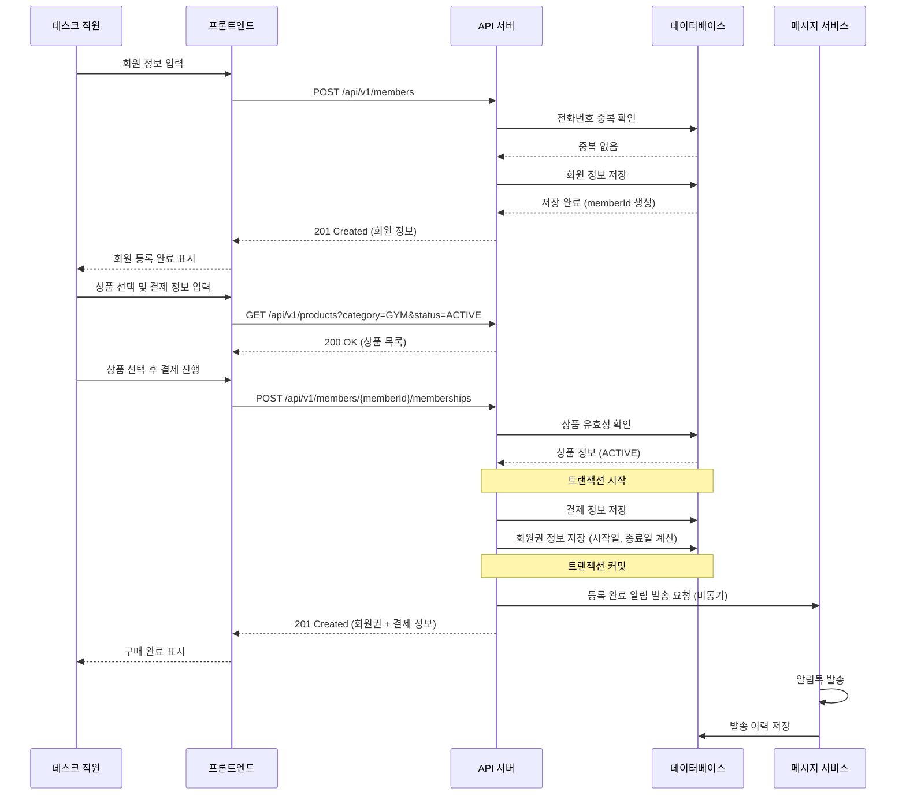
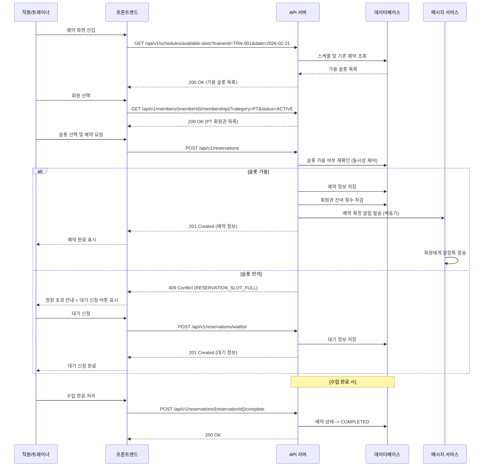
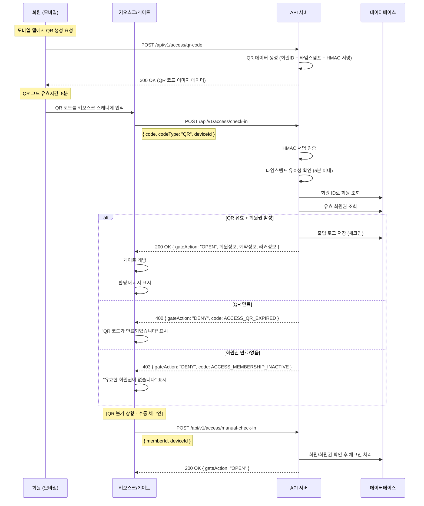
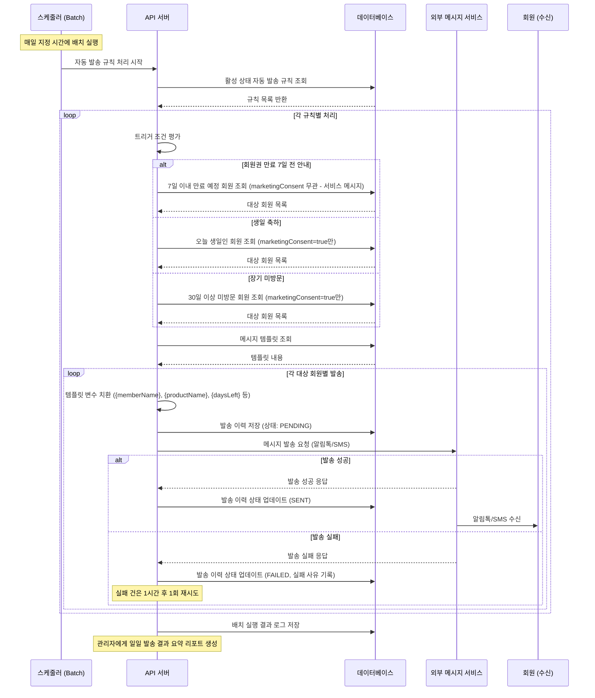

# API 설계서 - 헬스장 회원관리 시스템 (GymCRM)

| 항목 | 내용 |
|------|------|
| 프로젝트명 | 중소형 헬스장 웹 기반 회원관리 시스템 (GymCRM) |
| 문서 버전 | v1.0.0 |
| 작성일 | 2026-02-20 |
| 기술 스택 | Java Spring Boot 3.0, PostgreSQL, React.js + TypeScript |
| 인프라 | AWS EC2, RDS |

---

## 목차

1. [API 설계 원칙](#1-api-설계-원칙)
2. [공통 규격](#2-공통-규격)
3. [API 엔드포인트 목록](#3-api-엔드포인트-목록)
4. [주요 API 상세 명세](#4-주요-api-상세-명세)
5. [API 흐름도](#5-api-흐름도)

---

## 1. API 설계 원칙

### 1.1 RESTful API 규칙

본 시스템의 모든 API는 REST(Representational State Transfer) 아키텍처 스타일을 준수하며, 다음 원칙을 따른다.

#### URL 네이밍 컨벤션

| 규칙 | 설명 | 올바른 예시 | 잘못된 예시 |
|------|------|-------------|-------------|
| Base URL | 모든 API는 `/api/v1` 접두사를 사용한다 | `/api/v1/members` | `/members` |
| 리소스명 | 복수형 명사를 사용한다 | `/api/v1/members` | `/api/v1/member` |
| 소문자 사용 | URL은 소문자와 하이픈(`-`)만 사용한다 | `/api/v1/access-logs` | `/api/v1/accessLogs` |
| 계층 관계 | 리소스 간 관계는 경로로 표현한다 | `/api/v1/members/{id}/memberships` | `/api/v1/member-memberships` |
| 행위 표현 금지 | URL에 동사를 사용하지 않는다 (예외: 비 CRUD 액션) | `POST /api/v1/members` | `/api/v1/createMember` |
| 액션 리소스 | CRUD로 표현 불가한 행위는 하위 액션으로 표현한다 | `POST /api/v1/memberships/{id}/hold` | `POST /api/v1/holdMembership` |
| 후행 슬래시 금지 | URL 끝에 슬래시를 포함하지 않는다 | `/api/v1/members` | `/api/v1/members/` |

#### HTTP 메서드 사용 원칙

| 메서드 | 용도 | 멱등성 | 안전성 | 요청 본문 |
|--------|------|--------|--------|-----------|
| `GET` | 리소스 조회 (단건/목록) | O | O | 없음 |
| `POST` | 리소스 생성, 비 CRUD 액션 실행 | X | X | 있음 |
| `PUT` | 리소스 전체 수정 | O | X | 있음 |
| `PATCH` | 리소스 부분 수정 | O | X | 있음 |
| `DELETE` | 리소스 삭제 (논리 삭제 원칙) | O | X | 없음 |

> **논리 삭제 원칙**: 모든 삭제 작업은 물리 삭제가 아닌 `deleted_at` 타임스탬프를 기록하는 소프트 삭제(Soft Delete) 방식을 기본으로 한다. 물리 삭제가 필요한 경우 별도 배치 작업으로 처리한다.

### 1.2 API 버저닝 전략

| 항목 | 내용 |
|------|------|
| 버저닝 방식 | **URL 경로 버저닝** (`/api/v1/...`, `/api/v2/...`) |
| 선택 이유 | 직관적이며, 프록시/로드밸런서 레벨에서 라우팅이 용이하다 |
| 현재 버전 | `v1` |
| 하위 호환성 | 동일 메이저 버전 내에서는 하위 호환성을 보장한다 |
| 폐기 정책 | 신규 버전 출시 후 최소 6개월간 이전 버전을 유지하며, `Sunset` 헤더로 폐기 일정을 안내한다 |

```
버전 폐기 안내 응답 헤더 예시
Sunset: Sat, 01 Jan 2027 00:00:00 GMT
Deprecation: true
Link: </api/v2/members>; rel="successor-version"
```

### 1.3 인증 방식

본 시스템은 **JWT(JSON Web Token) 기반의 Bearer Token 인증**을 사용한다.

| 항목 | 내용 |
|------|------|
| 인증 방식 | Bearer Token (JWT) |
| Access Token 만료 | 30분 |
| Refresh Token 만료 | 14일 |
| 토큰 저장 위치 | Access Token: 메모리 (React State), Refresh Token: HttpOnly Secure Cookie |
| 토큰 갱신 | Access Token 만료 시 Refresh Token으로 자동 갱신 |
| 비밀키 관리 | AWS Secrets Manager |

**JWT Payload 구조:**

```json
{
  "sub": "admin-001",
  "name": "김관리자",
  "role": "ADMIN",
  "gymId": "gym-001",
  "iat": 1740000000,
  "exp": 1740001800
}
```

**역할(Role) 정의:**

| 역할 | 코드 | 설명 |
|------|------|------|
| 시스템 관리자 | `SYSTEM_ADMIN` | 전체 시스템 관리 (멀티 테넌트) |
| 관리자 | `ADMIN` | 헬스장 전체 관리 권한 |
| 매니저 | `MANAGER` | 운영 관리 (정산 제외) |
| 트레이너 | `TRAINER` | 본인 스케줄/회원 관리 |
| 데스크 | `DESK` | 프론트 데스크 업무 (체크인, 라커 등) |

---

## 2. 공통 규격

### 2.1 공통 요청 헤더

| 헤더 | 필수 | 설명 | 예시 |
|------|------|------|------|
| `Authorization` | O (인증 필요 API) | Bearer JWT 토큰 | `Bearer eyJhbGciOiJIUzI1NiIs...` |
| `Content-Type` | O (요청 본문 포함 시) | 요청 본문 미디어 타입 | `application/json` |
| `Accept` | X | 응답 미디어 타입 | `application/json` |
| `X-Request-Id` | X | 요청 추적 ID (미전송 시 서버에서 자동 생성) | `550e8400-e29b-41d4-a716-446655440000` |
| `Idempotency-Key` | X (멱등 처리 대상 POST API) | 동일 요청 중복 처리 방지 키 (서버 24시간 보관) | `3f4d3f6d-9fd4-4f41-b0bc-1e29f3f5029c` |
| `Accept-Language` | X | 응답 메시지 언어 (기본값: `ko`) | `ko`, `en` |

### 2.2 공통 응답 포맷

#### 성공 응답 (단건)

```json
{
  "success": true,
  "data": {
    "memberId": "MBR-20260220-0001",
    "name": "홍길동",
    "phone": "010-1234-5678"
  },
  "message": "회원 정보를 성공적으로 조회했습니다.",
  "timestamp": "2026-02-20T10:30:00+09:00"
}
```

#### 성공 응답 (목록 + 페이징)

```json
{
  "success": true,
  "data": [
    {
      "memberId": "MBR-20260220-0001",
      "name": "홍길동",
      "phone": "010-1234-5678"
    },
    {
      "memberId": "MBR-20260220-0002",
      "name": "김철수",
      "phone": "010-9876-5432"
    }
  ],
  "message": "회원 목록을 성공적으로 조회했습니다.",
  "timestamp": "2026-02-20T10:30:00+09:00",
  "pagination": {
    "page": 1,
    "size": 20,
    "totalElements": 156,
    "totalPages": 8
  }
}
```

#### 실패 응답

```json
{
  "success": false,
  "data": null,
  "message": "요청을 처리할 수 없습니다.",
  "timestamp": "2026-02-20T10:30:00+09:00",
  "error": {
    "code": "MEMBER_NOT_FOUND",
    "status": 404,
    "detail": "회원 ID 'MBR-20260220-9999'에 해당하는 회원을 찾을 수 없습니다.",
    "field": null,
    "errors": []
  }
}
```

#### 유효성 검증 실패 응답

```json
{
  "success": false,
  "data": null,
  "message": "입력값 유효성 검증에 실패했습니다.",
  "timestamp": "2026-02-20T10:30:00+09:00",
  "error": {
    "code": "VALIDATION_ERROR",
    "status": 422,
    "detail": "요청 데이터의 유효성 검증에 실패했습니다.",
    "field": null,
    "errors": [
      {
        "field": "phone",
        "value": "01012345",
        "reason": "전화번호는 010-XXXX-XXXX 형식이어야 합니다."
      },
      {
        "field": "birthDate",
        "value": "2030-01-01",
        "reason": "생년월일은 현재 날짜 이전이어야 합니다."
      }
    ]
  }
}
```

### 2.3 공통 에러 코드 정의

#### HTTP 상태 코드 매핑

| HTTP Status | 의미 | 사용 상황 |
|-------------|------|-----------|
| `200 OK` | 성공 | 조회, 수정, 삭제 성공 |
| `201 Created` | 생성 성공 | 리소스 생성 성공 |
| `204 No Content` | 성공 (본문 없음) | 삭제 성공 (응답 본문 불필요 시) |
| `400 Bad Request` | 잘못된 요청 | 요청 형식 오류, 필수 파라미터 누락 |
| `401 Unauthorized` | 인증 실패 | 토큰 미제공, 토큰 만료/변조 |
| `403 Forbidden` | 권한 없음 | 해당 리소스에 대한 접근 권한 부족 |
| `404 Not Found` | 리소스 없음 | 요청한 리소스가 존재하지 않음 |
| `409 Conflict` | 충돌 | 이미 존재하는 리소스, 중복 요청 |
| `422 Unprocessable Entity` | 유효성 실패 | 요청 본문 유효성 검증 실패 |
| `429 Too Many Requests` | 요청 과다 | Rate Limit 초과 |
| `500 Internal Server Error` | 서버 오류 | 예상치 못한 서버 내부 오류 |

#### 비즈니스 에러 코드

| 에러 코드 | HTTP Status | 설명 |
|-----------|-------------|------|
| **인증/권한** | | |
| `AUTH_INVALID_CREDENTIALS` | 401 | 아이디 또는 비밀번호 불일치 |
| `AUTH_TOKEN_EXPIRED` | 401 | 액세스 토큰 만료 |
| `AUTH_TOKEN_INVALID` | 401 | 유효하지 않은 토큰 |
| `AUTH_REFRESH_TOKEN_EXPIRED` | 401 | 리프레시 토큰 만료 |
| `AUTH_FORBIDDEN` | 403 | 해당 작업에 대한 권한 없음 |
| **회원** | | |
| `MEMBER_NOT_FOUND` | 404 | 회원을 찾을 수 없음 |
| `MEMBER_DUPLICATE_PHONE` | 409 | 이미 등록된 전화번호 |
| `MEMBER_ALREADY_DELETED` | 409 | 이미 탈퇴 처리된 회원 |
| **회원권** | | |
| `MEMBERSHIP_NOT_FOUND` | 404 | 회원권을 찾을 수 없음 |
| `MEMBERSHIP_EXPIRED` | 400 | 만료된 회원권 |
| `MEMBERSHIP_ALREADY_HELD` | 409 | 이미 홀딩 중인 회원권 |
| `MEMBERSHIP_HOLD_LIMIT_EXCEEDED` | 400 | 홀딩 가능 횟수 초과 |
| `MEMBERSHIP_HOLD_MIN_DAYS` | 400 | 최소 홀딩 기간 미충족 |
| `MEMBERSHIP_TRANSFER_NOT_ALLOWED` | 400 | 양도 불가 상품 |
| `MEMBERSHIP_REFUND_PERIOD_EXPIRED` | 400 | 환불 가능 기간 초과 |
| `MEMBERSHIP_NO_REMAINING` | 400 | 잔여 횟수 없음 (횟수제) |
| **상품** | | |
| `PRODUCT_NOT_FOUND` | 404 | 상품을 찾을 수 없음 |
| `PRODUCT_INACTIVE` | 400 | 비활성화된 상품 |
| `PRODUCT_HAS_ACTIVE_MEMBERS` | 409 | 활성 회원이 있어 삭제 불가 |
| **예약** | | |
| `RESERVATION_NOT_FOUND` | 404 | 예약을 찾을 수 없음 |
| `RESERVATION_SLOT_FULL` | 409 | 해당 시간대 예약 정원 초과 |
| `RESERVATION_DUPLICATE` | 409 | 동일 시간대 중복 예약 |
| `RESERVATION_CANCEL_TOO_LATE` | 400 | 취소 가능 시간 초과 (수업 2시간 전) |
| `RESERVATION_PAST_SLOT` | 400 | 과거 시간대 예약 불가 |
| `SCHEDULE_NOT_FOUND` | 404 | 스케줄을 찾을 수 없음 |
| `SCHEDULE_CONFLICT` | 409 | 스케줄 시간 충돌 |
| **출입** | | |
| `ACCESS_QR_EXPIRED` | 400 | QR 코드 만료 |
| `ACCESS_QR_INVALID` | 400 | 유효하지 않은 QR 코드 |
| `ACCESS_MEMBERSHIP_INACTIVE` | 403 | 유효한 회원권 없음으로 출입 불가 |
| `ACCESS_ALREADY_CHECKED_IN` | 409 | 이미 체크인 처리됨 (당일) |
| **라커** | | |
| `LOCKER_NOT_FOUND` | 404 | 라커를 찾을 수 없음 |
| `LOCKER_ALREADY_ASSIGNED` | 409 | 이미 배정된 라커 |
| `LOCKER_NOT_ASSIGNED` | 400 | 배정되지 않은 라커 반납 시도 |
| `LOCKER_KEY_ALREADY_LOST` | 409 | 이미 분실 처리된 키 |
| **정산** | | |
| `SETTLEMENT_PERIOD_INVALID` | 400 | 유효하지 않은 정산 기간 |
| `SETTLEMENT_ALREADY_CONFIRMED` | 409 | 이미 확정된 정산 |
| **메시지** | | |
| `MESSAGE_TEMPLATE_NOT_FOUND` | 404 | 메시지 템플릿을 찾을 수 없음 |
| `MESSAGE_SEND_FAILED` | 500 | 메시지 발송 실패 |
| `MESSAGE_RECIPIENT_INVALID` | 400 | 유효하지 않은 수신자 |
| **공통** | | |
| `VALIDATION_ERROR` | 422 | 입력값 유효성 검증 실패 |
| `INTERNAL_SERVER_ERROR` | 500 | 서버 내부 오류 |
| `RATE_LIMIT_EXCEEDED` | 429 | 요청 횟수 제한 초과 |

### 2.4 페이징/정렬/필터링 파라미터 규격

#### 페이징 파라미터

| 파라미터 | 타입 | 기본값 | 설명 |
|----------|------|--------|------|
| `page` | Integer | `1` | 페이지 번호 (1부터 시작) |
| `size` | Integer | `20` | 페이지당 항목 수 (최대 100) |

```
GET /api/v1/members?page=2&size=15
```

#### 정렬 파라미터

| 파라미터 | 타입 | 기본값 | 설명 |
|----------|------|--------|------|
| `sort` | String | 리소스별 상이 | 정렬 필드명 |
| `order` | String | `desc` | 정렬 방향 (`asc` / `desc`) |

```
GET /api/v1/members?sort=createdAt&order=desc
GET /api/v1/members?sort=name&order=asc
```

#### 필터링 파라미터

필터링은 쿼리 파라미터로 전달하며, 각 리소스별로 지원하는 필터가 다르다.

| 필터 유형 | 문법 | 예시 |
|-----------|------|------|
| 완전 일치 | `field=value` | `status=ACTIVE` |
| 부분 일치 (검색) | `keyword=value` | `keyword=홍길동` |
| 범위 검색 | `fieldFrom=value&fieldTo=value` | `createdAtFrom=2026-01-01&createdAtTo=2026-02-28` |
| 다중 값 | `field=value1,value2` | `status=ACTIVE,INACTIVE` |

```
GET /api/v1/members?keyword=홍길동&status=ACTIVE&sort=createdAt&order=desc&page=1&size=20
```

### 2.5 Rate Limiting

| 대상 | 제한 | 윈도우 |
|------|------|--------|
| 인증 API (로그인) | 10회 | 1분 |
| 일반 API (인증된 사용자) | 300회 | 1분 |
| 파일 업로드 | 20회 | 1분 |

Rate Limit 관련 응답 헤더:

```
X-RateLimit-Limit: 300
X-RateLimit-Remaining: 295
X-RateLimit-Reset: 1740001860
```

### 2.6 날짜/시간 포맷

| 항목 | 포맷 | 예시 |
|------|------|------|
| 날짜 | `yyyy-MM-dd` | `2026-02-20` |
| 시간 | `HH:mm:ss` | `14:30:00` |
| 날짜+시간 | ISO 8601 (`yyyy-MM-dd'T'HH:mm:ssXXX`) | `2026-02-20T14:30:00+09:00` |
| 타임존 | KST (Asia/Seoul, UTC+09:00) | - |

---

## 3. API 엔드포인트 목록

### 3.1 인증 API (`/api/v1/auth`)

| # | Method | URL | 설명 | 인증 | 권한 |
|---|--------|-----|------|------|------|
| 1 | `POST` | `/api/v1/auth/login` | 로그인 (JWT 발급) | X | - |
| 2 | `POST` | `/api/v1/auth/logout` | 로그아웃 (토큰 무효화) | O | ALL |
| 3 | `POST` | `/api/v1/auth/refresh-token` | 액세스 토큰 갱신 | X (쿠키) | - |
| 4 | `PATCH` | `/api/v1/auth/password` | 비밀번호 변경 | O | ALL |
| 5 | `GET` | `/api/v1/auth/me` | 내 정보 조회 | O | ALL |

### 3.2 회원 관리 API (`/api/v1/members`)

| # | Method | URL | 설명 | 인증 | 권한 |
|---|--------|-----|------|------|------|
| 1 | `POST` | `/api/v1/members` | 회원 신규 등록 | O | ADMIN, MANAGER, DESK |
| 2 | `GET` | `/api/v1/members` | 회원 목록 조회 (검색/필터) | O | ALL |
| 3 | `GET` | `/api/v1/members/{memberId}` | 회원 상세 조회 | O | ALL |
| 4 | `PUT` | `/api/v1/members/{memberId}` | 회원 정보 전체 수정 | O | ADMIN, MANAGER, DESK |
| 5 | `PATCH` | `/api/v1/members/{memberId}` | 회원 정보 부분 수정 | O | ADMIN, MANAGER, DESK |
| 6 | `DELETE` | `/api/v1/members/{memberId}` | 회원 탈퇴 처리 (소프트 삭제) | O | ADMIN, MANAGER, DESK |
| 7 | `POST` | `/api/v1/members/{memberId}/memberships` | 회원권 구매 (신규 등록) | O | ADMIN, MANAGER, DESK |
| 8 | `GET` | `/api/v1/members/{memberId}/memberships` | 회원의 회원권 목록 조회 | O | ALL |
| 9 | `GET` | `/api/v1/members/{memberId}/memberships/{membershipId}` | 회원권 상세 조회 | O | ALL |
| 10 | `POST` | `/api/v1/members/{memberId}/memberships/{membershipId}/transfer` | 회원권 양도 | O | ADMIN, MANAGER, DESK |
| 11 | `POST` | `/api/v1/members/{memberId}/memberships/{membershipId}/hold` | 회원권 홀딩 | O | ADMIN, MANAGER, DESK |
| 12 | `POST` | `/api/v1/members/{memberId}/memberships/{membershipId}/resume` | 회원권 홀딩 해제 | O | ADMIN, MANAGER, DESK |
| 13 | `POST` | `/api/v1/members/{memberId}/memberships/{membershipId}/refund` | 회원권 환불 | O | ADMIN, MANAGER, DESK |
| 14 | `GET` | `/api/v1/members/{memberId}/access-logs` | 회원 출입 이력 조회 | O | ALL |
| 15 | `GET` | `/api/v1/members/{memberId}/payments` | 회원 결제 내역 조회 | O | ADMIN, MANAGER, DESK |

### 3.3 상품 관리 API (`/api/v1/products`)

| # | Method | URL | 설명 | 인증 | 권한 |
|---|--------|-----|------|------|------|
| 1 | `POST` | `/api/v1/products` | 상품 등록 | O | ADMIN, MANAGER |
| 2 | `GET` | `/api/v1/products` | 상품 목록 조회 (카테고리/상태 필터) | O | ALL |
| 3 | `GET` | `/api/v1/products/{productId}` | 상품 상세 조회 | O | ALL |
| 4 | `PATCH` | `/api/v1/products/{productId}` | 상품 정보 수정 | O | ADMIN, MANAGER |
| 5 | `DELETE` | `/api/v1/products/{productId}` | 상품 삭제 (소프트 삭제) | O | ADMIN, MANAGER |
| 6 | `PATCH` | `/api/v1/products/{productId}/status` | 상품 활성/비활성 전환 | O | ADMIN, MANAGER |
| 7 | `GET` | `/api/v1/products/categories` | 상품 카테고리 목록 조회 | O | ALL |

**상품 계약 메모**
- `POST /api/v1/products`, `PATCH /api/v1/products/{productId}`, `GET /api/v1/products`, `GET /api/v1/products/{productId}` 응답에는 홀딩 정책 필드 `allowHold`, `maxHoldDays`, `maxHoldCount`, `allowHoldBypass`가 포함된다.
- `allowHoldBypass`는 관리자 권한자가 홀딩 기본 제한을 우회할 수 있는지 나타내는 Boolean 필드다.
- `allowHold=false`인 상품은 저장 시 `allowHoldBypass=false`로 정규화된다.

**상품 등록/수정 Request 예시**

```json
{
  "productName": "헬스 90일권",
  "productCategory": "MEMBERSHIP",
  "productType": "DURATION",
  "priceAmount": 180000,
  "validityDays": 90,
  "totalCount": null,
  "allowHold": true,
  "maxHoldDays": 30,
  "maxHoldCount": 1,
  "allowHoldBypass": true,
  "allowTransfer": false,
  "productStatus": "ACTIVE",
  "description": "관리자 승인 시 제한 우회 홀딩 가능"
}
```

**상품 상세/목록 Response 예시**

```json
{
  "success": true,
  "data": {
    "productId": 301,
    "centerId": 1,
    "productName": "헬스 90일권",
    "productCategory": "MEMBERSHIP",
    "productType": "DURATION",
    "priceAmount": 180000,
    "validityDays": 90,
    "totalCount": null,
    "allowHold": true,
    "maxHoldDays": 30,
    "maxHoldCount": 1,
    "allowHoldBypass": true,
    "allowTransfer": false,
    "productStatus": "ACTIVE",
    "description": "관리자 승인 시 제한 우회 홀딩 가능"
  },
  "message": "상품 상세 조회 성공",
  "timestamp": "2026-04-03T12:00:00+09:00"
}
```

### 3.4 예약 관리 API (`/api/v1/reservations`)

| # | Method | URL | 설명 | 인증 | 권한 |
|---|--------|-----|------|------|------|
| 1 | `POST` | `/api/v1/reservations` | 예약 생성 | O | ALL |
| 2 | `GET` | `/api/v1/reservations` | 예약 목록 조회 (날짜/트레이너/회원 필터) | O | ALL |
| 3 | `GET` | `/api/v1/reservations/{reservationId}` | 예약 상세 조회 | O | ALL |
| 4 | `PATCH` | `/api/v1/reservations/{reservationId}` | 예약 변경 (시간/날짜) | O | ADMIN, MANAGER, TRAINER |
| 5 | `POST` | `/api/v1/reservations/{reservationId}/cancel` | 예약 취소 | O | ALL |
| 6 | `POST` | `/api/v1/reservations/{reservationId}/complete` | 수업 완료 처리 | O | ADMIN, MANAGER, TRAINER |
| 7 | `POST` | `/api/v1/reservations/{reservationId}/no-show` | 노쇼 처리 | O | ADMIN, MANAGER, TRAINER |
| 8 | `POST` | `/api/v1/reservations/waitlist` | 대기 신청 | O | ALL |
| 9 | `DELETE` | `/api/v1/reservations/waitlist/{waitlistId}` | 대기 신청 취소 | O | ALL |
| 10 | `GET` | `/api/v1/reservations/waitlist` | 대기 목록 조회 | O | ALL |
| 11 | `GET` | `/api/v1/schedules` | 트레이너 스케줄 조회 | O | ALL |
| 12 | `POST` | `/api/v1/schedules` | 트레이너 스케줄 등록 | O | ADMIN, MANAGER, TRAINER |
| 13 | `PUT` | `/api/v1/schedules/{scheduleId}` | 트레이너 스케줄 수정 | O | ADMIN, MANAGER, TRAINER |
| 14 | `DELETE` | `/api/v1/schedules/{scheduleId}` | 트레이너 스케줄 삭제 | O | ADMIN, MANAGER, TRAINER |
| 15 | `GET` | `/api/v1/schedules/available-slots` | 예약 가능 슬롯 조회 | O | ALL |

### 3.5 출입 통제 API (`/api/v1/access`)

| # | Method | URL | 설명 | 인증 | 권한 |
|---|--------|-----|------|------|------|
| 1 | `POST` | `/api/v1/access/qr-code` | QR 코드 생성 (회원별) | O | ADMIN, MANAGER, DESK |
| 2 | `POST` | `/api/v1/access/check-in` | QR 검증 및 체크인 | O | DESK, SYSTEM |
| 3 | `POST` | `/api/v1/access/check-out` | 체크아웃 처리 | O | DESK, SYSTEM |
| 4 | `GET` | `/api/v1/access/logs` | 출입 기록 조회 (기간/회원 필터) | O | ADMIN, MANAGER, DESK |
| 5 | `GET` | `/api/v1/access/today` | 금일 출입 현황 조회 | O | ALL |
| 6 | `POST` | `/api/v1/access/manual-check-in` | 수동 체크인 (QR 불가 시) | O | DESK |

### 3.6 라커 관리 API (`/api/v1/lockers`)

| # | Method | URL | 설명 | 인증 | 권한 |
|---|--------|-----|------|------|------|
| 1 | `GET` | `/api/v1/lockers` | 라커 목록 조회 (상태별 필터) | O | ALL |
| 2 | `GET` | `/api/v1/lockers/{lockerId}` | 라커 상세 조회 | O | ALL |
| 3 | `POST` | `/api/v1/lockers` | 라커 등록 (신규 라커 추가) | O | ADMIN |
| 4 | `POST` | `/api/v1/lockers/{lockerId}/assign` | 라커 배정 | O | ADMIN, MANAGER, DESK |
| 5 | `POST` | `/api/v1/lockers/{lockerId}/release` | 라커 반납 | O | ADMIN, MANAGER, DESK |
| 6 | `POST` | `/api/v1/lockers/{lockerId}/report-lost-key` | 키 분실 신고 | O | ADMIN, MANAGER, DESK |
| 7 | `POST` | `/api/v1/lockers/{lockerId}/replace-key` | 키 교체 완료 처리 | O | ADMIN, MANAGER, DESK |
| 8 | `PATCH` | `/api/v1/lockers/{lockerId}` | 라커 정보 수정 (상태/메모) | O | ADMIN, MANAGER |
| 9 | `GET` | `/api/v1/lockers/expiring` | 만료 임박 라커 목록 | O | ADMIN, MANAGER, DESK |

### 3.7 매출/정산 API (`/api/v1/settlements`)

| # | Method | URL | 설명 | 인증 | 권한 |
|---|--------|-----|------|------|------|
| 1 | `GET` | `/api/v1/settlements/sales-dashboard` | 운영 상황판용 매출 대시보드 조회 | O | ADMIN, MANAGER, DESK |
| 2 | `GET` | `/api/v1/settlements/sales-report` | 기간별 매출/환불/순매출 및 추이 조회 | O | ADMIN, MANAGER, DESK |
| 3 | `GET` | `/api/v1/settlements/sales-report/recent-adjustments` | 최근 환불 목록 조회 | O | ADMIN, MANAGER, DESK |
| 4 | `GET` | `/api/v1/settlements/sales-report/export` | 매출 리포트 Excel(`.xlsx`) 다운로드 | O | ADMIN, MANAGER, DESK |
| 5 | `GET` | `/api/v1/settlements/trainer-payroll/my-summary` | 트레이너 본인 월간 완료 PT 수업 수 요약 조회 | O | TRAINER |
| 6 | `GET` | `/api/v1/settlements/trainer-payroll` | 트레이너 월별 급여 조회. 확정 월은 저장된 스냅샷과 `settlementStatus`/`confirmedAt`를 함께 반환 | O | ADMIN, MANAGER, DESK |
| 7 | `POST` | `/api/v1/settlements/trainer-payroll/confirm` | 월별 트레이너 정산 일괄 확정 및 스냅샷 저장 | O | ADMIN, MANAGER, DESK |
| 8 | `GET` | `/api/v1/settlements/trainer-payroll/document` | 확정된 월 정산 PDF 정산서 다운로드 | O | ADMIN, MANAGER, DESK |
| 9 | `POST` | `/api/v1/settlements` | 지정 기간의 트레이너 정산 생성 | O | ADMIN |
| 10 | `POST` | `/api/v1/settlements/{settlementId}/confirm` | 생성된 정산 배치를 확정 | O | ADMIN |

### 3.8 CRM 메시지 API (`/api/v1/messages`)

| # | Method | URL | 설명 | 인증 | 권한 |
|---|--------|-----|------|------|------|
| 1 | `GET` | `/api/v1/messages/templates` | 메시지 템플릿 목록 | O | ADMIN, MANAGER |
| 2 | `POST` | `/api/v1/messages/templates` | 메시지 템플릿 생성 | O | ADMIN |
| 3 | `PUT` | `/api/v1/messages/templates/{templateId}` | 메시지 템플릿 수정 | O | ADMIN |
| 4 | `DELETE` | `/api/v1/messages/templates/{templateId}` | 메시지 템플릿 삭제 | O | ADMIN |
| 5 | `POST` | `/api/v1/messages/send` | 수동 메시지 발송 | O | ADMIN, MANAGER |
| 6 | `POST` | `/api/v1/messages/send/bulk` | 대량 메시지 발송 | O | ADMIN |
| 7 | `GET` | `/api/v1/messages/auto-rules` | 자동 발송 규칙 목록 | O | ADMIN, MANAGER |
| 8 | `POST` | `/api/v1/messages/auto-rules` | 자동 발송 규칙 생성 | O | ADMIN |
| 9 | `PUT` | `/api/v1/messages/auto-rules/{ruleId}` | 자동 발송 규칙 수정 | O | ADMIN |
| 10 | `PATCH` | `/api/v1/messages/auto-rules/{ruleId}/status` | 자동 발송 규칙 활성/비활성 | O | ADMIN |
| 11 | `GET` | `/api/v1/messages/logs` | 메시지 발송 이력 조회 | O | ADMIN, MANAGER |
| 12 | `GET` | `/api/v1/messages/logs/{logId}` | 발송 이력 상세 | O | ADMIN, MANAGER |

### 3.9 대시보드 API (`/api/v1/dashboard`)

| # | Method | URL | 설명 | 인증 | 권한 |
|---|--------|-----|------|------|------|
| 1 | `GET` | `/api/v1/dashboard/summary` | 대시보드 종합 요약 | O | ADMIN, MANAGER |
| 2 | `GET` | `/api/v1/dashboard/attendance` | 오늘의 출석 현황 | O | ALL |
| 3 | `GET` | `/api/v1/dashboard/expiring-memberships` | 만료 임박 회원 목록 | O | ADMIN, MANAGER, DESK |
| 4 | `GET` | `/api/v1/dashboard/revenue` | 매출 요약 (금일/금주/금월) | O | ADMIN |
| 5 | `GET` | `/api/v1/dashboard/reservations` | 오늘의 예약 현황 | O | ALL |
| 6 | `GET` | `/api/v1/dashboard/new-members` | 신규 회원 현황 (최근 7일) | O | ADMIN, MANAGER |
| 7 | `GET` | `/api/v1/dashboard/locker-status` | 라커 사용 현황 | O | ADMIN, MANAGER, DESK |

---

## 4. 주요 API 상세 명세

### 4.1 로그인 API

| 항목 | 내용 |
|------|------|
| **URL** | `POST /api/v1/auth/login` |
| **설명** | 관리자/직원 로그인. JWT Access Token과 Refresh Token을 발급한다. |
| **인증** | 불필요 |

**Request Body:**

```json
{
  "loginId": "admin01",
  "password": "P@ssw0rd!2026"
}
```

| 필드 | 타입 | 필수 | 설명 |
|------|------|------|------|
| `loginId` | String | O | 로그인 ID (4~20자, 영문+숫자) |
| `password` | String | O | 비밀번호 (8~30자, 영문+숫자+특수문자) |

**Response Body (성공 - 200):**

```json
{
  "success": true,
  "data": {
    "accessToken": "eyJhbGciOiJIUzI1NiIsInR5cCI6IkpXVCJ9...",
    "tokenType": "Bearer",
    "expiresIn": 1800,
    "user": {
      "userId": "USR-001",
      "name": "김관리자",
      "role": "ADMIN",
      "gymId": "GYM-001",
      "gymName": "파워짐 강남점",
      "lastLoginAt": "2026-02-19T18:30:00+09:00"
    }
  },
  "message": "로그인에 성공했습니다.",
  "timestamp": "2026-02-20T09:00:00+09:00"
}
```

> Refresh Token은 `Set-Cookie` 헤더를 통해 HttpOnly Secure 쿠키로 전달된다.

```
Set-Cookie: refreshToken=eyJhbGciOiJIUzI1NiIs...; Path=/api/v1/auth; HttpOnly; Secure; SameSite=Strict; Max-Age=1209600
```

**Response Body (실패 - 401):**

```json
{
  "success": false,
  "data": null,
  "message": "로그인에 실패했습니다.",
  "timestamp": "2026-02-20T09:00:00+09:00",
  "error": {
    "code": "AUTH_INVALID_CREDENTIALS",
    "status": 401,
    "detail": "아이디 또는 비밀번호가 일치하지 않습니다.",
    "field": null,
    "errors": []
  }
}
```

**비즈니스 규칙:**
- 5회 연속 로그인 실패 시 계정을 30분간 잠금 처리한다.
- 로그인 시도 기록(IP, User-Agent, 성공/실패)은 보안 로그에 저장한다.
- 비밀번호는 bcrypt로 해싱되어 비교한다.

---

### 4.2 회원 신규 등록 API

| 항목 | 내용 |
|------|------|
| **URL** | `POST /api/v1/members` |
| **설명** | 신규 회원을 등록한다. 회원 ID는 서버에서 자동 생성된다. |
| **인증** | 필요 |
| **권한** | ADMIN, MANAGER, DESK |

**Request Body:**

```json
{
  "name": "홍길동",
  "phone": "010-1234-5678",
  "birthDate": "1990-05-15",
  "gender": "MALE",
  "email": "hong@example.com",
  "address": "서울시 강남구 테헤란로 123",
  "emergencyContact": {
    "name": "홍부모",
    "phone": "010-9999-8888",
    "relationship": "부모"
  },
  "memo": "무릎 부상 이력 있음. 하체 운동 시 주의 필요.",
  "marketingConsent": true,
  "photoUrl": null
}
```

| 필드 | 타입 | 필수 | 설명 |
|------|------|------|------|
| `name` | String | O | 회원명 (2~30자) |
| `phone` | String | O | 전화번호 (010-XXXX-XXXX 형식) |
| `birthDate` | String | X | 생년월일 (yyyy-MM-dd) |
| `gender` | Enum | X | 성별 (`MALE`, `FEMALE`, `OTHER`) |
| `email` | String | X | 이메일 |
| `address` | String | X | 주소 |
| `emergencyContact` | Object | X | 비상 연락처 |
| `emergencyContact.name` | String | X | 비상 연락처 이름 |
| `emergencyContact.phone` | String | X | 비상 연락처 전화번호 |
| `emergencyContact.relationship` | String | X | 관계 |
| `memo` | String | X | 메모 (최대 500자) |
| `marketingConsent` | Boolean | O | 마케팅 수신 동의 여부 |
| `photoUrl` | String | X | 프로필 사진 URL |

**Response Body (성공 - 201):**

```json
{
  "success": true,
  "data": {
    "memberId": "MBR-20260220-0001",
    "name": "홍길동",
    "phone": "010-1234-5678",
    "birthDate": "1990-05-15",
    "gender": "MALE",
    "email": "hong@example.com",
    "address": "서울시 강남구 테헤란로 123",
    "emergencyContact": {
      "name": "홍부모",
      "phone": "010-9999-8888",
      "relationship": "부모"
    },
    "memo": "무릎 부상 이력 있음. 하체 운동 시 주의 필요.",
    "marketingConsent": true,
    "photoUrl": null,
    "status": "ACTIVE",
    "createdAt": "2026-02-20T10:00:00+09:00",
    "updatedAt": "2026-02-20T10:00:00+09:00"
  },
  "message": "회원이 성공적으로 등록되었습니다.",
  "timestamp": "2026-02-20T10:00:00+09:00"
}
```

**Response Body (실패 - 409 중복):**

```json
{
  "success": false,
  "data": null,
  "message": "회원 등록에 실패했습니다.",
  "timestamp": "2026-02-20T10:00:00+09:00",
  "error": {
    "code": "MEMBER_DUPLICATE_PHONE",
    "status": 409,
    "detail": "전화번호 '010-1234-5678'로 등록된 회원이 이미 존재합니다.",
    "field": "phone",
    "errors": []
  }
}
```

**비즈니스 규칙:**
- 전화번호는 헬스장 내에서 고유해야 한다 (동일 전화번호 중복 등록 불가).
- 회원 ID는 `MBR-{yyyyMMdd}-{4자리 순번}` 형식으로 서버에서 자동 생성한다.
- 탈퇴 처리된 회원의 전화번호로 재등록 시 기존 회원 정보를 안내한다.
- 마케팅 수신 동의 여부는 필수 입력이며, 변경 이력을 별도 관리한다.

---

### 4.3 회원 목록 조회 API

| 항목 | 내용 |
|------|------|
| **URL** | `GET /api/v1/members` |
| **설명** | 회원 목록을 조회한다. 키워드 검색, 상태 필터, 정렬, 페이징을 지원한다. |
| **인증** | 필요 |
| **권한** | ALL |

**Query Parameters:**

| 파라미터 | 타입 | 필수 | 기본값 | 설명 |
|----------|------|------|--------|------|
| `keyword` | String | X | - | 회원명 또는 전화번호 검색 |
| `status` | String | X | - | 회원 상태 필터 (`ACTIVE`, `INACTIVE`, `WITHDRAWN`) |
| `membershipType` | String | X | - | 회원권 유형 필터 (`GYM`, `GX`, `PT`) |
| `createdAtFrom` | String | X | - | 등록일 시작 (yyyy-MM-dd) |
| `createdAtTo` | String | X | - | 등록일 종료 (yyyy-MM-dd) |
| `expiringWithinDays` | Integer | X | - | N일 이내 만료 예정 회원 필터 |
| `trainerId` | String | X | - | 담당 트레이너 ID 필터 |
| `sort` | String | X | `createdAt` | 정렬 필드 (`name`, `createdAt`, `expiryDate`) |
| `order` | String | X | `desc` | 정렬 방향 (`asc`, `desc`) |
| `page` | Integer | X | `1` | 페이지 번호 |
| `size` | Integer | X | `20` | 페이지당 항목 수 |

**요청 예시:**

```
GET /api/v1/members?keyword=홍길동&status=ACTIVE&sort=name&order=asc&page=1&size=20
```

**Response Body (성공 - 200):**

```json
{
  "success": true,
  "data": [
    {
      "memberId": "MBR-20260220-0001",
      "name": "홍길동",
      "phone": "010-1234-5678",
      "gender": "MALE",
      "status": "ACTIVE",
      "photoUrl": null,
      "activeMemberships": [
        {
          "membershipId": "MSP-20260220-0001",
          "productName": "3개월 헬스 이용권",
          "type": "PERIOD",
          "category": "GYM",
          "startDate": "2026-02-20",
          "endDate": "2026-05-19",
          "remainingDays": 88,
          "status": "ACTIVE"
        }
      ],
      "lastVisitDate": "2026-02-19",
      "totalVisits": 45,
      "createdAt": "2025-11-20T10:00:00+09:00"
    },
    {
      "memberId": "MBR-20260115-0023",
      "name": "홍미영",
      "phone": "010-5555-6666",
      "gender": "FEMALE",
      "status": "ACTIVE",
      "photoUrl": "https://cdn.gymcrm.co.kr/photos/MBR-20260115-0023.jpg",
      "activeMemberships": [
        {
          "membershipId": "MSP-20260115-0012",
          "productName": "PT 30회권",
          "type": "COUNT",
          "category": "PT",
          "startDate": "2026-01-15",
          "endDate": "2026-07-14",
          "remainingCount": 18,
          "totalCount": 30,
          "status": "ACTIVE"
        }
      ],
      "lastVisitDate": "2026-02-20",
      "totalVisits": 28,
      "createdAt": "2026-01-15T14:30:00+09:00"
    }
  ],
  "message": "회원 목록을 성공적으로 조회했습니다.",
  "timestamp": "2026-02-20T10:30:00+09:00",
  "pagination": {
    "page": 1,
    "size": 20,
    "totalElements": 2,
    "totalPages": 1
  }
}
```

**비즈니스 규칙:**
- TRAINER 역할은 본인 담당 회원만 조회할 수 있다.
- `keyword` 파라미터는 회원명과 전화번호 모두에 대해 부분 일치(LIKE) 검색을 수행한다.
- 소프트 삭제된 회원은 기본 조회에서 제외되며, `status=WITHDRAWN` 필터 시에만 포함된다.
- `expiringWithinDays` 필터는 활성 회원권의 종료일을 기준으로 계산한다.

---

### 4.4 회원권 구매 API

| 항목 | 내용 |
|------|------|
| **URL** | `POST /api/v1/members/{memberId}/memberships` |
| **설명** | 회원에게 회원권(상품)을 등록하고 결제를 처리한다. |
| **인증** | 필요 |
| **권한** | ADMIN, MANAGER, DESK |

**Path Parameters:**

| 파라미터 | 타입 | 설명 |
|----------|------|------|
| `memberId` | String | 회원 ID |

**Request Body:**

```json
{
  "productId": 101,
  "assignedTrainerId": 41,
  "startDate": "2026-02-20",
  "paidAmount": 300000,
  "paymentMethod": "CARD",
  "membershipMemo": "주 3회 운동 목표",
  "paymentMemo": ""
}
```

| 필드 | 타입 | 필수 | 설명 |
|------|------|------|------|
| `productId` | Long | O | 구매할 상품 ID |
| `assignedTrainerId` | Long | X | 담당 트레이너 사용자 ID (PT 상품 시 필수) |
| `startDate` | String | O | 시작일 (yyyy-MM-dd) |
| `paidAmount` | Long | X | 결제 금액 (비워두면 상품 정가 사용) |
| `paymentMethod` | Enum | X | 결제 수단 (`CARD`, `CASH`, `TRANSFER`, `ETC`) |
| `membershipMemo` | String | X | 회원권 메모 |
| `paymentMemo` | String | X | 결제 메모 |

**Response Body (성공 - 201):**

```json
{
  "success": true,
  "data": {
    "membershipId": "MSP-20260220-0001",
    "memberId": "MBR-20260220-0001",
    "memberName": "홍길동",
    "product": {
      "productId": "PRD-GYM-001",
      "name": "3개월 헬스 이용권",
      "category": "GYM",
      "type": "PERIOD",
      "durationDays": 90
    },
    "startDate": "2026-02-20",
    "endDate": "2026-05-20",
    "status": "ACTIVE",
    "holdCount": 0,
    "maxHoldCount": 1,
    "transferable": true,
    "assignedTrainer": null,
    "payment": {
      "paymentId": "PAY-20260220-0001",
      "method": "CARD",
      "amount": 330000,
      "discountAmount": 30000,
      "finalAmount": 300000,
      "status": "COMPLETED",
      "paidAt": "2026-02-20T10:00:00+09:00"
    },
    "memo": "주 3회 운동 목표",
    "createdAt": "2026-02-20T10:00:00+09:00"
  },
  "message": "회원권이 성공적으로 등록되었습니다.",
  "timestamp": "2026-02-20T10:00:00+09:00"
}
```

**Response Body (실패 - 400 비활성 상품):**

```json
{
  "success": false,
  "data": null,
  "message": "회원권 등록에 실패했습니다.",
  "timestamp": "2026-02-20T10:00:00+09:00",
  "error": {
    "code": "PRODUCT_INACTIVE",
    "status": 400,
    "detail": "상품 'PRD-GYM-001'은 현재 비활성화 상태이므로 구매할 수 없습니다.",
    "field": "productId",
    "errors": []
  }
}
```

**비즈니스 규칙:**
- 상품이 `ACTIVE` 상태인 경우에만 구매 가능하다.
- 기간제 상품: `startDate` + 상품의 `durationDays`로 `endDate`를 자동 계산한다.
- 횟수제 상품: 상품에 설정된 `totalCount`가 잔여 횟수로 자동 설정된다.
- PT 상품 구매 시 `assignedTrainerId`는 필수이다.
- 동일 회원에게 비종결 PT 회원권(`ACTIVE`, `HOLDING`)이 이미 있으면 새 PT 회원권 생성은 차단된다.
- 결제 완료와 회원권 등록은 하나의 트랜잭션으로 처리한다.

---

### 4.5 회원권 홀딩 API

| 항목 | 내용 |
|------|------|
| **URL** | `POST /api/v1/members/{memberId}/memberships/{membershipId}/hold` |
| **설명** | 회원권의 남은 기간을 일시 정지한다. 홀딩 기간만큼 종료일이 연장된다. |
| **인증** | 필요 |
| **권한** | ADMIN, MANAGER, DESK |

**Path Parameters:**

| 파라미터 | 타입 | 설명 |
|----------|------|------|
| `memberId` | String | 회원 ID |
| `membershipId` | String | 회원권 ID |

**Request Body:**

```json
{
  "holdStartDate": "2026-03-01",
  "holdEndDate": "2026-03-14",
  "reason": "해외 출장",
  "memo": "4월 첫째 주 복귀 예정",
  "overrideLimits": true
}
```

| 필드 | 타입 | 필수 | 설명 |
|------|------|------|------|
| `holdStartDate` | String | X | 홀딩 시작일 (yyyy-MM-dd, 비우면 요청일 기준 오늘) |
| `holdEndDate` | String | O | 홀딩 종료일 (yyyy-MM-dd) |
| `reason` | String | X | 홀딩 사유 |
| `memo` | String | X | 내부 메모 |
| `overrideLimits` | Boolean | X | 홀딩 일수/횟수 제한을 우회할지 여부 |

**Response Body (성공 - 200):**

```json
{
  "success": true,
  "data": {
    "membership": {
      "membershipId": 2001,
      "centerId": 1,
      "memberId": 101,
      "productId": 301,
      "assignedTrainerId": null,
      "membershipStatus": "HOLDING",
      "productNameSnapshot": "헬스 90일권",
      "productCategorySnapshot": "MEMBERSHIP",
      "productTypeSnapshot": "DURATION",
      "priceAmountSnapshot": 180000,
      "purchasedAt": "2026-02-20T10:00:00Z",
      "startDate": "2026-02-20",
      "endDate": "2026-05-29",
      "totalCount": null,
      "remainingCount": null,
      "usedCount": null,
      "holdDaysUsed": 0,
      "holdCountUsed": 0,
      "memo": "주 3회 운동 목표",
      "overrideLimits": null,
      "activeHoldStatus": null,
      "activeHoldStartDate": null,
      "activeHoldEndDate": null
    },
    "hold": {
      "membershipHoldId": 77,
      "centerId": 1,
      "membershipId": 2001,
      "holdStatus": "ACTIVE",
      "holdStartDate": "2026-03-01",
      "holdEndDate": "2026-03-14",
      "resumedAt": null,
      "actualHoldDays": null,
      "reason": "해외 출장",
      "memo": "4월 첫째 주 복귀 예정",
      "overrideLimits": true
    },
    "preview": {
      "plannedHoldDays": 14,
      "recalculatedEndDate": "2026-06-12"
    }
  },
  "message": "회원권 홀딩이 완료되었습니다.",
  "timestamp": "2026-02-20T10:00:00+09:00"
}
```

**Response Body (실패 - 400 홀딩 횟수 초과):**

```json
{
  "success": false,
  "data": null,
  "message": "홀딩 처리에 실패했습니다.",
  "timestamp": "2026-02-20T10:00:00+09:00",
  "error": {
    "code": "MEMBERSHIP_HOLD_LIMIT_EXCEEDED",
    "status": 400,
    "detail": "해당 회원권의 홀딩 가능 횟수(1회)를 모두 사용했습니다.",
    "field": null,
    "errors": []
  }
}
```

**비즈니스 규칙:**
- `ACTIVE` 상태의 회원권만 홀딩 가능하다.
- `holdEndDate`는 필수이며 `holdStartDate`보다 빠를 수 없다.
- `holdStartDate`를 비우면 요청일 기준 오늘로 처리한다.
- 기본 홀딩 제한(최대 일수/최대 횟수)은 상품 설정 `maxHoldDays`, `maxHoldCount`를 따른다.
- `overrideLimits=true`는 상품의 `allowHoldBypass=true`인 경우에만 허용된다.
- `overrideLimits=true`를 요청해도 관리자 계열 권한이 아닌 경우 거부된다.
- 홀딩 기간만큼 회원권 종료일이 자동 연장된다.
- 이미 활성 홀딩(`holdStatus=ACTIVE`)이 있는 회원권은 중복 홀딩할 수 없다.
- 자동 재개 배치는 `holdEndDate`가 지난 활성 홀드를 기준으로 처리하며, 누락된 실행이 있어도 미처리 건을 catch-up 한다.

---

### 4.6 회원권 양도 API

| 항목 | 내용 |
|------|------|
| **URL** | `POST /api/v1/members/{memberId}/memberships/{membershipId}/transfer` |
| **설명** | 회원권을 다른 회원에게 양도한다. 양도 수수료가 발생할 수 있다. |
| **인증** | 필요 |
| **권한** | ADMIN, MANAGER |

**Path Parameters:**

| 파라미터 | 타입 | 설명 |
|----------|------|------|
| `memberId` | String | 양도인 (현재 소유자) 회원 ID |
| `membershipId` | String | 양도할 회원권 ID |

**Request Body:**

```json
{
  "targetMemberId": "MBR-20260115-0023",
  "transferFee": 30000,
  "feePaymentMethod": "CASH",
  "reason": "개인 사유로 인한 양도"
}
```

| 필드 | 타입 | 필수 | 설명 |
|------|------|------|------|
| `targetMemberId` | String | O | 양수인 (양도 받을 회원) ID |
| `transferFee` | Long | O | 양도 수수료 (원) |
| `feePaymentMethod` | Enum | O | 수수료 결제 수단 (`CARD`, `CASH`, `TRANSFER`) |
| `reason` | String | X | 양도 사유 |

**Response Body (성공 - 200):**

```json
{
  "success": true,
  "data": {
    "transferId": "TRF-20260220-0001",
    "originalMembershipId": "MSP-20260220-0001",
    "newMembershipId": "MSP-20260220-0045",
    "fromMember": {
      "memberId": "MBR-20260220-0001",
      "name": "홍길동"
    },
    "toMember": {
      "memberId": "MBR-20260115-0023",
      "name": "홍미영"
    },
    "product": {
      "productId": "PRD-GYM-001",
      "name": "3개월 헬스 이용권"
    },
    "remainingDays": 74,
    "newStartDate": "2026-02-20",
    "newEndDate": "2026-05-05",
    "transferFee": 30000,
    "transferredAt": "2026-02-20T10:00:00+09:00"
  },
  "message": "회원권이 성공적으로 양도되었습니다.",
  "timestamp": "2026-02-20T10:00:00+09:00"
}
```

**비즈니스 규칙:**
- 상품 설정에서 `transferable=true`인 회원권만 양도 가능하다.
- `ACTIVE` 상태의 회원권만 양도 가능하다 (`HELD`, `EXPIRED` 상태 불가).
- 양도 시 원래 회원권은 `TRANSFERRED` 상태로 변경되고, 양수인에게 잔여 기간/횟수의 신규 회원권이 생성된다.
- 양도 수수료는 상품별로 설정된 비율 또는 고정 금액을 적용한다.
- 양수인은 `ACTIVE` 상태의 회원이어야 한다.
- 양도 이력은 별도 관리되며, 1회에 한해 가능하다 (양도 받은 회원권의 재양도 불가).

---

### 4.7 예약 생성 API

| 항목 | 내용 |
|------|------|
| **URL** | `POST /api/v1/reservations` |
| **설명** | PT 또는 GX 수업을 예약한다. |
| **인증** | 필요 |
| **권한** | ALL |

**Request Body:**

```json
{
  "memberId": "MBR-20260220-0001",
  "membershipId": "MSP-20260115-0012",
  "scheduleId": "SCH-20260220-0900-TRN001",
  "date": "2026-02-21",
  "startTime": "09:00",
  "endTime": "09:50",
  "trainerId": "TRN-001",
  "type": "PT",
  "memo": ""
}
```

| 필드 | 타입 | 필수 | 설명 |
|------|------|------|------|
| `memberId` | String | O | 예약 회원 ID |
| `membershipId` | String | O | 사용할 회원권 ID |
| `scheduleId` | String | O | 스케줄 슬롯 ID |
| `date` | String | O | 예약 날짜 (yyyy-MM-dd) |
| `startTime` | String | O | 시작 시간 (HH:mm) |
| `endTime` | String | O | 종료 시간 (HH:mm) |
| `trainerId` | String | O | 트레이너 ID |
| `type` | Enum | O | 예약 유형 (`PT`, `GX`) |
| `memo` | String | X | 메모 |

**Response Body (성공 - 201):**

```json
{
  "success": true,
  "data": {
    "reservationId": "RSV-20260220-0001",
    "member": {
      "memberId": "MBR-20260220-0001",
      "name": "홍길동",
      "phone": "010-1234-5678"
    },
    "membership": {
      "membershipId": "MSP-20260115-0012",
      "productName": "PT 30회권",
      "remainingCount": 17,
      "totalCount": 30
    },
    "schedule": {
      "scheduleId": "SCH-20260220-0900-TRN001",
      "date": "2026-02-21",
      "startTime": "09:00",
      "endTime": "09:50"
    },
    "trainer": {
      "trainerId": "TRN-001",
      "name": "박트레이너"
    },
    "type": "PT",
    "status": "CONFIRMED",
    "memo": "",
    "createdAt": "2026-02-20T10:00:00+09:00"
  },
  "message": "예약이 성공적으로 생성되었습니다.",
  "timestamp": "2026-02-20T10:00:00+09:00"
}
```

**Response Body (실패 - 409 정원 초과):**

```json
{
  "success": false,
  "data": null,
  "message": "예약에 실패했습니다.",
  "timestamp": "2026-02-20T10:00:00+09:00",
  "error": {
    "code": "RESERVATION_SLOT_FULL",
    "status": 409,
    "detail": "2026-02-21 09:00~09:50 시간대의 예약이 정원에 도달했습니다. 대기 신청을 이용해주세요.",
    "field": null,
    "errors": []
  }
}
```

**비즈니스 규칙:**
- 유효한 회원권(잔여 횟수 > 0, 미만료)을 보유한 회원만 예약 가능하다.
- 예약 시 회원권의 잔여 횟수가 1회 차감된다 (횟수제).
- 동일 회원이 같은 시간대에 중복 예약할 수 없다.
- 과거 날짜/시간에 대한 예약은 불가하다.
- PT는 1:1이므로 슬롯당 1명, GX는 상품별 정원 제한을 따른다.
- 예약 확정 시 회원에게 알림톡을 자동 발송한다.
- TRAINER 역할은 본인 스케줄에 대한 예약만 생성할 수 있다.

---

### 4.7.1 예약 스케줄 목록 조회 API

| 항목 | 내용 |
|------|------|
| **URL** | `GET /api/v1/reservations/schedules` |
| **설명** | 예약 생성용 미래 스케줄 목록을 조회한다. 필요 시 특정 `scheduleIds`를 함께 전달해 워크벤치에서 이미 생성된 예약의 일정 정보도 보강 조회할 수 있다. |
| **인증** | 필요 |
| **권한** | PROTOTYPE, CENTER_ADMIN, MANAGER, DESK, TRAINER |

**Query Parameters:**

| 필드 | 타입 | 필수 | 설명 |
|------|------|------|------|
| `scheduleIds` | Long[] | X | 현재 기본 목록에 없더라도 함께 복원해야 하는 스케줄 ID 목록. 같은 키를 반복해서 전달한다. |

**Request Example:**

```http
GET /api/v1/reservations/schedules?scheduleIds=7101&scheduleIds=7102
Authorization: Bearer {accessToken}
```

**Response Body (성공 - 200):**

```json
{
  "success": true,
  "data": [
    {
      "scheduleId": 7002,
      "centerId": 1,
      "trainerUserId": 42,
      "scheduleType": "PT",
      "trainerName": "김트레이너",
      "slotTitle": "오후 PT B",
      "startAt": "2026-03-12T15:00:00+09:00",
      "endAt": "2026-03-12T15:50:00+09:00",
      "capacity": 1,
      "currentCount": 0,
      "memo": null
    },
    {
      "scheduleId": 7101,
      "centerId": 1,
      "trainerUserId": null,
      "scheduleType": "GX",
      "trainerName": "한코치",
      "slotTitle": "저녁 GX C",
      "startAt": "2026-03-10T19:00:00+09:00",
      "endAt": "2026-03-10T19:50:00+09:00",
      "capacity": 12,
      "currentCount": 7,
      "memo": null
    }
  ],
  "message": "예약 스케줄 목록 조회 성공",
  "timestamp": "2026-04-07T11:00:00+09:00"
}
```

**비즈니스 규칙:**
- `scheduleIds`가 없으면 현재 시각 이후의 미래 스케줄만 반환한다.
- `scheduleIds`가 있으면 기본 미래 스케줄 목록에 요청한 ID와 일치하는 스케줄을 합집합으로 추가한다.
- 존재하지 않거나 삭제된 스케줄 ID는 무시하며 오류를 발생시키지 않는다.
- 응답은 `startAt` 오름차순, `scheduleId` 오름차순으로 정렬한다.

---

### 4.8 QR 코드 체크인 API

| 항목 | 내용 |
|------|------|
| **URL** | `POST /api/v1/access/check-in` |
| **설명** | 회원의 QR/바코드를 검증하고 출입 체크인을 처리한다. 키오스크/게이트 연동 API. |
| **인증** | 필요 |
| **권한** | DESK, SYSTEM |

**Request Body:**

```json
{
  "code": "GYMCRM-MBR20260220001-1740020000-a1b2c3d4e5f6",
  "codeType": "QR",
  "deviceId": "KIOSK-ENTRANCE-01"
}
```

| 필드 | 타입 | 필수 | 설명 |
|------|------|------|------|
| `code` | String | O | QR 코드 또는 바코드 데이터 |
| `codeType` | Enum | O | 코드 유형 (`QR`, `BARCODE`) |
| `deviceId` | String | X | 키오스크/게이트 장치 ID |

**Response Body (성공 - 200):**

```json
{
  "success": true,
  "data": {
    "accessLogId": "ACL-20260220-0001",
    "member": {
      "memberId": "MBR-20260220-0001",
      "name": "홍길동",
      "photoUrl": null
    },
    "checkInTime": "2026-02-20T14:30:00+09:00",
    "activeMemberships": [
      {
        "membershipId": "MSP-20260220-0001",
        "productName": "3개월 헬스 이용권",
        "type": "PERIOD",
        "endDate": "2026-05-20",
        "remainingDays": 89,
        "status": "ACTIVE"
      }
    ],
    "todayReservations": [
      {
        "reservationId": "RSV-20260220-0003",
        "type": "PT",
        "trainerName": "박트레이너",
        "startTime": "15:00",
        "endTime": "15:50",
        "status": "CONFIRMED"
      }
    ],
    "lockerInfo": {
      "lockerId": "LCK-042",
      "lockerNumber": "A-042",
      "expiryDate": "2026-05-20"
    },
    "gateAction": "OPEN",
    "welcomeMessage": "홍길동 회원님, 환영합니다!"
  },
  "message": "체크인이 완료되었습니다.",
  "timestamp": "2026-02-20T14:30:00+09:00"
}
```

**Response Body (실패 - 403 유효 회원권 없음):**

```json
{
  "success": false,
  "data": {
    "member": {
      "memberId": "MBR-20260220-0001",
      "name": "홍길동"
    },
    "gateAction": "DENY"
  },
  "message": "출입이 거부되었습니다.",
  "timestamp": "2026-02-20T14:30:00+09:00",
  "error": {
    "code": "ACCESS_MEMBERSHIP_INACTIVE",
    "status": 403,
    "detail": "유효한 회원권이 없습니다. 프론트에서 확인해주세요.",
    "field": null,
    "errors": []
  }
}
```

**비즈니스 규칙:**
- QR 코드에는 회원 ID, 발급 타임스탬프, 서명(HMAC)이 포함되며, 서명 검증을 수행한다.
- QR 코드 유효 시간은 발급 후 5분이다.
- 유효한(ACTIVE) 회원권이 최소 1개 이상 있어야 출입을 허용한다.
- 체크인 성공 시 `gateAction: "OPEN"`, 실패 시 `gateAction: "DENY"`를 반환한다.
- 당일 중복 체크인은 허용하되, 마지막 체크인 후 30분 이내의 재체크인은 무시한다.
- 체크인 시 당일 예약 정보와 라커 정보를 함께 반환하여 키오스크 화면에 표시한다.
- 모든 체크인/체크아웃은 출입 로그에 기록된다.

---

### 4.9 매출 리포트 API

| 항목 | 내용 |
|------|------|
| **URL** | `GET /api/v1/reports/revenue` |
| **설명** | 기간별 매출 리포트를 조회한다. 일별, 주별, 월별 집계를 지원한다. |
| **인증** | 필요 |
| **권한** | ADMIN |

**Query Parameters:**

| 파라미터 | 타입 | 필수 | 기본값 | 설명 |
|----------|------|------|--------|------|
| `periodType` | Enum | O | - | 집계 단위 (`DAILY`, `WEEKLY`, `MONTHLY`) |
| `startDate` | String | O | - | 조회 시작일 (yyyy-MM-dd) |
| `endDate` | String | O | - | 조회 종료일 (yyyy-MM-dd) |
| `category` | String | X | - | 상품 카테고리 필터 (`GYM`, `GX`, `PT`, `LOCKER`, `ETC`) |

**요청 예시:**

```
GET /api/v1/reports/revenue?periodType=MONTHLY&startDate=2026-01-01&endDate=2026-02-28&category=GYM
```

**Response Body (성공 - 200):**

```json
{
  "success": true,
  "data": {
    "periodType": "MONTHLY",
    "startDate": "2026-01-01",
    "endDate": "2026-02-28",
    "totalRevenue": 15800000,
    "totalRefund": 660000,
    "netRevenue": 15140000,
    "totalTransactions": 52,
    "periods": [
      {
        "period": "2026-01",
        "label": "2026년 1월",
        "revenue": 8500000,
        "refund": 330000,
        "netRevenue": 8170000,
        "transactionCount": 28,
        "byCategory": {
          "GYM": 5200000,
          "PT": 2400000,
          "GX": 600000,
          "LOCKER": 300000
        },
        "byPaymentMethod": {
          "CARD": 6800000,
          "CASH": 1200000,
          "TRANSFER": 500000
        }
      },
      {
        "period": "2026-02",
        "label": "2026년 2월",
        "revenue": 7300000,
        "refund": 330000,
        "netRevenue": 6970000,
        "transactionCount": 24,
        "byCategory": {
          "GYM": 4100000,
          "PT": 2100000,
          "GX": 800000,
          "LOCKER": 300000
        },
        "byPaymentMethod": {
          "CARD": 5840000,
          "CASH": 960000,
          "TRANSFER": 500000
        }
      }
    ],
    "comparison": {
      "previousPeriodRevenue": 7200000,
      "changeRate": 1.39,
      "changeDirection": "UP"
    }
  },
  "message": "매출 리포트를 성공적으로 조회했습니다.",
  "timestamp": "2026-02-20T10:30:00+09:00"
}
```

**비즈니스 규칙:**
- 조회 기간은 최대 1년(365일)까지 허용한다.
- 환불 금액은 실제 환불이 처리된 날짜 기준으로 집계한다.
- `netRevenue` = `revenue` - `refund` 로 계산한다.
- `comparison`은 조회 기간과 동일한 직전 기간 대비 증감율을 계산한다.
- 카테고리 필터 미적용 시 전체 카테고리 합산으로 집계한다.

---

### 4.9.1 정산 운영 대시보드 API

| 항목 | 내용 |
|------|------|
| **URL** | `GET /api/v1/settlements/sales-dashboard` |
| **설명** | `/settlements` 매출 분석 탭 상단 KPI용 운영 상황판 데이터를 조회한다. |
| **인증** | 필요 |
| **권한** | ADMIN, MANAGER, DESK |

**Query Parameters:**

| 필드 | 타입 | 필수 | 설명 |
|------|------|------|------|
| `baseDate` | String | X | 기준일 (`yyyy-MM-dd`). 미전달 시 오늘(Asia/Seoul) 기준 |
| `expiringWithinDays` | Integer | X | 만료 예정 회원 집계 범위 (0~60, 기본값 7) |

**Response Body (성공 - 200):**

```json
{
  "success": true,
  "data": {
    "baseDate": "2026-04-03",
    "expiringWithinDays": 7,
    "todayNetSales": 480000,
    "monthNetSales": 7350000,
    "newMemberCount": 3,
    "expiringMemberCount": 5,
    "refundCount": 2
  },
  "message": "매출 대시보드 조회 성공",
  "timestamp": "2026-04-03T15:20:00+09:00"
}
```

**비즈니스 규칙:**
- KPI 기준일은 `baseDate` 하루와 해당 월의 누적 값으로 계산한다.
- `refundCount`는 기준일에 발생한 환불(`payment_type='REFUND'`) 건수만 집계한다.
- `todayNetSales`와 `monthNetSales`는 환불 금액을 차감한 순매출 기준이다.

---

### 4.9.2 정산 매출 리포트 API

| 항목 | 내용 |
|------|------|
| **URL** | `GET /api/v1/settlements/sales-report` |
| **설명** | 기간 내 상품/결제수단별 매출 집계와 일/주/월/연 추이를 함께 조회한다. |
| **인증** | 필요 |
| **권한** | ADMIN, MANAGER, DESK |

**Query Parameters:**

| 필드 | 타입 | 필수 | 설명 |
|------|------|------|------|
| `startDate` | String | O | 조회 시작일 (`yyyy-MM-dd`) |
| `endDate` | String | O | 조회 종료일 (`yyyy-MM-dd`) |
| `paymentMethod` | String | X | `CASH`, `CARD`, `TRANSFER`, `ETC` 중 하나 |
| `productKeyword` | String | X | 상품명 부분 검색 |
| `trendGranularity` | String | X | `DAILY`, `WEEKLY`, `MONTHLY`, `YEARLY` 중 하나. 기본값 `DAILY` |

**Response Body (성공 - 200):**

```json
{
  "success": true,
  "data": {
    "startDate": "2026-04-01",
    "endDate": "2026-04-03",
    "paymentMethod": "CARD",
    "productKeyword": "PT",
    "trendGranularity": "DAILY",
    "totalGrossSales": 1200000,
    "totalRefundAmount": 100000,
    "totalNetSales": 1100000,
    "trend": [
      {
        "bucketStartDate": "2026-04-01",
        "bucketLabel": "2026-04-01",
        "grossSales": 400000,
        "refundAmount": 0,
        "netSales": 400000,
        "transactionCount": 4
      }
    ],
    "rows": [
      {
        "productName": "PT 10회권",
        "paymentMethod": "CARD",
        "grossSales": 1000000,
        "refundAmount": 100000,
        "netSales": 900000,
        "transactionCount": 8
      }
    ]
  },
  "message": "정산 리포트 조회 성공",
  "timestamp": "2026-04-03T15:20:00+09:00"
}
```

**비즈니스 규칙:**
- 집계와 추이는 모두 Asia/Seoul 기준 날짜 버킷을 사용한다.
- `rows`는 상품명 + 결제수단 단위로 집계된다.
- `trend`는 `trendGranularity`에 따라 시작일 버킷(`bucketStartDate`)과 표시용 라벨(`bucketLabel`)을 함께 반환한다.
- 집계 대상은 완료 결제(`payment_status='COMPLETED'`)의 구매/환불 레코드다.

---

### 4.9.3 최근 환불 목록 API

| 항목 | 내용 |
|------|------|
| **URL** | `GET /api/v1/settlements/sales-report/recent-adjustments` |
| **설명** | 선택 기간과 필터 범위 안에서 최근 환불 내역을 최신순으로 조회한다. |
| **인증** | 필요 |
| **권한** | ADMIN, MANAGER, DESK |

**Query Parameters:**

| 필드 | 타입 | 필수 | 설명 |
|------|------|------|------|
| `startDate` | String | O | 조회 시작일 (`yyyy-MM-dd`) |
| `endDate` | String | O | 조회 종료일 (`yyyy-MM-dd`) |
| `paymentMethod` | String | X | `CASH`, `CARD`, `TRANSFER`, `ETC` 중 하나 |
| `productKeyword` | String | X | 상품명 부분 검색 |
| `limit` | Integer | X | 조회 건수 (1~20, 기본값 5) |

**Response Body (성공 - 200):**

```json
{
  "success": true,
  "data": [
    {
      "paymentId": 981,
      "adjustmentType": "REFUND",
      "productName": "PT 10회권",
      "memberName": "김민수",
      "paymentMethod": "CARD",
      "amount": 110000,
      "paidAt": "2026-04-03T11:40:00+09:00",
      "memo": "부분 환불",
      "approvalRef": "APR-20260403-981"
    }
  ],
  "message": "최근 환불 조회 성공",
  "timestamp": "2026-04-03T15:20:00+09:00"
}
```

**비즈니스 규칙:**
- 목록은 `paidAt DESC, paymentId DESC` 순으로 정렬한다.
- Phase 1 범위에서는 환불(`payment_type='REFUND'`) 내역만 제공한다.
- 상세 감사용 취소 시각 이력이 도입되기 전까지 결제 취소는 본 목록의 집계 대상에 포함하지 않는다.

---

### 4.9.4 매출 리포트 Export API

| 항목 | 내용 |
|------|------|
| **URL** | `GET /api/v1/settlements/sales-report/export` |
| **설명** | 매출 분석 탭의 현재 필터 기준으로 운영 보고서형 Excel(`.xlsx`) 파일을 다운로드한다. |
| **인증** | 필요 |
| **권한** | ADMIN, MANAGER, DESK |

**Query Parameters:**

| 필드 | 타입 | 필수 | 설명 |
|------|------|------|------|
| `startDate` | String | O | 조회 시작일 (`yyyy-MM-dd`) |
| `endDate` | String | O | 조회 종료일 (`yyyy-MM-dd`) |
| `paymentMethod` | String | X | `CASH`, `CARD`, `TRANSFER`, `ETC` 중 하나 |
| `productKeyword` | String | X | 상품명 부분 검색 |
| `trendGranularity` | String | X | `DAILY`, `WEEKLY`, `MONTHLY`, `YEARLY` 중 하나. 기본값 `DAILY` |

**Response (성공 - 200):**

Binary file download with:
- `Content-Type: application/vnd.openxmlformats-officedocument.spreadsheetml.sheet`
- `Content-Disposition: attachment; filename="sales-report-YYYY-MM-DD-to-YYYY-MM-DD.xlsx"`

**비즈니스 규칙:**
- 파일은 `Summary`, `Trend`, `Details` 시트로 구성된다.
- `Summary` 시트에는 조회 조건과 총매출/총 환불/순매출 요약이 포함된다.
- `Trend` 시트에는 추이 버킷별 총매출/환불/순매출/거래 수가 포함된다.
- `Details` 시트에는 상품명과 결제수단 기준 상세 집계가 포함된다.
- 조회 validation 규칙은 `GET /api/v1/settlements/sales-report`와 동일하다.

---

### 4.9.5 트레이너 본인 월간 PT 실적 요약 API

| 항목 | 내용 |
|------|------|
| **URL** | `GET /api/v1/settlements/trainer-payroll/my-summary` |
| **설명** | 트레이너가 `/settlements` 전용 미니뷰에서 본인 월간 완료 PT 수업 횟수만 조회한다. |
| **인증** | 필요 |
| **권한** | TRAINER |

**Query Parameters:**

| 필드 | 타입 | 필수 | 설명 |
|------|------|------|------|
| `settlementMonth` | String | O | 조회 월 (`yyyy-MM`) |

**Response Body (성공 - 200):**

```json
{
  "success": true,
  "data": {
    "settlementMonth": "2026-04",
    "trainerUserId": 41,
    "trainerName": "정트레이너",
    "completedClassCount": 12
  },
  "message": "트레이너 월간 PT 실적 조회 성공",
  "timestamp": "2026-04-25T10:00:00+09:00"
}
```

**비즈니스 규칙:**
- 트레이너는 본인 완료 PT 수업 수만 조회할 수 있다.
- 이 응답에는 세션 단가, 예상 급여, 정산 확정 상태, 정산 문서 정보가 포함되지 않는다.
- 월별 집계 기준은 운영 권한이 보는 `GET /api/v1/settlements/trainer-payroll`과 동일한 완료 PT 수업 기준을 따른다.

---

### 4.9.6 트레이너 월 정산 조회 API

| 항목 | 내용 |
|------|------|
| **URL** | `GET /api/v1/settlements/trainer-payroll` |
| **설명** | 정산 월 기준 트레이너별 완료 수업 수와 급여 산정 결과를 조회한다. |
| **인증** | 필요 |
| **권한** | ADMIN, MANAGER, DESK |

**Query Parameters:**

| 필드 | 타입 | 필수 | 설명 |
|------|------|------|------|
| `settlementMonth` | String | O | 정산 월 (`yyyy-MM`) |
| `sessionUnitPrice` | Integer | O | 관리자/데스크 조회 시 사용할 세션 단가 |

**Response Body (성공 - 200):**

```json
{
  "success": true,
  "data": {
    "settlementMonth": "2026-04",
    "sessionUnitPrice": 50000,
    "totalCompletedClassCount": 12,
    "totalPayrollAmount": 600000,
    "settlementStatus": "CONFIRMED",
    "confirmedAt": "2026-04-25T10:00:00+09:00",
    "rows": [
      {
        "settlementId": 5001,
        "trainerUserId": 41,
        "trainerName": "정트레이너",
        "completedClassCount": 12,
        "sessionUnitPrice": 50000,
        "payrollAmount": 600000
      }
    ]
  },
  "message": "트레이너 정산 조회 성공",
  "timestamp": "2026-04-25T10:00:00+09:00"
}
```

**비즈니스 규칙:**
- 관리자/매니저/데스크는 월 전체 트레이너 row를 조회할 수 있다.
- 확정된 월은 저장된 스냅샷을 우선 반환하고 `settlementStatus`와 `confirmedAt`를 함께 제공한다.

---

### 4.9.7 트레이너 정산 확정 API

| 항목 | 내용 |
|------|------|
| **URL** | `POST /api/v1/settlements/trainer-payroll/confirm` |
| **설명** | 월별 트레이너 정산을 확정하고 스냅샷을 저장한다. |
| **인증** | 필요 |
| **권한** | ADMIN, MANAGER, DESK |

**Request Body:**

```json
{
  "settlementMonth": "2026-04",
  "sessionUnitPrice": 50000
}
```

**비즈니스 규칙:**
- 같은 월 정산은 한 번만 확정할 수 있다.
- 트레이너는 이 endpoint를 호출할 수 없다.
- 확정 시점의 row와 단가를 스냅샷으로 저장하고 이후 조회/문서 출력은 해당 스냅샷을 재사용한다.

---

### 4.9.8 트레이너 정산 문서 다운로드 API

| 항목 | 내용 |
|------|------|
| **URL** | `GET /api/v1/settlements/trainer-payroll/document` |
| **설명** | 확정된 월 정산 문서를 PDF 파일로 다운로드한다. |
| **인증** | 필요 |
| **권한** | ADMIN, MANAGER, DESK |

**Query Parameters:**

| 필드 | 타입 | 필수 | 설명 |
|------|------|------|------|
| `settlementMonth` | String | O | 정산 월 (`yyyy-MM`) |

**Response (성공 - 200):**

Binary file download with:
- `Content-Type: application/pdf`
- `Content-Disposition: attachment; filename="trainer-settlement-YYYY-MM.pdf"`

**비즈니스 규칙:**
- 확정된 월 정산만 문서로 출력할 수 있다.
- 관리자/매니저/데스크는 월 전체 정산 문서를 출력할 수 있다.
- PDF에는 정산 월, 트레이너명, 완료 수업 수, 세션 단가, 정산 금액, 확정 정보가 포함된다.

---

### 4.10 트레이너 정산 생성 API

| 항목 | 내용 |
|------|------|
| **URL** | `POST /api/v1/settlements` |
| **설명** | 지정 기간의 트레이너 수업 실적을 집계하여 정산 내역을 생성한다. |
| **인증** | 필요 |
| **권한** | ADMIN |

**Request Body:**

```json
{
  "trainerId": "TRN-001",
  "periodStart": "2026-02-01",
  "periodEnd": "2026-02-28"
}
```

| 필드 | 타입 | 필수 | 설명 |
|------|------|------|------|
| `trainerId` | String | O | 정산 대상 트레이너 ID (전체 정산 시 `ALL`) |
| `periodStart` | String | O | 정산 시작일 (`yyyy-MM-dd`) |
| `periodEnd` | String | O | 정산 종료일 (`yyyy-MM-dd`) |

**Response Body (성공 - 201):**

```json
{
  "success": true,
  "data": {
    "settlementId": "STL-202602-TRN001",
    "trainer": {
      "trainerId": "TRN-001",
      "name": "박트레이너"
    },
    "period": {
      "start": "2026-02-01",
      "end": "2026-02-28"
    },
    "summary": {
      "totalSessions": 48,
      "completedSessions": 45,
      "cancelledSessions": 2,
      "noShowSessions": 1,
      "ptSessions": 40,
      "gxSessions": 8
    },
    "calculation": {
      "ptRatePerSession": 25000,
      "gxRatePerSession": 15000,
      "ptAmount": 1000000,
      "gxAmount": 120000,
      "bonus": 50000,
      "bonusReason": "월 목표 달성 인센티브",
      "deduction": 0,
      "deductionReason": null,
      "totalAmount": 1170000
    },
    "status": "DRAFT",
    "createdAt": "2026-02-20T10:00:00+09:00"
  },
  "message": "정산이 성공적으로 생성되었습니다.",
  "timestamp": "2026-02-20T10:00:00+09:00"
}
```

**비즈니스 규칙:**
- 동일 트레이너의 동일 기간에 대해 중복 정산을 생성할 수 없다.
- 정산 상태 흐름: `DRAFT`(생성) -> `CONFIRMED`(확정) -> `PAID`(지급완료).
- `CONFIRMED` 상태 이후에는 수정이 불가하다.
- 수업 횟수는 `COMPLETED` 상태의 예약만 집계한다 (취소, 노쇼 제외).
- 트레이너별 단가(Rate)는 트레이너 정보에 미리 설정된 값을 사용한다.
- `trainerId`에 `ALL`을 전달하면 모든 트레이너에 대해 일괄 정산을 생성한다.

**구현/해석 보강 메모:**
- 내부 persistence는 `settlements`(center-month batch) + `settlement_details`(트레이너별 detail) 구조를 사용한다.
- 같은 센터/같은 월의 정산 생성 요청은 동일한 `settlementId` 배치를 생성 또는 재사용할 수 있으며, 개별 트레이너 생성은 해당 배치 아래 trainer detail을 추가하는 방식으로 해석한다.
- `trainerId=ALL`은 해당 센터/기간 배치 아래 모든 트레이너 detail을 일괄 생성하는 의미다.
- 1차 구현에서는 `periodStart`가 해당 월 1일이고 `periodEnd`가 해당 월 말일인 “동일 월 전체 기간”만 허용한다.
- 현재 구현의 `settlementId`는 공개 코드 문자열이 아니라 `settlements.settlement_id`의 numeric PK를 그대로 반환한다.
- 현재 구현의 `trainerId=ALL` 응답은 배치 전체 합계 1건을 반환하며, 이미 존재하는 trainer detail은 건너뛰고 없는 detail만 추가 생성한다.
- 1차 구현의 계산 필드 중 `gx*`, `bonus*`, `deduction*`는 아직 `0` 또는 `null` 고정값이다.
- 트레이너별 단가는 trainer 관리 API에서 `ptSessionUnitPrice`, `gxSessionUnitPrice`로 관리한다.
- `settlementId`는 확정 및 문서 출력 흐름의 기준 식별자이며, trainer별 개별 전달이 필요한 경우 `settlementId + trainerId` 조합으로 문서를 식별할 수 있다.

---

### 4.10.1 트레이너 정산 확정 API

| 항목 | 내용 |
|------|------|
| **URL** | `POST /api/v1/settlements/{settlementId}/confirm` |
| **설명** | 생성된 정산 배치를 확정한다. |
| **인증** | 필요 |
| **권한** | ADMIN |

**Path Parameters:**

| 필드 | 타입 | 필수 | 설명 |
|------|------|------|------|
| `settlementId` | Long | O | 확정 대상 정산 배치 식별자 (`settlements.settlement_id`) |

**Response Body (성공 - 200):**

```json
{
  "success": true,
  "data": {
    "settlementId": "STL-202602-TRN001",
    "status": "CONFIRMED",
    "confirmedAt": "2026-02-20T11:00:00+09:00"
  },
  "message": "정산이 성공적으로 확정되었습니다.",
  "timestamp": "2026-02-20T11:00:00+09:00"
}
```

**비즈니스 규칙:**
- `DRAFT` 상태의 정산만 확정할 수 있다.
- 확정 이후에는 같은 정산 배치 및 그 하위 trainer detail을 수정할 수 없다.
- 월별 운영용 `/api/v1/settlements/trainer-payroll/confirm`는 기존 스냅샷 흐름 호환을 위한 endpoint이며, 생성형 정산의 canonical 확정 endpoint는 본 API다.
- 1차 구현에서는 확정 시 `settlement_details`의 PT detail을 기존 `trainer_settlements` 월별 스냅샷으로 브리지 저장해 PDF/운영 흐름 호환을 유지한다.

---

### 4.11 CRM 자동 발송 규칙 생성 API

| 항목 | 내용 |
|------|------|
| **URL** | `POST /api/v1/messages/auto-rules` |
| **설명** | CRM 메시지 자동 발송 규칙을 생성한다. |
| **인증** | 필요 |
| **권한** | ADMIN |

**Request Body:**

```json
{
  "name": "회원권 만료 7일 전 안내",
  "triggerType": "MEMBERSHIP_EXPIRY",
  "triggerCondition": {
    "daysBeforeExpiry": 7,
    "membershipCategories": ["GYM", "GX"]
  },
  "templateId": "TPL-EXPIRY-001",
  "channel": "ALIMTALK",
  "sendTime": "10:00",
  "active": true
}
```

| 필드 | 타입 | 필수 | 설명 |
|------|------|------|------|
| `name` | String | O | 규칙명 |
| `triggerType` | Enum | O | 트리거 유형 (아래 표 참조) |
| `triggerCondition` | Object | O | 트리거 조건 (유형별 상이) |
| `templateId` | String | O | 메시지 템플릿 ID |
| `channel` | Enum | O | 발송 채널 (`SMS`, `ALIMTALK`, `PUSH`) |
| `sendTime` | String | X | 발송 시간 (HH:mm, 미지정 시 09:00) |
| `active` | Boolean | X | 활성 여부 (기본값: true) |

**트리거 유형:**

| triggerType | 설명 | triggerCondition 필드 |
|-------------|------|----------------------|
| `MEMBERSHIP_EXPIRY` | 회원권 만료 N일 전 | `daysBeforeExpiry`, `membershipCategories` |
| `BIRTHDAY` | 생일 당일/N일 전 | `daysBefore` |
| `INACTIVE_MEMBER` | N일 이상 미방문 | `inactiveDays` |
| `REGISTRATION_ANNIVERSARY` | 등록 N주년 | `anniversaryYear` |
| `LOCKER_EXPIRY` | 라커 만료 N일 전 | `daysBeforeExpiry` |

**Response Body (성공 - 201):**

```json
{
  "success": true,
  "data": {
    "ruleId": "RULE-20260220-0001",
    "name": "회원권 만료 7일 전 안내",
    "triggerType": "MEMBERSHIP_EXPIRY",
    "triggerCondition": {
      "daysBeforeExpiry": 7,
      "membershipCategories": ["GYM", "GX"]
    },
    "template": {
      "templateId": "TPL-EXPIRY-001",
      "name": "회원권 만료 안내",
      "content": "[{gymName}] {memberName}님, 이용 중인 {productName} 회원권이 {daysLeft}일 후 만료됩니다. 연장 문의: {gymPhone}"
    },
    "channel": "ALIMTALK",
    "sendTime": "10:00",
    "active": true,
    "createdAt": "2026-02-20T10:00:00+09:00"
  },
  "message": "자동 발송 규칙이 성공적으로 생성되었습니다.",
  "timestamp": "2026-02-20T10:00:00+09:00"
}
```

**비즈니스 규칙:**
- 동일 `triggerType` + 동일 조건으로 중복 규칙을 생성할 수 없다.
- 템플릿은 `ACTIVE` 상태인 것만 사용 가능하다.
- 자동 발송은 매일 지정 시간에 배치로 실행되며, 조건에 해당하는 회원을 자동 추출하여 발송한다.
- `marketingConsent=false`인 회원에게는 마케팅 성격의 메시지가 발송되지 않는다 (만료 안내 등 서비스 메시지는 발송).
- 발송 이력은 `messages/logs`에 자동 기록된다.

---

### 4.12 대시보드 종합 요약 API

| 항목 | 내용 |
|------|------|
| **URL** | `GET /api/v1/dashboard/summary` |
| **설명** | 관리자 대시보드에 표시할 종합 요약 정보를 조회한다. |
| **인증** | 필요 |
| **권한** | ADMIN, MANAGER |

**Query Parameters:** 없음

**Response Body (성공 - 200):**

```json
{
  "success": true,
  "data": {
    "date": "2026-02-20",
    "attendance": {
      "todayCheckIns": 47,
      "currentlyInGym": 12,
      "averageDailyCheckIns": 52.3
    },
    "members": {
      "totalActive": 320,
      "newThisMonth": 18,
      "expiringIn7Days": 12,
      "expiringIn30Days": 35,
      "inactiveOver30Days": 28
    },
    "revenue": {
      "todayRevenue": 1650000,
      "thisMonthRevenue": 15140000,
      "lastMonthRevenue": 14200000,
      "monthOverMonthChangeRate": 6.62
    },
    "reservations": {
      "todayTotal": 24,
      "todayCompleted": 15,
      "todayUpcoming": 8,
      "todayCancelled": 1,
      "todayNoShow": 0
    },
    "lockers": {
      "total": 100,
      "assigned": 78,
      "available": 20,
      "maintenance": 2,
      "expiringIn7Days": 5
    },
    "messages": {
      "sentToday": 15,
      "sentThisMonth": 342,
      "failedToday": 0
    }
  },
  "message": "대시보드 요약을 성공적으로 조회했습니다.",
  "timestamp": "2026-02-20T14:30:00+09:00"
}
```

**비즈니스 규칙:**
- 대시보드 데이터는 실시간 조회를 기본으로 하되, 부하가 큰 집계 항목(매출 등)은 5분 캐시를 적용한다.
- `currentlyInGym`은 체크인 후 체크아웃하지 않은 회원 수이다 (23시에 자동 체크아웃 처리).
- `averageDailyCheckIns`은 최근 30일 기준 일평균이다.
- `monthOverMonthChangeRate`은 전월 동기간 대비 증감률(%)이다.

---

## 5. API 흐름도

### 5.1 회원 등록 및 회원권 구매 플로우


```mermaid
sequenceDiagram
    participant D as 데스크 직원
    participant F as 프론트엔드
    participant A as API 서버
    participant DB as 데이터베이스
    participant MSG as 메시지 서비스

    D->>F: 회원 정보 입력
    F->>A: POST /api/v1/members
    A->>DB: 전화번호 중복 확인
    DB-->>A: 중복 없음

    A->>DB: 회원 정보 저장
    DB-->>A: 저장 완료 (memberId 생성)
    A-->>F: 201 Created (회원 정보)
    F-->>D: 회원 등록 완료 표시

    D->>F: 상품 선택 및 결제 정보 입력
    F->>A: GET /api/v1/products?category=GYM&status=ACTIVE
    A-->>F: 200 OK (상품 목록)
    D->>F: 상품 선택 후 결제 진행

    F->>A: POST /api/v1/members/{memberId}/memberships
    A->>DB: 상품 유효성 확인
    DB-->>A: 상품 정보 (ACTIVE)

    Note over A,DB: 트랜잭션 시작
    A->>DB: 결제 정보 저장
    A->>DB: 회원권 정보 저장 (시작일, 종료일 계산)
    Note over A,DB: 트랜잭션 커밋

    A->>MSG: 등록 완료 알림 발송 요청 (비동기)
    A-->>F: 201 Created (회원권 + 결제 정보)
    F-->>D: 구매 완료 표시

    MSG->>MSG: 알림톡 발송
    MSG->>DB: 발송 이력 저장
```

### 5.2 PT 예약 플로우


```mermaid
sequenceDiagram
    participant S as 직원/트레이너
    participant F as 프론트엔드
    participant A as API 서버
    participant DB as 데이터베이스
    participant MSG as 메시지 서비스

    S->>F: 예약 화면 진입
    F->>A: GET /api/v1/schedules/available-slots?trainerId=TRN-001&date=2026-02-21
    A->>DB: 스케줄 및 기존 예약 조회
    DB-->>A: 가용 슬롯 목록
    A-->>F: 200 OK (가용 슬롯 목록)

    S->>F: 회원 선택
    F->>A: GET /api/v1/members/{memberId}/memberships?category=PT&status=ACTIVE
    A-->>F: 200 OK (PT 회원권 목록)

    S->>F: 슬롯 선택 및 예약 요청
    F->>A: POST /api/v1/reservations
    A->>DB: 슬롯 가용 여부 재확인 (동시성 제어)

    alt 슬롯 가용
        A->>DB: 예약 정보 저장
        A->>DB: 회원권 잔여 횟수 차감
        A->>MSG: 예약 확정 알림 발송 (비동기)
        A-->>F: 201 Created (예약 정보)
        F-->>S: 예약 완료 표시
        MSG->>MSG: 회원에게 알림톡 발송
    else 슬롯 만석
        A-->>F: 409 Conflict (RESERVATION_SLOT_FULL)
        F-->>S: 정원 초과 안내 + 대기 신청 버튼 표시
        S->>F: 대기 신청
        F->>A: POST /api/v1/reservations/waitlist
        A->>DB: 대기 정보 저장
        A-->>F: 201 Created (대기 정보)
        F-->>S: 대기 신청 완료
    end

    Note over A,DB: [수업 완료 시]
    S->>F: 수업 완료 처리
    F->>A: POST /api/v1/reservations/{reservationId}/complete
    A->>DB: 예약 상태 -> COMPLETED
    A-->>F: 200 OK
```

### 5.3 QR 코드 출입 인증 플로우


```mermaid
sequenceDiagram
    participant M as 회원 (모바일)
    participant K as 키오스크/게이트
    participant A as API 서버
    participant DB as 데이터베이스

    Note over M: 모바일 앱에서 QR 생성 요청
    M->>A: POST /api/v1/access/qr-code
    A->>A: QR 데이터 생성 (회원ID + 타임스탬프 + HMAC 서명)
    A-->>M: 200 OK (QR 코드 이미지 데이터)
    Note over M: QR 코드 유효시간: 5분

    M->>K: QR 코드를 키오스크 스캐너에 인식
    K->>A: POST /api/v1/access/check-in
    Note right of K: { code, codeType: "QR", deviceId }

    A->>A: HMAC 서명 검증
    A->>A: 타임스탬프 유효성 확인 (5분 이내)
    A->>DB: 회원 ID로 회원 조회
    A->>DB: 유효 회원권 조회

    alt QR 유효 + 회원권 활성
        A->>DB: 출입 로그 저장 (체크인)
        A-->>K: 200 OK { gateAction: "OPEN", 회원정보, 예약정보, 라커정보 }
        K->>K: 게이트 개방
        K->>K: 환영 메시지 표시
    else QR 만료
        A-->>K: 400 { gateAction: "DENY", code: ACCESS_QR_EXPIRED }
        K->>K: "QR 코드가 만료되었습니다" 표시
    else 회원권 만료/없음
        A-->>K: 403 { gateAction: "DENY", code: ACCESS_MEMBERSHIP_INACTIVE }
        K->>K: "유효한 회원권이 없습니다" 표시
    end

    Note over K: [QR 불가 상황 - 수동 체크인]
    K->>A: POST /api/v1/access/manual-check-in
    Note right of K: { memberId, deviceId }
    A->>DB: 회원/회원권 확인 후 체크인 처리
    A-->>K: 200 OK { gateAction: "OPEN" }
```

### 5.4 CRM 자동 메시지 발송 플로우


```mermaid
sequenceDiagram
    participant SCH as 스케줄러 (Batch)
    participant A as API 서버
    participant DB as 데이터베이스
    participant MSG as 외부 메시지 서비스
    participant M as 회원 (수신)

    Note over SCH: 매일 지정 시간에 배치 실행

    SCH->>A: 자동 발송 규칙 처리 시작
    A->>DB: 활성 상태 자동 발송 규칙 조회
    DB-->>A: 규칙 목록 반환

    loop 각 규칙별 처리
        A->>A: 트리거 조건 평가

        alt 회원권 만료 7일 전 안내
            A->>DB: 7일 이내 만료 예정 회원 조회 (marketingConsent 무관 - 서비스 메시지)
            DB-->>A: 대상 회원 목록
        else 생일 축하
            A->>DB: 오늘 생일인 회원 조회 (marketingConsent=true만)
            DB-->>A: 대상 회원 목록
        else 장기 미방문
            A->>DB: 30일 이상 미방문 회원 조회 (marketingConsent=true만)
            DB-->>A: 대상 회원 목록
        end

        A->>DB: 메시지 템플릿 조회
        DB-->>A: 템플릿 내용

        loop 각 대상 회원별 발송
            A->>A: 템플릿 변수 치환 ({memberName}, {productName}, {daysLeft} 등)
            A->>DB: 발송 이력 저장 (상태: PENDING)
            A->>MSG: 메시지 발송 요청 (알림톡/SMS)

            alt 발송 성공
                MSG-->>A: 발송 성공 응답
                A->>DB: 발송 이력 상태 업데이트 (SENT)
                MSG->>M: 알림톡/SMS 수신
            else 발송 실패
                MSG-->>A: 발송 실패 응답
                A->>DB: 발송 이력 상태 업데이트 (FAILED, 실패 사유 기록)
                Note over A: 실패 건은 1시간 후 1회 재시도
            end
        end
    end

    A->>DB: 배치 실행 결과 로그 저장
    Note over A: 관리자에게 일일 발송 결과 요약 리포트 생성
```

---

## 부록 A: 주요 Enum 정의

### 회원 상태 (MemberStatus)

| 값 | 설명 |
|----|------|
| `ACTIVE` | 활성 |
| `INACTIVE` | 비활성 |
| `WITHDRAWN` | 탈퇴 |

### 회원권 상태 (MembershipStatus)

| 값 | 설명 |
|----|------|
| `ACTIVE` | 이용 중 |
| `HELD` | 홀딩 중 |
| `EXPIRED` | 기간 만료 |
| `REFUNDED` | 환불 완료 |
| `TRANSFERRED` | 양도 완료 |
| `CANCELLED` | 취소 |

### 회원권 유형 (MembershipType)

| 값 | 설명 |
|----|------|
| `PERIOD` | 기간제 |
| `COUNT` | 횟수제 |

### 상품 카테고리 (ProductCategory)

| 값 | 설명 |
|----|------|
| `GYM` | 헬스 이용권 |
| `GX` | 그룹 운동 |
| `PT` | 개인 트레이닝 |
| `LOCKER` | 라커 이용 |
| `ETC` | 기타 (운동복 대여 등) |

### 상품 상태 (ProductStatus)

| 값 | 설명 |
|----|------|
| `ACTIVE` | 판매 중 |
| `INACTIVE` | 판매 중지 |
| `DELETED` | 삭제 |

### 예약 상태 (ReservationStatus)

| 값 | 설명 |
|----|------|
| `CONFIRMED` | 예약 확정 |
| `CANCELLED` | 취소 |
| `COMPLETED` | 수업 완료 |
| `NO_SHOW` | 노쇼 |

### 결제 수단 (PaymentMethod)

| 값 | 설명 |
|----|------|
| `CARD` | 카드 |
| `CASH` | 현금 |
| `TRANSFER` | 계좌이체 |
| `MIXED` | 복합 결제 |

### 결제 상태 (PaymentStatus)

| 값 | 설명 |
|----|------|
| `COMPLETED` | 결제 완료 |
| `CANCELLED` | 결제 취소 |
| `PARTIAL_REFUND` | 부분 환불 |
| `FULL_REFUND` | 전액 환불 |

### 정산 상태 (SettlementStatus)

| 값 | 설명 |
|----|------|
| `DRAFT` | 정산 생성 (검토 대기) |
| `CONFIRMED` | 확정 |
| `PAID` | 지급 완료 |
| `CANCELLED` | 취소 |

### 라커 상태 (LockerStatus)

| 값 | 설명 |
|----|------|
| `AVAILABLE` | 이용 가능 |
| `OCCUPIED` | 사용 중 |
| `MAINTENANCE` | 정비 중 |
| `BROKEN` | 고장/수리 필요 |

### 라커 배정 상태 (LockerAssignmentStatus)

| 값 | 설명 |
|----|------|
| `ACTIVE` | 배정 중 |
| `EXPIRED` | 기간 만료 |
| `RETURNED` | 반납 완료 |
| `KEY_LOST` | 키 분실 처리 |

### 메시지 채널 (MessageChannel)

| 값 | 설명 |
|----|------|
| `SMS` | 문자 메시지 |
| `ALIMTALK` | 카카오 알림톡 |
| `PUSH` | 앱 푸시 알림 |

### 메시지 발송 상태 (MessageSendStatus)

| 값 | 설명 |
|----|------|
| `PENDING` | 발송 대기 |
| `SENT` | 발송 완료 |
| `DELIVERED` | 수신 확인 |
| `FAILED` | 발송 실패 |

---

## 부록 B: API 캐싱 전략

| API | 캐시 대상 | TTL | 캐시 키 | 무효화 조건 |
|-----|-----------|-----|---------|-------------|
| `GET /api/v1/products` | 상품 목록 | 10분 | `products:{category}:{status}` | 상품 CRUD 시 |
| `GET /api/v1/products/categories` | 카테고리 목록 | 1시간 | `product-categories` | 카테고리 변경 시 |
| `GET /api/v1/dashboard/summary` | 대시보드 요약 | 5분 | `dashboard:{gymId}` | 체크인/결제 발생 시 |
| `GET /api/v1/schedules/available-slots` | 가용 슬롯 | 1분 | `slots:{trainerId}:{date}` | 예약/취소 발생 시 |
| `GET /api/v1/reports/revenue` | 매출 리포트 | 30분 | `revenue:{period}:{range}` | 결제/환불 발생 시 |

**캐시 응답 헤더:**

```
Cache-Control: private, max-age=300
ETag: "a1b2c3d4e5"
X-Cache: HIT
```

---

## 부록 C: API 변경 이력

| 버전 | 날짜 | 변경 내용 | 작성자 |
|------|------|-----------|--------|
| v1.9.0 | 2026-04-08 | 사용자/트레이너 이름 계약을 `displayName`에서 `userName`으로 정리하고, `users.user_name` 컬럼명 변경 및 생성형 정산 응답의 `trainer.name` 계약을 문서 기준으로 동기화 | Codex |
| v1.8.0 | 2026-04-08 | 원본 `4.10 트레이너 정산 생성 API`를 복원하고, `trainerId=ALL` 해석, center-month batch/detail persistence 연결, `/settlements/{settlementId}/confirm` canonical 확정 계약을 추가 | Codex |
| v1.7.0 | 2026-04-08 | `/settlements`를 역할별로 재정렬해 트레이너 전용 월간 PT 실적 미니뷰와 `trainer-payroll/my-summary` 조회 계약을 추가하고, 운영 권한은 기존 월간 정산 집계를 유지하도록 동기화 | Codex |
| v1.6.0 | 2026-04-08 | 원본 요구사항 기준에 맞춰 트레이너의 `/settlements` 접근을 제거하고, 정산 API를 운영 권한 전용 계약으로 다시 정렬 | Codex |
| v1.5.0 | 2026-04-08 | 정산 문서 정책을 현재 구현 기준으로 동기화하여 `sales-report/export`의 XLSX 다운로드 계약, `trainer-payroll`의 PDF 출력 계약을 반영 | Codex |
| v1.4.0 | 2026-04-07 | 예약 스케줄 목록 API에 선택적 `scheduleIds` 보강 조회 계약을 추가해 예약 워크벤치의 일정 복원을 지원하도록 문서를 동기화 | Codex |
| v1.3.0 | 2026-04-06 | 트레이너 정산 API를 현재 구현 기준으로 동기화하여 `/trainer-payroll` 조회의 확정 상태 필드, `/trainer-payroll/confirm` 확정 저장, `/trainer-payroll/document` CSV 출력 계약을 반영 | Codex |
| v1.2.0 | 2026-04-03 | 정산 API 계약을 현재 구현 기준으로 동기화하여 `sales-dashboard`, 확장된 `sales-report`, `sales-report/recent-adjustments`, `sales-report/export`와 Phase 1 환불 기준을 명시 | Codex |
| v1.1.0 | 2026-04-03 | 상품 API의 `allowHoldBypass` 필드와 회원권 홀딩 API의 `overrideLimits`/자동 재개 규칙을 현재 구현 기준으로 동기화하고, 상품 수정 메서드를 `PATCH`로 정정 | Codex |
| v1.0.0 | 2026-02-20 | 최초 작성 | - |
