# GymCRM V2 내부 운영 사용자 매뉴얼

이 문서는 GymCRM V2를 실제로 운영하는 관리자와 직원이 업무를 빠르게 익히고, 현장에서 다시 참고할 수 있도록 정리한 PDF용 원문이다. 화면 이름과 기능 범위는 [화면 정의서](07_화면_정의서.md)와 현재 라우트 구성을 기준으로 맞췄다.

함께 쓰는 요약본은 [위키용 요약본](GymCRM_V2_User_Manual_Wiki_Summary.md)이다.

## 문서 정보

| 항목 | 내용 |
|---|---|
| 문서명 | GymCRM V2 내부 운영 사용자 매뉴얼 |
| 대상 | 관리자, 매니저, 데스크, 트레이너 |
| 용도 | 신규 온보딩 + 실무 레퍼런스 |
| 형식 | PDF 배포용 원문 |
| 기준 | 화면 정의서, 현재 라우트, 실제 운영 캡처 |
| 작성일 | 2026-04-24 |
| 관련 문서 | 위키용 요약본, 요구사항 문서 |

## 개정 이력

| 버전 | 날짜 | 변경 내용 | 작성자 |
|---|---|---|---|
| 1.0 | 2026-04-24 | 최초 배포본 작성, 표지/목차/현재 캡처 반영 | Codex |

## 목차

1. [이 문서를 읽는 방법](#이-문서를-읽는-방법)
2. [문서 범위](#문서-범위)
3. [개정 이력](#개정-이력)
4. [역할별 사용 가이드](#역할별-사용-가이드)
5. [메뉴 한눈에 보기](#메뉴-한눈에-보기)
6. [시스템 개요](#시스템-개요)
7. [공통 사용 규칙](#공통-사용-규칙)
8. [빠른 시작](#빠른-시작)
9. [화면별 안내](#화면별-안내)
10. [자주 헷갈리는 점](#자주-헷갈리는-점)
11. [문제 해결 체크리스트](#문제-해결-체크리스트)
12. [부록](#부록)

## 이 문서를 읽는 방법

- 처음 배우는 사람은 `시스템 개요 -> 공통 사용 규칙 -> 빠른 시작 -> 회원/회원권/예약` 순서로 읽는다.
- 현장에서 찾는 사람은 아래의 `메뉴 한눈에 보기`에서 필요한 화면을 먼저 찾는다.
- 상세 조작보다 `무엇을 하는 화면인지`, `누가 쓰는지`, `무엇을 확인해야 하는지`에 집중한다.

## 문서 범위

- 포함: 로그인, 대시보드, 회원 관리, 회원권 업무, 예약 관리, 상품 관리, 트레이너 관리, GX 스케줄, 출입 관리, 라커 관리, CRM 메시지, 정산 리포트, 감사 로그, 시스템 설정, 사용자 계정 관리, 내 스케줄, 내 계정
- 제외: 최종회원용 안내, API 문서, 배포 문서, 장애 대응 런북, 인터랙티브 도움말

## 역할별 사용 가이드

| 역할 | 주로 보는 화면 | 핵심 목적 |
|---|---|---|
| 관리자/매니저 | 대시보드, 회원, 회원권, 예약, 상품, 정산, 감사 로그, 설정 | 센터 운영 전반 확인과 관리 |
| 데스크/현장 직원 | 회원, 회원권, 예약, 출입, 라커, CRM, 상품 | 일상 업무 처리와 현장 응대 |
| 트레이너 | 내 스케줄, 회원, 예약, GX 스케줄, 정산 | 본인 일정과 수업 운영 확인 |

## 메뉴 한눈에 보기

| 메뉴 | 경로 | 주요 사용 대상 | 요약 |
|---|---|---|---|
| 대시보드 | `/dashboard` | 전체 로그인 사용자 | 운영 상황과 빠른 진입 경로 확인 |
| 회원 관리 | `/members` | 전체 로그인 사용자 | 회원 검색, 선택, 상태 확인 |
| 회원권 업무 | `/memberships` | 전체 로그인 사용자 | 구매, 홀딩, 재개, 환불 |
| 예약 관리 | `/reservations` | 전체 로그인 사용자 | PT/GX 예약 생성과 상태 관리 |
| 상품 관리 | `/products` | 전체 로그인 사용자 | 회원권/상품 카탈로그 관리 |
| 트레이너 관리 | `/trainers` | 관리자, 매니저, 데스크 | 트레이너 정보와 배정 현황 관리 |
| GX 스케줄 | `/gx-schedules` | 전체 로그인 사용자 | 반복 수업 규칙과 회차 예외 관리 |
| 출입 관리 | `/access` | 관리자, 매니저, 데스크 | 입장/퇴장 현황 확인과 처리 |
| 라커 관리 | `/lockers` | 관리자, 매니저, 데스크 | 라커 재고와 배정 관리 |
| CRM 메시지 | `/crm` | 관리자, 매니저, 데스크 | 자동 메시지와 발송 이력 확인 |
| 정산 리포트 | `/settlements` | 전체 로그인 사용자 | 매출 분석과 트레이너 정산 확인 |
| 감사 로그 | `/audit` | 관리자, 매니저 | 작업 이력과 추적 정보 확인 |
| 시스템 설정 | `/settings` | 슈퍼 관리자, 관리자 | 센터 프로필 관리 |
| 사용자 계정 관리 | `/user-accounts` | 슈퍼 관리자, 관리자 | 스태프 계정 생성/변경 |
| 내 스케줄 | `/my-schedule` | 트레이너 | 본인 가용 시간과 예외 관리 |
| 내 계정 | `/my-account` | 로그인 사용자 | 비밀번호 변경 |

## 시스템 개요

GymCRM V2는 센터 운영을 위해 회원, 회원권, 예약, 출입, 라커, CRM, 정산을 한곳에서 다루는 운영 콘솔이다. 화면은 역할 기반으로 노출되며, 일부 기능은 권한에 따라 조회만 가능하거나 편집이 제한된다.

핵심 용어는 다음과 같다.

- `센터(center)`: 운영 단위
- `회원(member)`: 센터를 이용하는 고객
- `회원권(membership)`: 기간형/횟수형 이용 권한
- `예약(reservation)`: PT 또는 GX 수업 예약
- `GX`: 그룹 수업
- `라커(locker)`: 회원에게 배정하는 사물함
- `CRM`: 회원 대상 자동 메시지/알림
- `정산`: 매출과 트레이너 정산 확인

## 공통 사용 규칙

### 로그인과 세션

- 로그인 후에는 권한에 맞는 메뉴만 보인다.
- 비밀번호 변경이 필요한 사용자는 `내 계정`으로 이동해야 한다.
- 로그아웃 후에는 보호 화면에 접근할 수 없다.

### 화면 구성

- 상단에는 현재 사용자와 핵심 상태가 표시된다.
- 왼쪽 사이드바는 주요 기능의 출발점이다.
- 대시보드의 빠른 진입 경로는 자주 쓰는 업무를 바로 열기 위한 것이다.

### 공통 업무 순서

1. 필요한 메뉴를 사이드바나 대시보드에서 연다.
2. 먼저 대상 회원 또는 대상 트레이너를 정확히 고른다.
3. 상태와 권한을 확인한 뒤 저장 또는 실행한다.
4. 처리 후 목록과 이력 화면에서 반영 결과를 확인한다.

### 자주 보는 상태값

- 회원 상태: `ACTIVE`, `INACTIVE`
- 회원권 상태: `정상`, `홀딩중`, `만료임박`, `만료`, `없음`
- 예약 상태: `예약 확정`, `출석`, `취소`, `노쇼`
- 라커 상태: `사용 가능`, `배정됨`, `점검 중`, `사용 중`, `반납됨`
- 계정 상태: `ACTIVE`, `INACTIVE`

## 빠른 시작

신규 직원이 가장 먼저 익혀야 하는 흐름은 다음과 같다.

1. `회원 관리`에서 회원을 찾는다.
2. `회원권 업무`에서 현재 권한과 유효 상태를 확인한다.
3. `예약 관리`에서 오늘 예약이나 새 예약을 확인한다.
4. 필요하면 `출입 관리`와 `라커 관리`로 현장 상태를 본다.
5. 마지막으로 `정산 리포트`로 운영 현황을 확인한다.

### 빠른 시작 체크

- 회원이 보이지 않으면 검색어와 필터를 먼저 초기화한다.
- 회원권 상태가 이상하면 `회원 관리`와 `회원권 업무`를 둘 다 확인한다.
- 예약이 막히면 예약 대상 회원권이 가능한 상태인지 본다.
- 출입 처리 이상은 회원권 만료, 홀딩, 상태값 문제인지 먼저 확인한다.
- 정산 수치가 다르면 기간과 결제 수단 필터를 먼저 맞춘다.

세부 화면 예시는 아래 `화면별 안내`에서 확인한다.

## 화면별 안내

### 1. 대시보드

경로: `/dashboard`

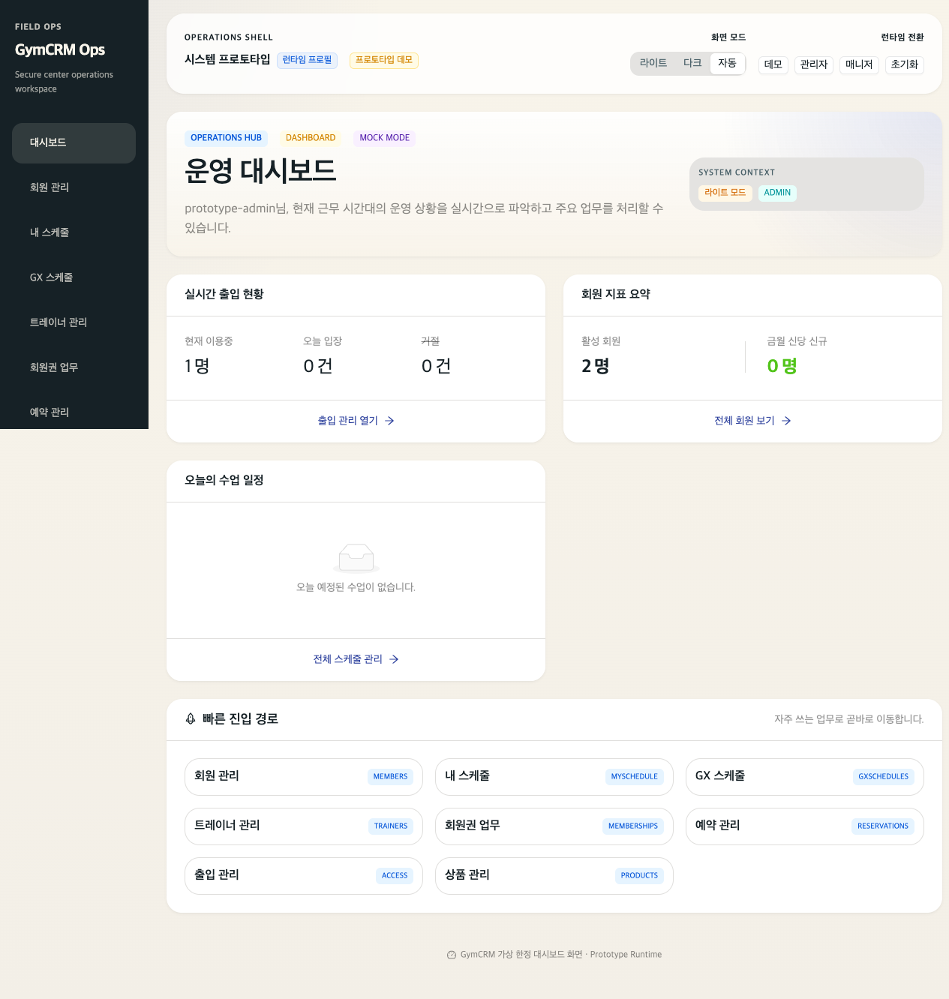

대시보드는 현재 운영 상황을 한눈에 보는 첫 화면이다. 역할에 따라 위젯과 빠른 진입 경로가 달라지며, 자주 가는 화면으로 바로 이동하는 출발점 역할을 한다.

- 확인할 것: 오늘의 운영 상태, 현재 역할, 빠른 진입 경로
- 주의할 점: 대시보드는 결과 화면이 아니라 진입 화면이다. 실제 처리는 각 업무 화면에서 한다.

**업무 흐름**

1. 로그인 직후 오늘 처리할 업무가 무엇인지 먼저 본다.
2. 빠른 진입 경로에서 가장 자주 쓰는 화면을 연다.
3. 위젯이나 상태 카드로 운영 이상 여부를 확인한다.

**실제 작업 예시**

아침 오픈 직후 오늘 입장 예약과 회원권 만료 알림이 많으면, 대시보드에서 예약 관리와 정산 리포트로 먼저 이동해 우선순위를 잡는다.

### 2. 회원 관리

경로: `/members`

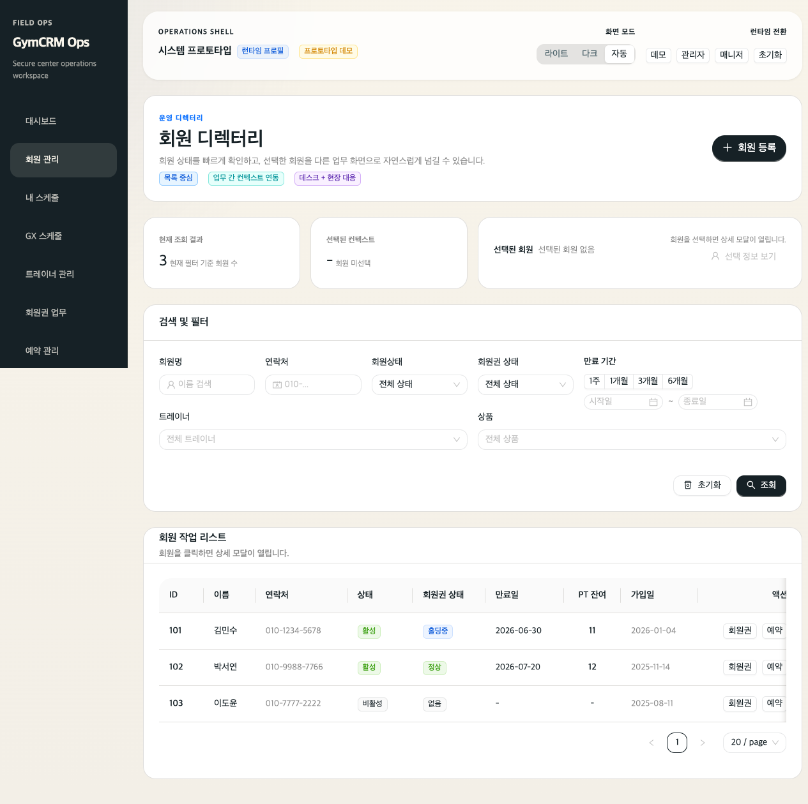

회원 관리 화면은 전체 회원을 찾고, 상태를 보고, 다른 업무에서 사용할 회원을 선택하는 화면이다. 회원권 업무, 예약, 출입, 라커 같은 기능의 출발점이 된다.

- 주요 작업: 회원 검색, 회원 상태 확인, 특정 회원 선택
- 확인할 것: 이름, 연락처, 담당 트레이너, 회원권 운용 상태
- 운영 포인트: 같은 회원을 여러 화면에서 쓸 수 있으므로, 먼저 정확한 회원을 선택하는 것이 중요하다.

**업무 흐름**

1. 이름이나 연락처로 회원을 찾는다.
2. 대상 회원의 상태와 담당 트레이너를 확인한다.
3. 이후 필요한 화면에서 같은 회원을 선택해서 이어서 작업한다.

**실제 작업 예시**

회원이 전화로 "내 예약이 안 보인다"고 문의하면, 먼저 회원 관리에서 동일 회원을 찾고 상태와 담당 트레이너를 확인한 뒤 예약 관리로 넘긴다.

### 3. 회원권 업무

경로: `/memberships`

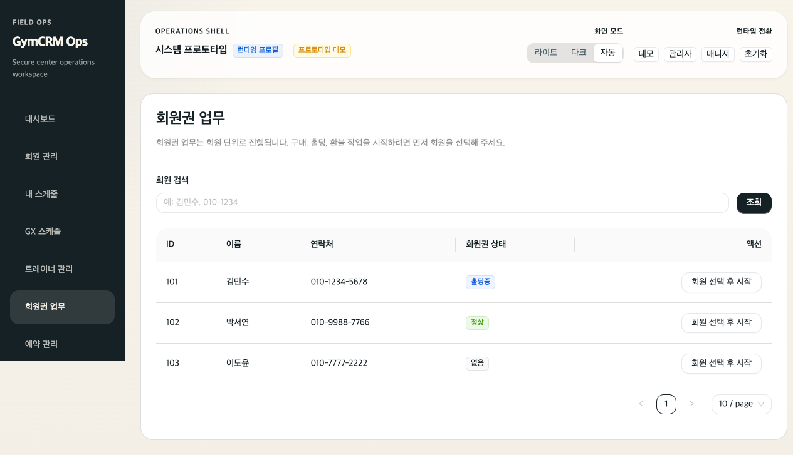
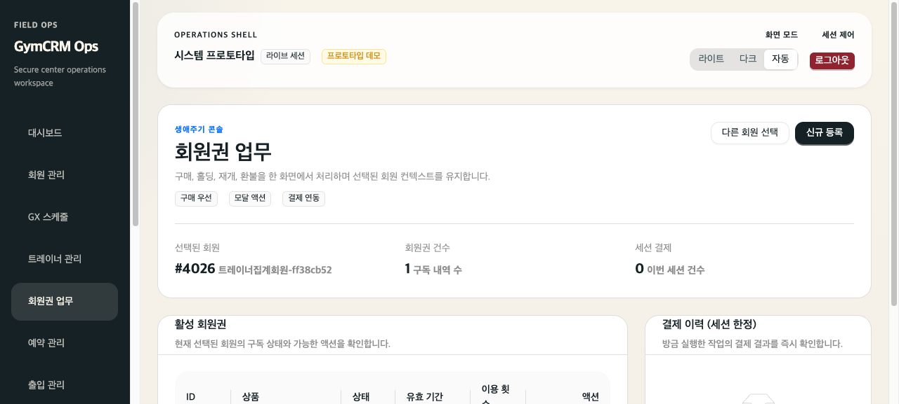

회원권 업무 화면은 특정 회원의 회원권 생애주기를 다루는 핵심 화면이다. 구매, 연장, 홀딩, 재개, 환불 같은 업무를 여기서 처리한다.

- 주요 작업: 신규 등록, 홀딩, 재개, 환불
- 확인할 것: 상품, 담당 트레이너, 시작일, 결제 수단, 결제 금액
- 운영 포인트: 홀딩과 환불은 회원권 상태에 직접 영향을 주므로, 처리 전 현재 상태와 기준일을 먼저 확인한다.

**업무 흐름**

1. 회원을 먼저 선택하고 현재 회원권 목록을 확인한다.
2. 새 구매인지, 홀딩인지, 재개인지, 환불인지 작업 종류를 정한다.
3. 상품과 금액, 날짜, 사유를 확인한 뒤 저장한다.
4. 완료 후 상태 배지와 결제 이력이 기대한 값인지 확인한다.

**실제 작업 예시**

신규 회원이 3개월 PT를 결제하면, 회원을 선택한 뒤 상품과 담당 트레이너, 결제 수단, 시작일을 확인하고 구매를 저장한다.

### 4. 예약 관리

경로: `/reservations`

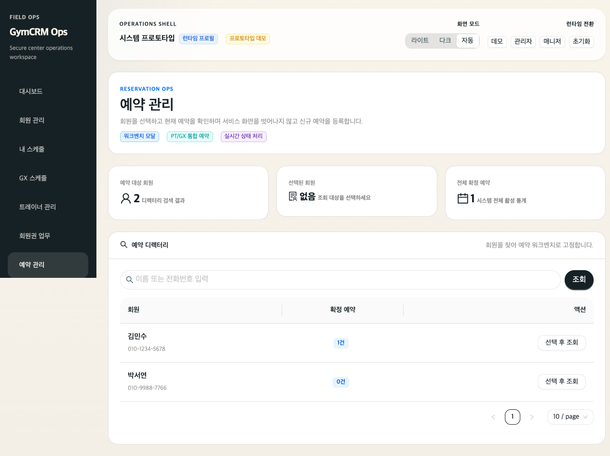
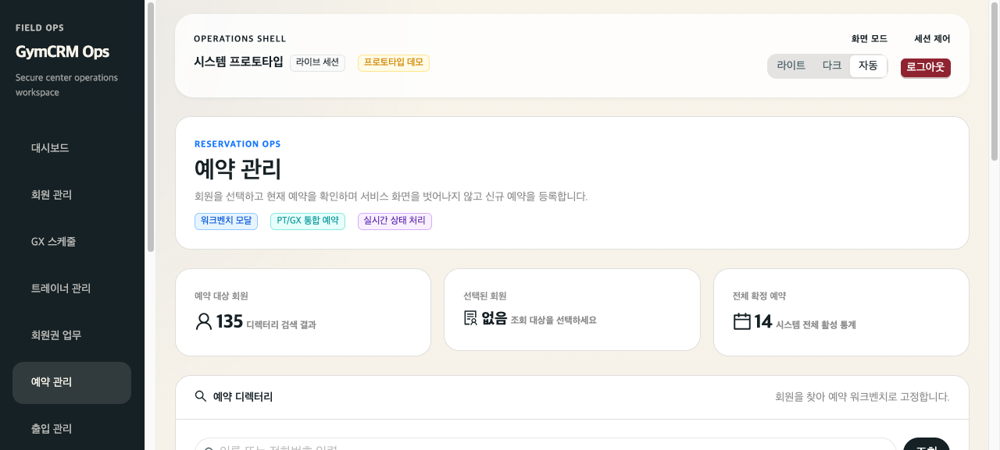

예약 관리 화면은 PT와 GX 예약을 생성하고, 선택된 회원의 예약 상태를 처리하는 화면이다. 회원 선택, 사용 가능한 회원권 확인, 트레이너 및 일정 선택이 함께 일어난다.

- 주요 작업: 예약 생성, 예약 변경, 예약 취소, 체크인, 완료 처리
- 확인할 것: 예약 가능한 회원권인지, PT인지 GX인지, 담당 트레이너, 예약 날짜, 시간대
- 운영 포인트: PT와 GX는 예약 방식이 다르다. PT는 가능한 시간 블록을, GX는 고정 수업 슬롯을 기준으로 본다.

**업무 흐름**

1. 회원을 선택하고 예약 가능한 회원권이 있는지 확인한다.
2. PT인지 GX인지 먼저 구분한다.
3. 트레이너, 날짜, 시간 또는 수업 슬롯을 고른다.
4. 저장 후 예약 상태와 대상 회원권을 다시 확인한다.

**실제 작업 예시**

PT 1회 예약은 회원의 사용 가능한 PT 회원권을 고르고, 가능한 트레이너 시간대를 선택한 뒤 예약을 저장한다. GX 예약은 고정 수업 슬롯을 골라 같은 방식으로 처리한다.

### 5. 상품 관리

경로: `/products`

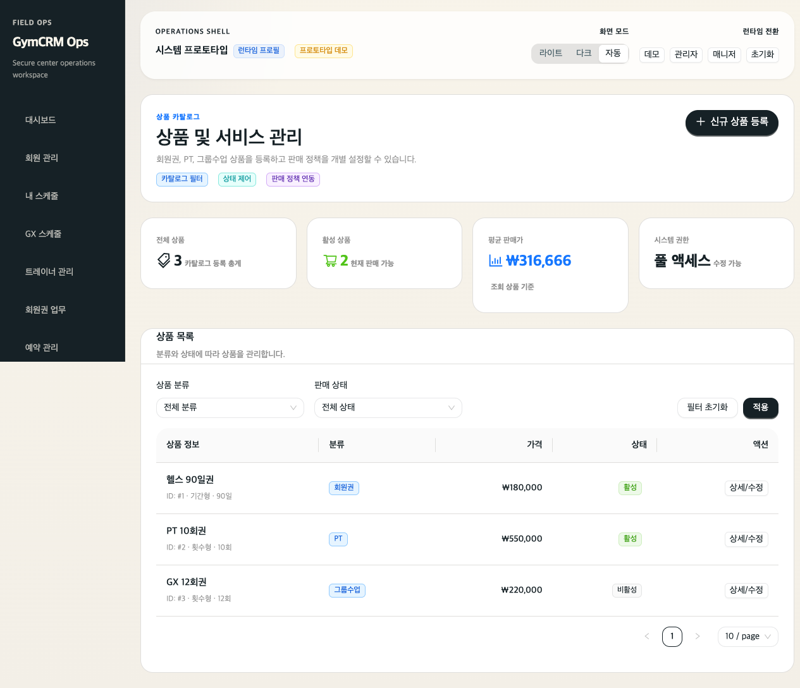

상품 관리 화면은 회원권과 수업의 기준이 되는 상품 카탈로그를 관리하는 화면이다. 상품은 기간형 또는 횟수형일 수 있고, 회원권/ PT / GX / 기타로 구분된다.

- 주요 작업: 상품 조회, 상세 확인, 수정, 활성/비활성 전환
- 확인할 것: 분류, 가격, 기간형/횟수형 여부, 상태
- 운영 포인트: 상품 이름과 유형은 회원권, 예약, 정산에서 모두 연결되므로 변경 전에 영향 범위를 확인한다.

**업무 흐름**

1. 상품 목록에서 분류와 상태를 먼저 찾는다.
2. 상세 화면에서 가격, 기간, 횟수 조건을 확인한다.
3. 수정 시 회원권과 정산에 영향을 주는지 검토한다.
4. 활성/비활성 변경 후 관련 화면에 동일하게 반영됐는지 본다.

**실제 작업 예시**

특정 프로모션 상품을 잠시 중단해야 하면, 상품 상세에서 비활성으로 바꾸고 회원권 업무와 정산 화면에 같은 이름이 그대로 보이는지 확인한다.

### 6. 트레이너 관리

경로: `/trainers`

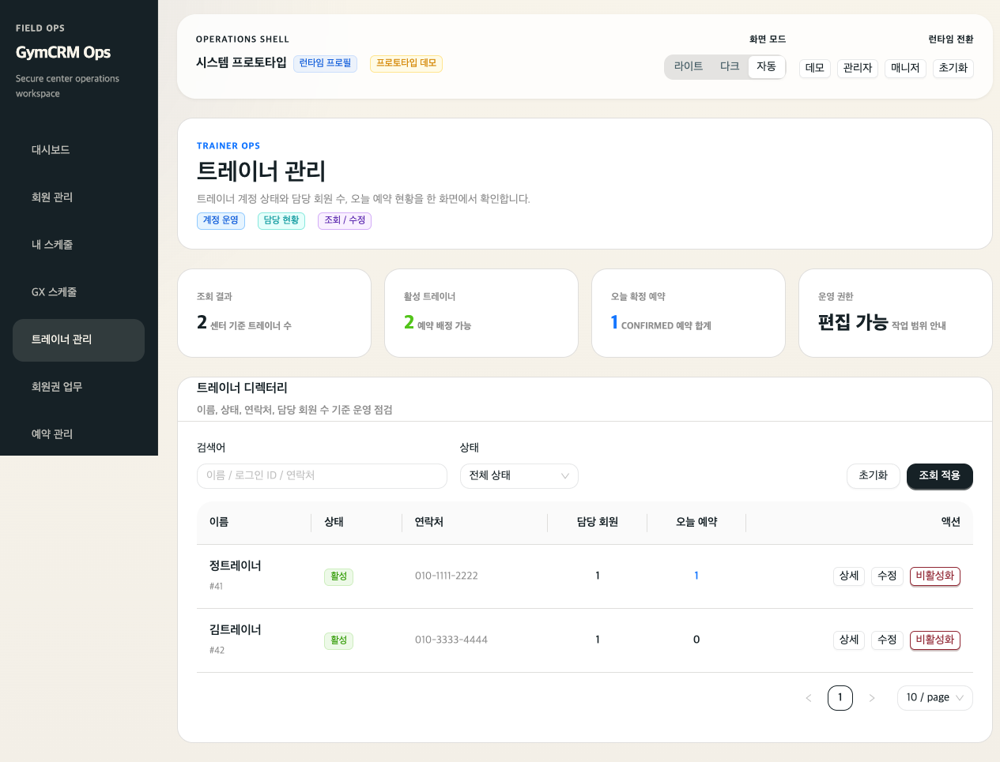

트레이너 관리 화면은 트레이너의 인적 정보, 계정 정보, 담당 범위, 가용 스케줄을 확인하고 수정하는 화면이다.

- 주요 작업: 트레이너 검색, 상세 확인, 등록/수정, 가용 스케줄 확인
- 확인할 것: 이름, 로그인 ID, 연락처, 담당 회원 수, 오늘 예약, PT/GX 단가
- 운영 포인트: 계정 정보와 업무 정보가 같이 보이지만 의미는 다르다. 수정할 때 로그인 정보와 인적 정보를 혼동하지 않는다.

**업무 흐름**

1. 트레이너를 검색하고 목록에서 대상자를 고른다.
2. 상세에서 담당 회원, 오늘 예약, 단가를 먼저 본다.
3. 수정이 필요하면 계정 정보와 업무 정보를 분리해서 입력한다.
4. 저장 후 가용 스케줄과 상태가 기대한 값인지 확인한다.

**실제 작업 예시**

트레이너가 전화번호를 바꿨다면 인적 정보만 수정하고, 로그인 ID나 권한은 건드리지 않은 채 저장 후 예약 배정이 유지되는지 확인한다.

### 7. GX 스케줄

경로: `/gx-schedules`

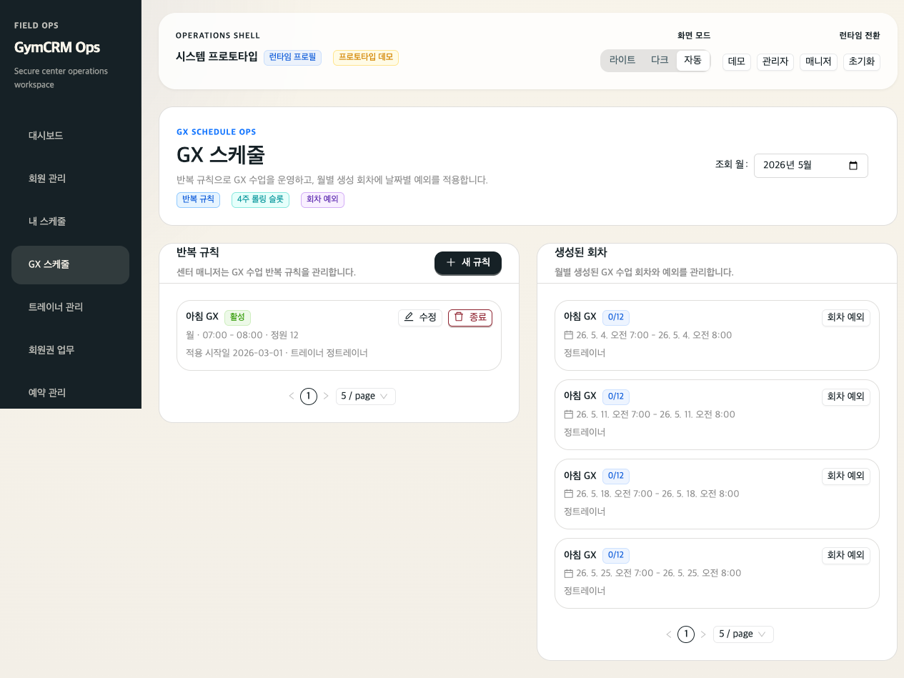

GX 스케줄 화면은 반복 수업 규칙과 실제 생성된 회차, 그리고 회차 예외를 관리하는 화면이다. 주간 반복 규칙과 월별 생성 결과를 함께 확인한다.

- 주요 작업: 반복 규칙 등록/수정, 생성된 회차 확인, 휴강/변경 예외 처리
- 확인할 것: 수업명, 담당 트레이너, 요일, 시작/종료 시간, 정원, 적용 시작일
- 운영 포인트: GX는 `반복 규칙`과 `회차 예외`가 분리되어 있다. 규칙을 바꾸면 이후 회차에 영향을 줄 수 있다.

**업무 흐름**

1. 먼저 대상 월을 선택하고 현재 생성된 회차를 본다.
2. 반복 규칙을 신규 등록하거나 수정한다.
3. 특정 날짜에 예외가 필요하면 휴강 또는 변경으로 처리한다.
4. 저장 후 해당 월의 생성 결과와 예외 반영 여부를 확인한다.

**실제 작업 예시**

매주 화요일 저녁 GX 수업 시간이 바뀌면, 반복 규칙을 수정하고 다음 달 캘린더에서 새 시간이 반영되었는지 확인한다.

### 8. 출입 관리

경로: `/access`

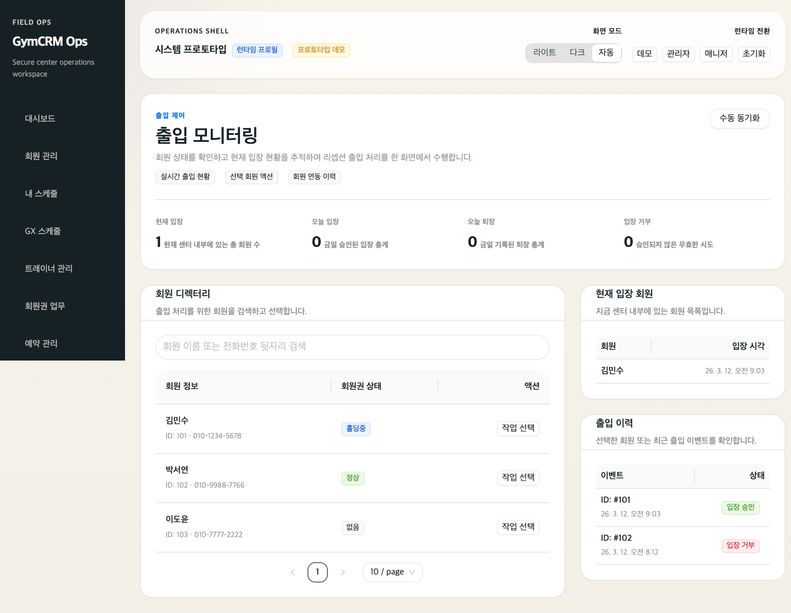

출입 관리 화면은 회원의 입장 승인과 퇴장을 처리하고, 현재 출입 현황을 추적하는 화면이다. 회원 선택 후 출입 기록과 현재 입장 상태를 함께 본다.

- 주요 작업: 입장 처리, 퇴장 처리, 출입 기록 확인
- 확인할 것: 현재 입장 수, 오늘 입장 수, 오늘 퇴장 수, 입장 거부 이력
- 운영 포인트: 출입은 회원 상태와 회원권 상태에 영향을 받는다. 입장이 예상과 다르면 먼저 회원권 상태를 확인한다.

**업무 흐름**

1. 회원을 선택하고 현재 입장 상태를 본다.
2. 입장 승인 또는 퇴장을 처리한다.
3. 입장 거부나 이상 징후가 있으면 회원권 상태와 이력을 확인한다.
4. 처리 결과가 출입 현황과 이벤트 목록에 남았는지 확인한다.

**실제 작업 예시**

회원이 입구에서 "입장이 안 된다"고 하면, 먼저 회원권이 홀딩중인지 만료인지 확인한 뒤 출입 승인 여부를 결정한다.

### 9. 라커 관리

경로: `/lockers`

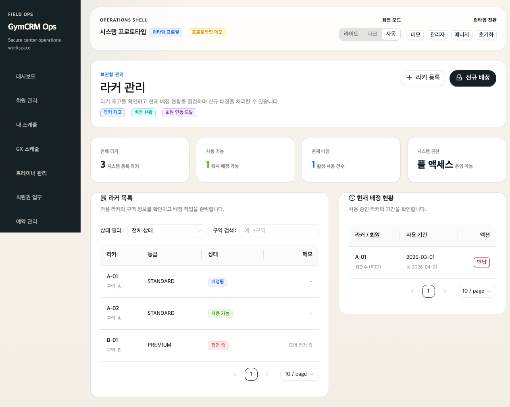

라커 관리 화면은 라커 재고를 보고 회원에게 배정하거나 반납 처리하는 화면이다. 라커 상태와 회원 연동을 같이 관리한다.

- 주요 작업: 라커 생성, 배정, 반납, 상태 확인
- 확인할 것: 라커 코드, 구역, 등급, 상태, 회원명, 사용 기간
- 운영 포인트: 배정 가능한 라커만 실제 사용 가능하다. 점검 중이거나 이미 배정된 라커는 다시 쓰지 않는다.

**업무 흐름**

1. 라커 목록에서 사용 가능 상태를 먼저 찾는다.
2. 회원을 선택하고 배정 정보를 입력한다.
3. 반납 시 사용 기간과 현재 상태를 확인한다.
4. 저장 후 라커 상태와 회원 연동이 정상인지 본다.

**실제 작업 예시**

회원이 라커를 새로 요청하면, 사용 가능 상태의 라커를 골라 배정하고 배정 후 상태가 `배정됨`으로 바뀌었는지 확인한다.

### 10. CRM 메시지

경로: `/crm`

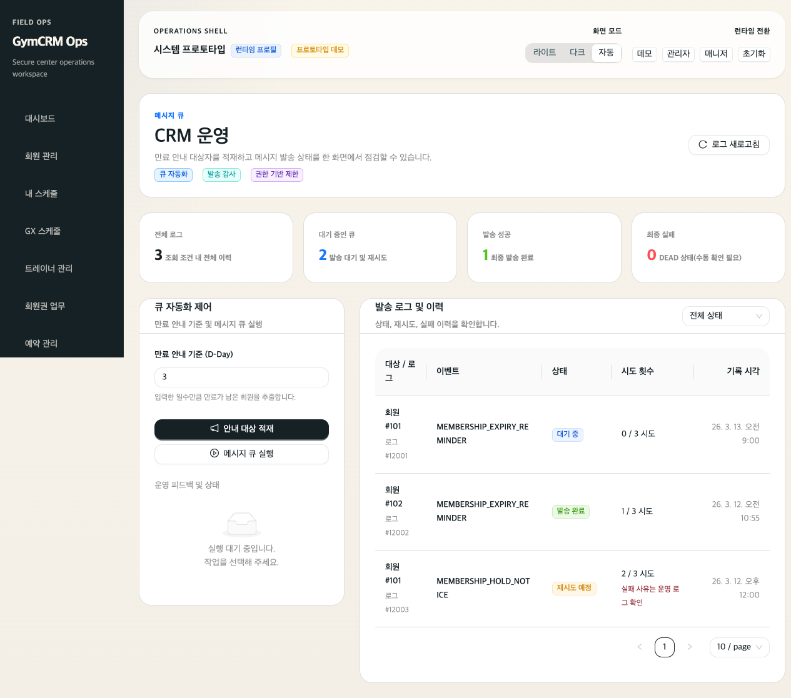

CRM 메시지 화면은 만료 알림 같은 자동 메시지 발송 흐름과 발송 이력을 보는 화면이다. 운영 큐를 처리하고 실패 내역을 확인한다.

- 주요 작업: 만료 알림 트리거, 큐 처리, 발송 이력 확인
- 확인할 것: 발송 상태, 시도 횟수, 실패 사유, 기록 시각
- 운영 포인트: 메시지는 한 번에 끝나지 않고 대기, 재시도, 실패 상태를 거칠 수 있다.

**업무 흐름**

1. 발송 대상과 조건을 먼저 정한다.
2. 알림 트리거를 실행하거나 큐를 처리한다.
3. 실패나 재시도 항목이 있으면 상태와 원인을 확인한다.
4. 발송 이력이 기대한 회원과 상태로 남았는지 확인한다.

**실제 작업 예시**

만료 예정 회원에게 안내 메시지를 보내야 하면, 트리거를 실행한 뒤 대기 중인 건이 정상 발송으로 바뀌는지 이력에서 확인한다.

### 11. 정산 리포트

경로: `/settlements`

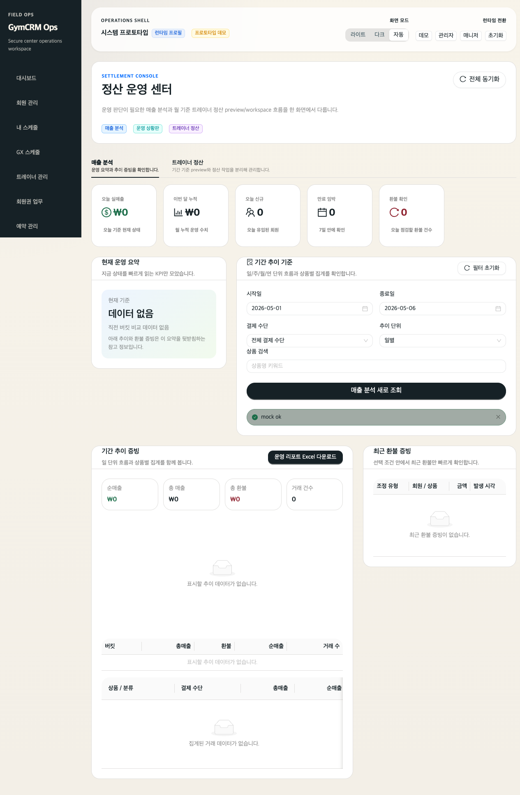

정산 리포트 화면은 센터 매출과 트레이너 정산을 보는 화면이다. `매출 분석`과 `트레이너 정산` 두 탭으로 나뉜다.

- `매출 분석`: 기간별 순매출, 총 매출, 총 환불, 거래 건수, 추이 리포트
- `트레이너 정산`: 정산 월 기준 preview와 정산 작업 상태
- 확인할 것: 기간, 결제 수단, 상품 검색, 환불 내역, preview 총액
- 운영 포인트: 트레이너는 본인 기준 preview를 볼 수 있고, 관리자는 전체 정산 흐름을 본다.

**업무 흐름**

1. 먼저 기간과 결제 수단을 맞춘다.
2. 매출 분석 탭에서 센터 전체 흐름을 확인한다.
3. 트레이너 정산 탭에서 preview와 상태를 확인한다.
4. 수치가 이상하면 최근 환불과 대상 기간을 다시 본다.

**실제 작업 예시**

월말 정산 전에 특정 트레이너의 preview 금액이 맞는지 확인할 때는 정산 월을 고정하고, 환불이 많은 주간은 매출 분석 탭에서 함께 본다.

### 12. 감사 로그

경로: `/audit`

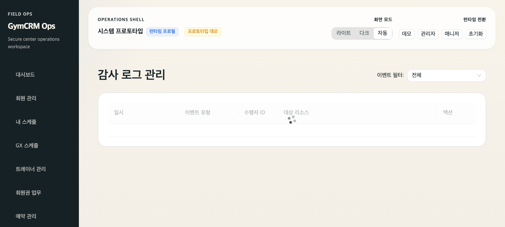

감사 로그 화면은 누가 언제 무엇을 했는지 추적하는 화면이다. 문제 발생 시 사실 관계를 확인하는 데 쓴다.

- 주요 작업: 로그 조회, 상세 보기, 원본 데이터 확인
- 확인할 것: 수행자, 실행 일시, 대상 리소스, traceId, JSON 원문
- 운영 포인트: 운영 화면에서 결과가 이상할 때는 먼저 감사 로그로 작업 흔적을 확인한다.

**업무 흐름**

1. 문제가 생긴 화면의 시각대를 먼저 좁힌다.
2. 수행자와 대상 리소스로 관련 로그를 찾는다.
3. 상세 보기에서 traceId와 원본 JSON을 확인한다.

**실제 작업 예시**

회원권 환불이 저장됐다고 보였는데 상태가 바뀌지 않았다면, 감사 로그에서 같은 시간대의 환불 작업과 traceId를 찾아 원인을 확인한다.

### 13. 시스템 설정

경로: `/settings`

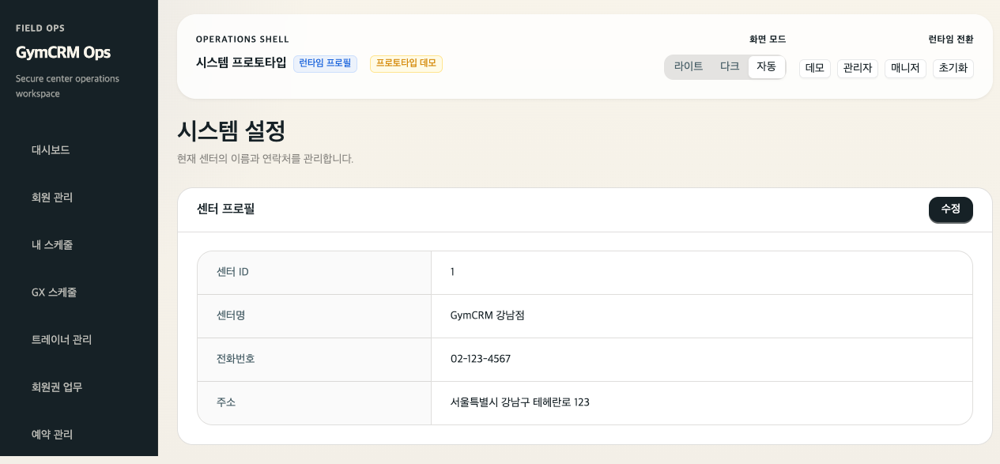

시스템 설정 화면은 센터 이름, 전화번호, 주소 같은 기본 센터 프로필을 관리하는 화면이다.

- 주요 작업: 센터 정보 조회, 수정, 저장
- 확인할 것: 센터명, 연락처, 주소
- 운영 포인트: 저장 전후로 다른 화면에 영향이 없는지 확인하고, 변경 사실을 운영자에게 공유한다.

**업무 흐름**

1. 현재 센터 정보를 확인한다.
2. 수정할 항목만 바꾸고 나머지는 그대로 둔다.
3. 저장 후 다른 화면에서 센터명이 정상 반영됐는지 확인한다.

**실제 작업 예시**

센터 전화번호가 바뀌면 시스템 설정에서 수정하고, 저장 뒤 대시보드와 상단 헤더에 같은 정보가 보이는지 확인한다.

### 14. 사용자 계정 관리

경로: `/user-accounts`

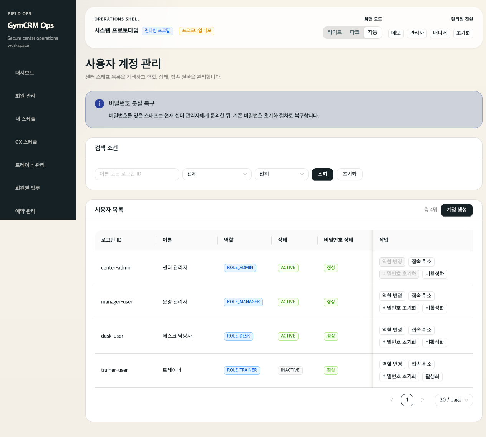

사용자 계정 관리 화면은 스태프 계정을 만들고, 역할과 상태를 통제하는 화면이다. 관리자 권한이 있는 사람만 주로 사용한다.

- 주요 작업: 계정 생성, 역할 변경, 접속 취소, 활성/비활성 전환
- 확인할 것: 로그인 ID, 이름, 역할, 계정 상태, 임시 비밀번호 상태, 최근 로그인, 접속 제한 시점
- 운영 포인트: 접속 취소는 기존 세션을 즉시 무효화한다. 역할 변경은 업무 범위를 바꾸므로 신중히 처리한다.

**업무 흐름**

1. 신규 계정이 필요한지 기존 계정 수정이 필요한지 먼저 구분한다.
2. 역할과 상태를 확인한 뒤 변경 작업을 실행한다.
3. 접속 취소가 필요한 경우 즉시 세션 무효화 여부를 재확인한다.
4. 변경 후 실제 로그인 동작이 기대한 권한으로 나오는지 확인한다.

**실제 작업 예시**

신규 데스크 직원을 추가할 때는 계정을 생성하고 역할을 부여한 뒤, 테스트 로그인으로 회원 관리와 예약 관리 메뉴가 보이는지 확인한다.

### 15. 내 스케줄

경로: `/my-schedule`

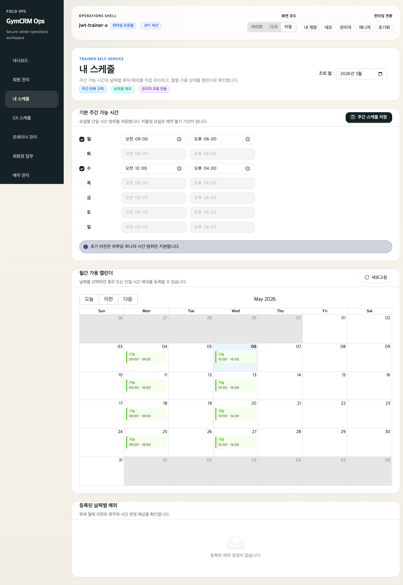

내 스케줄 화면은 트레이너가 본인의 주간 가능 시간과 날짜별 예외를 관리하는 화면이다. 기본 스케줄과 예외 스케줄을 구분해서 다룬다.

- 주요 작업: 주간 스케줄 저장, 날짜별 예외 등록/삭제, 월별 가용 확인
- 확인할 것: 요일별 가능 시간, 휴무 여부, 예외 시간, 메모
- 운영 포인트: 기본 스케줄과 예외 스케줄은 함께 봐야 한다. 월별 캘린더에서 현재 상태를 먼저 확인한다.

**업무 흐름**

1. 먼저 대상 월을 선택한다.
2. 요일별 기본 스케줄을 입력하거나 수정한다.
3. 특정 날짜는 예외로 덮어쓴다.
4. 저장 후 캘린더와 목록에서 반영 여부를 확인한다.

**실제 작업 예시**

트레이너가 이번 달 마지막 주에 휴무를 넣어야 하면, 해당 날짜를 예외로 등록한 뒤 월간 캘린더에서 OFF로 반영됐는지 확인한다.

### 16. 내 계정

경로: `/my-account`

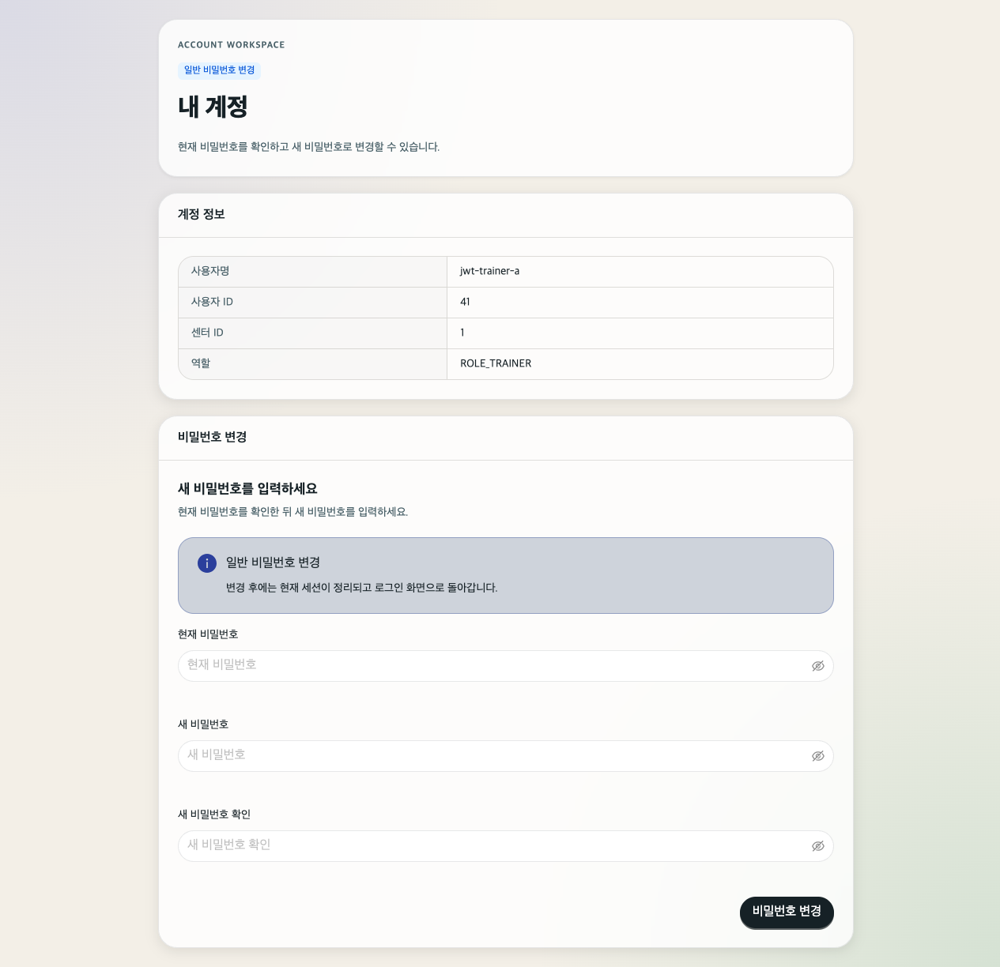

내 계정 화면은 로그인한 사용자가 비밀번호를 변경하는 화면이다. 임시 비밀번호 상태이거나 일반 변경이 필요한 경우 모두 여기서 처리한다.

- 주요 작업: 비밀번호 변경
- 확인할 것: 현재 비밀번호 여부, 새 비밀번호, 새 비밀번호 확인
- 운영 포인트: 비밀번호 변경 후에는 현재 세션이 정리되고 다시 로그인해야 할 수 있다.

**업무 흐름**

1. 현재 비밀번호 입력이 필요한지 확인한다.
2. 새 비밀번호와 확인 값을 일치시켜 입력한다.
3. 변경 후 로그아웃 또는 세션 종료 안내가 나오면 그대로 따른다.

**실제 작업 예시**

임시 비밀번호로 처음 로그인한 직원은 내 계정에서 새 비밀번호를 설정하고, 이후 다시 로그인해 정상 접근이 되는지 확인한다.

## 자주 헷갈리는 점

### 회원 관리와 회원권 업무는 다르다

- `회원 관리`는 사람을 찾고 상태를 보는 화면이다.
- `회원권 업무`는 그 사람이 가진 이용 권한을 다루는 화면이다.

### 예약과 출입은 연결되어 있다

- 예약이 있어도 회원권 상태가 맞지 않으면 기대한 흐름이 안 나올 수 있다.
- 출입 이상이 보이면 예약보다 먼저 회원권 상태를 확인하는 것이 좋다.

### 정산은 두 층위로 본다

- `매출 분석`은 센터 전체 흐름을 본다.
- `트레이너 정산`은 사람별 정산 흐름을 본다.

### 감사 로그는 문제 해결의 기준선이다

- 누가, 언제, 무엇을 했는지 먼저 본다.
- 화면 결과만 보지 말고 traceId와 상세 원본도 같이 확인한다.

## 문제 해결 체크리스트

### 메뉴가 보이지 않을 때

- 현재 역할이 해당 메뉴를 볼 수 있는지 확인한다.
- 로그인이 정상인지 확인한다.
- `내 계정`으로 강제 이동 중인지 확인한다.

### 목록이 비어 보일 때

- 검색어와 필터를 초기화한다.
- 현재 조회 범위가 너무 좁지 않은지 확인한다.
- 권한상 조회 가능한 범위인지 확인한다.

### 상태값이 헷갈릴 때

- 회원 상태와 회원권 상태를 구분한다.
- 예약 상태와 출입 상태를 구분한다.
- 라커 상태는 재고 상태와 실제 배정 상태를 함께 본다.

### 저장이 안 될 때

- 필수값이 비어 있지 않은지 확인한다.
- 권한이 편집 가능 범위인지 확인한다.
- 오류 메시지와 감사 로그를 함께 본다.

## 부록

### 화면 캡처 파일

- 대시보드: `notes/manual-dashboard-current.png`
- 회원 관리: `notes/manual-members-current.png`
- 회원권 업무: `notes/manual-memberships-current.png`
- 회원권 모달: `notes/manual-memberships-modal-current.png`
- 예약 관리: `notes/manual-reservations-current.png`
- 예약 모달: `notes/manual-reservations-modal-current.png`
- 상품 관리: `notes/manual-products-current.png`
- 출입 관리: `notes/manual-access-current.png`
- 라커 관리: `notes/manual-lockers-current.png`
- CRM 메시지: `notes/manual-crm-current.png`
- 정산 리포트: `notes/manual-settlements-current.png`

### 관련 문서

- [화면 정의서](07_화면_정의서.md)
- [내부 운영 사용자 매뉴얼 요약본](GymCRM_V2_User_Manual_Wiki_Summary.md)
- [요구사항 문서](brainstorms/2026-04-24-internal-admin-user-manual-requirements.md)
