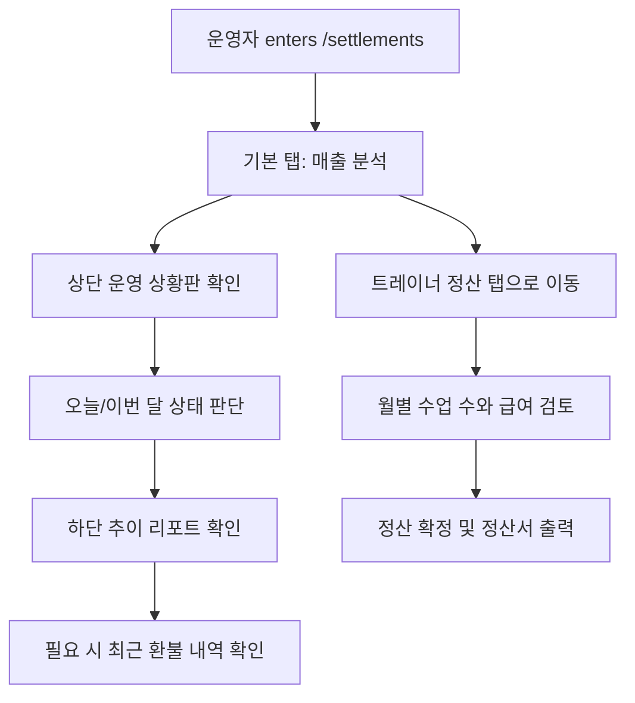

# 정산 모듈 운영 상황판 및 트레이너 정산 완성

## Problem Frame
현재 `frontend/src/pages/settlements/SettlementsPage.tsx`는 정산 리포트 중심의 단일 화면으로 동작하며, 운영자가 `/settlements`에 진입했을 때 오늘과 이번 달의 상태를 즉시 파악하는 경험은 부족하다. 매출/정산 모듈은 요구사항 문서 기준으로 대시보드, 기간별 추이 분석, 최근 환불 확인, 트레이너 정산까지 포함해야 하지만, 실제 운영 흐름에서는 먼저 "지금 센터 상태를 빠르게 읽는 것"이 가장 높은 가치다.

이번 브레인스토밍은 `/settlements`를 하나의 정산 진입점으로 유지하면서, 1차에서는 운영 상황판과 매출 추이 분석을 완성하고, 2차에서는 트레이너 정산 조회부터 정산서 출력까지 이어지는 흐름을 명확히 정의하는 데 목적이 있다.

## Requirements

**[정보 구조 및 진입 경험]**
- R1. `/settlements`는 정산 업무의 단일 진입점으로 유지하며, 화면은 `매출 분석` 탭과 `트레이너 정산` 탭의 2개 탭 구조로 제공한다.
- R2. 사용자가 `/settlements`에 처음 진입하면 기본 선택 탭은 `매출 분석`이어야 한다.
- R3. `매출 분석` 탭은 "운영자가 센터의 현재 매출 상태를 빠르게 읽는 것"을 최우선 목표로 설계한다.
- R4. `트레이너 정산` 탭은 2차 범위이지만 같은 문서와 같은 화면 체계 안에서 후속 확장 가능한 독립 업무 영역으로 정의한다.

**[1차: 매출 분석 탭]**
- R5. `매출 분석` 탭의 최상단에는 운영 상황판형 대시보드를 배치하고, 하단에는 상세 분석 영역을 배치한다.
- R6. 상단 대시보드는 최소한 `오늘 순매출`, `이번 달 순매출`, `신규 회원수`, `만료 예정 회원수`, `환불 건수`를 한눈에 확인할 수 있어야 한다.
- R7. 대시보드는 숫자 요약 중심으로 구성하며, 운영자가 상세 분석으로 내려가기 전 "지금 상태가 좋은지 나쁜지"를 빠르게 판단할 수 있어야 한다.
- R8. 하단 상세 분석 영역의 1차 역할은 기간별 매출 추이를 읽는 것이어야 한다.
- R9. 기간별 매출 추이는 `일`, `주`, `월`, `연` 단위를 모두 지원해야 한다.
- R10. 기간별 매출 추이는 운영자가 시간 흐름에 따른 매출 변화를 비교하고 이상 징후를 파악할 수 있도록 표현되어야 한다.
- R11. 매출 분석 탭에는 최근 환불 내역을 확인할 수 있는 간단한 상세 목록을 포함해야 한다.
- R12. 환불 상세 목록은 최신순 정렬을 기본으로 하여, 운영자가 방금 발생한 차감 이슈를 가장 먼저 볼 수 있어야 한다.
- R13. 1차 범위의 환불 목록은 원인 확인과 운영 검토를 돕는 수준으로 제한하며, 전용 심화 분석 화면 수준의 확장은 포함하지 않는다.

**[2차: 트레이너 정산 탭]**
- R14. `트레이너 정산` 탭은 월별 기준으로 트레이너별 수업 수와 급여 산정 결과를 조회할 수 있어야 한다.
- R15. 운영자는 조회한 정산 결과를 검토한 뒤 정산 확정까지 이어갈 수 있어야 한다.
- R16. 확정된 정산 결과는 정산서 형태로 출력할 수 있어야 한다.
- R17. 정산서 출력은 운영자가 실제 지급 또는 내부 보관 업무에 사용할 수 있는 마감 산출물이어야 한다.
- R18. 트레이너 정산 탭은 매출 분석 탭과 분리된 맥락을 유지하되, 같은 `/settlements` 진입점 안에서 자연스럽게 접근 가능해야 한다.

## Success Criteria
- 운영자가 `/settlements` 진입 직후 추가 탐색 없이 오늘과 이번 달의 핵심 상태를 이해할 수 있다.
- 운영자는 대시보드 숫자를 본 뒤 같은 화면 안에서 기간별 추이와 최근 환불 내역까지 이어서 확인할 수 있다.
- 정산 모듈의 1차 목적이 "정산 리포트 조회"가 아니라 "운영 상황 읽기 + 근거 확인"으로 재정의된다.
- 후속 2차 작업에서 트레이너 정산이 별도 재설계 없이 동일 진입점의 탭 확장으로 이어질 수 있다.
- 트레이너 정산 탭은 월별 조회, 확정, 정산서 출력까지 완결된 업무 흐름의 요구사항을 제공한다.

## Scope Boundaries
- 1차 범위는 `매출 분석` 탭 완성이며, `트레이너 정산` 탭은 이번 문서에 요구사항을 정의하되 실제 구현 우선순위는 후순위로 둔다.
- 1차 범위의 환불 처리는 최근 내역 확인 수준까지만 포함하며, 전용 심화 분석 경험이나 복잡한 감사성 탐색은 포함하지 않는다.
- `/settlements`를 여러 개의 별도 메뉴나 별도 메인 진입점으로 쪼개지 않는다.
- 트레이너 정산 요구사항은 포함하지만, 이번 브레인스토밍에서는 급여 정책 자체의 사업 규칙 변경까지 다루지 않는다.

## Key Decisions
- `/settlements`를 유지한 탭 분리: 진입점은 하나로 유지하되 `매출 분석`과 `트레이너 정산`의 목적을 탭으로 분리해 화면 집중도를 높인다.
- 1차 목표는 운영 상황 읽기: 첫 릴리스의 핵심 가치는 정산 계산 자체보다 운영자가 상태를 빠르게 읽는 경험에 둔다.
- 대시보드 우선 구조: 첫 화면은 리포트가 아니라 운영 상황판이 주도하고, 리포트는 그 판단을 뒷받침하는 하단 분석 영역으로 배치한다.
- 환불은 얕고 빠르게: 1차에는 상세 최신 목록까지 포함하되, 전용 분석 도구로 확장하지 않는다.
- 트레이너 정산은 2차 완결 흐름: 단순 조회에 그치지 않고 조회, 확정, 정산서 출력까지 하나의 업무 흐름으로 정의한다.

## Dependencies / Assumptions
- 현재 매출/정산 관련 백엔드 집계 API와 정산 리포트 화면이 이미 일부 존재하며, 이번 요구사항은 그 위에 사용자 경험과 범위를 재정의하는 성격을 가진다.
- `docs/01_요구사항_분석서.md`의 매출/정산 필수 요구사항과 충돌하지 않도록, 이번 문서는 이를 운영 흐름 중심으로 재구성하는 보완 문서로 사용한다.
- `docs/04_API_설계서.md`와 구현 간 차이가 존재할 수 있으며, planning 단계에서 어떤 계약을 기준으로 정렬할지 결정이 필요하다.

## Outstanding Questions

### Deferred to Planning
- [Affects R6-R13][Technical] 현재 `/settlements` 화면을 탭 구조로 확장할 때 하나의 페이지 컴포넌트 안에서 상태를 나눌지, 탭별 하위 모듈 구성을 분리할지 정리할 필요가 있다.
- [Affects R6-R12][Technical] 대시보드 지표와 추이 리포트를 동일 데이터 원천에서 계산할지, 성격이 다른 조회로 나눌지 planning 단계에서 판단해야 한다.
- [Affects R11-R13][Needs research] 최근 환불 목록에서 운영 검토에 꼭 필요한 최소 표시 항목이 무엇인지 기존 데이터 구조와 함께 확인이 필요하다.
- [Affects R14-R17][Technical] 트레이너 정산의 확정 상태와 정산서 출력 흐름을 기존 API 계약에 맞출지, 현 구현 방향에 맞춰 API 계약을 개정할지 planning 단계에서 결정해야 한다.
- [Affects R16-R17][Needs research] 정산서 출력물의 형식과 수준을 PDF 중심으로 정의할지, 다른 출력 형식과 병행할지 planning 단계에서 검토가 필요하다.

## Next Steps
→ `/ce:plan` for structured implementation planning
