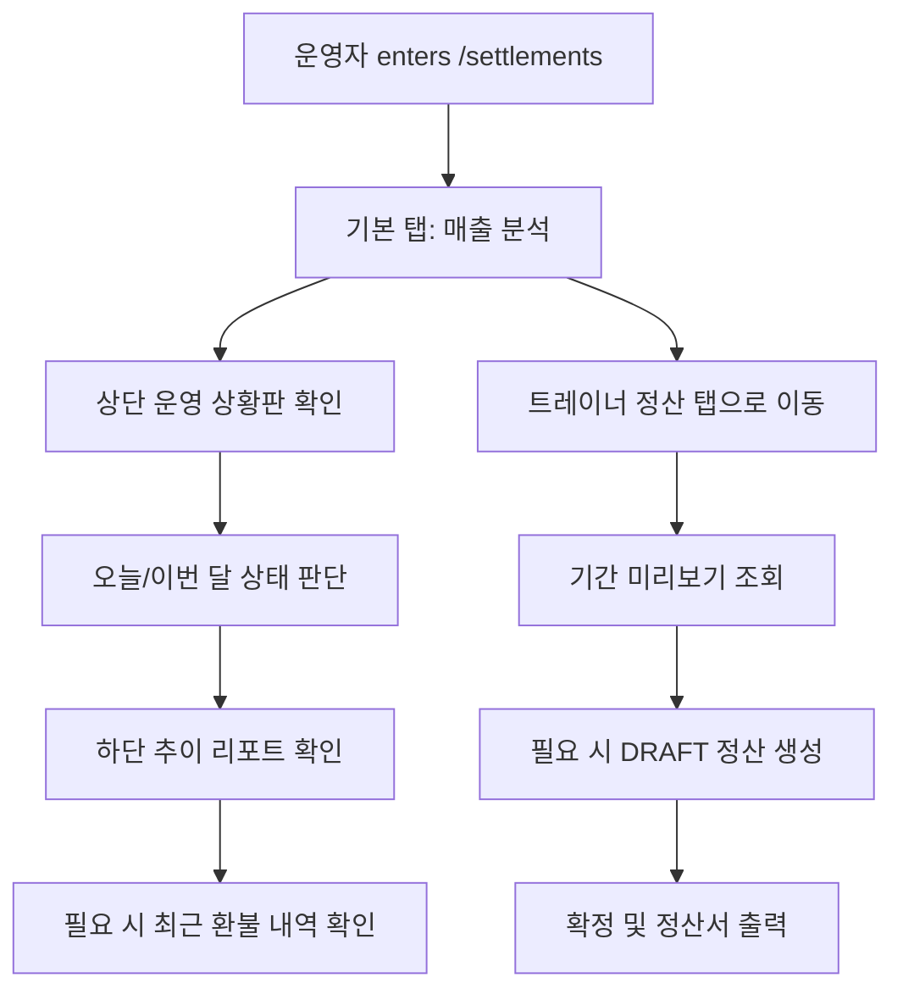

# 정산 모듈 운영 상황판 및 트레이너 정산 완성

## Problem Frame
현재 `frontend/src/pages/settlements/SettlementsPage.tsx`는 정산 리포트 중심의 단일 화면으로 동작하며, 운영자가 `/settlements`에 진입했을 때 오늘과 이번 달의 상태를 즉시 파악하는 경험은 부족하다. 매출/정산 모듈은 요구사항 문서 기준으로 대시보드, 기간별 추이 분석, 최근 환불 확인, 트레이너 정산까지 포함해야 하지만, 실제 운영 흐름에서는 먼저 "지금 센터 상태를 빠르게 읽는 것"이 가장 높은 가치다.

이번 브레인스토밍은 `/settlements`를 하나의 정산 진입점으로 유지하면서, 1차에서는 운영 상황판과 매출 추이 분석을 완성하고, 2차에서는 트레이너 정산 조회부터 정산서 출력까지 이어지는 흐름을 명확히 정의하는 데 목적이 있다. 2026-04-10 재개 세션에서는 특히 "월별 정산"을 "기간 기반 정산"으로 전환할지, 운영 UI가 현재 복구된 정산 API를 어떻게 반영해야 하는지, 트레이너 미니뷰를 같은 기간 언어로 통일할지를 planning 전에 확정한다.

## Requirements

**[정보 구조 및 진입 경험]**
- R1. `/settlements`는 정산 업무의 단일 진입점으로 유지하며, 화면은 `매출 분석` 탭과 `트레이너 정산` 탭의 2개 탭 구조로 제공한다.
- R2. 사용자가 `/settlements`에 처음 진입하면 기본 선택 탭은 `매출 분석`이어야 한다.
- R3. `매출 분석` 탭은 "운영자가 센터의 현재 매출 상태를 빠르게 읽는 것"을 최우선 목표로 설계한다.
- R4. `트레이너 정산` 탭은 2차 범위이지만 같은 문서와 같은 화면 체계 안에서 후속 확장 가능한 독립 업무 영역으로 정의한다.

**[1차: 매출 분석 탭]**
- R5. `매출 분석` 탭의 최상단에는 운영 상황판형 대시보드를 배치하고, 하단에는 상세 분석 영역을 배치한다.
- R6. 상단 대시보드는 최소한 `오늘 순매출`, `이번 달 순매출`, `신규 회원수`, `만료 예정 회원수`, `환불 건수`를 한눈에 확인할 수 있어야 한다.
- R7. 대시보드는 숫자 요약 중심으로 구성하며, 운영자가 상세 분석으로 내려가기 전 "지금 상태가 좋은지 나쁜지"를 빠르게 판단할 수 있어야 한다.
- R8. 하단 상세 분석 영역의 1차 역할은 기간별 매출 추이를 읽는 것이어야 한다.
- R9. 기간별 매출 추이는 `일`, `주`, `월`, `연` 단위를 모두 지원해야 한다.
- R10. 기간별 매출 추이는 운영자가 시간 흐름에 따른 매출 변화를 비교하고 이상 징후를 파악할 수 있도록 표현되어야 한다.
- R11. 매출 분석 탭은 다운로드 시 실제 Excel(`.xlsx`) 형식의 리포트를 제공해야 하며, 운영자가 열자마자 컬럼/금액/날짜를 읽기 쉬운 보고서 형태여야 한다.
- R12. 매출 분석 탭에는 최근 환불 내역을 확인할 수 있는 간단한 상세 목록을 포함해야 한다.
- R13. 환불 상세 목록은 최신순 정렬을 기본으로 하여, 운영자가 방금 발생한 차감 이슈를 가장 먼저 볼 수 있어야 한다.
- R14. 1차 범위의 환불 목록은 원인 확인과 운영 검토를 돕는 수준으로 제한하며, 전용 심화 분석 화면 수준의 확장은 포함하지 않는다.

**[2차: 트레이너 정산 탭]**
- R15. `트레이너 정산` 탭은 `시작일-종료일` 기준으로 트레이너별 수업 수와 급여 산정 결과를 조회할 수 있어야 한다.
- R16. 정산 조회는 저장된 정산 리소스를 자동 생성하지 않는 미리보기 성격이어야 하며, 운영자가 명시적으로 생성 액션을 눌렀을 때만 DRAFT 정산이 만들어져야 한다.
- R17. 운영자 화면은 `기간 조회 영역`과 `정산 작업 영역`을 분리해, 탐색용 조회와 DRAFT/CONFIRMED 업무 액션이 서로 다른 상태임을 명확히 보여줘야 한다.
- R18. 운영자는 같은 기간 기준으로 `전체 트레이너(ALL)` 정산과 `개별 트레이너` 정산을 모두 생성할 수 있어야 한다.
- R19. 확정된 정산은 기간 겹침을 허용하지 않아야 하며, 충돌 판단은 정산 대상 범위 기준으로 처리해야 한다.
- R20. `ALL`로 확정된 기간은 센터 전체를 잠그고, 개별 트레이너로 확정된 기간은 해당 트레이너만 잠가야 한다.
- R21. 새 정산 생성 또는 확정 시, 대상 범위와 겹치는 기존 확정 정산이 있으면 차단하고 충돌 기간과 대상 정보를 사용자에게 보여줘야 한다.
- R22. 정산 계산의 단가는 운영자 입력이 아니라 트레이너별 저장 단가를 source-of-truth로 사용해야 한다.
- R23. 트레이너는 본인 기간 기준 수업 집계와 급여 산정 결과를 조회할 수 있어야 하지만, 다른 트레이너 데이터에는 접근할 수 없어야 한다.
- R24. 트레이너 화면도 운영자와 동일하게 `시작일-종료일` 기준 조회 모델을 사용해야 하지만, 경험은 본인 미리보기 조회에 집중된 단순한 형태를 유지해야 한다.
- R25. 트레이너에게는 DRAFT 생성, 확정, 정산서 출력 권한을 부여하지 않는다.
- R26. 확정된 정산 결과는 PDF 정산서 형태로 출력할 수 있어야 하며, 운영자는 대상 정산 문서를 관리하고 트레이너는 본인에게 확정된 정산서만 열람할 수 있어야 한다.
- R27. 트레이너 정산 탭은 매출 분석 탭과 분리된 맥락을 유지하되, 같은 `/settlements` 진입점 안에서 자연스럽게 접근 가능해야 한다.

| Mode | 조회 기준 | 생성 여부 | 권한 |
|---|---|---|---|
| 운영자 미리보기 | 시작일-종료일 + `ALL/개별 트레이너` | 자동 생성 안 함 | 조회 가능 |
| 운영자 정산 작업 | 미리보기 결과 기반 | 명시적 생성 시 DRAFT | 생성/확정/PDF 가능 |
| 트레이너 미니뷰 | 시작일-종료일 + 본인만 | 생성 안 함 | 본인 조회만 가능 |

## Phase 2: KPI / Reporting Consolidation

Phase 1에서 운영 상황판, 기간별 추이, 환불 확인, 정산 흐름의 큰 틀은 잡혔다. 남은 일은 `매출 분석` 탭에서 KPI와 reporting 문구를 더 일관된 운영 언어로 정리해, 운영자가 숫자와 해석을 함께 빠르게 읽을 수 있게 만드는 것이다.

Phase 2는 아래 3개 소주제로 나누어 정리한다.

### KPI Definition
- R28. `매출 분석` 탭의 KPI는 지금 상태를 읽는 요약에 집중해야 하며, 상세 해석은 하단 reporting 영역과 함께 제공되어야 한다.

### Reporting Wording
- R30. KPI, 추이, 환불, export 문구는 서로 의미가 겹치지 않도록 정리해야 하며, 각 표면은 하나의 역할만 분명하게 가져야 한다.

### Surface Organization
- R29. Phase 2는 새로운 진입점이나 별도 탭을 만들지 않고, 기존 `/settlements` 안에서 KPI와 reporting 표면을 정리하는 범위로 제한한다.
- R31. Phase 2의 산출물은 새로운 데이터 모델이나 export 형식이 아니라, 현재 존재하는 표면의 우선순위와 설명 방식의 정리여야 한다.

## Success Criteria
- 운영자가 `/settlements` 진입 직후 추가 탐색 없이 오늘과 이번 달의 핵심 상태를 이해할 수 있다.
- 운영자는 대시보드 숫자를 본 뒤 같은 화면 안에서 기간별 추이와 최근 환불 내역까지 이어서 확인할 수 있다.
- 정산 모듈의 1차 목적이 "정산 리포트 조회"가 아니라 "운영 상황 읽기 + 근거 확인"으로 재정의된다.
- 후속 2차 작업에서 트레이너 정산이 기간 기반 워크플로우로 전환되어도 동일 진입점의 탭 확장 안에서 자연스럽게 이어질 수 있다.
- 운영자는 매출 리포트를 실제 Excel 파일로 내려받아 별도 정리 없이 바로 검토하거나 공유할 수 있다.
- 운영자는 기간 미리보기 조회와 저장된 DRAFT/CONFIRMED 정산 작업을 혼동하지 않는다.
- 트레이너 정산 탭은 기간 조회, 명시적 생성, 범위 기반 충돌 차단, PDF 정산서 출력까지 완결된 업무 흐름의 요구사항을 제공한다.
- 트레이너는 본인 데이터만 같은 기간 언어로 안전하게 조회하고, 본인에게 허용된 정산 결과만 확인할 수 있다.
- Phase 2에서는 KPI와 reporting가 서로 중복되지 않고, 운영자가 숫자와 해석을 한 화면에서 읽을 수 있게 정리된다.

## Scope Boundaries
- 1차 범위는 `매출 분석` 탭 완성이며, `트레이너 정산` 탭은 이번 문서에 요구사항을 정의하되 실제 구현 우선순위는 후순위로 둔다.
- 1차 범위의 환불 처리는 최근 내역 확인 수준까지만 포함하며, 전용 심화 분석 경험이나 복잡한 감사성 탐색은 포함하지 않는다.
- `/settlements`를 여러 개의 별도 메뉴나 별도 메인 진입점으로 쪼개지 않는다.
- 트레이너 정산 요구사항은 포함하지만, 이번 브레인스토밍에서는 급여 정책 자체의 사업 규칙 변경까지 다루지 않는다.
- 이번 문서는 기간 기반 정산의 제품 규칙을 정의하지만, 기간 중복 해소를 위한 데이터 마이그레이션 전략이나 기존 월 스냅샷 폐기 방식까지 확정하지는 않는다.

## Key Decisions
- `/settlements`를 유지한 탭 분리: 진입점은 하나로 유지하되 `매출 분석`과 `트레이너 정산`의 목적을 탭으로 분리해 화면 집중도를 높인다.
- 1차 목표는 운영 상황 읽기: 첫 릴리스의 핵심 가치는 정산 계산 자체보다 운영자가 상태를 빠르게 읽는 경험에 둔다.
- 대시보드 우선 구조: 첫 화면은 리포트가 아니라 운영 상황판이 주도하고, 리포트는 그 판단을 뒷받침하는 하단 분석 영역으로 배치한다.
- 환불은 얕고 빠르게: 1차에는 상세 최신 목록까지 포함하되, 전용 분석 도구로 확장하지 않는다.
- 트레이너 정산은 2차 완결 흐름: 단순 조회에 그치지 않고 조회, 확정, 정산서 출력까지 하나의 업무 흐름으로 정의한다.
- 기간 기준으로 통일: 운영자와 트레이너 모두 같은 `시작일-종료일` 언어를 사용해 월 기준/기간 기준이 섞이지 않도록 한다.
- 조회와 정산 작업은 분리: 조회는 탐색용 미리보기이고, DRAFT 생성은 사용자의 명시적 액션일 때만 수행한다.
- 범위 기반 잠금 규칙을 사용한다: `ALL` 확정은 센터 전체 기간을 잠그고, 개별 트레이너 확정은 해당 트레이너 기간만 잠근다.
- 트레이너 열람은 본인 범위로 제한: 트레이너는 본인 기간 집계만 조회할 수 있고, 생성/확정/PDF 출력 권한과 타인 데이터 열람 권한은 갖지 않는다.
- 단가는 저장 값 우선: 정산 계산은 트레이너별 저장 단가를 source-of-truth로 사용하고 운영자 임의 입력을 기본 흐름에서 제거한다.
- 트레이너 정산서는 PDF를 기준 산출물로 본다: 정산서는 데이터 추출물이 아니라 실제 지급/보관에 쓰는 문서이므로 PDF를 기본 출력 형식으로 확정한다.
- 매출 리포트 다운로드는 실제 Excel을 기준으로 본다: 운영자가 열자마자 읽기 쉬운 보고서 경험이 중요하므로, CSV 호환 내보내기보다 `.xlsx` 형식을 요구사항 기준으로 채택한다.
- 기본 기간은 이번 달 1일~오늘로 둔다: 정산 화면의 첫 진입은 "현재까지 누적"을 가장 자연스럽게 보여주고, `이번 달 전체`, `지난달 전체`, `최근 30일` 프리셋으로 마감 탐색 전환을 돕는다.

## Dependencies / Assumptions
- 현재 매출/정산 관련 백엔드 집계 API와 정산 리포트 화면이 이미 일부 존재하며, 이번 요구사항은 그 위에 사용자 경험과 범위를 재정의하는 성격을 가진다.
- `docs/01_요구사항_분석서.md`의 매출/정산 필수 요구사항과 충돌하지 않도록, 이번 문서는 이를 운영 흐름 중심으로 재구성하는 보완 문서로 사용한다.
- `docs/04_API_설계서.md`와 구현 간 차이가 존재할 수 있으므로, planning에서는 이번 문서의 제품 결정을 기준으로 계약을 재정렬해야 한다.
- 현재 구현된 생성형 정산 API는 `periodStart`/`periodEnd`를 받지만, 실제 정책은 단일 월 범위 중심으로 제한되어 있으므로 planning에서 기간 기준 정산 규칙과 기존 월 기준 계약의 전환 방식을 명확히 해야 한다.
- 트레이너별 저장 단가가 정산 계산의 기준이 되려면, 운영자/트레이너 화면 모두 해당 저장 단가를 읽고 설명할 수 있어야 한다.

## Implementation Sync Note
- 2026-04-08 기준 구현 계약은 `GET /api/v1/settlements/sales-report/export`의 XLSX 다운로드, 운영 권한용 `GET /api/v1/settlements/trainer-payroll`/`document`, 트레이너 전용 `GET /api/v1/settlements/trainer-payroll/my-summary` 미니뷰 조회, 생성형 `POST /api/v1/settlements` 및 canonical 문서 출력으로 정렬되었다.
- 현재 프론트 화면은 여전히 `settlementMonth`와 운영자 수동 단가 입력에 크게 의존하고 있어, 이번 요구사항의 핵심은 복구된 기간 기반 API와 UI 워크플로우를 같은 제품 모델로 재정렬하는 것이다.
- 트레이너는 같은 `/settlements` 진입점을 사용하지만, 현재는 본인 월간 완료 PT 수업 수만 조회하고 있으므로 planning에서는 이를 본인 기간 기준 미리보기로 어떻게 전환할지 다뤄야 한다.
- 매출 export는 단일 CSV 추출이 아니라 `Summary`/`Trend`/`Details` 시트를 가진 운영 보고서형 Excel을 기준 산출물로 본다.
- 2026-04-10 기준 구현은 period workflow로 재정렬되었다. 운영자는 `GET /api/v1/settlements/preview` + `POST /api/v1/settlements` + `POST /api/v1/settlements/{settlementId}/confirm` 조합으로 기간 기준 preview/workspace를 사용하고, 트레이너는 `GET /api/v1/settlements/trainer-payroll/my-preview`로 본인 기간 preview를 조회한다.
- canonical source-of-truth는 `settlements` + `settlement_details`이며, legacy `trainer_settlements` bridge snapshot은 제거 대상으로 본다.
- legacy 월 문서 endpoint `GET /api/v1/settlements/trainer-payroll/document`도 canonical 월 settlement만을 source-of-truth로 사용한다.

## Outstanding Questions

### Deferred to Planning
- [Affects R6-R14][Technical] 현재 `/settlements` 화면을 탭 구조로 확장할 때 하나의 페이지 컴포넌트 안에서 상태를 나눌지, 탭별 하위 모듈 구성을 분리할지 정리할 필요가 있다.
- [Affects R6-R11][Technical] 대시보드 지표와 추이 리포트를 동일 데이터 원천에서 계산할지, 성격이 다른 조회로 나눌지 planning 단계에서 판단해야 한다.
- [Affects R11-R14][Needs research] 최근 환불 목록에서 운영 검토에 꼭 필요한 최소 표시 항목이 무엇인지 기존 데이터 구조와 함께 확인이 필요하다.
- [Affects R11][Needs research] 매출 리포트 Excel 파일을 단일 시트로 구성할지, 요약과 상세를 분리한 다중 시트로 구성할지 planning 단계에서 검토가 필요하다.
- [Affects R15-R25][Technical] 기간 미리보기 조회와 DRAFT/CONFIRMED 정산 작업을 어떤 API 조합으로 분리할지, 기존 월 기준 `trainer-payroll` 계약을 대체할지 브리지할지 planning 단계에서 결정해야 한다.
- [Affects R18-R21][Technical] 범위 기반 잠금 규칙을 persistence와 validation 레벨에서 어떻게 표현할지, 기존 월별 center-month batch 모델을 어떤 기간 모델로 전환할지 planning 단계에서 확정해야 한다.
- [Affects R22][Needs research] 트레이너별 저장 단가가 없는 경우의 fallback 정책과 UI 경고 방식을 planning 단계에서 검토해야 한다.
- [Affects R23-R26][Technical] 트레이너 본인 기간 조회를 운영자 조회 API의 권한 분기/필터링으로 처리할지, 별도 요약/미리보기 계약으로 둘지 planning 단계에서 결정해야 한다.
- [Affects R26][Needs research] PDF 정산서에 포함할 최소 필드와 레이아웃 수준을 운영 보관용 기준에 맞춰 어디까지 제공할지 planning 단계에서 검토가 필요하다.

## Next Steps
→ `/ce:plan` for structured implementation planning
