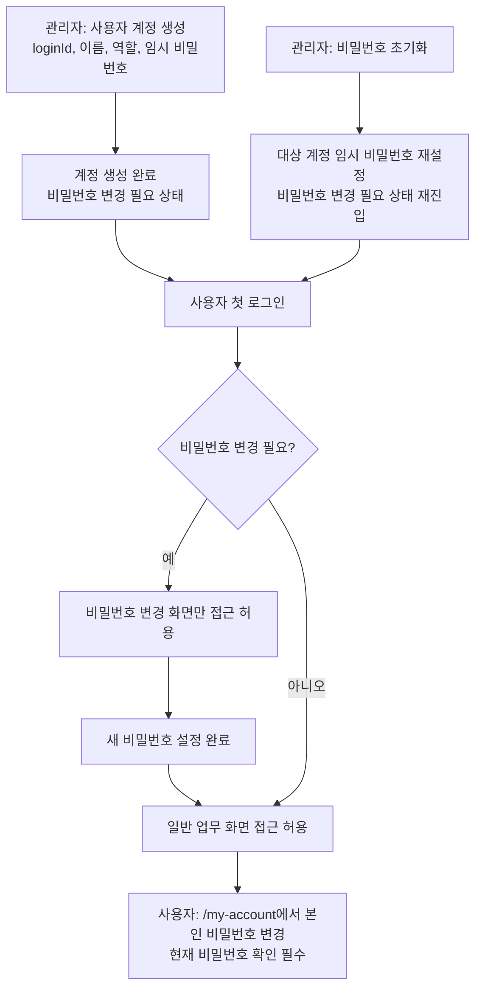

# 사용자 계정 관리 후속: 계정 생성 및 비밀번호 라이프사이클

## Problem Frame
현재 사용자 계정 관리는 목록 조회와 운영 액션(접속 무효화, 역할 변경, 상태 변경) 중심의 MVP로 구현되어 있다.
하지만 운영에 필요한 핵심 흐름인 계정 생성, 임시 비밀번호 기반 온보딩, 본인 비밀번호 변경, 관리자 비밀번호 초기화가 분리되어 있어 계정 생애주기가 끊겨 있다.

이번 범위는 계정 생애주기를 하나의 일관된 정책으로 정렬하는 것이다.
- 생성 책임은 `사용자 계정 관리`로 일원화한다.
- 신규 계정은 임시 비밀번호로 시작하고 첫 로그인 시 비밀번호 변경을 강제한다.
- 일반 비밀번호 변경은 `/my-account`에서 자기주도(self-service)로 처리한다.

## Requirements

**계정 생성 및 전환(Cutover)**
- R1. `사용자 계정 관리` 화면은 신규 계정 생성 기능을 제공해야 하며, 생성 필수 입력은 `loginId`, `이름(userName)`, `역할(roleCode)`, `임시 비밀번호`다.
- R2. 계정 생성 역할 정책은 RBAC 정렬 문서의 R32를 따른다: `ROLE_SUPER_ADMIN`만 `ROLE_ADMIN` 계정을 생성할 수 있고, `ROLE_ADMIN`은 `ROLE_MANAGER`, `ROLE_DESK`, `ROLE_TRAINER`만 생성할 수 있다.
- R3. 계정 생성은 항상 현재 액터의 센터 스코프 내에서만 허용되어야 하며, 다른 센터 사용자 생성은 서버에서 차단되어야 한다.
- R4. 이번 릴리즈에서 계정 생성 책임은 `사용자 계정 관리`로 즉시 전환한다. `트레이너 관리`의 계정 생성 UI/API는 동일 릴리즈에서 제거되어야 한다.
- R5. 계정 생성 성공 시 운영자가 생성 결과를 즉시 확인할 수 있어야 하며, 이후 사용자 목록에 반영되어야 한다.
- R6. 계정 생성 작업은 감사 로그로 추적 가능해야 한다.
- R22. 계정 생성 단계의 필수 입력은 공통 계정 필드로 제한하고, 트레이너 전용 운영 정보(예: 정산 단가)는 계정 생성 이후 별도 편집 흐름에서 관리한다.
- R23. 계정 생성 권한은 admin-only로 고정한다. `ROLE_SUPER_ADMIN`과 `ROLE_ADMIN`만 계정 생성 액션을 실행할 수 있고, `ROLE_MANAGER`는 계정 생성을 수행할 수 없다.

**임시 비밀번호 및 첫 로그인 강제 변경**
- R7. 임시 비밀번호로 생성되거나 초기화된 계정은 `비밀번호 변경 필요` 상태로 시작해야 한다.
- R8. `비밀번호 변경 필요` 상태의 사용자는 비밀번호 변경 완료 전까지 비밀번호 변경 화면 외 업무 화면 접근이 차단되어야 한다.
- R9. 첫 로그인 강제 변경 시에는 `현재 비밀번호` 입력 없이 새 비밀번호 설정만으로 변경을 완료할 수 있어야 한다.
- R10. 비밀번호 변경 완료 시 `비밀번호 변경 필요` 상태는 해제되어야 하며 이후 일반 업무 화면 접근이 가능해야 한다.
- R11. 새 비밀번호는 기존 정책(최소 8자, 영문/숫자/특수문자 조합)을 충족해야 한다.

**비밀번호 운영(상시 변경 + 관리자 초기화)**
- R12. 인증 사용자(`ROLE_SUPER_ADMIN`, `ROLE_ADMIN`, `ROLE_MANAGER`, `ROLE_DESK`, `ROLE_TRAINER`)는 `/my-account` 페이지에서 본인 비밀번호를 변경할 수 있어야 한다.
- R13. 일반 본인 비밀번호 변경은 `현재 비밀번호` 검증을 필수로 해야 한다.
- R14. `사용자 계정 관리`에서 `ROLE_SUPER_ADMIN`과 `ROLE_ADMIN`만 대상 계정의 비밀번호를 임시 비밀번호로 초기화할 수 있어야 하며, `ROLE_MANAGER`는 해당 액션을 수행할 수 없어야 한다.
- R15. 관리자 초기화 수행 시 대상 계정은 다시 `비밀번호 변경 필요` 상태로 전환되어야 한다.
- R16. 관리자 초기화는 대상 사용자의 기존 인증 세션(액세스/리프레시 토큰)을 무효화해야 한다.
- R17. 관리자는 자기 자신의 비밀번호를 관리자 초기화 액션으로 변경할 수 없고, 자기 계정은 `/my-account`의 본인 변경 흐름만 사용해야 한다.
- R18. 비밀번호 초기화/변경 관련 운영 액션은 감사 로그에서 추적 가능해야 한다.
- R24. 비밀번호 초기화 대상 정책은 R32와 동일 경계를 따른다: `ROLE_ADMIN`은 `ROLE_MANAGER`, `ROLE_DESK`, `ROLE_TRAINER`만 초기화할 수 있고 `ROLE_ADMIN` 대상 초기화는 할 수 없다. `ROLE_SUPER_ADMIN`만 `ROLE_ADMIN` 초기화를 수행할 수 있다.

**권한 및 보안 강제**
- R19. 역할/비밀번호 관련 제한은 UI 숨김뿐 아니라 서버 권한 검증으로 강제되어야 한다.
- R20. `ROLE_ADMIN`의 권한 상승(예: `ROLE_ADMIN` 계정 생성/부여)은 서버에서 차단되어야 한다.
- R21. 모든 계정/비밀번호 운영 액션은 센터 경계를 넘지 않아야 한다.

## Success Criteria
- 사용자 계정 관리에서 계정 생성부터 상태 확인까지 단일 흐름으로 완료할 수 있다.
- 임시 비밀번호 계정은 첫 로그인 후 비밀번호 변경 전까지 업무 화면 접근이 차단된다.
- 본인 비밀번호 변경은 `/my-account`에서 현재 비밀번호 검증을 포함해 정상 동작한다.
- 관리자 비밀번호 초기화 후 대상 사용자의 기존 세션이 무효화되고 강제 변경 상태가 재적용된다.
- RBAC 경계(R32)가 계정 생성/역할 정책에 동일하게 반영된다.
- `ROLE_MANAGER`는 계정 생성을 수행할 수 없고, 비밀번호 초기화 대상 경계도 R32와 일치한다.
- `ROLE_MANAGER`는 사용자 비밀번호 초기화 액션을 수행할 수 없다.

## Scope Boundaries
- 이메일/SMS 초대 링크 기반 온보딩은 이번 범위에서 제외한다.
- MFA(2단계 인증), 비밀번호 분실 복구(외부 채널 인증), 패스워드리스 로그인은 제외한다.
- 주기적 비밀번호 만료/회전 정책(예: 90일 강제 만료)은 이번 범위에서 제외한다.
- 계정 권한 모델(역할 종류/계층) 자체 변경은 제외한다.

## Key Decisions
- 생성 책임 일원화: 계정 생성은 `사용자 계정 관리`로 통합하고 `트레이너 관리` 생성은 즉시 전환으로 제거한다.
- 생성 권한 고정: 계정 생성은 admin-only(`ROLE_SUPER_ADMIN`, `ROLE_ADMIN`)로 제한하고 `ROLE_MANAGER` 생성 권한은 허용하지 않는다.
- 임시 비밀번호 입력 방식: 생성 시 임시 비밀번호는 관리자가 직접 입력한다.
- 강제 변경 정책: 임시 비밀번호 계정은 비밀번호 변경 전까지 비밀번호 화면만 접근 허용한다.
- 자기주도 변경 채널 분리: 본인 비밀번호 변경은 `/my-account` 전용으로 제공한다.
- 현재 비밀번호 정책: 일반 변경은 현재 비밀번호 필수, 강제 변경은 생략 허용.
- RBAC 경계 유지: `ROLE_ADMIN`은 `ROLE_ADMIN` 생성/부여/비밀번호 초기화 불가, `ROLE_SUPER_ADMIN`만 가능.

## Dependencies / Assumptions
- 기존 계정 운영 API(`revoke-access`, `role`, `status`)는 유지하며 신규 생성/비밀번호 API가 추가된다.
- 기존 트레이너 계정 생성 경로(`트레이너 관리`)는 이번 릴리즈에서 제거되고, 대체 경로(`사용자 계정 관리`)가 즉시 제공된다.
- API 계약 변경 시 `docs/04_API_설계서.md`와 부록 C를 같은 단위로 갱신한다.

## Outstanding Questions

### Resolve Before Planning
- 없음

### Deferred to Planning
- [Affects R8,R10][Technical] 강제 변경 상태 표현을 JWT claim으로 포함할지, 서버 조회 기반으로만 처리할지 최종 결정이 필요하다.
- [Affects R16][Technical] 비밀번호 변경/초기화 시 기존 토큰 무효화의 순서와 사용자 피드백 메시지 규약을 정해야 한다.
- [Affects R4][Technical] 트레이너 관리 생성 경로 제거 시 라우트/테스트/문구 회귀를 최소화하는 컷오버 순서를 확정해야 한다.

## Next Steps
→ /ce:plan for structured implementation planning
