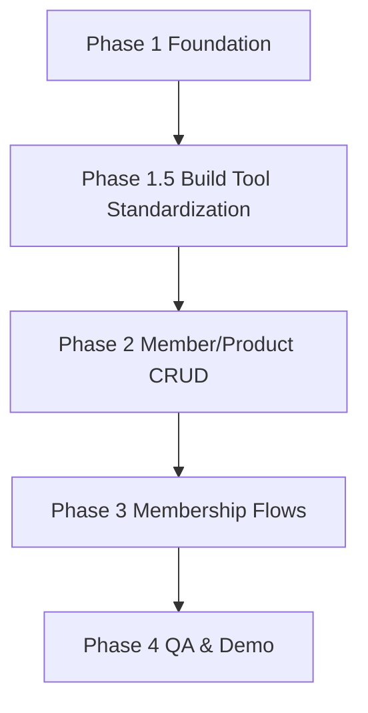

# feat: GYM CRM Admin Portal Core Prototype Execution Checklist

## Overview

기존 프로토타입 계획 문서의 실행 단위를 더 잘게 쪼갠 Phase별 체크리스트다. 구현 착수 시 순서/의존성/완료조건을 빠르게 확인할 수 있도록 작업 중심으로 구성한다.

- 기준 계획: `docs/plans/2026-02-23-feat-gym-crm-admin-portal-core-prototype-plan.md`
- 기준 브레인스토밍: `docs/brainstorms/2026-02-23-gym-crm-product-brainstorm.md`

## Scope (Carry Forward)

브레인스토밍/기준 계획의 결정사항을 그대로 따른다 (see brainstorm: docs/brainstorms/2026-02-23-gym-crm-product-brainstorm.md).

- 관리자 포털 only
- 외부 연동 없음 (PG/QR/알림톡 미구현)
- 기능 범위: 회원/상품/회원권 구매·홀딩·해제·환불
- `ADMIN` 단일 역할, no-auth 프로토타입 모드
- 숫자 PK 중심 (`centerId`, `memberId`, `productId`, `membershipId`)

## Working Rules

- 각 체크박스는 **작업 완료 + 최소 검증 완료** 기준으로만 체크한다.
- 범위 외 요구가 생기면 구현하지 않고 `후속 backlog` 섹션에 추가한다.
- 문서/코드가 충돌하면 이 체크리스트가 아니라 기준 계획 문서를 먼저 수정한다.

## Phase Dependency Map

## Global Exit Conditions (Prototype Done)

- [x] 회원 등록 → 상품 등록 → 회원권 구매 → 홀딩 → 해제 → 환불 데모 시나리오가 끝까지 동작한다.
- [x] 수동 테스트 체크리스트 완료
- [x] 최소 자동 테스트 통과
- [x] no-auth 모드가 `prod`에서 차단된다.
- [x] 프로토타입 제한사항 문서화 완료

## Phase 1 Checklist: Foundation (프로젝트 골격 + 공통 규칙)

### P1-1. 프로젝트 골격 생성

- [x] `backend/` 프로젝트 생성 (Spring Boot 3.x, Java 21)
- [x] `frontend/` 프로젝트 생성 (React 18 + TypeScript + Vite)
- [x] 루트 `.gitignore` 및 기본 개발 스크립트 정리
- [x] 로컬 실행 방법 초안 작성 (`README` 또는 `docs/notes/`)

완료 기준:
- [x] 백엔드 앱 기동 성공
- [x] 프론트엔드 앱 기동 성공

### P1-2. DB 연결 및 마이그레이션 기반

- [x] PostgreSQL 연결 설정 (`dev`)
- [x] 마이그레이션 도구 초기 설정 (예: Flyway)
- [x] 초기 마이그레이션 버전 파일 생성 (`V1__init_core_tables.sql` 또는 동등 구조)
- [x] 개발 DB 표준 경로 문서화 (Docker PostgreSQL + 로컬 fallback)
- [x] 마이그레이션 실행 확인

완료 기준:
- [x] 마이그레이션이 빈 DB에 정상 적용된다.
- [x] 재실행 시 실패 원인이 명확하다(버전 충돌/중복 적용 방지 동작 확인).

### P1-3. 공통 API/예외 처리 구조

- [x] 공통 응답 포맷(`success/data/message/timestamp`) DTO 정의
- [x] 글로벌 예외 핸들러 구현
- [x] 기본 에러 코드 체계 정의 (`VALIDATION`, `NOT_FOUND`, `CONFLICT`, `BUSINESS_RULE`)
- [x] API 헬스/샘플 엔드포인트 1개 추가

완료 기준:
- [x] 성공 응답/실패 응답 샘플이 문서 형식과 유사하게 반환된다.
- [x] Validation 오류와 비즈니스 오류가 구분되어 반환된다.

### P1-4. 프로토타입 no-auth 모드 + 안전장치

- [x] no-auth 모드 플래그 정의 (환경변수/프로필 기반)
- [x] `CurrentUserProvider` 또는 동등 추상화 정의
- [x] 프로토타입 기본 관리자 사용자 ID 반환 구현 (`created_by/updated_by` 용)
- [x] `prod` 환경에서 no-auth 모드 강제 차단 구현
- [x] 프론트엔드 상단 `Prototype Mode (No Auth)` 배너 구현

완료 기준:
- [x] `dev`/`staging`에서는 no-auth 모드로 API 접근 가능
- [x] `prod` 설정에서는 앱 기동 또는 요청 단계에서 차단됨

### P1-5. 공통 데이터 규칙 적용 준비

- [x] Soft Delete 공통 필드 규칙 결정 (`is_deleted`, `deleted_at`, `deleted_by`)
- [x] Audit 공통 필드 규칙 결정 (`created_at/by`, `updated_at/by`)
- [x] 시간 저장 기준 UTC 정책 반영(애플리케이션/DB)
- [x] 프로토타입 표준 규칙 문서 작성 (`centerId`, 숫자 PK, no-auth 제한, 환불 기본정책)

완료 기준:
- [x] 최소 1개 테이블에 Soft Delete/Audit 필드 적용 및 동작 검증
- [x] 규칙 문서가 `docs/notes/prototype-canonical-rules.md`에 존재

### P1-6. Phase 1 리뷰 체크

- [x] P1 산출물 목록 업데이트
- [x] 남은 기술 의사결정 없음 확인 (스택/환경/규칙) - 단, 빌드 도구 표준화는 Phase 1.5에서 처리
- [x] Phase 1.5 착수 조건 확인

Phase 1.5 착수 조건:
- [x] DB 마이그레이션 기반 준비 완료
- [x] 공통 API/예외 처리 준비 완료
- [x] no-auth 안전장치 준비 완료

## Phase 1.5 Checklist: Backend Build Tool Standardization (Maven → Gradle)

목표: Phase 2 착수 전에 백엔드 빌드 표준을 아키텍처 설계서 기준 `Gradle 8.x`로 정렬한다. DSL 스타일은 `build.gradle` / `settings.gradle` (Groovy DSL)로 고정한다.

참고 계획:
- `docs/plans/2026-02-23-refactor-backend-build-tool-gradle-standardization-plan.md`

### P1.5-1. Maven 고정점 파악

- [x] `backend/pom.xml` 의존성/플러그인 목록 추출
- [x] Java 버전/Spring Boot 버전 기록
- [x] Gradle 전환 시 유지해야 할 기능 축 체크리스트 작성 (`web`, `validation`, `actuator`, `flyway`, `postgres`, `test`)

완료 기준:
- [x] Maven → Gradle 의존성 parity 기준이 문서화되었다.

### P1.5-2. Gradle 파일 생성 (Groovy DSL 고정)

- [x] `backend/settings.gradle` 생성 (Groovy DSL)
- [x] `backend/build.gradle` 생성 (Groovy DSL)
- [x] Spring Boot / Dependency Management 플러그인 설정
- [x] Java Toolchain 21 설정
- [x] Maven 의존성 parity 반영

완료 기준:
- [x] Gradle 빌드 정의 파일이 존재하고 DSL 스타일이 `build.gradle` 계열로 고정되었다.

### P1.5-3. Gradle Wrapper 준비

- [x] `gradlew`, `gradlew.bat` 추가
- [x] `gradle/wrapper/*` 추가
- [x] `gradlew` 실행 권한 확인

완료 기준:
- [x] 저장소 내에서 `./gradlew` 실행 경로가 준비되었다.

### P1.5-4. 로컬 검증 (가능 환경 기준)

- [x] `./gradlew tasks` 확인
- [x] `./gradlew test` 또는 `./gradlew build` 확인
- [x] `./gradlew bootRun` 확인 (가능 환경)
- [x] 검증 실패 시 환경 제약(네트워크/CLI 부재) 원인 기록

완료 기준:
- [x] 검증 결과(성공 또는 환경 제약)가 문서/작업 로그에 기록되었다.

### P1.5-5. 문서/체크리스트 정렬

- [x] `README.md` 백엔드 명령 `mvn` → `./gradlew`
- [x] `docs/notes/local-run-phase1.md` 백엔드 명령 `mvn` → `./gradlew`
- [x] Phase 1 체크리스트/노트의 빌드 명령 기준 정렬
- [x] Gradle DSL 스타일 고정(`build.gradle`)을 문서에 명시

완료 기준:
- [x] 사용자-facing 문서에서 백엔드 빌드 명령이 Gradle 기준으로 일관된다.

### P1.5-6. Maven 정리 결정

- [x] `backend/pom.xml` 제거 또는 임시 유지 결정
- [x] 유지 시 제거 조건/시점 문서화
- [ ] 제거 시 문서/스크립트 참조 정리

완료 기준:
- [x] 빌드 표준 단일화 상태 또는 임시 병행 사유가 명확하다.

### P1.5-7. Phase 1.5 리뷰 체크

- [x] 아키텍처 설계서의 빌드 도구 표준(Gradle)과 구현 계획이 정렬됨
- [x] Phase 2 착수 조건 확인

Phase 2 착수 조건:
- [x] DB 마이그레이션 기반 준비 완료
- [x] 공통 API/예외 처리 준비 완료
- [x] no-auth 안전장치 준비 완료
- [x] 백엔드 빌드 표준이 Gradle(`build.gradle` 스타일)로 정렬 완료
- [x] Phase 2 작업자가 사용할 백엔드 실행 명령이 `./gradlew` 기준으로 문서화됨

## Phase 2 Checklist: Member & Product Core CRUD

### P2-1. 시스템/기본 엔티티 마이그레이션

- [x] `centers` 테이블 생성 (프로토타입 단일 센터용)
- [x] `users`/`roles`는 최소 stub 여부 결정 후 생성 또는 보류 기록
- [x] 기본 `center` 시드 데이터 전략 결정 (고정 1개 또는 시드 스크립트)

완료 기준:
- [x] 단일 센터 기준 테스트 데이터 확보 가능

### P2-2. 회원 도메인 모델/테이블

- [x] `members` 테이블 생성 (Soft Delete/Audit 포함)
- [x] 연락처 unique 전략 정의 (`center_id + phone` 권장 여부 결정)
- [x] 회원 상태/동의 필드 반영
- [x] 중복 연락처 검증용 인덱스 추가

완료 기준:
- [x] 회원 생성/수정/조회용 최소 스키마 확정

### P2-3. 상품 도메인 모델/테이블

- [x] `products` 테이블 생성 (카테고리/상태/정책 필드 포함)
- [x] 기간제/횟수제 공통 모델 규칙 정의
- [x] 홀딩 허용/최대기간/최대횟수/양도허용 필드 반영
- [x] 상품 상태 전환(활성/비활성) 필드 반영

완료 기준:
- [x] 기간제/횟수제 상품 둘 다 표현 가능

### P2-4. 회원 API 구현

- [x] `POST /api/v1/members` 회원 등록
- [x] `GET /api/v1/members` 회원 목록(검색 최소 버전: 이름/연락처)
- [x] `GET /api/v1/members/{memberId}` 회원 상세
- [x] `PATCH` 또는 `PUT /api/v1/members/{memberId}` 회원 수정
- [x] 중복 연락처 검증/에러 응답 정리

완료 기준:
- [x] 회원 등록/수정/조회 API 수동 테스트 통과
- [x] 중복 연락처 시 `CONFLICT` 계열 오류 반환

### P2-5. 상품 API 구현

- [x] `POST /api/v1/products` 상품 등록
- [x] `GET /api/v1/products` 상품 목록(카테고리/상태 최소 필터)
- [x] `GET /api/v1/products/{productId}` 상품 상세
- [x] `PUT/PATCH /api/v1/products/{productId}` 상품 수정
- [x] `PATCH /api/v1/products/{productId}/status` 상태 변경 (또는 동등 API)

완료 기준:
- [x] 상품 2종(기간제/횟수제) 등록 후 목록/상세/비활성화 가능

### P2-6. 관리자 포털 UI (회원/상품)

- [x] 회원 목록 화면
- [x] 회원 등록/수정 폼(필수값/중복 오류 표시)
- [x] 회원 상세 화면(다음 Phase 회원권 섹션 placeholder 포함)
- [x] 상품 목록 화면
- [x] 상품 등록/수정 폼(정책 필드 검증 포함)
- [x] no-auth 배너 항상 표시

완료 기준:
- [x] 데모에서 UI 통해 회원/상품 CRUD 수행 가능

### P2-7. Phase 2 리뷰 체크

- [x] 회원/상품 API와 UI 경로 정리 문서화
- [x] Phase 3에서 필요한 데이터(회원, 상품) 생성 시나리오 확보
- [x] 미완료 항목이 있으면 backlog로 이동

Phase 3 착수 조건:
- [x] 회원/상품 CRUD UI/API 동작
- [x] 상품 정책 필드 저장/조회 가능

## Phase 3 Checklist: Membership Purchase / Hold / Resume / Refund

### P3-1. 회원권/결제/이력 스키마

- [x] `member_memberships` 테이블 생성
- [x] `payments` 테이블 생성 (수기 결제/환불 기록용 최소 필드)
- [x] `payment_details` 테이블 생성 (선택 최소형)
- [x] `membership_holds` 테이블 생성
- [x] `membership_refunds` 테이블 생성

완료 기준:
- [x] 구매/홀딩/환불 플로우 저장에 필요한 테이블 준비 완료

### P3-2. 회원권 상태 전이 규칙 확정

- [x] 상태 enum 최소셋 정의 (`ACTIVE`, `HOLDING`, `REFUNDED`, `EXPIRED`)
- [x] 허용 전이 표 문서화
- [x] 서비스 레벨 상태 검증 로직 구현
- [x] 상태 전이 단위 테스트 작성

완료 기준:
- [x] 불가 상태 전이 요청이 일관된 `BUSINESS_RULE` 오류로 차단됨

### P3-3. 구매 계산/생성 로직

- [x] 기간제 만료일 계산 로직 구현
- [x] 횟수제 잔여횟수/유효기간 계산 로직 구현
- [x] 상품 비활성/부적합 상품 검증
- [x] 수기 결제 기록 생성 로직 구현
- [x] 구매 트랜잭션 경계 정의 (결제 기록 + 회원권 생성 원자성)

완료 기준:
- [x] 구매 성공 시 회원권/결제기록 함께 생성
- [x] 실패 시 부분 저장 없음

### P3-4. 구매 API/UI

- [x] `POST /api/v1/members/{memberId}/memberships` 구현
- [x] 회원 상세 화면 내 구매 UI(모달/패널) 구현
- [x] 계산값 미리보기 표시
- [x] 중복 제출 방지(UI 버튼 disable + 요청중 상태)

완료 기준:
- [x] 회원 상세에서 실제 구매 완료 후 회원권 섹션 즉시 갱신

### P3-5. 홀딩/해제 로직

- [x] 홀딩 가능 여부 검증(상품 허용 여부, 잔여횟수/기간, 상태)
- [x] 홀딩 기간 검증(시작일/종료일 역전 방지)
- [x] 홀딩 이력 생성 + 회원권 상태 변경
- [x] 해제 시 실제 홀딩 일수 반영 만료일 재산정
- [x] 홀딩/해제 트랜잭션 경계 정의

완료 기준:
- [x] 홀딩 후 상태 `HOLDING`, 해제 후 `ACTIVE` 복귀 및 만료일 변경 반영

### P3-6. 홀딩/해제 API/UI

- [x] `POST .../hold` 구현
- [x] `POST .../resume` 구현
- [x] 회원권 상세/목록 영역에 홀딩/해제 버튼 표시 조건 처리
- [x] 홀딩 미리보기(변경 후 만료일) UI 표시

완료 기준:
- [x] UI에서 홀딩→해제 반복 시 정책 위반/상태 충돌이 정상 처리됨

### P3-7. 환불 계산/처리 로직

- [x] 프로토타입 고정 단순 환불 정책 구현 (비례 사용분 + 10% 위약금)
- [x] 기간제/횟수제 사용분 계산 로직 분기 구현
- [x] 음수 환불액 방지 (`max(0, ...)`)
- [x] 환불 이력 + 수기 환불 결제기록 생성
- [x] 환불 후 회원권 상태 변경 (`REFUNDED`)
- [x] 환불 트랜잭션 경계 정의

완료 기준:
- [x] 동일 입력에 대해 미리보기/확정 환불액 일치
- [x] 재환불 요청 차단

### P3-8. 환불 API/UI

- [x] `POST .../refund` 구현
- [x] 환불 미리보기 UI/확정 UI 구현
- [x] 환불 불가 상태 메시지 처리
- [x] 요청 중복 제출 방지

완료 기준:
- [x] 회원 상세에서 환불 완료 후 상태/결제이력이 즉시 반영

### P3-9. Phase 3 통합 점검

- [x] 통합 시나리오 실행: 회원 등록 → 상품 등록 → 구매 → 홀딩 → 해제 → 환불
- [x] 데이터 정합성 확인(SQL 또는 관리자 조회 화면)
- [x] 오류 메시지/상태표시 UX 정리

Phase 4 착수 조건:
- [x] 핵심 업무 플로우 E2E 동작
- [x] 치명적 정합성 이슈 없음

## Phase 4 Checklist: QA / Demo / Minimal Automation

### P4-1. 데모 시나리오 문서

- [x] `docs/testing/gym-crm-prototype-demo-scenarios.md` 생성
- [x] 시나리오별 사전 데이터/입력값/기대결과 작성
- [x] 발표 순서(3~5분 버전)와 상세 검증 순서(10분 버전) 분리 작성

완료 기준:
- [x] 다른 사람이 문서만 보고 데모 재현 가능

### P4-2. 수동 테스트 체크리스트

- [x] `docs/testing/gym-crm-prototype-manual-test-checklist.md` 생성
- [x] 회원/상품 CRUD 정상/예외 케이스 체크리스트 작성
- [x] 구매/홀딩/해제/환불 정상/예외 케이스 체크리스트 작성
- [x] no-auth 모드 제한(`prod` 차단) 점검 항목 포함

완료 기준:
- [x] 체크리스트 실제 실행 결과 기록 완료

### P4-3. 최소 자동 테스트 (백엔드 중심)

- [x] 회원 연락처 중복 검증 테스트
- [x] 상품 정책 검증 테스트
- [x] 회원권 상태 전이 테스트
- [x] 홀딩 만료일 재산정 테스트
- [x] 환불 계산 테스트 (기간제/횟수제)
- [x] 구매/환불 트랜잭션 원자성 테스트(가능 범위)

완료 기준:
- [x] 테스트 실행 스크립트 문서화
- [x] 최소 자동 테스트 통과

### P4-4. 프로토타입 제한사항/차이 문서화

- [x] `docs/notes/prototype-scope-deviations.md` 생성/업데이트
- [x] 미구현 범위(예약/출입/라커/정산/CRM) 명시
- [x] no-auth 운영 제한 명시
- [x] 외부 연동 미포함 및 향후 확장 포인트 명시
- [x] 식별자/테넌트 명칭 프로토타입 표준 명시 (`centerId`, 숫자 PK)

완료 기준:
- [x] 구현 결과와 문서 간 범위 혼선 없음

### P4-5. 출시(프로토타입 완료) 판정

- [x] Global Exit Conditions 전부 확인
- [x] 남은 이슈 분류 (P1/P2/P3 또는 Must/Should/Could)
- [x] 후속 Phase backlog 작성

완료 기준:
- [x] 프로토타입 완료 선언 가능 상태

## Backlog (Out of Scope for This Prototype)

- [ ] JWT 로그인/Refresh/RBAC 도입
- [ ] 멀티 센터 운영 UI/권한
- [ ] 표시용 비즈니스 ID(`MBR-...`) 도입
- [ ] 예약(PT/GX) 모듈
- [ ] 출입/QR 게이트
- [ ] 라커 관리
- [ ] 매출 리포트/정산
- [ ] CRM 메시지
- [ ] PG/알림톡/QR 외부 연동

## Suggested Work Slicing (Commit / PR Units)

작업 단위를 너무 크게 묶지 않기 위한 권장 분할:

1. `chore: bootstrap backend/frontend and db migration`
2. `feat: add common api response and error handling`
3. `feat: add prototype no-auth mode safeguards`
4. `feat: implement member CRUD api and UI`
5. `feat: implement product CRUD api and UI`
6. `feat: implement membership purchase flow`
7. `feat: implement membership hold and resume flow`
8. `feat: implement membership refund flow`
9. `test: add prototype flow tests and manual test docs`
10. `docs: document prototype limitations and canonical rules`

## Sources & References

- **Origin brainstorm:** `docs/brainstorms/2026-02-23-gym-crm-product-brainstorm.md`
- **Base plan:** `docs/plans/2026-02-23-feat-gym-crm-admin-portal-core-prototype-plan.md`
- 요구사항 유스케이스: `docs/01_요구사항_분석서.md:494`, `docs/01_요구사항_분석서.md:537`, `docs/01_요구사항_분석서.md:625`
- API 기준 엔드포인트: `docs/04_API_설계서.md:367`, `docs/04_API_설계서.md:387`, `docs/04_API_설계서.md:775`, `docs/04_API_설계서.md:897`
