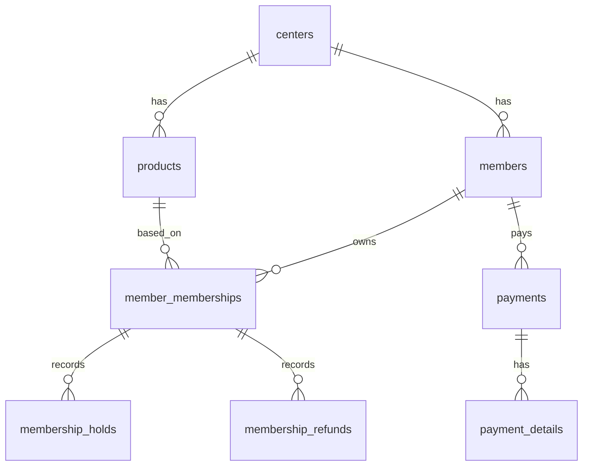

# feat: GYM CRM Admin Portal Core Prototype

## Overview

중소형 헬스장 GYM CRM 프로젝트의 1차 프로토타입을 구축한다. 범위는 관리자 포털(웹)에서 수행하는 핵심 데스크 업무로 한정하며, 회원관리/상품관리/회원권 구매·홀딩·환불 플로우를 실제로 동작 가능한 수준까지 구현한다 (see brainstorm: docs/brainstorms/2026-02-23-gym-crm-product-brainstorm.md).

이 계획은 전체 설계 문서(요구사항/아키텍처/DB/API)를 유지하되, 프로토타입 단계에서 필요한 최소 구현 집합을 정의하고 후속 단계(예약/출입/라커/정산/CRM, 인증/RBAC, 외부 연동)로 안전하게 확장할 수 있는 기반을 만드는 것을 목표로 한다.

## Problem Statement

현재 레포는 상세 설계 문서 중심이며 구현 코드가 없다. 문서 수준에서는 전체 시스템 범위가 넓고(회원/상품/예약/출입/라커/정산/CRM), 인증/역할/식별자 등 일부 핵심 정책이 문서 간 불일치 상태다.

이 상태에서 전체 범위를 한 번에 구현하면 다음 리스크가 크다.

- 범위 과다로 인한 초기 납기 지연
- 문서 불일치가 구현 단계에서 반복적으로 재해석됨
- 외부 연동 의존성(PG/QR/알림톡) 때문에 내부 업무 플로우 검증이 늦어짐
- 초기 권한/보안 설계를 과도하게 구현하여 프로토타입 목적(업무 검증)에서 벗어남

따라서 프로토타입은 코어 도메인 흐름만 먼저 완성하고, 설계 문서와의 차이는 “프로토타입 의도된 축소”로 명시해야 한다.

## Proposed Solution

브레인스토밍에서 확정된 범위를 그대로 구현 계획의 기준선으로 채택한다 (see brainstorm: docs/brainstorms/2026-02-23-gym-crm-product-brainstorm.md).

- 관리자 포털만 구현 (회원 모바일 웹 제외)
- 외부 연동 없음 (PG/QR/알림톡 실제 연동 미포함)
- 기능 범위: 회원관리 + 상품관리 + 회원권 구매/홀딩/환불
- 권한: `ADMIN` 단일 역할
- 인증: 로그인 없이 단일 관리자 모드
- 식별자: 숫자 PK 중심, 표시용 비즈니스 ID는 후속 단계

핵심 전략은 다음과 같다.

1. **도메인/데이터 모델 우선**
   - 회원, 상품, 회원권, 홀딩, 환불, 결제 기록 최소 테이블을 우선 구현한다.
   - 문서의 Soft Delete/Audit 규칙은 프로토타입에서도 최대한 유지한다.

2. **업무 플로우 우선**
   - CRUD만 만드는 대신 실제 데스크 시나리오(회원 등록 → 상품 등록 → 회원권 구매 → 홀딩/환불)를 우선 end-to-end로 구현한다.

3. **확장 포인트 보존**
   - 외부 연동/인증/RBAC는 구현하지 않더라도 인터페이스/경계는 남겨 후속 확장 비용을 줄인다.

## Technical Approach

### Architecture

프로토타입은 문서의 장기 설계를 모두 구현하지 않는다. 대신 다음 축약 아키텍처를 사용한다.

- **Frontend (Admin Web)**: 회원/상품/회원권 처리 화면 중심 SPA
- **Backend API**: 회원/상품/회원권 도메인 API + 단순 관리자 모드
- **Database**: PostgreSQL 기반 코어 테이블
- **Out-of-scope adapters (stub)**: PG/QR/알림톡 인터페이스 자리만 정의 (실제 호출 없음)

프로토타입 단계에서는 인증 필터/JWT/RBAC를 생략하지만, API 경로와 응답 포맷은 가급적 `v1` 규칙을 따른다 (see brainstorm: docs/brainstorms/2026-02-23-gym-crm-product-brainstorm.md).

기술 스택은 문서 기준안을 그대로 채택하여 계획 단계의 추가 의사결정을 줄인다.

- **Backend**: Java 21 + Spring Boot 3.x
- **Frontend**: React 18 + TypeScript + Vite
- **Database**: PostgreSQL 14+ (개발은 14+, 운영 설계는 16 기준 문서 참고)

프로토타입 안전장치(인증 없음에 대한 운영 제한):

- 기본 실행 모드는 `dev`/`staging` 한정으로 사용한다.
- 프로덕션 배포 시 인증 비활성 모드 금지 플래그를 둔다.
- UI 상단에 `Prototype Mode (No Auth)` 배너를 표시한다.

### Prototype Scope Mapping (문서 대비 축소)

#### 포함 (Prototype 전체 범위)

- 회원 등록/조회/수정
- 상품 등록/조회/수정/비활성화
- 회원권 구매(수기 결제 기록 포함)
- 회원권 홀딩/홀딩 해제
- 회원권 환불(수기 환불 기록 포함)

#### 제외 (후속 단계)

- 예약/PT/GX
- 출입/QR
- 라커
- 매출 리포트/정산
- CRM 메시지 발송
- 실제 PG/알림톡/QR 게이트 연동
- JWT/Refresh Token/RBAC
- 멀티 센터 운영 UI/권한 정책

### SpecFlow Analysis (요약 반영)

브레인스토밍 및 요구사항 유스케이스(UC-01/UC-02/UC-04) 기준으로 플로우/엣지케이스를 분석한 결과, 구현 계획에 반드시 반영해야 할 항목은 다음과 같다.

#### User Flow Overview

1. **회원 등록 플로우**
   - 신규 회원 입력 → 연락처 중복 검증 → 저장 → 상세 화면 이동
   - 예외: 필수값 누락, 중복 연락처

2. **상품 관리 플로우**
   - 상품 생성/수정/비활성화 → 판매 가능 상품 목록 반영
   - 예외: 정책값 불일치(홀딩 허용인데 최대 기간 0 등)

3. **회원권 구매 플로우 (수기 결제 대체)**
   - 회원 선택 → 상품 선택 → 시작일/결제수단 입력 → 금액/만료일 계산 → 확정 → 회원권 생성 + 결제 기록
   - 예외: 비활성 상품 선택, 중복 제출, 계산값 변경 경쟁

4. **회원권 홀딩 플로우**
   - 홀딩 가능 여부 검증 → 기간 입력 → 만료일 변경 미리보기 → 확정 → 홀딩 이력 저장 + 회원권 상태 변경
   - 예외: 잔여 홀딩 횟수/기간 초과, 기간 역전, 활성 회원권 아님

5. **회원권 환불 플로우**
   - 환불 가능 여부 검증 → 환불 금액 계산 미리보기 → 확정 → 회원권 상태 변경 + 환불 이력/결제 취소(수기 기록)
   - 예외: 이미 환불/양도/만료 상태, 음수 환불액, 정책 미설정

#### Flow Permutations Matrix (프로토타입 범위)

| 플로우 | 정상 | 유효성 오류 | 중복 제출 | 정책 충돌 | 프로토타입 기본값 |
|---|---|---|---|---|---|
| 회원 등록 | O | O | O (연락처 중복) | - | 단일 센터, ADMIN |
| 상품 등록 | O | O | - | O | 헬스/PT/GX 공통 상품 모델 |
| 회원권 구매 | O | O | O (Idempotency 대체 필요) | O | 외부결제 없음, 수기 결제기록 |
| 홀딩 | O | O | O | O | 기간제 회원권 중심 |
| 환불 | O | O | O | O | 수기 환불 기록 |

#### Missing Elements & Gaps (계획에서 보완)

- **Validation**: 환불 계산 정책/홀딩 정책의 최소 기본값 정의 필요
- **State machine**: 회원권 상태 전이 규칙(`ACTIVE → HOLDING → ACTIVE`, `ACTIVE → REFUNDED`) 명시 필요
- **Concurrency**: 중복 제출 시 동일 회원권에 이중 구매/홀딩/환불 방지 필요
- **Audit**: 로그인 없는 프로토타입에서 `created_by/updated_by` 기본값 전략 필요
- **Scope mismatch**: UC에는 QR 생성/알림톡 발송이 포함되나 프로토타입에서는 생략 처리 명시 필요

#### Critical Questions (계획 단계 기본 가정으로 해소)

1. **Critical**: 프로토타입 환불 계산 정책이 미확정이면 구현이 막힘
   - 기본 가정(확정): 프로토타입은 **고정 단순 정책**으로 시작한다.
   - 계산식: `환불액 = max(0, 결제금액 - 사용분 - 위약금)` (원 단위 반올림 없음)
   - 사용분:
     - 기간제: `결제금액 * (경과일수 / 전체기간일수)` (당일 포함 기준은 구현 초기에 고정하고 문서화)
     - 횟수제: `결제금액 * (사용횟수 / 총횟수)`
   - 위약금: 기본 10% (센터 설정 기능은 후속 단계)
2. **Important**: 홀딩 해제를 같은 Phase에 넣을지 여부
   - 기본 가정: 홀딩 적용만 넣으면 상태 회복 검증이 불완전하므로 해제까지 포함
3. **Important**: 구매/환불에서 결제 상태 모델 상세
   - 기본 가정: 외부연동 없이도 `payments/payment_details` 최소 기록은 남긴다

#### Prototype Canonical Rules (문서 불일치 대응)

- **테넌트 명칭**: 프로토타입 구현에서는 DB/도메인 기준 `center`를 표준으로 사용하고, API/프론트 필드도 `centerId`로 통일한다.
- **식별자 표기**: API path/query/response의 리소스 식별자는 숫자 PK(`Long`)를 사용한다. 표시용 비즈니스 ID는 미포함.
- **권한/역할**: 프로토타입 런타임 역할 검사는 생략하되, 후속 확장을 위해 역할 enum 자리(`ROLE_*`)는 정의 가능하다.

### Implementation Phases

#### Phase 1: Foundation (프로젝트 골격 + 공통 규칙)

목표: 이후 도메인 구현이 흔들리지 않도록 최소 기술 기반을 만든다.

주요 작업:

- 스택 고정(문서 기준): Spring Boot + React + PostgreSQL
- 프로젝트 구조 생성 (frontend/backend 또는 단일 리포 하위 폴더)
- DB 마이그레이션 도구/규칙 초기화
- 공통 응답 포맷 초안 적용 (`success/data/message/timestamp`)
- 에러 코드/예외 처리 기본 구조
- 프로토타입 관리자 모드(인증 없음) 플래그/미들웨어
- 프로토타입 관리자 모드 안전장치(`prod` 차단, 모드 배너) 추가
- 감사 컬럼 자동 주입 전략(프로토타입 기본 사용자 ID 상수)
- Soft Delete 공통 처리 기준 정의
- 프로토타입 표준 규칙 문서화(`centerId`, 숫자 PK, no-auth 제한)

예상 산출물 파일(예시):

- `backend/src/main/java/.../common/api/ApiResponse.java`
- `backend/src/main/java/.../common/exception/GlobalExceptionHandler.java`
- `backend/src/main/resources/db/migration/V1__init_core_tables.sql`
- `frontend/src/app/routes.tsx`
- `frontend/src/shared/api/client.ts`
- `docs/adr/0001-prototype-scope-decisions.md` (선택)

성공 기준:

- 빈 화면/헬스 체크가 아닌 최소 API + DB 연결이 실제 동작
- Soft Delete/Audit 공통 규칙을 도메인 테이블에 적용할 수 있는 상태
- 인증 미도입 상태를 명시적으로 제어 가능
- 프로덕션 환경에서 no-auth 모드가 실행되지 않도록 차단된다

#### Phase 2: Product & Member Core CRUD

목표: 회원/상품 데이터를 실제 업무에 사용할 수 있는 수준으로 관리 가능하게 만든다.

주요 작업:

- 상품 도메인
  - 상품 등록/조회/수정/비활성화
  - 홀딩 허용/최대 기간/양도 허용 등 정책 필드 검증
- 회원 도메인
  - 회원 등록/조회/수정
  - 연락처 중복 검증
  - 개인정보 동의 시점/마케팅 동의 저장
- 목록 검색/필터/정렬의 최소 버전
- UI 폼 유효성 검사 및 오류 메시지

예상 산출물 파일(예시):

- `backend/src/main/java/.../product/ProductController.java`
- `backend/src/main/java/.../product/ProductService.java`
- `backend/src/main/java/.../member/MemberController.java`
- `backend/src/main/java/.../member/MemberService.java`
- `frontend/src/features/products/ProductFormPage.tsx`
- `frontend/src/features/members/MemberListPage.tsx`
- `frontend/src/features/members/MemberFormDrawer.tsx`

성공 기준:

- 데모에서 회원 1명 등록 후 목록/상세 조회 가능
- 상품 2종(기간제/횟수제) 등록 및 비활성화 가능
- 중복 연락처 검증 오류가 UI/API 양쪽에서 일관되게 표시

#### Phase 3: Membership Purchase / Hold / Refund Flows

목표: 프로토타입의 핵심 가치인 “회원권 운영 업무”를 end-to-end로 완성한다.

주요 작업:

- 회원권 도메인 모델 및 상태 전이 정의
- 상태 전이 표 문서화 및 테스트 케이스화 (`ACTIVE`, `HOLDING`, `REFUNDED`, `EXPIRED` 최소)
- 회원권 구매
  - 회원 선택 + 상품 선택 + 시작일 입력
  - 만료일/잔여횟수 계산
  - 수기 결제 기록 생성
- 홀딩/홀딩 해제
  - 홀딩 가능 정책 검증
  - 홀딩 기간 기반 만료일 재산정
  - 홀딩 이력 기록
- 환불
  - 환불 가능 상태 검증
  - 환불 금액 계산(프로토타입 고정 단순 정책: 비례 사용분 + 10% 위약금)
  - 환불 이력 + 결제 취소/환불 기록(수기)
- 중복 제출 방지 (UI disable + 서버 단 보호)

예상 산출물 파일(예시):

- `backend/src/main/java/.../membership/MembershipService.java`
- `backend/src/main/java/.../membership/MembershipPolicyService.java`
- `backend/src/main/java/.../payment/PaymentService.java`
- `backend/src/main/java/.../refund/RefundCalculator.java`
- `frontend/src/features/memberships/MembershipPurchaseModal.tsx`
- `frontend/src/features/memberships/MembershipHoldModal.tsx`
- `frontend/src/features/memberships/MembershipRefundModal.tsx`

성공 기준:

- 회원 등록 → 상품 등록 → 회원권 구매 → 홀딩 → 해제 → 환불 시나리오가 데이터 일관성 있게 완료
- 실패 시 부분 저장(예: 결제 기록만 생성, 회원권 미생성) 방지
- 핵심 계산값(만료일/환불액) 미리보기와 확정 결과가 일치

#### Phase 4: QA, Demo Readiness, Minimal Test Automation

목표: 브레인스토밍에서 합의된 프로토타입 완료 기준(`데모 + 수동검증 + 최소 자동 테스트`) 충족.

주요 작업:

- 데모 시나리오 문서 작성
  - 회원 등록
  - 상품 등록
  - 구매
  - 홀딩/해제
  - 환불
- 수동 테스트 체크리스트 작성 및 수행
- 자동 테스트 최소 세트
  - 서비스 레벨 계산/상태전이 테스트
  - API 통합 테스트 일부
- 알려진 제한사항 문서화 (인증 없음, 외부연동 없음 등)

예상 산출물 파일(예시):

- `backend/src/test/java/.../membership/MembershipPolicyServiceTest.java`
- `backend/src/test/java/.../membership/MembershipFlowIntegrationTest.java`
- `docs/testing/gym-crm-prototype-manual-test-checklist.md`
- `docs/testing/gym-crm-prototype-demo-scenarios.md`

성공 기준:

- 핵심 데모 시나리오 100% 통과
- 자동 테스트 최소 세트 통과
- 프로토타입 제한사항이 문서화되어 후속 단계 범위 혼선이 없음

## Alternative Approaches Considered

### 1. 전체 모듈 동시 프로토타입 (예약/출입/라커 포함)

장점:
- 문서 범위를 넓게 커버
- 이해관계자에게 기능 폭을 빠르게 보여줄 수 있음

단점:
- 코어 품질/완성도 저하 위험
- 외부 연동 및 권한 설계 이슈가 앞단에서 폭증

배제 이유:
- 브레인스토밍에서 프로토타입 목적을 “핵심 데스크 업무 검증”으로 합의함 (see brainstorm: docs/brainstorms/2026-02-23-gym-crm-product-brainstorm.md)

### 2. 인증/JWT/RBAC를 프로토타입부터 구현

장점:
- 장기 아키텍처와 더 빨리 정렬됨
- 보안/권한 재작업 감소 가능

단점:
- 현재 단계에서 사용자/역할 시나리오 검증보다 구현 복잡도 증가
- 문서 간 불일치(JWT 만료/역할명)가 선해결되지 않으면 오히려 재작업 증가

배제 이유:
- 브레인스토밍 합의: 로그인 없는 단일 관리자 모드 + ADMIN 단일 역할 (see brainstorm: docs/brainstorms/2026-02-23-gym-crm-product-brainstorm.md)

### 3. 외부 연동(PG/QR/알림톡) 포함한 “실전형” 프로토타입

장점:
- 실제 운영과 유사한 검증 가능

단점:
- 계약/벤더/심사/테스트 환경 의존성 큼
- 내부 업무 플로우 검증 일정 지연

배제 이유:
- 브레인스토밍 합의: 외부 연동 없음, 인터페이스만 고려 (see brainstorm: docs/brainstorms/2026-02-23-gym-crm-product-brainstorm.md)

## System-Wide Impact

### Interaction Graph

프로토타입에서도 회원권 처리 플로우는 다중 도메인을 건드린다.

- **회원권 구매**
  - UI 구매 요청 → Membership API → MembershipService
  - MembershipService → Product 조회/검증
  - MembershipService → 계산기(만료일/횟수)
  - MembershipService → PaymentService(수기 결제 기록)
  - MembershipService → Membership 저장
  - MembershipService → 응답 DTO 반환

- **회원권 홀딩**
  - UI 홀딩 요청 → Membership API → MembershipPolicyService 검증
  - MembershipService → Hold 이력 저장
  - MembershipService → Membership 상태/만료일 갱신
  - MembershipService → 응답 DTO 반환

- **회원권 환불**
  - UI 환불 요청 → RefundCalculator 계산
  - MembershipService → Refund 이력 저장
  - MembershipService → PaymentService 환불 기록
  - MembershipService → Membership 상태 변경

### Error & Failure Propagation

정의가 필요한 대표 오류:

- `ValidationException`: 필수값, 날짜 범위, 정책 위반
- `ConflictException`: 중복 연락처, 이미 처리된 회원권 상태
- `NotFoundException`: 회원/상품/회원권 미존재
- `BusinessRuleException`: 홀딩 잔여횟수 초과, 환불 불가 상태

처리 원칙:

- 도메인 서비스에서 비즈니스 예외 발생
- 글로벌 핸들러에서 표준 응답 포맷으로 변환
- UI는 필드 오류/도메인 오류를 구분하여 표시

### State Lifecycle Risks

핵심 위험과 대응:

- **구매 중 부분 저장**: 결제 기록만 저장되고 회원권 미생성
  - 대응: 구매 트랜잭션 단위 묶음
- **홀딩 중복 적용**: 동일 기간 중복 홀딩 이력 생성
  - 대응: 상태/기간 충돌 검증 + 서버 측 idempotency 대체 로직
- **환불 중복 처리**: 동일 회원권 재환불
  - 대응: 상태 전이 규칙 + 낙관적 잠금/버전컬럼(후보)
- **Soft Delete 누락 조회**: 삭제 상품/회원 노출
  - 대응: 공통 Repository 규칙 또는 명시 필터 테스트

### API Surface Parity

프로토타입은 전체 API 문서의 일부만 구현한다. 구현 범위/비범위를 명확히 구분한다.

구현 대상(최소):

- `/api/v1/members` (등록/조회/수정)
- `/api/v1/products` (등록/조회/수정/상태 변경)
- `/api/v1/members/{memberId}/memberships` (구매)
- `/api/v1/members/{memberId}/memberships/{membershipId}/hold`
- `/api/v1/members/{memberId}/memberships/{membershipId}/resume` (프로토타입 완결성 위해 권장)
- `/api/v1/members/{memberId}/memberships/{membershipId}/refund`

보류:

- 인증 API 전체
- 예약/출입/라커/정산/CRM API

### Integration Test Scenarios

유닛 테스트만으로 놓치기 쉬운 시나리오:

1. 비활성 상품으로 회원권 구매 시도 → API 거부 + 회원권/결제 기록 미생성
2. 홀딩 허용 안 되는 상품 회원권에 홀딩 요청 → 홀딩 이력 미생성 + 상태 유지
3. 회원권 환불 완료 후 재환불 요청 → 중복 환불 차단
4. 회원 연락처 중복 등록 시도 → UI/API 일관 오류
5. 구매 요청 직후 회원 상세 조회 → 최신 회원권 상태/만료일 반영

## Acceptance Criteria

### Functional Requirements

- [x] 관리자 포털에서 회원 등록/목록/상세/수정이 가능하다 (중복 연락처 검증 포함).
- [x] 관리자 포털에서 기간제/횟수제 상품 등록/수정/비활성화가 가능하다.
- [x] 회원 상세 화면에서 회원권 구매가 가능하며, 수기 결제 기록이 함께 생성된다.
- [x] 프로토타입 API/화면에서 식별자는 숫자 PK로 일관되게 사용된다(표시용 비즈니스 ID 미포함).
- [x] 회원권 홀딩 신청 시 정책 검증(허용 여부/횟수/기간) 후 홀딩 이력이 저장되고 상태가 변경된다.
- [x] 회원권 홀딩 해제 시 실제 홀딩 반영 일수 기준으로 만료일이 재산정된다.
- [x] 회원권 환불 시 프로토타입 고정 단순 정책(비례 사용분 + 10% 위약금)으로 환불액 계산/미리보기/확정이 가능하다.
- [x] 구매/홀딩/환불 플로우는 중복 제출/중복 처리에 대한 최소 보호가 있다.
- [x] 프로토타입 범위 외 기능(API/화면)은 명시적으로 미구현 또는 비활성 상태로 처리된다.

### Non-Functional Requirements (Prototype-Adjusted)

- [x] 프로토타입은 단일 센터 가정으로 동작하되 `center_id` 필드를 유지한다 (see brainstorm: docs/brainstorms/2026-02-23-gym-crm-product-brainstorm.md).
- [x] 인증 없이 단일 관리자 모드로 동작하지만, 추후 인증 도입을 막지 않도록 API/서비스 경계를 유지한다 (see brainstorm: docs/brainstorms/2026-02-23-gym-crm-product-brainstorm.md).
- [x] no-auth 모드는 `dev`/`staging`에서만 허용되며 `prod`에서는 실행 차단된다.
- [x] 주요 테이블에 Soft Delete/Audit 컬럼 규칙을 적용한다.
- [x] 핵심 업무 플로우(구매/홀딩/환불)는 트랜잭션 경계가 정의되어 부분 저장을 방지한다.

### Quality Gates

- [x] 데모 시나리오 문서가 존재하고 실제 실행 결과가 확인되었다.
- [x] 수동 테스트 체크리스트가 작성 및 실행되었다.
- [x] 최소 자동 테스트(핵심 서비스/API 일부)가 통과한다.
- [x] 알려진 제한사항 문서가 존재한다.

## Success Metrics

- 데모 시나리오 기준 핵심 플로우 성공률 100%
- 수동 테스트 체크리스트에서 Critical/High 이슈 0건
- 자동 테스트 최소 세트 통과율 100%
- 프로토타입 범위 관련 재질문 감소(범위/비범위 문서화로 구현 착수 혼선 최소화)

## Dependencies & Prerequisites

필수:

- Java 21 / Spring Boot 3.x 개발 환경
- Node.js (React/Vite 빌드용) 개발 환경
- PostgreSQL 로컬/개발 인스턴스
- 마이그레이션 도구 설정

선택(후속 단계 대비):

- 외부 연동 인터페이스 placeholder 패키지/모듈 정의
- 인증/RBAC placeholder 설정 구조

현재 레포 기준 의존성 상태:

- 구현 코드 없음 (문서만 존재)
- `docs/solutions/`에 참고할 institutional learnings 없음

## Risk Analysis & Mitigation

### Risk 1: 문서 불일치로 인한 구현 방향 흔들림

- 항목: JWT 만료시간, 역할명, 테넌트 키 명칭(`center` vs `gym`), 식별자 표현
- 대응:
  - 프로토타입 예외 정책을 본 계획에 명시
  - 후속 단계 문서 정합성 작업을 별도 태스크로 분리

### Risk 2: 프로토타입 범위 creep (예약/출입/리포트 추가 요구)

- 대응:
  - “핵심 데스크 업무” 완료 기준을 데모/테스트와 연결
  - 범위 외 요청은 후속 Phase backlog로 이동

### Risk 3: 회원권 상태 로직 복잡도 과소평가

- 대응:
  - 상태 전이 표를 먼저 정의
  - 계산 로직(만료일/환불액)을 독립 서비스로 분리하여 테스트 강화

### Risk 4: 인증 미도입으로 인한 공통 코드 재작업

- 대응:
  - 사용자 컨텍스트 추상화(`CurrentUserProvider` 등)만 먼저 도입
  - 프로토타입에서는 고정 관리자 사용자 반환

## Resource Requirements

- 역할:
  - 백엔드 1명 (도메인/DB/API)
  - 프론트엔드 1명 (관리자 UI)
  - QA/PO 겸임 1명 (데모 시나리오/수동 검증)
- 기간(대략):
  - Phase 1: 1-2일
  - Phase 2: 2-4일
  - Phase 3: 3-5일
  - Phase 4: 1-2일

## Future Considerations

- 인증 도입: JWT + Refresh + RBAC (`ROLE_SUPER_ADMIN`, `ROLE_CENTER_ADMIN`, `ROLE_CENTER_MANAGER`, `ROLE_TRAINER`, `ROLE_DESK`) (see brainstorm: docs/brainstorms/2026-02-23-gym-crm-product-brainstorm.md)
- 식별자 확장: 외부 표시용 비즈니스 ID(`MBR-...`) 도입 (see brainstorm: docs/brainstorms/2026-02-23-gym-crm-product-brainstorm.md)
- 외부 연동: PG/알림톡/QR 게이트 어댑터 실구현
- 기능 확장: 예약 → 출입/라커 → 정산/CRM 순으로 단계 확장
- 문서 정합화: `center`/`gym` 명칭 통일, JWT 만료/역할명 표준 통일

## Documentation Plan

프로토타입 구현과 함께 아래 문서 업데이트/추가를 권장한다.

- `docs/plans/2026-02-23-feat-gym-crm-admin-portal-core-prototype-plan.md` (본 문서 유지)
- `docs/brainstorms/2026-02-23-gym-crm-product-brainstorm.md` (origin 문서, 변경 시 링크 유지)
- `docs/testing/gym-crm-prototype-demo-scenarios.md`
- `docs/testing/gym-crm-prototype-manual-test-checklist.md`
- `docs/notes/prototype-scope-deviations.md` (설계 문서 대비 의도된 축소/차이)
- `docs/notes/prototype-canonical-rules.md` (`centerId`, 숫자 PK, no-auth 제한, 환불 기본정책)

## ERD (Prototype Subset)

## Sources & References

### Origin

- **Brainstorm document:** `docs/brainstorms/2026-02-23-gym-crm-product-brainstorm.md` — 프로토타입 범위(관리자 포털 only, 외부연동 없음, ADMIN 단일 역할, 인증 없음, 숫자 PK 우선) 결정사항을 그대로 승계 (see brainstorm: docs/brainstorms/2026-02-23-gym-crm-product-brainstorm.md)

### Internal References

- 브레인스토밍 요약/결정사항: `docs/brainstorms/2026-02-23-gym-crm-product-brainstorm.md:8`, `docs/brainstorms/2026-02-23-gym-crm-product-brainstorm.md:18`, `docs/brainstorms/2026-02-23-gym-crm-product-brainstorm.md:27`
- 요구사항 범위/핵심 모듈: `docs/01_요구사항_분석서.md:44`, `docs/01_요구사항_분석서.md:197`, `docs/01_요구사항_분석서.md:214`
- 요구사항 단일 지점 가정: `docs/01_요구사항_분석서.md:922`, `docs/01_요구사항_분석서.md:926`
- 핵심 유스케이스(회원 등록/구매/홀딩): `docs/01_요구사항_분석서.md:494`, `docs/01_요구사항_분석서.md:537`, `docs/01_요구사항_분석서.md:625`
- 아키텍처 기술스택/인증/JWT/RBAC: `docs/02_시스템_아키텍처_설계서.md:65`, `docs/02_시스템_아키텍처_설계서.md:946`, `docs/02_시스템_아키텍처_설계서.md:997`, `docs/02_시스템_아키텍처_설계서.md:1009`
- DB 공통 규칙/코어 엔티티: `docs/03_데이터베이스_설계서.md:35`, `docs/03_데이터베이스_설계서.md:49`, `docs/03_데이터베이스_설계서.md:75`, `docs/03_데이터베이스_설계서.md:343`, `docs/03_데이터베이스_설계서.md:440`
- API 버저닝/인증/핵심 엔드포인트: `docs/04_API_설계서.md:53`, `docs/04_API_설계서.md:70`, `docs/04_API_설계서.md:367`, `docs/04_API_설계서.md:387`, `docs/04_API_설계서.md:569`, `docs/04_API_설계서.md:775`, `docs/04_API_설계서.md:897`

### Institutional Learnings

- `docs/solutions/` 검색 결과: 관련 문서 없음 (현 레포는 설계 문서 중심)

### External References

- 없음 (프로토타입 계획 단계에서 외부 리서치 생략: 레포 문서와 브레인스토밍 결정으로 범위가 충분히 확정됨)
