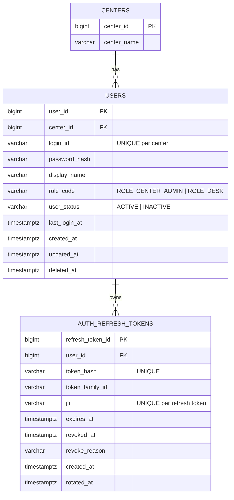

# feat: Phase 5 JWT RBAC 운영 기본기 도입

## Overview

프로토타입(Phase 1~4) 완료 이후, 운영 배포 전제에 필요한 최소 보안/운영 기본기인 `JWT 로그인 + Refresh Token + RBAC + traceId 기반 응답/로그 정렬`을 도입한다.

이번 단계는 프로토타입의 핵심 업무 플로우(회원/상품/회원권 구매·홀딩·해제·환불)를 유지하면서, `no-auth` 단일 관리자 모드에서 실제 인증/인가가 있는 관리자 포털로 전환하는 기반을 구축하는 것이 목적이다.

브레인스토밍에서 확정된 “프로토타입은 no-auth로 빠르게 검증하고 JWT/RBAC는 후속 단계에서 도입” 결정을 그대로 이어받는 Phase 5 계획이다 (see brainstorm: `docs/brainstorms/2026-02-23-gym-crm-product-brainstorm.md`).

## Problem Statement

현재 구현은 내부 검증용 프로토타입으로는 충분하지만 운영 출시 관점에서 아래 공백이 있다.

- 인증/인가 미구현 (`no-auth` 모드)
- 역할 분리 미구현 (`ADMIN` 단일 역할)
- 공통 응답/로그 추적성 미흡 (`traceId` 부재)
- 인증 관련 설계서와 구현 간 불일치 지속 (JWT 만료시간/역할명/토큰 관리 방식)

완료 판정 문서에서도 다음 단계 Must 항목으로 `JWT 로그인/Refresh/RBAC 도입`, `문서 정합화`, `운영 모니터링/로그 표준화`가 명시되어 있다 (`docs/notes/prototype-completion-readiness-decision.md`).

## Proposed Solution

Phase 5를 아래 4개 축으로 구현한다.

1. **Authentication**: 관리자 로그인/로그아웃/토큰 재발급
2. **Authorization (RBAC)**: 최소 역할 기반 API 접근 제어 (`ROLE_CENTER_ADMIN`, `ROLE_DESK`)
3. **Observability/Response Standard**: `traceId` 기반 응답/로그 정렬
4. **Prototype-to-Operational Transition**: no-auth 모드 기본 OFF + 개발용 옵션화 유지

핵심 원칙:
- 운영에 필요한 보안 최소셋을 먼저 도입
- 프로토타입 기능 범위를 깨지 않음
- 설계서와 100% 완전 일치보다 “실행 가능한 단계적 정렬”을 우선
- 정책/상태/권한 변경은 백엔드+프론트 동시 정렬 (최근 홀딩/환불 하드닝에서 얻은 교훈, see solution: `docs/solutions/database-issues/membership-hold-refund-state-integrity-gymcrm-20260224.md`)

## Research Summary (Local + External)

### Local Research (Repo / Docs / Learnings)

- 브레인스토밍에서 프로토타입은 `no-auth`, 장기 역할명은 `ROLE_SUPER_ADMIN / ROLE_CENTER_ADMIN / ROLE_CENTER_MANAGER / ROLE_TRAINER / ROLE_DESK`로 확정됨  
  (see brainstorm: `docs/brainstorms/2026-02-23-gym-crm-product-brainstorm.md`)
- 완료 판정 문서에서 Phase 5 최우선 과제로 `JWT + Refresh + RBAC + traceId`를 제시함  
  (`/Users/abc/projects/GymCRM_V2/docs/notes/prototype-completion-readiness-decision.md`)
- 현재 구현 기준점:
  - `PrototypeModeGuard`로 no-auth를 `dev/staging`에서만 허용 (`/Users/abc/projects/GymCRM_V2/backend/src/main/java/com/gymcrm/common/config/PrototypeModeGuard.java:16`)
  - `ApiResponse`는 UTC timestamp는 있으나 `traceId` 필드 없음 (`/Users/abc/projects/GymCRM_V2/backend/src/main/java/com/gymcrm/common/api/ApiResponse.java:6`)
  - `GlobalExceptionHandler`는 공통 에러 응답 구조는 있으나 MDC traceId 연동 없음 (`/Users/abc/projects/GymCRM_V2/backend/src/main/java/com/gymcrm/common/error/GlobalExceptionHandler.java:16`)
- Institutional learning (`docs/solutions/`):
  - 상태/정책 정합성은 **DB 제약 + 서비스 정책 + UI 가드**를 함께 맞춰야 재발 방지 가능  
    (`/Users/abc/projects/GymCRM_V2/docs/solutions/database-issues/membership-hold-refund-state-integrity-gymcrm-20260224.md`)

### External Research (High-Risk Topic: Security)

보안 주제(JWT/RBAC)라 외부 리서치를 수행함.

- Spring Security 6 권장 패턴:
  - `SecurityFilterChain` + `authorizeHttpRequests` 구성
  - 메서드 보안(`@EnableMethodSecurity`, `@PreAuthorize`) 사용
  - stateless REST API에 맞는 필터 체인 구성 (Spring Security reference 6.5)
- OWASP JWT / REST Security Cheat Sheet:
  - JWT 검증 시 `iss`, `aud`, `exp`, `nbf` 등 표준 claim 검증 필요
  - Refresh rotation / revoke 전략 필요
  - 명시적 logout 시 denylist 또는 refresh revoke 정책 명확화 필요

Sources:
- Spring Security Reference 6.5 (Context7, official docs)
- [OWASP JSON Web Token for Java Cheat Sheet](https://cheatsheetseries.owasp.org/cheatsheets/JSON_Web_Token_for_Java_Cheat_Sheet.html)
- [OWASP REST Security Cheat Sheet](https://cheatsheetseries.owasp.org/cheatsheets/REST_Security_Cheat_Sheet.html)

## Technical Approach

### Scope (Phase 5 In)

- 백엔드 인증 API:
  - `POST /api/v1/auth/login`
  - `POST /api/v1/auth/refresh`
  - `POST /api/v1/auth/logout`
  - `GET /api/v1/auth/me`
- JWT Access Token 발급/검증
- Refresh Token 저장 및 rotation
- 최소 RBAC 적용:
  - `ROLE_CENTER_ADMIN`
  - `ROLE_DESK`
- 공통 `traceId` 생성(MDC) + 응답 포함
- 프론트 로그인 화면/로그아웃/토큰 저장 및 API Authorization 헤더 연동
- 기존 관리자 포털 API/UI의 인증 전환

### Out of Scope (Phase 5 Out)

- 회원용 채널 인증
- 외부 IdP / SSO / OAuth 로그인
- PG/QR/알림톡 연동
- 멀티 센터 운영 UI 전체
- 세분화된 역할(`SUPER_ADMIN`, `CENTER_MANAGER`, `TRAINER`)의 완전 도입
- 고급 세션 보안(디바이스 관리, 이상징후 탐지 등)

### Architecture Decisions (Recommended for Phase 5)

#### A. Refresh Token 저장소

**권장안:** PostgreSQL table 기반 refresh token rotation (Phase 5), Redis denylist는 Phase 5b/6 검토

이유:
- 현재 스택에 PostgreSQL/Flyway는 이미 안정화됨
- Redis 신규 인프라 도입 없이 운영 기본기 도입 가능
- 최소 운영 보안 목표(재발급/로그아웃/refresh revoke) 충족 가능

Trade-off:
- access token 즉시 revoke(denylist)는 제한적
- 완전한 즉시 무효화가 필요하면 `revoked_access_tokens` 또는 Redis denylist 추가 검토

#### A-1. Role Storage Canonical Choice (Phase 5)

**Phase 5 canonical:** `users.role_code` 단일 컬럼 방식으로 시작한다.  
`user_role_assignments`는 다중 역할이 실제 필요해지는 시점(Phase 5b/6)까지 보류한다.

이유:
- 현재 목표는 운영 기본기 최소 도입이며, 다중 역할/권한 매트릭스 확장은 범위가 커짐
- 기존 프로토타입 API 보호 전환 속도와 구현 복잡도 균형 측면에서 단일 컬럼이 유리
- 장기 역할 체계 표준(`ROLE_*`)과는 충돌하지 않음

#### B. Access/Refresh 토큰 정책 (초안)

설계서와 API 문서 간 만료시간 불일치가 있으므로 Phase 5에서 canonical 값을 확정한다.

권장 기본값 (운영 기본기용):
- Access Token: `15분`
- Refresh Token: `7일`
- Refresh Rotation: `ON` (재발급 시 기존 refresh 무효화)

설계서 기준값(15분/7일) 우선 채택을 권장  
(`docs/02_시스템_아키텍처_설계서.md:965`, `docs/02_시스템_아키텍처_설계서.md:966`)

#### C. 역할 모델 도입 순서

Phase 5 최소 역할:
- `ROLE_CENTER_ADMIN`: 모든 현재 프로토타입 업무 API 접근 가능
- `ROLE_DESK`: 회원/상품 조회 + 회원권 구매/홀딩/해제/환불 허용, 상품/사용자 관리 변경은 제한

초기 롤아웃 단순화:
- 1차 적용은 모든 현재 구현 API를 `ROLE_CENTER_ADMIN`로 보호
- `ROLE_DESK`는 아래 최소 매트릭스로 시작하고 점진 확대

Phase 5 최소 권한 매트릭스 (고정):
- `ROLE_CENTER_ADMIN`
  - 모든 현재 프로토타입 API 허용
- `ROLE_DESK`
  - 허용: 회원 조회/등록/수정, 상품 조회, 회원권 구매/홀딩/해제/환불
  - 금지: 상품 등록/수정/상태변경, 사용자/권한 관리 API(Phase 5 범위 내 추가 시)

정책 메모:
- 데스크의 회원 등록/수정 허용은 프론트 데스크 운영 현실을 반영
- 상품 변경은 운영 정책/매출 영향도가 커 관리자 전용으로 시작

#### D. Token Transport & Frontend Storage Strategy (Phase 5 Canonical)

구현 드리프트 방지를 위해 Phase 5의 토큰 전달/저장 전략을 아래로 고정한다.

- Access Token:
  - 응답 body로 반환
  - 프론트 메모리 상태에만 저장 (페이지 새로고침 시 소실 허용)
- Refresh Token:
  - **HttpOnly Cookie** 저장 (JS 접근 불가)
  - 서버는 refresh API에서 cookie 기반으로 토큰 처리
- Frontend/BFF-like dev setup:
  - Vite dev proxy를 사용해 프론트와 백엔드 API를 same-origin처럼 호출 (`/api` 프록시)
  - 로컬 개발에서 쿠키 전달/CORS 복잡도 최소화

비채택(Phase 5):
- refresh token localStorage 저장 (보안 리스크 증가)

추가 정책:
- refresh cookie 속성은 환경별로 분기 (`Secure`, `SameSite`, `Domain`)
- `prod`는 `Secure=true` 강제

### Data Model (Phase 5 Auth Subset)

신규 테이블(권장):
- `users`
- `auth_refresh_tokens`
- (선택) `auth_token_audit_logs` / `revoked_access_tokens` (Phase 5b)

#### ERD (Phase 5 최소안)

## System-Wide Impact

### Interaction Graph

- 로그인 요청 → 인증 서비스 → 사용자 조회/비밀번호 검증 → JWT 생성 → refresh token 저장 → 응답
- API 요청 → Security filter chain → JWT 검증 → SecurityContext 설정 → 컨트롤러/서비스 → 공통 응답/예외 처리
- 예외 발생 시 → GlobalExceptionHandler → `traceId` 포함 공통 에러 응답

### Error & Failure Propagation

- 로그인 실패: `401` (invalid credentials)
- refresh token mismatch/revoked/expired: `401` (인증 실패로 통일)
- 권한 부족: `403`
- 인증 누락/만료 access token: `401`
- token rotation 중 DB 실패: 트랜잭션 롤백 및 새 refresh 발급 금지

정책 고정:
- `403`은 “인증은 되었지만 권한이 부족한 경우”에만 사용
- refresh 실패는 모두 `401`로 반환하고, 에러 코드로 세부 사유를 구분 (`TOKEN_EXPIRED`, `TOKEN_REVOKED`, `TOKEN_INVALID`)

### State Lifecycle Risks

- refresh rotation 시 기존 토큰 revoke + 새 토큰 insert가 분리되면 재사용 취약점 가능
- logout 처리와 refresh 동시 요청 레이스 가능
- user 비활성화 후 기존 refresh token 사용 가능성

Mitigation (Phase 5):
- refresh rotation/logout을 트랜잭션 처리
- token hash unique + 상태 조건부 revoke/update
- user status 재검증 (login/refresh/me 경로)

### API Surface Parity

동일 정책이 필요한 표면:
- Backend API (`/api/v1/**`)
- Frontend API client (`Authorization` 헤더, 401 처리)
- UI 라우팅/가드 (로그인 페이지, 세션 만료 처리)
- 개발용 no-auth (`dev/staging` only) 경로

### Integration Test Scenarios (SpecFlow-style)

1. 로그인 성공 후 보호 API 호출 가능, 로그아웃 후 refresh 불가
2. refresh rotation 후 이전 refresh 재사용 시 차단
3. `ROLE_DESK` 계정으로 관리자 전용 API 접근 시 `403`
4. 만료된 access token + 유효 refresh로 재발급 후 재시도 성공
5. 비활성 사용자 상태에서 기존 토큰 사용 시 차단

## Implementation Phases

### Phase 5-1: Security Foundation (Backend)

목표: no-auth와 병행 가능한 최소 Security 골격 도입

Tasks:
- `spring-boot-starter-security` / JWT 라이브러리 의존성 추가
- `SecurityFilterChain` 기본 구성 (jwt 모드 기준: `/api/v1/auth/**`, `/api/v1/health` permitAll / 나머지 `/api/v1/**` authenticated)
- `@EnableMethodSecurity` 활성화
- 비밀번호 해시(BCrypt) 도입
- `users`, `auth_refresh_tokens` 마이그레이션 + seed admin 계정 전략
- no-auth와 auth mode 전환 설정 추가 (`app.security.mode=prototype|jwt`)

Seed/Bootstrap 정책 (Phase 5 고정):
- `dev/staging`: `center_id=1` 기준 seed 관리자 계정 자동 생성 허용 (환경변수로 로그인 ID/초기 비밀번호 주입)
- `prod`: 기본 관리자 자동 seed 금지, 수동 bootstrap 명령/스크립트로 생성

Success Criteria:
- 앱 기동 시 `prototype`/`jwt` 모드 모두 정상
- seed admin 생성 및 DB 스키마 적용 확인

### Phase 5-2: Auth APIs (Login / Refresh / Logout / Me)

목표: 토큰 라이프사이클 구현

Tasks:
- JWT provider (`iss/aud/exp/nbf/jti` 포함)
- refresh token hash 저장/검증/rotation
- 로그인/재발급/로그아웃/me API 구현
- 공통 에러코드 확장 (`AUTHENTICATION_FAILED`, `TOKEN_EXPIRED`, `ACCESS_DENIED` 등)
- WebMvc + integration test 추가

Success Criteria:
- login → me → refresh → logout 흐름 검증 완료
- 이전 refresh 재사용 차단 테스트 통과

### Phase 5-3: RBAC 적용 (Current APIs)

목표: 기존 회원/상품/회원권 API에 최소 권한 적용

Tasks:
- 역할 상수/권한 매트릭스 정의 (`ROLE_CENTER_ADMIN`, `ROLE_DESK`)
- 컨트롤러/메서드 레벨 `@PreAuthorize` 적용
- no-auth 모드와 jwt 모드에서 CurrentUserProvider 전략 분기
- 권한 실패 응답/프론트 UI 메시지 처리

Success Criteria:
- `CENTER_ADMIN`은 기존 프로토타입 업무 전체 수행 가능
- `DESK`는 의도된 제한대로 `403` 발생

### Phase 5-4: Frontend Auth Transition

목표: 관리자 포털을 인증 기반 UI로 전환

Tasks:
- 로그인 페이지/세션 상태 관리
- access token 메모리 저장 + refresh cookie 기반 재발급 연동 (본 계획의 canonical 전략)
- API client에 `Authorization: Bearer` 주입
- Vite dev proxy(`/api`) 구성으로 same-origin 쿠키 개발환경 정렬
- 401 처리(로그인 이동/재발급 시도) 정책 구현
- `prototypeNoAuth` 배너/상태 표시를 모드별로 정리

Success Criteria:
- 로그인 없이 보호 화면 접근 불가
- 로그인 후 기존 CRUD/구매/홀딩/환불 동작 유지

### Phase 5-5: Traceability & Response Standard Alignment

목표: 운영 추적성 기본기 도입

Tasks:
- traceId 생성 필터(MDC) 추가
- `ApiResponse`에 `traceId` 필드 추가 (설계서 방향 정렬)
- `GlobalExceptionHandler` 에러 응답에 `traceId` 포함
- 로깅 패턴 정리 (`traceId`, `userId`)
- 프론트 에러 화면/콘솔에 `traceId` 노출(운영 대응용)

호환성 메모:
- 응답 포맷 변경 시 프론트 `ApiEnvelope` 타입을 동시 수정
- 동일 저장소 단일 배포 기준으로 백엔드/프론트 함께 업데이트

Success Criteria:
- 성공/실패 응답 모두 `traceId` 포함
- 로그와 응답의 `traceId` 상호 추적 가능

### Phase 5-6: Cutover Validation & Documentation

목표: no-auth → jwt 모드 전환 검증 및 문서화

Tasks:
- 수동 시나리오 재검증 (Phase 3 E2E 흐름 auth 모드에서 재실행)
- 보안 관련 수동 테스트 체크리스트 추가
- 운영/개발 실행 가이드 갱신
- 문서 정합화 (JWT 만료시간, 역할명, center/gym 표현)

Success Criteria:
- jwt 모드에서 핵심 업무 데모 시나리오 완료
- no-auth는 dev/staging 전용 개발 옵션으로만 유지

## Alternative Approaches Considered

### 1) Redis 기반 Refresh/Denylist를 Phase 5에 바로 도입

장점:
- 즉시 revoke/denylist 전략 확장 쉬움

단점 (이번 단계 비채택):
- 인프라/운영 복잡도 증가
- 현재 목표(운영 기본기 최소 도입) 대비 범위 확대

결론:
- Phase 5는 PostgreSQL 기반 refresh rotation으로 시작
- Redis는 Phase 5b/6에서 보안/운영 요구 증가 시 도입 검토

### 2) Frontend를 계속 no-auth로 유지하고 백엔드만 auth 적용

장점:
- 구현 속도 빠름

단점:
- 실제 운영 흐름 검증 불가
- UI/정책 불일치 재발 가능성 큼

결론:
- 백엔드+프론트를 같이 전환하는 것이 맞음 (최근 홀딩/환불 이슈 교훈)

## Acceptance Criteria

### Functional Requirements

- [x] `POST /api/v1/auth/login` 구현 및 성공/실패 응답 제공
- [x] `POST /api/v1/auth/refresh` 구현 및 refresh rotation 적용
- [x] `POST /api/v1/auth/logout` 구현 및 refresh revoke 처리
- [x] `GET /api/v1/auth/me` 구현
- [x] `ROLE_CENTER_ADMIN`, `ROLE_DESK` 최소 RBAC 적용
- [x] 기존 회원/상품/회원권 핵심 플로우가 jwt 모드에서 동작
- [x] no-auth 모드는 `dev/staging` 개발 옵션으로 유지되며 `prod` 차단 유지
- [x] `ROLE_DESK` 최소 권한 매트릭스(회원 등록/수정 + 상품 조회 + 회원권 업무 허용 / 상품 변경 금지)가 테스트로 고정됨

### Non-Functional Requirements

- [x] Access Token/Refresh Token 만료 정책이 문서에 명시되고 설정 가능
- [x] JWT 검증 시 표준 claim(`iss`, `aud`, `exp`, `nbf`) 검증 포함
- [x] Refresh Token은 HttpOnly cookie로 처리되고, 프론트 JS에서 직접 접근하지 않음
- [x] 응답/에러 응답에 `traceId` 포함
- [x] 로그에서 `traceId` 기반 추적 가능

### Quality Gates

- [x] 백엔드 auth/RBAC 통합 테스트 추가 및 통과
- [x] 프론트 auth 전환 후 빌드 성공
- [x] refresh replay / logout-after-refresh / desk-forbidden 상품변경 시나리오 테스트 통과
- [x] 핵심 수동 E2E 시나리오(로그인 포함) 재검증
- [x] 보안/운영 제한사항 문서 업데이트

## Success Metrics

- 관리자 포털 jwt 모드에서 데모 시나리오 재현 가능 (핵심 업무 끊김 없음)
- 인증/권한 오류가 401/403으로 일관되게 동작
- 운영 대응 시 단일 `traceId`로 요청-로그-에러 추적 가능
- no-auth 없이도 개발/검증 흐름을 유지할 수 있는 기본 auth 기반 확보

## Dependencies & Prerequisites

- Java 21 / Spring Boot 3.x / Spring Security 6.x
- PostgreSQL / Flyway (이미 사용 중)
- 프론트엔드 세션 관리 전략 결정 (메모리 vs localStorage)
- 운영용 JWT secret 관리 방식 (환경변수, 로컬/스테이징/프로덕션 분리)

## Risk Analysis & Mitigation

### Risk 1: 인증 도입으로 기존 데모 플로우 회귀

- Mitigation:
  - Phase 3 통합 시나리오를 jwt 모드에서 재실행
  - no-auth 모드를 dev/staging 개발 fallback로 유지 (단 `prod` 차단)

### Risk 2: 토큰 rotation 레이스/재사용 취약점

- Mitigation:
  - refresh token hash unique
  - refresh `jti` unique + token family 기반 rotation 추적
  - 상태 조건부 revoke/update
  - integration test에 refresh replay 시나리오 포함

### Risk 3: 역할 매트릭스 과도한 복잡도

- Mitigation:
  - Phase 5는 `CENTER_ADMIN`/`DESK` 2역할만 우선
  - 나머지 역할은 상수/enum 자리만 확보하고 후속 단계로 분리

### Risk 4: 설계서와 구현 불일치 재확대

- Mitigation:
  - Phase 5에서 JWT 만료시간/역할명/응답 포맷 canonical 값 문서화
  - 변경 시 계획/핸드오프/실행가이드를 함께 갱신

## Documentation Plan

업데이트 대상:
- `/Users/abc/projects/GymCRM_V2/README.md` (로그인 실행 절차)
- `/Users/abc/projects/GymCRM_V2/docs/notes/local-run-phase1.md` (auth 모드 기준으로 개명/개정 필요)
- `/Users/abc/projects/GymCRM_V2/docs/notes/prototype-scope-deviations.md` (no-auth 위치 조정)
- `/Users/abc/projects/GymCRM_V2/docs/notes/prototype-final-handoff-summary.md` (Phase 5 진행 시점 갱신)
- `/Users/abc/projects/GymCRM_V2/docs/testing/*` (인증 포함 검증 체크리스트/로그)

신규 문서(권장):
- `docs/notes/phase5-auth-rbac-decisions.md`
- `docs/testing/phase5-auth-rbac-manual-checklist.md`
- `docs/notes/phase5-auth-rbac-validation-log.md`
- `docs/notes/phase5-auth-api-contract.md` (권한 매트릭스/401·403 규칙/쿠키 정책 포함)

## Sources & References

### Origin

- **Brainstorm document:** `/Users/abc/projects/GymCRM_V2/docs/brainstorms/2026-02-23-gym-crm-product-brainstorm.md`
  - Carried-forward decisions:
    - 프로토타입은 no-auth로 검증하고 JWT/RBAC는 후속 단계에서 도입
    - 장기 역할 체계 표준은 `ROLE_*` 기반으로 정렬
    - 외부 연동보다 도메인 코어/운영 안정화 우선

### Internal References

- Prototype completion decision: `/Users/abc/projects/GymCRM_V2/docs/notes/prototype-completion-readiness-decision.md`
- Final handoff summary: `/Users/abc/projects/GymCRM_V2/docs/notes/prototype-final-handoff-summary.md`
- Scope deviations: `/Users/abc/projects/GymCRM_V2/docs/notes/prototype-scope-deviations.md`
- Current no-auth guard: `/Users/abc/projects/GymCRM_V2/backend/src/main/java/com/gymcrm/common/config/PrototypeModeGuard.java:16`
- Current API envelope: `/Users/abc/projects/GymCRM_V2/backend/src/main/java/com/gymcrm/common/api/ApiResponse.java:6`
- Current exception handling: `/Users/abc/projects/GymCRM_V2/backend/src/main/java/com/gymcrm/common/error/GlobalExceptionHandler.java:16`
- Architecture auth/rbac/traceId sections: `/Users/abc/projects/GymCRM_V2/docs/02_시스템_아키텍처_설계서.md:953`, `/Users/abc/projects/GymCRM_V2/docs/02_시스템_아키텍처_설계서.md:997`, `/Users/abc/projects/GymCRM_V2/docs/02_시스템_아키텍처_설계서.md:1009`, `/Users/abc/projects/GymCRM_V2/docs/02_시스템_아키텍처_설계서.md:1554`, `/Users/abc/projects/GymCRM_V2/docs/02_시스템_아키텍처_설계서.md:1618`
- Institutional learning (state integrity): `/Users/abc/projects/GymCRM_V2/docs/solutions/database-issues/membership-hold-refund-state-integrity-gymcrm-20260224.md`

### External References

- Spring Security Reference 6.5 (servlet authorization / resource server / method security): [Spring Security Reference](https://docs.spring.io/spring-security/reference/)
- OWASP JWT Cheat Sheet: [JSON Web Token for Java Cheat Sheet](https://cheatsheetseries.owasp.org/cheatsheets/JSON_Web_Token_for_Java_Cheat_Sheet.html)
- OWASP REST Security Cheat Sheet: [REST Security Cheat Sheet](https://cheatsheetseries.owasp.org/cheatsheets/REST_Security_Cheat_Sheet.html)

## Pre-Submission Checklist (Plan)

- [x] Relevant brainstorm found and used as planning foundation
- [x] Local repo/docs/learnings reviewed
- [x] External research performed (security topic)
- [x] SpecFlow-style integration/edge-case scenarios included
- [x] ERD mermaid included for new auth tables
- [x] Acceptance criteria are measurable
