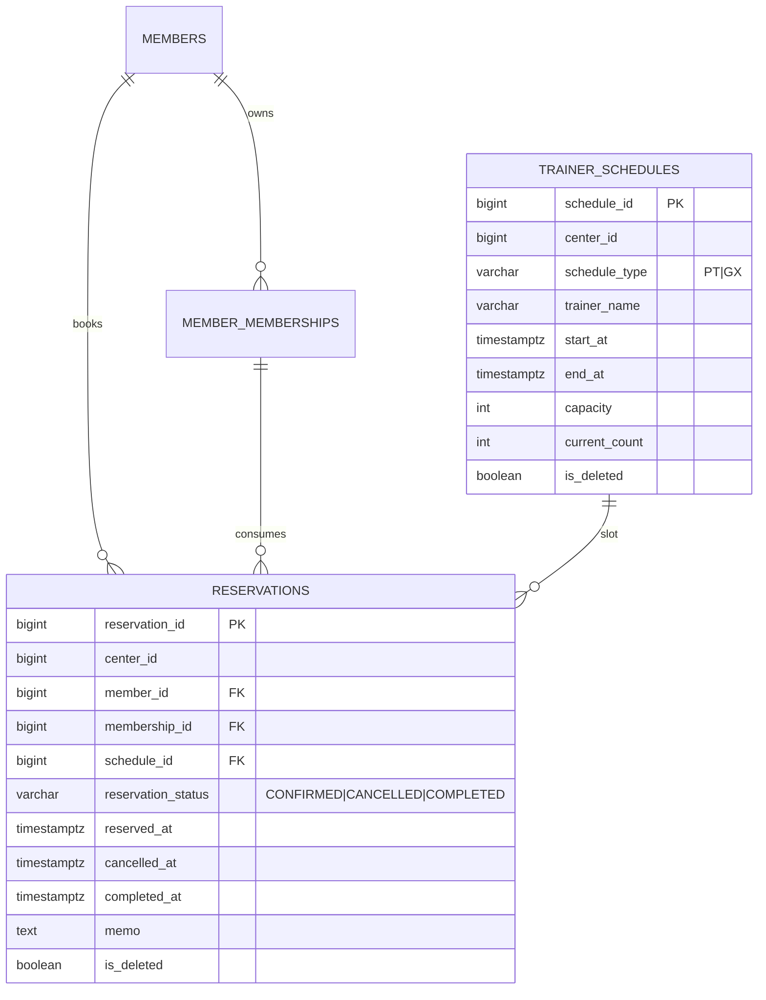

# feat: Phase 7 예약(PT/GX) 및 횟수제 사용 차감 기반 구현

## Overview

Phase 5에서 `JWT + Refresh + RBAC + traceId`를 도입했고, Phase 6에서 관리자 포털 UI를 `사이드바 기반 워크스페이스`로 재구성했다. 다음 단계로는 브레인스토밍/핸드오프 문서에서 일관되게 후속 우선순위로 제시된 **예약(PT/GX) + 횟수제 사용 차감/출석 연결**을 최소 운영 가능한 범위로 구현하는 것이 가장 자연스럽다.

이번 Phase 7은 예약 전체 설계(대기열 자동전환, 알림톡, Redis 락, 회원 모바일 웹)를 한 번에 구현하지 않고, **센터 관리자/데스크가 관리자 포털에서 예약 생성/취소/완료(출석) 처리**를 수행할 수 있는 내부 업무 흐름을 우선 완성한다.

브레인스토밍의 “도메인 코어 우선 + 외부 연동 단계적 활성화” 결정과 “핵심 데스크 업무 우선” 원칙을 그대로 따른다 (see brainstorm: `docs/brainstorms/2026-02-23-gym-crm-product-brainstorm.md`).

## Why This Is the Next Step (Priority Check)

현재 상태를 기준으로 다음 단계 후보를 비교하면:

1. `예약 + 사용 차감` 확장
- 브레인스토밍/핸드오프/완료판정 문서에서 반복적으로 다음 우선순위로 명시됨
- 기존 회원/상품/회원권 도메인 위에 직접적으로 연결되는 기능
- 데스크 운영 관점에서 체감 가치가 큼

2. UI 추가 폴리시/컴포넌트 분리
- 가치 있음
- 그러나 Phase 6에서 이미 사용 가능한 운영형 UI 수준 확보 + 검증 완료
- 도메인 기능 확장 대비 우선순위는 낮음

3. 외부 연동(PG/알림톡/QR)
- 브레인스토밍에서 의도적으로 후순위
- 운영 정책/인프라 의존성이 큼

결론: **다음 단계는 예약(PT/GX) + 횟수제 사용 차감 기반 구현(Phase 7)** 이 적절하다.

## Branch / Execution Context

- 관련 PR 상태:
  - `#2` (Phase 6 프론트 UI 재구성) `MERGED`
  - `#3` (Phase 6 UX 보강 후속 패치) `MERGED`
- 권장 착수 시점: **현재 즉시 가능 (`main` 최신화 후)**
- 권장 작업 브랜치: `codex/feat-phase7-reservations-usage-deduction-foundation`
- 기준 브랜치: `main` (Phase 6 머지 반영본)

## Brainstorm Decisions Carried Forward

브레인스토밍에서 확정된 아래 항목을 그대로 유지한다.

- 관리자 포털 중심 범위 (회원 모바일 웹 미포함)  
  (see brainstorm: `docs/brainstorms/2026-02-23-gym-crm-product-brainstorm.md`)
- 외부 연동 없음(예약 알림톡/게이트/PG 실연동 제외)  
  (see brainstorm: `docs/brainstorms/2026-02-23-gym-crm-product-brainstorm.md`)
- 도메인 코어 우선, 연동 단계적 활성화  
  (see brainstorm: `docs/brainstorms/2026-02-23-gym-crm-product-brainstorm.md`)
- 단일 센터 기본값(`centerId=1`) 개발/검증 전략 유지
- JWT/RBAC 운영 기본 경로 유지 (Phase 5 결과 계승)

## Local Research Summary

### Repo Research (current implementation)

- 예약 도메인 구현 코드는 아직 없음 (`backend/src/main/java/com/gymcrm/reservation/*` 부재)
- 현재 백엔드는 회원/상품/회원권 구매·홀딩·해제·환불 도메인과 JWT/RBAC 기반이 준비됨
- 프론트는 Phase 6에서 `회원권 업무` 탭이 분리되어, 예약 기능 추가 시 추가 워크스페이스 탭 확장 패턴을 재사용 가능
- `App.tsx`는 여전히 큰 컴포넌트지만, 사이드바 IA 및 권한 UX 패턴은 이미 검증됨 (`/Users/abc/projects/GymCRM_V2/frontend/src/App.tsx`)

### Design Docs / Spec References (local)

- 요구사항: 예약 모듈, PT/GX 예약, 취소, 출석 처리, 횟수 차감 요구 명시
  - `/Users/abc/projects/GymCRM_V2/docs/01_요구사항_분석서.md`
- API 설계서: `/api/v1/reservations` 계열 엔드포인트와 상태/에러 코드 예시 존재
  - `/Users/abc/projects/GymCRM_V2/docs/04_API_설계서.md`
- DB 설계서: `trainer_schedules`, `reservations`, `waiting_list` 스키마 초안/인덱스 가이드 존재
  - `/Users/abc/projects/GymCRM_V2/docs/03_데이터베이스_설계서.md`
- 아키텍처 설계서: reservation 모듈 패키지 구조 및 역할 분리 제안 존재
  - `/Users/abc/projects/GymCRM_V2/docs/02_시스템_아키텍처_설계서.md`

### Institutional Learnings (`docs/solutions/`)

- 상태/정책 정합성은 **DB/서비스/UI 3층 정렬**이 중요
  - (see solution: `docs/solutions/database-issues/membership-hold-refund-state-integrity-gymcrm-20260224.md`)
- UI 구조 재배치 시에도 정책 가드/권한 UX를 유지해야 회귀를 줄일 수 있음
  - (see solution: `docs/solutions/ui-bugs/admin-portal-sidebar-workspace-reorg-login-first-gymcrm-20260225.md`)

이번 Phase 7에 적용:
- 예약 중복/정원/상태 전이는 DB 제약 + 서비스 검증 + UI 가드 함께 설계
- RBAC(`ROLE_CENTER_ADMIN`, `ROLE_DESK`)와 프론트 액션 노출 동시 정렬

## External Research Decision

이번 단계는 **기존 내부 설계 문서(요구사항/DB/API/아키텍처)가 충분히 상세**하고, 기술 스택도 기존(Spring Boot + PostgreSQL + React) 범위 안이다. 외부 결제/알림/게이트 연동도 범위 밖이다.

따라서 **외부 리서치는 생략**하고 로컬 문서 + 현 구현 패턴을 기준으로 계획한다.

## Problem Statement / Motivation

현재 시스템은 회원권 구매 이후의 핵심 데스크 업무(홀딩/환불)까지는 지원하지만, 실제 운영에서 빈도가 높은 **수업 예약 및 출석 처리(횟수 차감)** 가 빠져 있다.

이 상태의 한계:
- 회원권(특히 횟수제)을 판매해도 실제 사용 흐름을 추적/소진할 수 없음
- 데스크/매니저가 예약 생성/취소/완료를 시스템에서 처리할 수 없음
- 후속 출입/정산/리포트와 연결되는 핵심 이벤트(예약/출석) 데이터가 누락됨

Phase 7 목표는 이 격차를 메우되, 복잡도가 큰 기능(대기열 자동전환/알림/트레이너 앱/회원 앱)은 제외하여 **운영 핵심 흐름**만 먼저 완성하는 것이다.

## Scope (Phase 7 In / Out)

### In Scope (Phase 7)

- 관리자 포털 기준 예약 기능 (센터 관리자/데스크)
- PT/GX 예약 생성 (내부 데스크 대행 기준)
- 예약 목록/상세/필터(날짜/유형/상태/회원)
- 예약 취소
- 예약 완료(출석 처리) + **횟수제 회원권 잔여 차감** (정책 고정)
- 예약 상태 전이 규칙 및 검증
- 최소 UI 워크스페이스 (`예약 관리` 탭) 추가
- RBAC 적용 (`ROLE_CENTER_ADMIN`, `ROLE_DESK` 허용 범위)
- 수동/브라우저 검증 + 최소 자동 테스트

### Out of Scope (Phase 7)

- 회원 모바일 웹 예약
- 트레이너용 전용 화면/권한 세분화 (`ROLE_TRAINER`)
- 대기열 자동 전환 (`waiting_list`) 실제 구현
- 알림톡/메시지 실발송
- Redis 분산 락/고성능 슬롯 캐시
- QR 출입 연동
- 노쇼 자동 처리/벌점 정책

## Phase 7 Canonical Rules (for this implementation)

프로토타입 및 Phase 5/6의 기준을 이어받아 아래를 고정한다.

1. **단일 센터 개발 기준**
- `centerId=1` 중심 seed/검증

2. **예약 처리 주체**
- 관리자 포털에서 직원(센터관리자/데스크)이 대행 생성/취소/완료
- 회원 채널은 미포함

3. **횟수 차감 시점 (Phase 7 고정)**
- **예약 생성 시 차감하지 않음**
- **예약 완료(출석 처리) 시 횟수제만 1회 차감**
- 취소는 차감이 없으므로 복구 로직 없음

4. **회원권 사용 대상**
- `ACTIVE` 상태의 유효한 **COUNT 타입** 회원권만 출석 차감 가능
- 기간제(`DURATION`) 예약은 예약/완료는 가능하지만 잔여횟수 차감 없음

5. **회원권 선택 정책 (Phase 7 고정)**
- 예약 생성 요청은 **`membershipId`를 필수로 명시**한다 (자동선택 미지원)
- `COUNT` / `DURATION` 모두 예약은 `membershipId`를 저장한다 (감사추적/정합성 목적)
- `membershipId`는 대상 회원(`memberId`) 소유 + 동일 `centerId` + `ACTIVE` 상태여야 한다

6. **시간 정책 단순화**
- 과거 슬롯 예약 불가
- 동일 회원 동일 슬롯 중복 예약 불가
- 동일 슬롯 정원 초과 불가 (GX)
- PT는 초기 버전에서 정원 1로 취급 가능

7. **정원/카운트 정책 (Phase 7 고정)**
- `trainer_schedules.current_count`는 **현재 `CONFIRMED` 상태 예약 수**를 의미한다
- 예약 생성 성공 시 `current_count + 1`
- 예약 취소(`CONFIRMED -> CANCELLED`) 성공 시 `current_count - 1`
- 예약 완료(`CONFIRMED -> COMPLETED`) 성공 시 `current_count - 1`
- `CANCELLED` / `COMPLETED` 는 정원 점유로 계산하지 않는다
- 모든 증감은 `0 <= current_count <= capacity`를 만족해야 하며, 조건부 업데이트/락으로 보호한다

## Proposed Solution (High-Level)

예약 도메인의 최소 코어를 다음 순서로 구현한다.

1. **DB/Foundation**
- `trainer_schedules`, `reservations` 테이블 우선 도입
- `waiting_list`는 스키마만 보류 또는 Phase 7 범위 밖으로 명시 (권장: 보류)
- 예약 상태/중복/정원 관련 핵심 제약 추가

2. **Domain Service**
- 예약 생성/취소/완료 서비스
- 상태 전이 검증 서비스
- 출석 완료 시 횟수제 회원권 차감 트랜잭션 처리

3. **API + RBAC**
- `/api/v1/reservations` 최소 엔드포인트
- `ROLE_CENTER_ADMIN`, `ROLE_DESK` 허용
- 에러코드/상태코드 일관성 유지

4. **Frontend Workspace**
- 사이드바에 `예약 관리` 탭 추가 (Phase 6 패턴 재사용)
- 목록/폼/상세(또는 패널) 기반 관리 화면
- 예약 생성/취소/완료 액션 + 권한 UX

5. **Validation**
- 브라우저 E2E (예약 생성→완료→잔여횟수 차감, 예약 취소)
- 데이터 정합성 SQL 확인

## Technical Approach

### Backend Module Structure (Phase 7 target)

아키텍처 설계서의 reservation 모듈 방향을 따르되, 최소 구현으로 시작:

- `backend/src/main/java/com/gymcrm/reservation/ReservationController.java`
- `backend/src/main/java/com/gymcrm/reservation/ReservationService.java`
- `backend/src/main/java/com/gymcrm/reservation/ReservationRepository.java`
- `backend/src/main/java/com/gymcrm/reservation/TrainerScheduleRepository.java`
- `backend/src/main/java/com/gymcrm/reservation/ReservationStatusTransitionService.java`

기존 membership 모듈과의 경계:
- 횟수 차감은 `reservation` 서비스가 수행하되, 회원권 상태/잔여 차감 검증은 `membership` 도메인 규칙을 재사용/캡슐화
- 가능하면 `MembershipUsageService` 같은 얇은 서비스 추가로 책임 분리

### Database Design (Phase 7 minimal subset)

권장 1차 테이블:
- `trainer_schedules`
- `reservations`

권장 보류:
- `waiting_list` (대기열 자동 전환 미구현이므로 Phase 7 scope out)

핵심 제약/인덱스 (1차):
- `uk_reservations_member_schedule (member_id, schedule_id)` 중복 예약 방지
- 예약 상태 체크 제약 (`CONFIRMED`, `COMPLETED`, `CANCELLED`)
- 스케줄 정원/현재예약인원(`current_count`) 조회 인덱스
- Soft delete/audit 필드 패턴은 기존 테이블과 동일
- `reservations.membership_id`는 `NOT NULL` (Phase 7 정책: 예약 생성 시 명시 선택 필수)

`current_count` 운영 규칙(Phase 7 고정):
- 의미: `CONFIRMED` 상태 예약 수 캐시 필드
- `create`: `+1`
- `cancel`: `-1` (only `CONFIRMED`)
- `complete`: `-1` (only `CONFIRMED`)
- 동시성 보호: 스케줄 row lock 또는 조건부 업데이트(`current_count < capacity`) 중 하나를 구현 시점에 고정하고 통합 테스트로 검증

### Reservation Status Model (Phase 7)

최소 상태:
- `CONFIRMED`
- `CANCELLED`
- `COMPLETED`

허용 전이(초기):
- `CONFIRMED -> CANCELLED`
- `CONFIRMED -> COMPLETED`
- `CANCELLED` / `COMPLETED` 는 terminal

### Membership Usage Deduction Policy (Phase 7)

예약 완료 시:
- COUNT 회원권: `remaining_count - 1`, 0 미만 불가
- DURATION 회원권: 차감 없음 (출석 이벤트만 기록)

트랜잭션 요구:
- 예약 상태 `COMPLETED` 전환 + 횟수 차감은 원자적이어야 함
- 부분 실패 시 롤백

## System-Wide Impact

### Interaction Graph

- `예약 생성 API`
  - `ReservationController` → `ReservationService#create`
  - `TrainerSchedule` 조회/정원 검증
  - `Member`/`MemberMembership` 유효성 검증
  - `reservations` 저장

- `예약 완료 API`
  - `ReservationController` → `ReservationService#complete`
  - 예약 상태 전이 검증 (`CONFIRMED -> COMPLETED`)
  - (COUNT 회원권인 경우) `member_memberships.remaining_count` 차감
  - 예약 상태 업데이트 + 출석시각 저장

### Error Propagation

- Validation errors: `400`
- 비즈니스 규칙 위반(중복 예약, 정원 초과, 상태 전이 불가, 사용 가능한 회원권 없음): `409`
- 권한 부족: `403` (Phase 5 RBAC/GlobalExceptionHandler 매핑 재사용)

### State Lifecycle Risks

- 예약 완료 처리 중 차감 실패 시 예약만 `COMPLETED`로 남는 부분 실패 위험
  - 대응: 단일 트랜잭션 처리
- 중복 완료 요청으로 이중 차감 위험
  - 대응: 상태 조건부 업데이트 + 상태 전이 검증 + 통합 테스트
- 동시 예약으로 정원 초과 위험
  - 대응: 1차는 DB 제약/조건부 카운트 업데이트 또는 스케줄 row lock 중 하나를 선택해 구현

### API Surface Parity

- 백엔드 API 추가 시 프론트 `예약 관리` 탭 액션과 동시 정렬 필요
- `ROLE_DESK` UX 제한/허용 범위는 백엔드 RBAC와 프론트 버튼 상태를 함께 확인

### Integration Test Scenarios (must-have)

1. 예약 생성 성공 (`CONFIRMED`)
2. 동일 회원 동일 슬롯 중복 예약 차단 (`409`)
3. 정원 초과 예약 차단 (`409`)
4. 예약 완료 성공 + COUNT 회원권 잔여 1차감
5. 예약 완료 재호출 차단 (이중 차감 방지)
6. 예약 취소 후 완료 불가

## SpecFlow Analysis (Phase 7 focus)

### Primary Flows

1. `회원 선택 → 예약 관리 탭 → 스케줄 선택 → 예약 생성`
2. `예약 목록 → 예약 완료(출석) → 횟수제 잔여차감 확인`
3. `예약 목록 → 예약 취소`

### Edge Cases / Gaps to address

- COUNT 회원권 잔여 0인 회원의 예약 생성/완료 처리 정책 (Phase 7에서 최소 정책 고정 필요)
- DURATION 회원권 회원의 PT/GX 예약 허용 범위 정책
- 당일/과거 시간 슬롯 처리 기준 (timezone/UTC vs local date)
- 동일 회원이 여러 ACTIVE COUNT 회원권을 가진 경우 어느 회원권을 차감할지

### Phase 7 Policy Fixes (to avoid ambiguity)

Phase 7에서는 아래를 고정:
- 예약 생성 시 **회원권 자동선택 미지원**
- 예약 생성 시 **`membershipId` 명시 선택 required** (관리자 포털이므로 가능)
- 과거 슬롯 판정은 `Asia/Seoul` 로컬 시간 기준 (문서화)

## Implementation Phases (Phase 7)

### P7-1. Reservation Schema Foundation

- Flyway 마이그레이션 추가 (`trainer_schedules`, `reservations`)
- 예약 상태 enum/제약/인덱스 반영
- 기본 dev seed (예시 트레이너 슬롯) 추가

Deliverables:
- `V7__create_trainer_schedules_and_reservations.sql`
- (선택) `V8__seed_reservation_schedules_dev.sql`

### P7-2. Reservation Domain Services (create/cancel/complete)

- 예약 상태 전이 검증 서비스
- 예약 생성 서비스 (중복/정원/과거슬롯 검증)
- 예약 취소 서비스
- 예약 완료 서비스 + 횟수제 차감 트랜잭션

Deliverables:
- `ReservationService`
- `ReservationStatusTransitionService`
- membership 차감 연계 서비스(재사용/신규)

### P7-3. Reservation API + RBAC

- `POST /api/v1/reservations`
- `GET /api/v1/reservations`
- `GET /api/v1/reservations/{reservationId}`
- `POST /api/v1/reservations/{reservationId}/cancel`
- `POST /api/v1/reservations/{reservationId}/complete`
- `ROLE_CENTER_ADMIN`, `ROLE_DESK` 권한 적용

Deliverables:
- Controller/DTO/Repository
- 에러 응답 표준 정렬(`traceId` 포함, 기존 패턴 유지)

### P7-4. Frontend Reservation Workspace (Sidebar Tab)

- 사이드바에 `예약 관리` 탭 추가
- 예약 목록/필터/생성 폼
- 예약 취소/완료 액션
- 회원권 선택 필드(`membershipId`) 포함

Deliverables:
- `frontend/src/App.tsx` 내 워크스페이스 추가 (1차)
- 필요 시 Phase 6 후속으로 일부 렌더 함수 분리

### P7-5. Validation / QA / Docs

- Backend 자동 테스트 (서비스/통합)
- Frontend 빌드 + 브라우저 검증
- SQL 정합성 확인 (예약 row, membership remaining_count)
- 계획/검증 로그/제약사항 문서 업데이트

Deliverables:
- `docs/notes/phase7-reservation-usage-deduction-validation-log.md`
- 필요 시 `docs/solutions/` 신규 학습 문서

## Alternative Approaches Considered

### Option A. 예약 생성 시 즉시 횟수 차감

장점:
- 완료 처리 로직 단순화 가능

단점:
- 취소/노쇼/재배정 정책 복잡도 급증
- 현재 프로토타입/Phase 7 범위와 맞지 않음

결론:
- Phase 7에서는 비채택. `완료 시 차감`이 더 안전함.

### Option B. PT/GX 전체 + 대기열/알림까지 한 번에 구현

장점:
- 요구사항 문서와 더 가까운 완성도

단점:
- 범위 과대 (대기열, 메시지, 정책, 동시성)
- 검증 비용 급증

결론:
- Phase 7 범위 creep 위험이 커서 비채택.

## Acceptance Criteria

### Functional Requirements

- [x] 관리자 포털(`jwt` 모드)에서 `예약 관리` 탭으로 예약 생성/조회/취소/완료가 가능하다
- [x] `ROLE_CENTER_ADMIN`, `ROLE_DESK`는 예약 생성/취소/완료를 수행할 수 있다 (Phase 7 최소 정책)
- [ ] 예약 생성 요청은 `membershipId`를 필수로 포함하며, 회원-회원권 소유 불일치 요청은 차단된다 (`409` 또는 `400`)
- [ ] 동일 회원 동일 슬롯 중복 예약이 차단된다 (`409`)
- [ ] 정원 초과 슬롯 예약이 차단된다 (`409`)
- [x] 예약 완료 시 COUNT 회원권 잔여횟수가 정확히 1 감소한다
- [x] 예약 취소/완료 상태 전이가 비정상 요청에서 차단된다 (`409`)

### Non-Functional Requirements

- [x] 예약 완료 + 횟수 차감은 단일 트랜잭션으로 처리된다 (부분 실패 롤백)
- [x] `trainer_schedules.current_count`가 `CONFIRMED` 예약 수와 일관되게 유지된다 (create/cancel/complete)
- [ ] 에러 응답은 기존 표준(`traceId` 포함)과 일관된다
- [ ] 프론트 `ROLE_DESK` UX가 백엔드 RBAC와 모순되지 않는다

### Quality Gates

- [x] `backend` 예약 관련 서비스/통합 테스트 통과
- [x] `backend` 전체 테스트 통과 (`./gradlew test --no-daemon`)
- [x] `frontend` 빌드 통과 (`npm run build`)
- [x] 브라우저 검증 로그 문서화 (예약 생성→완료→차감 / 취소 시나리오)
- [x] Phase 7 계획 체크리스트/상태 갱신

## Success Metrics

- 데스크 기준 예약 핵심 업무(`생성/취소/완료`)가 시스템 내부에서 끝까지 수행 가능
- 예약 완료 후 횟수 차감 데이터 정합성이 SQL + UI에서 일치
- 수동 검증 중 치명적 정책 혼선(차감 시점/환불/홀딩 충돌) 없음

## Dependencies & Risks

### Dependencies

- `main` 최신화 (PR #2, PR #3 머지 반영본)
- Phase 5 JWT/RBAC 기반 유지
- Docker PostgreSQL 로컬 개발 환경

### Risks

1. **정책 모호성 (차감 시점/회원권 선택 규칙)**
- 대응: Phase 7 canonical rules로 사전 고정 (`membershipId` 명시 선택)

2. **동시성 이슈 (정원 초과/이중 완료)**
- 대응: DB 제약 + 상태 조건부 업데이트/락 전략 + 통합 테스트

3. **UI 복잡도 증가 (`App.tsx` 추가 비대화)**
- 대응: 예약 워크스페이스 렌더 함수 분리 우선, 대규모 컴포넌트 분리는 후속 선택과제로 유지

## ERD (Phase 7 Minimal Reservation Subset)

## Documentation Plan

Phase 7 구현 시 아래 문서를 업데이트/추가한다.

- 신규 검증 로그:
  - `docs/notes/phase7-reservation-usage-deduction-validation-log.md`
- 범위 차이 문서(필요 시):
  - `docs/notes/prototype-scope-deviations.md` (예약 범위가 “부분 구현”으로 바뀌므로 갱신 가능성)
- 학습 문서(문제 해결 시):
  - `docs/solutions/database-issues/*` 또는 `docs/solutions/logic-errors/*`

## Sources & References

### Origin

- **Brainstorm document:** `/Users/abc/projects/GymCRM_V2/docs/brainstorms/2026-02-23-gym-crm-product-brainstorm.md`
  - Carried-forward decisions:
    - 관리자 포털 중심
    - 외부연동 단계적 활성화
    - 핵심 데스크 업무 우선 후 예약/출입/라커 순차 확장

### Internal References

- `/Users/abc/projects/GymCRM_V2/docs/notes/prototype-completion-readiness-decision.md`
- `/Users/abc/projects/GymCRM_V2/docs/plans/2026-02-24-feat-phase5-jwt-rbac-operational-basics-plan.md`
- `/Users/abc/projects/GymCRM_V2/docs/plans/2026-02-24-feat-phase6-frontend-sidebar-shell-and-login-first-ui-plan.md`
- `/Users/abc/projects/GymCRM_V2/docs/03_데이터베이스_설계서.md`
- `/Users/abc/projects/GymCRM_V2/docs/04_API_설계서.md`
- `/Users/abc/projects/GymCRM_V2/docs/02_시스템_아키텍처_설계서.md`

### Institutional Learnings

- `/Users/abc/projects/GymCRM_V2/docs/solutions/database-issues/membership-hold-refund-state-integrity-gymcrm-20260224.md`
- `/Users/abc/projects/GymCRM_V2/docs/solutions/ui-bugs/admin-portal-sidebar-workspace-reorg-login-first-gymcrm-20260225.md`

## Recommended Next Step

1. `main` 최신화 (`git fetch origin && git checkout main && git pull`)
2. 이 계획 문서 기준 정책 확정사항 재확인 (`membershipId required`, `current_count=CONFIRMED 예약 수`)
3. `/prompts:workflows-work`로 Phase 7 구현 시작
