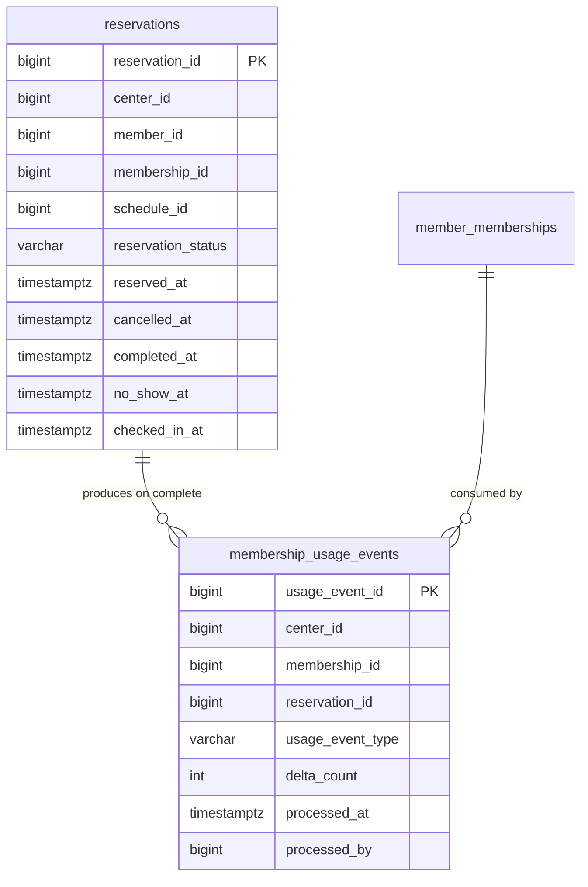

# feat: Phase 8 출석/체크인 및 사용 이벤트 정합성 고도화

## Overview

Phase 7에서 예약(PT/GX) 생성/취소/완료와 횟수제 차감 기반이 구현되었다. 다음 단계는 예약 완료 중심의 단일 흐름을 실제 운영 흐름에 더 가깝게 확장하는 것이다.

Phase 8은 다음을 목표로 한다.
- `출석/체크인` 상태를 예약과 분리해 모델링하거나(또는 예약 상태 확장), 운영자가 실제 방문/노쇼를 구분할 수 있게 한다.
- 횟수 차감 이벤트를 예약 완료에만 묶지 않고, **사용 이벤트 정합성** 관점에서 재검토/정리한다.
- 향후 출입/리포트/정산 확장을 위한 이벤트 데이터 기반을 강화한다.

핵심 방향은 **기능 추가보다 운영 데이터의 의미를 명확하게 만드는 것**이다.

## Why This Is Next

Phase 7 완료로 예약 업무는 동작하지만, 운영 현실에서는 아래 정보가 필요하다.
- 예약만 하고 방문하지 않은 회원(`NO_SHOW`)
- 현장 체크인 시간/처리자
- 예약 완료(출석)와 실제 사용 차감 이벤트의 추적성
- 이력 기반 리포팅(출석률/노쇼율/차감 이력 확인)

Phase 8에서 이 레이어를 정리하면 이후 기능(출입/리포트/정산/CRM) 품질이 좋아진다.

## Current Baseline (Phase 7)

완료된 기반:
- JWT + RBAC + traceId (Phase 5)
- 사이드바 기반 운영형 UI (Phase 6)
- 예약 생성/취소/완료 + COUNT 회원권 차감 (Phase 7)
- 예약 API actor center scoping 보강
- 예약 생성 eligibility 보강(COUNT 잔여횟수 0 차단)

남은 구조적 한계:
- 예약 상태가 `CONFIRMED/CANCELLED/COMPLETED`에 집중되어 출석/노쇼 의미가 단순화됨
- 차감 이벤트가 예약 완료 처리 응답에 간접 반영되고, 별도 usage event 모델이 없음
- 운영 리포트/분석용 이벤트 축적 구조가 약함

## Phase 8 Scope (In / Out)

### In Scope
- 예약 출석 처리 모델 고도화 (권장안: `NO_SHOW` 포함)
- 체크인/출석 처리 시각 및 처리자 추적 필드(또는 별도 attendance/event 테이블)
- COUNT 차감 이벤트 추적성 보강 (이벤트 row 또는 참조 강화)
- 예약/회원권 UI에 출석/노쇼 처리 UX 추가
- 최소 리포트성 조회(예약 상태 집계/출석률 기초 수치) 또는 운영 화면 보조 정보
- RBAC 정렬 (`CENTER_ADMIN`, `DESK` 허용 범위 유지)

### Out of Scope
- 회원 모바일 웹 예약/출석
- 알림톡/푸시/자동 리마인드
- 대기열 자동 승격
- QR 게이트 연동/출입장치 실연동
- 트레이너 정산/급여 계산 고도화
- 대규모 배치 리포트/데이터 웨어하우스

## Canonical Rules (Proposed)

### Rule 1: Reservation lifecycle states (Phase 8)
권장 최소 상태셋:
- `CONFIRMED` (예약 확정, 정원 점유)
- `CANCELLED` (취소, 정원 해제)
- `COMPLETED` (출석 완료/수업 처리 완료, 정원 해제)
- `NO_SHOW` (미출석 확정, 정원 해제)

정책:
- `current_count`는 여전히 `CONFIRMED 예약 수`
- `CONFIRMED -> COMPLETED | CANCELLED | NO_SHOW`에서 모두 `current_count - 1`
- terminal 상태(`COMPLETED/CANCELLED/NO_SHOW`)에서 추가 전이 금지 (초기안)

### Rule 1-1: `NO_SHOW` 처리 가능 시점 (고정)
- **권장안 고정:** `NO_SHOW`는 `schedule.end_at` 이후에만 처리 가능
- 이유:
  - 수업 진행 중/시작 전 조기 노쇼 처리로 인한 운영 혼선 방지
  - 정원 해제 타이밍을 운영적으로 보수적으로 유지
- 초기안에서 정정(undo) 정책:
  - terminal 상태 전이 금지 원칙 유지
  - 실수 정정은 직접 DB 수정이 아니라 후속 Phase에서 전용 관리자 정정 플로우로 검토 (이번 범위 밖)

### Rule 2: COUNT 차감 시점
권장 유지안:
- **`COMPLETED` 처리 시 1회 차감**
- `NO_SHOW`는 초기안에서 차감하지 않음 (정책 변경 가능성 높아 하드코딩 최소화)

### Rule 2-1: Check-in semantics (Phase 8 고정)
- **Phase 8에서 체크인은 상태 전이가 아니라 메타데이터 기록으로 정의**
- 상태 모델은 `CONFIRMED/CANCELLED/COMPLETED/NO_SHOW`만 유지 (별도 `CHECKED_IN` 상태 미도입)
- `checked_in_at`는 선택 필드이며 의미는 다음으로 고정:
  - 운영자가 현장 도착 확인 버튼을 눌렀을 때 기록되는 timestamp
  - 정원(`current_count`) 및 COUNT 차감에는 영향 없음
- 재처리 정책 (고정):
  - `check-in`은 `CONFIRMED` 상태에서 **1회만 허용**
  - 이미 `checked_in_at`가 있으면 재호출은 `CONFLICT` (idempotent success 아님)
- `NO_SHOW` 상호작용 정책 (고정):
  - `checked_in_at`가 기록된 예약은 `NO_SHOW` 처리 불가 (`BUSINESS_RULE`)
- `attended_at`는 Phase 8 초기안에서는 **도입하지 않음** (중복 의미 방지)
- API 범위:
  - `POST /api/v1/reservations/{reservationId}/check-in` 추가 (선택 구현이 아닌 Phase 8 포함)

### Rule 3: Usage traceability
- COUNT 차감 발생 시 "왜 차감되었는지"를 추적 가능해야 함
- 최소안: `payments` 외에 별도 `membership_usage_events` 테이블 추가
  - `usage_event_type` (`RESERVATION_COMPLETE`)
  - `membership_id`, `reservation_id`, `delta_count`, `processed_at`, `processed_by`

### Rule 3-1: Usage event idempotency / uniqueness (고정)
- `membership_usage_events`는 동일 예약 완료 이벤트에 대해 **1건만 생성**되어야 함
- 고정 규칙:
  - `usage_event_type='RESERVATION_COMPLETE'`일 때 `reservation_id`당 1건
- 구현 기준 (권장 고정):
  - DB unique invariant로 강제 (`UNIQUE (reservation_id, usage_event_type)`)
  - 서비스는 duplicate 생성 시 재처리/중복 완료 경로를 성공/실패 중 하나로 일관 처리 (Phase 8에서는 `CONFLICT` 권장)

## Data Model Options

### Option A: `reservations` 확장 + `membership_usage_events` 추가 (Recommended)
- `reservations.reservation_status`에 `NO_SHOW` 추가
- `reservations.no_show_at`, `checked_in_at` 필드 추가 (`attended_at`는 Phase 8 제외)
- `membership_usage_events` 추가로 COUNT 차감 추적

장점:
- 기존 Phase 7 구조 재사용
- 구현 난이도 낮음
- 리포트/정합성 추적 강화

단점:
- 예약과 출석 의미가 한 테이블에 계속 섞임

### Option B: `reservation_attendances` 별도 테이블 도입
장점:
- 예약/출석 도메인 분리 명확
단점:
- 초기 구현 복잡도 증가, UI/API도 늘어남

## Recommended Architecture (Phase 8)

- **선택안: Option A**
- Phase 7 service 패턴 재사용:
  - `ReservationStatusTransitionService` 확장
  - `ReservationService`에 `markNoShow(...)` 추가
  - COUNT 차감 로직은 `complete(...)`에서 유지, 이벤트 기록만 추가
- DB 제약 + 서비스 검증 + UI 가드 3층 정렬 유지

## Proposed Implementation Phases

### P8-1. Schema & Event Foundation
- Flyway migration:
  - `reservations` 상태 enum/check에 `NO_SHOW` 추가
  - `no_show_at`, `checked_in_at` 컬럼 추가
  - `membership_usage_events` 테이블 추가
  - 인덱스 (`membership_id`, `reservation_id`, `usage_event_type`, `processed_at`)
  - unique invariant: `UNIQUE (reservation_id, usage_event_type)` (Phase 8 canonical rule)
- 기존 데이터 호환성 검토 (Phase 7 rows 유지)
- 진행 메모 (2026-02-25):
  - `V9__reservation_attendance_and_usage_event_foundation.sql` 구현 완료
  - 예약 레코드/리포지토리 매핑 호환 반영 (`no_show_at`, `checked_in_at`)
  - 스키마 foundation 테스트 + Flyway 런타임 검증 완료 (검증 로그 참조)

### P8-2. Domain Rules & Services
- `ReservationStatusTransitionService` 전이표 확장 (`CONFIRMED -> NO_SHOW`)
- `ReservationService.markCheckIn(...)` 구현
  - `CONFIRMED` 상태에서만 허용
  - `checked_in_at` 기록만 수행 (정원/차감 영향 없음)
  - 이미 `checked_in_at`가 있으면 `CONFLICT`
- `ReservationService.markNoShow(...)` 구현
  - 상태 조건부 업데이트
  - `schedule.end_at` 이후만 허용
  - `checked_in_at` 존재 시 차단 (`BUSINESS_RULE`)
  - `current_count - 1`
  - COUNT 차감 없음(초기 정책)
- `ReservationService.complete(...)`에 usage event 기록 추가
- 트랜잭션 원자성 보장 (상태변경 + 카운트 + usage event)
- 진행 메모 (2026-02-25):
  - `checkIn(...)`, `noShow(...)` 서비스 구현 완료
  - `complete(...)`의 COUNT 차감 경로에 `membership_usage_events` 기록 연결 완료
  - 예약 상태 전이 서비스 `NO_SHOW` 반영 및 서비스 통합 테스트 추가 완료

### P8-3. API & RBAC
- API 추가:
  - `POST /api/v1/reservations/{reservationId}/check-in`
  - `POST /api/v1/reservations/{reservationId}/no-show`
- 기존 `detail/list` 응답 필드 확장 (`noShowAt`, `checkedInAt`)
- RBAC: `ROLE_CENTER_ADMIN`, `ROLE_DESK` 허용
- 오류 코드/메시지 표준 유지 (`traceId` 포함)
- 진행 메모 (2026-02-25):
  - `check-in`, `no-show` API 엔드포인트 구현 완료
  - `ReservationApiIntegrationTest`에 DESK 권한 흐름 및 Phase 8 정책(재체크인/노쇼 시점) 자동 검증 추가

### P8-4. Frontend Reservation Workspace UX
- `예약 관리` 탭 액션에 `체크인` 추가 (`CONFIRMED`만)
- `예약 관리` 탭 액션에 `노쇼 처리` 추가 (`CONFIRMED`만)
- `checked_in_at`가 있으면 `체크인` 버튼 숨김/비활성 + `노쇼 처리` 버튼 숨김/비활성
- 상태 badge 구분 강화 (`COMPLETED`, `CANCELLED`, `NO_SHOW`)
- 회원권/예약 연계 메시지 개선:
  - `COMPLETED`: 잔여횟수 차감 표시
  - `NO_SHOW`: 차감 없음 표시
- 모바일 대응 유지(Phase 6 UX 패턴 준수)
- 진행 메모 (2026-02-25):
  - 예약 목록 액션에 `체크인`/`노쇼` 버튼 연결 완료
  - `NO_SHOW` 종료시각 전 비활성, `checked_in_at` 존재 시 `체크인/노쇼` 비활성 UI 반영
  - `checkedInAt`, `noShowAt` 컬럼 표시 반영
  - 브라우저 실검증은 다음 단계에서 수행 예정

### P8-5. Validation, Docs, and Reporting Hooks
- 자동 테스트:
  - `check-in` timestamp 기록 / 재처리 정책 검증 (`CONFIRMED`만 허용, 재호출 `CONFLICT`)
  - `NO_SHOW` 시점 제한 (`schedule.end_at` 이전 차단, 이후 허용)
  - `checked_in_at` 존재 예약의 `NO_SHOW` 차단
  - `NO_SHOW` 상태 전이 / 재처리 차단 / `current_count` 감소
  - `COMPLETED` usage event 생성 / 중복 완료 시 이벤트 중복 생성 방지 (DB unique + 서비스 처리)
- 브라우저 검증:
  - 예약 생성 -> 노쇼 / 완료 / 취소 각 경로
- SQL 검증:
  - `current_count` 복원/감소 정합성
  - `membership_usage_events` row 생성/참조 정합성
- 문서화:
  - 검증 로그
  - 완료 판정 업데이트
  - compound solution note(상태/이벤트 정합성)

## API Sketch (Phase 8)

### `POST /api/v1/reservations/{reservationId}/no-show`

Response (example):
```json
{
  "success": true,
  "message": "노쇼 처리되었습니다.",
  "traceId": "...",
  "data": {
    "reservationId": 123,
    "reservationStatus": "NO_SHOW",
    "noShowAt": "2026-02-25T10:10:00Z"
  }
}
```

### `POST /api/v1/reservations/{reservationId}/check-in`

Response (example):
```json
{
  "success": true,
  "message": "체크인 처리되었습니다.",
  "traceId": "...",
  "data": {
    "reservationId": 123,
    "reservationStatus": "CONFIRMED",
    "checkedInAt": "2026-02-25T09:58:00Z"
  }
}
```

## Data Model Sketch (Recommended)



## Key Risks & Mitigations

1. 상태 전이 복잡도 증가로 인한 중복 차감/카운트 불일치
- 대응: 상태 조건부 업데이트 + 통합 테스트 + SQL 검증 체크리스트

2. `NO_SHOW` 정책 변경 가능성 (차감 여부)
- 대응: Phase 8에서는 `NO_SHOW no-deduction`로 고정, 차감 정책은 feature flag/설정 포인트 후보로 문서화

3. UI 액션 증가에 따른 혼잡도
- 대응: Phase 6에서 적용한 compact/details 패턴 재사용, 모바일 검증 포함

## Acceptance Criteria (Draft)

- [x] `NO_SHOW` 상태가 예약 도메인/API/UI에 일관되게 반영됨
- [x] `check-in`이 `CONFIRMED` 상태에서만 허용되고 `checked_in_at` 메타데이터로 기록됨 (정원/차감 영향 없음)
- [x] `check-in` 재호출은 `CONFLICT`로 차단됨 (중복 체크인 금지)
- [x] `NO_SHOW`가 `schedule.end_at` 이후에만 허용됨
- [x] `checked_in_at`가 있는 예약은 `NO_SHOW` 처리 불가
- [x] `current_count`가 `CONFIRMED` 기준으로만 유지되고 `COMPLETED/CANCELLED/NO_SHOW` 처리 시 감소함
- [x] `COMPLETED` 시 COUNT 차감 + usage event 기록이 원자적으로 처리됨
- [x] `membership_usage_events`가 `RESERVATION_COMPLETE`에 대해 `reservation_id`당 1건만 생성됨 (idempotency 보장)
- [x] `NO_SHOW` 시 COUNT 차감이 발생하지 않음 (초기 정책)
- [x] `ROLE_DESK`가 예약 생성/취소/완료/노쇼를 수행 가능함
- [x] `ROLE_DESK`가 체크인 처리도 수행 가능함
- [x] backend tests + frontend build + browser validation + SQL validation 완료

## Suggested Next Step

- PR/브랜치 기준: Phase 7 merge 완료 상태에서 바로 착수 가능
- 권장 시작점: `P8-1` (schema + usage event foundation)
- 권장 작업 브랜치: `codex/feat-phase8-attendance-checkin-usage-events`
