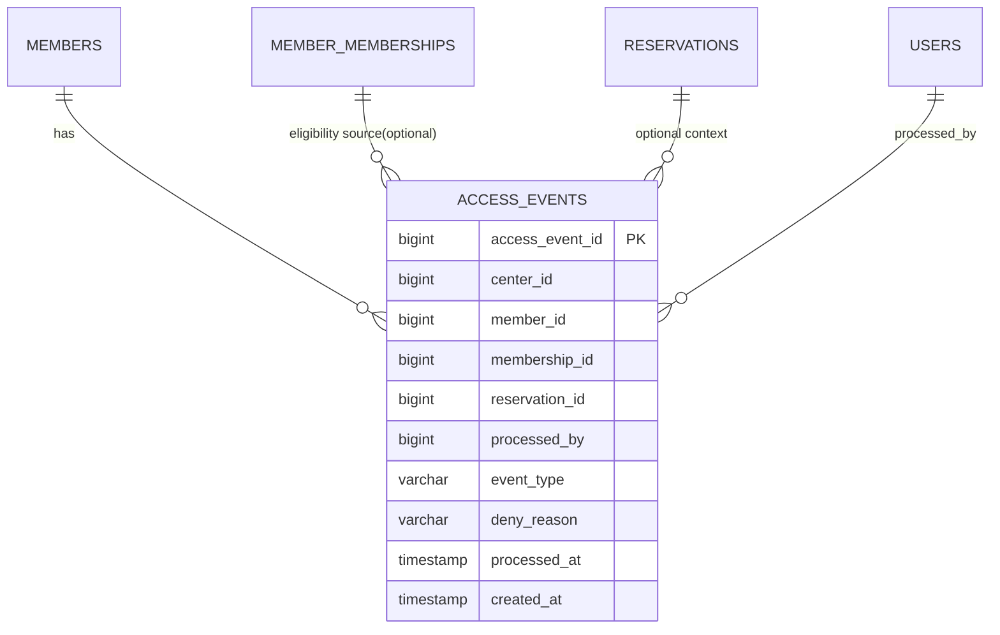

# feat: Phase 9 출입/체크인 운영 고도화

## Overview

Phase 8까지 `예약/체크인/노쇼/사용차감` 정합성 기반이 확보됐다. 다음 단계(Phase 9)는 실제 센터 운영 관점에서 출입 처리와 체크인 운영을 고도화해, “예약 도메인 이벤트”와 “현장 출입 이벤트”를 연결 가능한 수준으로 끌어올리는 것이다.

핵심 목표:
- 데스크/직원 관점 출입 처리 UX 강화
- 출입 이벤트 로그 모델 도입(누가/언제/어떤 경로로 출입 처리했는지)
- 예약 체크인과 출입 처리 간 정책 정렬
- 향후 QR 게이트/정산/리포트 확장을 위한 데이터 기반 확보

브레인스토밍에서 확정된 방향(관리자 포털 중심, 외부 연동 단계적 활성화, 코어 우선)은 유지한다 (see brainstorm: docs/brainstorms/2026-02-23-gym-crm-product-brainstorm.md).

## Why This Is Next

현재 `main` 기준:
- 예약 체크인(`checked_in_at`)과 노쇼(`NO_SHOW`)는 지원됨
- 하지만 “출입” 자체를 독립된 운영 이벤트로 관리하는 모델은 미구현
- 현장 운영자는 예약 없이 방문한 회원의 수동 체크인/출입 처리 니즈가 큼

따라서 Phase 9에서 출입 이벤트 축을 추가하면:
- 출석/체크인/출입 데이터 해석 가능성 향상
- 감사 추적성 강화
- QR 게이트/출입장치 연동 전 인터페이스와 운영 정책 선정 가능

## Scope (In / Out)

### In Scope
- 관리자 포털 `출입 관리` 워크스페이스 추가
- 수동 체크인(입장) / 체크아웃(퇴장) 처리 API + UI
- `access_events`(또는 동등 모델) 도입: 입장/퇴장/출입 거절 이벤트 기록
- 회원 상태/회원권 상태 기반 출입 가능 정책 최소안 적용
- 예약 체크인과 출입 이벤트의 상호 참조(연결 가능 필드) 도입
- 기본 운영 조회(오늘 출입 현황, 현재 입장중 회원 수)

### Out of Scope
- QR 게이트/하드웨어 실연동 (인터페이스만 고려)
- 회원 모바일 앱 출입 기능
- 고급 출입 규칙(시간대 권한, 얼굴인식, 다중 게이트 정책)
- 정산/CRM 자동 연동

## Canonical Rules (Phase 9)

### Rule 1: Access Event Model
- 출입 처리 단위는 `access_events` row로 기록
- 최소 이벤트 타입:
  - `ENTRY_GRANTED`
  - `EXIT`
  - `ENTRY_DENIED` (선택이 아닌 포함 권장)
- 이벤트는 soft delete 없이 append-only 운영 (감사 추적 우선)

### Rule 2: Entry Eligibility (MVP)
- `member_status = ACTIVE` 필수
- 회원권 유효성:
  - `DURATION`: 현재 날짜 기준 유효기간 내
  - `COUNT`: `remaining_count > 0` 인 회원권 1개 이상 필요
- 출입 거절 시에도 `ENTRY_DENIED` 이벤트를 기록

### Rule 3: Entry/Exit Session Consistency
- 회원별 `open session`은 동시에 1개만 허용
- ENTRY 성공 시 open session 생성
- EXIT 성공 시 가장 최근 open session 종료
- open session 없이 EXIT 요청 시 `BUSINESS_RULE`

### Rule 4: Reservation Check-in Parity
- 예약 체크인은 `예약 도메인 메타데이터`
- 출입 이벤트는 `현장 출입 도메인 이벤트`
- 초기안에서는 자동 동기화하지 않음(데이터만 연결 가능하게)
  - `access_events.reservation_id` nullable 참조 허용
  - UI에서 예약 컨텍스트 선택 시 연결

### Rule 5: RBAC
- `ROLE_CENTER_ADMIN`, `ROLE_DESK` 모두 출입 처리 가능
- 정책/설정 변경(향후 정책 테이블 추가 시)은 `CENTER_ADMIN`만 허용

## Data Model Proposal

추가 제약(권장):
- `idx_access_events_center_processed_at (center_id, processed_at desc)`
- `idx_access_events_member_processed_at (member_id, processed_at desc)`
- open-session 조회 최적화 인덱스 (ENTRY/EXIT pairing 전략에 맞춰 설계)

## System-Wide Impact

### Interaction Graph
- 출입 버튼 클릭 → `POST /access/entry|exit` → eligibility 검사 → 이벤트 기록
- ENTRY 성공 시 open-session 상태 변경
- EXIT 성공 시 session 종료 및 이벤트 기록
- 회원 상세/예약 화면은 출입 최신 상태 조회 가능

### Error Propagation
- Validation 오류: `VALIDATION_ERROR`
- 정책 위반: `BUSINESS_RULE`
- 중복 open session/invalid transition: `CONFLICT` 또는 `BUSINESS_RULE` (서비스 기준 고정 필요)

### State Lifecycle Risks
- ENTRY 기록 후 session 생성 실패 시 orphan 이벤트 위험
- EXIT 처리 중 session 종료 실패 시 open 상태 불일치 위험
- 대응: 단일 트랜잭션 + 후속 정합성 쿼리 검증

### API Surface Parity
- 기존 `reservations`/`memberships` API와 독립 경로 유지
- `CurrentUserProvider.currentCenterId()` 기반 center scope 강제 재사용

### Integration Test Scenarios
1. ACTIVE + 유효 회원권 회원 ENTRY 성공
2. inactive 회원 ENTRY_DENIED 기록
3. COUNT 잔여 0 회원 ENTRY_DENIED 기록
4. open session 상태에서 중복 ENTRY 차단
5. open session 없는 EXIT 차단
6. 예약 컨텍스트 있는 ENTRY가 `reservation_id`를 기록하는지

## Implementation Phases

### P9-1. Schema Foundation
- `V10__create_access_events_and_open_session_support.sql`
- `access_events` 생성
- open session 관리 전략 선택:
  - 옵션 A: `member_access_sessions` 별도 테이블 (권장)
  - 옵션 B: `access_events`만으로 계산
- 최소 인덱스/제약 추가

### P9-2. Domain Service
- `AccessService.enter(...)`
- `AccessService.exit(...)`
- eligibility 검사 모듈화 (`AccessEligibilityService`)
- center scoping + actor audit 적용

### P9-3. API & RBAC
- `POST /api/v1/access/entry`
- `POST /api/v1/access/exit`
- `GET /api/v1/access/events`
- `GET /api/v1/access/presence` (현재 입장중 요약)
- RBAC: `CENTER_ADMIN`, `DESK`

### P9-4. Frontend Workspace
- 사이드바에 `출입 관리` 탭 추가
- 회원 검색 + 입장/퇴장 액션
- 거절 사유 및 최근 이벤트 타임라인
- 오늘 입장/퇴장 요약 카드

### P9-5. Validation & Docs
- 브라우저 시나리오: 입장/중복입장/퇴장/거절사유
- SQL 검증: 세션 정합성, 이벤트 누락 여부
- 검증 로그 + solution 문서 + release summary 갱신

## SpecFlow Gaps & Decisions

### Decision A (권장)
- open session 저장은 별도 테이블(`member_access_sessions`)로 단순화
  - 이유: 현재 입장중 인원 조회 성능/정확성 우수

### Decision B (권장)
- ENTRY 자체는 COUNT 차감과 분리
  - 차감은 여전히 예약 `COMPLETED` 이벤트에서만 발생
  - 출입은 운영 지표용 이벤트로 우선 정의

### Decision C (권장)
- ENTRY_DENIED는 반드시 기록
  - 추후 규정/감사/CS 대응 근거 확보

## Acceptance Criteria

### Functional
- [x] 출입 관리 탭에서 입장/퇴장 처리 가능
- [x] 정책 위반 시 거절 응답 + 거절 이벤트 기록
- [x] 입장중 상태/오늘 출입 현황 조회 가능
- [x] center scope 위반 접근 차단

### Non-Functional
- [x] 출입 처리 API 응답에 `traceId` 포함
- [ ] 주요 조회 API p95 < 300ms (개발 데이터 기준)
- [x] 트랜잭션 실패 시 session/event 불일치 없음

### Quality Gates
- [x] 백엔드 통합 테스트(서비스/API) 추가
- [x] 프론트 빌드 및 핵심 동선 브라우저 검증
- [x] SQL 정합성 검증 로그 문서화
- [x] 계획 체크리스트 및 완료 문서 업데이트

## Risks & Mitigations

- Risk: 출입/예약/회원권 상태 규칙 충돌
  - Mitigation: 차감 책임을 예약 `COMPLETED`로 고정, 출입은 이벤트/운영축으로 분리
- Risk: open session 불일치
  - Mitigation: 단일 트랜잭션 + 정합성 검증 쿼리
- Risk: UI 오용(중복 클릭)
  - Mitigation: 버튼 잠금 + idempotency/중복 차단 응답 정렬

## Research Summary

### Origin brainstorm
- Found brainstorm from 2026-02-23: gym-crm-product. Using as foundation for planning.
- 계승 결정:
  - 관리자 포털 중심
  - 외부 연동 단계적 활성화
  - 도메인 코어 우선 (see brainstorm: docs/brainstorms/2026-02-23-gym-crm-product-brainstorm.md)

### Local references
- Phase 8 plan/정책:
  - `/Users/abc/projects/GymCRM_V2/docs/plans/2026-02-25-feat-phase8-attendance-checkin-and-usage-event-hardening-plan.md`
- Main branch summary:
  - `/Users/abc/projects/GymCRM_V2/docs/notes/main-branch-release-change-summary-2026-02-25.md`
- Institutional learnings:
  - `/Users/abc/projects/GymCRM_V2/docs/solutions/database-issues/reservation-capacity-and-usage-deduction-integrity-gymcrm-20260225.md`
  - `/Users/abc/projects/GymCRM_V2/docs/solutions/database-issues/reservation-checkin-noshow-usage-event-integrity-gymcrm-20260225.md`

### External research decision
- 이번 Phase 9는 기존 도메인 확장(예약/출석/운영 이벤트)으로, 내부 패턴과 직전 Phase learnings가 충분함.
- 외부 리서치는 생략하고 로컬 아키텍처/검증 문서 기반으로 계획.

## Suggested Next Actions

1. `/prompts:workflows-review`로 계획 문서 정제 (특히 ENTRY_DENIED/세션모델 고정)
2. `/prompts:workflows-work`로 P9-1 스키마부터 착수
3. PR 단위 추천:
   - PR-A: Schema + service foundation
   - PR-B: API/RBAC
   - PR-C: Frontend workspace + validation docs
