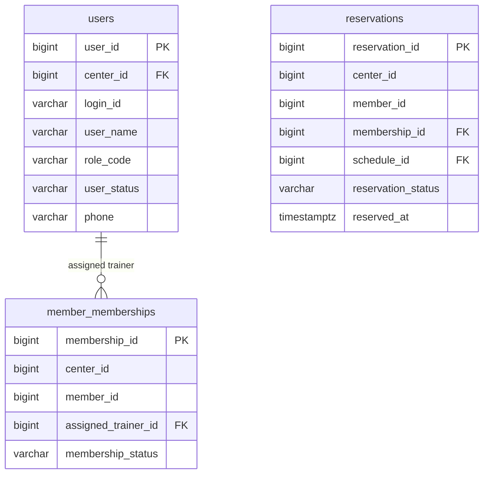

# feat: Trainer management and account operations

## Enhancement Summary

**Deepened on:** 2026-03-20  
**Sections enhanced:** 7  
**Research inputs used:** architecture review, security review, data-integrity review, frontend UX review, internal learnings, React Router docs, Spring Security docs

### Key Improvements
1. `auth`와 운영용 trainer admin 경계를 분리해, trainer CRUD를 전용 feature/service로 수렴하도록 명시했다.
2. `users.phone` 반영 방식, 집계 조인 키, business date source, deactivation semantics를 더 구체적으로 고정했다.
3. `shellRoutes` 권한 메타데이터, `trainers` query invalidation, desk-safe DTO tier를 추가해 프론트/보안 경계를 강화했다.

### New Considerations Discovered
- 현재 live security surface에는 `ROLE_SUPER_ADMIN`이 아직 실제 정책 상수로 정렬돼 있지 않아, 역할 체계 표준화가 trainer management의 선행 또는 동반 작업이 될 수 있다.
- 운영 집계는 “현재 배정 상태” 기준으로는 충분하지만, 미래의 이력성 리포팅은 예약 시점 trainer snapshot 또는 assignment history가 별도 필요할 수 있다.
- 데스크 조회 전용 UX는 disabled 버튼 나열보다 별도 read-only mode가 훨씬 안전하고 유지보수성이 높다.

## Overview

트레이너를 별도 독립 루트 엔티티로 도입하지 않고, 기존 `users + ROLE_TRAINER` 모델 위에서 트레이너 관리 기능을 추가한다. 운영 화면은 일반 사용자 관리와 분리된 `트레이너 관리` 메뉴로 제공하고, 목록/상세는 현장 운영 지표 중심으로 구성한다. 이번 변경은 계정 생성과 권한 제어, 집계 조회, 센터 범위 검증, 프론트 조회 전용 UX를 한 번에 정렬하는 작업이다.

이번 계획은 브레인스토밍에서 확정된 결정을 그대로 따른다. 핵심은 `assignedTrainerId` 축을 유지하고, `DESK`는 조회만 허용하며, `SUPER_ADMIN`과 `CENTER_ADMIN`만 트레이너 CRUD를 수행하게 만드는 것이다 (see brainstorm: docs/brainstorms/2026-03-20-trainer-management-and-scope-brainstorm.md).

## Problem Statement

현재 코드베이스는 트레이너를 일부 기능에서만 취급한다.

- 회원권은 `assignedTrainerId`로 트레이너를 연결할 수 있다.
- 예약/회원 조회는 `ROLE_TRAINER`일 때 일부 범위 제한이 이미 들어가 있다.
- `/api/v1/auth/trainers`는 활성 트레이너 목록을 돌려주지만, 응답은 단순 `loginId/userName` 수준이다.
- 트레이너 계정 생성 API와 트레이너 관리 전용 화면은 없다.
- `users.phone`은 설계 문서에 있으나 현재 엔티티/구현에는 반영되지 않았다.

이 상태로는 다음 요구를 충족할 수 없다.

- 센터 관리자가 트레이너 계정을 생성/수정/비활성화
- 슈퍼 관리자가 장애 복구 목적으로 모든 센터의 트레이너 계정을 관리
- 데스크가 트레이너 운영 현황을 조회 전용으로 확인
- 트레이너 관리 화면에서 이름, 상태, 연락처, 담당 회원 수, 오늘 예약 수를 안정적으로 제공
- 데스크 상세 조회에서는 로그인 ID 같은 계정성 정보는 숨김

## Proposed Solution

### Domain Model

- 트레이너는 별도 `Trainer` 엔티티를 만들지 않고 `users.role_code = ROLE_TRAINER` 사용자로 관리한다.
- 연락처는 별도 프로필 테이블이 아니라 `users.phone`에 저장한다.
- 담당 회원 연결은 계속 `member_memberships.assigned_trainer_id -> users.user_id`를 사용한다.
- 트레이너 관리 조회는 집계 전용 projection/API로 제공한다.

### Research Insights

**Best Practices:**
- 운영용 trainer management는 `auth`에 흡수하지 말고 별도 feature/service 경계로 두는 편이 login/token/me 계약 오염을 막는다.
- 연락처 같은 운영용 PII는 persistence에는 저장하되 login/refresh/me 응답에는 실어 나르지 않는 편이 안정적이다.

**Implementation Details:**
```text
trainer admin feature
  controller: read endpoints + command endpoints 분리
  service: create/update/status/detail/list의 단일 write/read orchestration
  repository/query: users + memberships + reservations projection 조합
```

**Edge Cases:**
- `users.phone`은 nullable로 도입하고 앱 레이어에서 normalize해야 한다.
- historical reservation attribution은 이번 범위에 포함하지 않는다. 이번 집계는 현재 운영 상태를 보는 current-state aggregate로 고정한다.

### Authorization Model

- `ROLE_SUPER_ADMIN`: 전체 센터 트레이너 CRUD
- `ROLE_CENTER_ADMIN`: 자기 센터 트레이너 CRUD
- `ROLE_DESK`: 자기 센터 트레이너 목록/상세 조회만 허용
- `ROLE_TRAINER`: 트레이너 관리 메뉴 접근 없음, 본인 담당 회원/예약 범위만 유지

### Research Insights

**Best Practices:**
- Spring Security의 `@PreAuthorize`는 역할 허용 여부를 닫는 데 쓰고, center/target scope는 서비스에서 별도 검증하는 이중 경계가 안전하다.
- 역할 체계는 소스 오브 트루스를 하나로 고정해야 한다. 현재 live surface에 `ROLE_SUPER_ADMIN`이 없으므로 이 역할을 실제 도입할지 먼저 정렬해야 한다.

**Implementation Details:**
```java
@PreAuthorize("hasAnyRole('SUPER_ADMIN','CENTER_ADMIN','MANAGER','DESK')")
// controller entry
// service then validates actorCenterId vs targetCenterId
```

**Edge Cases:**
- `CENTER_ADMIN` update 요청은 target `centerId`를 변경할 수 없어야 한다.
- `DESK`는 read DTO만 접근하고 command path로는 들어가지 못해야 한다.

### UI Model

- 사이드바와 대시보드에 `트레이너 관리` 메뉴를 추가한다.
- 메뉴는 `SUPER_ADMIN`, `CENTER_ADMIN`, `DESK`만 노출한다.
- 데스크는 같은 화면을 사용하되 편집 액션이 없다.
- 상세 화면은 운영 정보 중심으로 구성하고 `loginId`, 토큰/권한 조작, 역할 변경 UI는 숨긴다.

### Research Insights

**Best Practices:**
- sidebar, dashboard, direct route 접근은 같은 role metadata에서 파생되게 해야 메뉴/라우트 누수 위험이 줄어든다.
- 조회 전용 권한은 disabled 버튼보다 read-only mode가 더 명확하고 회귀에 강하다.

**Implementation Details:**
```ts
type ShellRoute = {
  key: NavSectionKey;
  path: string;
  label: string;
  description: string;
  protected: boolean;
  showInSidebar: boolean;
  showInDashboard: boolean;
  visibleRoles?: string[];
  allowedRoles?: string[];
};
```

**Edge Cases:**
- unknown path fallback, `/login`, dashboard 카드 노출이 모두 같은 권한 정책을 따라야 한다.
- `TRAINER`가 직접 URL 입력으로 접근할 때 page-level guard 전에 route-level에서 차단돼야 한다.

### Aggregation Rules

- `담당 회원 수`: `assigned_trainer_id = trainer.user_id` 인 활성/보류 상태 회원권을 가진 회원의 중복 제거 수
- `오늘 예약 수`: 위 회원 집합을 기준으로 오늘 날짜의 `CONFIRMED` 예약 건수
- 취소/완료/노쇼는 오늘 예약 수에서 제외

## Technical Approach

### Architecture

이번 작업은 `auth`, `membership`, `reservation`, `frontend shell` 네 축을 함께 건드린다.

1. `auth`
   - `users.phone` 반영
   - 트레이너 CRUD 및 목록/상세 DTO 추가
   - role + center scope 기반 권한 제어
2. `membership`
   - 기존 `assignedTrainerId`를 목록/상세 집계의 기준 축으로 재사용
3. `reservation`
   - 오늘 예약 수 집계를 `current_count = CONFIRMED 예약 수` 정책과 같은 상태 의미로 유지
4. `frontend`
   - 별도 트레이너 관리 페이지, 조회/편집 권한 분기, 데스크 상세 마스킹

### ERD



### Implementation Phases

#### Phase 1: Auth model and persistence foundation

- Add `phone` to the actual `users` schema if the live migration set still lacks it.
- Reflect `phone` in `AuthUserEntity`, `AuthUser`, and repository mapping only.
- Add repository methods for:
  - trainer list with role/status/center filters
  - trainer detail by `userId`
  - trainer insert
  - trainer update
  - trainer status toggle
- Preserve current role update/revoke flows and avoid introducing a second role storage path.
- Make the `users.phone` rollout staged:
  - add nullable column
  - normalize/trim/hyphen policy in app layer
  - backfill only if an authoritative source exists
  - defer stricter constraints until real data quality is known

Success criteria:
- `users.phone` is available end-to-end in domain/repository layers.
- Existing login/me flows are unaffected.
- Trainer records remain standard users with `ROLE_TRAINER`.
- `phone` is not added to token/login/me DTOs unless a separate requirement emerges.

#### Phase 2: Trainer management backend surface

- Introduce dedicated trainer management endpoints in a new `trainer` or `admin.trainer` feature package, not inside the existing `auth` login/token controller surface.
- Add endpoints for:
  - trainer list
  - trainer detail
  - trainer create
  - trainer update
  - trainer activate/deactivate
- Separate response DTOs by caller need:
  - management list/detail DTOs
  - lightweight trainer picker DTO for membership purchase remains available
- Split read and command surfaces explicitly:
  - query endpoints: list/detail
  - command endpoints: create/update/status
- Enforce actor scope:
  - `SUPER_ADMIN` can target any center
  - `CENTER_ADMIN` and `DESK` can only read their own center
  - `CENTER_ADMIN` can mutate only their own center
  - `DESK` mutations return `ACCESS_DENIED`
- Make `centerId` an explicit boundary:
  - create requires target center
  - detail/list resolve against explicit or actor-derived center
  - update/status cannot silently reassign center
- Normalize create/update rules:
  - unique `loginId`
  - role fixed to `ROLE_TRAINER`
  - no self-escalation to admin roles from trainer screen
  - status transitions limited to supported values
- Canonicalize the role matrix before implementation:
  - either add real `ROLE_SUPER_ADMIN` support to security policies, validation, and JWT claims
  - or explicitly defer super-admin behavior and keep this plan center-admin scoped until that role lands

Success criteria:
- CRUD surface exists without exposing generic user admin endpoints to desk.
- Desk can read but not mutate.
- Center boundary checks happen in service/repository paths, not only controller annotations.
- DTO tiers are explicit:
  - picker DTO may include `userId`, `userName`
  - admin DTO may include `loginId`
  - desk DTO must exclude `loginId`, `passwordHash`, `accessRevokedAfter`, `roleCode`, token/session fields

#### Phase 3: Trainer operational aggregations

- Add query projection for trainer management list:
  - `userId`
  - `userName`
  - `userStatus`
  - `phone`
  - `assignedMemberCount`
  - `todayConfirmedReservationCount`
- Build counts from `member_memberships` and `reservations` using explicit center scoping.
- Count distinct members, not memberships.
- Define visible membership statuses for assignment counts:
  - recommended baseline: `ACTIVE`, `HOLDING`
- Count today reservations only when:
  - reservation belongs to a membership assigned to that trainer
  - reservation center matches actor center
  - reservation date falls on business date
  - reservation status is `CONFIRMED`
- Add trainer detail projection for desk/admin screen:
  - same operational fields
  - optional lightweight assigned-member summary list
  - no `loginId` for desk-facing responses
- Fix the aggregate contract precisely:
  - `assignedMemberCount = COUNT(DISTINCT qualifying_membership.member_id)`
  - `todayConfirmedReservationCount` joins from `reservations.membership_id` to qualifying membership rows, not from the distinct member set
- Reuse one business-date source for query/test consistency:
  - recommended baseline: `Asia/Seoul` business date via shared clock or helper used elsewhere in reservation logic
- Freeze current-state semantics:
  - this screen reports current trainer assignment and current operational counts
  - historical trainer attribution for past reservations is out of scope for this plan

Success criteria:
- Aggregates align with the brainstorm semantics.
- Query stays center-scoped and role-scoped.
- List API remains performant for typical mid-sized gym datasets.
- Business date behavior is deterministic in tests and production.

#### Phase 4: Frontend trainer management UI

- Add a new route and sidebar item in the shell.
- Create a trainer management page that follows current page structure and styling conventions.
- Provide:
  - searchable trainer list
  - stat cards for access mode and result counts
  - list/table cards showing name, status, phone, assigned member count, today reservation count
  - detail panel or modal
- Permission UX:
  - `SUPER_ADMIN`/`CENTER_ADMIN`: full actions visible
  - `DESK`: same list/detail surface, no create/edit/status actions
  - `TRAINER`: menu hidden, direct route blocked or redirected
- Detail privacy:
  - desk sees operational data only
  - no `loginId`, no role editing controls, no token/session management controls
- Define a dedicated desk mode:
  - search/list/detail remain fully usable
  - mutation controls are hidden, not disabled
  - one clear read-only banner explains the mode
- Add a `trainers` query invalidation domain and connect it to:
  - trainer create/update/status
  - membership reassignment that changes `assignedMemberCount`
  - reservation create/cancel/complete/no-show paths that change today's confirmed count

Success criteria:
- The page matches existing admin UX patterns.
- Desk sees a clean read-only experience rather than disabled admin controls everywhere.
- Trainer users cannot access the page in live mode.
- Sidebar, dashboard, and direct-route visibility all derive from the same route metadata contract.

#### Phase 5: Validation and regression coverage

- Backend integration tests:
  - super admin cross-center CRUD
  - center admin own-center CRUD and cross-center denial
  - desk read-only access and mutation denial
  - trainer page API denial
  - aggregate correctness for assigned distinct members and today confirmed reservations
- Frontend tests:
  - menu visibility by role
  - read-only desk page
  - admin action visibility
  - trainer redirect/block
  - detail masking of `loginId`
- Add shell regression tests:
  - sidebar visibility by role
  - dashboard card visibility by role
  - unchanged `/login` behavior
  - unchanged unknown-path redirect/fallback behavior
- If mock mode is used for local UI support, extend mock data and API stubs with trainer management fixtures without weakening live auth checks.

Success criteria:
- New role boundaries are covered by tests.
- Existing auth, membership purchase, reservation scope, and product read-only patterns do not regress.
- Query invalidation coverage proves trainer counts refresh after upstream membership/reservation changes.

## Alternative Approaches Considered

### 1. Separate `Trainer` root entity

장점:
- 장기적으로 계약/정산/프로필 확장을 독립 수명주기로 다루기 쉽다.

기각 이유:
- 현재 `assignedTrainerId`와 `ROLE_TRAINER`가 이미 `userId` 축으로 설계돼 있다.
- 지금 도입하면 `userId`와 `trainerId` 이중 관리가 생긴다.
- 이번 요구 범위는 계정/권한/운영 조회 수준이라 과하다.

### 2. Generic user admin only

장점:
- 새 메뉴 없이 기존 auth 관리 기능만 확장하면 된다.

기각 이유:
- 운영자가 트레이너를 업무 단위로 보고 싶다는 요구와 맞지 않는다.
- 데스크 조회 전용 UX를 만들기 어렵다.
- 트레이너 운영 지표 집계가 generic user CRUD와 결이 다르다.

### 3. Frontend-only filtering for desk/trainer visibility

장점:
- 빠르게 화면을 만들 수 있다.

기각 이유:
- 기존 reservation learnings가 이미 보여주듯 RBAC만으로는 scope가 닫히지 않는다.
- 센터 경계, 역할 경계, 트레이너 배정 경계는 서버에서 강제해야 한다.

## System-Wide Impact

### Interaction Graph

- `트레이너 생성`
  - UI form submits create request
  - controller validates role access
  - service normalizes payload and center scope
  - repository inserts `users` row with `ROLE_TRAINER`
  - response projection returns operational-safe fields
- `트레이너 목록 조회`
  - page load triggers trainer list API
  - service resolves actor role and center
  - query aggregates assignments and reservations
  - UI renders read-only or mutable controls based on role
- `회원권 담당 트레이너 지정`
  - existing membership purchase/update flow keeps calling trainer picker
  - trainer management changes the set of valid trainer users
  - reservation/member scoped reads continue to rely on `assignedTrainerId`

### Error & Failure Propagation

- Duplicate `loginId` should surface as validation/conflict, not generic internal error.
- Cross-center mutation attempts must fail deterministically with access denied or not found according to existing policy.
- Missing trainer phone should not break list rendering; return `null` and render a fallback.
- If trainer is deactivated while assigned memberships remain, read paths must still behave predictably. Current recommendation: historical assignment remains readable; new assignment should exclude inactive trainers from picker.

### Research Insights

**Best Practices:**
- Spring Security docs support keeping `@PreAuthorize` on methods while delegating business-specific authorization checks to service-level logic.
- Sensitive-field response separation should be DTO-driven, not ad hoc JSON omission.

**Edge Cases:**
- If `ROLE_SUPER_ADMIN` is not yet live, wiring its policy halfway will create false confidence in tests and docs.
- Read endpoints should never share response types with mutation/admin-only surfaces when desk access is involved.

### State Lifecycle Risks

- Partial create risk: user row inserted but response shaping fails. Keep create flow transactional.
- Deactivation risk: inactive trainer still attached to memberships. This is acceptable if operational reads can still show the trainer, but picker/create flows must not offer inactive users.
- Reassignment risk: changing a trainer account status must not rewrite historical reservations or memberships implicitly.
- Cache risk: new trainer management queries require explicit invalidation after create/update/status changes.
- Current plan choice: deactivation is status-only and non-cascading.
- Current plan choice: deactivation does not null existing assignments or cancel future reservations automatically; instead, it warns operators and excludes the trainer from future picker choices.

### API Surface Parity

- Existing `/api/v1/auth/trainers` lightweight list likely remains for trainer pickers.
- New trainer management endpoints must not silently replace auth/me/login semantics.
- Membership purchase/update must continue validating assigned trainer via active `ROLE_TRAINER` users.
- Frontend role-based menu logic must stay consistent with existing products/lockers read-only patterns.

### Integration Test Scenarios

- `CENTER_ADMIN` creates a trainer in own center, then purchases a membership assigned to that trainer, and trainer-scoped reservation targets include the member.
- `DESK` loads trainer management list/detail successfully but create/update/status APIs are denied.
- `SUPER_ADMIN` deactivates a trainer in another center and that trainer disappears from trainer picker while historical memberships still resolve.
- A trainer user attempts direct navigation to trainer management route and receives the same denial/redirect outcome as unsupported pages.
- Today reservation count excludes `CANCELLED`, `COMPLETED`, and `NO_SHOW` while still counting multiple confirmed reservations across distinct assigned memberships.

## Acceptance Criteria

### Functional Requirements

- [x] A dedicated trainer management menu exists for `SUPER_ADMIN`, `CENTER_ADMIN`, and `DESK`.
- [x] Trainer records are stored in `users` with `ROLE_TRAINER`; no separate trainer root table is introduced.
- [x] `SUPER_ADMIN` can list, create, edit, activate, and deactivate trainers across centers.
- [x] `CENTER_ADMIN` can list, create, edit, activate, and deactivate trainers only in their own center.
- [x] `DESK` can list and view trainer details only in their own center and cannot mutate trainer data.
- [x] `TRAINER` cannot access trainer management UI or mutation APIs.
- [x] Trainer management list shows name, status, phone, assigned distinct member count, and today confirmed reservation count.
- [x] Trainer detail shown to desk omits `loginId` and other account-management-only fields.
- [x] Membership trainer assignment flows continue using active `ROLE_TRAINER` users from the same center.
- [x] Inactive trainers are excluded from new assignment pickers but historical linked data remains readable.

### Non-Functional Requirements

- [x] All list/detail/mutation paths enforce center scope on the server.
- [x] Aggregation queries stay aligned with reservation state semantics documented in prior reservation learnings.
- [x] UI follows existing styling and read-only patterns rather than introducing a new design system.
- [x] Sensitive account identifiers are not leaked into desk-facing detail responses.

### Quality Gates

- [x] Backend service/repository tests cover role and center scope boundaries.
- [x] Frontend tests cover menu visibility, read-only behavior, and route blocking.
- [x] Mock mode fixtures, if extended, preserve parity with live permission behavior.
- [x] API and DTO changes are documented in plan-linked notes or OpenAPI output as part of implementation review.

## Success Metrics

- Center admins can create and manage trainers without using generic user-role mutation endpoints.
- Desk can answer “who is active and how busy are they today?” from a single read-only screen.
- Trainer assignment and trainer-scoped reservation flows continue to work without introducing a second identity model.
- No permission regressions appear in existing trainer/member/reservation tests.

## Dependencies & Prerequisites

- Existing auth stack with JWT and `CurrentUserProvider`
- Existing membership assignment field `assignedTrainerId`
- Existing reservation status semantics where `CONFIRMED` is the active reservation state
- A migration path for `users.phone` if production schema lacks it
- Route/sidebar shell support in the frontend

## Risk Analysis & Mitigation

- Risk: role naming mismatch between brainstorm (`SUPER_ADMIN`) and current backend allowed role constants.
  - Mitigation: confirm whether `ROLE_SUPER_ADMIN` already exists in auth/security code; if not, plan the role surface explicitly instead of overloading `ROLE_CENTER_ADMIN`.
- Risk: aggregate query overcounts members because one member can have multiple memberships.
  - Mitigation: use `COUNT(DISTINCT member_id)` semantics for assigned member count.
- Risk: today reservation count drifts from schedule semantics.
  - Mitigation: anchor it to the same `CONFIRMED` policy documented in reservation learnings.
- Risk: desk sees hidden admin data through reused DTOs.
  - Mitigation: define separate desk-safe response shapes or field filtering in service/controller.
- Risk: inactive trainers break existing membership editing screens.
  - Mitigation: keep historical display resolution separate from active picker queries.

## Resource Requirements

- Backend work across `auth`, `membership`, and query repositories
- Frontend work for route, page, data hooks, and permission guards
- Test updates in both backend integration tests and frontend role-based component tests

## Future Considerations

- `trainer_schedules` should eventually move from `trainerName` string storage to `trainerUserId` reference.
- If payroll, certifications, or richer profile data become requirements, add `trainer_profiles` keyed by `user_id` rather than replacing the identity model.
- If super-admin tooling expands, generic user admin and trainer admin can share lower-level services while keeping separate UI surfaces.

## Documentation Plan

- Keep this plan as the implementation source of truth for trainer management introduction.
- Update any architecture/security docs if role matrices or auth surfaces change.
- Add validation notes if migrations or permission behavior reveal environment-specific differences.

## Sources & References

### Origin

- **Brainstorm document:** [docs/brainstorms/2026-03-20-trainer-management-and-scope-brainstorm.md](/Users/abc/projects/GymCRM_V2/docs/brainstorms/2026-03-20-trainer-management-and-scope-brainstorm.md)  
  Key decisions carried forward: `users + ROLE_TRAINER`, dedicated trainer management menu, desk read-only access, `users.phone`, distinct assigned member count, today `CONFIRMED` reservation count.

### Internal References

- [backend/src/main/java/com/gymcrm/auth/AuthController.java](/Users/abc/projects/GymCRM_V2/backend/src/main/java/com/gymcrm/auth/AuthController.java)
- [backend/src/main/java/com/gymcrm/auth/AuthService.java](/Users/abc/projects/GymCRM_V2/backend/src/main/java/com/gymcrm/auth/AuthService.java)
- [backend/src/main/java/com/gymcrm/auth/AuthUser.java](/Users/abc/projects/GymCRM_V2/backend/src/main/java/com/gymcrm/auth/AuthUser.java)
- [backend/src/main/java/com/gymcrm/auth/AuthUserEntity.java](/Users/abc/projects/GymCRM_V2/backend/src/main/java/com/gymcrm/auth/AuthUserEntity.java)
- [backend/src/main/java/com/gymcrm/auth/AuthUserRepository.java](/Users/abc/projects/GymCRM_V2/backend/src/main/java/com/gymcrm/auth/AuthUserRepository.java)
- [backend/src/main/java/com/gymcrm/membership/MembershipPurchaseService.java](/Users/abc/projects/GymCRM_V2/backend/src/main/java/com/gymcrm/membership/MembershipPurchaseService.java)
- [backend/src/main/java/com/gymcrm/member/MemberQueryRepository.java](/Users/abc/projects/GymCRM_V2/backend/src/main/java/com/gymcrm/member/MemberQueryRepository.java)
- [backend/src/main/java/com/gymcrm/reservation/ReservationQueryRepository.java](/Users/abc/projects/GymCRM_V2/backend/src/main/java/com/gymcrm/reservation/ReservationQueryRepository.java)
- [backend/src/main/resources/db/migration/V1__init_core_tables.sql](/Users/abc/projects/GymCRM_V2/backend/src/main/resources/db/migration/V1__init_core_tables.sql)
- [frontend/src/app/routes.ts](/Users/abc/projects/GymCRM_V2/frontend/src/app/routes.ts)
- [frontend/src/app/auth.tsx](/Users/abc/projects/GymCRM_V2/frontend/src/app/auth.tsx)
- [frontend/src/pages/products/ProductsPage.tsx](/Users/abc/projects/GymCRM_V2/frontend/src/pages/products/ProductsPage.tsx)
- [docs/01_요구사항_분석서.md](/Users/abc/projects/GymCRM_V2/docs/01_요구사항_분석서.md)
- [docs/03_데이터베이스_설계서.md](/Users/abc/projects/GymCRM_V2/docs/03_데이터베이스_설계서.md)
- [docs/plans/2026-03-10-feat-trainer-scoped-reservation-management-plan.md](/Users/abc/projects/GymCRM_V2/docs/plans/2026-03-10-feat-trainer-scoped-reservation-management-plan.md)

### Institutional Learnings

- [docs/solutions/database-issues/reservation-capacity-and-usage-deduction-integrity-gymcrm-20260225.md](/Users/abc/projects/GymCRM_V2/docs/solutions/database-issues/reservation-capacity-and-usage-deduction-integrity-gymcrm-20260225.md)
  - `CONFIRMED` 상태 의미와 center scope 강제는 이번 집계/권한 설계에서도 그대로 따라야 한다.
- [docs/solutions/database-issues/reservation-checkin-noshow-usage-event-integrity-gymcrm-20260225.md](/Users/abc/projects/GymCRM_V2/docs/solutions/database-issues/reservation-checkin-noshow-usage-event-integrity-gymcrm-20260225.md)
  - today reservation count는 운영 메타데이터와 완료/노쇼 종료 상태를 섞지 말고 명시 정책으로 고정해야 한다.

### External References

- [React Router docs](https://reactrouter.com/start/data/routing)
  - Nested routes/layout routes support using one route definition as the source of truth for shared layout and child route rendering.
- [Spring Security 6.5 method security docs](https://docs.spring.io/spring-security/reference/6.5/servlet/authorization/method-security.html)
  - `@PreAuthorize` is appropriate for role checks, but custom/domain authorization remains a service concern.
