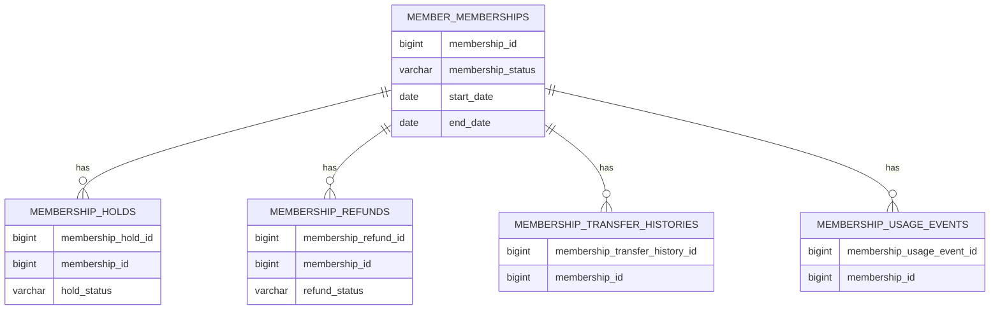

# refactor: Realign membership module structure and enum boundaries

## Overview
`membership` 백엔드 모듈을 독립 도메인으로 유지하면서 내부 구조를 `controller / dto / service / repository / entity / enums` 기준으로 다시 정렬한다. 이번 작업은 `member` 리팩터링에서 검증한 패턴을 `membership`에 적용하는 2번째 시범 정렬이다 `(see brainstorm: docs/brainstorms/2026-03-23-membership-module-structure-realignment-brainstorm.md)`.

이번 1차 범위는 구매/목록/홀드/환불 전체 흐름을 포함한다. 다만 `Payment`는 이번 범위에서 제외하고, `MembershipHold`, `MembershipRefund`, `MembershipTransferHistory`는 `membership` 내부 서브도메인으로 유지한다 `(see brainstorm: docs/brainstorms/2026-03-23-membership-module-structure-realignment-brainstorm.md)`.

## Problem Statement
현재 `membership` 모듈은 이미 일부 타입이 `entity/`, `repository/`, `enums/`로 이동해 있지만, 구매/홀드/환불 관련 controller, service, entity, repository, DTO가 여전히 루트 패키지에 평평하게 섞여 있다. 예를 들어 [MembershipPurchaseController.java](/Users/abc/projects/GymCRM_V2/backend/src/main/java/com/gymcrm/membership/MembershipPurchaseController.java), [MembershipHoldService.java](/Users/abc/projects/GymCRM_V2/backend/src/main/java/com/gymcrm/membership/MembershipHoldService.java), [MembershipRefund.java](/Users/abc/projects/GymCRM_V2/backend/src/main/java/com/gymcrm/membership/MembershipRefund.java), [MembershipRefundRepository.java](/Users/abc/projects/GymCRM_V2/backend/src/main/java/com/gymcrm/membership/MembershipRefundRepository.java)가 같은 레벨에 놓여 있다.

이 상태의 문제는 다음과 같다.
- 패키지 위치만으로 계층 책임을 추론하기 어렵다.
- 구매/홀드/환불 controller 내부에 request/response record가 같이 들어 있어 DTO 경계가 약하다.
- `membershipStatus`, `holdStatus`, `refundStatus`는 문자열 상수 비교가 많아 타입 경계가 흐린다.
- 홀드/환불은 이미 정합성 이슈와 상태 전이 제약이 존재해, 구조 리팩터링 시 시스템 영향 분석이 필요하다.
- `Payment`가 현재 `membership` 모듈에 있지만 도메인 책임은 `settlement`와도 맞닿아 있어 1차 범위에서 경계를 명시적으로 제외해야 한다.

## Proposed Solution
브레인스토밍에서 결정한 대로 `membership`은 독립 모듈로 유지하되, 내부 구조를 계층별 패키지로 정렬한다 `(see brainstorm: docs/brainstorms/2026-03-23-membership-module-structure-realignment-brainstorm.md)`.

핵심 원칙:
- `membership`은 `member` 하위로 흡수하지 않는다 `(see brainstorm: docs/brainstorms/2026-03-23-membership-module-structure-realignment-brainstorm.md)`.
- request/response DTO는 별도 파일로 분리한다.
- `MembershipHold`, `MembershipRefund`, `MembershipTransferHistory`는 `membership/entity` 내부 서브도메인으로 유지한다.
- `Payment`는 이번 리팩터링 범위에서 제외하고, 현재 위치를 유지하거나 후속 작업에서 `settlement` 이동을 별도로 검토한다 `(see brainstorm: docs/brainstorms/2026-03-23-membership-module-structure-realignment-brainstorm.md)`.
- enum 1차 대상은 `membershipStatus`, `holdStatus`, `refundStatus`다 `(see brainstorm: docs/brainstorms/2026-03-23-membership-module-structure-realignment-brainstorm.md)`.
- DB 컬럼은 문자열 유지 전략을 우선 사용하고, Java 경계에서만 enum을 도입한다.

## Technical Approach

### Research Summary
- 관련 브레인스토밍: [2026-03-23-membership-module-structure-realignment-brainstorm.md](/Users/abc/projects/GymCRM_V2/docs/brainstorms/2026-03-23-membership-module-structure-realignment-brainstorm.md)
- 재사용 패턴: [2026-03-23-member-module-package-patterns.md](/Users/abc/projects/GymCRM_V2/docs/notes/2026-03-23-member-module-package-patterns.md)
- 정합성 교훈: [membership-hold-refund-state-integrity-gymcrm-20260224.md](/Users/abc/projects/GymCRM_V2/docs/solutions/database-issues/membership-hold-refund-state-integrity-gymcrm-20260224.md)
- 검증 로그:
  - [phase3-hold-resume-api-ui-validation-log.md](/Users/abc/projects/GymCRM_V2/docs/notes/phase3-hold-resume-api-ui-validation-log.md)
  - [phase3-refund-api-ui-validation-log.md](/Users/abc/projects/GymCRM_V2/docs/notes/phase3-refund-api-ui-validation-log.md)
  - [phase3-membership-status-transition-rules.md](/Users/abc/projects/GymCRM_V2/docs/notes/phase3-membership-status-transition-rules.md)

외부 조사 판단:
- 현재 코드, 기존 `member` 패턴, 그리고 `membership` 관련 정합성/검증 문서가 충분하다.
- 이번 작업은 새 기술 도입이 아니라 저장소 내부 구조 정렬이므로 외부 조사 없이 진행한다.

현재 코드 인벤토리:
- controller 후보:
  - [MembershipPurchaseController.java](/Users/abc/projects/GymCRM_V2/backend/src/main/java/com/gymcrm/membership/MembershipPurchaseController.java)
  - [MembershipHoldController.java](/Users/abc/projects/GymCRM_V2/backend/src/main/java/com/gymcrm/membership/MembershipHoldController.java)
  - [MembershipRefundController.java](/Users/abc/projects/GymCRM_V2/backend/src/main/java/com/gymcrm/membership/MembershipRefundController.java)
- service 후보:
  - [MembershipPurchaseService.java](/Users/abc/projects/GymCRM_V2/backend/src/main/java/com/gymcrm/membership/MembershipPurchaseService.java)
  - [MembershipHoldService.java](/Users/abc/projects/GymCRM_V2/backend/src/main/java/com/gymcrm/membership/MembershipHoldService.java)
  - [MembershipRefundService.java](/Users/abc/projects/GymCRM_V2/backend/src/main/java/com/gymcrm/membership/MembershipRefundService.java)
  - [MembershipStatusTransitionService.java](/Users/abc/projects/GymCRM_V2/backend/src/main/java/com/gymcrm/membership/MembershipStatusTransitionService.java)
- entity 후보:
  - [MembershipHold.java](/Users/abc/projects/GymCRM_V2/backend/src/main/java/com/gymcrm/membership/MembershipHold.java)
  - [MembershipRefund.java](/Users/abc/projects/GymCRM_V2/backend/src/main/java/com/gymcrm/membership/MembershipRefund.java)
  - [MembershipUsageEvent.java](/Users/abc/projects/GymCRM_V2/backend/src/main/java/com/gymcrm/membership/MembershipUsageEvent.java)
  - [MemberMembership.java](/Users/abc/projects/GymCRM_V2/backend/src/main/java/com/gymcrm/membership/entity/MemberMembership.java)
  - [MemberMembershipEntity.java](/Users/abc/projects/GymCRM_V2/backend/src/main/java/com/gymcrm/membership/entity/MemberMembershipEntity.java)
- repository 후보:
  - [MembershipHoldRepository.java](/Users/abc/projects/GymCRM_V2/backend/src/main/java/com/gymcrm/membership/MembershipHoldRepository.java)
  - [MembershipRefundRepository.java](/Users/abc/projects/GymCRM_V2/backend/src/main/java/com/gymcrm/membership/MembershipRefundRepository.java)
  - [MembershipUsageEventRepository.java](/Users/abc/projects/GymCRM_V2/backend/src/main/java/com/gymcrm/membership/MembershipUsageEventRepository.java)
  - [MemberMembershipRepository.java](/Users/abc/projects/GymCRM_V2/backend/src/main/java/com/gymcrm/membership/repository/MemberMembershipRepository.java)
  - [MemberMembershipJpaRepository.java](/Users/abc/projects/GymCRM_V2/backend/src/main/java/com/gymcrm/membership/repository/MemberMembershipJpaRepository.java)
- out of scope:
  - [Payment.java](/Users/abc/projects/GymCRM_V2/backend/src/main/java/com/gymcrm/membership/Payment.java)
  - [PaymentEntity.java](/Users/abc/projects/GymCRM_V2/backend/src/main/java/com/gymcrm/membership/PaymentEntity.java)
  - [PaymentRepository.java](/Users/abc/projects/GymCRM_V2/backend/src/main/java/com/gymcrm/membership/PaymentRepository.java)
  - [PaymentJpaRepository.java](/Users/abc/projects/GymCRM_V2/backend/src/main/java/com/gymcrm/membership/PaymentJpaRepository.java)

### Target Package Layout
```text
backend/src/main/java/com/gymcrm/membership/
├── controller/
│   ├── MembershipPurchaseController.java
│   ├── MembershipHoldController.java
│   └── MembershipRefundController.java
├── dto/
│   ├── request/
│   │   ├── MembershipPurchaseRequest.java
│   │   ├── MembershipHoldRequest.java
│   │   ├── MembershipResumeRequest.java
│   │   ├── MembershipRefundPreviewRequest.java
│   │   └── MembershipRefundConfirmRequest.java
│   └── response/
│       ├── MembershipPurchaseResponse.java
│       ├── MembershipDetailResponse.java
│       ├── MembershipPaymentResponse.java
│       ├── MembershipHoldResponse.java
│       ├── MembershipRefundResponse.java
│       └── MembershipRefundPreviewResponse.java
├── entity/
│   ├── MemberMembership.java
│   ├── MemberMembershipEntity.java
│   ├── MembershipHold.java
│   ├── MembershipRefund.java
│   ├── MembershipTransferHistory.java
│   └── MembershipUsageEvent.java
├── enums/
│   ├── MembershipStatus.java
│   ├── HoldStatus.java
│   └── RefundStatus.java
├── repository/
│   ├── MemberMembershipRepository.java
│   ├── MemberMembershipJpaRepository.java
│   ├── MembershipHoldRepository.java
│   ├── MembershipRefundRepository.java
│   └── MembershipUsageEventRepository.java
└── service/
    ├── MembershipPurchaseService.java
    ├── MembershipHoldService.java
    ├── MembershipRefundService.java
    └── MembershipStatusTransitionService.java
```

### Architecture
- `controller`: HTTP 경계와 DTO mapping만 담당한다.
- `dto/request`, `dto/response`: 구매/홀드/환불의 wire contract를 분리한다.
- `service`: 구매/홀드/환불 흐름과 정책/상태 전이 진입점을 유지한다.
- `entity`: membership core, hold, refund, transfer, usage event 도메인 타입을 둔다.
- `repository`: facade 및 JPA 저장소를 둔다. `Payment*` 저장소는 이번 범위에서 제외한다.
- `enums`: `MembershipStatus`, `HoldStatus`, `RefundStatus`를 두고 Java 내부 타입 경계를 강화한다.

구현 경계 메모:
- 외부 API 진입점은 `MembershipPurchaseController`, `MembershipHoldController`, `MembershipRefundController` 3개를 유지한다.
- 홀드/환불 controller의 `memberId` ownership guard는 구조 정렬 후에도 유지한다.
- 구매 응답은 `membership + payment + calculation`, 홀드 응답은 `membership + hold + preview`, 환불 응답은 `membership + payment + refund + calculation` 조합을 유지한다.
- `Payment`는 패키지 이동 대상이 아니지만 구매/환불 service에서 계속 의존하므로 import 수정 시 영향도를 별도로 확인한다.

### Hard Invariants to Preserve
- `ACTIVE -> HOLDING`, `ACTIVE -> REFUNDED`, `ACTIVE -> EXPIRED`, `HOLDING -> ACTIVE`, `HOLDING -> EXPIRED` 전이 규칙은 유지한다.
- 현재 구현/검증 기준으로 환불 가능 상태는 `ACTIVE`만 허용한다. `HOLDING` 환불은 계속 차단한다.
- `membership_holds`에는 같은 `membership_id`에 대해 `hold_status='ACTIVE'` row가 1건만 존재해야 한다.
- 홀드 생성 실패 시 membership 상태는 `ACTIVE`로 롤백되어야 한다.
- 환불 history insert 실패 시 refund payment row와 membership status 변경은 함께 롤백되어야 한다.
- response body의 상태 문자열은 기존과 동일하게 uppercase contract를 유지한다.

### ERD Snapshot


## Implementation Phases

### Phase 1: Inventory and Naming Freeze
목표: 현재 `membership` 구조와 이동 대상을 고정한다.

작업:
- [x] 현재 루트 패키지의 controller/service/entity/repository 파일 inventory 작성
- [x] `Payment*` 계열은 이번 범위에서 제외한다고 명시
- [x] DTO 파일명과 역할을 `Membership*Request/Response` 규칙으로 확정
- [x] `MembershipHold`, `MembershipRefund`, `MembershipTransferHistory`의 보존 위치를 `entity`로 확정
- [x] 빠른 검증과 느린 검증 체크포인트를 분리

구체 파일 메모:
- 유지 파일:
  - [MemberMembership.java](/Users/abc/projects/GymCRM_V2/backend/src/main/java/com/gymcrm/membership/entity/MemberMembership.java)
  - [MemberMembershipEntity.java](/Users/abc/projects/GymCRM_V2/backend/src/main/java/com/gymcrm/membership/entity/MemberMembershipEntity.java)
  - [MembershipStatus.java](/Users/abc/projects/GymCRM_V2/backend/src/main/java/com/gymcrm/membership/enums/MembershipStatus.java)
- 이동 파일:
  - `com.gymcrm.membership.MembershipPurchaseController` -> `com.gymcrm.membership.controller`
  - `com.gymcrm.membership.MembershipHoldController` -> `com.gymcrm.membership.controller`
  - `com.gymcrm.membership.MembershipRefundController` -> `com.gymcrm.membership.controller`
  - `com.gymcrm.membership.MembershipPurchaseService` -> `com.gymcrm.membership.service`
  - `com.gymcrm.membership.MembershipHoldService` -> `com.gymcrm.membership.service`
  - `com.gymcrm.membership.MembershipRefundService` -> `com.gymcrm.membership.service`
  - `com.gymcrm.membership.MembershipStatusTransitionService` -> `com.gymcrm.membership.service`
  - `com.gymcrm.membership.MembershipHold` -> `com.gymcrm.membership.entity`
  - `com.gymcrm.membership.MembershipRefund` -> `com.gymcrm.membership.entity`
  - `com.gymcrm.membership.MembershipUsageEvent` -> `com.gymcrm.membership.entity`
  - `com.gymcrm.membership.MembershipHoldRepository` -> `com.gymcrm.membership.repository`
  - `com.gymcrm.membership.MembershipRefundRepository` -> `com.gymcrm.membership.repository`
  - `com.gymcrm.membership.MembershipUsageEventRepository` -> `com.gymcrm.membership.repository`

성공 기준:
- 이동 대상과 제외 대상이 명확하다.
- naming 충돌 없이 DTO 분리 규칙이 고정된다.

### Phase 2: Controller DTO Extraction
목표: controller 내부 record를 외부 DTO 파일로 분리한다.

작업:
- [x] [MembershipPurchaseController.java](/Users/abc/projects/GymCRM_V2/backend/src/main/java/com/gymcrm/membership/MembershipPurchaseController.java)의 request/response record를 `dto/request`, `dto/response`로 분리
- [x] [MembershipHoldController.java](/Users/abc/projects/GymCRM_V2/backend/src/main/java/com/gymcrm/membership/MembershipHoldController.java)의 request/response record 분리
- [x] [MembershipRefundController.java](/Users/abc/projects/GymCRM_V2/backend/src/main/java/com/gymcrm/membership/MembershipRefundController.java)의 request/response record 분리
- [x] controller는 DTO mapping과 service 호출만 남기도록 정리

권장 DTO 세트:
- request:
  - `MembershipPurchaseRequest`
  - `MembershipHoldRequest`
  - `MembershipResumeRequest`
  - `MembershipRefundPreviewRequest`
  - `MembershipRefundConfirmRequest`
- response:
  - `MembershipSummaryResponse`
  - `MembershipPaymentResponse`
  - `MembershipPurchaseResponse`
  - `MembershipHoldSummaryResponse`
  - `MembershipHoldResponse`
  - `MembershipResumeResponse`
  - `MembershipRefundSummaryResponse`
  - `MembershipRefundPreviewResponse`
  - `MembershipRefundResponse`

주의:
- `MembershipPurchaseController.MembershipResponse` 같은 controller nested type은 다른 controller가 재사용하고 있으므로 DTO 분리는 purchase -> hold -> refund 순서로 진행하는 것이 안전하다.
- DTO 이름은 `PurchaseMembershipRequest`처럼 동사-앞 형식을 새로 만들지 않는다.

성공 기준:
- controller 내부 nested record가 제거된다.
- request/response wire contract는 기존 필드명과 메시지를 유지한다.

### Phase 3: Package Relocation
목표: 평평한 타입들을 계층별 패키지로 이동한다.

작업:
- [x] purchase/hold/refund controller를 `membership/controller`로 이동
- [x] root 패키지의 hold/refund entity를 `membership/entity`로 이동
- [x] hold/refund repository를 `membership/repository`로 이동
- [x] purchase/hold/refund/status transition service를 `membership/service`로 이동
- [x] import 경로를 전체 정리하고 `compileJava`로 빠르게 확인

권장 순서:
1. controller DTO 추출
2. response 타입 재참조 제거
3. service 이동
4. entity 이동
5. repository 이동
6. controller package 이동

이 순서를 권장하는 이유:
- controller nested record가 먼저 외부 파일이 되어야 package move 때 import churn이 줄어든다.
- service를 먼저 이동하면 downstream compile 오류를 빨리 드러낼 수 있다.
- repository 이동은 연쇄 영향이 커서 마지막에 두는 편이 복구가 쉽다.

성공 기준:
- `membership` 루트 패키지의 계층 혼합 파일이 최소화된다.
- 패키지 위치만으로 역할을 추론할 수 있다.

### Phase 4: Enum Boundary Realignment
목표: `membershipStatus`, `holdStatus`, `refundStatus`의 Java enum 경계를 정리한다.

작업:
- [x] 현행 [MembershipStatus.java](/Users/abc/projects/GymCRM_V2/backend/src/main/java/com/gymcrm/membership/enums/MembershipStatus.java)의 위치/사용처를 새 구조 기준으로 정렬
- [x] `HoldStatus`, `RefundStatus` enum 추가
- [x] service 내부 문자열 비교를 enum 기반으로 치환
- [x] repository/entity 경계에서 DB string <-> enum 변환을 한 곳으로 모음
- [x] response는 기존 uppercase 문자열 계약을 유지
- [x] request DTO는 기존 문자열 필드를 유지하고 service에서 enum factory를 호출

구체 규칙:
- `MemberMembership.membershipStatus()`는 Java enum을 반환하되 repository가 DB 문자열을 매핑한다.
- `MembershipHold.holdStatus()`와 `MembershipRefund.refundStatus()`도 같은 방식으로 정렬한다.
- JSON request는 기존처럼 문자열을 받되, enum parse는 controller validation 또는 service factory 중 한 곳으로만 모은다.
- invalid status는 `VALIDATION_ERROR`, 허용되지 않은 상태 전이는 `BUSINESS_RULE`, active hold unique index 위반은 `CONFLICT`로 유지한다.

성공 기준:
- 코드 내부에서 상태 문자열 상수 비교가 줄어든다.
- 잘못된 상태값은 일관된 validation/business error로 처리된다.
- DB 스키마 변경 없이 동작한다.

### Phase 5: State Integrity Preservation
목표: 구조 정렬이 홀드/환불 정합성을 깨지 않도록 보호한다.

작업:
- [x] [membership-hold-refund-state-integrity-gymcrm-20260224.md](/Users/abc/projects/GymCRM_V2/docs/solutions/database-issues/membership-hold-refund-state-integrity-gymcrm-20260224.md)의 invariant를 계획에 반영
- [x] active hold uniqueness, `HOLDING -> REFUNDED` 금지, 상태 조건부 update가 유지되는지 확인
- [x] `MembershipStatusTransitionService`가 새 패키지 구조에서도 단일 정책 진입점인지 검증
- [x] hold/refund preview/confirm flow에서 오류 매핑이 깨지지 않는지 확인
- [x] hold/refund controller의 `memberId` ownership guard 유지 확인
- [x] 프론트 validation 로그와 맞물리는 UI contract 문구가 바뀌지 않는지 확인

성공 기준:
- 레이스/정합성 관련 기존 정책이 구조 변경 후에도 보존된다.
- 상태 전이 정책이 한 곳에 남는다.

### Phase 6: Regression Hardening
목표: 구매/목록/홀드/환불 전체 흐름 회귀를 검증한다.

작업:
- [x] 빠른 검증: `./gradlew clean compileJava`
- [x] membership 단위/통합 테스트 실행
- [x] hold/refund 검증 로그 기준 테스트 시나리오 재확인
- [x] `Payment`가 이번 범위 밖임을 확인하는 smoke check 수행
- [x] controller import 변경으로 인해 `member`, `reservation`, `access`, `settlement` 연계 경로가 깨지지 않는지 확인

현재 검증 메모:
- `./gradlew clean compileJava` 통과
- `./gradlew compileTestJava` 통과
- membership 핵심 테스트 통과:
  - `./gradlew test --tests com.gymcrm.membership.service.MembershipPurchaseServiceTest`
  - `./gradlew test --tests com.gymcrm.membership.service.MembershipHoldServiceTest`
  - `./gradlew test --tests com.gymcrm.membership.service.MembershipRefundServiceTest`
  - `./gradlew test --tests com.gymcrm.membership.service.MembershipStatusTransitionServiceTest`
  - `./gradlew test --tests com.gymcrm.membership.MembershipPurchaseServiceIntegrationTest`
  - `./gradlew test --tests com.gymcrm.membership.MembershipHoldServiceIntegrationTest`
  - `./gradlew test --tests com.gymcrm.membership.MembershipRefundServiceIntegrationTest`
- 연계 경로 대표 테스트 통과:
  - `./gradlew test --tests com.gymcrm.access.AccessServiceIntegrationTest`
  - `./gradlew test --tests com.gymcrm.crm.CrmMessageServiceIntegrationTest`
  - `./gradlew test --tests com.gymcrm.reservation.ReservationServiceIntegrationTest`
  - `./gradlew test --tests com.gymcrm.settlement.SalesSettlementReportServiceIntegrationTest`
  - `./gradlew test --tests com.gymcrm.settlement.TrainerPayrollSettlementServiceIntegrationTest`
- `Payment.java`, `PaymentEntity.java`, `PaymentJpaRepository.java`, `PaymentRepository.java`는 `com.gymcrm.membership` 루트에 유지됨을 확인

권장 검증 순서:
1. `cd backend && ./gradlew clean compileJava`
2. `cd backend && ./gradlew test --tests com.gymcrm.membership.service.MembershipStatusTransitionServiceTest`
3. `cd backend && ./gradlew test --tests com.gymcrm.membership.service.MembershipHoldServiceTest`
4. `cd backend && ./gradlew test --tests com.gymcrm.membership.service.MembershipRefundServiceTest`
5. `cd backend && ./gradlew test --tests com.gymcrm.membership.MembershipPurchaseServiceIntegrationTest`
6. `cd backend && ./gradlew test --tests com.gymcrm.membership.MembershipHoldServiceIntegrationTest`
7. `cd backend && ./gradlew test --tests com.gymcrm.membership.MembershipRefundServiceIntegrationTest`

필수 회귀 포인트:
- 구매 성공 시 membership row + purchase payment row 동시 생성
- payment insert 실패 시 membership insert 롤백
- 홀드 성공 후 `membershipStatus=HOLDING`, `holdStatus=ACTIVE`
- 홀드 insert 실패 시 membership 상태 롤백
- 활성 홀드 unique index 위반 시 duplicate active hold 차단
- 해제 성공 후 `membershipStatus=ACTIVE`, `holdStatus=RESUMED`, 만료일/holdDaysUsed 갱신
- 환불 preview/confirm 계산 일치
- 환불 history insert 실패 시 payment row + membership status 롤백
- `HOLDING` membership 환불 차단 및 안내 메시지 유지

성공 기준:
- membership 관련 테스트가 통과한다.
- 구매/목록/홀드/환불 API 계약이 유지된다.
- QueryDSL/JPA 기반 저장소가 정상 컴파일된다.

### Phase 7: Reusable Documentation
목표: 후속 모듈에도 적용 가능한 membership 정렬 규칙을 남긴다.

작업:
- [x] `member` 패턴 문서와 대칭되는 `membership` 패턴 문서 작성
- [x] `Payment`가 범위 제외였다는 점과 후속 이동 후보라는 점을 명시
- [x] 이 구조가 pilot convention인지, backend standard 승격 조건이 무엇인지 기록

성공 기준:
- 다음 구조 정렬 때 다시 같은 결정을 반복하지 않아도 된다.
- `Payment` 후속 작업이 별도 트랙임이 분명하다.

## Alternative Approaches Considered

### 1. 설계서처럼 `membership`을 `member` 하위 모듈로 흡수
장점:
- 문서와 더 직접적으로 맞는다.

단점:
- 구매/홀드/환불/상태전이 책임이 `member`로 과도하게 쏠린다.
- 현재 독립된 흐름과 테스트 경계를 다시 무너뜨릴 수 있다.

배제 이유:
- 브레인스토밍에서 `membership` 독립 모듈 유지로 합의했다 `(see brainstorm: docs/brainstorms/2026-03-23-membership-module-structure-realignment-brainstorm.md)`.

### 2. 패키지 이동만 하고 enum 정리는 미룸
장점:
- 변경 폭이 줄어든다.

단점:
- 문자열 상태 비교와 상태 전이 경계가 그대로 남는다.
- 같은 모듈을 다시 손대야 한다.

배제 이유:
- `member`에서 검증한 패턴을 재사용하는 것이 이번 작업 목적이다 `(see brainstorm: docs/brainstorms/2026-03-23-membership-module-structure-realignment-brainstorm.md)`.

### 3. `Payment`까지 같이 `settlement`로 이동
장점:
- 도메인 책임 분리가 더 명확해질 수 있다.

단점:
- 구조 정렬과 도메인 책임 이동이 섞여 범위가 급격히 커진다.
- `MembershipPurchaseService`, `MembershipRefundService`, 정산 리포트까지 동시 수정 위험이 있다.

배제 이유:
- 브레인스토밍에서 `Payment`는 이번 범위에서 제외하기로 했다 `(see brainstorm: docs/brainstorms/2026-03-23-membership-module-structure-realignment-brainstorm.md)`.

## System-Wide Impact

### Interaction Graph
- 구매: `MembershipPurchaseController` -> `MembershipPurchaseService` -> `MemberMembershipRepository` + `PaymentRepository`
- 홀드: `MembershipHoldController` -> `MembershipHoldService` -> `MembershipHoldRepository` + `MemberMembershipRepository` + `MembershipStatusTransitionService`
- 환불: `MembershipRefundController` -> `MembershipRefundService` -> `MembershipRefundRepository` + `PaymentRepository` + `MemberMembershipRepository`
- 예약/출입/정산은 membership row의 상태/카운트/결제 정보를 간접 참조한다.

### Error & Failure Propagation
- validation/business errors는 controller까지 API error로 전파된다.
- hold path는 unique index 예외를 `CONFLICT`로 매핑한다.
- refund path는 payment insert, refund insert, membership status update가 같은 흐름에 있어 트랜잭션 경계가 중요하다.
- controller package 이동 중 import 누락이 생기면 compile 단계에서 조기 발견되므로, DTO 추출 직후 `compileJava`를 한 번 더 수행하는 것이 안전하다.
- 환불 정책은 문서상 과거 프로토타입과 달리 현재 구현/검증 기준으로 `ACTIVE only`다. plan 구현과 검증도 현재 정책을 기준으로 맞춘다.

### State Lifecycle Risks
- 홀드 생성 후 membership 상태 update 실패 시 partial state가 남지 않아야 한다.
- 환불 결제 row 생성 후 membership 상태 전이 실패 시 orphan state가 남지 않아야 한다.
- `Payment`를 이번에 건드리지 않더라도 repository/package import 정리 시 의존 경계가 깨질 수 있다.

### API Surface Parity
- 대상 API:
  - `GET /api/v1/members/{memberId}/memberships`
  - `POST /api/v1/members/{memberId}/memberships`
  - `POST /api/v1/members/{memberId}/memberships/{membershipId}/hold`
  - `POST /api/v1/members/{memberId}/memberships/{membershipId}/resume`
  - `POST /api/v1/members/{memberId}/memberships/{membershipId}/refund/preview`
  - `POST /api/v1/members/{memberId}/memberships/{membershipId}/refund`
- 관련 연동 경로:
  - reservation membership eligibility
  - access membership eligibility
  - settlement payment/refund summary
- 계약 유지 포인트:
  - hold/refund controller의 `memberId` ownership mismatch는 계속 `NOT_FOUND`를 반환한다.
  - refund UI 가드와 맞물리는 메시지 `홀딩 상태 회원권은 먼저 해제 후 환불해주세요.`는 깨지지 않아야 한다.
  - hold preview의 inclusive day 계산과 resume calculation의 `actualHoldDays`, `recalculatedEndDate` 필드는 유지한다.

### Integration Test Scenarios
1. 구매 성공 시 membership + payment 응답 shape가 유지된다.
2. active membership hold 성공 시 상태가 `HOLDING`으로 바뀌고 active hold 응답이 유지된다.
3. `HOLDING` membership refund는 기존 정책대로 거부된다.
4. resume 성공 시 hold status와 membership status가 함께 정렬된다.
5. 예약/출입/정산 관련 간접 사용처가 membership package move 후에도 깨지지 않는다.

## Acceptance Criteria

### Functional Requirements
- [x] `membership` 모듈이 `controller / dto / service / repository / entity / enums` 구조로 정렬된다.
- [x] purchase/hold/refund controller 내부 DTO가 분리된다.
- [x] `MembershipHold`, `MembershipRefund`, 그리고 향후 `MembershipTransferHistory`는 `membership/entity` 경계로 유지한다.
- [x] `membershipStatus`, `holdStatus`, `refundStatus`가 Java enum 경계로 정리된다.
- [x] 기존 membership API 응답 shape와 필드명은 유지된다.
- [x] `Payment`는 이번 범위에서 제외된다.

### Non-Functional Requirements
- [x] 구조 정리 중 hold/refund 정합성 규칙이 깨지지 않는다.
- [x] 문자열 상태 비교가 enum 중심으로 정리된다.
- [x] `member`에서 만든 패턴과 naming 규칙이 재사용된다.

### Quality Gates
- [x] `./gradlew clean compileJava` 통과
- [x] membership 관련 테스트 통과
- [x] 구매/홀드/환불 API 회귀 검증 수행
- [x] 후속 모듈 참고용 문서 작성

## Success Metrics
- `membership` 관련 파일을 열 때 패키지 위치만으로 책임을 파악할 수 있다.
- 상태 전이와 hold/refund 정책 경계가 구조상 더 명확해진다.
- `Payment`를 건드리지 않고도 membership 구조 정렬을 완료한다.
- 후속 `Payment -> settlement` 이동 작업을 별도 계획으로 쉽게 분리할 수 있다.

## Dependencies & Risks
- `PaymentRepository`는 이번 범위 밖이지만 구매/환불 service가 직접 의존하므로 import 경로 영향이 있다.
- `reservation`, `access`, `settlement`가 membership 상태를 간접 참조하므로 회귀 범위가 넓다.
- `MembershipTransferHistory`가 아직 구현되지 않았거나 파일이 없으면 계획 범위에서 placeholder로만 남을 수 있다.
- 기존 `membership` 테스트가 패키지 이동 후 import 대량 수정을 요구할 수 있다.
- 현재 테스트와 서비스는 아직 문자열 상태값을 많이 사용하므로, enum 전환은 한 번에 전면 치환보다 repository/entity 경계부터 적용하는 편이 안전하다.
- plan 범위 밖인 `Payment*`를 실수로 이동하면 membership 구조 정렬과 settlement 도메인 논의가 섞여 실패 복구가 어려워진다.

## Documentation Plan
- 산출 문서:
  - `docs/notes/2026-03-25-membership-module-package-patterns.md`
  - 현재 계획 문서
- 참조 유지:
  - [2026-03-23-membership-module-structure-realignment-brainstorm.md](/Users/abc/projects/GymCRM_V2/docs/brainstorms/2026-03-23-membership-module-structure-realignment-brainstorm.md)
  - [2026-03-23-member-module-package-patterns.md](/Users/abc/projects/GymCRM_V2/docs/notes/2026-03-23-member-module-package-patterns.md)

## Sources & References

### Origin
- **Brainstorm document:** [2026-03-23-membership-module-structure-realignment-brainstorm.md](/Users/abc/projects/GymCRM_V2/docs/brainstorms/2026-03-23-membership-module-structure-realignment-brainstorm.md)
  - carried-forward decisions:
  - `membership`은 독립 모듈 유지
  - `Payment`는 이번 범위 제외
  - enum 1차 범위는 `membershipStatus`, `holdStatus`, `refundStatus`

### Internal References
- Pattern guide: [2026-03-23-member-module-package-patterns.md](/Users/abc/projects/GymCRM_V2/docs/notes/2026-03-23-member-module-package-patterns.md)
- Purchase controller: [MembershipPurchaseController.java](/Users/abc/projects/GymCRM_V2/backend/src/main/java/com/gymcrm/membership/MembershipPurchaseController.java)
- Hold service: [MembershipHoldService.java](/Users/abc/projects/GymCRM_V2/backend/src/main/java/com/gymcrm/membership/MembershipHoldService.java)
- Refund service: [MembershipRefundService.java](/Users/abc/projects/GymCRM_V2/backend/src/main/java/com/gymcrm/membership/MembershipRefundService.java)
- Status transition policy: [MembershipStatusTransitionService.java](/Users/abc/projects/GymCRM_V2/backend/src/main/java/com/gymcrm/membership/MembershipStatusTransitionService.java)

### Institutional Learnings
- Hold/refund integrity: [membership-hold-refund-state-integrity-gymcrm-20260224.md](/Users/abc/projects/GymCRM_V2/docs/solutions/database-issues/membership-hold-refund-state-integrity-gymcrm-20260224.md)
- Hold/resume validation: [phase3-hold-resume-api-ui-validation-log.md](/Users/abc/projects/GymCRM_V2/docs/notes/phase3-hold-resume-api-ui-validation-log.md)
- Refund validation: [phase3-refund-api-ui-validation-log.md](/Users/abc/projects/GymCRM_V2/docs/notes/phase3-refund-api-ui-validation-log.md)
