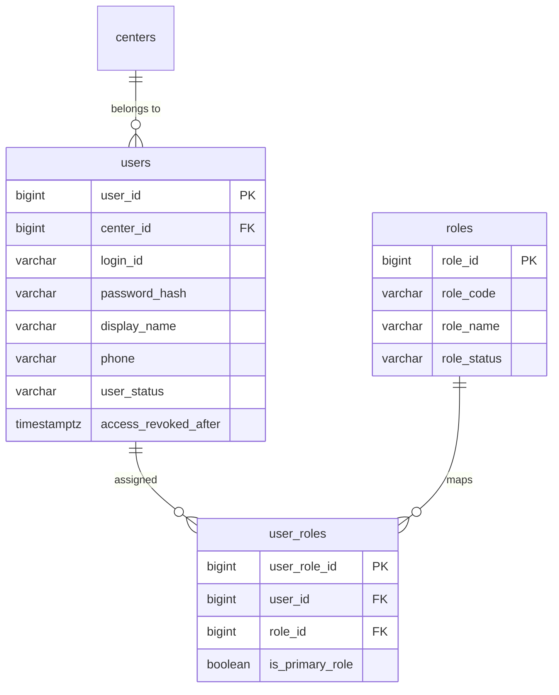

# refactor: Align role storage with database design

## Overview

현재 권한 모델은 `users.role_code` 단일 컬럼을 소스 오브 트루스로 사용한다. 반면 설계 문서 [docs/03_데이터베이스_설계서.md](../03_데이터베이스_설계서.md)는 `roles`와 `user_roles`를 통한 역할 매핑 구조를 정의하고 있으며, 이 불일치가 누적되면서 문서/DB/애플리케이션 권한 경계가 서로 다른 모델을 가리키고 있다.

이번 작업은 설계 문서와 실제 구현을 정렬하기 위해 권한 저장 구조를 `roles` + `user_roles`로 단일 전환하는 리팩터다. 다만 제품 운영 규칙은 당분간 "사용자 1명 = 역할 1개"를 유지한다. 즉, 스키마는 M:N 기반으로 옮기되 실제 권한 해석과 JWT 계약은 현재 단일 역할 모델을 유지해 범위를 통제한다 (see brainstorm: docs/brainstorms/2026-03-23-role-model-alignment-with-database-design-brainstorm.md).

이번 1차 범위는 백엔드/DB/JWT 계약 정렬이 우선이며, 프론트는 새 인증 응답을 수용하는 최소 수정만 포함한다. 프론트 권한 모델을 배열/다중 역할 기반으로 확장하는 작업은 후속 백로그로 남긴다 (see brainstorm: docs/brainstorms/2026-03-23-role-model-alignment-with-database-design-brainstorm.md).

## Problem Statement

현재 코드베이스는 권한을 전방위적으로 `role_code` 문자열로 직접 해석한다.

- `AuthUserEntity`와 `AuthUserRepository`가 `users.role_code`를 직접 읽고 쓴다.
- `AuthService`, `JwtTokenService`, `JwtAuthenticationFilter`, `SecurityContextCurrentUserProvider`가 단일 `roleCode`를 로그인/JWT/보안 컨텍스트의 중심 계약으로 쓴다.
- `MembershipPurchaseService`, `MemberService`, `ReservationService`, `TrainerService` 등 여러 서비스가 `ROLE_TRAINER`, `ROLE_DESK`, `ROLE_CENTER_ADMIN` 문자열 비교를 비즈니스 규칙으로 직접 사용한다.
- 프론트는 `/api/v1/auth/login`, `/api/v1/auth/me` 응답의 단일 `roleCode`를 `authUser.role`로 저장하고, route metadata와 UI gating에서 그대로 사용한다.
- 시더 및 통합 테스트 fixture도 `users.role_code`에 직접 insert/update 한다.

이 상태에서는 다음 문제가 지속된다.

- DB 설계 문서와 실제 구현이 다르다.
- 권한 저장 구조를 확장하거나 정규화하려면 거의 모든 계층을 다시 손봐야 한다.
- `role_code`를 유지한 채 `user_roles`를 추가하면 이중 소스 오브 트루스가 생긴다.
- 최근 trainer management처럼 역할 체계를 손대는 기능이 나올 때마다 role storage contract가 기능 구현과 뒤섞인다.

## Proposed Solution

### Chosen Direction

브레인스토밍에서 결정한 방향은 다음과 같다.

- 저장 구조는 설계서대로 `roles` + `user_roles`로 전환한다.
- 운영 규칙은 당분간 사용자당 1역할만 허용한다.
- 전환 방식은 `users.role_code` 병행 운영이 아니라 단일 전환으로 본다.
- 1차 범위는 백엔드/DB/JWT 계약 정렬이며, 프론트는 최소 수정만 포함한다.

위 결정은 모두 [2026-03-23-role-model-alignment-with-database-design-brainstorm.md](../brainstorms/2026-03-23-role-model-alignment-with-database-design-brainstorm.md)에서 확정됐다.

### Target Model

- `roles`
  - canonical role catalog (`ROLE_SUPER_ADMIN`, `ROLE_CENTER_ADMIN`, `ROLE_MANAGER`, `ROLE_DESK`, `ROLE_TRAINER`)
- `user_roles`
  - user-role mapping table
  - 이번 단계에서는 `UNIQUE (user_id)` 또는 동등한 애플리케이션 invariant로 "실제 1역할"을 강제
- `users`
  - `role_code` 제거
  - 인증/조회에 필요한 사용자 기본 정보만 유지

### Contract Preservation

단일 역할 운영 규칙을 유지하므로, 외부 계약은 가능한 한 단순하게 보존한다.

- JWT access/refresh token claim은 당분간 단일 `role` string을 유지
- `/api/v1/auth/login`, `/api/v1/auth/me` 응답도 `roleCode` 단일 값을 유지
- Spring Security `hasAnyRole(...)` 기반 정책도 유지
- 프론트 `authUser.role` 단일 값 전제도 유지

즉, 저장 구조는 바뀌지만 런타임 권한 해석 계약은 1차 전환에서 크게 흔들지 않는다.

## Technical Approach

### Architecture

이번 리팩터는 다음 네 축을 동시에 건드린다.

1. DB schema / migration
   - `roles`, `user_roles` 도입
   - `users.role_code` 제거
   - 기존 사용자 role 데이터를 새 구조로 backfill
2. Auth persistence / domain
   - `AuthUserEntity`, `AuthUserRepository`, auth query path에서 role join 기반 조회로 변경
   - role 변경/트레이너 생성 등 write path도 `user_roles` 기준으로 갱신
3. JWT / Spring Security
   - 로그인/refresh 시 role 조회 source를 `user_roles`로 전환
   - `JwtAuthenticationFilter`와 security principal은 단일 role claim을 유지하되 source만 변경
4. Downstream role consumers
   - trainer/membership/member/reservation/access paths에서 `AuthUser.roleCode()`가 새 구조에서 안정적으로 채워지도록 정렬
   - 프론트 auth bootstrap은 응답 계약 유지 전제에서 최소 수정만 반영

### ERD

### Research Findings

#### Repo Patterns

- `backend/src/main/java/com/gymcrm/auth/AuthUserEntity.java`
  - 현재 `users.role_code`를 JPA entity 필드로 직접 매핑한다.
- `backend/src/main/java/com/gymcrm/auth/AuthUserRepository.java`
  - `findActiveByCenterAndRoleCode`, `updateRoleCode`, `insert(... roleCode ...)` 등 저장/조회/변경이 모두 `role_code` 중심이다.
- `backend/src/main/java/com/gymcrm/auth/JwtTokenService.java`
  - access/refresh token 모두 단일 `role` claim을 발급/파싱한다.
- `backend/src/main/java/com/gymcrm/auth/JwtAuthenticationFilter.java`
  - `SimpleGrantedAuthority(user.roleCode())` 단일 authority를 세팅한다.
- `backend/src/main/java/com/gymcrm/common/security/AccessPolicies.java`
  - 모든 method security는 `hasAnyRole(...)` 기반이다.
- `backend/src/main/java/com/gymcrm/membership/MembershipPurchaseService.java`
- `backend/src/main/java/com/gymcrm/member/MemberService.java`
- `backend/src/main/java/com/gymcrm/reservation/ReservationService.java`
- `backend/src/main/java/com/gymcrm/trainer/TrainerService.java`
  - 비즈니스 규칙에서 `ROLE_TRAINER`, `ROLE_DESK`, `ROLE_CENTER_ADMIN`, `ROLE_SUPER_ADMIN`을 직접 비교한다.
- `frontend/src/app/auth.tsx`
  - auth runtime state는 `authUser.role` 단일 문자열을 전제로 한다.
- `frontend/src/app/routes.ts`
  - route metadata는 `visibleRoles` / `allowedRoles` 배열이지만 입력은 단일 현재 역할이다.

#### Institutional Learnings

- [2026-03-20-feat-trainer-management-and-account-operations-plan.md](./2026-03-20-feat-trainer-management-and-account-operations-plan.md)
  - recent trainer feature는 role surface와 trainer CRUD를 강하게 엮고 있으므로 role storage cutover 시 regression 위험이 크다.
- `docs/solutions/`와 기존 JWT/RBAC 관련 notes를 보면, 이 코드베이스는 no-auth prototype mode와 JWT mode를 함께 유지한다.
  - 따라서 prototype current user provider와 JWT current user provider의 parity를 계획에 포함해야 한다.

#### Research Decision

이 작업은 저장 구조, JWT claim, Spring Security, 권한 비교가 함께 얽힌 구조 변경이지만, 코드베이스 내부 패턴과 브레인스토밍 결정이 충분히 명확하다. 외부 베스트 프랙티스보다 현재 코드 계약과 데이터 전환 안정성이 더 중요하므로 이번 계획은 로컬 리서치만으로 진행한다.

### SpecFlow Analysis

Spec-flow 관점에서 빠지기 쉬운 흐름은 다음과 같다.

- 로그인 성공 -> JWT 발급 -> JWT 필터 -> method security -> 비즈니스 서비스 role 비교
  - 이 전체 체인이 모두 새 storage source를 봐야 한다.
- role 변경 API -> `user_roles` 갱신 -> 기존 token revoke -> 이후 request에서 새 role 반영
  - storage cutover와 revoke semantics가 어긋나면 stale privilege가 남을 수 있다.
- trainer create/update/status 및 membership assigned trainer validation
  - `ROLE_TRAINER` 판별이 join 기반으로 바뀌어도 current behavior가 유지돼야 한다.
- prototype mode current user
  - DB lookup 없이 role을 결정하는 경로가 남아 있는지 확인해야 한다.
- 테스트 fixture / seeder
  - `users.role_code` 직접 SQL insert/update가 남아 있으면 cutover 후 대규모 test break가 발생한다.

이 분석을 바탕으로 acceptance criteria와 migration/test phases에 fixture parity와 token lifecycle 검증을 명시한다.

### Implementation Phases

#### Phase 1: Schema Foundation and Data Cutover

목표: 권한 저장 구조를 `roles` + `user_roles`로 도입하고, `users.role_code`를 제거할 수 있는 DB 상태를 만든다.

작업:
- `roles` 테이블 추가
  - canonical role rows seed
  - `role_code` unique invariant
  - optional active/status field if current style에 맞추고 싶다면 포함
- `user_roles` 테이블 추가
  - FK: `user_id -> users.user_id`
  - FK: `role_id -> roles.role_id`
  - soft delete/audit column policy 여부를 현재 user-related table conventions와 맞춰 결정
  - 이번 단계에서는 `UNIQUE (user_id)` 또는 equivalent unique partial index로 "실제 1역할" 강제
- backfill migration 작성
  - existing `users.role_code`를 `roles.role_code`로 매핑해 `user_roles` 생성
  - `NULL` 또는 unknown role data 검출 시 migration fail-fast
- cutover migration 작성
  - backfill 검증 후 `users.role_code` drop
  - old check constraints/drop dependency 정리

성공 기준:
- 모든 기존 사용자에 대해 exactly one `user_roles` row 존재
- canonical roles seed가 deterministic
- cutover 후 `users.role_code` 없이도 role resolution이 가능

#### Phase 2: Auth Persistence and JWT Contract Migration

목표: 인증/보안 계층의 role source를 새 구조로 옮긴다.

작업:
- `AuthUserEntity`에서 `roleCode` 필드 제거 또는 entity responsibility 축소
- `AuthUserRepository`를 join/projection 기반으로 재구성
  - login/me/findById/findActiveByCenterAndUserId에서 role join 포함
  - `findActiveByCenterAndRoleCode`는 `user_roles -> roles.role_code` 조건으로 변경
  - user create 시 `users` insert + `user_roles` insert를 하나의 transactional path로 묶음
  - role update 시 `user_roles` 갱신으로 전환
- `AuthService.UserSession`은 단일 `roleCode` 응답을 유지
- `JwtTokenService`
  - claim source는 새 role join 결과
  - claim shape는 기존 `role` 단일 string 유지
- `JwtAuthenticationFilter`
  - `SimpleGrantedAuthority` source를 새 role lookup 결과에 맞춤
  - token claim role과 DB current role 간 drift 검증 정책을 명확히 정의
- `SecurityContextCurrentUserProvider.AuthenticatedUserPrincipal`
  - 현재처럼 단일 roleCode 필드 유지

성공 기준:
- `/api/v1/auth/login`, `/refresh`, `/me` contract가 깨지지 않음
- method security와 `CurrentUserProvider` behavior가 기존과 동일
- role update/revoke 이후 stale token semantics가 유지됨

#### Phase 3: Downstream Service Adoption

목표: role-dependent business paths가 새 storage source 아래에서도 동일하게 동작하도록 정리한다.

작업:
- trainer domain
  - trainer query의 `u.role_code = 'ROLE_TRAINER'` 조건을 role join/exists 조건으로 교체
  - trainer create/update/status flow가 `user_roles` write path를 사용하도록 정렬
- membership/member/reservation/access domain
  - `ROLE_TRAINER` / `ROLE_DESK` / `ROLE_CENTER_ADMIN` direct comparison이 `AuthUser.roleCode()` projection을 통해 동일 동작하도록 유지
  - assigned trainer validation이 새 role source 기준으로 동작하는지 검증
- auth operational role-change/revoke flows
  - `ROLE_SUPER_ADMIN` restriction and revoke semantics preserved
- dev/admin seeders and startup defaults
  - `DevAdminUserSeeder` 등 초기 계정 생성 로직을 `user_roles` 기준으로 변경

성공 기준:
- trainer/membership/reservation/member/access regressions 없음
- current role-based read/write boundaries 유지
- super-admin security boundary 유지

#### Phase 4: Minimal Frontend Compatibility

목표: 프론트는 새 백엔드 계약을 수용하되, role model 재설계는 하지 않는다.

작업:
- `/api/v1/auth/login`, `/me` 응답이 여전히 `roleCode` 단일 값이면 프론트 변경은 최소화
- 필요한 경우 auth bootstrap/type만 새 payload shape에 맞춰 최소 수정
- route metadata, dashboard visibility, feature gating은 계속 단일 `authUser.role` 사용
- 후속 작업을 위해 backlog 문서/plan에 프론트 다중 역할 확장 후보를 명시

성공 기준:
- existing frontend auth bootstrap and route guard continue to work
- current live/mock role gating behavior unchanged
- no immediate frontend redesign required

#### Phase 5: Verification and Rollout Safety

목표: cutover 이후 권한 모델이 실제 운영 계약을 깨지 않는지 검증한다.

작업:
- migration integration test
  - legacy `users.role_code` seeded data -> roles/user_roles backfill -> cutover success
- auth integration tests
  - login/refresh/me still emit expected role
  - role update + revoke behavior preserved
  - denied stale token path preserved
- RBAC integration tests
  - existing `CENTER_ADMIN` / `MANAGER` / `DESK` / `TRAINER` / `SUPER_ADMIN` boundaries unchanged
- trainer management regression tests
  - trainer list/create/update/status flow survives role storage migration
- fixture/seeder audit
  - direct `role_code` SQL usage 제거 또는 update

성공 기준:
- role storage migration does not introduce auth/RBAC regressions
- critical integration suites pass without fallback to legacy column

실행 로그/검증 기준:
- [docs/notes/2026-03-23-role-storage-phase5-validation-and-rollout-log.md](../notes/2026-03-23-role-storage-phase5-validation-and-rollout-log.md)

## Alternative Approaches Considered

### 1. Keep `users.role_code` and update the design doc

장점:
- 가장 빠르다.
- 운영 전환 리스크가 낮다.

기각 이유:
- 브레인스토밍에서 명시적으로 배제됐다.
- 설계서와 구현 정렬이라는 이번 목표를 달성하지 못한다.

### 2. Parallel-write `users.role_code` and `user_roles`

장점:
- 단기적으로 안전해 보인다.
- 전환 중 rollback 지점이 많다.

기각 이유:
- 브레인스토밍에서 이중 소스 오브 트루스를 피하기 위해 단일 전환으로 결정했다.
- 장기적으로 더 위험한 drift를 만든다 (see brainstorm: docs/brainstorms/2026-03-23-role-model-alignment-with-database-design-brainstorm.md).

### 3. Full multi-role runtime in the same cutover

장점:
- 설계서의 M:N 의미를 가장 완전하게 구현한다.
- 장기 구조는 가장 깨끗하다.

기각 이유:
- 현재 제품/프론트/JWT/method security가 모두 단일 역할 전제다.
- 이번 단계에서 범위를 과도하게 키운다.

## System-Wide Impact

### Interaction Graph

- 로그인
  - `/api/v1/auth/login`
  - `AuthService.login`
  - `AuthUserRepository.findActiveByCenterAndLoginId`
  - `users + user_roles + roles` join
  - `JwtTokenService.issueAccessToken`
  - `JwtAuthenticationFilter`
  - `AccessPolicies` / `@PreAuthorize`
  - downstream services

- role update
  - `/api/v1/auth/users/{id}/role`
  - `AuthAccessRevocationService.updateRoleAndRevoke`
  - `user_roles` update
  - access revoke marker + refresh token revoke
  - next request parses token / re-checks current user

- trainer create
  - trainer write surface
  - `users` insert
  - `user_roles` insert with `ROLE_TRAINER`
  - trainer query paths resolve trainer role via join

### Error & Failure Propagation

- migration backfill failure
  - unknown role code or duplicate role mapping should fail migration early rather than silently skipping rows
- login path failure
  - if user exists but no `user_roles` row exists, authentication should fail deterministically and surface as auth/data integrity issue
- role update failure
  - `user_roles` update succeeds but revoke marker write fails -> partial security state risk
  - transactional boundary must keep role change + revoke side effects coherent
- JWT drift
  - token contains old role but DB now has new role -> existing revoke semantics should continue to close this

### State Lifecycle Risks

- orphaned users without `user_roles`
  - login and current-user hydration break
- duplicate `user_roles` rows
  - single-role runtime assumptions become ambiguous
- stale seed/test SQL
  - large parts of integration test suite fail post-cutover
- trainer queries or membership validations still joining `users.role_code`
  - runtime read paths break even if auth login works

### API Surface Parity

- `/api/v1/auth/login`, `/refresh`, `/me`
  - preserve single `roleCode`
- JWT claims
  - preserve single `role`
- frontend `authUser.role`
  - preserve current contract in phase 1
- prototype mode
  - maintain no-auth prototype behavior parity

### Integration Test Scenarios

1. Legacy-style seeded user logs in after schema cutover and receives the same effective role in JWT and `/me`.
2. `CENTER_ADMIN` updates another same-center user from `ROLE_MANAGER` to `ROLE_DESK` and token revocation still invalidates previous sessions.
3. Trainer management creates a trainer and membership assignment validation still recognizes the user as `ROLE_TRAINER`.
4. Trainer-scoped reservation/member reads still restrict to assigned trainer memberships after role storage cutover.
5. Dev admin seed startup still produces a usable center-admin account in JWT mode without relying on `users.role_code`.

## Acceptance Criteria

### Functional Requirements

- [x] `roles` and `user_roles` become the only role storage source in the database.
- [x] Every active runtime path that currently reads `users.role_code` is migrated to the new storage source.
- [x] The system continues to operate with one effective role per user, even though the schema uses a mapping table.
- [x] `/api/v1/auth/login`, `/api/v1/auth/refresh`, and `/api/v1/auth/me` still expose a single effective `roleCode`.
- [x] Existing RBAC behavior for `ROLE_SUPER_ADMIN`, `ROLE_CENTER_ADMIN`, `ROLE_MANAGER`, `ROLE_DESK`, and `ROLE_TRAINER` remains unchanged.

### Non-Functional Requirements

- [x] The role cutover is transactional and fail-fast; invalid legacy role data cannot silently migrate.
- [x] JWT mode and prototype mode continue to boot and authorize correctly.
- [x] Trainer/member/reservation/membership integrations do not regress.
- [x] Minimal frontend compatibility changes are sufficient; no full frontend role-model rewrite is required in this phase.

### Quality Gates

- [x] Migration/backfill tests cover canonical role seeding and one-role-per-user invariant.
- [x] Auth integration tests cover login/refresh/me and role update/revoke after cutover.
- [x] RBAC integration tests prove no permission regressions.
- [x] Recently added trainer-management flows pass against the new role storage model.
- [x] Remaining frontend multi-role refactor work is explicitly documented as backlog, not silently omitted.

## Success Metrics

- Auth/JWT flows continue to pass without `users.role_code`.
- No role-related 5xx or unexpected 401/403 regressions appear in auth and trainer-related integration suites.
- Dev/admin seeding and local JWT mode remain runnable with the new schema.
- The codebase no longer contains runtime reads/writes of `users.role_code` outside historical migration/test fixtures explicitly marked for legacy setup.

## Dependencies & Prerequisites

- Existing brainstorm document: [docs/brainstorms/2026-03-23-role-model-alignment-with-database-design-brainstorm.md](../brainstorms/2026-03-23-role-model-alignment-with-database-design-brainstorm.md)
- Current auth stack:
  - `backend/src/main/java/com/gymcrm/auth/AuthService.java`
  - `backend/src/main/java/com/gymcrm/auth/JwtTokenService.java`
  - `backend/src/main/java/com/gymcrm/auth/JwtAuthenticationFilter.java`
- Current security stack:
  - `backend/src/main/java/com/gymcrm/common/security/AccessPolicies.java`
  - `backend/src/main/java/com/gymcrm/common/security/SecurityContextCurrentUserProvider.java`
- Current downstream role consumers:
  - `backend/src/main/java/com/gymcrm/trainer/TrainerService.java`
  - `backend/src/main/java/com/gymcrm/membership/MembershipPurchaseService.java`
  - `backend/src/main/java/com/gymcrm/member/MemberService.java`
  - `backend/src/main/java/com/gymcrm/reservation/ReservationService.java`
- Frontend auth contract:
  - `frontend/src/app/auth.tsx`
  - `frontend/src/app/routes.ts`

## Risk Analysis & Mitigation

- Risk: single-cutover migration leaves orphaned `user_roles` gaps.
  - Mitigation: fail migration if any legacy user cannot map to a canonical role row.

- Risk: JPA entity assumptions around `AuthUserEntity` make join-based role hydration awkward.
  - Mitigation: move role-sensitive reads to explicit query/projection methods rather than overfitting JPA entity relations in one pass.

- Risk: test suite churn becomes unmanageable because many fixtures hardcode `role_code`.
  - Mitigation: introduce shared helper/query utilities early in the implementation and batch-update fixture creation sites by domain.

- Risk: frontend appears compatible but JWT payload or `/me` shape accidentally changes.
  - Mitigation: treat auth response schema preservation as a hard acceptance criterion and add auth UI/bootstrap tests if needed.

- Risk: `user_roles` is M:N in schema but developers start assuming multi-role runtime is already supported.
  - Mitigation: document and enforce one-role-per-user invariant explicitly in schema constraints, service validation, and plan/docs.

## Resource Requirements

- Backend engineer comfortable with Spring Security, JWT, and SQL migrations
- Focused integration test update pass across auth, RBAC, trainer, membership, reservation domains
- Minimal frontend contract verification

## Future Considerations

- Revisit true multi-role runtime support after the storage cutover is stable.
- Consider changing JWT claim shape from single `role` to `roles[]` only when product policy requires multiple effective roles.
- Rework frontend route/auth state to consume a richer role model only in a separate follow-up.

## Documentation Plan

- Keep the brainstorm as origin and decision source.
- Update DB and security docs after implementation to reflect that runtime still enforces one effective role per user.
- Record rollout verification notes if migration/testing uncovers environment-specific constraints.
- Leave explicit backlog entries for deferred frontend work rather than implying full role-model parity.

## Sources & References

### Origin

- **Brainstorm document:** [docs/brainstorms/2026-03-23-role-model-alignment-with-database-design-brainstorm.md](../brainstorms/2026-03-23-role-model-alignment-with-database-design-brainstorm.md)
  - Key decisions carried forward:
  - move role storage to `roles` + `user_roles`
  - keep one effective role per user for now
  - use a single cutover rather than dual-write/dual-read
  - prioritize backend/DB/JWT first and keep frontend work minimal

### Internal References

- Database design source: [docs/03_데이터베이스_설계서.md](../03_데이터베이스_설계서.md)
- Auth entity/repository:
  - `backend/src/main/java/com/gymcrm/auth/AuthUserEntity.java`
  - `backend/src/main/java/com/gymcrm/auth/AuthUserRepository.java`
- JWT/security:
  - `backend/src/main/java/com/gymcrm/auth/JwtTokenService.java`
  - `backend/src/main/java/com/gymcrm/auth/JwtAuthenticationFilter.java`
  - `backend/src/main/java/com/gymcrm/common/security/AccessPolicies.java`
  - `backend/src/main/java/com/gymcrm/common/security/SecurityContextCurrentUserProvider.java`
- Downstream role consumers:
  - `backend/src/main/java/com/gymcrm/trainer/TrainerService.java`
  - `backend/src/main/java/com/gymcrm/membership/MembershipPurchaseService.java`
  - `backend/src/main/java/com/gymcrm/member/MemberService.java`
  - `backend/src/main/java/com/gymcrm/reservation/ReservationService.java`
- Frontend auth contract:
  - `frontend/src/app/auth.tsx`
  - `frontend/src/app/routes.ts`

### Related Work

- Trainer/account operations plan: [docs/plans/2026-03-20-feat-trainer-management-and-account-operations-plan.md](./2026-03-20-feat-trainer-management-and-account-operations-plan.md)
