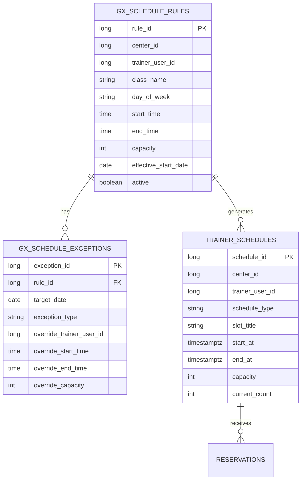

# feat: Add GX recurring schedule registration

## Overview

GX 수업 스케줄 등록 기능을 `반복 규칙 + 예외 수정 + 4주 롤링 슬롯 유지` 모델로 추가한다. 계획의 출발점은 확정된 브레인스토밍 문서이며, 반복 규칙 등록은 센터 매니저 전용으로 두고 예약/정원 관리는 기존과 동일하게 실제 생성된 `trainer_schedules` 슬롯 기준으로 유지한다 (see brainstorm: docs/brainstorms/2026-03-27-gx-recurring-schedule-registration-brainstorm.md).

이번 범위는 1차 MVP에 집중한다. 즉, 대기열 자동 승격, 독립 회차 분리 편집, 복잡한 재편성 기능은 제외하고, 반복 GX 시간표를 안정적으로 등록하고 운영자가 특정 회차를 휴강/수정할 수 있는 수준까지를 목표로 한다.

## Problem Statement / Motivation

현재 예약 모듈은 PT/GX 예약 자체와 예약 상태 전이는 존재하지만, GX 수업 스케줄을 운영자가 반복 규칙으로 등록하는 기능은 없다. 요구사항 추적 문서에서도 `FR-RSV-002 | GX 수업 스케줄 등록 | Not Started`로 남아 있다 (`docs/notes/phase11-fr-traceability-baseline-2026-03-04.md:57`).

기존 구조는 `trainer_schedules`를 실제 예약 가능한 슬롯으로 취급하고 있으며, 예약/정원 정책은 이 슬롯을 기준으로 정렬돼 있다. 예를 들어 예약 목록 노출은 미래 `trainer_schedules`를 그대로 사용하고 (`backend/src/main/java/com/gymcrm/reservation/service/ReservationService.java:157`), PT 예약도 최종적으로 실재 슬롯을 생성한 뒤 reservation row를 만든다 (`backend/src/main/java/com/gymcrm/reservation/service/PtReservationService.java:143`). 따라서 GX 등록 기능도 별도 계산형 캘린더보다 "반복 규칙이 미래 슬롯을 유지하는 구조"로 가는 것이 현재 코드베이스와 가장 잘 맞는다.

## Proposed Solution

### 1. 운영 모델

- GX 반복 규칙을 새 상위 개념으로 도입한다.
- 운영자는 `수업명`, `담당 강사`, `요일`, `시작/종료 시간`, `정원`, `적용 시작일`, `활성 여부`를 관리한다.
- 시스템은 반복 규칙을 바탕으로 앞으로 4주치 GX 실제 슬롯을 `trainer_schedules`에 유지한다.
- 회원 예약은 기존과 동일하게 생성된 GX 슬롯을 선택해 진행한다.
- 특정 날짜 휴강/시간 변경/강사 변경/정원 변경은 반복 규칙을 깨지 않는 예외 수정으로 처리한다.

### 2. 권한 모델

- 센터 매니저: GX 반복 규칙 생성/수정/종료, 기본 정원 변경, 예외 등록/수정
- 트레이너: 본인에게 배정된 회차에 대한 제한적 예외 처리만 허용
- 1차 MVP에서는 트레이너 권한을 보수적으로 시작한다. 최소 범위는 본인 회차 휴강/메모 또는 운영 승인 기반 예외 처리다.

### 3. 슬롯 유지 전략

- 항상 "오늘 기준 앞으로 4주" 슬롯만 유지하는 롤링 윈도우를 사용한다.
- 반복 규칙 변경 시, 아직 예약이 없는 미래 슬롯은 재생성/동기화 대상이 된다.
- 이미 예약이 걸린 슬롯은 무조건 덮어쓰지 않고 예외 또는 운영자 확인 경로로 처리한다.

## Technical Approach

### Architecture

기존 `trainer_schedules`는 계속 "예약 가능한 실제 슬롯"으로 유지한다. 새로 필요한 것은 이 슬롯을 만들어내는 GX 운영 레이어다.

예상 데이터 모델:

핵심 원칙:
- 규칙 테이블은 운영 편의를 위한 source of intent
- `trainer_schedules`는 예약 정합성의 source of truth
- 예외는 규칙 전체가 아니라 특정 날짜 회차에만 적용

### Backend Workstreams

#### A. 도메인/DB

- GX 반복 규칙 테이블 추가
- GX 예외 테이블 추가
- `trainer_schedules`에 규칙/예외와의 연결 식별자 추가 여부 결정
  - 추천: `source_rule_id`, `source_exception_id`, `generation_mode` 같은 최소 추적 컬럼
- 예약 중인 슬롯을 안전하게 구분할 수 있도록, 재생성 대상 판정 기준을 명확히 둔다

#### B. 서비스/API

- GX 반복 규칙 CRUD API 추가
- GX 예외 등록/수정 API 추가
- 4주 롤링 슬롯 생성/보정 서비스 추가
- `GET /api/v1/reservations/schedules`는 계속 실제 슬롯을 반환하되, 필요한 경우 GX slot metadata를 확장한다
- 센터/권한 스코프는 기존 reservation 패턴과 동일하게 강제한다

#### C. 운영 정책

- 규칙 생성 시 즉시 4주치 슬롯 생성
- 규칙 수정 시 미래 슬롯 재동기화
- 예외 등록 시 대상 회차만 수정 또는 휴강 처리
- 예약이 존재하는 회차 변경 정책은 별도 가드 필요
  - 최소 정책: 예약이 있는 회차는 휴강/시간 변경 불가 또는 강한 확인/차단

### Frontend Workstreams

- 예약 워크스페이스와 별개로 GX 운영 화면 또는 관리자용 GX 스케줄 관리 섹션 추가
- 반복 규칙 등록 폼:
  - 수업명
  - 강사
  - 요일
  - 시작/종료 시간
  - 정원
  - 적용 시작일
- 예외 관리 UI:
  - 특정 날짜 휴강
  - 특정 날짜 강사 변경
  - 특정 날짜 시간 변경
  - 특정 날짜 정원 변경
- 예약 화면은 여전히 생성된 GX 슬롯 목록을 보여주되, 필요하면 slot title/원본 규칙 정보 노출을 강화한다

## SpecFlow Analysis

### User Flow Overview

1. 센터 매니저가 GX 반복 규칙을 등록한다.
2. 시스템이 4주치 GX 슬롯을 생성한다.
3. 회원/프론트가 기존 예약 화면에서 생성된 GX 슬롯을 예약한다.
4. 센터 매니저 또는 허용된 트레이너가 특정 날짜 회차를 휴강/수정한다.
5. 시스템이 해당 날짜 슬롯만 갱신하고 나머지 반복 규칙은 유지한다.

### Critical Flow Gaps Addressed in This Plan

- 규칙 수정이 이미 예약된 미래 슬롯과 충돌할 때의 처리 정책 필요
- 트레이너 권한이 반복 규칙까지 침범하지 않도록 API/화면 권한 분리 필요
- 슬롯 생성 배치와 수동 수정이 동시에 일어날 때 중복 생성 방지 필요
- 예약 화면이 stale GX 슬롯을 보여주지 않도록 조회/재로드 기준 명확화 필요

### Assumptions for Planning

- 1차 범위에서는 대기열과 자동 승격을 포함하지 않는다.
- 1차 범위에서는 회차 독립 분리 편집을 포함하지 않는다.
- 1차 범위에서는 알림 발송보다 슬롯 정합성과 운영 편의 확보가 우선이다.

## System-Wide Impact

- **Interaction graph**: GX 규칙 등록이 슬롯 생성 서비스로 이어지고, 생성된 `trainer_schedules`가 기존 예약 조회/생성 경로로 연결된다. 예약 생성 이후 `current_count`와 reservation 상태 전이 규칙은 기존 reservation service를 그대로 따른다.
- **Error propagation**: 규칙/예외 검증 실패는 validation/business rule error로 API에서 즉시 반환한다. 슬롯 생성 중 DB 제약 충돌이나 중복 생성이 발생하면 트랜잭션 단위로 실패시켜 부분 생성 상태를 남기지 않아야 한다.
- **State lifecycle risks**: 규칙만 저장되고 슬롯이 일부만 생성되면 운영 화면과 예약 화면이 어긋날 수 있다. 따라서 규칙 저장과 초기 슬롯 생성의 경계, 재동기화 실패 시 재시도 전략이 필요하다.
- **API surface parity**: 운영용 GX 스케줄 API와 기존 `GET /api/v1/reservations/schedules`가 동일 슬롯을 바라보되 책임이 분리돼야 한다. 예약 API는 새 GX 규칙을 몰라도 동작해야 한다.
- **Integration test scenarios**:
  - 규칙 생성 후 4주치 GX 슬롯 생성 검증
  - 특정 날짜 휴강 예외 적용 시 해당 회차만 예약 불가 처리 검증
  - 예약 존재 회차 변경 시 차단 또는 정책된 오류 반환 검증
  - 센터 간 스코프 격리 검증
  - 트레이너가 반복 규칙 수정 시도 시 권한 거부 검증

## Acceptance Criteria

### Functional Requirements

- [x] 센터 매니저는 GX 반복 규칙을 생성, 수정, 종료할 수 있다.
- [x] GX 반복 규칙 생성 시 앞으로 4주치 GX 실제 슬롯이 생성된다.
- [x] GX 반복 규칙 수정 시 아직 운영상 수정 가능한 미래 슬롯만 재동기화된다.
- [x] 특정 날짜 예외로 휴강, 강사 변경, 시간 변경, 정원 변경을 처리할 수 있다.
- [x] 예외 적용은 대상 회차에만 반영되고 원본 반복 규칙은 유지된다.
- [x] 기존 예약 화면은 생성된 GX 슬롯을 계속 표시하고 예약 생성 경로가 깨지지 않는다.
- [x] 트레이너는 반복 규칙을 수정할 수 없고, 허용된 범위의 회차 예외만 처리할 수 있다.

### Non-Functional Requirements

- [x] `trainer_schedules.current_count` 의미와 증감 규칙은 기존 reservation 정책을 유지한다.
- [x] 센터 스코프와 역할 권한은 기존 reservation/auth 패턴과 동일하게 강제된다.
- [x] 슬롯 재생성은 중복 row나 잘못된 덮어쓰기를 만들지 않는다.
- [x] 프론트 상태 전환 후 stale form/state로 잘못된 GX 수정 요청이 발생하지 않는다.

### Quality Gates

- [x] Flyway migration 추가
- [x] backend integration test 추가 또는 확장
- [x] frontend query/form regression test 추가
- [x] 최소 1개 실사용 흐름에 대한 통합 검증 기록 남김

## Implementation Phases

### Phase 1: Data and Policy Foundation

- GX 반복 규칙/예외 스키마 설계
- `trainer_schedules`와의 연결 추적 필드 설계
- 예약 존재 회차 변경 정책 확정
- API 권한 매트릭스 정의

### Phase 2: Backend GX Rule Management

- 반복 규칙/예외 CRUD API 구현
- 슬롯 생성 및 4주 롤링 유지 서비스 구현
- 규칙 수정/종료 시 미래 슬롯 동기화 정책 구현
- integration test 보강

### Phase 3: Frontend Operations UX

- 관리자용 GX 반복 규칙 등록/목록/수정 UI 구현
- 예외 처리 UI 구현
- 기존 예약 화면과의 연결 검증
- role-based action visibility 정리

### Phase 4: Validation and Hardening

- 정원/상태 정합성 회귀 검증
- 센터 스코프/권한 회귀 검증
- 브라우저 스모크 또는 운영 시나리오 검증 로그 작성
- 후속 범위 대기열/알림/독립 편집은 별도 문서로 분리

## Dependencies & Risks

### Dependencies

- reservation 모듈의 기존 `trainer_schedules`/`reservations` 정책 재사용
- trainer/manager role policy와 현재 auth scope 패턴
- frontend reservations workspace의 기존 schedule 조회 구조

### Risks

- 예약이 이미 걸린 미래 GX 슬롯을 규칙 변경으로 덮어쓰면 운영 데이터가 손상될 수 있다.
- 반복 규칙과 생성 슬롯 사이의 연결 키가 약하면 재동기화 중 중복/유실이 발생할 수 있다.
- 운영용 GX 관리 UI와 예약용 GX 선택 UI를 한 화면에 과도하게 섞으면 상태 관리가 복잡해진다.
- 트레이너 권한을 넓게 열면 매니저 운영 정책과 충돌할 수 있다.

### Mitigation

- 예약 존재 슬롯은 기본적으로 자동 덮어쓰기 금지
- 규칙/예외와 생성 슬롯 사이에 명시적 추적 필드 유지
- 운영 UI와 예약 UI를 책임 기준으로 분리
- role-based API/화면 검증을 integration test에 포함

## Success Metrics

- 센터 매니저가 날짜별 수동 입력 없이 주간 GX 시간표를 등록할 수 있다.
- GX 반복 규칙 등록 후 예약 화면에 4주치 슬롯이 일관되게 노출된다.
- 예외 수정이 다른 회차에 누수되지 않는다.
- 기존 PT/GX 예약, 취소, 완료, 노쇼 흐름 회귀가 없다.

## Sources & References

### Origin

- **Origin brainstorm:** [docs/brainstorms/2026-03-27-gx-recurring-schedule-registration-brainstorm.md](/Users/abc/projects/GymCRM_V2/docs/brainstorms/2026-03-27-gx-recurring-schedule-registration-brainstorm.md) — carried forward decisions: 반복 규칙 중심, 4주 롤링 슬롯, 예외 수정형, 매니저/트레이너 권한 분리

### Internal References

- `docs/notes/phase11-fr-traceability-baseline-2026-03-04.md:57`
- `backend/src/main/java/com/gymcrm/reservation/service/ReservationService.java:157`
- `backend/src/main/java/com/gymcrm/reservation/service/PtReservationService.java:143`
- `backend/src/main/resources/db/migration/V7__create_trainer_schedules_and_reservations.sql`
- `frontend/src/pages/reservations/ReservationsPage.tsx:160`
- `frontend/src/pages/reservations/modules/useReservationSchedulesQuery.ts`

### Institutional Learnings

- `docs/solutions/database-issues/reservation-capacity-and-usage-deduction-integrity-gymcrm-20260225.md`
  - `current_count`의 canonical rule을 먼저 고정하고 DB/service/UI/test를 함께 정렬해야 한다.
- `docs/solutions/database-issues/reservation-checkin-noshow-usage-event-integrity-gymcrm-20260225.md`
  - reservation 상태/메타데이터/운영 액션은 의미를 분리해서 설계해야 추후 정책 충돌을 줄일 수 있다.

### External Research

- 없음. 현재 코드베이스와 내부 문서의 로컬 패턴이 충분해 외부 조사는 생략했다.
