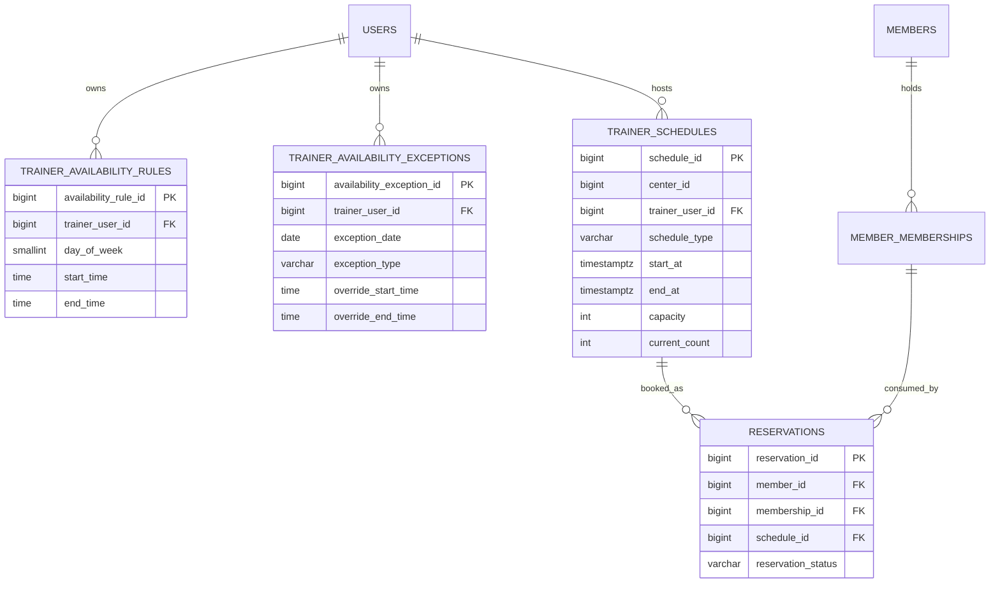

# feat: PT availability-based reservation flow

## Enhancement Summary

**Deepened on:** 2026-03-27
**Sections enhanced:** 7
**Research sources used:** local codebase, institutional solution docs, architecture/data-integrity/security/performance/frontend review passes

### Key Improvements
1. `trainer_schedules.trainer_user_id`의 의미를 “global canonical trainer identity”가 아니라 “구체 PT 예약 row의 operational owner/join key”로 좁혔다.
2. PT 후보 조회와 PT 생성의 authz, validation, response-minimization, concurrency 규칙을 명시적으로 추가했다.
3. 프런트 PT/GX 생성 흐름을 분기 컴포넌트와 전용 query hook으로 분리해 기존 예약 모달의 상태 복잡도 확장을 막도록 고정했다.

### New Considerations Discovered
- PT candidate API는 advisory read일 뿐이며, 실제 create 직전 membership row lock + overlap re-check가 필요하다.
- `trainer_user_id` nullable migration은 legacy `trainer_schedules` backfill/compatibility rule 없이는 overlap enforcement의 blind spot을 남긴다.
- PT candidate 생성은 day-scoped 48-slot 탐색으로 충분하며, month-scoped merge를 다시 만들 필요가 없다.

## Overview

Found brainstorm from 2026-03-27: `pt-availability-based-reservation`. Using it as the foundation for planning (see brainstorm: docs/brainstorms/2026-03-27-pt-availability-based-reservation-brainstorm.md).

이번 계획의 목표는 GX와 PT의 예약 생성 방식을 분리하는 것이다. GX는 기존처럼 미리 생성된 확정 슬롯에 회원을 배정하는 흐름을 유지하고, PT는 트레이너 availability를 기준으로 가능한 60분 시작 시각을 계산한 뒤 확정 예약을 생성하는 흐름을 도입한다 (see brainstorm: docs/brainstorms/2026-03-27-pt-availability-based-reservation-brainstorm.md).

핵심 방향은 세 가지다.

1. availability는 예약 후보 계산 기준으로만 쓰고, 최종 확정은 기존 reservation lifecycle에 기록한다 (see brainstorm: docs/brainstorms/2026-03-27-pt-availability-based-reservation-brainstorm.md).
2. PT 예약은 항상 60분 블록이며 시작 시각은 30분 단위다 (see brainstorm: docs/brainstorms/2026-03-27-pt-availability-based-reservation-brainstorm.md).
3. desk/admin은 전체 PT를 처리할 수 있고, trainer는 본인 담당 회원의 PT만 처리할 수 있다 (see brainstorm: docs/brainstorms/2026-03-27-pt-availability-based-reservation-brainstorm.md).

이 플랜은 단순 UI 추가가 아니라, availability와 reservation 사이의 연결 규칙, trainer identity의 canonical source, outstanding PT 예약과 remaining count의 관계까지 함께 고정한다.

## Problem Statement

현재 코드베이스에서는 예약 생성이 `scheduleId`를 전제로 동작한다. 즉, 프런트는 `/api/v1/reservations/schedules`에서 미래 스케줄 목록을 가져오고, 생성 시 `memberId + membershipId + scheduleId`를 보내는 구조다.

- `CreateReservationRequest`는 `scheduleId`를 필수로 요구한다.
  - `/Users/abc/projects/GymCRM_V2/backend/src/main/java/com/gymcrm/reservation/dto/request/CreateReservationRequest.java`
- 예약 생성 서비스는 이미 존재하는 `trainer_schedules` row를 읽어 정원과 상태를 검증한다.
  - `/Users/abc/projects/GymCRM_V2/backend/src/main/java/com/gymcrm/reservation/service/ReservationService.java`
- 예약 생성 UI도 스케줄 dropdown 기반이다.
  - `/Users/abc/projects/GymCRM_V2/frontend/src/pages/reservations/ReservationsPage.tsx`
  - `/Users/abc/projects/GymCRM_V2/frontend/src/pages/reservations/modules/useReservationSchedulesQuery.ts`

이 구조는 GX에는 자연스럽지만 PT에는 맞지 않는다. PT는 보통 “이미 정해진 클래스 슬롯”보다 “트레이너와 회원이 조율해 특정 시간에 잡는 1:1 일정”에 가깝다 (see brainstorm: docs/brainstorms/2026-03-27-pt-availability-based-reservation-brainstorm.md).

추가로, 현재 `trainer_schedules`에는 `trainer_name` snapshot만 있고 `trainer_user_id`가 없다. 따라서 “같은 트레이너의 시간 겹침”을 서버에서 정확히 검증하기 어렵다.

- `/Users/abc/projects/GymCRM_V2/backend/src/main/resources/db/migration/V7__create_trainer_schedules_and_reservations.sql`
- `/Users/abc/projects/GymCRM_V2/backend/src/main/java/com/gymcrm/reservation/entity/TrainerScheduleEntity.java`

또 하나의 중요한 공백은 COUNT 회원권의 남은 횟수와 미래 확정 예약의 관계다. 현재 reservable 판단은 `remainingCount > 0` 수준이라, 남은 횟수 1회인 PT 회원권으로 미래 예약을 여러 건 선점할 여지가 있다.

- `/Users/abc/projects/GymCRM_V2/frontend/src/pages/reservations/modules/reservableMemberships.ts`
- `/Users/abc/projects/GymCRM_V2/backend/src/main/java/com/gymcrm/reservation/repository/ReservationQueryRepository.java`

## Research Summary

### Local repo research

- 예약 확정 모델은 `trainer_schedules` + `reservations` 조합이고, `current_count`는 confirmed reservation 수와 정합하게 유지되도록 설계돼 있다.
  - `/Users/abc/projects/GymCRM_V2/backend/src/main/resources/db/migration/V7__create_trainer_schedules_and_reservations.sql`
  - `/Users/abc/projects/GymCRM_V2/backend/src/main/java/com/gymcrm/reservation/service/ReservationService.java`
- trainer availability는 이미 별도 모델로 분리돼 있으며, 월 단위 `effectiveDays`까지 응답한다.
  - `/Users/abc/projects/GymCRM_V2/backend/src/main/resources/db/migration/V26__create_trainer_availability_tables.sql`
  - `/Users/abc/projects/GymCRM_V2/backend/src/main/java/com/gymcrm/trainer/availability/controller/TrainerAvailabilityController.java`
- trainer scope는 membership의 `assigned_trainer_id`를 canonical source로 사용하고 있다.
  - `/Users/abc/projects/GymCRM_V2/backend/src/main/java/com/gymcrm/membership/entity/MemberMembershipEntity.java`
  - `/Users/abc/projects/GymCRM_V2/backend/src/main/java/com/gymcrm/reservation/service/ReservationService.java`
  - `/Users/abc/projects/GymCRM_V2/backend/src/main/java/com/gymcrm/reservation/repository/ReservationQueryRepository.java`
- 프런트는 이미 `ROLE_TRAINER`와 trainer self-service route를 지원한다.
  - `/Users/abc/projects/GymCRM_V2/frontend/src/app/routes.ts`
  - `/Users/abc/projects/GymCRM_V2/frontend/src/pages/trainer-availability/TrainerAvailabilityPage.tsx`

### Institutional learnings

- Reservation lifecycle는 문서, 서비스, DB invariant, UI guard가 같이 움직여야 drift를 막을 수 있다.
  - `/Users/abc/projects/GymCRM_V2/docs/solutions/database-issues/reservation-capacity-and-usage-deduction-integrity-gymcrm-20260225.md`
- RBAC만으로는 부족하고, center scope와 trainer ownership scope를 쿼리/서비스 레벨에서 함께 강제해야 한다.
  - `/Users/abc/projects/GymCRM_V2/docs/solutions/database-issues/reservation-capacity-and-usage-deduction-integrity-gymcrm-20260225.md`
- 출석/노쇼/완료 정책처럼 운영 상태가 있는 기능은 “상태 전이”와 “메타데이터/이벤트”를 섞지 말아야 한다.
  - `/Users/abc/projects/GymCRM_V2/docs/solutions/database-issues/reservation-checkin-noshow-usage-event-integrity-gymcrm-20260225.md`
- `docs/solutions/patterns/critical-patterns.md`는 현재 저장소에 없었다. 따라서 이번 계획은 개별 solution 문서들을 institutional baseline으로 사용한다.

### External research decision

강한 로컬 컨텍스트가 있고, 이미 availability와 reservation 두 도메인이 모두 구현돼 있다. 이번 작업은 외부 결제/API 연동이 아니라 기존 domain 연결과 정책 고정이므로 외부 리서치는 생략한다.

## Proposed Solution

### Product scope

이번 범위에서 제공할 기능:

1. PT 회원권 선택 시 기존 GX 스케줄 dropdown 대신 계산형 PT 예약 흐름 제공
2. `트레이너 선택 -> 날짜 선택 -> 가능한 60분 시작 시각 목록 조회`
3. 선택한 시각으로 PT 예약 확정 시 `trainer_schedules` row와 `reservations` row를 같은 트랜잭션에서 생성
4. desk/admin 전체 권한, trainer 본인 담당 회원권 한정 권한 적용
5. 회원 시간 겹침과 트레이너 시간 겹침을 모두 서버에서 차단
6. availability, existing schedule, membership remaining count를 함께 반영한 PT 후보 계산 API 제공

이번 범위에서 제외할 기능:

- PT 자유 입력 시작/종료 시각
- 60분 이외 길이
- 15분 단위 시작
- temporary candidate slot persistence
- availability 기반 자동 슬롯 대량 생성
- 회원-facing self-booking

### Planning resolutions for brainstorm follow-ups

브레인스토밍의 planning follow-up 세 가지는 아래처럼 고정한다.

1. `reservations/trainer_schedules` 연결 방식
   - PT 후보 시간은 계산만 하고 저장하지 않는다.
   - 사용자가 PT 시간을 확정하는 순간 `trainer_schedules(schedule_type='PT')` row를 만들고 바로 `reservations` row를 생성한다.
2. 가능 시각 계산 API shape
   - `GET /api/v1/reservations/pt-candidates?membershipId=&trainerUserId=&date=` 를 추가한다.
   - 후보 응답은 `startAt/endAt/source/reason` 중심으로 단순화한다.
3. 차감 시점
   - COUNT 차감 시점은 기존처럼 `COMPLETED` 유지
   - 대신 예약 생성 eligibility는 `remaining_count - outstanding confirmed PT reservations > 0` 기준으로 강화한다.

이렇게 하면 existing completion/usage-event 모델을 유지하면서도, 미래 PT 예약 과다 선점을 막을 수 있다.

## Technical Approach

### Architecture

이 기능은 availability 도메인과 reservation 도메인을 분리한 채, reservation 쪽에 “PT 예약 후보 계산 + PT 확정 생성”이라는 얇은 연결 레이어를 추가하는 형태가 적절하다.

명시적 경계는 아래처럼 고정한다.

- `trainer availability`: read-only source of effective rules/exceptions
- `reservation`: PT 후보 계산, eligibility 검증, overlap 검증, concrete PT booking 생성
- `membership.assigned_trainer_id`: trainer actor authorization의 canonical source
- `trainer_schedules.trainer_user_id`: concrete PT schedule row의 operational owner / join key

즉 `reservation -> trainer availability read interface` 의존성만 허용하고, availability 쪽이 reservation lifecycle을 소유하지 않는다.

권장 백엔드 경계:

```text
backend/src/main/java/com/gymcrm/reservation/
  controller/
  dto/request/
  dto/response/
  service/
  service/PtReservationService.java
  repository/
  entity/

backend/src/main/java/com/gymcrm/trainer/availability/
  service/
  repository/
  entity/
```

권장 프런트 경계:

```text
frontend/src/pages/reservations/
  ReservationsPage.tsx
  modules/useReservationSchedulesQuery.ts
  modules/useReservationTargetsQuery.ts
  modules/useSelectedMemberReservationsState.ts
  modules/usePtReservationCandidatesQuery.ts
  modules/ptReservation.ts
```

중요한 점은 availability write path를 건드리지 않고, reservation create path에서 availability read만 수행하는 것이다. availability가 예약 lifecycle callback chain을 직접 트리거하면 안 된다 (see brainstorm: docs/brainstorms/2026-03-27-pt-availability-based-reservation-brainstorm.md).

### Data model and schema changes

이 기능은 “새 persistent candidate table”은 만들지 않지만, existing reservation schema를 PT 동적 생성에 맞게 보강해야 한다.

#### Required schema changes

1. `trainer_schedules.trainer_user_id` nullable FK 추가
   - PT 예약 생성 시 concrete PT schedule row의 owner/join key 저장
   - GX도 이후 점진적으로 이 필드를 채울 수 있게 둔다
2. `trainer_schedules` 인덱스 확장
   - 예시: `(center_id, trainer_user_id, start_at)` where `is_deleted = FALSE AND schedule_type = 'PT'`
   - overlap query가 자주 쓰이면 `(center_id, trainer_user_id, start_at, end_at)` 조합도 검토한다
3. PT outstanding count query 지원
   - 새로운 테이블 대신 `reservations + trainer_schedules + member_memberships` 기반 query로 계산
4. reservation overlap 조회용 index 정리
   - 예시: `(center_id, member_id, reservation_status, schedule_id)` where `is_deleted = FALSE`
   - PT candidate 조회는 반드시 `CONFIRMED`와 `is_deleted = FALSE` 범위로만 좁힌다
5. legacy `trainer_schedules` backfill/compatibility rule 추가
   - 기존 row 중 `trainer_user_id IS NULL` 인 데이터는 가능한 범위에서 backfill
   - backfill 불가한 historical row는 overlap enforcement 대상에서 제외할지, 이름 snapshot fallback을 쓸지 정책을 문서화해야 한다
   - 초기 권장안은 “새 PT create는 `trainer_user_id` 필수, legacy null row는 historical compatibility 대상으로만 유지”다

#### ERD



#### Why `trainer_user_id` is required

현재 스키마는 `trainer_name`만 저장하므로 trainer overlap 검증을 문자열 snapshot에 의존해야 한다. 이 방식은 이름 변경, 동명이인, account linkage에서 깨지므로 이번 작업에서는 `trainer_user_id`를 canonical source로 추가해야 한다.

단, 여기서 canonical이라는 의미는 “구체 PT booking row의 trainer join key”에 한정된다. trainer authorization canonical source는 여전히 `membership.assigned_trainer_id`이고, trainer availability ownership canonical source는 availability tables다.

- `/Users/abc/projects/GymCRM_V2/backend/src/main/resources/db/migration/V7__create_trainer_schedules_and_reservations.sql`
- `/Users/abc/projects/GymCRM_V2/docs/plans/2026-03-20-feat-trainer-management-and-account-operations-plan.md`

### API surface

#### Existing GX endpoints kept as-is

- `GET /api/v1/reservations/schedules`
  - 계속 GX 스케줄 목록용으로 사용
- `POST /api/v1/reservations`
  - 기존 `scheduleId` 기반 예약 생성 유지

#### New PT endpoints

- `GET /api/v1/reservations/pt-candidates?membershipId={id}&trainerUserId={id}&date=YYYY-MM-DD`
  - availability + existing schedule conflicts + membership eligibility를 반영한 가능한 시작 시각 목록 반환
  - day-scoped 계산만 수행하며, 최대 48개의 30분 step만 탐색한다
- `POST /api/v1/reservations/pt`
  - request:

```json
{
  "memberId": 101,
  "membershipId": 1001,
  "trainerUserId": 41,
  "startAt": "2026-04-02T10:30:00+09:00",
  "memo": "스트레칭 집중"
}
```

  - 동작:
    1. actor scope 검증
    2. member/membership/trainer/center 검증
    3. `startAt`이 30분 단위인지 검증
    4. `endAt = startAt + 60m` 계산
    5. availability 범위 포함 여부 검증
    6. trainer/member overlap 검증
    7. outstanding PT count 검증
    8. PT용 `trainer_schedules` row insert (`capacity=1`, `current_count=1`)
    9. `reservations` row insert (`CONFIRMED`)

#### Authz rules

- `ROLE_TRAINER`
  - `membership.assigned_trainer_id == currentUserId` 인 경우에만 PT 후보 조회/생성 가능
- `ROLE_CENTER_ADMIN`, `ROLE_DESK`
  - current center 안에서만 PT 후보 조회/생성 가능
- `trainerUserId`, `membershipId`, `memberId` 가 actor scope 밖이면 존재 여부를 구분하지 않고 `404` 로 응답해 enumeration surface를 줄인다

#### Validation

- `date`: strict `YYYY-MM-DD`
- `startAt`: offset 포함 ISO-8601, business timezone(Asia/Seoul) 기준으로 normalize
- `memberId`, `membershipId`, `trainerUserId`: positive integer
- `memo`: trim 후 length limit 적용
- 후보 조회 API는 read-only advisory response이고, create 직전 서버에서 동일 규칙을 다시 검증한다

### Performance Considerations

- PT 후보 생성은 `month` 단위가 아니라 `trainerUserId + date` 단위로만 계산한다. 한 날의 30분 슬롯은 최악에도 48개라서 후보 계산은 bounded다.
- 후보 API는 availability snapshot 전체를 다시 만들지 말고, 해당 날짜의 effective availability와 같은 날짜의 conflict rows만 읽는다.
- 겹침 판정은 half-open interval(`startAt < otherEnd AND endAt > otherStart`)으로 통일한다. 그래야 `10:00-11:00`과 `10:30-11:30`이 정확히 충돌한다.
- `trainer_schedules`에는 PT용 partial index가 필요하다.
  - 예시: `(center_id, trainer_user_id, start_at)` with `WHERE is_deleted = FALSE AND schedule_type = 'PT'`
- reservation overlap 조회는 `center_id`, `member_id`, `reservation_status`, `is_deleted` 축으로만 좁히고, candidate UI에서 매 키 입력마다 재조회하지 않도록 한다.
- PT create는 trainer-level lock scope를 써야 한다.
  - `centerId + trainerUserId + startAt` 단위 lock이 적절하다.
  - center-wide lock은 과도하게 넓고, membership-wide lock만으로는 trainer overlap을 충분히 막지 못한다.

#### Candidate response shape

```json
{
  "date": "2026-04-02",
  "trainerUserId": 41,
  "membershipId": 1001,
  "slotDurationMinutes": 60,
  "slotStepMinutes": 30,
  "items": [
    {
      "startAt": "2026-04-02T10:00:00+09:00",
      "endAt": "2026-04-02T11:00:00+09:00",
      "source": "AVAILABLE"
    }
  ]
}
```

초기 버전은 “가능한 시각만 반환”하면 충분하다. 불가능한 시각의 자세한 reason code까지는 후속 범위다.

#### Response minimization

`pt-candidates` 응답은 아래 최소 정보만 반환한다.

- candidate `startAt`
- candidate `endAt`
- generic `source`

반환하지 않는 정보:

- member PII
- availability exception memo/raw detail
- 다른 회원의 예약 정보
- trainer의 기타 운영 메모

### Eligibility and conflict rules

이 기능의 서버 정책은 아래로 고정한다.

1. 회원권은 `ACTIVE`여야 한다.
2. PT 예약은 `COUNT` 기반 PT 회원권만 허용한다.
3. `remaining_count - outstanding_confirmed_pt_count > 0` 이어야 한다.
4. trainer actor면 `membership.assigned_trainer_id == currentUserId` 이어야 한다.
5. `startAt`은 과거일 수 없다.
6. `startAt`은 30분 단위여야 한다.
7. `endAt = startAt + 60m` 고정
8. 해당 60분 블록 전체가 trainer availability effective day 범위 안에 들어가야 한다.
9. 같은 member의 기존 `CONFIRMED` 예약과 시간이 겹치면 안 된다.
10. 같은 trainer의 기존 `CONFIRMED` 예약/스케줄과 시간이 겹치면 안 된다.

#### Outstanding confirmed PT count rule

SpecFlow 관점에서 가장 중요한 추가 규칙이다.

- 기존 Phase 7 규칙대로 차감은 완료 시점에 일어난다.
- 그러나 예약 생성 가능 여부를 `remaining_count > 0`로만 보면 미래 PT를 과다 선점할 수 있다.
- 따라서 PT 예약 생성 eligibility는 다음 값을 기준으로 해야 한다.

```text
bookable_count = membership.remaining_count - active_confirmed_pt_reservations_for_membership
```

여기서 `active_confirmed_pt_reservations_for_membership`는 `reservation_status = CONFIRMED` 이고 취소/완료/노쇼되지 않은 PT 예약 수다.

이 정책은 “남은 횟수 있는 회원만 예약 가능”이라는 브레인스토밍 요구를 현재 lifecycle 모델과 양립시키는 최소 규칙이다 (see brainstorm: docs/brainstorms/2026-03-27-pt-availability-based-reservation-brainstorm.md).

추가로 create 트랜잭션 안에서 membership row를 lock하고 `bookable_count`를 재계산해야 한다. candidate API의 응답만 믿고 insert 하면 race에서 과다 예약이 생길 수 있다.

### Frontend UX

기존 예약 생성 모달을 membership type-aware flow로 바꾼다.

#### GX membership selected

- 기존 schedule dropdown 유지
- existing `useReservationSchedulesQuery` 재사용

#### PT membership selected

- 트레이너 select 노출
- 날짜 select 노출
- 가능한 시작 시각 목록 fetch
- 가능한 시각 button/list 중 하나 선택
- 선택 완료 후 `POST /api/v1/reservations/pt`

초기 UX는 자유형 calendar click보다 계산형 list가 적합하다 (see brainstorm: docs/brainstorms/2026-03-27-pt-availability-based-reservation-brainstorm.md).

#### Frontend state additions

현재 page-scoped state 구조는 유지하되, PT/GX 분기는 별도 모듈로 분리한다.

권장 구조:

```ts
type ReservationCreateDraft =
  | {
      kind: "GX";
      membershipId: string;
      scheduleId: string;
      memo: string;
    }
  | {
      kind: "PT";
      membershipId: string;
      trainerUserId: string;
      ptDate: string;
      candidateStartAt: string;
      memo: string;
    };
```

- `ReservationsPage.tsx` 는 branch selection과 submit orchestration만 담당
- `ReservationCreateGxSection` / `ReservationCreatePtSection` 으로 UI 분리
- `usePtReservationCandidatesQuery` 는 `membershipId + trainerUserId + date` 기준의 독립 query key와 cancellation/stale-response suppression을 소유
- GX schedule query invalidation과 PT candidate query invalidation은 분리
- PT/GX create paths는 하나의 monolithic modal state object를 공유하지 않는다

#### Request churn control

- PT candidate query는 `trainerUserId`와 `ptDate`가 모두 선택된 뒤에만 실행한다.
- 트레이너/날짜 입력이 바뀔 때마다 즉시 새 요청을 보내지 말고, modal reopen 시에는 마지막 결과를 재사용한다.
- candidate fetch는 `requestId` 또는 abortable request 패턴으로 stale response를 무시해야 한다.
- GX schedule dropdown과 PT candidate list는 별도 hook으로 유지해 서로의 렌더링/재조회가 섞이지 않도록 한다.

## SpecFlow Analysis

### User flow overview

1. Desk/admin opens reservation modal for a member with active PT membership.
2. Membership selection reveals PT flow instead of GX schedule picker.
3. Actor selects trainer and date.
4. System returns 60-minute candidate starts derived from availability and filtered by conflicts.
5. Actor picks one candidate and confirms.
6. Backend creates concrete PT schedule row and reservation row.
7. Reservation appears in member history and counts toward outstanding PT bookings.

Trainer actor flow는 동일하지만 membership scope가 본인 담당 회원권으로 제한된다.

### Critical gaps discovered and resolved

1. **Outstanding future PT vs remaining count**
   - Impact: 남은 횟수 1회로 미래 PT 여러 건 생성 가능
   - Resolution: `remaining_count - outstanding_confirmed_pt_count > 0`
2. **Trainer overlap cannot be validated canonically**
   - Impact: `trainer_name` snapshot만으로는 정확한 중복 차단 불가
   - Resolution: `trainer_schedules.trainer_user_id` 추가
3. **Mixed GX/PT create surface ambiguity**
   - Impact: 기존 `scheduleId` 기반 create payload와 PT dynamic create가 충돌
   - Resolution: `POST /api/v1/reservations/pt` 별도 endpoint 추가
4. **Availability read vs reservation persistence ambiguity**
   - Impact: candidate slots를 저장하는지 불명확
   - Resolution: candidate는 저장하지 않고, confirmation 시 concrete PT schedule 생성

### Important edge cases to include in implementation

- 예외 일정 `OFF`인 날짜에는 후보가 0개여야 한다
- 예외 일정 `OVERRIDE`면 weekly rule보다 override가 우선해야 한다
- `10:30-11:30` PT가 있으면 같은 trainer/member의 `11:00-12:00`도 금지해야 한다
- 동일 membership의 PT 예약 생성과 취소가 동시에 일어날 때 outstanding count 계산이 흔들리지 않아야 한다
- trainer actor가 다른 trainer availability를 보며 후보를 조회하려고 할 때 membership scope 위반이면 차단돼야 한다
- 기존 GX flow는 regression 없이 그대로 동작해야 한다

## Implementation Phases

### Phase 1: Backend foundation

- `trainer_schedules.trainer_user_id` migration 추가
- entity/domain/repository projection에 `trainerUserId` 반영
- PT overlap query 지원 repository 메서드 추가
- membership outstanding PT count query 추가
- availability effective-day reuse 또는 candidate calculator service 추가
- legacy `trainer_schedules` backfill/compatibility rule 문서화
- `PtReservationService` 경계 추가

### Phase 2: PT candidate and create API

- `GET /api/v1/reservations/pt-candidates` 추가
- `POST /api/v1/reservations/pt` 추가
- PT create service에서 schedule insert + reservation insert 트랜잭션 구성
- current reservation create path에서 GX schedule flow 유지
- PT create 전용 serialization rule 추가: `centerId + trainerUserId + startAt`
- lock 획득 후 overlap 및 `bookable_count` 재검증

### Phase 3: Frontend reservation modal branching

- membership type에 따라 GX/PT create UI 분기
- PT trainer/date/candidate query hook 추가
- create submit branch 추가
- mock data와 tests 확장
- `ReservationCreateGxSection` / `ReservationCreatePtSection` 분리
- discriminated union draft 적용
- reopen 시 PT candidate cache 재사용, invalid input 상태에서는 fetch 억제

### Phase 4: Hardening and regression

- membership remaining vs outstanding PT eligibility tests
- member overlap, trainer overlap, center scope, trainer scope tests
- GX reservation create regression tests
- browser smoke or targeted UI validation log 추가
- malformed date/startAt/id input validation tests
- out-of-scope actor lookup이 `404` 를 반환하는 authz tests

## Alternative Approaches Considered

### 1. PT도 미리 생성된 슬롯에만 예약

- 장점: 기존 API를 거의 그대로 유지
- 단점: PT 운영 현실과 맞지 않음
- 브레인스토밍에서 기각된 방향과 동일하다 (see brainstorm: docs/brainstorms/2026-03-27-pt-availability-based-reservation-brainstorm.md).

### 2. Candidate time도 persistent slot row로 미리 생성

- 장점: create 시점 로직 단순화
- 단점: availability 변경 시 stale PT slots 정리 문제가 생김
- availability와 reservation 책임이 다시 섞인다

### 3. Existing `POST /api/v1/reservations`를 PT까지 확장

- 장점: endpoint 수가 적다
- 단점: `scheduleId` 필수 모델과 `trainerUserId + startAt` 모델이 한 request shape에 섞여 복잡해진다
- 초기 범위에서는 separate endpoint가 더 명확하다

## System-Wide Impact

### Interaction Graph

- PT candidate request
  - reservation controller -> PT candidate service -> membership validation -> trainer availability read interface -> reservation/schedule conflict queries
- PT create request
  - reservation controller -> `PtReservationService` -> membership/trainer scope validation -> membership row lock -> overlap queries -> trainer schedule insert -> reservation insert -> reservation target / membership list invalidation
- PT completion path
  - existing reservation complete -> membership count deduction -> usage event insert

### Error & Failure Propagation

- validation errors: `VALIDATION_ERROR`
  - invalid date format, non-30-minute start, missing trainer/membership
- business rule errors: `BUSINESS_RULE` / `CONFLICT`
  - availability 밖, outstanding count 부족, member/trainer overlap, past startAt
- not found: `NOT_FOUND`
  - membership/trainer/schedule center mismatch or deleted rows

서비스는 availability read 실패와 reservation write 실패를 한 트랜잭션으로 섞지 않도록 주의해야 한다. candidate API는 read-only, create API는 write path다.

### State Lifecycle Risks

- PT create 도중 schedule row insert 후 reservation insert 실패 시 orphan PT schedule이 남을 수 있다
  - 반드시 한 트랜잭션에서 묶고 rollback 보장
- trainer overlap query와 insert 사이 race 가능성
  - existing reservation lock은 `scheduleId` 기준이라 new PT create에는 그대로 못 쓴다
  - PT create 전용 narrow lock key (`centerId + trainerUserId + startAt`) 를 사용하고 lock 이후 overlap re-check 필요
- outstanding count query와 동시 create race 가능성
  - membership row lock + create 직전 재계산 필요
- 인덱스만으로는 60분 overlap conflict를 막지 못한다
  - hard invariant은 “serialized trainer/day lock + retry-on-conflict” 또는 DB-level overlap constraint 중 하나여야 한다

### API Surface Parity

- `/api/v1/reservations` create/list/detail/cancel/complete/check-in/no-show`
- `/api/v1/reservations/schedules`
- `/api/v1/reservations/targets`
- `/api/v1/trainers/{trainerUserId}/availability`

이번 변경은 기존 reservation surfaces를 대체하지 않고 확장한다. GX create와 PT create는 별도 path를 유지하지만, 이후 list/detail/cancel/complete는 같은 reservation rows를 공유한다.

### Integration Test Scenarios

1. desk actor가 active PT membership으로 PT candidate 조회 후 예약 생성 성공
2. trainer actor가 본인 담당 회원권 PT만 생성 가능하고, 타 담당 회원권은 `403 ACCESS_DENIED`
3. remaining count 1회인 membership에 future confirmed PT 1건이 이미 있으면 추가 PT create가 실패
4. 같은 member에게 GX 또는 PT confirmed reservation이 같은 시간대에 있으면 PT create가 실패
5. 같은 trainer에게 GX 또는 PT schedule이 같은 시간대에 있으면 PT create가 실패
6. GX schedule-based create flow가 기존대로 동작
7. PT candidate API가 동일 `trainerUserId + date` 조합에서 월간 전체 재계산 없이 bounded query만 수행한다.
8. PT modal 재오픈 시 이전 candidate 결과를 캐시 재사용하고, stale response가 최신 상태를 덮어쓰지 못한다.

## Acceptance Criteria

### Functional requirements

- [x] GX membership 예약 생성은 기존 `scheduleId` 기반 흐름을 유지한다.
- [x] PT membership 예약 생성은 `트레이너 + 날짜 -> 가능한 시작 시각 목록` 흐름으로 동작한다.
- [x] PT 후보 시각은 60분 고정, 30분 단위 시작 규칙을 따른다.
- [x] PT 후보 시각은 trainer availability와 예외 일정을 반영해 계산된다.
- [x] PT 예약 확정 시 concrete `trainer_schedules` row와 `reservations` row가 함께 생성된다.
- [x] trainer actor는 본인 담당 회원권 PT만 생성/변경/취소할 수 있다.
- [x] desk/admin actor는 전체 PT 예약을 생성/변경/취소할 수 있다.
- [x] actor scope 밖 `membershipId/memberId/trainerUserId` 조회/생성은 `404` 로 처리된다.
- [x] member overlap과 trainer overlap이 모두 서버에서 차단된다.
- [x] 활성 PT 회원권이며 bookable count가 남은 경우에만 PT 예약 생성이 가능하다.

### Non-functional requirements

- [x] candidate API는 month 전체 snapshot을 다시 조립하지 않고 단일 날짜 기준으로 응답한다.
- [x] center scope와 trainer ownership scope가 기존 reservation policy와 동일하게 유지된다.
- [x] PT create failure 시 orphan schedule row가 남지 않는다.
- [x] PT create 직전 membership row lock과 overlap 재검증이 수행된다.
- [x] PT candidate 응답은 최소 slot 정보만 반환하고 member PII나 exception memo를 노출하지 않는다.

### Quality gates

- [x] backend integration tests: candidate eligibility, overlap, scope, outstanding count
- [x] frontend tests: PT/GX create modal branching, form reset, candidate loading/error states
- [x] backend validation tests: malformed date/startAt/id, memo trim/length, timezone normalization
- [x] mock data / smoke coverage 업데이트

## Success Metrics

- 운영자가 PT 예약을 미리 슬롯 생성 없이 시스템에서 바로 확정할 수 있다.
- 트레이너도 본인 담당 회원권 범위 안에서 같은 흐름을 사용할 수 있다.
- GX 예약 생성 회귀가 없다.
- PT 예약 과다 선점, 중복 시간, scope leakage 관련 결함이 통합 테스트에서 차단된다.

## Dependencies & Risks

### Dependencies

- trainer availability snapshot/effective day가 정확히 동작해야 한다
- membership `assigned_trainer_id`가 canonical trainer ownership source여야 한다
- existing reservation lifecycle (`cancel/complete/no-show`)와 current_count semantics를 유지해야 한다

### Risks

- `trainer_schedules.trainer_user_id` migration/backfill 범위를 작게 잡지 않으면 범위가 커질 수 있다
- locking strategy를 명확히 하지 않으면 동시성에서 duplicate PT create 위험이 있다
- PT 예약 생성 UI를 기존 GX modal에 무리하게 끼워 넣으면 state complexity가 커질 수 있다

### Mitigation

- `trainer_user_id`는 nullable로 추가하고 신규/수정 path에서 우선 채운다
- PT create는 dedicated service/endpoint로 분리한다
- PT modal state는 membership type-aware branch로만 추가하고 page-wide refactor는 피한다
- candidate API는 advisory로만 취급하고, 최종 create에서 lock + 재검증을 수행한다

## Sources & References

### Origin

- **Brainstorm document:** [2026-03-27-pt-availability-based-reservation-brainstorm.md](/Users/abc/projects/GymCRM_V2/docs/brainstorms/2026-03-27-pt-availability-based-reservation-brainstorm.md)
  - carried-forward decisions:
    - GX는 fixed slot, PT는 availability-based create
    - PT는 60분 고정, 30분 단위 시작
    - trainer는 본인 담당 회원만 처리 가능

### Internal references

- Reservation create/controller/service:
  - `/Users/abc/projects/GymCRM_V2/backend/src/main/java/com/gymcrm/reservation/controller/ReservationController.java`
  - `/Users/abc/projects/GymCRM_V2/backend/src/main/java/com/gymcrm/reservation/service/ReservationService.java`
- Reservation schema:
  - `/Users/abc/projects/GymCRM_V2/backend/src/main/resources/db/migration/V7__create_trainer_schedules_and_reservations.sql`
- Trainer availability schema/controller:
  - `/Users/abc/projects/GymCRM_V2/backend/src/main/resources/db/migration/V26__create_trainer_availability_tables.sql`
  - `/Users/abc/projects/GymCRM_V2/backend/src/main/java/com/gymcrm/trainer/availability/controller/TrainerAvailabilityController.java`
- Reservation query scope and target rules:
  - `/Users/abc/projects/GymCRM_V2/backend/src/main/java/com/gymcrm/reservation/repository/ReservationQueryRepository.java`
- Frontend reservation workspace:
  - `/Users/abc/projects/GymCRM_V2/frontend/src/pages/reservations/ReservationsPage.tsx`
  - `/Users/abc/projects/GymCRM_V2/frontend/src/pages/reservations/modules/useSelectedMemberReservationsState.ts`
  - `/Users/abc/projects/GymCRM_V2/frontend/src/pages/reservations/modules/useReservationSchedulesQuery.ts`
- Related plans:
  - `/Users/abc/projects/GymCRM_V2/docs/plans/2026-03-27-feat-trainer-availability-schedule-management-plan.md`
  - `/Users/abc/projects/GymCRM_V2/docs/plans/2026-03-10-feat-trainer-scoped-reservation-management-plan.md`

### Institutional learnings

- `/Users/abc/projects/GymCRM_V2/docs/solutions/database-issues/reservation-capacity-and-usage-deduction-integrity-gymcrm-20260225.md`
- `/Users/abc/projects/GymCRM_V2/docs/solutions/database-issues/reservation-checkin-noshow-usage-event-integrity-gymcrm-20260225.md`
