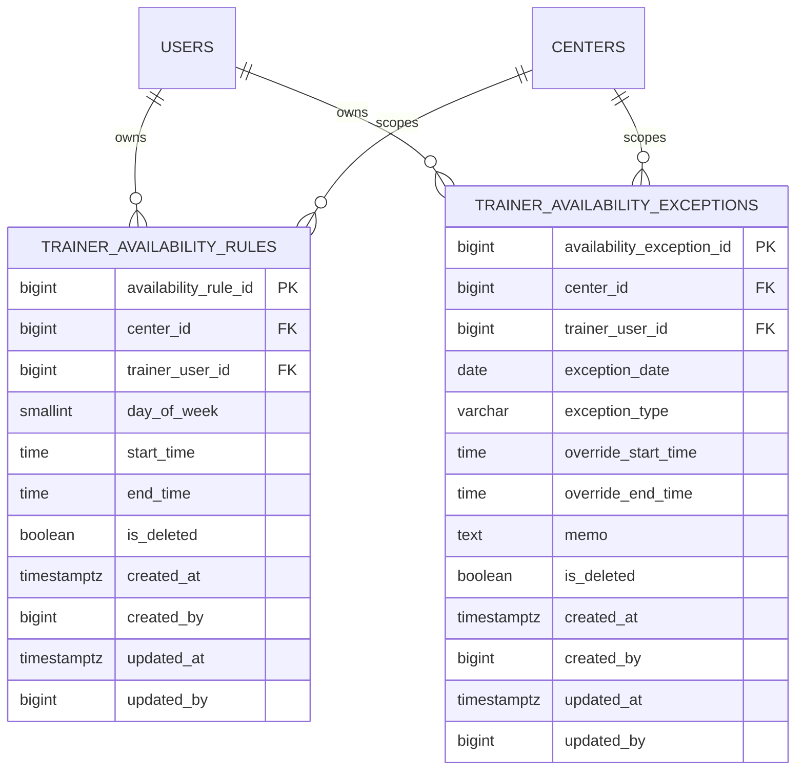

# feat: Trainer availability schedule management

## Enhancement Summary

**Deepened on:** 2026-03-27  
**Sections enhanced:** 6  
**Research sources used:** local codebase, trainer/reservation validation notes, existing frontend route and trainer UI patterns

### Key Improvements
1. Monthly calendar payload를 “raw rules + exceptions” 수준에서 한 단계 더 구체화해, backend가 `effectiveDays` 를 함께 내려주는 방향으로 보강했다.
2. Frontend state ownership을 page-scoped query + local draft state로 분리해 기존 workspace/query 패턴과 충돌하지 않도록 정리했다.
3. Admin/desk readonly 조회 surface를 기존 trainer detail에 붙이고, trainer self-service route와 읽기 전용 컴포넌트 재사용 경계를 명확히 했다.

### New Considerations Discovered
- 캘린더 UI는 backend가 effective month payload를 내려주지 않으면 예외 우선순위 merge 로직이 프런트에 중복될 가능성이 높다.
- write 권한을 trainer self-scope로 제한하더라도, audit trail과 soft-delete 기준이 없으면 이후 관리자 override 도입 시 변경 책임이 흐려진다.
- route 자체는 trainer 전용으로 두되, readonly month renderer는 trainer detail에서도 재사용 가능한 shape로 설계하는 편이 이후 유지보수에 유리하다.

## Overview

Found brainstorm from 2026-03-27: `trainer-availability-schedule-management`. Using it as the foundation for planning (see brainstorm: docs/brainstorms/2026-03-27-trainer-availability-schedule-management-brainstorm.md).

이번 기능의 목표는 트레이너가 본인 개인 가능 시간표와 휴무/예외 일정을 self-service 방식으로 관리할 수 있게 만드는 것이다. 초기 버전은 `예약 가능한 실제 슬롯 CRUD`를 트레이너에게 열지 않고, `주간 반복 가능 시간표 + 날짜별 예외` 데이터를 신설해 운영 참고와 후속 슬롯 생성 기준의 기반을 마련하는 데 집중한다 (see brainstorm: docs/brainstorms/2026-03-27-trainer-availability-schedule-management-brainstorm.md).

이 플랜은 기존 trainer/reservation/membership 권한 구조를 활용하되, 현재 예약 도메인의 `trainer_schedules` 테이블을 재사용하지 않고 별도 availability 모델을 도입하는 방향을 고정한다. 그렇게 해야 정원/예약 lifecycle과 트레이너 근무 가능 시간 관리가 섞이지 않는다.

## Problem Statement

현재 코드베이스에는 아래 상태가 이미 존재한다.

- `ROLE_TRAINER` 는 로그인/권한 모델에 포함돼 있다.
- membership에는 `assigned_trainer_id` 가 존재하고, trainer-scoped 조회/예약 정책도 일부 구현돼 있다.
- 트레이너 관리 화면은 존재하지만, 트레이너 개인 근무 가능 시간과 휴무를 기록/조회하는 별도 도메인은 없다.
- 예약 도메인의 `trainer_schedules` 는 실제 예약 슬롯과 정원 카운트를 표현하는 구조라, 개인 availability와 책임이 다르다.

이 상태에서는 운영자가 “이 트레이너가 언제 가능한지”를 시스템에서 신뢰성 있게 확인할 수 없고, 트레이너 본인도 자신의 스케줄을 self-service로 반영할 수 없다. 또한 향후 예약 슬롯 생성 정책을 availability 기준으로 연결하려고 해도 기준 데이터가 없다.

## Research Summary

### Local repo research

- Reservation slot 모델은 이미 `trainer_schedules` 로 존재하며, 실제 예약 정합성(`capacity`, `current_count`, confirmed reservation uniqueness`)에 직접 연결된다.
  - `/Users/abc/projects/GymCRM_V2/backend/src/main/resources/db/migration/V7__create_trainer_schedules_and_reservations.sql`
- Trainer 계정/조회/수정 기능은 별도 trainer 모듈로 존재한다.
  - `/Users/abc/projects/GymCRM_V2/backend/src/main/java/com/gymcrm/trainer/service/TrainerService.java`
  - `/Users/abc/projects/GymCRM_V2/frontend/src/pages/trainers/TrainersPage.tsx`
- Frontend routing은 현재 `dashboard/members/trainers/memberships/reservations/...` 구조이며, trainer 전용 self-service route는 아직 없다.
  - `/Users/abc/projects/GymCRM_V2/frontend/src/app/routes.ts`
  - `/Users/abc/projects/GymCRM_V2/frontend/src/App.tsx`
- Trainer scope validation은 이미 membership assignment와 reservation read/create 제한에서 검증된 경험이 있다.
  - `/Users/abc/projects/GymCRM_V2/docs/notes/2026-03-11-trainer-scoped-reservation-validation.md`

### Institutional learnings

- Reservation lifecycle와 actual slot data는 정합성 규칙이 강하므로, availability 개념을 여기에 그대로 섞지 않는 편이 안전하다.
  - `/Users/abc/projects/GymCRM_V2/docs/solutions/database-issues/reservation-capacity-and-usage-deduction-integrity-gymcrm-20260225.md`
- Trainer/member/reservation scope는 `assigned_trainer_id` 기준으로 이미 정리되어 있으므로, 새로운 availability read/write 권한도 같은 ownership 기준을 따라야 한다.
  - `/Users/abc/projects/GymCRM_V2/docs/notes/2026-03-23-role-storage-phase5-validation-and-rollout-log.md`

### External research decision

강한 로컬 컨텍스트와 이미 존재하는 trainer/reservation 패턴이 충분하다. 이번 기능은 외부 SaaS 연동, 보안/결제, 신기술 도입이 아니라 현재 role + scheduling domain 확장이므로 외부 리서치는 생략한다.

### Research Insights

**Architecture:**
- 기존 `trainer` 모듈 안에서 ownership을 유지하고, reservation slot 모델과는 명시적으로 분리하는 편이 현재 저장소 구조와 가장 잘 맞는다.
- admin/desk readonly 접근은 신규 관리자 route보다 기존 trainer detail 확장이 더 작은 변화로 목적을 달성한다.

**Frontend/UX:**
- 캘린더 화면은 월 기준 summary payload가 있어야 렌더링이 단순해진다.
- 페이지 전체 state를 상위 `App.tsx` 로 올리기보다, trainer schedule page 내부에서 `selectedMonth`, `selectedDate`, `draftException` 정도만 들고 가는 편이 현재 코드베이스 패턴과 맞다.

**Security/Operations:**
- 메모는 내부 운영 정보로만 취급하고, 고객-facing surface에 재사용하지 않는다는 정책을 초기부터 문서화해야 한다.
- soft-delete + created_by/updated_by audit field를 유지해야 나중에 관리자 override가 추가돼도 이력 기준을 잃지 않는다.

## Proposed Solution

### Product scope

초기 버전에서 제공할 기능:

1. 트레이너 전용 `내 스케줄` 화면 신설
2. 요일별 단일 시간 범위의 `주간 반복 가능 시간표` 등록/수정
3. 특정 날짜 단위 예외 등록
   - 하루 전체 휴무
   - 단일 시간 범위 override
   - 메모
4. 관리자/데스크의 조회 surface 제공
5. 향후 예약 슬롯 생성 기준으로 확장 가능한 데이터 구조 확보

초기 버전에서 제외할 기능:

- 트레이너가 실제 예약 슬롯(`trainer_schedules`)을 직접 생성/수정
- 한 날짜 다중 시간 구간
- 관리자/데스크가 트레이너 availability를 편집
- 자동 슬롯 생성
- 회원/고객에게 availability 직접 노출

### Key design decisions carried forward

- availability는 `트레이너 개인 가능 시간표/휴무`이며, 예약 슬롯과 다른 도메인으로 분리한다.
- 데이터 모델은 `주간 반복 규칙 + 날짜별 예외` 구조를 택한다.
- 한 날짜에는 하나의 예외만 허용한다.
- 권한은 `트레이너 본인 편집`, `관리자/데스크 조회 전용`이다.
- UI는 트레이너 전용 `내 스케줄` route를 신설하고, 관리자/데스크는 trainer detail 진입점에서 read-only로 조회한다.
- 예외 메모는 초기에는 내부 운영 메모로만 취급한다.

## Technical Approach

### Architecture

기존 `trainer` 모듈 아래에 availability 하위 feature를 추가하는 방향을 권장한다. Reservation feature와 분리해 role/ownership는 trainer 모듈에서 관리하고, 예약 도메인과는 느슨하게 연결한다.

권장 패키지/폴더 shape:

```text
backend/src/main/java/com/gymcrm/trainer/availability/
  controller/
  dto/request/
  dto/response/
  service/
  repository/
  entity/
  enums/

frontend/src/pages/trainer-availability/
  TrainerAvailabilityPage.tsx
  TrainerAvailabilityPage.test.tsx
  TrainerAvailabilityPage.module.css
  modules/
```

이 구조는 기존 mixed layout을 크게 흔들지 않으면서, 새로운 기능 경계를 분명하게 유지한다.

### Data model

새 availability 모델은 slot model과 분리한다.

#### Proposed tables

1. `trainer_availability_rules`
   - trainer별 요일 단위 기본 가용 시간
   - 한 trainer/day_of_week 당 최대 1개 row

2. `trainer_availability_exceptions`
   - trainer/date 단위 예외
   - 한 trainer/date 당 최대 1개 row
   - `OFF` 또는 `OVERRIDE`

#### Suggested schema



#### Constraints

- `trainer_availability_rules`
  - unique `(center_id, trainer_user_id, day_of_week)` active row
  - `end_time > start_time`
  - `day_of_week in 1..7` 또는 repo 표준 enum 사용
- `trainer_availability_exceptions`
  - unique `(center_id, trainer_user_id, exception_date)` active row
  - `exception_type in ('OFF', 'OVERRIDE')`
  - `OFF` 이면 override time null
  - `OVERRIDE` 이면 `override_start_time`, `override_end_time` required and `end > start`

### API surface

초기 버전은 self-service write와 readonly query를 분리한다.

#### Trainer self-service

- `GET /api/v1/trainers/me/availability?month=YYYY-MM`
  - 현재 월 기준 기본 주간 규칙 + 해당 월 예외 목록 반환
- `PUT /api/v1/trainers/me/availability/weekly`
  - 주간 규칙 전체 교체 또는 저장
- `PUT /api/v1/trainers/me/availability/exceptions/{date}`
  - 특정 날짜 예외 upsert
- `DELETE /api/v1/trainers/me/availability/exceptions/{date}`
  - 기본 시간표 따름으로 복귀

#### Admin/desk readonly

- `GET /api/v1/trainers/{trainerUserId}/availability?month=YYYY-MM`
  - trainer detail에서 read-only 조회

DTO는 Java `record`로 만들고, response는 `ApiResponse` envelope를 유지한다.

### Research Insights

**Best Practices:**
- calendar UI용 API는 프런트가 월별 셀 계산을 최소화할 수 있도록 `month`, `weeklyRules`, `exceptions` 외에 `effectiveDays` 같은 derived summary를 함께 제공하는 편이 안정적이다.
- weekly rules write는 patch accumulation보다 “replace all”이 race와 orphan row를 줄인다.

**Implementation Details:**
```json
{
  "month": "2026-04",
  "weeklyRules": [],
  "exceptions": [],
  "effectiveDays": [
    {
      "date": "2026-04-07",
      "source": "EXCEPTION_OFF",
      "isAvailable": false,
      "startTime": null,
      "endTime": null,
      "memo": "세미나"
    }
  ]
}
```

**Edge Cases:**
- month query 범위를 벗어난 exception은 응답에 섞이지 않아야 한다.
- weekly rule이 없는 요일은 “비가용”으로 해석할지, “미설정”으로 해석할지 UI copy에서 구분해야 한다.
- trainer inactive 상태에서 self-service write를 막을지 여부를 service 규칙으로 고정해야 한다.

### Frontend shape

#### New route

- route key 예시: `trainer-availability`
- path 예시: `/my-availability`
- label: `내 스케줄`
- visible/allowed roles: `ROLE_TRAINER`

#### Readonly access for admin/desk

- 기존 `[TrainersPage.tsx](/Users/abc/projects/GymCRM_V2/frontend/src/pages/trainers/TrainersPage.tsx)` 상세 뷰에서 “스케줄 보기” 또는 별도 section으로 read-only availability 조회
- 초기에는 별도 sidebar route를 관리자/데스크에 노출하지 않음

#### Page structure

- 상단: 요일별 기본 시간표 편집
- 메인: 월간 캘린더
- 날짜 선택 시: 예외 편집 모달/패널
- 하단 또는 우측: 월별 예외 목록

### Research Insights

**State Ownership:**
- query state: `selectedMonth` 기준 availability fetch 결과
- local UI state: `selectedDate`, exception modal open, draft form
- save 성공 후에는 query invalidation으로 month payload 재조회

**Performance Considerations:**
- month payload는 해당 월만 요청하고, month navigation을 query key에 반영한다.
- calendar cell 렌더링은 `effectiveDays` 기준 flat map을 받아 계산을 단순화한다.
- 동일 renderer를 trainer self-service와 admin readonly detail에서 재사용할 수 있게 “read-only calendar section” 컴포넌트를 분리하는 편이 좋다.

**UX Notes:**
- 예외가 없는 날짜는 기본 규칙을 따르는지, 비가용인지 셀 상태와 legend로 분명히 보여줘야 한다.
- “휴무”, “시간 변경”, “기본 따름” 전환은 destructive action으로 느껴질 수 있으므로 선택 상태를 명확히 보여줘야 한다.

### Permission rules

- trainer actor:
  - 자기 `trainer_user_id == currentUserId` 만 read/write 가능
- desk/admin actor:
  - center scope 내 trainer availability read 가능
  - write 불가
- super admin:
  - 현재 프로젝트 규칙상 필요 시 center 지정 read만 허용할지 검토
  - 초기 구현은 trainer 관리와 동일한 center resolution 규칙을 따름

### Research Insights

**Security Considerations:**
- trainer self-service endpoint는 path parameter 기반 trainer id를 받지 않는 `me` surface가 더 안전하다.
- admin/desk readonly endpoint는 trainer detail과 동일한 center resolution 규칙을 재사용해야 한다.
- memo는 internal-only 운영 메모로 취급하고, member/reservation/customer 응답에는 포함하지 않는다는 계약을 명시해야 한다.

## Alternative Approaches Considered

### 1. Reuse `trainer_schedules`

기존 reservation slot table을 trainer availability source로 재사용하는 안이다.

**Rejected because:**
- slot capacity/current_count/reservations lifecycle와 availability 의미가 다르다
- self-service edit가 reservation integrity를 직접 건드리게 된다
- 브레인스토밍에서 피해야 할 범위 확장으로 분류됐다 (see brainstorm: docs/brainstorms/2026-03-27-trainer-availability-schedule-management-brainstorm.md)

### 2. Date-only manual schedule entry

매일 날짜별로만 availability를 입력하는 안이다.

**Rejected because:**
- 반복 패턴 운영 비용이 너무 크다
- 실제 현장 리듬과 맞지 않는다

### 3. Multi-segment daily exceptions from day one

하루 안에 여러 시간 구간을 허용하는 안이다.

**Rejected because:**
- 초기 UI/검증/정합성 복잡도가 급증한다
- YAGNI 위반 가능성이 높다

## System-Wide Impact

### Interaction Graph

- Trainer edits weekly availability
  - route access check
  - auth actor resolution
  - trainer self-scope validation
  - availability rule replacement/upsert
  - month query refresh
- Admin/desk views trainer availability
  - trainer detail or readonly query
  - center-scope validation
  - aggregate response combining weekly rules + monthly exceptions

중요한 점은 이 기능이 현재 예약 생성/정원 카운트 callback chain을 직접 트리거하지 않아야 한다는 것이다. availability write는 reservation write path와 분리돼야 한다.

### Error & Failure Propagation

- validation errors:
  - invalid day_of_week
  - invalid month format
  - invalid exception type
  - missing override times
  - `end_time <= start_time`
- access errors:
  - trainer editing someone else’s schedule
  - desk/admin trying to write
  - cross-center read/write
- persistence conflicts:
  - duplicate rule per weekday
  - duplicate exception per date

이 오류들은 `ApiException + ErrorCode` 로 매핑하고, 프론트는 detail을 그대로 노출할 수 있게 reservation page에서 했던 패턴을 재사용하는 것이 좋다.

### State Lifecycle Risks

- 주간 규칙 전체 저장 시 일부 row만 반영되고 나머지가 실패하면 고아 상태가 생길 수 있다.
  - 해결: “replace weekly rules”는 단일 transaction으로 묶는다.
- 특정 날짜 예외 upsert 중 unique conflict가 나면 중복 row가 생길 수 있다.
  - 해결: unique index + upsert semantics 고정
- readonly month view가 weekly rule과 exception merge를 잘못하면 캘린더 표시와 실제 저장 상태가 어긋날 수 있다.
  - 해결: backend에서 effective month payload를 만들어 프론트 merge 로직을 최소화

### Research Insights

**Failure Handling:**
- weekly rules replace 전에 기존 row soft-delete/update strategy를 명확히 고정해야 중복 unique conflict와 audit drift를 피할 수 있다.
- exception upsert는 “insert or update current row” semantics로 고정하고, delete는 hard delete보다 soft delete가 감사 추적에 유리하다.

**Operational Guardrails:**
- month query에 없는 날짜를 수정하려는 경우에도 API는 해당 `exception_date` 만 검증하면 되므로, 조회 범위와 쓰기 범위를 혼동하지 않도록 endpoint semantics를 분리해야 한다.

### API Surface Parity

비슷한 ownership surface:

- trainer detail read
- membership assigned trainer validations
- reservation trainer scope validations

availability도 이들과 같은 ownership 기준(`center + trainer_user_id`)을 써야 한다. 새로운 “trainer identity” 개념을 따로 만들면 안 된다.

### Integration Test Scenarios

1. trainer actor가 자기 weekly rule을 저장하고, 같은 month query에서 바로 반영된다.
2. trainer actor가 다른 trainer availability에 write 시 `403 ACCESS_DENIED` 를 받는다.
3. desk/admin actor가 trainer availability를 read는 할 수 있지만 write는 못 한다.
4. exception `OFF` / `OVERRIDE` 저장 후 month query가 weekly rule보다 exception을 우선 반영한다.
5. soft-deleted/inactive trainer에 대한 availability read/write가 기대한 권한/존재 규칙을 따른다.
6. month navigation이 바뀌어도 이전 month의 stale payload가 캘린더 셀에 남지 않는다.
7. readonly trainer detail surface와 self-service page가 같은 effective day semantics를 사용한다.

## Implementation Phases

### Phase 1: Backend foundation

- Flyway migration 추가
  - `trainer_availability_rules`
  - `trainer_availability_exceptions`
  - indexes and constraints
- trainer availability entity/repository/domain 추가
- enum/DTO/request/response 정의

**Files to expect**
- `backend/src/main/resources/db/migration/V*_create_trainer_availability.sql`
- `backend/src/main/java/com/gymcrm/trainer/availability/...`

### Phase 2: Backend service + APIs

- service layer 권한 정책 구현
- self-service endpoints 구현
- admin/desk readonly endpoint 구현
- month payload shape 고정

**Suggested payload shape**

```json
{
  "trainerUserId": 41,
  "month": "2026-04",
  "weeklyRules": [
    { "dayOfWeek": 1, "startTime": "09:00", "endTime": "18:00" }
  ],
  "exceptions": [
    {
      "date": "2026-04-07",
      "exceptionType": "OFF",
      "overrideStartTime": null,
      "overrideEndTime": null,
      "memo": "세미나"
    }
  ],
  "effectiveDays": [
    {
      "date": "2026-04-07",
      "source": "EXCEPTION_OFF",
      "isAvailable": false,
      "startTime": null,
      "endTime": null,
      "memo": "세미나"
    }
  ]
}
```

### Phase 3: Frontend trainer self-service page

- `/my-availability` route 추가
- trainer-only sidebar exposure
- page shell + weekly editor + calendar + exception modal
- save/reset/loading/error states
- read-only month calendar section을 별도 컴포넌트로 분리해 trainer detail에서도 재사용 가능하게 설계

### Phase 4: Admin/desk readonly integration

- trainers detail surface에 availability 조회 연결
- read-only rendering
- trainer-only edit affordance와 분리
- trainer detail page에서 현재 already-loaded trainer identity를 재사용하고, 별도 관리자 sidebar route는 추가하지 않음

### Phase 5: Validation and polish

- backend integration tests
- frontend page/tests
- role-based route/access tests
- month navigation and timezone checks

## SpecFlow Analysis

Spec-style gap analysis를 반영해 아래를 acceptance criteria에 포함한다.

- 한 날짜의 예외가 기본 주간 규칙보다 우선한다.
- override date에서 only one config rule이 보장된다.
- 메모는 내부 운영 메모로만 취급되고, 예약/회원/customer surface에 전파되지 않는다.
- 해당 trainer의 center scope 밖에서는 조회/편집할 수 없다.
- inactive trainer 처리 정책은 trainer detail read policy와 일관되어야 한다.
- month query는 `effectiveDays` 또는 동등한 derived payload를 포함해 프런트 재계산에 의존하지 않는다.

## Acceptance Criteria

### Functional requirements

- [ ] `ROLE_TRAINER` 사용자는 `내 스케줄` 화면에 접근할 수 있다.
- [ ] 트레이너는 요일별 단일 시간 범위의 기본 주간 가능 시간표를 저장할 수 있다.
- [ ] 트레이너는 특정 날짜를 `하루 휴무` 또는 `단일 시간 범위 override + 메모`로 저장할 수 있다.
- [ ] 특정 날짜 예외 삭제 시 해당 날짜는 다시 기본 주간 시간표를 따른다.
- [ ] 한 trainer/date 에는 하나의 예외만 저장된다.
- [ ] 관리자/데스크는 트레이너 availability를 조회할 수 있다.
- [ ] 관리자/데스크는 초기 버전에서 트레이너 availability를 수정할 수 없다.
- [ ] month query 응답은 기본 주간 규칙, 날짜별 예외, 그리고 캘린더 렌더에 충분한 effective month payload를 제공한다.

### Non-functional requirements

- [ ] 모든 시간 해석은 `Asia/Seoul` business context와 일관된다.
- [ ] reservation `trainer_schedules` 와 availability model이 혼용되지 않는다.
- [ ] validation/authorization failures는 일관된 `ApiException` response를 사용한다.
- [ ] write/delete 모두 audit field(`created_by`, `updated_by`)가 actor 기준으로 유지된다.
- [ ] 예외 메모는 internal-only field로 취급되고 다른 업무/customer surface로 전파되지 않는다.

### Quality gates

- [ ] backend integration tests가 self-write, cross-scope denial, readonly access, exception precedence를 검증한다.
- [ ] frontend tests가 trainer route gating, save flow, exception UI state를 검증한다.
- [ ] 관리자/데스크 readonly surface와 trainer self-service surface가 역할별로 분리돼 있다.
- [ ] month navigation/query invalidation이 기존 query 패턴과 충돌하지 않는다.

## Success Metrics

- 트레이너가 별도 운영 개입 없이 본인 스케줄/휴무를 갱신할 수 있다.
- 관리자/데스크가 트레이너 availability를 시스템에서 조회할 수 있다.
- 초기 운영에서 “트레이너 가능 시간 확인”을 수기/메신저에 의존하는 빈도가 줄어든다.
- 이후 계획에서 예약 슬롯 생성 기준을 availability로 연결할 때 schema 재설계가 필요하지 않다.

## Dependencies & Risks

### Dependencies

- existing trainer role/auth model
- existing trainer management read surface
- routing/sidebar role visibility
- new Flyway migration

### Risks

- `trainer_schedules` 와 availability를 혼동하는 naming
- calendar UI 구현 난이도
- monthly effective payload merge complexity
- role rules 불일치로 인한 trainer/admin read/write 회귀

### Mitigation

- 명확한 table/entity naming 사용
- backend에서 month payload를 완성해 프론트 계산 최소화
- role integration tests 추가
- 초기 버전에서 multi-segment exception 제외

## Resource Requirements

- Backend: migration + new trainer availability module
- Frontend: new trainer schedule page + trainer detail readonly block
- QA: trainer/admin/desk role smoke + month/exception cases

## Future Considerations

- multi-segment daily availability
- admin override editing
- availability 기반 예약 슬롯 자동 생성
- availability vs actual slot drift detection
- member-facing available schedule exposure

## Documentation Plan

- plan completion 후 validation note 작성
- trainer availability 운영 규칙 문서화
- 필요 시 architecture doc에 new entities 추가

## Sources & References

### Origin

- **Brainstorm document:** [2026-03-27-trainer-availability-schedule-management-brainstorm.md](/Users/abc/projects/GymCRM_V2/docs/brainstorms/2026-03-27-trainer-availability-schedule-management-brainstorm.md)
  - carried-forward decisions:
    - separate availability from reservation slots
    - weekly rules + date exceptions
    - trainer edits, admin/desk readonly

### Internal references

- Reservation slot schema: [V7__create_trainer_schedules_and_reservations.sql](/Users/abc/projects/GymCRM_V2/backend/src/main/resources/db/migration/V7__create_trainer_schedules_and_reservations.sql)
- Trainer service patterns: [TrainerService.java](/Users/abc/projects/GymCRM_V2/backend/src/main/java/com/gymcrm/trainer/service/TrainerService.java)
- Trainer management UI patterns: [TrainersPage.tsx](/Users/abc/projects/GymCRM_V2/frontend/src/pages/trainers/TrainersPage.tsx)
- App route shell: [routes.ts](/Users/abc/projects/GymCRM_V2/frontend/src/app/routes.ts)
- Trainer-scoped reservation validation: [2026-03-11-trainer-scoped-reservation-validation.md](/Users/abc/projects/GymCRM_V2/docs/notes/2026-03-11-trainer-scoped-reservation-validation.md)
- Membership assignment model: [MemberMembershipEntity.java](/Users/abc/projects/GymCRM_V2/backend/src/main/java/com/gymcrm/membership/entity/MemberMembershipEntity.java)

### Related work

- Existing trainer-scoped reservation plan: [2026-03-10-feat-trainer-scoped-reservation-management-plan.md](/Users/abc/projects/GymCRM_V2/docs/plans/2026-03-10-feat-trainer-scoped-reservation-management-plan.md)
