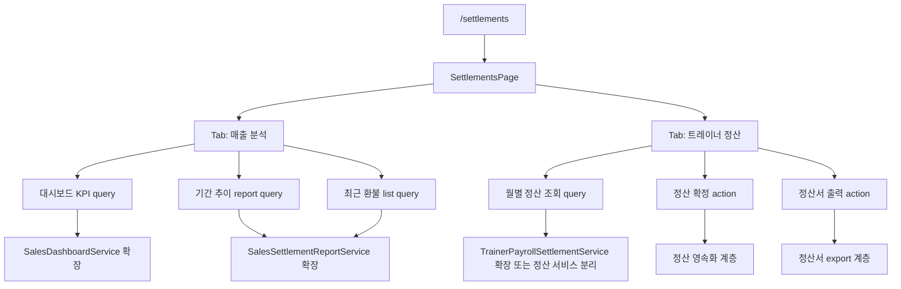

# feat: 정산 모듈 매출 분석 탭 및 트레이너 정산 탭 확장

## Overview

`/settlements`를 단일 정산 진입점으로 유지하면서, 1차에서는 운영 상황판형 `매출 분석` 탭을 완성하고,
2차에서는 `트레이너 정산` 탭을 조회-확정-정산서 출력까지 이어지는 업무 흐름으로 확장한다.
현재 일부 존재하는 정산 집계 API와 단일 리포트 화면을 재활용하되, 요구사항 문서가 정의한 정보 구조와 운영 목적에 맞게
백엔드 집계 범위, 프론트 레이아웃, 테스트 범위를 재정렬하는 것이 핵심이다.

## Problem Frame

현재 `frontend/src/pages/settlements/SettlementsPage.tsx`는 정산 리포트 중심의 단일 화면이며, 운영자가 `/settlements`
진입 직후 오늘과 이번 달 상태를 한눈에 읽기 어렵다. 백엔드에는 `SalesDashboardService`,
`SalesSettlementReportService`, `TrainerPayrollSettlementService`가 각각 존재하지만, 프론트에서는 `sales-report`
조회만 사용 중이라 실제 사용자 경험과 구현 자산이 분리되어 있다.

이번 플랜은 브레인스토밍 문서에서 확정한 요구사항을 기준으로,
- 1차: 운영 상황 읽기 + 기간 추이 확인 + 최근 환불 확인
- 2차: 트레이너 정산 조회 + 확정 + 정산서 출력
으로 분리해 구현 가능한 단위로 쪼개는 데 목적이 있다.

(see origin: docs/brainstorms/2026-04-03-settlements-analytics-and-trainer-payroll-requirements.md)

## Requirements Trace

- R1-R4. `/settlements` 단일 진입점 유지, `매출 분석`/`트레이너 정산` 탭 구조 도입
- R5-R13. 1차 매출 분석 탭: 상단 운영 상황판, 하단 기간 추이, 최신순 환불 목록
- R14-R18. 2차 트레이너 정산 탭: 월별 조회, 확정, 정산서 출력

## Scope Boundaries

- 1차 구현 우선순위는 `매출 분석` 탭 완성이다.
- 2차 트레이너 정산 탭은 같은 계획 안에 포함하지만, 1차 완료 이후 이어지는 후속 구현 단위로 둔다.
- 급여 정책 자체의 사업 규칙 재정의는 이번 플랜에 포함하지 않는다.
- 외부 ERP/세무 연동, 일일 마감 정산, 결제 취소 시각 기반 심화 분석, 심화 환불 분석 화면은 이번 범위에서 제외한다.

## Context & Research

### Relevant Code and Patterns

- `backend/src/main/java/com/gymcrm/settlement/controller/SalesDashboardController.java`
  - 오늘/이번 달 순매출, 신규 회원수, 만료 예정 회원수 집계 API가 이미 존재한다.
- `backend/src/main/java/com/gymcrm/settlement/controller/SalesSettlementReportController.java`
  - 기간 기반 매출/환불/순매출 집계 및 CSV export API가 존재한다.
- `backend/src/main/java/com/gymcrm/settlement/controller/TrainerPayrollSettlementController.java`
  - 월별 트레이너 수업 수와 급여 계산 API가 존재한다.
- `backend/src/main/java/com/gymcrm/settlement/repository/SalesDashboardRepository.java`
  - 숫자 카드형 요약 집계를 위한 단일 aggregate query 패턴이 이미 있다.
- `backend/src/main/java/com/gymcrm/settlement/repository/SalesSettlementReportRepository.java`
  - `JdbcClient`로 기간/결제수단/상품 키워드 필터를 조합하는 리포트 패턴이 있다.
- `frontend/src/pages/settlements/SettlementsPage.tsx`
  - 현재 정산 리포트 레이아웃과 Ant Design 카드/필터/테이블 패턴의 기준점이다.
- `frontend/src/pages/settlements/modules/useSettlementReportQuery.ts`
  - React Query 기반 정산 조회 패턴이 이미 있다.
- `frontend/src/api/mockData.ts`
  - 현재 mock mode는 `/api/v1/settlements/sales-report`만 대응하므로 신규 탭과 신규 카드에 맞는 mock 응답 확장이 필요하다.

### Institutional Learnings

- 별도 `docs/solutions/` 문서에서 직접 재사용할 학습 기록은 이번 범위에서 확인되지 않았다.
- 기존 계획서 패턴상, 프론트 재구성은 페이지 단의 상태 관리 훅과 쿼리 훅을 분리하고 테스트 파일을 기능 단위로 붙이는 방식이 일관적이다.

### External References

- 없음. 현재 코드베이스에 필요한 API/페이지 패턴이 이미 존재하므로 로컬 패턴 우선으로 계획한다.

## Key Technical Decisions

- `/settlements`를 유지한 탭 분리
  - 별도 라우트 신설 대신 동일 라우트 내부의 탭 구조로 나누어 정보 구조를 단순하게 유지한다.
- 탭 상태는 페이지 내부 UI 상태로 관리
  - 현재 앱 라우팅 구조상 `/settlements`를 유지하는 편이 자연스럽고, 탭 전환 자체는 URL 분기 없이 페이지 내부 상태로 충분하다.
- 매출 분석 탭은 상단 판단, 하단 검증 구조
  - 상단은 `KPI 카드 + 미니 추이 차트`로 현재 상태와 방향성을 읽게 하고, 하단은 `기간 추이 리포트 -> 최근 환불 목록` 순서로 상세 검증 흐름을 만든다.
- 1차는 기존 집계 서비스 확장 우선
  - `SalesDashboardService`와 `SalesSettlementReportService`를 확장해 신규 대시보드 카드와 기간 추이를 맞추고, 프론트는 해당 결과를 소비하도록 재구성한다.
- 환불은 전용 분석 도구가 아니라 최신 이슈 확인용 목록으로 제한
  - 범위를 제어하면서도 운영자의 원인 추적 니즈를 충족한다.
- 트레이너 정산은 조회 API 위에 저장/확정/출력 흐름을 추가
  - 현재 계산 전용 API를 완결 업무 흐름으로 끌어올리기 위해 별도 정산 도메인 영속성과 출력 계층이 필요해진다.
- 트레이너 정산 탭은 월 단위 일괄 액션 중심
  - 2차 탭 구조는 `상단 필터 + 하단 결과 테이블`로 단순하게 유지하고, 확정/출력은 테이블 상단의 월 단위 일괄 액션으로 제공한다.

## Open Questions

### Resolved During Planning

- `매출 분석`과 `트레이너 정산`의 정보 구조는 어떻게 나눌 것인가?
  - `/settlements` 단일 진입점을 유지하고 페이지 내부 탭으로 분리한다.
- 1차 매출 분석 탭의 메인 영역은 무엇인가?
- 상단 운영 상황판, 하단 기간 추이 및 최신 환불 목록 구조로 간다.
- 환불은 1차에서 어디까지 포함할 것인가?
  - 최신순의 간단한 상세 목록까지 포함하고, 결제 취소 시각 기반 분석은 이후 단계로 미루며 심화 분석 경험은 제외한다.
- 매출 분석 탭의 상단 표현 밀도는 어떻게 가져갈 것인가?
  - KPI 카드만 두지 않고, 최근 흐름의 상승/하락을 읽게 하는 미니 추이 차트를 함께 둔다.
- 트레이너 정산 탭의 기본 액션 구조는 무엇인가?
  - 행 단위 액션보다 월 단위 일괄 확정/출력 액션을 우선 구조로 둔다.

### Deferred to Implementation

- `SalesDashboardController` 응답에 환불 건수까지 포함할지, 별도 요약 endpoint를 둘지
  - 실제 코드 변경 범위를 보고 가장 적은 diff로 판단하는 것이 안전하다.
- 기간 추이 응답을 기존 `sales-report`에 확장할지, 별도 trend endpoint를 만들지
  - 프론트 시각화 요구와 기존 CSV export 계약 충돌 여부를 구현 시점에 확인해야 한다.
- 트레이너 정산 확정 상태와 정산서 출력용 영속 모델을 기존 API 문서에 맞출지, 문서를 먼저 개정할지
  - `docs/04_API_설계서.md`와 현 코드가 이미 어긋나 있어 구현 직전에 계약 정렬 결정을 내려야 한다.
- 정산서 출력 포맷을 PDF 단일로 볼지, CSV/PDF 병행으로 갈지
  - 출력 품질과 구현 비용을 실제 요구에 맞춰 구현 단계에서 최종 확정한다.

## High-Level Technical Design

> *This illustrates the intended approach and is directional guidance for review, not implementation specification. The implementing agent should treat it as context, not code to reproduce.*



## Implementation Units

- [x] **Unit 1: `/settlements` 페이지 구조를 탭 기반으로 재구성**

**Goal:** 기존 단일 리포트 화면을 `매출 분석`과 `트레이너 정산` 탭 구조로 재구성해 정보 구조를 요구사항에 맞춘다.

**Requirements:** R1-R5, R18

**Dependencies:** 없음

**Files:**
- Modify: `frontend/src/pages/settlements/SettlementsPage.tsx`
- Modify: `frontend/src/pages/settlements/SettlementsPage.module.css`
- Modify: `frontend/src/pages/settlements/SettlementsPage.test.tsx`
- Create: `frontend/src/pages/settlements/modules/settlementTabs.ts`
- Test: `frontend/src/pages/settlements/modules/settlementTabs.test.ts`

**Approach:**
- 현재 페이지를 리포트 단일 레이아웃에서 탭 컨테이너로 바꾼다.
- 기본 탭은 `매출 분석`으로 고정하고, 추후 URL 파라미터 연동 없이도 테스트 가능한 순수 탭 정의 모듈을 둔다.
- 현재 리포트 관련 로컬 상태는 `매출 분석` 탭 쪽으로 밀어넣고, 트레이너 정산용 상태는 별도 모듈로 분리할 준비를 한다.
- `매출 분석` 탭은 상단에 대시보드/KPI와 미니 추이 요약을, 하단에 `기간 추이 리포트 -> 최근 환불 목록` 순서를 강제하는 구조로 잡는다.
- `트레이너 정산` 탭은 상단 필터, 하단 결과 테이블, 테이블 상단 일괄 액션 배치가 가능한 골격을 먼저 만든다.
- 사이드바 라벨은 당장 바꾸지 않더라도 계획상 문구 정렬 필요성을 별도 체크한다.

**Patterns to follow:**
- `frontend/src/pages/settlements/modules/useSettlementPrototypeState.ts`
- `frontend/src/pages/Dashboard.tsx`의 상단 요약 + 하단 상세 레이아웃 패턴

**Test scenarios:**
- Happy path: `/settlements` 진입 시 `매출 분석` 탭이 기본 선택되어 보인다.
- Happy path: 탭 전환 시 `트레이너 정산` 영역이 렌더링되고 기존 리포트 영역은 숨겨진다.
- Edge case: 초기 데이터가 없어도 탭 구조와 빈 상태 안내는 정상 표시된다.
- Integration: 기존 정산 페이지 테스트가 탭 구조 변경 이후에도 기본 리포트 진입 플로우를 검증한다.

**Verification:**
- 페이지 진입 시 기본 탭이 `매출 분석`으로 보이고, 탭 전환만으로 각 영역이 독립 렌더링된다.

- [x] **Unit 2: 매출 분석 탭의 운영 상황판 KPI 백엔드/프론트 연결**

**Goal:** 상단 운영 상황판에서 오늘/이번 달 상태를 한눈에 볼 수 있도록 기존 대시보드 집계 API를 확장하고 프론트에 연결한다.

**Requirements:** R5-R7

**Dependencies:** Unit 1

**Files:**
- Modify: `backend/src/main/java/com/gymcrm/settlement/controller/SalesDashboardController.java`
- Modify: `backend/src/main/java/com/gymcrm/settlement/service/SalesDashboardService.java`
- Modify: `backend/src/main/java/com/gymcrm/settlement/repository/SalesDashboardRepository.java`
- Modify: `backend/src/test/java/com/gymcrm/settlement/SalesDashboardServiceTest.java`
- Modify: `backend/src/test/java/com/gymcrm/settlement/SalesDashboardServiceIntegrationTest.java`
- Create: `frontend/src/pages/settlements/modules/useSalesDashboardQuery.ts`
- Create: `frontend/src/pages/settlements/modules/useSalesDashboardQuery.test.tsx`
- Modify: `frontend/src/pages/settlements/modules/types.ts`
- Modify: `frontend/src/pages/settlements/SettlementsPage.tsx`
- Modify: `frontend/src/api/mockData.ts`

**Approach:**
- 현재 API가 제공하는 `todayNetSales`, `monthNetSales`, `newMemberCount`, `expiringMemberCount`를 그대로 활용하고, 요구사항에 맞는 `refundCount` 또는 동등 신호를 추가한다.
- 프론트 상단 KPI 카드는 기존 리포트 summary 대신 대시보드 query 결과를 기준으로 재구성한다.
- KPI 카드 바로 아래에는 최근 상승/하락 방향을 읽을 수 있는 짧은 미니 추이 차트 블록을 둔다.
- 미니 추이 블록은 상세 리포트를 대체하지 않고, 상단에서 빠른 방향성 판단만 지원하도록 밀도를 제한한다.
- mock mode도 같은 계약을 따르도록 `/api/v1/settlements/sales-dashboard` mock 응답을 추가한다.
- 대시보드와 리포트의 책임을 분리해, 카드 값은 리포트 rows 합계에 의존하지 않게 한다.

**Patterns to follow:**
- `backend/src/main/java/com/gymcrm/settlement/service/SalesDashboardService.java`
- `frontend/src/pages/settlements/modules/useSettlementReportQuery.ts`

**Test scenarios:**
- Happy path: baseDate 기준 오늘 순매출, 이번 달 순매출, 신규 회원수, 만료 예정 회원수가 올바르게 반환된다.
- Happy path: 환불이 존재하는 날에는 환불 건수 신호가 같이 반환된다.
- Happy path: 프론트 상단에서 KPI 카드와 미니 추이 블록이 함께 렌더링된다.
- Edge case: 기간 내 결제가 없어도 모든 카드 값이 `0` 기반으로 안전하게 반환된다.
- Error path: `expiringWithinDays` 범위를 벗어나면 validation error가 반환된다.
- Integration: 프론트에서 query 성공 시 KPI 카드 5종이 렌더링된다.
- Integration: mock mode에서 `/settlements` 진입 시 KPI 카드가 네트워크 없이 표시된다.

**Verification:**
- 백엔드 테스트가 카드 집계 계약을 보장하고, 프론트에서 KPI 카드가 리포트 테이블과 독립적으로 정상 렌더링된다.

- [x] **Unit 3: 기간별 매출 추이 리포트 계약 확장**

**Goal:** 기존 범위형 매출 리포트를 `일/주/월/연` 추이 분석이 가능한 계약으로 확장한다.

**Requirements:** R8-R10

**Dependencies:** Unit 1

**Files:**
- Modify: `backend/src/main/java/com/gymcrm/settlement/controller/SalesSettlementReportController.java`
- Modify: `backend/src/main/java/com/gymcrm/settlement/service/SalesSettlementReportService.java`
- Modify: `backend/src/main/java/com/gymcrm/settlement/repository/SalesSettlementReportRepository.java`
- Modify: `backend/src/test/java/com/gymcrm/settlement/SalesSettlementReportServiceTest.java`
- Modify: `backend/src/test/java/com/gymcrm/settlement/SalesSettlementReportServiceIntegrationTest.java`
- Modify: `backend/src/main/java/com/gymcrm/settlement/SalesSettlementCsvExporter.java`
- Modify: `frontend/src/pages/settlements/modules/types.ts`
- Modify: `frontend/src/pages/settlements/modules/useSettlementReportQuery.ts`
- Modify: `frontend/src/pages/settlements/modules/useSettlementReportQuery.test.tsx`
- Modify: `frontend/src/pages/settlements/SettlementsPage.tsx`
- Modify: `frontend/src/api/mockData.ts`

**Approach:**
- 현재 product/payment method row 집계를 유지하면서도, 상단 또는 별도 section에서 사용할 추이용 time-bucket 결과를 함께 내려주도록 응답을 확장한다.
- 집계 단위는 request-level 파라미터로 제어하고, 프론트는 이를 일/주/월/연 선택 UI에 연결한다.
- 기존 CSV export가 깨지지 않도록, 추이 데이터가 추가되더라도 CSV는 명시적으로 어떤 section을 export하는지 정리한다.
- 추이 리포트는 1차에서는 운영자 해석이 쉬운 숫자/간단 차트 중심으로 두고, 무거운 분석 BI 화면으로 확장하지 않는다.
- 하단 상세 영역에서 추이 리포트가 최근 환불 목록보다 먼저 렌더링되도록 우선순위를 고정한다.

**Patterns to follow:**
- `backend/src/main/java/com/gymcrm/settlement/repository/SalesSettlementReportRepository.java`의 동적 SQL 빌드
- `frontend/src/pages/settlements/modules/useSettlementReportQuery.ts`의 URLSearchParams 구성

**Test scenarios:**
- Happy path: `DAILY` 단위 조회 시 날짜별 추이 row가 올바른 순서로 반환된다.
- Happy path: `WEEKLY`, `MONTHLY`, `YEARLY` 단위 조회가 각각 bucket 기준으로 집계된다.
- Edge case: 조회 기간이 짧아 특정 bucket 하나만 존재해도 응답 형식은 유지된다.
- Edge case: 데이터가 없는 bucket은 정책에 따라 `0` bucket 또는 빈 목록으로 일관되게 처리된다.
- Error path: 지원하지 않는 집계 단위 요청은 validation error를 반환한다.
- Integration: 프론트 단위 선택 변경 시 서로 다른 query key가 사용되고, 표시된 추이 결과가 바뀐다.
- Integration: 기존 product/payment method 집계 테이블은 확장 후에도 계속 표시된다.

**Verification:**
- 리포트 API가 일/주/월/연 추이를 모두 지원하고, 프론트가 해당 단위를 선택해 결과를 해석 가능하게 보여준다.

- [x] **Unit 4: 최근 환불 목록 추가**

**Goal:** 운영자가 숫자 변화의 원인을 바로 확인할 수 있도록 매출 분석 탭에 최신 환불 목록을 추가한다.

**Requirements:** R11-R13

**Dependencies:** Unit 1, Unit 2

**Files:**
- Modify: `backend/src/main/java/com/gymcrm/settlement/controller/SalesSettlementReportController.java`
- Modify: `backend/src/main/java/com/gymcrm/settlement/service/SalesSettlementReportService.java`
- Modify: `backend/src/main/java/com/gymcrm/settlement/repository/SalesSettlementReportRepository.java`
- Modify: `backend/src/test/java/com/gymcrm/settlement/SalesSettlementReportServiceIntegrationTest.java`
- Create: `frontend/src/pages/settlements/modules/useSettlementRecentAdjustmentsQuery.ts`
- Create: `frontend/src/pages/settlements/modules/useSettlementRecentAdjustmentsQuery.test.tsx`
- Modify: `frontend/src/pages/settlements/modules/types.ts`
- Modify: `frontend/src/pages/settlements/SettlementsPage.tsx`
- Modify: `frontend/src/api/mockData.ts`

**Approach:**
- 리포트 응답에 억지로 목록을 섞기보다, 최근 환불 목록은 전용 query 또는 report response subresource로 분리하는 편이 프론트 사용성이 좋다.
- 목록은 최신순 기본 정렬, 제한 개수 중심으로 제공하고, 표시 컬럼은 운영 검토에 꼭 필요한 최소 항목으로 제한한다.
- Phase 1은 `payment_type='REFUND'` 기반 환불 내역만 다루고, 별도 취소 시각/이력 모델이 생긴 뒤 결제 취소 분석을 확장한다.

**Patterns to follow:**
- `frontend/src/pages/access/AccessPage.tsx`와 유사한 "요약 + 최근 이벤트 테이블" 배치 감각
- 기존 settlement query hook naming 패턴

**Test scenarios:**
- Happy path: 최근 환불 레코드가 있을 때 최신 paidAt 순으로 목록이 반환된다.
- Edge case: 최근 조정 내역이 없으면 빈 상태 메시지가 표시된다.
- Edge case: 동일 시각 레코드가 여러 개면 보조 정렬 기준이 일관된다.
- Integration: 매출 분석 탭에서 대시보드 아래 목록이 렌더링되고, 리포트 필터 변경이 정책상 영향을 주는 범위만 반영된다.

**Verification:**
- 운영자가 최신 환불 이슈를 별도 화면 이동 없이 현재 탭에서 확인할 수 있다.

- [x] **Unit 5: 트레이너 정산 탭 조회 UX 완성**

**Goal:** 현재 월별 계산 API를 실제 탭 UI와 연결해 트레이너별 수업 수와 급여 산정 결과를 조회할 수 있게 한다.

**Requirements:** R4, R14, R18

**Dependencies:** Unit 1

**Files:**
- Create: `frontend/src/pages/settlements/modules/useTrainerPayrollQuery.ts`
- Create: `frontend/src/pages/settlements/modules/useTrainerPayrollQuery.test.tsx`
- Create: `frontend/src/pages/settlements/modules/useTrainerPayrollPrototypeState.ts`
- Create: `frontend/src/pages/settlements/modules/useTrainerPayrollPrototypeState.test.tsx`
- Modify: `frontend/src/pages/settlements/modules/types.ts`
- Modify: `frontend/src/pages/settlements/SettlementsPage.tsx`
- Modify: `frontend/src/pages/settlements/SettlementsPage.test.tsx`
- Modify: `frontend/src/api/mockData.ts`
- Modify: `backend/src/main/java/com/gymcrm/settlement/controller/TrainerPayrollSettlementController.java` (필요 시 응답 필드 보강)
- Modify: `backend/src/test/java/com/gymcrm/settlement/TrainerPayrollSettlementServiceIntegrationTest.java`

**Approach:**
- `트레이너 정산` 탭은 월 선택, 세션 단가 입력, 조회 결과 테이블의 세 가지 블록으로 시작한다.
- 현재 계산 API가 충분하면 프론트만 붙이고, 트레이너 식별자/합계/부가 메타가 부족하면 응답 필드를 소폭 보강한다.
- 1차 매출 분석 탭과 상태가 섞이지 않도록 트레이너 정산용 state/query 훅은 분리한다.
- 상단 요약 카드는 두지 않고, 필터 후 결과 테이블을 읽는 단순 구조를 유지한다.
- 확정/출력 액션은 row action보다 테이블 상단의 월 단위 일괄 액션 슬롯을 우선 기준으로 잡는다.

**Patterns to follow:**
- `frontend/src/pages/settlements/modules/useSettlementPrototypeState.ts`
- `backend/src/main/java/com/gymcrm/settlement/controller/TrainerPayrollSettlementController.java`

**Test scenarios:**
- Happy path: 월과 단가 입력 후 조회 시 트레이너별 완료 수업 수와 급여가 렌더링된다.
- Happy path: 결과 테이블 상단에서 월 단위 일괄 액션 영역이 노출된다.
- Edge case: 수업이 없는 월 조회 시 빈 상태가 표시되고 합계는 `0`이다.
- Error path: 음수 단가 또는 잘못된 `YYYY-MM` 입력 시 오류가 표시된다.
- Integration: 탭 전환 후 조회/재조회가 `매출 분석` 탭 상태와 독립적으로 동작한다.

**Verification:**
- `트레이너 정산` 탭에서 월별 예상 급여를 실제 화면에서 검토할 수 있다.

- [x] **Unit 6: 트레이너 정산 확정 영속화 및 상태 흐름 추가**

**Goal:** 조회 결과를 일회성 계산에서 끝내지 않고 확정 가능한 정산 엔티티/흐름으로 승격한다.

**Requirements:** R15

**Dependencies:** Unit 5

**Files:**
- Create: `backend/src/main/resources/db/migration/V__create_trainer_settlements_tables.sql`
- Create: `backend/src/main/java/com/gymcrm/settlement/entity/TrainerSettlement.java`
- Create: `backend/src/main/java/com/gymcrm/settlement/repository/TrainerSettlementJpaRepository.java`
- Create: `backend/src/main/java/com/gymcrm/settlement/repository/TrainerSettlementRepository.java`
- Create: `backend/src/main/java/com/gymcrm/settlement/service/TrainerSettlementLifecycleService.java`
- Modify: `backend/src/main/java/com/gymcrm/settlement/controller/TrainerPayrollSettlementController.java`
- Create: `backend/src/test/java/com/gymcrm/settlement/TrainerSettlementLifecycleServiceIntegrationTest.java`
- Modify: `frontend/src/pages/settlements/modules/types.ts`
- Modify: `frontend/src/pages/settlements/modules/useTrainerPayrollQuery.ts`
- Modify: `frontend/src/pages/settlements/SettlementsPage.tsx`
- Modify: `frontend/src/api/mockData.ts`

**Approach:**
- 현재 계산 service와 별개로 "조회 결과를 확정 저장"하는 lifecycle service를 둔다.
- 저장 모델은 최소한 정산 월, 트레이너 식별 정보, 단가, 완료 수업 수, 급여 금액, 상태, 확정 메타를 포함해야 한다.
- 동일 트레이너/월 중복 확정 방지 정책을 서비스에서 강제한다.
- 확정 전/후 UI 상태를 분리해 사용자가 이미 확정된 정산을 다시 계산만 하는 상황을 혼동하지 않게 한다.
- 기본 운영 흐름은 월 기준 전체 결과를 검토한 뒤 일괄 확정하는 방식으로 설계한다.

**Patterns to follow:**
- `backend/src/main/java/com/gymcrm/settlement/repository/PaymentRepository.java`의 JPA wrapper 패턴
- existing Flyway migration naming conventions under `backend/src/main/resources/db/migration/`

**Test scenarios:**
- Happy path: 조회 결과를 확정하면 정산 레코드가 저장되고 상태가 `CONFIRMED`로 전이된다.
- Edge case: 동일 트레이너/동일 월 정산을 중복 확정하려 하면 충돌 오류가 발생한다.
- Error path: 존재하지 않는 조회 컨텍스트나 잘못된 입력으로 확정 요청 시 validation/business error가 반환된다.
- Integration: 프론트에서 확정 후 다시 조회하면 확정 상태가 반영되어 보인다.

**Verification:**
- 정산이 실제 persisted state를 가지며, 중복 없이 확정 흐름을 통과한다.

- [x] **Unit 7: 정산서 출력 계층 추가**

**Goal:** 확정된 트레이너 정산 결과를 운영 산출물로 사용할 수 있게 정산서 출력 기능을 추가한다.

**Requirements:** R16-R17

**Dependencies:** Unit 6

**Files:**
- Create: `backend/src/main/java/com/gymcrm/settlement/TrainerSettlementDocumentExporter.java`
- Modify: `backend/src/main/java/com/gymcrm/settlement/controller/TrainerPayrollSettlementController.java`
- Create: `backend/src/test/java/com/gymcrm/settlement/TrainerSettlementDocumentExporterTest.java`
- Modify: `frontend/src/pages/settlements/SettlementsPage.tsx`
- Modify: `frontend/src/pages/settlements/SettlementsPage.test.tsx`
- Modify: `frontend/src/api/mockData.ts`

**Approach:**
- 출력은 확정된 정산 결과를 입력으로 받도록 강제해, 미확정 계산 결과를 임시 문서로 뽑는 흐름을 피한다.
- 출력 포맷은 implementation 시점 결정이지만, 컨트롤러/프론트 관점에서는 "정산서 다운로드 액션"으로 일관된 UX를 제공한다.
- exporter는 계산 로직을 재실행하지 않고 확정된 persisted settlement snapshot을 사용해야 한다.
- 프론트에서는 테이블 상단의 월 단위 일괄 액션에서 정산서 출력이 트리거되도록 배치해, row별 출력 흐름을 기본 UX로 삼지 않는다.

**Patterns to follow:**
- `backend/src/main/java/com/gymcrm/settlement/SalesSettlementCsvExporter.java`
- existing download button patterns in frontend pages using Ant Design buttons and `window.open`/blob download utility if present

**Test scenarios:**
- Happy path: 확정된 정산에 대해 정산서 다운로드 응답이 생성된다.
- Edge case: 출력 대상 정산이 존재하지 않으면 not found error가 반환된다.
- Error path: 미확정 정산에 대해 출력 요청 시 business error가 반환된다.
- Integration: 프론트에서 확정된 row에만 다운로드 액션이 노출되거나 활성화된다.

**Verification:**
- 운영자가 확정된 트레이너 정산에 대해 정산서 산출물을 내려받을 수 있다.

## System-Wide Impact

- **Interaction graph:** `/settlements` 페이지, settlement backend services, mock data layer, API contract docs가 함께 영향을 받는다.
- **Error propagation:** 새 집계 단위/정산 확정 오류는 `ApiException`과 기존 사용자 메시지 매핑을 통해 프론트에 전달되어야 한다.
- **State lifecycle risks:** 정산 확정은 중복 저장, 재확정, 출력 시점 불일치 같은 상태 관리 리스크가 있으므로 persisted status를 명확히 가져야 한다.
- **API surface parity:** `docs/04_API_설계서.md`의 정산 API 정의와 실제 구현을 정렬해야 한다.
- **Integration coverage:** 프론트 탭 전환, 백엔드 집계 확장, 정산 확정/출력의 교차 레이어 시나리오는 단위 테스트만으로 충분하지 않다.
- **Unchanged invariants:** 기존 `/settlements/sales-report` 기반 리포트 조회와 CSV export는 확장 이후에도 계속 동작해야 하며, 기존 membership purchase/refund 흐름은 깨지면 안 된다.

## Risks & Dependencies

- 가장 큰 리스크는 API 계약 문서와 실제 구현의 불일치다. 구현 전 또는 같은 delivery unit 안에서 문서 정렬이 필요하다.
- 기간 추이와 기존 리포트 row 계약을 한 endpoint에 함께 실으면 응답 복잡도가 빠르게 커질 수 있다.
- 트레이너 정산은 현재 계산-only 구조라, 2차부터는 마이그레이션과 영속 모델 추가가 필요하다.
- mock mode가 중요한 프로젝트이므로, 신규 query마다 mock 응답을 같이 확장하지 않으면 프론트 테스트와 수동 검증이 모두 깨질 수 있다.

## Sequencing

```text
Unit 1 탭 구조 재구성
  -> Unit 2 KPI 대시보드 연결
  -> Unit 3 기간 추이 리포트 확장
  -> Unit 4 최근 환불 목록 추가
  -> Unit 5 트레이너 정산 조회 탭 연결
  -> Unit 6 트레이너 정산 확정 영속화
  -> Unit 7 정산서 출력
```

1차 마일스톤은 Unit 1-4, 2차 마일스톤은 Unit 5-7로 본다.

## Test File Summary

| 구현 영역 | 핵심 테스트 파일 |
|---|---|
| settlements 탭 구조 | `frontend/src/pages/settlements/SettlementsPage.test.tsx`, `frontend/src/pages/settlements/modules/settlementTabs.test.ts` |
| KPI 대시보드 | `backend/src/test/java/com/gymcrm/settlement/SalesDashboardServiceTest.java`, `backend/src/test/java/com/gymcrm/settlement/SalesDashboardServiceIntegrationTest.java`, `frontend/src/pages/settlements/modules/useSalesDashboardQuery.test.tsx` |
| 기간 추이 리포트 | `backend/src/test/java/com/gymcrm/settlement/SalesSettlementReportServiceTest.java`, `backend/src/test/java/com/gymcrm/settlement/SalesSettlementReportServiceIntegrationTest.java`, `frontend/src/pages/settlements/modules/useSettlementReportQuery.test.tsx` |
| 환불 목록 | `backend/src/test/java/com/gymcrm/settlement/SalesSettlementReportServiceIntegrationTest.java`, `frontend/src/pages/settlements/modules/useSettlementRecentAdjustmentsQuery.test.tsx` |
| 트레이너 정산 조회 | `backend/src/test/java/com/gymcrm/settlement/TrainerPayrollSettlementServiceIntegrationTest.java`, `frontend/src/pages/settlements/modules/useTrainerPayrollQuery.test.tsx` |
| 트레이너 정산 확정 | `backend/src/test/java/com/gymcrm/settlement/TrainerSettlementLifecycleServiceIntegrationTest.java` |
| 정산서 출력 | `backend/src/test/java/com/gymcrm/settlement/TrainerSettlementDocumentExporterTest.java`, `frontend/src/pages/settlements/SettlementsPage.test.tsx` |

## Recommended Next Step

`/ce:work`로 Unit 1-4를 1차 delivery로 먼저 실행한다.  
API 계약 정렬이 동시에 필요하면 `docs/04_API_설계서.md` 업데이트를 같은 delivery unit에 포함한다.
