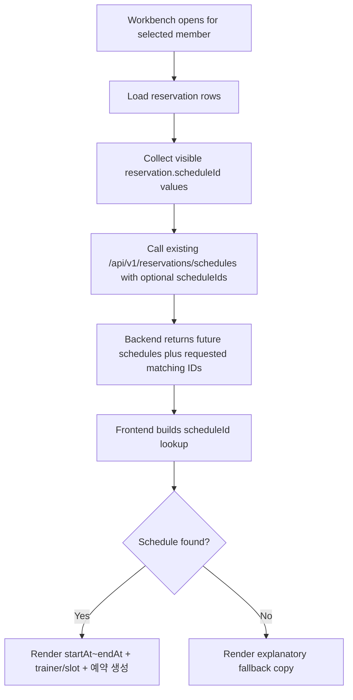

# fix: Stabilize reservation workbench schedule context

## Overview

Extend the existing reservation schedule query path so the reservation workbench can ask for missing schedule metadata by `scheduleId` without changing the reservation list contract or introducing a workbench-only API. The workbench should keep showing schedule time first and reservation creation time second, while greatly reducing fallback rows by enriching the shared schedule dataset with the exact reservation-linked schedules it needs.

## Problem Frame

The current workbench UI now separates schedule time from reservation creation time, but it still joins reservation rows against a future-only schedule list. When a reservation references a schedule that is no longer present in that list, the workbench falls back to a generic missing-schedule message even though the reservation itself still exists. The upstream requirements document narrows the preferred fix: preserve the current reservation workbench behavior, keep using the existing schedule query path, and add `scheduleId`-based enrichment so most rows can still recover their schedule window and metadata (see origin: `docs/brainstorms/2026-04-06-reservation-workbench-time-separation-requirements.md`).

## Requirements Trace

- R1. The workbench must lead with `startAt ~ endAt` as the scheduled reservation time.
- R2. The workbench must show trainer name and slot/class title as supporting metadata.
- R3. `reservedAt` must no longer appear as if it were the schedule time.
- R4. `reservedAt` must be shown as `예약 생성`.
- R5. The creation line must remain always visible.
- R6. The workbench must enrich missing schedule metadata using reservation-linked `scheduleId` values.
- R7. The fix must extend the existing schedule API instead of creating a new workbench-only read API.
- R8. The enrichment path must scope work to the visible reservation-linked `scheduleId` set, not broad historical scans.
- R9. Operators must be able to distinguish schedule time from creation time at a glance.
- R10. Existing workbench flow and current/upcoming reservation focus remain unchanged.
- R11. Rows that still cannot resolve schedule metadata must show a more explanatory fallback message.

## Scope Boundaries

- Do not change `GET /api/v1/reservations` response shape.
- Do not introduce a new workbench-only reservation or schedule endpoint.
- Do not redesign the overall workbench layout or add a timeline/detail panel.
- Do not change reservation create/cancel/complete/check-in/no-show behavior.
- Do not broaden the workbench into a full historical reservation ledger.

## Context & Research

### Relevant Code and Patterns

- `backend/src/main/java/com/gymcrm/reservation/controller/ReservationController.java` already exposes `GET /api/v1/reservations/schedules` and maps `TrainerSchedule` domain records through `ReservationScheduleResponse`.
- `backend/src/main/java/com/gymcrm/reservation/service/ReservationService.java` currently filters `listSchedules()` to future-only slots in the business timezone.
- `backend/src/main/java/com/gymcrm/reservation/repository/TrainerScheduleRepository.java` and `TrainerScheduleQueryRepository.java` already own schedule reads, so extending lookup capabilities here preserves the repository split used across the reservation module.
- `backend/src/test/java/com/gymcrm/reservation/ReservationApiIntegrationTest.java` already contains the current future-only schedule API characterization test.
- `frontend/src/pages/reservations/modules/useReservationSchedulesQuery.ts` currently fetches `/api/v1/reservations/schedules` and applies an additional future-only client filter.
- `frontend/src/pages/reservations/ReservationsPage.tsx` uses the shared schedule dataset for both booking flows and workbench display, so any enrichment must preserve the default booking behavior.
- `frontend/src/pages/dashboard/widgets/TrainerScheduleWidget.tsx` also consumes `/api/v1/reservations/schedules`, which means the default no-parameter behavior must remain stable for other readers.
- `frontend/src/api/mockData.ts` implements the mock `GET /api/v1/reservations/schedules` response used by reservation page tests and local mock mode.

### Institutional Learnings

- `docs/solutions/database-issues/reservation-checkin-noshow-usage-event-integrity-gymcrm-20260225.md` reinforces keeping reservation workspace changes narrow and avoiding opportunistic contract expansion when the current operational model can be preserved.

### External References

- No external research required. The repo already contains the relevant reservation, schedule, API, and frontend consumption patterns.

## Key Technical Decisions

- **Extend the existing schedule API with optional targeted enrichment.** `GET /api/v1/reservations/schedules` should accept an optional `scheduleIds` parameter and continue to behave exactly as it does today when the parameter is absent.
- **Keep default readers on the current future-only contract.** Consumers such as booking flows and dashboard widgets should still receive the existing future schedule list when no enrichment is requested.
- **Return the union of future schedules and requested schedule IDs when enrichment is requested.** This lets the reservation page keep using one schedule dataset for booking UI and workbench rendering without replacing future options with historical-only rows.
- **Preserve center/role scoping for enriched schedules.** Enrichment should not bypass the same actor-center and trainer-scope constraints already applied to reservation and schedule reads.
- **Use descriptive fallback language only after enrichment fails.** The frontend should only show `삭제되었거나 조회 불가한 일정`-style copy after the targeted lookup path could not recover metadata.

## Open Questions

### Resolved During Planning

- **Should the workbench get a new dedicated API?** No. The origin document explicitly prefers extending the existing schedule API, and the existing controller/service/repository split already supports that path.
- **Should `scheduleIds` replace the future-only list when present?** No. The enriched response should be the union of the normal future list plus any matching requested IDs so the reservation page can keep one shared schedule dataset.
- **Should other existing `/api/v1/reservations/schedules` readers change?** No. The no-parameter default must remain behaviorally identical to avoid regressions in booking flows and dashboard widgets.

### Deferred to Implementation

- **What exact request shape should the API accept for `scheduleIds`?** The implementer should choose the simplest Spring-compatible approach (`List<Long>` query param or equivalent) that stays readable and easy to test.
- **What exact fallback wording best matches real live-data failure cases?** Implementation should verify whether missing schedules are usually deleted, inaccessible, or otherwise absent before locking the final copy.
- **Does live data consistently use `reservedAt` as reservation creation time?** Reconfirm this while validating the final workbench copy, even though mock mode currently behaves that way.

## High-Level Technical Design

> *This illustrates the intended approach and is directional guidance for review, not implementation specification. The implementing agent should treat it as context, not code to reproduce.*

## Implementation Units

- [ ] **Unit 1: Extend reservation schedule reads for targeted `scheduleId` enrichment**

**Goal:** Add optional `scheduleIds` support to the existing reservation schedule API while preserving the current no-parameter future-only behavior.

**Requirements:** R6, R7, R8, R10

**Dependencies:** None

**Files:**
- Modify: `backend/src/main/java/com/gymcrm/reservation/controller/ReservationController.java`
- Modify: `backend/src/main/java/com/gymcrm/reservation/service/ReservationService.java`
- Modify: `backend/src/main/java/com/gymcrm/reservation/repository/TrainerScheduleRepository.java`
- Modify: `backend/src/main/java/com/gymcrm/reservation/repository/TrainerScheduleQueryRepository.java`
- Test: `backend/src/test/java/com/gymcrm/reservation/ReservationApiIntegrationTest.java`

**Approach:**
- Extend the controller method for `GET /api/v1/reservations/schedules` to accept optional `scheduleIds`.
- Update the service layer so no-parameter reads keep the current future-only filter, while enriched reads return the union of default future rows plus any matching requested schedule IDs within the actor’s allowed center/scope.
- Implement the repository read needed to fetch schedules by ID set without bypassing existing deletion and center constraints.
- Keep response mapping unchanged by continuing to emit `ReservationScheduleResponse`.

**Patterns to follow:**
- `backend/src/main/java/com/gymcrm/reservation/controller/ReservationController.java`
- `backend/src/main/java/com/gymcrm/reservation/service/ReservationService.java`
- `backend/src/main/java/com/gymcrm/reservation/repository/TrainerScheduleRepository.java`
- `backend/src/main/java/com/gymcrm/reservation/repository/TrainerScheduleQueryRepository.java`

**Test scenarios:**
- Happy path: `GET /api/v1/reservations/schedules` without `scheduleIds` still returns only future schedules.
- Happy path: `GET /api/v1/reservations/schedules?scheduleIds=...` returns requested schedules even when one of them is in the past.
- Edge case: duplicate or already-future `scheduleIds` do not produce duplicate rows in the response.
- Edge case: unknown or deleted `scheduleIds` are ignored without failing the request.
- Error path: invalid `scheduleIds` input is rejected or normalized according to the chosen Spring binding approach.
- Integration: trainer-scoped actors still only receive schedules they are allowed to see when using `scheduleIds`.

**Verification:**
- Existing no-parameter clients remain behaviorally unchanged.
- The API can recover reservation-linked schedule rows that are absent from the normal future schedule list.

- [ ] **Unit 2: Update frontend schedule loading to request reservation-linked enrichment**

**Goal:** Teach the reservation page to ask the shared schedule query for reservation-linked `scheduleId` enrichment while preserving booking and GX/PT schedule selection behavior.

**Requirements:** R1, R2, R6, R7, R8, R10

**Dependencies:** Unit 1

**Files:**
- Modify: `frontend/src/pages/reservations/modules/useReservationSchedulesQuery.ts`
- Modify: `frontend/src/pages/reservations/ReservationsPage.tsx`
- Test: `frontend/src/pages/reservations/modules/useReservationSchedulesQuery.test.tsx`

**Approach:**
- Extend the schedule query hook so it can optionally request enriched schedules by `scheduleIds` while keeping the default future-only usage intact.
- Update the reservation page to derive visible reservation-linked `scheduleId` values from the workbench rows and pass them into the schedule loader when needed.
- Keep one merged schedule dataset available to the page so booking flows still work from future schedules while the workbench can resolve linked historical or missing schedule rows.
- Ensure query keys and reload behavior reflect the optional `scheduleIds` input so stale schedule sets are not reused across different members or workbench states.

**Execution note:** Start with a failing hook- or page-level test that proves a reservation-linked past schedule can be recovered when `scheduleIds` enrichment is requested.

**Patterns to follow:**
- `frontend/src/pages/reservations/modules/useReservationSchedulesQuery.ts`
- `frontend/src/pages/reservations/ReservationsPage.tsx`
- `frontend/src/pages/dashboard/widgets/TrainerScheduleWidget.tsx`

**Test scenarios:**
- Happy path: the hook still loads only future schedules when no `scheduleIds` are provided.
- Happy path: the hook requests and returns a union dataset when `scheduleIds` are provided.
- Edge case: repeated `scheduleIds` or empty arrays do not cause unstable query churn.
- Edge case: switching selected members resets or refreshes the enrichment set so one member’s missing schedule does not leak into another’s workbench.
- Integration: the reservation page still shows future GX/PT schedule options after enrichment is enabled for the workbench.

**Verification:**
- The reservation page continues to support booking flows without regression.
- Workbench-linked missing schedules can be recovered through the shared schedule query path.

- [ ] **Unit 3: Improve workbench fallback handling and page-level regression coverage**

**Goal:** Use the enriched schedule dataset to reduce fallback rows and make the remaining unresolved rows more explanatory for operators.

**Requirements:** R1, R2, R3, R4, R5, R9, R11

**Dependencies:** Unit 2

**Files:**
- Modify: `frontend/src/pages/reservations/ReservationsPage.tsx`
- Modify: `frontend/src/pages/reservations/ReservationsPage.test.tsx`
- Modify: `frontend/src/api/mockData.ts`

**Approach:**
- Update the workbench cell renderer to keep the schedule-first / `예약 생성` hierarchy while changing the unresolved fallback text to a more explanatory operator-facing message.
- Extend mock schedule API behavior so local mock mode and page tests can exercise both enriched recovery and unresolved fallback cases.
- Add page-level tests that cover both the recovered-schedule path and the final fallback path.

**Patterns to follow:**
- `frontend/src/pages/reservations/ReservationsPage.tsx`
- `frontend/src/pages/reservations/ReservationsPage.test.tsx`
- `frontend/src/api/mockData.ts`

**Test scenarios:**
- Happy path: a reservation row with an enriched linked schedule renders `startAt ~ endAt`, trainer/slot metadata, and `예약 생성`.
- Happy path: existing workbench interactions still function after the schedule enrichment path is added.
- Edge case: when a reservation-linked schedule still cannot be found after enrichment, the row renders the explanatory fallback message instead of the old generic text.
- Integration: mock-mode reservation workbench uses the enriched schedule API path and mirrors the live rendering contract.

**Verification:**
- Operators see schedule metadata for most linked reservations, not just currently future ones.
- Remaining unresolved rows communicate likely cause more clearly than the previous generic fallback.

- [ ] **Unit 4: Document the extended schedule query contract and default-reader safety**

**Goal:** Keep the canonical API contract aligned with the new optional `scheduleIds` enrichment behavior and explicitly preserve the no-parameter default semantics for existing consumers.

**Requirements:** R7, R8, R10

**Dependencies:** Unit 1

**Files:**
- Modify: `docs/04_API_설계서.md`

**Approach:**
- Update the reservation schedule API section to document the optional `scheduleIds` request parameter.
- Clarify that the default no-parameter response remains future-only, and that enrichment returns the union of default future schedules plus requested matching IDs.
- Record the change in Appendix C so downstream readers can understand that this is a non-breaking contract extension.

**Patterns to follow:**
- `docs/04_API_설계서.md`

**Test scenarios:**
- Test expectation: none -- documentation-only unit. Validation comes from implementation units and manual contract review.

**Verification:**
- The API spec and change history explicitly describe the optional enrichment parameter and default behavior preservation.

## System-Wide Impact

- **Interaction graph:** `ReservationController` -> `ReservationService` -> `TrainerScheduleRepository` remains the backend read path; `ReservationsPage` and `TrainerScheduleWidget` remain frontend consumers of `/api/v1/reservations/schedules`.
- **Error propagation:** The main cross-layer risk is changing `/api/v1/reservations/schedules` semantics in a way that breaks default future-only consumers; preserving the no-parameter contract is the primary mitigation.
- **State lifecycle risks:** The change is read-only, but query-key mistakes or stale merged schedule state could cause one member’s enriched schedules to linger in another workbench session.
- **API surface parity:** This plan explicitly keeps `GET /api/v1/reservations` unchanged and avoids adding a workbench-only endpoint.
- **Integration coverage:** Backend API tests must prove the no-parameter and enriched-parameter paths side-by-side; frontend page tests must prove booking flows still work while the workbench resolves enriched schedules.
- **Unchanged invariants:** Reservation mutation flows, role checks, and default future schedule readers such as dashboard widgets should behave the same when `scheduleIds` is not supplied.

## Risks & Dependencies

| Risk | Mitigation |
|------|------------|
| Extending `/api/v1/reservations/schedules` accidentally changes existing consumers | Keep no-parameter behavior identical and add explicit regression coverage for default readers |
| Enrichment leaks schedules outside the actor’s allowed center or trainer scope | Reuse existing center/role scoping in service and repository reads; add trainer-scoped API coverage |
| Frontend query caching serves stale enriched data across members | Include enrichment inputs in query identity or refresh logic and add member-switch coverage |
| Mock mode diverges from live enrichment behavior | Update `frontend/src/api/mockData.ts` and page tests to exercise the same request/response contract |

## Documentation / Operational Notes

- `docs/04_API_설계서.md` must be updated as part of the same delivery unit because `GET /api/v1/reservations/schedules` gains optional request parameters and a clarified response behavior.
- The API change history appendix should record the `scheduleIds` enrichment capability and the guarantee that default behavior remains future-only when the parameter is absent.
- Manual verification should include both reservation workbench rendering and at least one other `/api/v1/reservations/schedules` consumer, with `frontend/src/pages/dashboard/widgets/TrainerScheduleWidget.tsx` as the primary existing-reader regression check.

## Sources & References

- **Origin document:** `docs/brainstorms/2026-04-06-reservation-workbench-time-separation-requirements.md`
- Related code: `backend/src/main/java/com/gymcrm/reservation/controller/ReservationController.java`
- Related code: `backend/src/main/java/com/gymcrm/reservation/service/ReservationService.java`
- Related code: `backend/src/main/java/com/gymcrm/reservation/repository/TrainerScheduleRepository.java`
- Related code: `backend/src/main/java/com/gymcrm/reservation/repository/TrainerScheduleQueryRepository.java`
- Related test: `backend/src/test/java/com/gymcrm/reservation/ReservationApiIntegrationTest.java`
- Related code: `frontend/src/pages/reservations/modules/useReservationSchedulesQuery.ts`
- Related code: `frontend/src/pages/reservations/ReservationsPage.tsx`
- Related code: `frontend/src/pages/dashboard/widgets/TrainerScheduleWidget.tsx`
- Related test: `frontend/src/pages/reservations/modules/useReservationSchedulesQuery.test.tsx`
- Related test: `frontend/src/pages/reservations/ReservationsPage.test.tsx`
- Related doc: `docs/04_API_설계서.md`
