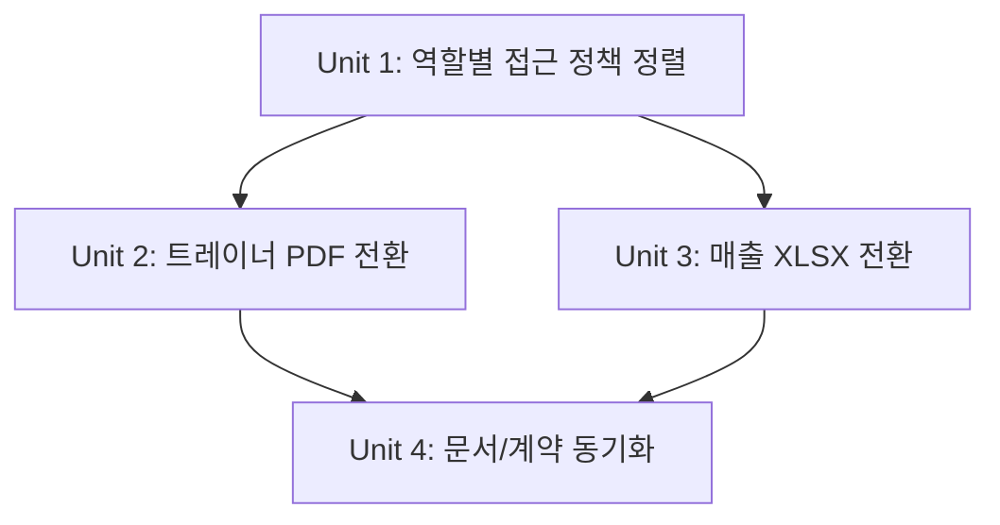
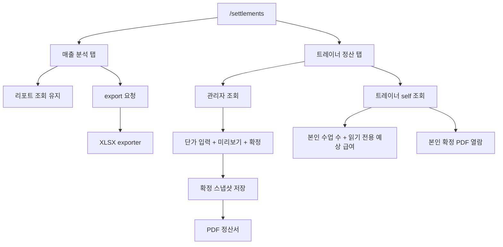

# feat: 정산 리포트 정책 정렬 및 출력 포맷 전환

## Overview

`/settlements`의 핵심 화면과 집계 흐름은 이미 존재하지만, 최근 브레인스토밍에서 확정된 운영 정책과 현재 구현 사이에는 세 가지 중요한 차이가 남아 있다. 매출 리포트 다운로드는 실제 Excel(`.xlsx`) 기준으로 정렬되어야 하고, 트레이너 정산 문서는 PDF를 기준 산출물로 바꿔야 하며, 트레이너는 본인 월간 집계와 읽기 전용 예상 급여 및 본인 확정 정산서만 열람할 수 있어야 한다.

이번 플랜은 기존 탭 구조와 집계 API를 유지하면서도, 출력 포맷과 권한 모델을 정책 기준으로 재정렬하는 후속 작업을 정의한다. 목표는 `/settlements`를 다시 설계하는 것이 아니라, 이미 구현된 정산 경험을 운영 정책에 맞는 제품으로 마무리하는 것이다.

## Problem Frame

현재 정산 모듈은 대시보드, 추이 리포트, 최근 환불, 트레이너 정산 조회/확정/문서 다운로드까지 기능 자산을 갖추고 있다. 하지만 매출 리포트는 CSV export로 남아 있어 사람이 바로 읽기 좋은 운영 보고서 경험과 맞지 않고, 트레이너 정산 문서도 CSV라서 실제 정산 보관 문서 역할을 하기 어렵다. 또한 트레이너 권한은 아직 관리자 중심 흐름과 분리되지 않아, 문서상으로 정의된 “본인 데이터만 안전하게 열람” 정책을 제품에서 명확히 보장하지 못한다.

이번 플랜은 브레인스토밍에서 확정한 제품 결정을 그대로 구현으로 번역한다.
- 매출 리포트 다운로드는 실제 Excel(`.xlsx`)이다.
- 트레이너 정산 문서는 PDF가 기본 산출물이다.
- 관리자와 트레이너는 같은 `/settlements` 진입점을 쓰되, 트레이너는 본인 월간 수업 수, 시스템 기준 예상 급여, 본인 확정 정산서만 본다.

(see origin: docs/brainstorms/2026-04-03-settlements-analytics-and-trainer-payroll-requirements.md)

## Requirements Trace

- R1-R10. `/settlements`의 기존 매출 분석 흐름은 유지하며, 운영 상황판과 기간 추이 리포트의 구조를 깨지 않는다.
- R11. 매출 분석 탭 다운로드를 실제 Excel(`.xlsx`) 형식으로 전환한다.
- R12-R14. 최근 환불 목록 경험은 유지하며, export 전환이 목록 계약을 훼손하지 않는다.
- R15-R17. 트레이너 정산은 관리자/트레이너 역할별 열람 범위를 분리하고, 트레이너는 본인 월간 집계와 읽기 전용 예상 급여만 본다.
- R18-R19. 확정된 트레이너 정산 문서를 PDF로 출력하고, 트레이너는 본인 확정 문서만 열람할 수 있게 한다.
- R20. 같은 `/settlements` 진입점 안에서 권한별 경험 차이를 자연스럽게 제공한다.

## Scope Boundaries

- 기존 `매출 분석`/`트레이너 정산` 탭 구조를 다시 바꾸지 않는다.
- 급여 정책 자체, 단가 계산 규칙, 수업 집계 기준 변경은 이번 범위에 포함하지 않는다.
- 외부 회계 시스템 연동, 전자서명, 세무 제출용 포맷 확장, 다국어 PDF 템플릿은 포함하지 않는다.
- 일일 마감 정산, 미수금 관리, 심화 환불 분석 화면은 여전히 범위 밖이다.

## Context & Research

### Relevant Code and Patterns

- `backend/src/main/java/com/gymcrm/settlement/controller/SalesSettlementReportController.java`
  - 현재 기간별 매출/환불/순매출 조회와 CSV export를 담당한다.
- `backend/src/main/java/com/gymcrm/settlement/SalesSettlementCsvExporter.java`
  - 기존 매출 export의 필드 구성과 escaping 기준점이다.
- `backend/src/main/java/com/gymcrm/settlement/controller/TrainerPayrollSettlementController.java`
  - 월별 정산 조회, 확정, 문서 다운로드 진입점이 이미 하나로 모여 있다.
- `backend/src/main/java/com/gymcrm/settlement/TrainerSettlementDocumentExporter.java`
  - 현재 CSV 정산서 생성 책임을 갖고 있어 PDF exporter 전환의 직접 대상이다.
- `backend/src/main/java/com/gymcrm/settlement/service/TrainerPayrollSettlementService.java`
  - 월별 집계 계산과 확정 스냅샷 재사용을 담당하므로 트레이너 self-scope 분기의 핵심 서비스다.
- `backend/src/main/java/com/gymcrm/common/security/AccessPolicies.java`
  - 현재 관리자/데스크/트레이너 권한 조합을 문자열 정책으로 정의한다.
- `backend/src/main/java/com/gymcrm/common/security/SecurityContextCurrentUserProvider.java`
  - 현재 사용자 ID와 center를 가져올 수 있어 trainer self-scope 필터 근거로 활용 가능하다.
- `frontend/src/pages/settlements/SettlementsPage.tsx`
  - 관리자 중심 액션 버튼과 다운로드 흐름이 한 페이지에 모여 있어 역할별 UI 분리를 여기서 수행하게 된다.
- `frontend/src/app/auth.tsx`, `frontend/src/app/roles.ts`
  - 프론트가 현재 로그인 사용자 역할과 ID를 알고 있어 읽기 전용 UI 분기에 활용할 수 있다.
- `frontend/src/api/client.ts`
  - blob download helper가 이미 있어 PDF/XLSX 다운로드 전환 시 재사용 가능하다.
- `frontend/src/api/mockData.ts`
  - mock mode가 정산 흐름을 직접 시뮬레이션하므로 문서 포맷과 권한 분기까지 함께 맞춰야 한다.

### Institutional Learnings

- 별도 `docs/solutions/` 재사용 문서는 이번 범위에서 확인되지 않았다.
- 이 저장소는 화면 역할 분기를 프론트에서 완전히 숨기기보다, 서버 권한과 프론트 read-only 제약을 함께 사용하는 패턴이 여러 모듈에서 보인다.
- 기존 정산 관련 테스트는 API 계약 테스트와 exporter 단위 테스트가 분리되어 있으므로, 포맷 전환도 같은 층위로 검증하는 편이 안전하다.

### External References

- 없음. 이번 범위는 현재 코드베이스의 정산/다운로드/권한 패턴을 따르는 것이 우선이다.

## Key Technical Decisions

- 같은 endpoint를 유지한 role-aware 응답으로 간다.
  - 트레이너 self-scope를 위해 별도 라우트를 추가하기보다, 기존 `trainer-payroll` 조회/문서 endpoint에서 인증 주체에 따라 조회 범위를 좁히는 편이 현재 구조에 더 잘 맞는다.
- 관리자 입력, 트레이너 읽기 전용으로 분리한다.
  - 트레이너는 단가를 직접 입력하거나 확정 흐름에 개입하지 않고, 시스템 기준 예상 급여와 본인 확정 문서만 열람한다. 문서상의 제품 의도와 가장 잘 맞는 방향이다.
- 매출 리포트는 CSV가 아닌 보고서형 Excel로 전환한다.
  - 운영자가 열자마자 읽기 쉬운 산출물이 목적이므로 단순 데이터 추출보다 `.xlsx` 구성 품질을 우선한다.
- 트레이너 정산 문서는 PDF 단일 기준으로 전환한다.
  - 정산서는 보관/공유/확인에 쓰는 문서이므로 CSV보다 PDF가 제품 의도와 더 일치한다.
- 문서/API 계약도 같은 delivery unit 안에서 함께 갱신한다.
  - 출력 포맷과 권한 정책이 바뀌면 `docs/04_API_설계서.md`와 요구사항 부속 설명이 구현과 같이 움직여야 이후 작업이 흔들리지 않는다.
- export endpoint의 URL은 유지하고 표현 형식만 바꾼다.
  - `/sales-report/export`와 `/trainer-payroll/document` 경로를 바꾸지 않으면 기존 화면 구조와 호출 흐름을 유지한 채 포맷만 교체할 수 있다.

## Open Questions

### Resolved During Planning

- 트레이너가 어느 범위까지 정산 정보를 볼 수 있어야 하는가?
  - 트레이너는 본인 월간 수업 수와 시스템 기준 예상 급여를 읽기 전용으로 열람하고, 본인에게 확정된 PDF 정산서만 볼 수 있다. 단가 입력과 확정은 관리자 전용이다.
- 매출 리포트 다운로드 포맷은 무엇인가?
  - 사람이 바로 읽을 수 있는 실제 Excel(`.xlsx`) 형식으로 간다.
- 트레이너 정산 문서 포맷은 무엇인가?
  - PDF를 기본 산출물로 확정한다.
- 권한 분기를 새 endpoint로 나눌 것인가?
  - 우선 기존 endpoint를 유지하고 역할에 따라 응답 범위와 액션 가시성만 나누는 방향으로 간다.
- 트레이너 self-scope 판별 기준은 무엇인가?
  - 서버는 인증 principal의 `roleCode`와 `currentUserId`를 기준으로 self-scope를 판별하고, 프론트는 같은 역할 정보를 이용해 read-only UI만 노출한다.

### Deferred to Implementation

- Excel export를 단일 시트로 둘지, 요약/추이/상세를 다중 시트로 나눌지
  - 사용자 가치에는 영향이 있지만 최종 파일 구성은 실제 exporter 구현 시점에 더 적절하게 판단할 수 있다.
- PDF 템플릿을 라이브러리 기반 렌더링으로 만들지, HTML-to-PDF 스타일로 만들지
  - 구현 기술 선택은 planning의 주제가 아니며, 현재 build/dependency 상황을 보고 구현 시 결정하는 편이 적절하다.
- 트레이너 읽기 전용 예상 급여의 시스템 기준 단가를 어떤 데이터 소스로 노출할지
  - 현재 `sessionUnitPrice`가 요청 입력값 기반이라, self-scope 조회에서 사용할 읽기 전용 기준값은 기존 설정/계약을 확인하며 구현 시 정렬해야 한다.

## Phased Delivery

### Phase 1
- Unit 1을 먼저 완료해 역할별 조회/문서 접근 정책을 서버와 화면 양쪽에서 고정한다.
- 이 단계가 끝나야 PDF/XLSX 전환이 누구에게 어떤 파일을 내려줘야 하는지 흔들리지 않는다.

### Phase 2
- Unit 2와 Unit 3으로 트레이너 문서와 매출 리포트 export 포맷을 각각 전환한다.
- 두 exporter는 모두 바이너리 응답으로 바뀌지만, 계약 surface는 다르므로 병렬 작업보다 분리 검증이 안전하다.

### Phase 3
- Unit 4에서 API 설계서와 요구사항 설명을 구현 기준으로 동기화한다.
- 이 단계는 코드가 확정된 뒤 바로 이어서 수행해 문서와 구현 간 드리프트를 줄인다.

## High-Level Technical Design

> *This illustrates the intended approach and is directional guidance for review, not implementation specification. The implementing agent should treat it as context, not code to reproduce.*

## Implementation Units

- [x] **Unit 1: 트레이너 정산 조회/문서의 역할별 접근 정책 정렬**

**Goal:** 관리자와 트레이너가 같은 정산 탭을 사용하되, 트레이너는 본인 월간 집계, 읽기 전용 예상 급여, 본인 확정 문서만 볼 수 있도록 서버 계약과 UI를 정렬한다.

**Requirements:** R15-R18, R20

**Dependencies:** 없음

**Files:**
- Modify: `backend/src/main/java/com/gymcrm/common/security/AccessPolicies.java`
- Modify: `backend/src/main/java/com/gymcrm/settlement/controller/TrainerPayrollSettlementController.java`
- Modify: `backend/src/main/java/com/gymcrm/settlement/service/TrainerPayrollSettlementService.java`
- Modify: `backend/src/main/java/com/gymcrm/settlement/service/TrainerSettlementLifecycleService.java`
- Modify: `backend/src/main/java/com/gymcrm/settlement/repository/TrainerPayrollSettlementRepository.java`
- Modify: `backend/src/test/java/com/gymcrm/settlement/TrainerPayrollSettlementServiceIntegrationTest.java`
- Modify: `backend/src/test/java/com/gymcrm/settlement/SalesSettlementApiIntegrationTest.java`
- Modify: `frontend/src/pages/settlements/SettlementsPage.tsx`
- Modify: `frontend/src/pages/settlements/SettlementsPage.test.tsx`
- Modify: `frontend/src/pages/settlements/modules/useTrainerPayrollQuery.ts`
- Modify: `frontend/src/pages/settlements/modules/useTrainerPayrollQuery.test.tsx`
- Modify: `frontend/src/api/mockData.ts`
- Modify: `frontend/src/api/mockData.test.ts`
- Test: `backend/src/test/java/com/gymcrm/settlement/TrainerPayrollSettlementServiceIntegrationTest.java`
- Test: `backend/src/test/java/com/gymcrm/settlement/SalesSettlementApiIntegrationTest.java`
- Test: `frontend/src/pages/settlements/SettlementsPage.test.tsx`
- Test: `frontend/src/pages/settlements/modules/useTrainerPayrollQuery.test.tsx`
- Test: `frontend/src/api/mockData.test.ts`

**Approach:**
- `trainer-payroll` 조회는 기존 endpoint를 유지하되, 인증 주체가 트레이너일 때는 현재 사용자 ID와 매칭되는 본인 row만 반환하도록 서비스/리포지토리 경로를 분기한다.
- 관리자/데스크는 기존처럼 월 전체 집계를 조회하고 단가 입력, 확정, 문서 출력 액션을 유지한다.
- 트레이너는 읽기 전용 예상 급여와 본인 확정 문서 열람만 가능하게 UI를 단순화하고, 단가 입력 필드와 확정 액션은 숨기거나 비활성화한다.
- 문서 다운로드 endpoint도 동일 경로를 유지하되, 트레이너는 본인 settlement row만 포함된 확정 문서만 받을 수 있게 제한한다.
- self-scope는 프론트 신호를 신뢰하지 않고 서버에서 최종 강제한다. 프론트 역할 분기는 UX 단순화용이고, 데이터 범위 보장은 컨트롤러/서비스/리포지토리 계층에서 수행한다.

**Patterns to follow:**
- `backend/src/main/java/com/gymcrm/reservation/service/PtReservationService.java`의 trainer self-scope 분기 패턴
- `frontend/src/app/roles.ts`의 역할 기반 UI 분기 패턴
- `frontend/src/pages/trainers/TrainersPage.tsx` 및 관련 테스트의 unsupported/role-aware 렌더링 패턴

**Test scenarios:**
- Happy path: 관리자 조회 시 기존과 동일하게 월 전체 트레이너 rows와 확정 상태가 반환된다.
- Happy path: 트레이너 조회 시 본인 row 한 개만 반환되고 다른 트레이너 row는 포함되지 않는다.
- Happy path: 트레이너가 본인에게 확정된 월의 문서를 요청하면 성공한다.
- Edge case: 트레이너에게 해당 월 집계가 없으면 빈 rows 또는 정의된 empty state가 일관되게 반환된다.
- Error path: 트레이너가 월 정산 확정 endpoint를 호출하면 권한 오류가 반환된다.
- Error path: 트레이너가 다른 트레이너 데이터가 포함된 문서나 전체 문서를 우회 요청해도 차단된다.
- Integration: 프론트에서 `ROLE_TRAINER` 로그인 상태일 때 단가 입력/확정 버튼이 보이지 않고 읽기 전용 summary만 노출된다.
- Integration: mock mode에서도 trainer/admin 역할별 정산 탭 경험이 실제 계약과 동일하게 유지된다.

**Verification:**
- 관리자와 트레이너가 같은 `/settlements` 진입점을 쓰더라도, 서버 응답과 화면 액션이 역할 정책에 맞게 분리된다.
- 트레이너 계정으로는 다른 트레이너 데이터가 어떤 경로로도 내려오지 않는다.

- [x] **Unit 2: 트레이너 정산 문서를 PDF 기준 산출물로 전환**

**Goal:** 확정된 트레이너 정산 문서를 실제 보관/공유 가능한 PDF 산출물로 전환하고, 프론트 다운로드 경험을 PDF 기준으로 정렬한다.

**Requirements:** R18-R19

**Dependencies:** Unit 1

**Files:**
- Modify: `backend/build.gradle`
- Replace: `backend/src/main/java/com/gymcrm/settlement/TrainerSettlementDocumentExporter.java`
- Modify: `backend/src/main/java/com/gymcrm/settlement/controller/TrainerPayrollSettlementController.java`
- Modify: `backend/src/test/java/com/gymcrm/settlement/TrainerSettlementDocumentExporterTest.java`
- Modify: `backend/src/test/java/com/gymcrm/settlement/SalesSettlementApiIntegrationTest.java`
- Modify: `frontend/src/pages/settlements/SettlementsPage.tsx`
- Modify: `frontend/src/api/mockData.ts`
- Modify: `frontend/src/api/mockData.test.ts`
- Test: `backend/src/test/java/com/gymcrm/settlement/TrainerSettlementDocumentExporterTest.java`
- Test: `backend/src/test/java/com/gymcrm/settlement/SalesSettlementApiIntegrationTest.java`
- Test: `frontend/src/api/mockData.test.ts`
- Test: `frontend/src/pages/settlements/SettlementsPage.test.tsx`

**Approach:**
- 기존 CSV exporter 책임을 PDF 생성 책임으로 바꾸고, 컨트롤러 응답 content-type과 filename을 PDF 기준으로 정렬한다.
- 문서에는 최소한 정산 월, 트레이너 식별 정보, 완료 수업 수, 세션 단가, 정산 금액, 확정 정보가 포함되도록 구성한다.
- 트레이너 self-download 정책이 Unit 1에서 도입되므로, PDF renderer는 전체 월 문서와 단일 트레이너 문서 모두를 처리할 수 있어야 한다.
- 프론트와 mock mode는 `trainer-settlement-YYYY-MM.pdf` 경험으로 맞추고, 다운로드 성공/실패 메시지도 PDF 기준으로 조정한다.
- 컨트롤러 계약은 “문서 생성 성공”뿐 아니라 `Content-Disposition`, MIME type, 빈 데이터/미확정 상태의 오류 응답까지 함께 고정한다.

**Execution note:** 구현 시 exporter 선택은 자유지만, 테스트는 먼저 문서 메타데이터와 핵심 텍스트 포함 여부를 고정하는 식으로 잡는 편이 안전하다.

**Patterns to follow:**
- `backend/src/main/java/com/gymcrm/settlement/SalesSettlementCsvExporter.java`의 데이터 직렬화 책임 분리 방식
- `frontend/src/api/client.ts`의 blob download helper 재사용 패턴

**Test scenarios:**
- Happy path: 확정된 월 정산 문서를 요청하면 PDF content-type과 `.pdf` filename으로 응답한다.
- Happy path: 생성된 PDF에 정산 월, 트레이너명, 완료 수업 수, 세션 단가, 정산 금액, 확정 시각이 포함된다.
- Edge case: 단일 트레이너 문서 생성 시에도 레이아웃이 깨지지 않고 필요한 필드가 모두 포함된다.
- Error path: 확정되지 않은 월 정산 문서는 기존과 동일하게 생성이 차단된다.
- Integration: 프론트 다운로드 로직이 PDF blob을 받아 브라우저 다운로드를 정상 트리거한다.
- Integration: mock mode에서 PDF 파일명과 메시지가 실제 계약과 일치한다.

**Verification:**
- 확정 정산 문서를 내려받으면 PDF로 열리고, 사람이 읽을 수 있는 정산 문서 수준의 핵심 정보가 포함된다.
- 관리자용 월 전체 문서와 트레이너용 본인 문서가 같은 포맷 규칙을 따르되 포함 row 범위만 다르다.

- [x] **Unit 3: 매출 리포트 export를 실제 Excel(`.xlsx`)로 전환**

**Goal:** 매출 분석 탭 export를 데이터 추출용 CSV가 아니라 운영자가 즉시 읽을 수 있는 Excel 보고서로 전환한다.

**Requirements:** R11

**Dependencies:** 기존 매출 리포트 집계 계약 유지

**Files:**
- Modify: `backend/build.gradle`
- Replace: `backend/src/main/java/com/gymcrm/settlement/SalesSettlementCsvExporter.java`
- Modify: `backend/src/main/java/com/gymcrm/settlement/controller/SalesSettlementReportController.java`
- Modify: `backend/src/test/java/com/gymcrm/settlement/SalesSettlementCsvExporterTest.java`
- Modify: `backend/src/test/java/com/gymcrm/settlement/SalesSettlementApiIntegrationTest.java`
- Modify: `frontend/src/pages/settlements/SettlementsPage.tsx`
- Modify: `frontend/src/api/mockData.ts`
- Modify: `frontend/src/api/mockData.test.ts`
- Test: `backend/src/test/java/com/gymcrm/settlement/SalesSettlementCsvExporterTest.java`
- Test: `backend/src/test/java/com/gymcrm/settlement/SalesSettlementApiIntegrationTest.java`
- Test: `frontend/src/pages/settlements/SettlementsPage.test.tsx`
- Test: `frontend/src/api/mockData.test.ts`

**Approach:**
- 현재 export endpoint는 유지하되 응답 포맷을 `.xlsx`로 바꾸고, 요약/추이/상품별 집계가 사람이 읽기 쉬운 시트 구조로 들어가도록 exporter 책임을 재설계한다.
- 프론트 다운로드 버튼과 파일명도 Excel 기준으로 맞추며, export가 리포트 조회/환불 목록 계약에는 영향을 주지 않도록 분리한다.
- 테스트는 workbook 생성 여부만 보는 수준이 아니라, 요약 값과 대표 row가 시트에 반영되는지까지 확인해 “보고서형 Excel” 품질을 담보한다.
- mock mode가 계속 export를 지원해야 한다면 동일한 파일명/확장자 계약을 흉내내고, 지원하지 않는다면 그 제한을 의도적으로 문서화해 live 계약과 혼동되지 않게 해야 한다.

**Patterns to follow:**
- `backend/src/main/java/com/gymcrm/settlement/controller/SalesSettlementReportController.java`의 export endpoint 구조
- 정산 리포트 서비스의 기존 `SalesReportResult` 계약 재사용

**Test scenarios:**
- Happy path: 매출 리포트 export 요청 시 `.xlsx` filename과 Excel MIME type으로 응답한다.
- Happy path: workbook에 요약 수치와 추이/상세 집계가 사람이 읽을 수 있는 헤더 구조로 들어간다.
- Edge case: 데이터가 적거나 단일 bucket만 있어도 workbook 구조가 유지된다.
- Edge case: 상품명/메모 등 특수문자가 포함돼도 셀 값이 깨지지 않는다.
- Error path: 기존 validation error 조건은 export 전환 후에도 그대로 유지된다.
- Integration: 프론트 다운로드가 Excel 파일명으로 저장되고 기존 필터 값 기준 export를 유지한다.

**Verification:**
- 운영자가 내보낸 파일을 Excel에서 열었을 때 별도 수동 정리 없이 요약과 상세를 바로 읽을 수 있다.
- 기존 리포트 조회와 최근 환불 목록은 export 포맷 전환과 무관하게 동일하게 동작한다.

- [x] **Unit 4: API 설계서와 요구사항 부속 설명을 구현 계약에 맞춰 동기화**

**Goal:** 포맷/권한 정책 전환이 코드와 문서에서 동시에 일치하도록 정산 관련 설계 문서를 갱신한다.

**Requirements:** R11, R17-R19

**Dependencies:** Unit 1-3의 계약 확정

**Files:**
- Modify: `docs/04_API_설계서.md`
- Modify: `docs/01_요구사항_분석서.md`
- Modify: `docs/brainstorms/2026-04-03-settlements-analytics-and-trainer-payroll-requirements.md`
- Test: none -- 문서/계약 동기화 작업이다.

**Approach:**
- API 설계서의 정산 endpoint 목록과 상세 명세를 현재 정책에 맞게 수정한다.
- 매출 리포트 export는 Excel, 트레이너 정산 문서는 PDF, 트레이너 self-scope 열람은 본인 범위라는 결정을 문서에 명시한다.
- Appendix C 또는 변경 이력 섹션에는 이번 계약 전환의 날짜와 요약을 남겨 이후 구현/리뷰가 이전 CSV 계약을 기준으로 흔들리지 않게 한다.
- 이미 업데이트된 브레인스토밍 문서는 최종 구현 계약과 어긋난 부분만 최소 수정하고, 새로 결정된 사항을 plan/origin 간 충돌 없이 유지한다.

**Patterns to follow:**
- `docs/04_API_설계서.md`의 기존 정산 API 표 형식
- AGENTS.md의 API 문서 동기화 규칙

**Test scenarios:**
- Test expectation: none -- 문서 변경 자체는 실행 테스트 대상이 아니지만, plan 구현 완료 후 문서와 실제 응답 포맷/권한이 일치하는지 수동 교차 검토가 필요하다.

**Verification:**
- 정산 관련 문서를 읽는 사람은 더 이상 CSV/권한 범위를 잘못 이해하지 않으며, 구현 계약과 문서가 같은 방향을 가리킨다.

## System-Wide Impact

- **Interaction graph:** `TrainerPayrollSettlementController`와 `SalesSettlementReportController`는 각각 frontend `SettlementsPage.tsx`, mock data, API 설계 문서와 동시에 맞물려 있어 출력 포맷 변경이 여러 층을 함께 건드린다.
- **Error propagation:** 권한 분기 실수는 잘못된 데이터 노출로 이어질 수 있으므로, trainer self-scope 실패는 UI 숨김보다 서버 필터/인가에서 먼저 차단되어야 한다.
- **State lifecycle risks:** 확정 전 미리보기와 확정 후 스냅샷을 같은 조회 endpoint가 다루기 때문에, 역할 분기 도입 시 draft/confirmed 상태 해석이 사용자별로 달라지지 않도록 주의해야 한다.
- **API surface parity:** 정산 문서 포맷이 바뀌면 mock mode, API 설계서, 프론트 파일명/메시지, 테스트 fixture가 모두 같은 계약을 따라야 한다.
- **Integration coverage:** API 단위 테스트만으로는 프론트 read-only 렌더링과 blob download UX까지 증명되지 않으므로, backend contract + frontend rendering + mock parity를 모두 검증해야 한다.
- **Unchanged invariants:** 기존 대시보드 수치, 기간 추이, 최근 환불 조회 계약은 유지한다. 이번 작업은 export 포맷과 정산 권한 모델을 바꾸되, 정산 리포트의 집계 의미 자체는 바꾸지 않는다.
- **Binary response handling:** PDF/XLSX로 전환되면 JSON 기반 API 경로와 달리 blob 처리, filename parsing, MIME type 검증이 중요해지므로 프론트/테스트 양쪽 모두에서 응답 형식 자체를 검증해야 한다.

## Risks & Dependencies

| Risk | Mitigation |
|------|------------|
| 트레이너 self-scope 필터가 느슨해 다른 트레이너 데이터가 노출될 수 있다 | 서버에서 현재 사용자 ID 기준 필터를 우선 적용하고, API integration test로 role별 응답 범위를 고정한다 |
| PDF/XLSX exporter 도입 과정에서 build 의존성이나 바이너리 응답 테스트가 불안정해질 수 있다 | exporter 단위 테스트와 controller contract 테스트를 분리해 실패 지점을 좁힌다 |
| 트레이너 읽기 전용 예상 급여가 관리자 입력 단가와 충돌해 UX가 혼란스러워질 수 있다 | 트레이너 UI에서는 단가 편집 affordance를 제거하고, 읽기 전용 기준값 설명을 함께 노출한다 |
| 문서만 바뀌고 mock/live 계약이 어긋날 수 있다 | 문서 갱신을 별도 unit으로 두고, mockData 테스트와 API 설계서 변경 이력을 함께 업데이트한다 |

## Documentation / Operational Notes

- `docs/04_API_설계서.md`의 정산 API 섹션과 변경 이력은 이번 delivery unit 안에서 같이 갱신해야 한다.
- 운영팀이 실제 파일을 열어보는 사용 흐름을 고려해, PDF/XLSX 파일명 규칙은 사람이 식별하기 쉬운 월 기준 이름을 유지하는 편이 좋다.
- 포맷 전환 후 QA 시에는 “파일이 내려온다”가 아니라 “열었을 때 읽을 수 있다”를 기준으로 확인해야 한다.

## Sources & References

- **Origin document:** `docs/brainstorms/2026-04-03-settlements-analytics-and-trainer-payroll-requirements.md`
- Related plan: `docs/plans/2026-04-03-002-feat-settlements-analytics-payroll-plan.md`
- Related code: `backend/src/main/java/com/gymcrm/settlement/controller/TrainerPayrollSettlementController.java`
- Related code: `backend/src/main/java/com/gymcrm/settlement/controller/SalesSettlementReportController.java`
- Related code: `frontend/src/pages/settlements/SettlementsPage.tsx`
