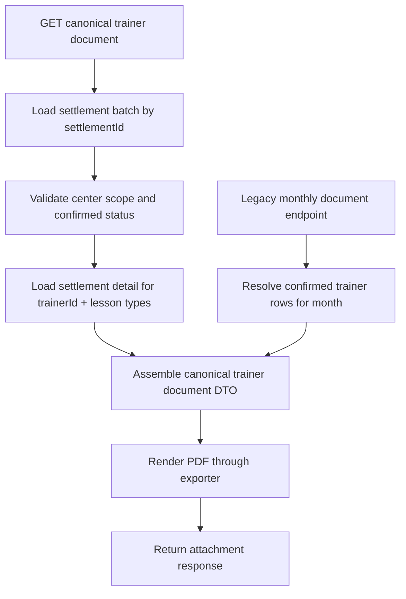

# feat: Add canonical settlement document by trainer

## Overview

생성형 정산 배치(`settlements` + `settlement_details`)가 canonical source-of-truth가 되었지만, 문서 출력은 여전히 월별 레거시 endpoint인 `GET /api/v1/settlements/trainer-payroll/document?settlementMonth=YYYY-MM`에 묶여 있다. 이 계획은 문서 출력 기준을 `settlementId + trainerId`로 명시적으로 전환해, 생성한 배치의 특정 트레이너 정산서를 바로 출력할 수 있게 만드는 구현 방향을 정리한다.

## Problem Frame

현재 문서 출력은 월 전체 confirmed snapshot을 한 번에 PDF로 내보내는 방식이다. 이 구조는 기존 운영 흐름에는 맞지만, 새 생성형 정산 흐름에서 방금 만든 배치의 특정 detail을 바로 문서화하려는 요구와는 맞지 않는다. 문서 식별자가 `settlementMonth` 하나뿐이라 어떤 batch의 어떤 trainer 문서인지 표현할 수 없고, confirm 전에 문서 preview를 지원하기도 어렵다.

새 생성형 정산 API 문서에도 `settlementId + trainerId` 조합으로 문서를 식별할 수 있다는 해석이 이미 적혀 있으므로, 이제 문서 출력 endpoint와 exporter/service 경계를 그 식별자 기준으로 실제 정렬해야 한다.

## Requirements Trace

- R1. 생성형 정산 배치의 개별 트레이너 문서를 `settlementId + trainerId` 기준으로 조회/출력할 수 있어야 한다.
- R2. 문서 내용은 canonical `settlement_details` 기준으로 만들어져야 하며, 더 이상 월 전체 snapshot 조회에만 의존하지 않아야 한다.
- R3. 기존 운영용 `/trainer-payroll/document?settlementMonth=...` 흐름은 즉시 제거하지 않고 호환 또는 명시적 bridge 정책을 가져야 한다.
- R4. API 계약과 PDF 파일명, 권한, not-found/validation 규칙이 `docs/04_API_설계서.md`와 함께 동기화되어야 한다.

## Scope Boundaries

- 월 전체 운영용 PDF를 대체할지 유지할지에 대한 최종 제품 결정 자체는 이번 계획의 범위를 넘는다. 이번 계획은 canonical trainer document endpoint 추가와 bridge 정책 정리에 집중한다.
- PDF 레이아웃 자체를 대대적으로 리디자인하지 않는다.
- `PAID` 상태나 지급 이력 workflow는 이번 계획에 포함하지 않는다.

## Context & Research

### Relevant Code and Patterns

- `backend/src/main/java/com/gymcrm/settlement/controller/TrainerPayrollSettlementController.java`
  기존 월 단위 PDF 다운로드 endpoint가 있고, 권한/response header 패턴을 이미 갖고 있다.
- `backend/src/main/java/com/gymcrm/settlement/TrainerSettlementDocumentExporter.java`
  현재 exporter는 `List<TrainerSettlement>`를 받아 월 전체 문서를 만든다. 단일 trainer detail 기준 DTO로 분리할 후보 지점이다.
- `backend/src/main/java/com/gymcrm/settlement/service/TrainerSettlementLifecycleService.java`
  confirm 시 `settlement_details`를 `trainer_settlements`로 bridge 저장하는 canonical-to-legacy 동기화 경계다.
- `backend/src/main/java/com/gymcrm/settlement/service/TrainerSettlementCreationService.java`
  `settlementId`, `trainerId`, period, 계산 필드를 canonical detail 단위로 이미 계산해둔다.
- `backend/src/main/java/com/gymcrm/settlement/repository/SettlementRepository.java`
- `backend/src/main/java/com/gymcrm/settlement/repository/SettlementDetailRepository.java`
  문서 출력의 canonical lookup 경로가 되어야 한다.

### Institutional Learnings

- `docs/solutions/database-issues/reservation-checkin-noshow-usage-event-integrity-gymcrm-20260225.md`
  정산처럼 운영 문서가 상태 이벤트에 기대는 경우, 상태 전이 source-of-truth와 문서용 projection을 분리하지 않으면 drift가 생긴다.
- `docs/solutions/documentation-gaps/prototype-plan-checklist-status-drift-gymcrm-20260227.md`
  구현과 문서 계약을 같은 delivery unit에서 같이 갱신해야 이후 workflow가 안정적이다.

### External References

- 없음. 현재 코드베이스 패턴과 기존 PDF exporter 구조만으로 계획 가능한 범위다.

## Key Technical Decisions

- 문서 식별자는 `settlementId` path parameter + `trainerId` query/path parameter 조합으로 명시한다.
  canonical batch와 그 하위 trainer detail을 동시에 식별해야 하기 때문이다.
- canonical trainer document 조회는 `settlement_details`를 직접 읽고, 필요한 경우 batch 메타데이터는 `settlements`에서 보강한다.
  레거시 `trainer_settlements`는 호환 snapshot으로만 취급한다.
- 기존 `/trainer-payroll/document`는 유지하되, 내부 구현은 새 document 조회 service를 재사용하는 bridge 형태로 정리한다.
  운영 surface를 깨지 않으면서 canonical path를 중심으로 로직을 수렴하기 위함이다.
- exporter 입력 타입은 월 전체 `List<TrainerSettlement>` 하나만 받는 구조에서, 단일 trainer document DTO를 받을 수 있게 확장한다.
  새로운 endpoint는 한 명 문서가 기준이기 때문이다.

## Open Questions

### Resolved During Planning

- Q. 기존 월 전체 document endpoint를 당장 제거해야 하나?
  A. 아니오. 운영 surface 회귀를 줄이기 위해 유지하되, 내부 구현을 canonical document service 재사용 구조로 정리한다.
- Q. 문서 출력은 confirmed만 허용할까, draft preview도 허용할까?
  A. 1차 구현은 confirmed만 허용한다. 현재 기존 document endpoint 계약도 confirmed-only이고, draft preview는 제품 규칙이 추가로 필요하다.

### Deferred to Implementation

- Q. 새 endpoint를 `/api/v1/settlements/{settlementId}/document`로 둘지, `/api/v1/settlements/{settlementId}/trainers/{trainerId}/document`로 둘지?
  A. 구현 시 controller 매핑과 문서 가독성을 비교해 확정한다. 핵심은 `settlementId + trainerId` 식별자 조합 보장이다.
- Q. PDF 안에 bonus/deduction/gx 섹션을 즉시 노출할지?
  A. 다음 계획(실집계 반영) 결과에 따라 달라질 수 있으므로, 문서 섹션 구조는 구현 시 현재 canonical 필드 존재 여부를 보고 최소 반영한다.

## High-Level Technical Design

> *This illustrates the intended approach and is directional guidance for review, not implementation specification. The implementing agent should treat it as context, not code to reproduce.*

## Implementation Units

- [x] **Unit 1: Define canonical trainer document contract**

**Goal:** `settlementId + trainerId` 기준 문서 출력 API 계약과 문서 규칙을 확정한다.

**Requirements:** R1, R4

**Dependencies:** 없음

**Files:**
- Modify: `docs/04_API_설계서.md`
- Modify: `backend/src/main/java/com/gymcrm/settlement/controller/TrainerPayrollSettlementController.java`
- Test: `backend/src/test/java/com/gymcrm/settlement/SalesSettlementApiIntegrationTest.java`

**Approach:**
- 새 endpoint path/query shape를 정하고, 권한/상태/not-found 규칙을 API 설계서와 controller 설계에 반영한다.
- 기존 `/trainer-payroll/document`는 “legacy monthly bridge”로 문서에 위치를 명확히 남긴다.

**Patterns to follow:**
- `backend/src/main/java/com/gymcrm/settlement/controller/SettlementController.java`
- `backend/src/main/java/com/gymcrm/settlement/controller/TrainerPayrollSettlementController.java`

**Test scenarios:**
- Happy path: confirmed settlement batch와 valid trainerId 조합으로 PDF 응답이 내려온다.
- Error path: 존재하지 않는 settlementId는 `NOT_FOUND`를 반환한다.
- Error path: batch에 없는 trainerId를 요청하면 `NOT_FOUND`를 반환한다.
- Error path: draft settlement batch는 문서 출력이 거부된다.
- Integration: API 설계서 예시와 실제 controller response header(`Content-Type`, `Content-Disposition`)가 일치한다.

**Verification:**
- 설계서에 새 canonical document endpoint가 명시되고, 테스트가 해당 contract를 검증한다.

- [x] **Unit 2: Add canonical document read service and repository path**

**Goal:** `settlementId + trainerId` 기준으로 문서용 canonical DTO를 구성하는 service/repository 경로를 만든다.

**Requirements:** R1, R2

**Dependencies:** Unit 1

**Files:**
- Modify: `backend/src/main/java/com/gymcrm/settlement/repository/SettlementRepository.java`
- Modify: `backend/src/main/java/com/gymcrm/settlement/repository/SettlementDetailRepository.java`
- Create: `backend/src/main/java/com/gymcrm/settlement/service/TrainerSettlementDocumentService.java`
- Test: `backend/src/test/java/com/gymcrm/settlement/SalesSettlementApiIntegrationTest.java`

**Approach:**
- batch lookup은 `settlements`, detail lookup은 `settlement_details`에서 수행한다.
- 단일 trainer 문서용 DTO는 period, trainer identity, PT/GX/bonus/deduction/total, batch status/confirmed metadata를 함께 담는다.
- 1차에서는 canonical detail이 없는 trainer 요청을 명확하게 `NOT_FOUND`로 처리한다.

**Execution note:** Start with a failing integration test for the canonical document lookup contract.

**Patterns to follow:**
- `backend/src/main/java/com/gymcrm/settlement/service/TrainerSettlementCreationService.java`
- `backend/src/main/java/com/gymcrm/settlement/repository/SettlementDetailRepository.java`

**Test scenarios:**
- Happy path: confirmed batch의 PT detail을 문서 DTO로 읽어온다.
- Edge case: batch는 존재하지만 trainer detail이 하나도 없으면 문서 DTO 생성이 실패한다.
- Error path: center scope가 다른 settlementId는 조회되지 않는다.
- Integration: confirm 후 bridge snapshot 존재 여부와 무관하게 canonical detail만으로 문서 DTO를 만들 수 있다.

**Verification:**
- 단일 trainer 문서용 service가 canonical batch/detail만으로 동작하고, 레거시 snapshot 직접 조회를 요구하지 않는다.

- [x] **Unit 3: Refactor exporter for single-trainer document rendering**

**Goal:** exporter가 월 전체 목록이 아니라 단일 trainer document DTO도 렌더링할 수 있게 확장한다.

**Requirements:** R1, R2

**Dependencies:** Unit 2

**Files:**
- Modify: `backend/src/main/java/com/gymcrm/settlement/TrainerSettlementDocumentExporter.java`
- Modify: `backend/src/main/java/com/gymcrm/settlement/controller/TrainerPayrollSettlementController.java`
- Test: `backend/src/test/java/com/gymcrm/settlement/SalesSettlementApiIntegrationTest.java`

**Approach:**
- exporter 입력 모델을 분리해 “single trainer statement”를 1급 타입으로 다룬다.
- 현재 단순 line-based PDF를 유지하되, period/trainer/calculation/status 섹션을 canonical fields 중심으로 재배치한다.
- 파일명은 `settlement-{settlementId}-trainer-{trainerId}.pdf` 또는 동등한 검색 가능한 규칙으로 정한다.

**Patterns to follow:**
- `backend/src/main/java/com/gymcrm/settlement/TrainerSettlementDocumentExporter.java`
- `backend/src/main/java/com/gymcrm/settlement/controller/SalesSettlementReportController.java`

**Test scenarios:**
- Happy path: PDF 다운로드 응답의 파일명이 settlement/trainer 식별자를 포함한다.
- Edge case: 한글 trainer name이 포함되어도 PDF 생성이 실패하지 않는다.
- Integration: controller -> service -> exporter -> binary response 체인이 실제 confirmed data로 동작한다.

**Verification:**
- 새 endpoint 호출 시 PDF binary가 반환되고, 내용 생성 경로가 canonical service를 통과한다.

- [x] **Unit 4: Bridge legacy monthly document endpoint to canonical service**

**Goal:** 기존 월 전체 document endpoint를 유지하면서 내부 로직을 새 canonical document service 기준으로 수렴시킨다.

**Requirements:** R3, R4

**Dependencies:** Unit 3

**Files:**
- Modify: `backend/src/main/java/com/gymcrm/settlement/controller/TrainerPayrollSettlementController.java`
- Modify: `backend/src/main/java/com/gymcrm/settlement/service/TrainerPayrollSettlementService.java`
- Modify: `docs/04_API_설계서.md`
- Test: `backend/src/test/java/com/gymcrm/settlement/SalesSettlementApiIntegrationTest.java`

**Approach:**
- legacy monthly endpoint는 confirmed month rows를 찾은 뒤, trainer별 canonical document DTO 집합을 exporter에 넘기거나 legacy용 wrapper를 유지하되 canonical assembler를 재사용한다.
- “어떤 endpoint가 canonical이고 어떤 endpoint가 bridge인지”를 문서와 코드 naming에서 분명히 남긴다.

**Patterns to follow:**
- `backend/src/main/java/com/gymcrm/settlement/service/TrainerSettlementLifecycleService.java`
- `backend/src/main/java/com/gymcrm/settlement/controller/TrainerPayrollSettlementController.java`

**Test scenarios:**
- Happy path: 기존 `settlementMonth` 기반 월 전체 PDF 다운로드가 계속 동작한다.
- Integration: canonical detail/bridge snapshot가 모두 존재하는 confirmed month에서 legacy endpoint가 회귀 없이 응답한다.
- Unchanged invariant: 기존 운영 권한(ADMIN, MANAGER, DESK)과 월 전체 document 다운로드 surface는 유지된다.

**Verification:**
- 새 canonical endpoint와 기존 monthly endpoint가 함께 동작하고, 내부 중복 로직이 줄어든다.

## System-Wide Impact

- **Interaction graph:** 생성형 confirm flow(`SettlementController` -> `TrainerSettlementLifecycleService`)와 운영용 document flow(`TrainerPayrollSettlementController`)가 같은 canonical batch/detail를 참조하게 된다.
- **Error propagation:** draft batch, 다른 센터 batch, missing trainer detail은 모두 API 예외로 명확히 surface되어야 하며 PDF exporter 내부에서 조용히 빈 문서를 만들면 안 된다.
- **State lifecycle risks:** confirm 이후에만 문서 출력이 가능하도록 상태 가드를 두지 않으면 draft values가 외부 문서로 노출될 수 있다.
- **API surface parity:** 기존 `/trainer-payroll/document`와 새 canonical document endpoint의 역할 차이를 문서와 코드에서 모두 분명히 해야 한다.
- **Integration coverage:** confirm -> canonical detail read -> exporter -> binary response 전체 체인을 통합 테스트로 검증해야 한다.
- **Unchanged invariants:** 기존 월별 snapshot confirm 및 월 전체 PDF 운영 흐름은 계속 살아 있어야 한다.

## Risks & Dependencies

| Risk | Mitigation |
|------|------------|
| canonical detail와 legacy snapshot이 문서 내용에서 불일치할 수 있음 | 문서용 source-of-truth를 canonical detail로 고정하고, bridge endpoint는 canonical assembler 재사용 구조로 수렴 |
| endpoint가 늘면서 운영자가 어떤 문서를 언제 써야 하는지 혼란스러울 수 있음 | API 설계서에 canonical/legacy 역할 차이를 명확히 기록 |
| PDF exporter 리팩터링 중 월 전체 문서가 깨질 수 있음 | 기존 monthly document 통합 테스트를 유지하고 새 canonical endpoint 테스트를 병행 |

## Documentation / Operational Notes

- `docs/04_API_설계서.md`에 canonical trainer document endpoint와 legacy monthly bridge endpoint의 차이를 함께 기록한다.
- 부록 C에 이번 문서 출력 contract 변경 이력을 추가한다.

## Sources & References

- API reference: `docs/04_API_설계서.md`
- Related code: `backend/src/main/java/com/gymcrm/settlement/controller/TrainerPayrollSettlementController.java`
- Related code: `backend/src/main/java/com/gymcrm/settlement/TrainerSettlementDocumentExporter.java`
- Related code: `backend/src/main/java/com/gymcrm/settlement/service/TrainerSettlementCreationService.java`
- Related code: `backend/src/main/java/com/gymcrm/settlement/service/TrainerSettlementLifecycleService.java`
- Related code: `backend/src/test/java/com/gymcrm/settlement/SalesSettlementApiIntegrationTest.java`
