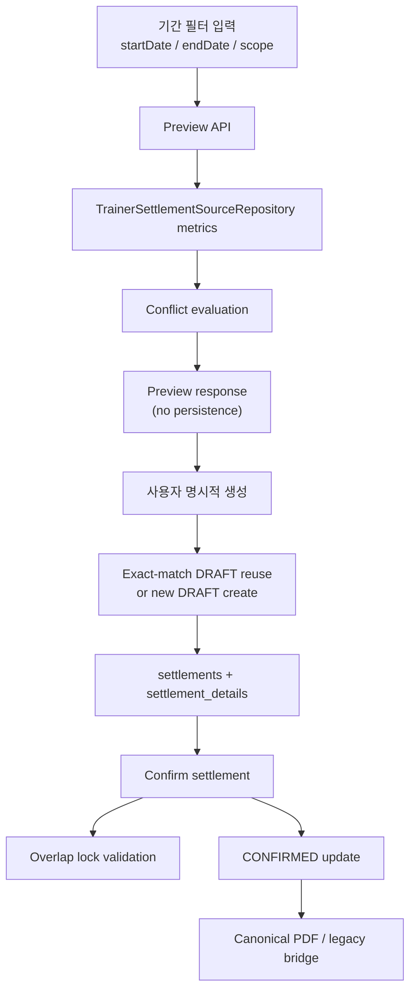

# feat: Add period-based trainer settlement workflow

> Superseded on 2026-04-10 by `/Users/abc/projects/GymCRM_V2/docs/plans/2026-04-10-003-plan-rollback-period-scope-settlements-to-monthly.md`.
> Current canonical direction is monthly settlement identity (`center_id + settlement_year + settlement_month`).

## Overview

트레이너 정산은 현재 프론트에서 `settlementMonth + sessionUnitPrice` 중심의 월별 조회/확정/문서 흐름으로 노출되고 있지만, 백엔드는 이미 생성형 `POST /api/v1/settlements`와 canonical 문서 출력 흐름을 일부 갖고 있다. 이번 계획은 정산의 공식 기준을 월에서 `시작일-종료일` 기간 기준으로 전환하고, 조회 미리보기와 DRAFT/CONFIRMED 정산 작업을 분리한 새로운 운영 워크플로우를 구축하는 방향을 정리한다.

핵심은 세 가지다. 첫째, 월 전용 canonical settlement 모델을 기간 기반 + 범위 기반 잠금 모델로 바꾼다. 둘째, 운영자와 트레이너 모두 같은 기간 언어를 사용하되 권한별 경험은 분리한다. 셋째, 현재 남아 있는 `trainer-payroll` 월별 surface는 즉시 제거하지 않고 명시적 bridge로 정리한다.

## Problem Frame

현재 구현은 다음과 같은 어긋남을 갖고 있다.

- 프론트 `frontend/src/pages/settlements/SettlementsPage.tsx`는 운영자 정산 탭에서 `settlementMonth`와 수동 `sessionUnitPrice` 입력을 전제로 한다.
- 트레이너 미니뷰도 `GET /api/v1/settlements/trainer-payroll/my-summary?settlementMonth=YYYY-MM` 기준이라 운영자와 다른 언어를 쓴다.
- 생성형 정산 API는 `periodStart` / `periodEnd`를 받지만, 실제 persistence와 validation은 `settlement_year + settlement_month` 중심으로 동작한다.
- 현재 `settlements`는 `uk_settlements_center_period(center_id, settlement_year, settlement_month)` 제약을 갖기 때문에 임의 기간 정산이나 범위 기반 overlap locking을 표현하지 못한다.

이번 계획은 브레인스토밍에서 확정한 제품 결정을 기술적으로 구현 가능하게 만드는 것이다.

- 운영자와 트레이너 모두 기간 기준 조회를 사용한다. (see origin: docs/brainstorms/2026-04-03-settlements-analytics-and-trainer-payroll-requirements.md)
- 조회는 미리보기일 뿐이며 persistence를 자동 생성하지 않는다.
- `ALL` 정산과 개별 트레이너 정산을 둘 다 지원한다.
- 확정된 정산은 범위 기반으로 기간 겹침을 차단한다.
- 정산 단가는 트레이너별 저장 단가를 source-of-truth로 사용한다.

## Requirements Trace

- R15-R17. 기간 기준 조회로 전환하고, 미리보기와 정산 작업을 분리한다.
- R18-R21. `ALL`/개별 트레이너 정산을 모두 지원하고, 범위 기반 overlap locking을 적용한다.
- R22. 단가는 트레이너별 저장 단가를 사용한다.
- R23-R25. 트레이너도 기간 기준 조회를 사용하되 본인 미리보기만 허용한다.
- R26-R27. 확정 후 PDF 문서 출력과 `/settlements` 내 자연스러운 접근 구조를 유지한다.
- Success Criteria. 운영자가 미리보기와 저장된 정산 작업을 혼동하지 않고, 트레이너도 같은 기간 언어로 본인 데이터를 조회할 수 있어야 한다.

## Scope Boundaries

- 매출 분석 탭의 KPI/추이/환불 목록 자체를 다시 설계하지 않는다.
- 급여 정책 자체의 사업 규칙 변경, bonus/deduction 수동 입력 UI, `PAID` 운영 프로세스는 이번 범위에 포함하지 않는다.
- 기존 월별 `trainer-payroll` surface는 즉시 삭제하지 않는다. 새 기간 기반 흐름이 자리잡을 때까지 bridge 또는 deprecated surface로 유지한다.
- 문서 레이아웃 전체 리디자인은 다루지 않는다.

## Context & Research

### Relevant Code and Patterns

- `frontend/src/pages/settlements/SettlementsPage.tsx`
  현재 운영자 정산 탭과 트레이너 미니뷰가 모두 월별 입력 중심이다.
- `frontend/src/pages/settlements/modules/types.ts`
  프론트 정산 타입이 `settlementMonth`와 수동 `sessionUnitPrice`에 묶여 있다.
- `frontend/src/pages/settlements/modules/useTrainerPayrollQuery.ts`
- `frontend/src/pages/settlements/modules/useTrainerMonthlyPtSummaryQuery.ts`
  운영자와 트레이너 조회가 별도 훅으로 나뉘어 있으며 둘 다 월 기반 계약을 전제한다.
- `backend/src/main/java/com/gymcrm/settlement/controller/SettlementController.java`
  생성형 정산의 진입점이며 `periodStart` / `periodEnd` request shape를 이미 사용한다.
- `backend/src/main/java/com/gymcrm/settlement/controller/TrainerPayrollSettlementController.java`
  운영용 월별 조회/확정/문서 bridge와 트레이너 월별 요약이 모여 있는 곳이다.
- `backend/src/main/java/com/gymcrm/settlement/service/TrainerSettlementCreationService.java`
  기간 기반 source metrics를 읽고 canonical `settlements` / `settlement_details`를 생성하는 현재 중심 서비스다.
- `backend/src/main/java/com/gymcrm/settlement/repository/SettlementRepository.java`
- `backend/src/main/java/com/gymcrm/settlement/repository/SettlementDetailRepository.java`
  현재는 `settlement_year + settlement_month` 배치 모델을 전제로 한다.
- `backend/src/main/java/com/gymcrm/settlement/repository/TrainerSettlementSourceRepository.java`
  기간 경계 기준 PT/GX/cancelled/no-show metrics를 이미 제공하므로 preview 계산 서비스의 기반이 된다.
- `backend/src/main/java/com/gymcrm/settlement/service/TrainerSettlementDocumentService.java`
  canonical `settlementId + trainerId` 문서 식별자를 이미 지원한다.

### Institutional Learnings

- `docs/solutions/database-issues/reservation-checkin-noshow-usage-event-integrity-gymcrm-20260225.md`
  completed / cancelled / no-show 집계는 상태별 event timestamp semantics를 source-of-truth로 따라야 한다.
- `docs/solutions/database-issues/reservation-capacity-and-usage-deduction-integrity-gymcrm-20260225.md`
  UI 가드와 서버 검증을 분리하고, canonical rule을 먼저 고정해야 운영 정합성이 유지된다.
- `docs/solutions/documentation-gaps/prototype-plan-checklist-status-drift-gymcrm-20260227.md`
  구현과 plan / API 문서를 같은 delivery unit에서 같이 갱신해야 drift를 줄일 수 있다.

### External References

- 없음. 현재 repo에 기간 집계, canonical settlement, PDF document까지 필요한 로컬 패턴이 충분히 존재한다.

## Key Technical Decisions

- `settlements`는 월 배치가 아니라 기간 정산 헤더로 재정의한다.
  `settlement_year` / `settlement_month` unique 모델만으로는 임의 기간과 overlap locking을 표현할 수 없기 때문이다.
- 기간 잠금 단위는 settlement header에서 명시한다.
  `scope_type = ALL | TRAINER`와 `scope_trainer_user_id`를 도입해, `ALL` 확정은 센터 전체 잠금, 개별 확정은 해당 트레이너 잠금으로 판정한다.
- 미리보기는 persistence 없는 별도 조회 경로로 둔다.
  조회만으로 DRAFT를 남기지 않기 위해 preview와 create를 분리한다.
- 운영자와 트레이너는 같은 기간 모델을 공유하되 API surface는 역할별로 분리한다.
  운영자는 `ALL/개별` preview와 DRAFT/CONFIRMED 작업이 필요하고, 트레이너는 본인 preview만 필요하기 때문이다.
- preview 계약은 읽기 전용 aggregate contract로 고정한다.
  1차 구현은 `GET` 기반 조회로 두고, 응답에는 `period`, `scope`, `rows`, `summary`, `conflict` metadata를 포함해 프론트가 미리보기와 충돌 상태를 한 번에 표현할 수 있게 한다.
- 수동 세션 단가 입력은 새 기간 기반 흐름에서 제거한다.
  source-of-truth는 `users.pt_session_unit_price`, `users.gx_session_unit_price`다.
- DRAFT는 exact-match 재사용을 기본 정책으로 둔다.
  같은 center, 같은 `period_start`/`period_end`, 같은 `scope_type`, 같은 `scope_trainer_user_id`의 활성 DRAFT가 있으면 새 row를 만들지 않고 기존 settlement를 재사용한다.
- 기존 월별 `trainer-payroll` endpoints는 새 기간 기반 흐름 위에 얇은 bridge로 남긴다.
  프론트 전환과 운영 회귀를 분리해 리스크를 줄이기 위함이다.
- 트레이너 권한은 period preview까지로 제한한다.
  트레이너 요청에서는 항상 `scope_type=TRAINER`, `scope_trainer_user_id=currentUserId`로 강제하고, 타인 trainerId 또는 `ALL` 입력은 무시 또는 access denied 처리한다.

## Decision Matrix

### Overlap Locking

| Existing confirmed settlement | New request | Expected result |
|---|---|---|
| `ALL`, overlapping period | `ALL`, overlapping period | 차단 |
| `ALL`, overlapping period | `TRAINER(A)`, overlapping period | 차단 |
| `TRAINER(A)`, overlapping period | `ALL`, overlapping period | 차단 |
| `TRAINER(A)`, overlapping period | `TRAINER(A)`, overlapping period | 차단 |
| `TRAINER(A)`, overlapping period | `TRAINER(B)`, overlapping period | 허용 |
| non-overlapping any scope | any scope | 허용 |

### DRAFT Reuse and Lifecycle

| Existing draft state | New create request | Expected result |
|---|---|---|
| exact-match DRAFT exists | same period + same scope | 기존 DRAFT 재사용 |
| different scope same period | create allowed | 별도 DRAFT 생성 |
| same scope different period | create allowed | 별도 DRAFT 생성 |
| CONFIRMED exact-match exists | same period + same scope | create 차단 |
| DRAFT exists, preview only | preview request | persistence 생성 안 함 |

### Preview Contract Shape

| Field group | Purpose |
|---|---|
| `period.start`, `period.end` | 현재 미리보기 기준 기간 |
| `scope.type`, `scope.trainerId` | `ALL` 또는 특정 트레이너 범위 |
| `rows[]` | 트레이너별 PT/GX/취소/노쇼/금액 요약 |
| `summary` | 전체 합계 및 조회 대상 수 |
| `conflict.hasConflict`, `conflict.reason`, `conflict.matchedSettlementId` | 생성/확정 불가 여부를 UI가 즉시 안내하기 위한 metadata |

## Open Questions

### Resolved During Planning

- Q. 기간 overlap locking은 센터 전체와 개별 트레이너를 어떻게 함께 지원할 것인가?
  A. settlement header에 범위 정보를 저장해 `ALL`은 센터 전체, `TRAINER`는 특정 트레이너 잠금으로 판정한다.
- Q. 조회와 DRAFT 생성은 한 동작인가?
  A. 아니다. preview는 persistence를 만들지 않고, create만 DRAFT를 만든다.
- Q. 운영자와 트레이너의 기간 기준을 따로 둘 것인가?
  A. 아니다. 둘 다 기간 기준으로 통일하고 권한만 분기한다.
- Q. preview API의 기본 성격은 무엇인가?
  A. 읽기 전용 aggregate 조회다. preview는 persistence를 만들지 않고, create 가능 여부를 판단할 conflict metadata만 함께 제공한다.

### Deferred to Implementation

- Q. 기존 `settlement_year` / `settlement_month` 컬럼을 완전히 제거할지, 마이그레이션 중간 단계에서 파생 보조 컬럼으로 유지할지?
  A. 실행 시 DB migration 안전성과 legacy query 영향도를 보며 확정한다.
- Q. 트레이너 본인에게 PDF 열람까지 열어줄지, 이번 단계에서는 조회만 남길지?
  A. 요구사항은 조회 중심이므로 planning 기준은 조회만 우선이고, 실제 문서 열람 연동은 구현 시 권한 surface를 재검토한다.

## High-Level Technical Design

> *This illustrates the intended approach and is directional guidance for review, not implementation specification. The implementing agent should treat it as context, not code to reproduce.*

| Surface | 기준 | persistence | 대상 |
|---|---|---|---|
| 운영자 preview | 기간 + `ALL/개별 트레이너` | 없음 | 탐색/검토 |
| 운영자 create/confirm | 기간 + `ALL/개별 트레이너` | DRAFT/CONFIRMED | 업무 객체 |
| 트레이너 preview | 기간 + 본인 | 없음 | 본인 조회 |
| legacy monthly bridge | 월 전체 | 내부적으로 기간 변환 | 기존 운영 회귀 방지 |

## Implementation Units

- [x] **Unit 1: 기간 기반 settlement header와 overlap locking 모델로 canonical schema 전환**

**Goal:** 월 전용 `settlements` 모델을 기간 + 범위 기반 canonical settlement 모델로 바꾸고, overlap locking의 기반을 만든다.

**Requirements:** R18-R21, Success Criteria

**Dependencies:** 없음

**Files:**
- Add: `backend/src/main/resources/db/migration/V36__convert_settlements_to_period_scope.sql`
- Modify: `backend/src/main/java/com/gymcrm/settlement/entity/SettlementEntity.java`
- Modify: `backend/src/main/java/com/gymcrm/settlement/entity/Settlement.java`
- Modify: `backend/src/main/java/com/gymcrm/settlement/repository/SettlementJpaRepository.java`
- Modify: `backend/src/main/java/com/gymcrm/settlement/repository/SettlementRepository.java`
- Test: `backend/src/test/java/com/gymcrm/settlement/SalesSettlementApiIntegrationTest.java`

**Approach:**
- settlement header에 `period_start`, `period_end`, `scope_type`, `scope_trainer_user_id`를 추가한다.
- 새 migration에서 기존 settlement row를 `해당 월 1일 ~ 말일`, `scope_type=ALL`, `scope_trainer_user_id=NULL`로 backfill해 legacy data를 period model로 승격한다.
- 기존 `uk_settlements_center_period` 월 고유 제약은 기간 기반 exact-match 또는 overlap validation 조합으로 대체한다.
- overlap 자체는 단순 unique index로 표현하기 어렵기 때문에 repository query + service validation을 canonical rule로 둔다.
- `CONFIRMED` settlement 생성/확정 시 overlap 검사 규칙을 공통 서비스로 모아 preview/create/confirm 흐름이 같은 판정을 쓰게 한다.
- 기존 monthly bridge를 위해 월 전체 기간을 판정할 수 있는 helper는 유지하되, canonical identity는 더 이상 연월이 아니게 만든다.
- backfill migration은 실행 후 `period_start <= period_end`, `scope_type=ALL`, 기존 월 row count 보존 여부를 검증할 수 있는 체크 포인트를 남긴다.

**Execution note:** Start with a failing integration test for confirmed overlap conflicts before changing the schema.

**Patterns to follow:**
- `backend/src/main/java/com/gymcrm/settlement/repository/SettlementRepository.java`
- `docs/solutions/database-issues/reservation-capacity-and-usage-deduction-integrity-gymcrm-20260225.md`

**Test scenarios:**
- Happy path: `ALL` scope DRAFT settlement가 특정 기간으로 생성된다.
- Happy path: trainer scope DRAFT settlement가 같은 기간에 다른 trainer로는 생성 가능하다.
- Error path: 기존 `CONFIRMED ALL` settlement와 겹치는 기간의 새 settlement는 create/confirm 모두 차단된다.
- Error path: 기존 `CONFIRMED TRAINER` settlement와 같은 trainer 기간이 겹치면 차단되고, 다른 trainer면 허용된다.
- Integration: 기존 월 기준 batch 데이터가 있는 상태에서도 새 period columns를 읽고 `settlementId` 조회가 동작한다.
- Integration: migration 이후 기존 month-based row가 full-month period + `ALL` scope로 backfill되어 legacy bridge lookup과 canonical lookup이 모두 동작한다.
- Integration: exact-match DRAFT 재생성 요청은 새 settlement row를 만들지 않고 기존 settlementId를 반환한다.

**Verification:**
- settlement header가 기간과 범위를 직접 표현하고, overlap locking 판정이 service/repository에서 재사용된다.

- [x] **Unit 2: 기간 기반 preview / create / confirm API를 역할별로 재정렬**

**Goal:** 운영자 preview와 create/confirm, 트레이너 본인 preview를 period-based API surface로 정렬한다.

**Requirements:** R15-R16, R18-R25

**Dependencies:** Unit 1

**Files:**
- Modify: `backend/src/main/java/com/gymcrm/settlement/controller/SettlementController.java`
- Modify: `backend/src/main/java/com/gymcrm/settlement/controller/TrainerPayrollSettlementController.java`
- Add: `backend/src/main/java/com/gymcrm/settlement/dto/request/PreviewTrainerSettlementRequest.java`
- Add: `backend/src/main/java/com/gymcrm/settlement/dto/response/PreviewTrainerSettlementResponse.java`
- Modify: `backend/src/main/java/com/gymcrm/settlement/service/TrainerSettlementCreationService.java`
- Add: `backend/src/main/java/com/gymcrm/settlement/service/TrainerSettlementPreviewService.java`
- Modify: `backend/src/main/java/com/gymcrm/settlement/service/TrainerPayrollSettlementService.java`
- Test: `backend/src/test/java/com/gymcrm/settlement/SalesSettlementApiIntegrationTest.java`
- Test: `backend/src/test/java/com/gymcrm/settlement/TrainerPayrollSettlementServiceIntegrationTest.java`

**Approach:**
- 운영자용 preview는 persistence 없는 별도 endpoint로 분리하고, create는 현재 `POST /api/v1/settlements`를 period-based DRAFT 생성으로 유지한다.
- preview와 create는 동일한 source metrics assembler를 재사용하되, preview는 `settlementId` 없이 결과만 반환한다.
- 트레이너 본인 조회는 `settlementMonth` 대신 `periodStart` / `periodEnd`를 받는 기간 기준 summary 또는 preview 계약으로 바꾼다.
- 수동 `sessionUnitPrice` 입력은 제거하고, 모든 amount 계산은 저장 단가를 사용한다.
- overlap conflict는 create/confirm에서 강제하고, preview는 충돌 여부를 metadata로 알려줄지 여부를 같은 response envelope 내에서 결정한다.
- 트레이너 요청에서는 서버가 현재 사용자 ID를 강제 주입해 타인 `trainerId` 또는 `ALL` 스코프 접근을 차단한다.
- preview endpoint는 `GET /api/v1/settlements/preview` 또는 동등한 읽기 전용 contract를 우선 검토하고, create/confirm과 분리된 캐시/query key를 갖게 한다.

**Patterns to follow:**
- `backend/src/main/java/com/gymcrm/settlement/service/TrainerSettlementCreationService.java`
- `backend/src/main/java/com/gymcrm/settlement/repository/TrainerSettlementSourceRepository.java`

**Test scenarios:**
- Happy path: 운영자 preview가 기간 + `ALL` 요청으로 trainer별 preview 합계를 반환한다.
- Happy path: 운영자 create가 같은 입력으로 DRAFT settlement를 만들고 저장 단가 기준 amount를 채운다.
- Happy path: 트레이너 본인 summary/preview가 기간 기준으로 본인 데이터만 반환한다.
- Edge case: `periodStart > periodEnd` 또는 빈 기간은 validation error를 반환한다.
- Error path: 저장 단가가 없는 trainer가 포함되면 create는 business rule error를 반환하고 preview는 명확한 경고 상태를 반환한다.
- Error path: 트레이너 권한으로 타인 `trainerId` 또는 `ALL` scope를 요청하면 access denied 또는 강제 본인 스코프로 정규화된다.
- Integration: preview 결과와 같은 입력으로 create한 DRAFT의 집계 값이 일치한다.
- Integration: exact-match DRAFT가 있는 상태에서 create는 기존 settlementId를 반환하고 duplicate detail을 만들지 않는다.

**Verification:**
- 운영자와 트레이너 모두 기간 기준 API를 사용하고, 수동 단가 입력이 backend contract에서 사라진다.

- [x] **Unit 3: `/settlements` 프론트 UI를 preview/workspace 분리형 period workflow로 재구성**

**Goal:** 현재 월별 정산 탭과 트레이너 미니뷰를 기간 기준 preview/workspace UX로 바꾼다.

**Requirements:** R15-R17, R22-R27

**Dependencies:** Unit 2

**Files:**
- Modify: `frontend/src/pages/settlements/SettlementsPage.tsx`
- Modify: `frontend/src/pages/settlements/SettlementsPage.module.css`
- Modify: `frontend/src/pages/settlements/modules/types.ts`
- Modify: `frontend/src/pages/settlements/modules/settlementTabs.ts`
- Replace: `frontend/src/pages/settlements/modules/useTrainerPayrollQuery.ts`
- Replace: `frontend/src/pages/settlements/modules/useTrainerPayrollPrototypeState.ts`
- Replace: `frontend/src/pages/settlements/modules/useTrainerMonthlyPtSummaryQuery.ts`
- Add: `frontend/src/pages/settlements/modules/useTrainerSettlementPreviewQuery.ts`
- Add: `frontend/src/pages/settlements/modules/useTrainerSettlementWorkspaceState.ts`
- Modify: `frontend/src/pages/settlements/SettlementsPage.test.tsx`
- Test: `frontend/src/pages/settlements/modules/useTrainerSettlementPreviewQuery.test.tsx`
- Test: `frontend/src/pages/settlements/modules/useTrainerSettlementWorkspaceState.test.tsx`
- Modify: `frontend/src/api/mockData.ts`
- Modify: `frontend/src/api/mockData.test.ts`

**Approach:**
- 운영자 정산 탭은 `기간 조회 패널`과 `정산 작업 패널`을 분리하고, preview 결과와 저장된 settlement 상태를 명확히 구분해 표시한다.
- 기본 기간은 `이번 달 1일 ~ 오늘`로 두고, `이번 달 전체`, `지난달 전체`, `최근 30일` 프리셋을 추가한다.
- 기존 세션 단가 입력 UI는 제거하고, 저장 단가 기준 안내/경고로 바꾼다.
- 트레이너 미니뷰도 `조회 월` 입력 대신 기간 선택으로 바꾸되, 결과는 본인 preview 카드 중심의 단순 경험으로 유지한다.
- 새 API로 넘어가기 전까지 mock mode도 같은 period contract를 흉내 내도록 갱신한다.
- 기간이 바뀌면 기존 preview 결과와 작업 패널의 active settlement 참조를 분리해 stale DRAFT가 현재 조회 결과처럼 보이지 않게 만든다.
- preview 성공 직후 create하면 작업 패널이 해당 DRAFT를 active settlement로 승격하고, confirm 후에는 canonical settlement detail 재조회로 상태를 갱신한다.

**Patterns to follow:**
- `frontend/src/pages/settlements/modules/useSettlementPrototypeState.ts`
- `frontend/src/pages/settlements/modules/useSettlementReportQuery.ts`

**Test scenarios:**
- Happy path: 운영자 탭 기본값이 `이번 달 1일 ~ 오늘`로 채워지고 preview 조회가 동작한다.
- Happy path: preset 선택 시 기간 입력이 즉시 바뀌고 새로운 preview query key가 적용된다.
- Happy path: 트레이너 미니뷰가 같은 기간 필터를 사용하되 본인 결과만 렌더링한다.
- Edge case: 조회만 수행한 상태에서는 create/confirm/document 액션이 잘못 활성화되지 않는다.
- Error path: preview conflict 또는 단가 누락 경고가 있으면 UI에 명확한 안내가 표시된다.
- Integration: 운영자 화면에서 preview 후 create를 누르면 DRAFT 상태 패널이 갱신된다.
- Integration: 기간 변경 후 이전 DRAFT 패널이 현재 preview 결과처럼 재사용되지 않고, 사용자가 명시적으로 다시 선택/생성해야 한다.
- Integration: confirm 성공 후 작업 패널 상태가 `CONFIRMED`로 바뀌고 document 버튼이 활성화된다.

**Verification:**
- `/settlements` 프론트가 더 이상 `settlementMonth + sessionUnitPrice`에 의존하지 않고, preview와 정산 작업을 다른 상태로 표현한다.

- [x] **Unit 4: canonical document/legacy bridge를 period workflow 기준으로 정리**

**Goal:** 기간 기반 DRAFT/CONFIRMED settlement와 기존 monthly bridge, canonical PDF surface를 함께 유지 가능한 상태로 만든다.

**Requirements:** R19-R21, R26-R27

**Dependencies:** Unit 2

**Files:**
- Modify: `backend/src/main/java/com/gymcrm/settlement/service/TrainerSettlementLifecycleService.java`
- Modify: `backend/src/main/java/com/gymcrm/settlement/service/TrainerSettlementDocumentService.java`
- Modify: `backend/src/main/java/com/gymcrm/settlement/controller/TrainerPayrollSettlementController.java`
- Modify: `backend/src/main/java/com/gymcrm/settlement/TrainerSettlementDocumentExporter.java`
- Test: `backend/src/test/java/com/gymcrm/settlement/SalesSettlementApiIntegrationTest.java`
- Test: `backend/src/test/java/com/gymcrm/settlement/TrainerSettlementDocumentServiceTest.java`
- Test: `backend/src/test/java/com/gymcrm/settlement/TrainerSettlementDocumentExporterTest.java`

**Approach:**
- confirm는 period-based settlement를 `CONFIRMED`로 전이하고, 이후 canonical document가 period metadata를 직접 읽도록 유지한다.
- legacy monthly `/trainer-payroll/document`와 `/trainer-payroll/confirm`는 “월 전체 기간” 입력을 새 canonical 흐름으로 브리지하는 thin layer로 축소한다.
- bridge는 “월 전체 기간에 해당하는 exact-match confirmed settlement를 찾는다” 또는 “legacy snapshot을 유지하되 canonical source-of-truth를 재사용한다” 중 하나로 수렴해야 한다.
- canonical `settlementId + trainerId` document는 계속 중심 surface로 남기고, 프론트 새 workflow도 이 문서 출력에 맞춘다.

**Patterns to follow:**
- `backend/src/main/java/com/gymcrm/settlement/service/TrainerSettlementDocumentService.java`
- `docs/plans/2026-04-08-003-feat-canonical-settlement-document-by-trainer-plan.md`

**Test scenarios:**
- Happy path: period-based settlement confirm 후 canonical document가 같은 period metadata로 PDF를 생성한다.
- Happy path: 월 전체 기간 settlement는 legacy monthly document endpoint에서도 계속 다운로드된다.
- Error path: overlap conflict settlement는 confirm되지 않으며 document 출력도 되지 않는다.
- Integration: create -> confirm -> document 흐름이 period-based settlementId 기준으로 끝까지 동작한다.
- Unchanged invariant: existing monthly bridge endpoint의 권한 surface는 유지된다.

**Verification:**
- canonical document는 period settlement를 직접 읽고, legacy monthly endpoint는 명시적 bridge로만 남는다.

- [x] **Unit 5: API/DB 문서와 회귀 테스트를 period model 기준으로 동기화**

**Goal:** 새 period workflow가 문서, migration 설명, 회귀 테스트에 동일하게 반영되도록 한다.

**Requirements:** All traced requirements

**Dependencies:** Unit 1, Unit 2, Unit 3, Unit 4

**Files:**
- Modify: `docs/04_API_설계서.md`
- Modify: `docs/03_데이터베이스_설계서.md`
- Modify: `docs/brainstorms/2026-04-03-settlements-analytics-and-trainer-payroll-requirements.md`
- Modify: `backend/src/test/java/com/gymcrm/settlement/SalesSettlementApiIntegrationTest.java`
- Modify: `frontend/src/pages/settlements/SettlementsPage.test.tsx`

**Approach:**
- API 설계서에서 `trainer-payroll` 월 기준 계약과 `POST /api/v1/settlements` 구현 메모를 period-based reality에 맞게 다시 정렬한다.
- Appendix C에 이번 계약 변경을 기록한다.
- DB 설계서의 `settlements` / `settlement_details` 정의도 월 배치 설명에서 기간 settlement 설명으로 갱신한다.
- 브레인스토밍 문서의 구현 동기화 메모는 완료 상태에 맞게 업데이트한다.

**Patterns to follow:**
- `docs/04_API_설계서.md`의 부록 C 변경 이력 형식
- `docs/solutions/documentation-gaps/prototype-plan-checklist-status-drift-gymcrm-20260227.md`

**Test scenarios:**
- Documentation: API 설계서 request/response/비즈니스 규칙이 실제 period contract와 일치한다.
- Integration: backend 대표 흐름 테스트가 preview/create/confirm/document/legacy bridge 회귀를 함께 덮는다.
- Integration: frontend 대표 흐름 테스트가 period presets, preview, DRAFT 상태 갱신을 검증한다.

**Verification:**
- 문서와 테스트가 새 period workflow를 같은 용어와 같은 규칙으로 설명한다.

## System-Wide Impact

- **Interaction graph:** `SettlementsPage` 프론트 상태, `SettlementController`, `TrainerPayrollSettlementController`, `TrainerSettlementCreationService`, `TrainerSettlementLifecycleService`, `TrainerSettlementDocumentService`가 모두 같은 period model을 공유하게 된다.
- **Error propagation:** overlap conflict, 단가 누락, invalid period는 preview/create/confirm과 UI 경고 전반에서 일관된 에러 모델로 surface되어야 한다.
- **State lifecycle risks:** preview와 DRAFT 생성 상태가 섞이면 잘못된 confirm/document 액션이 열릴 수 있다. UI와 backend 상태 가드가 모두 필요하다.
- **API surface parity:** 운영자 period workflow, 트레이너 본인 preview, canonical document, legacy monthly bridge가 같은 source-of-truth를 바라봐야 한다.
- **Integration coverage:** create -> confirm -> document와 monthly bridge 회귀는 단위 테스트만으로 부족하므로 통합 테스트로 고정해야 한다.
- **Unchanged invariants:** 매출 분석 탭의 KPI/추이/환불 목록, existing canonical document binary response 형태, trainer rate source-of-truth는 유지된다.

## Risks & Dependencies

| Risk | Mitigation |
|------|------------|
| 월 기반 settlement schema를 기간 모델로 바꾸면서 기존 data/query가 깨질 수 있음 | 새 migration에서 기존 row를 full-month period + `ALL` scope로 backfill하고, legacy monthly bridge를 기간 exact-match wrapper로 유지 |
| overlap locking 규칙이 UI와 backend에서 다르게 해석될 수 있음 | canonical service에서 판정하고 UI는 그 결과만 표시 |
| preview와 create를 분리하면서 프론트 상태 관리가 복잡해질 수 있음 | preview state와 settlement workspace state를 별도 훅으로 분리 |
| trainer rate 누락이 period workflow에서 더 자주 노출될 수 있음 | preview 단계 경고 + create 단계 business rule 차단으로 조기 surface |

## Documentation / Operational Notes

- `docs/04_API_설계서.md` 부록 C에 period-based settlement workflow 전환 이력을 추가해야 한다.
- `docs/03_데이터베이스_설계서.md`의 settlements 설명은 더 이상 `settlement_year/settlement_month` 중심으로만 두면 안 된다.
- legacy monthly endpoints는 deprecated 또는 bridge 표기를 문서 본문에 명확히 남겨야 한다.

## Operational / Rollout Notes

- migration 직후 확인할 최소 검증 포인트를 준비한다.
  - 기존 `settlements` row 수와 period backfill 후 row 수가 동일한지
  - backfill된 row의 `period_start` / `period_end`가 해당 월 전체를 가리키는지
  - `scope_type=ALL`, `scope_trainer_user_id IS NULL`가 기존 row에 일관되게 채워졌는지
- 롤백 전략은 새 period columns를 남긴 채 legacy monthly bridge를 우선 유지하는 방향으로 잡는다.
  period workflow UI/API가 문제를 일으켜도 월 전체 exact-match bridge가 계속 동작해야 운영 영향을 줄일 수 있다.
- 배포 초기에 운영자에게는 “preview와 저장된 정산 작업이 다르다”는 점을 UI 문구로 분명히 안내해야 한다.

## Sources & References

- **Origin document:** `docs/brainstorms/2026-04-03-settlements-analytics-and-trainer-payroll-requirements.md`
- Related plan: `docs/plans/2026-04-08-002-plan-restore-original-4-10-trainer-settlement-create-api.md`
- Related plan: `docs/plans/2026-04-08-003-feat-canonical-settlement-document-by-trainer-plan.md`
- Related plan: `docs/plans/2026-04-08-004-feat-trainer-settlement-real-metrics-plan.md`
- Related code: `frontend/src/pages/settlements/SettlementsPage.tsx`
- Related code: `frontend/src/pages/settlements/modules/types.ts`
- Related code: `backend/src/main/java/com/gymcrm/settlement/controller/SettlementController.java`
- Related code: `backend/src/main/java/com/gymcrm/settlement/controller/TrainerPayrollSettlementController.java`
- Related code: `backend/src/main/java/com/gymcrm/settlement/service/TrainerSettlementCreationService.java`
- Related code: `backend/src/main/java/com/gymcrm/settlement/repository/TrainerSettlementSourceRepository.java`
