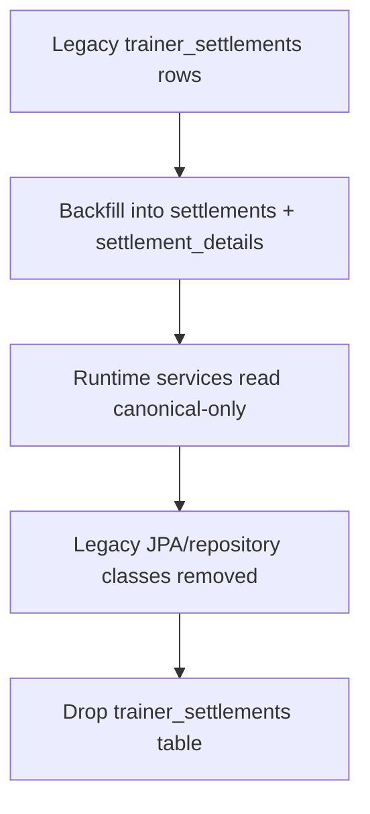

# refactor: Retire legacy trainer settlements bridge

## Overview

`trainer_settlements` is now a compatibility bridge, not the canonical settlement store. The current codebase already treats `settlements` + `settlement_details` as the source-of-truth for canonical settlement creation and document output, but legacy monthly payroll, confirm, and document paths still read or write `trainer_settlements`. This plan removes the bridge by backfilling any historical legacy-only data into canonical tables, cutting runtime reads and writes over to canonical storage, and then dropping the legacy table and persistence classes. (see origin: `docs/brainstorms/2026-04-03-settlements-analytics-and-trainer-payroll-requirements.md`)

## Problem Frame

The system currently has two overlapping representations for trainer settlement history.

- Canonical flow: `settlements` + `settlement_details`.
- Legacy bridge: `trainer_settlements`.

That overlap is manageable while the bridge exists, but it carries three costs:

- Monthly payroll and document flows can still drift back to the bridge even after the canonical workflow exists.
- Historical data is split across two stores, which makes table removal unsafe until the bridge is backfilled or retired.
- The code path is harder to reason about because confirm, preview, and document output are no longer guaranteed to read from the same persistence model.

The right outcome is a single persistence model. The canonical monthly/period settlement model should remain intact, and any legacy monthly access should be reconstructed from canonical data or explicitly deprecated. This follows the same bridge-sunset direction left open in `docs/plans/2026-04-10-003-plan-rollback-period-scope-settlements-to-monthly.md`.

## Requirements Trace

- R1. Historical trainer settlement data that still exists only in `trainer_settlements` must remain accessible after cutover.
- R2. New runtime code must stop reading or writing `trainer_settlements`.
- R3. Legacy monthly payroll, confirm, and document routes must continue to work from canonical data or be explicitly documented as deprecated compatibility surfaces.
- R4. The canonical settlement model must continue to use `settlements` + `settlement_details` as the only source-of-truth.
- R5. The table removal must be safe, idempotent, and fail fast if the canonical backfill assumptions are violated.

## Scope Boundaries

- This plan does not change settlement calculation policy, trainer rate source-of-truth, or front-end UX.
- This plan does not redesign PDF layout or the canonical `/api/v1/settlements/{settlementId}/trainers/{trainerId}/document` endpoint.
- This plan does not introduce a separate archival system for legacy rows; the goal is to migrate what still matters into canonical storage and then remove the bridge.
- This plan does not change the canonical `settlements`/`settlement_details` schema beyond what is needed to preserve history and retire the bridge.

## Context & Research

### Relevant Code and Patterns

- `backend/src/main/java/com/gymcrm/settlement/service/TrainerSettlementLifecycleService.java`
  - Still writes bridge snapshot rows in the legacy monthly confirm flow.
- `backend/src/main/java/com/gymcrm/settlement/service/TrainerPayrollSettlementService.java`
  - Still reads `trainer_settlements` when a month has been confirmed.
- `backend/src/main/java/com/gymcrm/settlement/service/TrainerSettlementDocumentService.java`
  - Still falls back from canonical monthly documents to the bridge snapshot.
- `backend/src/main/java/com/gymcrm/settlement/repository/TrainerSettlementRepository.java`
  - Bridge repository used by confirm, payroll lookup, and document fallback.
- `backend/src/main/java/com/gymcrm/settlement/repository/TrainerSettlementJpaRepository.java`
  - Bridge-specific Spring Data repository that can be removed once runtime consumers are gone.
- `backend/src/main/java/com/gymcrm/settlement/entity/TrainerSettlementEntity.java`
  - JPA mapping for the legacy bridge table.
- `backend/src/main/resources/db/migration/V33__create_trainer_settlements_tables.sql`
  - Original bridge table definition.
- `backend/src/main/resources/db/migration/V34__add_trainer_settlement_rates_and_canonical_settlements.sql`
  - Canonical settlements and settlement details schema.
- `backend/src/main/resources/db/migration/V36__convert_settlements_to_period_scope.sql`
  - Canonical settlement model expansion that makes `settlements` the durable store.
- `backend/src/test/java/com/gymcrm/settlement/TrainerSettlementLifecycleServiceIntegrationTest.java`
  - Current bridge-write behavior is asserted here.
- `backend/src/test/java/com/gymcrm/settlement/TrainerPayrollSettlementServiceIntegrationTest.java`
  - Current monthly payroll behavior is asserted here.
- `backend/src/test/java/com/gymcrm/settlement/TrainerSettlementDocumentServiceTest.java`
  - Current canonical-vs-bridge document fallback is asserted here.
- `backend/src/test/java/com/gymcrm/settlement/SalesSettlementApiIntegrationTest.java`
  - End-to-end settlement endpoint coverage, including monthly bridge routes.

### Institutional Learnings

- `docs/plans/2026-03-23-refactor-role-storage-alignment-with-database-design-plan.md`
  - This repo prefers explicit cutover paths and fail-fast validation when retiring legacy persistence.
- `docs/brainstorms/2026-04-03-settlements-analytics-and-trainer-payroll-requirements.md`
  - Canonical source-of-truth is `settlements` + `settlement_details`; the bridge is only a temporary fallback.
- `docs/plans/2026-04-10-003-plan-rollback-period-scope-settlements-to-monthly.md`
  - Even the rollback plan treated `trainer_settlements` as a follow-up bridge retirement candidate, not a permanent store.

### External References

- None. This is a repo-specific persistence cutover problem, so local code and documentation are the strongest sources.

## Key Technical Decisions

- Backfill legacy rows into canonical tables before deleting the bridge.
  - That preserves access to historical monthly documents and prevents a destructive drop from becoming a data-loss event.
- Keep legacy monthly routes as compatibility surfaces until the cutover is complete, but make them canonical-backed.
  - The route shape can stay stable while the storage backing changes.
- Treat `trainer_settlements` as read/write dead after the cutover, not as a long-lived projection.
  - A permanent bridge would keep two sources alive and reintroduce drift.
- Drop the bridge in a separate migration after code no longer depends on it.
  - This keeps the runtime cutover and physical deletion from happening at the same time.
- Preserve the canonical document flow as the preferred path.
  - The new work should not weaken `/api/v1/settlements/{settlementId}/trainers/{trainerId}/document`.

## Open Questions

### Resolved During Planning

- Q. Should historical `trainer_settlements` rows be archived elsewhere instead of migrated?
  - A. No. The plan preserves access by backfilling them into canonical tables, then removes the bridge.
- Q. Should the legacy monthly routes be removed immediately?
  - A. No. They should remain as compatibility surfaces until they are verified to be canonical-backed and the bridge table is gone.

### Deferred to Implementation

- Q. How should the backfill be chunked if the legacy table is larger than test data?
  - A. Decide in the migration implementation based on real row counts and transaction safety.
- Q. When the canonical monthly row already exists, should the backfill merge only missing details or skip the month entirely?
  - A. The exact merge rule should be codified in the migration SQL after checking production-like data characteristics.
- Q. Should the legacy monthly routes keep their current response shape exactly, or should the compatibility layer trim unused fields later?
  - A. Keep the current shape for the first cutover and simplify only if a later cleanup is clearly safe.

## High-Level Technical Design

> *This illustrates the intended approach and is directional guidance for review, not implementation specification. The implementing agent should treat it as context, not code to reproduce.*

1. Identify every remaining `trainer_settlements` row that matters for history.
2. Materialize equivalent canonical `settlements` + `settlement_details` data for those rows.
3. Switch monthly payroll, confirm, and document paths to canonical-only reads and writes.
4. Remove bridge repository/entity classes and then drop the table.
5. Update API and planning docs so the bridge is no longer described as a fallback source.

## Implementation Units

- [x] **Unit 1: Backfill legacy bridge rows into canonical settlement tables**

**Goal:** Preserve historical monthly trainer settlement history in `settlements` + `settlement_details` before the bridge is removed.

**Requirements:** R1, R4, R5

**Dependencies:** None

**Files:**
- Add: `backend/src/main/resources/db/migration/V38__backfill_legacy_trainer_settlements_into_canonical.sql`
- Add: `backend/src/test/java/com/gymcrm/settlement/TrainerSettlementBridgeBackfillIntegrationTest.java`
- Modify: `backend/src/test/java/com/gymcrm/settlement/TrainerSettlementLifecycleServiceIntegrationTest.java`
- Modify: `backend/src/test/java/com/gymcrm/settlement/TrainerSettlementDocumentServiceTest.java`

**Approach:**
- Group legacy rows by center and month, then project them into canonical settlement batches and detail rows.
- Fail fast if the backfill would create duplicate canonical batches or would silently lose trainer rows.
- Prefer idempotent inserts or guarded upserts so the migration can be rerun safely in a lower environment.
- Treat this as a data-preservation step, not as a functional change to settlement math.

**Execution note:** Start with characterization coverage around legacy monthly document behavior so the backfill can be validated against known output.

**Patterns to follow:**
- `backend/src/main/resources/db/migration/V34__add_trainer_settlement_rates_and_canonical_settlements.sql`
- `backend/src/main/java/com/gymcrm/settlement/service/TrainerSettlementDocumentService.java`
- `backend/src/main/java/com/gymcrm/settlement/service/TrainerSettlementLifecycleService.java`

**Test scenarios:**
- Happy path: one legacy monthly bridge row becomes one canonical settlement batch with matching trainer detail rows.
- Happy path: multiple legacy trainer rows for the same center/month are grouped into a single canonical batch.
- Edge case: a month already represented in canonical tables does not produce duplicate canonical batches.
- Error path: a legacy row that cannot be reconciled to canonical data causes the migration to fail fast.
- Integration: after backfill, the canonical monthly document flow can render the same history without consulting the bridge table.

**Verification:**
- Historical legacy data needed for monthly output is visible in canonical tables after the migration runs.

- [x] **Unit 2: Repoint legacy monthly payroll, confirm, and document flows to canonical data**

**Goal:** Keep the legacy `/trainer-payroll` surface available while making its implementation canonical-only.

**Requirements:** R2, R3, R4

**Dependencies:** Unit 1

**Files:**
- Modify: `backend/src/main/java/com/gymcrm/settlement/service/TrainerPayrollSettlementService.java`
- Modify: `backend/src/main/java/com/gymcrm/settlement/service/TrainerSettlementLifecycleService.java`
- Modify: `backend/src/main/java/com/gymcrm/settlement/service/TrainerSettlementDocumentService.java`
- Modify: `backend/src/main/java/com/gymcrm/settlement/controller/TrainerPayrollSettlementController.java`
- Modify: `backend/src/test/java/com/gymcrm/settlement/TrainerPayrollSettlementServiceIntegrationTest.java`
- Modify: `backend/src/test/java/com/gymcrm/settlement/TrainerSettlementLifecycleServiceIntegrationTest.java`
- Modify: `backend/src/test/java/com/gymcrm/settlement/TrainerSettlementDocumentServiceTest.java`
- Modify: `backend/src/test/java/com/gymcrm/settlement/SalesSettlementApiIntegrationTest.java`

**Approach:**
- Make monthly payroll lookup read from canonical confirmed settlement batches and detail rows instead of bridge snapshots.
- Make monthly confirm write canonical batches/details only, with no new `trainer_settlements` inserts.
- Make monthly document export resolve canonical monthly data first and never fall back to bridge rows.
- Keep compatibility endpoints and response envelopes stable unless a test reveals that a field can only be removed safely.

**Execution note:** Use characterization-first coverage for the monthly payroll and document paths so any response-shape changes stay intentional.

**Patterns to follow:**
- `backend/src/main/java/com/gymcrm/settlement/service/TrainerSettlementCreationService.java`
- `backend/src/main/java/com/gymcrm/settlement/service/TrainerSettlementDocumentService.java`
- `backend/src/main/java/com/gymcrm/settlement/controller/SettlementController.java`

**Test scenarios:**
- Happy path: confirmed monthly payroll still returns trainer rows after the bridge fallback is removed.
- Happy path: monthly document download still returns a PDF for a confirmed month with canonical data only.
- Edge case: an unconfirmed month still returns draft payroll output from canonical calculation.
- Error path: missing canonical settlement data no longer falls back to bridge rows.
- Integration: confirming a monthly settlement no longer inserts any rows into `trainer_settlements`.

**Verification:**
- The legacy monthly surface works without any runtime dependency on `trainer_settlements`.

- [x] **Unit 3: Remove bridge persistence classes and drop the legacy table**

**Goal:** Eliminate the dead bridge model from code and database schema after runtime consumers have been cut over.

**Requirements:** R2, R4, R5

**Dependencies:** Unit 2

**Files:**
- Delete: `backend/src/main/java/com/gymcrm/settlement/entity/TrainerSettlement.java`
- Delete: `backend/src/main/java/com/gymcrm/settlement/entity/TrainerSettlementEntity.java`
- Delete: `backend/src/main/java/com/gymcrm/settlement/repository/TrainerSettlementRepository.java`
- Delete: `backend/src/main/java/com/gymcrm/settlement/repository/TrainerSettlementJpaRepository.java`
- Add: `backend/src/main/resources/db/migration/V39__drop_trainer_settlements_table.sql`
- Modify: `backend/src/test/java/com/gymcrm/settlement/TrainerPayrollSettlementServiceIntegrationTest.java`
- Modify: `backend/src/test/java/com/gymcrm/settlement/TrainerSettlementLifecycleServiceIntegrationTest.java`
- Modify: `backend/src/test/java/com/gymcrm/settlement/SalesSettlementApiIntegrationTest.java`

**Approach:**
- Remove the dead repository/entity surface only after the monthly flows are proven canonical-backed.
- Drop the bridge table, its indexes, and any foreign-key references in a dedicated migration.
- Keep the migration fail-fast if any remaining runtime path still depends on the table.
- Let the compiler and tests be the final guardrail for bridge removal.

**Execution note:** This unit should be treated as a high-risk persistence cutover; keep characterization coverage in place while deleting dead code.

**Patterns to follow:**
- `backend/src/main/resources/db/migration/V33__create_trainer_settlements_tables.sql`
- `backend/src/main/resources/db/migration/V37__rollback_settlements_to_monthly_model.sql`
- `backend/src/main/java/com/gymcrm/settlement/service/TrainerSettlementDocumentService.java`

**Test scenarios:**
- Happy path: the application context starts without the bridge JPA repository classes.
- Edge case: there are no remaining imports or references to the deleted bridge types in settlement code.
- Error path: the drop migration fails loudly if the table still has an unexpected dependency.
- Integration: monthly payroll and document flows continue to work after the bridge table is removed.

**Verification:**
- The codebase no longer needs `trainer_settlements` to boot, compute, or render settlement history.

- [x] **Unit 4: Update API/docs language and finalize residual regression coverage**

**Goal:** Remove bridge fallback language from documentation and ensure the remaining settlement contract is described as canonical-only.

**Requirements:** R3, R4

**Dependencies:** Unit 2, Unit 3

**Files:**
- Modify: `docs/04_API_설계서.md`
- Modify: `docs/brainstorms/2026-04-03-settlements-analytics-and-trainer-payroll-requirements.md`
- Modify: `backend/src/test/java/com/gymcrm/settlement/SalesSettlementApiIntegrationTest.java`

**Approach:**
- Replace the legacy monthly bridge wording in the API spec with canonical-only monthly behavior.
- Remove any remaining documentation references that describe `trainer_settlements` as a fallback source.
- Keep the operational route names stable if the compatibility surfaces remain in code.
- Make the documentation match the implementation after the bridge table is gone, not before.

**Patterns to follow:**
- `docs/04_API_설계서.md` change history entries for settlement contract updates
- `docs/plans/2026-04-10-003-plan-rollback-period-scope-settlements-to-monthly.md`

**Test scenarios:**
- Happy path: API docs describe monthly payroll/document behavior without referencing bridge fallback.
- Edge case: the canonical document endpoint remains documented as the preferred path.
- Integration: the settlement integration suite still passes after doc language changes and bridge cleanup.

**Verification:**
- The docs, tests, and code all describe a single canonical settlement persistence model.

## System-Wide Impact

- **Interaction graph:** Monthly confirm, monthly payroll lookup, and monthly document export all touch the same settlement history, so the bridge cutover must move those three surfaces together.
- **Error propagation:** Backfill failures should abort early rather than partially migrating some months and leaving others stranded in the legacy table.
- **State lifecycle risks:** The highest-risk state is a partially migrated month that exists in both stores with different totals; idempotent backfill and a strict drop precheck are the mitigations.
- **API surface parity:** The canonical `/api/v1/settlements/{settlementId}/confirm` and `/api/v1/settlements/{settlementId}/trainers/{trainerId}/document` surfaces should remain the preferred contract while the legacy monthly routes are cleaned up.
- **Integration coverage:** This change needs cross-layer verification from migration to service to PDF export, because unit tests alone will not prove that old history still renders after the table is dropped.
- **Unchanged invariants:** `settlements` + `settlement_details` remain the only canonical settlement store; trainer rate source-of-truth and settlement math do not change.

## Risks & Dependencies

| Risk | Mitigation |
|------|------------|
| Historical monthly data is lost during bridge removal | Backfill legacy rows into canonical tables before any drop migration runs |
| A legacy monthly route still depends on the bridge after cutover | Repoint monthly payroll, confirm, and document flows to canonical-only data before deleting persistence classes |
| Duplicate canonical batches are created during backfill | Add strict grouping and conflict checks in the backfill migration |
| Documentation drifts from the runtime behavior | Update `docs/04_API_설계서.md` and the originating brainstorm in the same delivery unit |
| Drop migration breaks an unseen test or fixture | Keep `SalesSettlementApiIntegrationTest` and service integration coverage aligned with the cutover |

## Phased Delivery

### Phase 1

- Backfill historical legacy rows into canonical settlements and detail rows.

### Phase 2

- Cut monthly payroll, confirm, and document flows over to canonical-only reads and writes.

### Phase 3

- Delete bridge persistence classes and drop the table in a dedicated migration.

### Phase 4

- Update docs and lock the bridge-free contract in tests.

## Documentation / Operational Notes

- `docs/04_API_설계서.md` should stop describing `trainer_settlements` as a fallback source once the bridge is removed.
- Any release notes or operational handoff should state that legacy monthly access is now canonical-backed.
- If a staging backfill shows unexpected duplication or missing months, resolve that before the drop migration is merged.

## Sources & References

- **Origin document:** `docs/brainstorms/2026-04-03-settlements-analytics-and-trainer-payroll-requirements.md`
- Related plan: `docs/plans/2026-04-10-003-plan-rollback-period-scope-settlements-to-monthly.md`
- Related plan: `docs/plans/2026-04-08-002-plan-restore-original-4-10-trainer-settlement-create-api.md`
- Related code: `backend/src/main/java/com/gymcrm/settlement/service/TrainerSettlementLifecycleService.java`
- Related code: `backend/src/main/java/com/gymcrm/settlement/service/TrainerPayrollSettlementService.java`
- Related code: `backend/src/main/java/com/gymcrm/settlement/service/TrainerSettlementDocumentService.java`
- Related code: `backend/src/main/resources/db/migration/V33__create_trainer_settlements_tables.sql`
- Related code: `backend/src/main/resources/db/migration/V34__add_trainer_settlement_rates_and_canonical_settlements.sql`
- Related code: `backend/src/main/resources/db/migration/V36__convert_settlements_to_period_scope.sql`
- Related docs: `docs/04_API_설계서.md`
