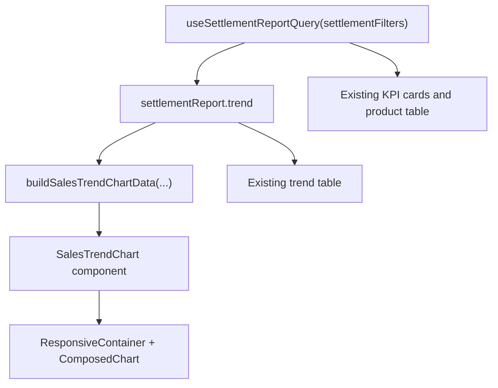

# feat: Add settlements sales trend chart

## Overview

`/settlements`의 `매출 분석` 탭에 Recharts 기반 V1 추이 차트를 추가해, 운영자가 기존 표를 읽기 전에 순매출 흐름과 환불 영향도를 한눈에 파악할 수 있게 만든다. 차트는 기존 `sales-report` 응답의 `trend` 데이터를 그대로 사용하며, V1 표현은 요구사항에서 확정한 `순매출 Line + 환불 금액 Bar` 조합으로 제한한다.

## Problem Frame

현재 `frontend/src/pages/settlements/SettlementsPage.tsx`는 상단 KPI와 하단 추이 표/상품별 집계 표를 제공하지만, 시간 흐름에 따른 매출 변화는 숫자 행을 눈으로 읽어야만 파악할 수 있다. origin 문서의 R8-R10d는 `매출 분석` 탭의 1차 역할을 "기간별 매출 추이 읽기"로 정의하고, 2026-04-13 결정으로 V1 차트는 `순매출 Line + 환불 Bar` 조합을 사용하되 기존 표는 유지하도록 고정했다. 이번 계획은 그 제품 결정을 현재 프론트 구조 안에서 가장 작은 프런트엔드 변경으로 구현하는 방법을 정리한다. (see origin: `docs/brainstorms/2026-04-03-settlements-analytics-and-trainer-payroll-requirements.md`)

## Requirements Trace

- R3, R5-R8. `매출 분석` 탭은 운영자가 센터의 현재 상태를 빠르게 읽는 경험을 강화해야 하며, 상세 분석 영역의 1차 목적은 기간별 추이 해석이어야 한다.
- R9-R10. 추이 표현은 기존 `trendGranularity` 필터(`일/주/월/연`)와 같은 데이터 계약 위에서 동작해야 하며, 시간 흐름 비교와 이상 징후 파악에 도움이 되어야 한다.
- R10a-R10d. V1 차트는 `순매출 Line + 환불 금액 Bar` 조합으로 제한하고, `총매출`은 보조 정보로 유지하며, 기존 추이 표/상품별 집계 표를 제거하지 않는다.
- Success Criteria 1-3. 운영자는 `/settlements` 진입 후 대시보드 숫자를 본 뒤 같은 화면 안에서 차트와 표를 통해 상태를 더 빠르게 이해해야 한다.

## Scope Boundaries

- 백엔드 API, 응답 DTO, 집계 규칙, Excel export 계약은 변경하지 않는다.
- `트레이너 정산` 탭, 최근 환불 목록, 상품별 집계 표의 제품 동작은 이번 계획 범위에 포함하지 않는다.
- V1에서는 `총매출`/`거래 건수`를 추가 시리즈로 시각화하지 않는다.
- 차트가 도입되어도 기존 추이 표와 상품별 집계 표는 유지한다.
- 정산 화면 전체 리디자인이나 다른 페이지로의 차트 확장은 이번 범위가 아니다.

## Context & Research

### Relevant Code and Patterns

- `frontend/src/pages/settlements/SettlementsPage.tsx` already owns the `매출 분석` tab, computes `trendPoints`, and renders the trend table plus product aggregation table from the same `useSettlementReportQuery` result.
- `frontend/src/pages/settlements/modules/types.ts` already defines `SettlementTrendPoint` with the exact fields the V1 chart needs: `bucketLabel`, `refundAmount`, `netSales`, and supporting `grossSales`/`transactionCount`.
- `frontend/src/pages/settlements/modules/useSettlementReportQuery.ts` already treats `sales-report` as the canonical read query keyed by date range, payment method, product keyword, and trend granularity.
- `frontend/src/pages/settlements/modules/buildTrainerSettlementScopeOptions.ts` and its test show the local pattern for keeping pure presentation-mapping logic in a small module with a dedicated Vitest file.
- `frontend/src/pages/settlements/SettlementsPage.test.tsx` already mocks settlement query hooks at the page boundary, making it the right place to verify that the new chart surface coexists with existing tabs, copy, and tables without introducing real network calls.
- `frontend/src/setupTests.ts` currently stubs `matchMedia` only; introducing Recharts means the test environment may also need browser primitive support for responsive sizing behavior.

### Institutional Learnings

- `docs/brainstorms/2026-04-03-settlements-analytics-and-trainer-payroll-requirements.md` establishes that the sales analytics tab should optimize for "운영 상황 읽기" before deeper analysis, so the chart must improve scanability rather than compete with the detail tables.
- `docs/plans/2026-04-10-002-feat-trainer-settlement-rate-entry-plan.md` follows the current repo planning norm: reuse existing data contracts, keep UI changes close to the owning page, and add pure helper tests when transformation logic would otherwise bloat page JSX.

### External References

- Recharts documentation via Context7 (`/recharts/recharts`) for `ResponsiveContainer`, `ComposedChart`, tooltip formatting, and responsive dashboard usage patterns.

## Key Technical Decisions

- Use the existing `sales-report` response as the only chart data source: `useSettlementReportQuery` already returns `trend` points with the fields required for V1, so adding a new API or parallel query would only duplicate caching and error handling.
- Keep chart data transformation in a dedicated pure module: `SettlementsPage.tsx` is already large, and a small adapter module keeps bucket labeling, empty-state handling, and display metadata testable without asserting on SVG internals.
- Render the chart above the existing trend table inside the current `기간 추이 리포트` card: this preserves the current mental model where the card owns both scanability and numeric verification, while avoiding a new section that would fragment the analysis flow.
- Keep the existing `운영 방향성` card as a compact textual summary in V1 rather than removing it, but do not duplicate its recent-bucket list inside the chart card; the new chart becomes the primary visual trend surface and the existing card remains a lightweight narrative cue.
- Prioritize a compact tooltip over a persistent legend: the V1 chart only has two visible series, so the cleanest narrow-screen strategy is to rely on clear series labels in surrounding copy and tooltip formatting instead of introducing always-visible legend chrome.
- Treat `총매출` as tooltip/table-only data in V1: this matches the product decision to keep the primary read focused on `순매출` movement and 환불 영향, while still exposing `grossSales` as supporting context on hover and in the retained table.

## Open Questions

### Resolved During Planning

- No new backend contract is needed; the chart should read from the existing `trend` array returned by `useSettlementReportQuery`.
- The chart should live inside the existing `기간 추이 리포트` card, above the current trend table, so the detailed verification surface remains directly below the visual summary.
- The existing `운영 방향성` card should remain in V1 as a compact summary card, but its current recent-bucket list should be reduced or removed if it materially duplicates the new chart's visual summary.
- The V1 responsive simplification strategy should avoid a persistent legend and instead use axis/tick shortening plus tooltip formatting, because the chart only needs two visible series.

### Deferred to Implementation

- The exact breakpoints for X-axis tick reduction and chart height can be tuned during implementation once the component is visible in the existing card layout; the plan does not force one exact pixel value.
- The implementer may choose whether the tooltip is built with Recharts `formatter` props or a small custom tooltip component, as long as currency values and bucket labels remain easy to read.
- If `ResponsiveContainer` proves too fragile in Vitest/JSDOM, the implementer may mock Recharts primitives in the page test rather than asserting actual SVG geometry.
- The implementer may decide whether the chart styles live in `SettlementsPage.module.css` or a component-local CSS Module, but the final choice should keep style ownership aligned with the component boundary and avoid splitting one chart's styles across multiple files.

## High-Level Technical Design

> *This illustrates the intended approach and is directional guidance for review, not implementation specification. The implementing agent should treat it as context, not code to reproduce.*

The intended shape is a single-source read model:
- `settlementReport.trend` remains the canonical analytics dataset for this card.
- A pure adapter converts API rows into chart-friendly display data and any derived copy the chart needs.
- A dedicated presentation component owns Recharts configuration and empty-state handling.
- The chart component also owns its loading placeholder so the parent page continues to manage query state while the visual surface remains layout-stable during fetches.
- The existing trend table remains alongside the chart for verification and export confidence.

## Implementation Units

- [ ] **Unit 1: Add chart foundation and trend-data adapter**

**Goal:** Introduce the minimal frontend foundation needed to render a Recharts chart and keep trend transformation logic out of `SettlementsPage.tsx`.

**Requirements:** R9-R10d

**Dependencies:** None

**Files:**
- Modify: `frontend/package.json`
- Modify: `frontend/package-lock.json`
- Modify: `frontend/src/setupTests.ts`
- Create: `frontend/src/pages/settlements/modules/buildSalesTrendChartData.ts`
- Test: `frontend/src/pages/settlements/modules/buildSalesTrendChartData.test.ts`

**Approach:**
- Add `recharts` as a frontend dependency without introducing additional charting abstractions or shared global wrappers.
- Create a small pure module that accepts `SettlementTrendPoint[]` and returns the chart rows and any minimal display metadata needed by the chart component.
- Keep `grossSales` in the adapted shape even though it is not a visible V1 series, so tooltip content and future incremental extension do not require remapping the source data again.
- Extend test setup only as much as needed for responsive chart rendering in JSDOM, keeping the shim local to browser primitives rather than mocking application code globally.
- Document any test-only Recharts mocking at the component/page boundary rather than inside the adapter so data transformation tests stay framework-agnostic.

**Patterns to follow:**
- `frontend/src/pages/settlements/modules/buildTrainerSettlementScopeOptions.ts`
- `frontend/src/pages/settlements/modules/buildTrainerSettlementScopeOptions.test.ts`

**Test scenarios:**
- Happy path: a multi-bucket trend array maps to chart rows preserving `bucketLabel`, `netSales`, `refundAmount`, and `grossSales`.
- Edge case: an empty trend array returns an empty chart dataset without throwing, so the chart component can render an existing empty state.
- Edge case: a single-bucket trend array still returns one row without injecting comparison-only synthetic data.
- Integration: the test environment can mount a responsive chart container without failing on missing browser sizing primitives.

**Verification:**
- The repo can import Recharts from the settlements feature, and the trend adapter cleanly converts API trend data into a chart-ready model verified by a focused Vitest file.

- [ ] **Unit 2: Build a settlements sales trend chart component**

**Goal:** Encapsulate the V1 `순매출 Line + 환불 금액 Bar` visualization in a reusable, page-local presentation component.

**Requirements:** R8-R10d

**Dependencies:** Unit 1

**Files:**
- Create: `frontend/src/pages/settlements/components/SalesTrendChart.tsx`
- Modify: `frontend/src/pages/settlements/SettlementsPage.module.css`
- Test: `frontend/src/pages/settlements/components/SalesTrendChart.test.tsx`

**Approach:**
- Create a page-local chart component that receives already-adapted chart data and loading/empty-state props from the settlements page.
- Use `ResponsiveContainer` with a fixed-height wrapper and `ComposedChart` to render one `Bar` series for 환불 금액 and one `Line` series for 순매출.
- Keep axis labels, tooltip formatting, and series labels aligned with the page's existing Korean copy and currency formatting conventions.
- Render a stable loading placeholder while `settlementReportLoading` is true so the chart area does not collapse or jump before data arrives.
- Render an explicit empty-state surface when no trend data exists so the new chart does not degrade the current `Empty` experience.
- Keep chart-specific styles together in one ownership boundary: either the existing settlements page module if the chart remains page-private, or a component-local module if the chart gets enough dedicated styling to justify separation.

**Patterns to follow:**
- `frontend/src/pages/settlements/SettlementsPage.tsx` existing card/title/copy composition
- `frontend/src/pages/settlements/SettlementsPage.module.css` existing `trendHero`, `trendList`, and table wrapper styles
- Ant Design `Empty`, `Card`, `Typography`, and token-driven color usage already present in the settlements page

**Test scenarios:**
- Happy path: the component renders the chart wrapper and surrounding copy when given multiple trend rows.
- Happy path: the component renders a loading placeholder with the same outer wrapper height while data is still fetching.
- Edge case: the component renders the expected empty state when given no rows.
- Edge case: long or dense bucket labels do not prevent rendering when the chart receives `DAILY` data with many points.
- Error path: malformed or partial tooltip payloads do not crash the custom/formatter tooltip path if the hovered series is missing one of the values.

**Verification:**
- The settlements feature has a self-contained chart component that can render loaded and empty states without depending on `SettlementsPage.tsx` internals.

- [ ] **Unit 3: Integrate the chart into the sales analytics card while preserving existing tables**

**Goal:** Wire the new chart into `SettlementsPage.tsx` so the manager-facing `매출 분석` tab shows the visual trend summary above the existing verification tables.

**Requirements:** R3, R5-R10d, Success Criteria 1-3

**Dependencies:** Unit 2

**Files:**
- Modify: `frontend/src/pages/settlements/SettlementsPage.tsx`
- Modify: `frontend/src/pages/settlements/SettlementsPage.module.css`
- Test: `frontend/src/pages/settlements/SettlementsPage.test.tsx`

**Approach:**
- Compute adapted chart data from `trendPoints` in the settlements page and pass it to the new component without changing query ownership or filter behavior.
- Insert the chart between the KPI mini-cards and the existing trend table inside the current `기간 추이 리포트` card, keeping Excel download, table pagination, and existing copy intact.
- Preserve the current trend table below the chart so operations users can move from visual scan to exact numeric verification in the same card.
- Keep the separate `운영 방향성` card lightweight by trimming any duplicated recent-bucket listing if the new chart already provides the same information more clearly.
- Update the page test to include representative trend data and assert that the manager sales analytics tab renders the chart section while still showing the retained table surface.
- For query-reactive behavior, prefer page-level assertions that rerender with updated mocked hook results or filter state rather than trying to prove Recharts internals; granularity changes only need to prove that the page continues to feed the shared `settlementReport.trend` source into the chart surface.

**Patterns to follow:**
- `frontend/src/pages/settlements/SettlementsPage.tsx` existing `salesAnalytics` tab composition and card structure
- `frontend/src/pages/settlements/SettlementsPage.test.tsx` page-level hook mocking and role-based rendering assertions

**Test scenarios:**
- Happy path: manager view renders the sales analytics tab with the new chart section, existing KPI cards, and the retained trend/product tables.
- Happy path: rerendering the page with updated mocked `settlementReport.trend` data after a `trendGranularity` change updates the chart section while preserving the same page query ownership model.
- Edge case: when `trend` is empty but `rows` exist, the chart section shows its empty state while the product table still renders.
- Edge case: when `settlementReportLoading` is true, the chart section keeps its layout-stable loading placeholder and does not remove the rest of the card structure.
- Integration: the Excel download action and existing trend table remain present after chart integration, proving the new surface did not replace the verification/export workflow.

**Verification:**
- The manager-facing sales analytics card shows a Recharts V1 trend visualization and still preserves all current operational surfaces that were already in the card.

## System-Wide Impact

- **Interaction graph:** `SettlementsPage.tsx` remains the owner of query state and tab composition, while the new chart component becomes a presentation-only child fed by the existing `settlementReport` query result.
- **Error propagation:** Query errors should continue to surface through the existing page-level `Alert` blocks; the new chart should only render loading or empty states for missing `trend` data and must not introduce a second error channel.
- **State lifecycle risks:** Because `ResponsiveContainer` depends on layout sizing, CSS regressions in the card wrapper could cause collapsed charts even when data is present; the wrapper styles need explicit height ownership.
- **UI duplication risks:** The page already has an `운영 방향성` summary surface for recent trend interpretation, so the integration should trim duplicated recent-bucket summaries rather than forcing users to read the same signal twice.
- **API surface parity:** No backend or API contract surface changes are required; the chart consumes fields already present in `SettlementTrendPoint`.
- **Integration coverage:** Page-level tests should verify that the chart, retained trend table, and Excel action coexist, because unit tests alone will not catch accidental replacement of the current analysis flow.
- **Unchanged invariants:** `useSettlementReportQuery`, filter submission, recent adjustments, Excel export, and the `트레이너 정산` tab behavior remain unchanged by this plan.

## Risks & Dependencies

| Risk | Mitigation |
|------|------------|
| Recharts responsive sizing is brittle in JSDOM and narrow layouts | Add minimal browser primitive support in `setupTests.ts`, keep the chart in a fixed-height wrapper, and focus tests on DOM presence/empty states rather than SVG geometry |
| The chart makes the existing analytics card visually too dense | Keep the V1 chart to two visible series, place it above the retained table, and avoid a persistent legend |
| Trend transformation logic drifts from the API model as the page evolves | Isolate the mapping logic in a tested pure module rather than embedding ad-hoc object shaping in the page JSX |
| Introducing a new dependency inflates scope beyond the intended V1 | Limit the work to the settlements page only and avoid shared chart abstractions or multi-page rollout in the same change |

## Documentation / Operational Notes

- `docs/02_시스템_아키텍처_설계서.md` already names Recharts as the chart library for sales visualization, so no architecture doc change is required if the implementation follows that choice.
- No API contract update is required because the plan reuses the existing `sales-report` response shape.
- If the implementation reveals that `ResponsiveContainer` needs additional testing notes, capture that as a frontend testing note rather than changing the product requirements.

## Sources & References

- **Origin document:** `docs/brainstorms/2026-04-03-settlements-analytics-and-trainer-payroll-requirements.md`
- Related code: `frontend/src/pages/settlements/SettlementsPage.tsx`
- Related code: `frontend/src/pages/settlements/modules/types.ts`
- Related code: `frontend/src/pages/settlements/modules/useSettlementReportQuery.ts`
- Related pattern: `frontend/src/pages/settlements/modules/buildTrainerSettlementScopeOptions.ts`
- External docs: Recharts guidance via Context7 package docs (`/recharts/recharts`)
