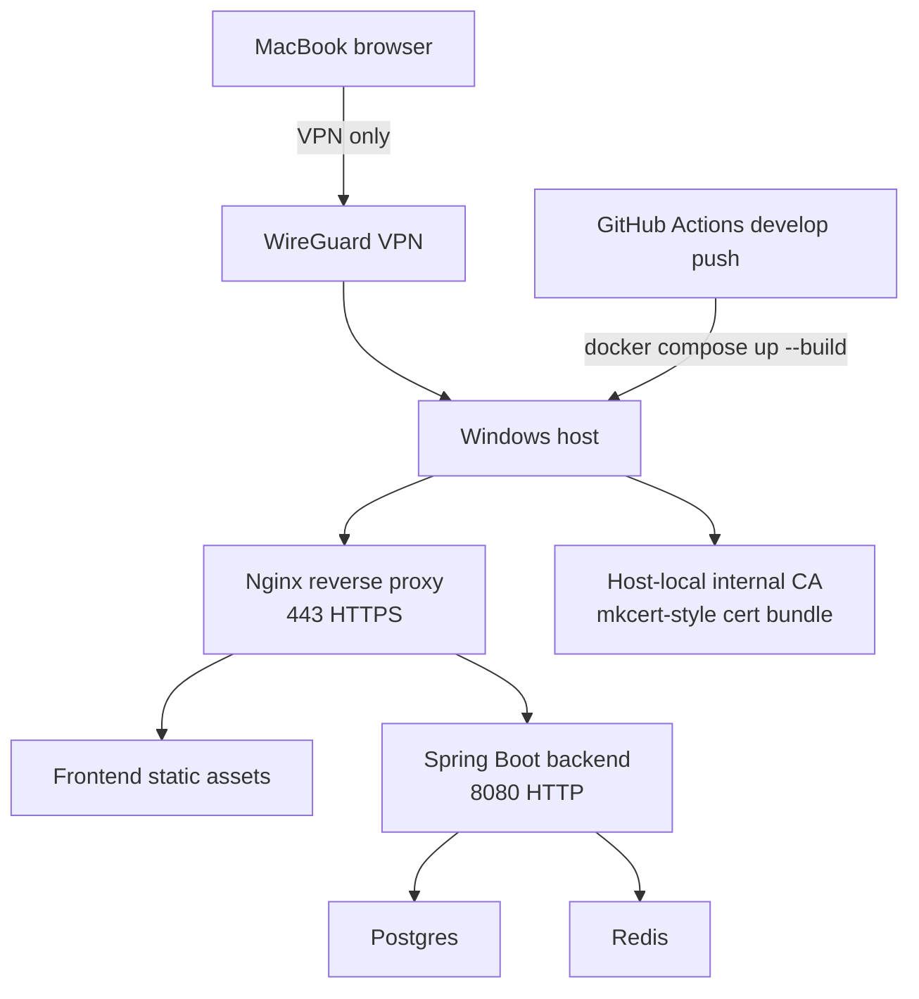

# feat: Add VPN-only HTTPS ingress to self-hosted staging

## Overview

Extend the already-working self-hosted staging loop so the Windows-hosted `staging`
environment is reachable over browser-trusted HTTPS, but only inside the existing
WireGuard VPN boundary. The current baseline already has Docker Compose, Nginx as a
single ingress point, a GitHub Actions deploy workflow, and JWT-mode backend startup.
This plan hardens the ingress path, keeps the same-origin `/api` contract, and updates
the operational docs so the canonical staging URL becomes `https://<ddns-domain>/`
instead of the older HTTP/host-port form.

## Problem Frame

The origin requirements call for a VPN-only staging lane where external QA can use a
stable DDNS hostname, browser-trusted HTTPS, and the same deploy/smoke loop that
already exists today. The current implementation only exposes HTTP on a host port and
documents VPN access as `http://<windows-vpn-ip>:8088/`, which is good enough for
connectivity but not for the HTTPS trust model that external QA now needs.

This plan keeps the existing `develop -> Windows self-hosted runner -> compose up`
loop, but adds TLS termination at the reverse proxy, host-local certificate bootstrap,
and HTTPS-aware smoke validation. The backend remains private and still uses JWT mode;
the plan does not introduce a new auth model or a separate deployment lane.

## Requirements Trace

- R1. External access must still exist, but only through the VPN boundary.
- R2. `staging` must not be publicly exposed to the internet.
- R3. Access must remain limited to team/tester users.
- R3a. WireGuard remains the only external access path.
- R3b. The canonical staging URL must be DDNS-based and HTTPS-only inside the VPN.
- R3c. The DDNS name must resolve correctly inside the VPN.
- R3d. App authentication stays as a separate layer from VPN access.
- R4. `develop` remains the source of truth for staging updates.
- R5. Smoke checks still run after deploy.
- R5a. The single entrypoint must serve frontend and API together.
- R5b. HTTPS must terminate at the reverse proxy and backend may remain HTTP.
- R6. Recovery after reboot/network changes must remain simple.
- R7. Secrets must stay out of the repo.
- Success criteria. A VPN-connected MacBook can use the staging URL without browser
  certificate warnings, and Actions can clearly report deploy success/failure.

## Scope Boundaries

- No public internet exposure, port forwarding, or production deployment changes.
- No redesign of the frontend routing model or backend auth model.
- No new tenant model, user lifecycle system, or separate public staging lane.
- No AWS/CDN/CloudFront/ALB work; this is strictly the existing Windows self-hosted lane.

## Context & Research

### Relevant Code and Patterns

- `compose.selfhosted-staging.yaml`
- `deploy/selfhosted/nginx/nginx.conf`
- `deploy/selfhosted/nginx/Dockerfile`
- `.github/workflows/deploy-staging-selfhosted.yml`
- `backend/src/main/resources/application.yml`
- `backend/src/main/java/com/gymcrm/common/config/SecurityConfig.java`
- `backend/src/main/java/com/gymcrm/common/config/PrototypeCorsConfig.java`
- `backend/src/main/java/com/gymcrm/common/config/SecurityModeSettings.java`
- `frontend/src/api/client.ts`
- `docs/ops/selfhosted-staging-runbook.md`
- `docs/observability/staging-go-no-go-checklist.md`
- `docs/observability/tools/validate_sli_sample.sh`
- `docs/plans/2026-04-15-feat-self-hosted-runner-staging-docker-vpn-plan.md`

### Institutional Learnings

- `docs/observability/staging-go-no-go-checklist.md` already uses a clear pre-check /
  gate / failure-action structure, so the HTTPS staging checks should mirror that
  style instead of inventing a new operational cadence.
- `docs/solutions/documentation-gaps/member-summary-staging-rollout-checklist-gymcrm-20260306.md`
  shows that staging rollout docs become brittle when deploy and validation steps drift
  apart. This plan should keep the workflow, smoke helper, and runbook synchronized.

### External References

- None required for the planning pass. The repo already contains the relevant ingress,
  auth, and operations patterns needed to choose a grounded approach.

## Key Technical Decisions

- Keep the existing self-hosted staging lane and add HTTPS ingress to it, rather than
  creating a separate public staging environment.
- Terminate TLS at Nginx on host port 443; backend remains HTTP on the private compose
  network.
- Use a host-local internal CA bootstrap flow, mkcert-style, and issue a server cert
  that covers the canonical DDNS hostname plus loopback SANs for runner-local smoke.
- Keep the backend in JWT mode for this lane so VPN access is not the only gate.
- Keep the frontend and API on a single public origin via the reverse proxy.
- Keep certificate material out of git; the repo should only contain the mount points,
  scripts, and runbook steps needed to generate and trust the certs on the host/client.
- Add a canonical public hostname/env var so workflow, nginx, and runbook all refer to
  the same staging URL.

## Open Questions

### Resolved During Planning

- Reverse proxy choice: Nginx stays the ingress layer.
- Access shape: VPN-only remains the access model.
- Security model: JWT staging remains the app-level auth mode.

### Deferred to Implementation

- Exact Windows host path for the TLS bundle and whether it is user-profile scoped or
  machine-scoped.
- Whether port 80 stays open only for local redirect or is closed entirely once 443 is
  in place.
- Whether the smoke helper uses the canonical DDNS hostname directly or the loopback
  SANs added to the cert to avoid a DNS override in the runner.
- Whether the canonical hostname should be injected into the workflow as a GitHub
  Environment variable or hard-coded in the self-hosted environment configuration.

## High-Level Technical Design

> This illustrates the intended approach and is directional guidance for review, not
> implementation specification. The implementing agent should treat it as context, not
> code to reproduce.

## Implementation Units

Recommended execution order: Unit 3 -> Unit 1 -> Unit 2 -> Unit 4.
Unit 3 establishes the cert/trust primitives, Unit 1 wires Nginx to them, Unit 2
switches deploy validation to HTTPS, and Unit 4 syncs the ops gate/docs.

- [x] **Unit 1: Terminate HTTPS at the staging reverse proxy**

**Goal:** Make the existing Nginx ingress serve the staging app over HTTPS on the
canonical public hostname while keeping the backend private on the compose network.

**Requirements:** R2, R5a, R5b, R6, R7

**Dependencies:** The host-local CA/cert bootstrap from Unit 3 and the existing
self-hosted staging compose stack / Nginx reverse proxy.

**Files:**
- Modify: `compose.selfhosted-staging.yaml`
- Modify: `deploy/selfhosted/nginx/nginx.conf`
- Modify: `deploy/selfhosted/nginx/Dockerfile`

**Test files:**
- `.github/workflows/deploy-staging-selfhosted.yml`

**Approach:**
- Publish HTTPS on the Windows host through Nginx and keep backend traffic internal.
- Mount a host-local cert/key bundle into the Nginx container instead of committing
  certificate material to the repo.
- Keep `/api/*` on the same origin as `/` so the frontend can continue using the
  existing relative API client contract.
- Keep the old HTTP-only access path from becoming the canonical documented route.
- Thread the canonical DDNS hostname through compose and nginx as a single env-driven
  source of truth rather than hard-coding it in multiple places.

**Test scenarios:**
- Happy path: a browser can load `https://<ddns-domain>/` and receive the frontend
  shell without a TLS warning.
- Happy path: `https://<ddns-domain>/api/v1/health` returns the health envelope
  through the proxy.
- Edge case: the cert bundle includes loopback SANs, so runner-local smoke can target
  the canonical hostname locally through a host override without disabling hostname
  validation.
- Error path: if the cert or key is missing/mismatched, the Nginx container fails
  predictably and the stack does not report a false healthy state.
- Integration: backend stays reachable only through the reverse proxy; no direct public
  backend port is required.

**Verification:**
- The staging stack exposes a valid HTTPS entrypoint and the backend still serves the
  same API responses behind it.

- [x] **Unit 2: Add HTTPS-aware smoke validation to the deploy workflow**

**Goal:** Make the GitHub Actions deploy job validate the HTTPS path that users will
actually consume, not the older HTTP/port-based route.

**Requirements:** R4, R5, R5a, R6, R7

**Dependencies:** Unit 1 must provide a working HTTPS listener and Unit 3 must provide
the cert/bootstrap flow.

**Files:**
- Modify: `.github/workflows/deploy-staging-selfhosted.yml`
- Create: `docs/observability/tools/validate_selfhosted_staging_https.ps1`

**Test files:**
- `docs/observability/tools/validate_selfhosted_staging_https.ps1`

**Approach:**
- Replace the HTTP-only smoke assertions with HTTPS checks against the canonical
  staging hostname.
- Keep the smoke helper reusable so the same validation logic can be run manually on the
  Windows host and from workflow logs.
- Fail the deploy if TLS trust, hostname matching, or `/api/v1/health` response checks
  fail.
- Consume the same canonical hostname env var that Unit 1 wires into Nginx and resolve
  it locally in a way that still validates the canonical host name.

**Test scenarios:**
- Happy path: a `develop` push runs the workflow, the HTTPS helper passes, and both `/`
  and `/api/v1/health` return success over TLS.
- Edge case: the helper succeeds only when the cert chain is trusted and the hostname
  matches the cert SANs.
- Error path: an expired or untrusted cert causes the smoke step to fail before the
  workflow reports success.
- Error path: if the backend is unhealthy, the smoke step fails even when nginx is up.
- Integration: the workflow output clearly identifies the canonical staging URL that was
  validated.

**Verification:**
- A real deploy on the Windows runner proves the same HTTPS route that external QA will
  use.

- [x] **Unit 3: Bootstrap the host-local CA and trust flow**

**Goal:** Make certificate issuance and trust bootstrap repeatable on the Windows host
  and for the MacBook tester client.

**Requirements:** R2, R3b, R3c, R6, R7

**Dependencies:** The canonical staging hostname decision from the origin document.

**Files:**
- Create: `docs/observability/tools/bootstrap_selfhosted_staging_tls.ps1`
- Modify: `docs/ops/selfhosted-staging-runbook.md`

**Test files:**
- `docs/observability/tools/bootstrap_selfhosted_staging_tls.ps1`

**Approach:**
- Add a host bootstrap script or documented flow that generates the internal CA and the
  staging server cert once, then reuses them across restarts.
- Issue the server cert with SANs for the DDNS hostname and loopback addresses so host
  smoke and VPN browser QA can both trust the same chain.
- Document how to import the CA into the Windows host and the MacBook trust store.
- Document the VPN-side DNS check that proves the DDNS hostname resolves to the
  staging host before the trust flow is considered complete.
- Document where the TLS bundle lives on the host without placing the bundle in git.

**Test scenarios:**
- Happy path: a fresh Windows host can generate or restore the cert bundle and start the
  staging stack without changing app code.
- Happy path: a MacBook that imports the CA can open the HTTPS staging URL without a
  browser warning.
- Edge case: re-running bootstrap does not silently rotate the cert in a way that
  invalidates the current trust path without notice.
- Error path: if the CA is not trusted on the client, the browser presents a clear TLS
  warning instead of a half-working session.
- Integration: the runbook describes the same hostname and trust path used by the
  workflow helper.

**Verification:**
- A new host can be brought up from the runbook alone and the browser trust path is
  reproducible.

- [x] **Unit 4: Align the staging environment variables and operational gate**

**Goal:** Keep the staging lane consistent across compose, workflow, and runbook so the
  canonical HTTPS origin, allowed origins, and recovery steps all point at the same
  host.

**Requirements:** R3d, R5a, R5b, R6, R7

**Dependencies:** Units 1-3.

**Files:**
- Modify: `compose.selfhosted-staging.yaml`
- Modify: `.github/workflows/deploy-staging-selfhosted.yml`
- Modify: `docs/ops/selfhosted-staging-runbook.md`
- Modify: `docs/observability/staging-go-no-go-checklist.md`

**Test files:**
- `docs/observability/staging-go-no-go-checklist.md`

**Approach:**
- Introduce a canonical staging hostname/origin env var so the compose file, workflow,
  and runbook all point at the same HTTPS URL.
- Keep that hostname as the single source of truth for Nginx server_name, smoke
  validation, and documented user-facing URLs.
- Keep `app.security.mode=jwt` and `APP_PROTOTYPE_NO_AUTH_ENABLED=false` for the
  self-hosted staging lane.
- Update the documented recovery and go/no-go steps to use `https://<ddns-domain>/`
  and the HTTPS health endpoint instead of the legacy HTTP/8088 instructions.
- Make the operational notes explicit about Windows firewall, DNS resolution inside the
  VPN, and the fact that the app still requires JWT login on top of the VPN boundary.

**Test scenarios:**
- Happy path: the canonical origin works for both the browser and the workflow smoke
  without CORS surprises.
- Happy path: JWT login and refresh still work through the HTTPS origin after the proxy
  update.
- Edge case: rebooting the Windows host does not change the documented host name,
  config shape, or recovery path.
- Error path: if the canonical origin or allowed origin is misconfigured, the docs and
  workflow fail in an obvious way instead of silently falling back to HTTP.
- Integration: the staging go/no-go checklist references the same HTTPS endpoint and
  smoke criteria that the workflow enforces.

**Verification:**
- The deploy workflow, runbook, and staging checklist all describe the same HTTPS
  contract and there are no lingering HTTP-only instructions for external QA.

## System-Wide Impact

- **Interaction graph:** GitHub Actions deploys to the Windows self-hosted runner,
  which launches Docker Compose, which brings up Nginx, backend, Postgres, and Redis.
  External QA then reaches Nginx from a MacBook over WireGuard using the DDNS hostname.
- **Error propagation:** TLS, hostname, or CA failures should stop the smoke gate before
  a deploy is considered successful. Backend health failures should still surface as
  workflow failures even if the proxy starts.
- **State lifecycle risks:** The host-local cert bundle, CA trust installation, and
  Windows network state can drift across reboots or host recreation. The plan keeps
  these as explicit operational assets instead of hiding them in the repo.
- **API surface parity:** The frontend must continue to use the same-origin `/api`
  contract through Nginx. The backend auth model stays JWT; this plan does not add a
  second auth surface.
- **Integration coverage:** Manual QA must prove the browser trusts the cert, the DDNS
  hostname resolves correctly inside the VPN, and `/api/v1/health` remains reachable
  through the public HTTPS origin.
- **Unchanged invariants:** Postgres/Redis remain private compose services. The staging
  deployment target remains the same Windows machine and the workflow trigger remains
  `develop`.

## Risks & Dependencies

| Risk | Mitigation |
|------|------------|
| Host port 443 is already in use on the Windows machine | Document the conflict early, keep the binding explicit, and fail fast if Nginx cannot bind 443. |
| CA trust distribution becomes tedious for MacBook/Windows | Use one host-local CA flow and keep the bootstrap steps in the runbook, not in ad hoc notes. |
| DDNS hostname does not resolve correctly inside the VPN | Make split-DNS / VPN DNS behavior a documented prerequisite and smoke the canonical host in the workflow. |
| Certificate renewal or host reboot causes a silent regression | Keep the cert bundle deterministic and make the smoke step validate the real HTTPS path after every deploy. |
| Cross-origin fallback accidentally becomes the security boundary | Keep same-origin `/api` as the default path and treat CORS as fallback/debug only. |

## Documentation / Operational Notes

- Update the runbook so the canonical access URL is `https://<ddns-domain>/`.
- Document the CA import steps for the Windows host and the MacBook client.
- Document where the host-local cert bundle lives and how it is regenerated.
- Keep the staging go/no-go checklist aligned with the HTTPS smoke gate so future
  deploys do not drift back to HTTP expectations.

## Sources & References

- **Origin document:** `docs/brainstorms/2026-04-15-self-hosted-runner-external-staging-requirements.md`
- Related plan: `docs/plans/2026-04-15-feat-self-hosted-runner-staging-docker-vpn-plan.md`
- Related code: `compose.selfhosted-staging.yaml`
- Related code: `deploy/selfhosted/nginx/nginx.conf`
- Related code: `deploy/selfhosted/nginx/Dockerfile`
- Related code: `.github/workflows/deploy-staging-selfhosted.yml`
- Related code: `backend/src/main/resources/application.yml`
- Related code: `backend/src/main/java/com/gymcrm/common/config/SecurityConfig.java`
- Related code: `backend/src/main/java/com/gymcrm/common/config/PrototypeCorsConfig.java`
- Related code: `frontend/src/api/client.ts`
- Related docs: `docs/ops/selfhosted-staging-runbook.md`
- Related docs: `docs/observability/staging-go-no-go-checklist.md`
- Related docs: `docs/observability/tools/validate_sli_sample.sh`
