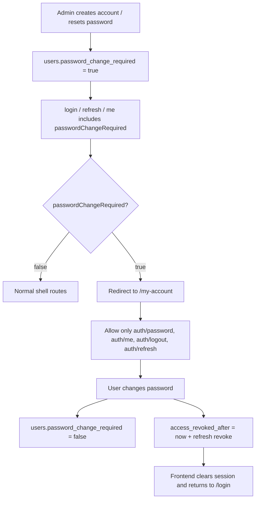

# feat: Add user account onboarding and password lifecycle

## Overview

This plan implements the follow-on auth lifecycle that the current MVP intentionally does not cover: admin-created onboarding with temporary passwords, forced first-login password changes, self-service password changes at `/my-account`, and admin password resets. The work also completes the cutover away from trainer-managed account creation so there is one canonical entry point for new accounts. (see origin: docs/brainstorms/2026-04-17-user-account-management-onboarding-password-lifecycle-requirements.md)

The guiding principle is to keep `users.password_change_required` as the canonical source of truth, surface that state in auth responses, and enforce it both in the server request path and in the front-end router. That keeps the temporary-password flow secure without stuffing extra state into JWT claims or introducing a second session model.

## Problem Frame

Today the repo has the pieces for login, refresh, logout, user listing, revoke/role/status operations, and trainer management, but the account lifecycle is still split across surfaces:

- New account creation still lives in trainer management.
- Temporary-password onboarding is not represented as a first-class auth state.
- Self-service password change exists in the API contract but not in the codebase.
- Admin password reset is not yet exposed.
- The UI has no dedicated `/my-account` page, so the only way to express the forced-change path would be to overload existing admin pages.

This creates three risks:

- Users with temporary passwords can still drift into the normal shell unless both routing and API enforcement are updated.
- Password reset/change can invalidate a session without giving the front-end a clear state transition.
- The trainer create path and the new user-account create path would compete unless the cutover is explicit.

## Requirements Trace

- R1-R6, R22-R23: account creation moves into `사용자 계정 관리`, requires only common account fields, and becomes admin-only.
- R7-R11: temporary-password accounts start in `비밀번호 변경 필요`, can only reach password change until the password is updated, and must satisfy the existing password policy.
- R12-R18, R24: `/my-account` supports self-service password change, current-password rules depend on whether the account is already in forced-change mode, and admin resets follow the same RBAC boundary as the rest of the surface.
- R19-R21: server-side enforcement must back the UI, and all account/password operations stay inside the current center.
- R32: role creation/reset boundaries stay aligned with the RBAC matrix already chosen for user-account operations.

## Context & Research

### Relevant Code and Patterns

- `backend/src/main/java/com/gymcrm/common/auth/controller/AuthController.java`
  Current auth surface already owns login, refresh, logout, me, user list, revoke-access, role, and status.
- `backend/src/main/java/com/gymcrm/common/auth/service/AuthService.java`
  Login/refresh/logout already issue tokens from an `AuthUser` domain record, so extending the returned session shape is the cleanest way to surface forced-change state.
- `backend/src/main/java/com/gymcrm/common/auth/service/AuthAccessRevocationService.java`
  Existing revoke/role/status operations already update `access_revoked_after`, bulk-revoke refresh tokens, and record audit events.
- `backend/src/main/java/com/gymcrm/common/auth/JwtAuthenticationFilter.java`
  The filter already loads the current user on every authenticated request, which makes it the right place to enforce a temporary-password allowlist without adding JWT claims.
- `backend/src/main/java/com/gymcrm/common/config/SecurityConfig.java`
  The current filter chain is simple and stateless, so the new gate should stay inside the auth layer rather than introducing a second auth middleware stack.
- `backend/src/main/java/com/gymcrm/common/auth/repository/AuthUserRepository.java`
  The repository already owns create/update helpers and can absorb the new password-related fields without a new persistence path.
- `backend/src/main/java/com/gymcrm/common/auth/repository/AuthUserJpaRepository.java`
  User search already works from entity fields, so a new boolean column will flow through naturally once the entity is updated.
- `frontend/src/app/auth.tsx`
  The live auth bootstrap already normalizes `login/refresh` payloads into app state, which is where `passwordChangeRequired` should surface.
- `frontend/src/App.tsx`
  Route selection already branches on auth bootstrap and protected path handling, so this is the place to short-circuit forced-change sessions to `/my-account`.
- `frontend/src/components/layout/HeaderLayout.tsx`
  The shell header is the right place for a small `내 계정` entry for normal sessions; it should not become the forced-change gate itself.
- `frontend/src/pages/user-accounts/UserAccountsPage.tsx`
  This is the canonical admin account surface and the right place for the new create dialog plus password-reset action.
- `frontend/src/pages/trainers/TrainersPage.tsx`
  This page still owns the old create path and needs the immediate cutover removal.
- `frontend/src/api/mockData.ts`
  Mock mode already simulates auth and account operations, so the new endpoints and state flag need to be mirrored here.
- `docs/04_API_설계서.md`
  The auth API table already lists `PATCH /api/v1/auth/password`, so the plan should sync the docs rather than invent a separate contract.

### Institutional Learnings

- `docs/solutions/ui-bugs/admin-portal-sidebar-workspace-reorg-login-first-gymcrm-20260225.md`
  The shell/login boundary is fragile enough that auth state changes should be handled explicitly in routing rather than implied by page content.
- `docs/solutions/documentation-gaps/prototype-plan-checklist-status-drift-gymcrm-20260227.md`
  Implementation and docs need to land together when the API surface changes, or the next delivery will inherit drift.

### External References

- None needed. The repo already has direct auth/session/revocation patterns to follow, so this plan stays grounded in local code and the existing API spec.

## Key Technical Decisions

- Persist forced-change state in `users.password_change_required` and surface it through `login`, `refresh`, `me`, and the user list.
  JWT claims stay unchanged so the state cannot go stale between token issuance and the next password reset.
- Enforce forced-change in both layers.
  The front-end router redirects the user to `/my-account`, and the auth filter blocks every other authenticated API path except the small allowlist needed for password change, session refresh, logout, and `me`.
- Reuse the existing session invalidation model.
  Password change and password reset both update `access_revoked_after` and revoke active refresh tokens in the same transaction flow that the current revoke/status/role operations already use.
- Keep all account/password operations inside the current center.
  `ROLE_SUPER_ADMIN` does not get a cross-center bypass for this surface; the feature is explicitly scoped to the current center context.
- Use the existing contract shape for self-service password change and add one admin reset action.
  `PATCH /api/v1/auth/password` remains the self-service endpoint, `POST /api/v1/auth/users` handles account creation, and `POST /api/v1/auth/users/{userId}/password-reset` handles admin resets.
- Make `사용자 계정 관리` the only create surface.
  Trainer management becomes edit/status/list only in the same release so there is no dual source of truth for account creation.
- Enforce create/reset RBAC on the server, not just in the UI.
  The backend must reject out-of-scope `roleCode` values even if the picker is filtered, and admin password reset must reject self-targeted requests so `/my-account` remains the only self-service path.
- Surface forced-change state in the admin list.
  Operators need to see which users are still on temp passwords, so `passwordChangeRequired` should appear in the list response and the user table.

## High-Level Technical Design

> This illustrates the intended approach and is directional guidance for review, not implementation specification. The implementing agent should treat it as context, not code to reproduce.

| State | Visible surface | Allowed APIs |
|---|---|---|
| `passwordChangeRequired = false` | Normal dashboard shell | Normal authenticated APIs |
| `passwordChangeRequired = true` | `/my-account` only | `PATCH /api/v1/auth/password`, `GET /api/v1/auth/me`, `POST /api/v1/auth/logout`, `POST /api/v1/auth/refresh` |

## System-Wide Impact

- Authentication bootstrap now carries one more user-state flag.
- The router needs a new authenticated-but-restricted branch for `/my-account`.
- User account management becomes the canonical admin entry point for creation and reset, which changes both UI affordances and server validation.
- Trainer management loses the create path in the same release, so old tests, mock handlers, and button visibility need to be updated together.
- The audit log surface should gain new account/password event types so operators can trace creation, reset, and self-service password changes in the same way they trace revoke/role/status.
- The docs contract needs to be updated alongside the code so `PATCH /api/v1/auth/password` is no longer just a placeholder in the API table.

## Implementation Units

- [x] **Unit 1: Add the canonical password-change state and enforce the forced-change gate on the backend**

  **Goal:** Add `password_change_required` to the user model, surface it through auth responses, and block all non-allowlisted authenticated requests when the flag is set.

  **Requirements:** R7-R10, R12, R19-R21

  **Dependencies:** None

  **Files:**
  - Add: `backend/src/main/resources/db/migration/V42__add_password_change_required_to_users.sql`
  - Modify: `backend/src/main/java/com/gymcrm/common/auth/entity/AuthUserEntity.java`
  - Modify: `backend/src/main/java/com/gymcrm/common/auth/entity/AuthUser.java`
  - Modify: `backend/src/main/java/com/gymcrm/common/auth/repository/AuthUserRepository.java`
  - Modify: `backend/src/main/java/com/gymcrm/common/auth/service/AuthService.java`
  - Modify: `backend/src/main/java/com/gymcrm/common/auth/controller/AuthController.java`
  - Modify: `backend/src/main/java/com/gymcrm/common/auth/JwtAuthenticationFilter.java`
  - Modify: `backend/src/main/java/com/gymcrm/common/auth/service/AuthAccessRevocationService.java`
  - Test: `backend/src/test/java/com/gymcrm/auth/AuthControllerIntegrationTest.java`
  - Test: `backend/src/test/java/com/gymcrm/auth/AuthOperationalAccessRevokeIntegrationTest.java`

  **Approach:**
  - Add the boolean column with a false default and backfill existing users to false.
  - Carry the flag through `AuthUserEntity`, `AuthUser`, and the auth response DTOs so `login`, `refresh`, `me`, and the admin user list can see it.
  - Keep JWT claims unchanged; the filter already loads the user from the database, which keeps the forced-change state authoritative and current.
  - Add the allowlist to the JWT filter rather than trying to gate by front-end route alone.
  - Tighten center scoping in `AuthAccessRevocationService` so account operations stay inside the current center even for super admin, matching the new requirement boundary.

  **Patterns to follow:**
  - `backend/src/main/java/com/gymcrm/common/auth/service/AuthAccessRevocationService.java`
  - `backend/src/main/java/com/gymcrm/common/auth/JwtAuthenticationFilter.java`
  - `backend/src/main/java/com/gymcrm/common/auth/service/AuthService.java`

  **Test scenarios:**
  - Happy path: a normal login response includes `passwordChangeRequired=false`.
  - Happy path: a forced-change account logs in and the auth payload includes `passwordChangeRequired=true`.
  - Edge case: the same forced-change session can still call `/api/v1/auth/me`, `/api/v1/auth/refresh`, and `/api/v1/auth/logout`.
  - Error path: the same forced-change session gets blocked from a normal authenticated API such as `/api/v1/auth/users` or another shell route API.
  - Integration: current-center scoping is enforced for account operations, including the super-admin path.

  **Verification:**
  - The backend can tell whether the current session is forced-change without reading a JWT claim, and the request gate blocks the rest of the app until the password is updated.

- [x] **Unit 2: Implement self-service password change, admin password reset, and account creation on the auth surface**

  **Goal:** Add the missing lifecycle endpoints and keep the controller thin by pushing the workflow into a dedicated auth lifecycle service.

  **Requirements:** R1-R6, R12-R18, R23-R24, R32

  **Dependencies:** Unit 1

  **Files:**
  - Modify: `backend/src/main/java/com/gymcrm/common/auth/controller/AuthController.java`
  - Add: `backend/src/main/java/com/gymcrm/common/auth/service/AuthAccountLifecycleService.java`
  - Modify: `backend/src/main/java/com/gymcrm/common/auth/repository/AuthUserRepository.java`
  - Test: `backend/src/test/java/com/gymcrm/auth/AuthPasswordLifecycleIntegrationTest.java`

  **Approach:**
  - Add `POST /api/v1/auth/users` for admin-created onboarding and `POST /api/v1/auth/users/{userId}/password-reset` for admin resets.
  - Add `PATCH /api/v1/auth/password` for self-service password changes; the request should require `currentPassword` only when the account is not already in forced-change mode.
  - Reuse the existing revoke-after and refresh-token invalidation pattern so password change/reset and role/status/revoke all behave like one auth lifecycle family.
  - Set newly created accounts to `ACTIVE` plus `passwordChangeRequired=true`, and keep the target's existing `userStatus` when a password reset happens.
  - Validate the temporary password and the new password against the documented password policy (minimum 8 characters with letter/number/special-character mix) before persisting either create or change/reset flow.
  - Clear `passwordChangeRequired` on successful password change and revoke the active session family so the client does not keep using a stale token.
  - Record audit events for creation, password change, and password reset so the audit UI can trace lifecycle operations just like revoke/status/role events.
  - Enforce current-center scope for create/reset/change; the request should not accept a free-form center selector.
  - Validate create/reset role permissions in the service layer so direct API calls cannot bypass the actor-aware picker; admin requests must only create `ROLE_MANAGER`, `ROLE_DESK`, or `ROLE_TRAINER`, and admin password reset must reject `targetUserId == currentUserId`.

  **Patterns to follow:**
  - `backend/src/main/java/com/gymcrm/common/auth/service/AuthAccessRevocationService.java`
  - `backend/src/main/java/com/gymcrm/common/auth/repository/AuthUserRepository.java`
  - `backend/src/main/java/com/gymcrm/common/auth/service/AuthService.java`

  **Test scenarios:**
  - Happy path: super admin can create an `ROLE_ADMIN` account in the current center.
  - Happy path: admin can create `ROLE_MANAGER`, `ROLE_DESK`, and `ROLE_TRAINER` accounts in the current center.
  - Error path: direct API calls that submit an out-of-scope `roleCode` are rejected even if the UI hides the option.
  - Edge case: duplicate `loginId` in the same center returns a conflict/validation failure.
  - Edge case: cross-center create/reset attempts are rejected.
  - Happy path: normal self-service password change requires the current password and succeeds when it matches.
  - Happy path: forced-change self-service password change succeeds without current password.
  - Error path: self-service password change with the wrong current password is rejected.
  - Error path: temporary password or new password values that violate the password policy are rejected on create and change/reset flows.
  - Error path: admin password reset targeting the current user is rejected and the user must use `/my-account` instead.
  - Integration: admin password reset sets the target back to forced-change and revokes existing sessions.
  - Integration: the password change/reset sequence updates auth state before the next request can use the old token.

  **Verification:**
  - Account creation, password change, and password reset all flow through the same auth lifecycle rules, and the old session family stops being usable after the mutation.

- [x] **Unit 3: Add the standalone `/my-account` experience and force restricted sessions there**

  **Goal:** Give authenticated users one dedicated place to change their password without exposing the admin shell while the forced-change flag is active.

  **Requirements:** R7-R10, R12-R13, R19

  **Dependencies:** Unit 1

  **Files:**
  - Modify: `frontend/src/app/auth.tsx`
  - Modify: `frontend/src/App.tsx`
  - Modify: `frontend/src/components/layout/HeaderLayout.tsx`
  - Add: `frontend/src/pages/my-account/MyAccountPage.tsx`
  - Add: `frontend/src/pages/my-account/MyAccountPage.test.tsx`
  - Modify: `frontend/src/app/auth.test.tsx`
  - Modify: `frontend/src/App.routing.test.tsx`

  **Approach:**
  - Extend live auth normalization so the front-end can see `passwordChangeRequired`.
  - Short-circuit `/my-account` before the normal shell route guard so flagged sessions do not flash the dashboard.
  - Make the existing authenticated redirect for `/login` honor forced-change state and send those sessions to `/my-account` instead of the dashboard.
  - Keep `/my-account` outside the admin sidebar, but provide a small header shortcut for normal authenticated sessions.
  - Make the form behavior conditional: normal sessions require `currentPassword`, forced-change sessions skip it.
  - After a successful password change, clear the session and route back to `/login` so the client does not keep a revoked token around.
  - Preserve the existing bootstrapping screen behavior so auth state changes do not create a flicker loop.

  **Patterns to follow:**
  - `frontend/src/pages/Login.tsx`
  - `frontend/src/pages/settings/CenterSettingsPage.tsx`
  - `frontend/src/App.routing.test.tsx`

  **Test scenarios:**
  - Happy path: an authenticated session that lands on `/login` is redirected to `/my-account` when `passwordChangeRequired=true`.
  - Happy path: a forced-change session navigating to `/dashboard` is redirected to `/my-account`.
  - Happy path: `/my-account` renders for an authenticated session and shows the correct field set for forced-change vs normal change.
  - Edge case: unauthenticated sessions still go to `/login`.
  - Error path: the account page refuses submit when the required fields are missing or the confirmation input does not match.
  - Integration: a successful password change clears the live session and returns the user to login.

  **Verification:**
  - The forced-change path is visible in the router, but the admin shell never renders for a user who still has a temporary password.

- [x] **Unit 4: Move account creation into user-account management and remove trainer creation in the same release**

  **Goal:** Make `사용자 계정 관리` the only create surface and cut the trainer create path out at the same time.

  **Requirements:** R1-R6, R22-R23, R4, R24, R32

  **Dependencies:** Unit 2

  **Files:**
  - Modify: `backend/src/main/java/com/gymcrm/trainer/controller/TrainerController.java`
  - Modify: `backend/src/main/java/com/gymcrm/trainer/service/TrainerService.java`
  - Delete or modify: `backend/src/main/java/com/gymcrm/trainer/dto/request/CreateTrainerRequest.java`
  - Modify: `frontend/src/pages/user-accounts/UserAccountsPage.tsx`
  - Modify: `frontend/src/pages/user-accounts/modules/types.ts`
  - Modify: `frontend/src/pages/user-accounts/modules/useAccountOpsMutations.ts`
  - Modify: `frontend/src/pages/user-accounts/UserAccountsPage.test.tsx`
  - Modify: `frontend/src/pages/trainers/TrainersPage.tsx`
  - Modify: `frontend/src/pages/trainers/modules/types.ts`
  - Modify: `frontend/src/pages/trainers/TrainersPage.test.tsx`
  - Modify: `backend/src/test/java/com/gymcrm/trainer/TrainerManagementApiIntegrationTest.java`

  **Approach:**
  - Add an account-create dialog to the user-accounts page with only the common account fields: `loginId`, `userName`, `roleCode`, and temporary password.
  - Make the role picker actor-aware so super admin can create admin accounts while admin users stay within the lower-role matrix from R32.
  - Surface `passwordChangeRequired` in the user list so the operator can see which row still needs onboarding.
  - Remove the create button, create form, and `POST /api/v1/trainers` usage from trainer management, leaving trainer list/edit/status behavior intact.
  - Keep center scope strict and do not let the admin UI pick a different center.
  - Reuse the existing mutation invalidation pattern so create and reset refresh the list immediately after success.

  **Patterns to follow:**
  - `frontend/src/pages/user-accounts/UserAccountsPage.tsx`
  - `frontend/src/pages/user-accounts/modules/useAccountOpsMutations.ts`
  - `frontend/src/pages/trainers/TrainersPage.tsx`
  - `backend/src/main/java/com/gymcrm/trainer/service/TrainerService.java`

  **Test scenarios:**
  - Happy path: the user-account create dialog succeeds for the current actor role and refreshes the list.
  - Happy path: a newly created account appears with `passwordChangeRequired=true`.
  - Happy path: the user-account table shows the forced-change state for temp-password accounts.
  - Edge case: admin users cannot create `ROLE_ADMIN` accounts.
  - Edge case: the create dialog does not offer out-of-scope roles for the current actor.
  - Error path: duplicate `loginId` surfaces a validation/conflict message rather than a generic failure.
  - Integration: trainer management no longer exposes account creation, and its tests no longer rely on `POST /api/v1/trainers`.

  **Verification:**
  - New accounts are created only from the user-account page, and the trainer surface no longer has a second way to mint login credentials.

- [x] **Unit 5: Update mock data and regression coverage for the new lifecycle**

  **Goal:** Keep mock mode and tests aligned with the new auth/account behavior so the UI can be exercised without live backend surprises.

  **Requirements:** All lifecycle requirements touched by Units 1-4

  **Dependencies:** Units 1-4

  **Files:**
  - Modify: `frontend/src/api/mockData.ts`
  - Modify: `frontend/src/api/mockData.test.ts`

  **Approach:**
  - Mirror the new auth payload flag, account-create endpoint, password-reset endpoint, and password-change endpoint in mock mode.
  - Update mock user rows to carry `passwordChangeRequired` and make the flag toggle when create/reset/change helpers run.
  - Keep the existing fake API response contracts consistent with the live auth envelope so page tests and auth bootstrap tests do not need separate logic branches.
  - Remove the trainer-create mock helpers at the same time so the mock surface matches the live trainer cutover.

  **Patterns to follow:**
  - `frontend/src/api/mockData.ts`

  **Test scenarios:**
  - Happy path: mock account creation returns a new row with `passwordChangeRequired=true`.
  - Happy path: mock password reset flips the target back to forced-change and updates the returned list state.
  - Happy path: mock self-service password change clears the forced-change flag.
  - Edge case: mock duplicate loginId and cross-center attempts surface the same errors as the live contract expects.
  - Integration: the trainer-create mock helper is removed or no longer used once trainer creation is cut over.

  **Verification:**
  - Mock mode can exercise the same account/password paths as live mode, and the mock surface no longer exposes a competing trainer-create path.

- [x] **Unit 6: Sync the API contract and release notes**

  **Goal:** Make the new lifecycle endpoints and response fields visible in the canonical API spec.

  **Requirements:** R1-R6, R7-R18, R19-R24, R32

  **Dependencies:** Units 1-5

  **Files:**
  - Modify: `docs/04_API_설계서.md`

  **Approach:**
  - Add `POST /api/v1/auth/users` and `POST /api/v1/auth/users/{userId}/password-reset` to the auth API table.
  - Flesh out the `PATCH /api/v1/auth/password` detail section so the current-password rule and forced-change omission are explicit.
  - Extend the `login`, `refresh`, `me`, and `GET /api/v1/auth/users` response examples and business rules to include `passwordChangeRequired`.
  - Replace the stale `/api/v1/auth/refresh-token` row with the actual `/api/v1/auth/refresh` route so the canonical table matches the code.
  - Append a new Appendix C entry for the release so the contract change is traceable.

  **Patterns to follow:**
  - Existing `v1.15.0` and `v1.16.0` entries in `docs/04_API_설계서.md`

  **Test expectation:**
  - none -- this unit is documentation-only.

  **Verification:**
  - The API document reflects the same contract the code and front-end tests are implementing.

## Risks & Dependencies

- A missing allowlist entry in the auth filter could trap temporary-password users outside their own password page.
  Mitigation: keep the allowlist tiny and prove the allowed paths in integration tests.
- If the current-center scoping change is missed in the backend, super admin could still mutate another center through an old bypass.
  Mitigation: add explicit current-center rejection tests for create/reset/revoke/role/status.
- Trainer cutover can leave behind dead buttons, dead mock handlers, or stale tests if the UI and backend are not updated together.
  Mitigation: remove the create path in the same delivery unit and update the trainer integration tests at the same time.
- The new lifecycle can drift between code and docs if the API spec is updated later.
  Mitigation: keep the docs unit in the same plan and land it with the code.
- Password state must not be treated as client-only UI state.
  Mitigation: the database column stays canonical and the filter re-reads it per request.

## Open Questions

### Resolved During Planning

- The forced-change flag is server-authoritative in `users.password_change_required`; it is not stored in JWT claims.
- Password change and password reset both invalidate active sessions and refresh tokens before the next request can reuse the old credential set.
- All user-account and password operations stay within the current center context.
- `ROLE_SUPER_ADMIN` can create `ROLE_ADMIN` accounts, but only within the current center scope and only through the user-account surface.

### Deferred to Implementation

- Whether the admin create dialog uses a client-side confirmation field for the temporary password.
  The backend contract does not need to change either way.
- Exact banner copy on `/my-account` after successful password change or forced-change completion.
- Whether the admin reset response should return only the new `userId`/status metadata or a slightly richer summary envelope.

## Verification Checklist

- Auth responses now carry `passwordChangeRequired` where the front-end needs it.
- Temporary-password sessions can only reach the password change flow until the password is updated.
- Self-service password changes honor the current-password rule when the account is not already in forced-change mode.
- Admin password reset re-applies the forced-change state and invalidates active sessions.
- New account creation happens from user-account management, not trainer management.
- Mock mode and tests cover the same lifecycle that live mode does.
- `docs/04_API_설계서.md` reflects the shipped contract.
