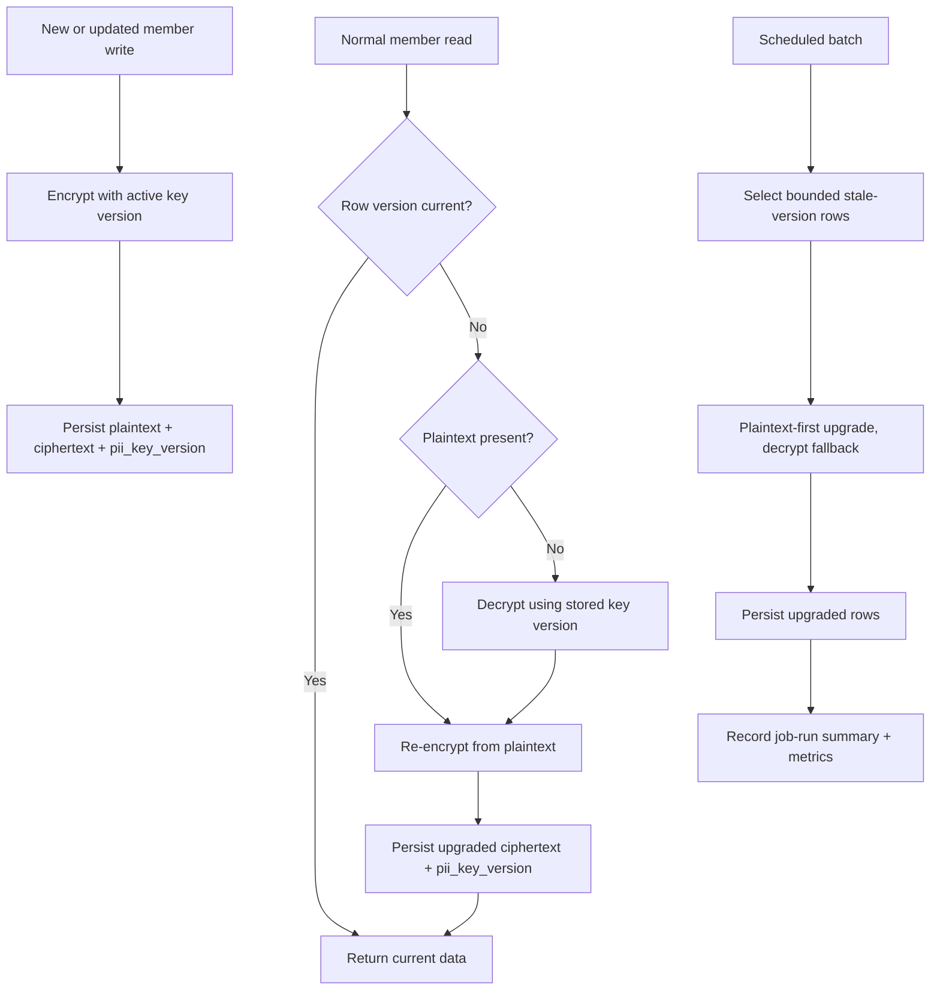
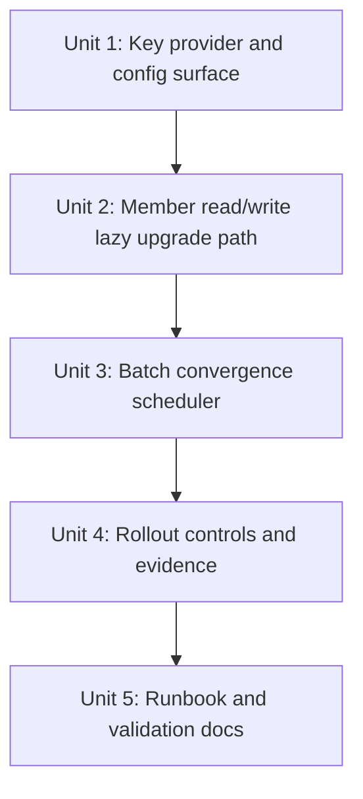

# feat: Add lazy + batch PII key rotation

## Overview

This plan adds an online PII key-rotation path for member phone and birth date data using a mixed strategy: new writes use the active key version immediately, normal read/write flows lazily upgrade stale rows when they already have usable plaintext, and a background scheduler converges the remaining rows in bounded batches. The goal is to make key rotation operationally safe without breaking member search, uniqueness rules, or existing member-detail read flows.

## Problem Frame

The repo already encrypts member PII and persists `pii_key_version`, but the runtime still behaves like a single-key system:

- `backend/src/main/java/com/gymcrm/common/security/PiiEncryptionService.java` reads one `app.security.pii.encryption-key` value and always decrypts with that one key.
- `backend/src/main/java/com/gymcrm/member/service/MemberService.java` writes `pii_key_version`, but read fallback does not use that version to pick the right key.
- `backend/src/main/java/com/gymcrm/member/repository/MemberQueryRepository.java` uses the plaintext `phone` column for keyword search, and `backend/src/main/resources/db/migration/V3__create_members_and_products.sql` enforces active-member uniqueness on the plaintext phone column.
- `backend/src/main/resources/db/migration/V17__add_member_pii_encrypted_columns.sql` already created `pii_key_version` and an index (`idx_members_center_pii_key_version`) that can drive batch selection, but the app does not yet exploit that schema for rotation.

This means a straight key swap would cause mixed-version ciphertext reads to fail and would risk search regressions if plaintext handling is not preserved. Option C is the safest fit for this repo because it keeps the service online, reuses existing plaintext when available, and converges older rows with a scheduler pattern the codebase already uses.

## Requirements Trace

- R1. Mixed-version member rows must remain readable throughout rotation; stale ciphertext must not cause member detail or downstream member-based flows to fail.
- R2. All new member writes must encrypt with the active PII key version and persist that version in `pii_key_version`.
- R3. Existing rows on older key versions must converge to the active key version through a combination of lazy upgrades in normal flows and bounded scheduler-driven batches.
- R4. Member search and active-member uniqueness semantics must stay stable during and after rotation because current query and constraint behavior still depends on the plaintext `phone` column.
- R5. Rotation enablement, validation, rollback, and audit evidence must be explicit and executable, following the repo's rollout/runbook pattern.

## Scope Boundaries

- This plan does not remove the plaintext `phone` or `birth_date` columns.
- This plan does not redesign member search to use deterministic encrypted lookups or hashes.
- This plan does not change the external member API contract.
- This plan does not introduce KMS/Vault integration beyond the config shape needed to support multiple key versions.
- This plan does not retroactively edit existing Flyway migration files.

## Context & Research

### Relevant Code and Patterns

- `backend/src/main/java/com/gymcrm/common/security/PiiEncryptionService.java`
  Current AES-GCM implementation; rotation must replace its single-key assumption with version-aware key lookup.
- `backend/src/main/resources/application.yml`
  Existing home for `app.security.pii.encryption-key` and `app.security.pii.key-version`; runtime feature toggles in this repo also live here.
- `backend/src/main/java/com/gymcrm/member/service/MemberService.java`
  Current write path already records encrypted columns and `pii_key_version`; current read path already falls back from plaintext to ciphertext when plaintext is absent.
- `backend/src/main/java/com/gymcrm/member/repository/MemberRepository.java`
  Canonical persistence wrapper for member writes; should remain the entry point for encrypted-field updates.
- `backend/src/main/java/com/gymcrm/member/repository/MemberQueryRepository.java`
  QueryDSL home for list/search behavior and the likely place to add rotation candidate queries aligned with existing repository split rules.
- `backend/src/main/java/com/gymcrm/member/entity/MemberEntity.java`
  Confirms plaintext and ciphertext coexist today and that `pii_key_version` is already mapped.
- `backend/src/main/resources/db/migration/V17__add_member_pii_encrypted_columns.sql`
  Existing schema foundation for rotation; includes `idx_members_center_pii_key_version` for old-version row selection.
- `backend/src/main/java/com/gymcrm/membership/service/MembershipHoldAutoResumeScheduler.java`
  Scheduler pattern to follow: bounded candidate lookup, per-item error isolation, logging, and service delegation.
- `backend/src/main/java/com/gymcrm/membership/service/MembershipSchedulerActorGuard.java`
  Guard pattern for ensuring scheduled work has a valid actor identity before jobs run.
- `backend/src/main/resources/db/migration/V38__backfill_legacy_trainer_settlements_into_canonical.sql`
  One-off guarded backfill style with prechecks and idempotence; useful as a reference for rotation safety criteria even though key rotation itself should not be SQL-only.
- `backend/src/test/java/com/gymcrm/member/MemberPiiEncryptionIntegrationTest.java`
  Direct template for asserting encrypted-column writes and ciphertext fallback behavior.
- `backend/src/test/java/com/gymcrm/settlement/TrainerSettlementBridgeBackfillIntegrationTest.java`
  Template for idempotent backfill validation and failure-path coverage.

### Institutional Learnings

- `docs/solutions/documentation-gaps/post-phase11-plan-rollback-control-and-audit-retention-validation-gymcrm-20260304.md`
  Rollout plans in this repo must document `Threshold + Window + Owner + Control Mechanism`, plus executable SQL/log evidence.
- `docs/solutions/database-issues/member-summary-index-deployment-lock-mitigation-gymcrm-20260305.md`
  Risky data changes should have preflight checks, Go/No-Go gates, and explicit rollback actions rather than generic prose.

### External References

- None needed. The repo already has direct patterns for schedulers, backfills, feature flags, validation notes, and guarded migrations.

## Key Technical Decisions

- Introduce version-aware key lookup instead of swapping the global key in place.
  `pii_key_version` is already stored per row, so runtime decryption should finally honor that version rather than pretending the table is single-key.
- Keep plaintext columns as the source of truth for search and uniqueness during this milestone.
  Current query and index behavior depend on plaintext `phone`, so rotation must preserve and repopulate plaintext rather than trying to remove it mid-stream.
- Prefer plaintext-first lazy upgrades, then fallback decrypt when plaintext is missing.
  Most rows already retain plaintext because create/update writes both forms today. Lazy rotation should opportunistically re-encrypt from plaintext when present and only invoke version-aware decrypt for rows that rely on encrypted fallback.
- Use a scheduler-based batch convergence job rather than a SQL-only backfill.
    Key material should stay in the application security boundary, and the repo already has a strong Spring scheduler pattern for online background work. The job should use `@Transactional` at the service boundary for each row upgrade to ensure plaintext and ciphertext stay in sync.
- Mitigate concurrency risks between lazy and batch upgrades.
    Since both paths can target the same stale row, the implementation must use optimistic locking (via `MemberEntity.updatedAt` or similar) or version-check-before-write to avoid lost updates. Batch selection should skip rows that were recently updated by lazy flows.
- Ensure key rotation is transparent to audit logging.
    Rotation is a system-internal data maintenance task, not a business-driven access event. Encryption and decryption performed solely for rotation purposes must not trigger `recordPiiRead` or create new `AuditLog` entries for individual members to avoid audit log pollution and false-positive access alerts. Only the batch job summary itself should be recorded as an operational event.
- Gate rotation behind explicit runtime flags and keep the legacy code path available until validation closes.
    This matches the repo's Redis/auth rollout style and provides a clear rollback lever if mixed-version reads misbehave.
- Record batch progress through aggregated job-run evidence rather than per-row audit-log spam.
  Existing member detail reads already create `recordPiiRead` entries. The batch job should instead publish run summaries through `AuditRetentionJobRunRepository` and structured logs so operators have evidence without exploding audit volume.

## Open Questions

### Resolved During Planning

- Should the batch rotation be a pure SQL backfill? No. Secrets stay in application code, so the repo's scheduler/service pattern is the safer fit.
- Should this milestone remove plaintext PII columns? No. Search and uniqueness still depend on plaintext phone, so column removal is explicitly out of scope.
- Should lazy rotation depend on ciphertext decrypt for every stale row? No. It should reuse plaintext when present and only decrypt when plaintext is missing.

### Deferred to Implementation

- Should the key provider read multi-version keys from individual env vars or a structured map property? Defer until implementation so the config binding matches the team's deployment tooling.
- Should the batch scheduler iterate globally or center-scoped first to best exploit `idx_members_center_pii_key_version`? Defer until the implementer inspects likely production row counts and existing center iteration utilities.

## High-Level Technical Design

> *This illustrates the intended approach and is directional guidance for review, not implementation specification. The implementing agent should treat it as context, not code to reproduce.*

## Implementation Units

- [ ] **Unit 1: Add a version-aware PII key provider and rotation config surface**

**Goal:** Replace the single-key assumption with a runtime component that can decrypt historical ciphertext by `pii_key_version` and encrypt with the active version.

**Requirements:** R1, R2, R5

**Dependencies:** None

**Files:**
- Add: `backend/src/main/java/com/gymcrm/common/security/PiiKeyProvider.java`
- Add: `backend/src/main/java/com/gymcrm/common/security/PiiKeyProperties.java`
- Modify: `backend/src/main/java/com/gymcrm/common/security/PiiEncryptionService.java`
- Modify: `backend/src/main/resources/application.yml`
- Test: `backend/src/test/java/com/gymcrm/common/security/PiiEncryptionServiceTest.java`

**Approach:**
- Introduce a configuration shape that separates the active key version from the version-to-key lookup table. Use `@ConfigurationProperties` to bind a map of versions to keys.
- Extend the encryption service so decrypt can resolve the correct key from the row's stored version while encrypt still uses the current active version.
- Add a rotation enable flag so the legacy single-key behavior can remain available until rollout validates the new path.
- Keep the public API of the encryption service small; the member layer should not own raw key selection logic.
- Ensure `PiiEncryptionService` supports a "bypass audit" mode or separate internal methods for rotation that do not trigger the standard PII read audit events.

**Patterns to follow:**
- `backend/src/main/java/com/gymcrm/common/auth/AccessTokenDenylistConfig.java`
- `backend/src/main/resources/application.yml`
- `backend/src/main/java/com/gymcrm/common/security/PiiEncryptionService.java`

**Test scenarios:**
- Happy path: encrypt uses the configured active key version and returns ciphertext that decrypts with the matching version key.
- Happy path: decrypt succeeds for ciphertext generated with an older configured key version.
- Error path: decrypt fails with a clear exception when the row references an unknown key version.
- Error path: rotation-enabled configuration fails fast when the active version has no configured key.
- Edge case: rotation-disabled mode preserves current single-key behavior for existing call sites.
- Edge case: ensure keys are never logged in cleartext even during configuration error reporting.

**Verification:**
- The security layer can decrypt mixed-version ciphertext without switching the global application key, and the old path is still gateable off through config.

- [ ] **Unit 2: Add plaintext-first lazy upgrade to member read/write flows**

**Goal:** Ensure normal member create/update/read paths always write the active version and opportunistically upgrade stale rows without breaking existing search and uniqueness semantics.

**Requirements:** R1, R2, R3, R4

**Dependencies:** Unit 1

**Files:**
- Modify: `backend/src/main/java/com/gymcrm/member/service/MemberService.java`
- Add: `backend/src/main/java/com/gymcrm/member/service/MemberPiiRotationService.java`
- Modify: `backend/src/main/java/com/gymcrm/member/repository/MemberRepository.java`
- Modify: `backend/src/main/java/com/gymcrm/member/repository/MemberQueryRepository.java`
- Modify: `backend/src/main/java/com/gymcrm/member/entity/MemberEntity.java`
- Test: `backend/src/test/java/com/gymcrm/member/MemberPiiEncryptionIntegrationTest.java`
- Test: `backend/src/test/java/com/gymcrm/member/MemberServiceTest.java`

**Approach:**
- Keep create/update on the current active key version and continue writing plaintext plus ciphertext.
- Extract lazy-rotation logic into a dedicated member service so `MemberService` stays focused on member workflows while the rotation behavior remains reusable for the scheduler.
- On reads of stale-version rows, use plaintext as the upgrade source when available; only decrypt legacy ciphertext when plaintext is blank.
- Persist lazy upgrades atomically through `MemberRepository` so `phone`, `phone_encrypted`, `birth_date_encrypted`, and `pii_key_version` stay in sync.
- Use internal security service methods that bypass the standard "PII read" audit logging for these system-driven rotation writes.
- Use optimistic locking or "check then write" to ensure a concurrent batch upgrade doesn't overwrite a lazy upgrade.
- Keep list/search behavior unchanged in this milestone; any needed repository changes should support candidate selection or persistence, not redesign search.

**Patterns to follow:**
- `backend/src/main/java/com/gymcrm/member/service/MemberService.java`
- `backend/src/main/java/com/gymcrm/common/auth/service/AuthAccountLifecycleService.java`
- `backend/src/test/java/com/gymcrm/member/MemberPiiEncryptionIntegrationTest.java`

**Test scenarios:**
- Happy path: member create persists ciphertext and the active `pii_key_version`.
- Happy path: member update re-encrypts with the active key version and keeps plaintext search fields intact.
- Happy path: reading a stale-version row with plaintext present upgrades ciphertext and `pii_key_version` without changing the returned business payload.
- Edge case: reading a stale-version row with plaintext missing decrypts using the stored key version, returns the expected phone/birth date, and persists the upgraded version.
- Error path: unknown or misconfigured old key version surfaces a controlled application failure instead of silently returning blank PII.
- Integration: a lazily upgraded member remains searchable by the same phone keyword before and after the upgrade.
- Audit Isolation: verify that lazy rotation reads do not create new entries in the `AuditLog` or trigger `recordPiiRead` notifications for the member.
- Concurrency: verify that two simultaneous reads of a stale row result in only one successful database update.

**Verification:**
- Normal member reads and writes keep working while stale rows opportunistically move to the active key version with no search regression.

- [ ] **Unit 3: Add a bounded scheduler job to converge remaining stale-version rows**

**Goal:** Converge the rows that lazy rotation will not touch quickly enough by processing old-version members in restartable, bounded background batches.

**Requirements:** R3, R5

**Dependencies:** Unit 2

**Files:**
- Add: `backend/src/main/java/com/gymcrm/member/service/MemberPiiRotationScheduler.java`
- Add: `backend/src/main/java/com/gymcrm/member/service/MemberPiiRotationSchedulerActorGuard.java`
- Modify: `backend/src/main/java/com/gymcrm/member/repository/MemberRepository.java`
- Modify: `backend/src/main/java/com/gymcrm/member/repository/MemberQueryRepository.java`
- Modify: `backend/src/main/resources/application.yml`
- Test: `backend/src/test/java/com/gymcrm/member/MemberPiiRotationSchedulerIntegrationTest.java`

**Approach:**
- Follow the repo scheduler pattern: cron-based trigger, bounded candidate lookup, per-row try/catch isolation, and service-level processing.
- Select only stale-version rows, aligned with `idx_members_center_pii_key_version`, so the job is restartable and does not scan the whole table every run.
- Include a "last updated" threshold in the selection query to avoid picking up rows that were recently touched by lazy rotation.
- Reuse the same plaintext-first upgrade service from Unit 2 to keep lazy and batch behavior consistent.
- Gate the scheduler behind a dedicated feature flag and batch-size config so rollout can start small and stop cleanly.
- Add an actor guard so job-owned writes and audit summaries have a stable actor identity.

**Patterns to follow:**
- `backend/src/main/java/com/gymcrm/membership/service/MembershipHoldAutoResumeScheduler.java`
- `backend/src/main/java/com/gymcrm/membership/service/MembershipSchedulerActorGuard.java`
- `backend/src/main/resources/db/migration/V17__add_member_pii_encrypted_columns.sql`

**Test scenarios:**
- Happy path: the scheduler upgrades a bounded set of stale-version rows and leaves already-current rows untouched.
- Edge case: a row missing plaintext still upgrades successfully through decrypt fallback when the historical key exists.
- Error path: one row with bad key metadata is logged and skipped while the rest of the batch continues.
- Edge case: rerunning the scheduler after a partial batch is idempotent and does not rewrite already-current rows.
- Integration: the scheduler respects the feature flag and does nothing when rotation batching is disabled.
- Load check: ensure the candidate query uses the index effectively even with the version filter.

**Verification:**
- Operators can turn on a bounded background job that steadily reduces old-version row counts without requiring downtime or one-shot full-table processing.

- [ ] **Unit 4: Add rollout controls, job-run evidence, and rotation validation surfaces**

**Goal:** Make the rotation observable and reversible with repo-native evidence collection rather than relying on hopeful logs.

**Requirements:** R1, R3, R5

**Dependencies:** Unit 3

**Files:**
- Modify: `backend/src/main/java/com/gymcrm/audit/AuditRetentionJobRunRepository.java`
- Modify: `backend/src/main/java/com/gymcrm/audit/AuditLogService.java`
- Modify: `backend/src/main/java/com/gymcrm/member/controller/MemberController.java`
- Add: `backend/src/test/java/com/gymcrm/member/MemberPiiRotationOperationalIntegrationTest.java`

**Approach:**
- Record aggregated scheduler-run summaries (start/end, counts, failure totals, active version) through `AuditRetentionJobRunRepository` so rollout notes can attach executable evidence.
- Keep existing user-triggered `recordPiiRead` behavior unchanged; the goal is operational evidence for the batch, not per-row noise.
- Expose or document validation queries around `pii_key_version` distribution, decrypt failures, and recent job runs so rollout notes can follow the auth/Redis validation pattern.
- Ensure the rotation path logs enough structured context to support rollback decisions without exposing raw plaintext.

**Patterns to follow:**
- `backend/src/main/java/com/gymcrm/audit/AuditRetentionJobRunRepository.java`
- `backend/src/main/java/com/gymcrm/member/controller/MemberController.java`
- `docs/notes/2026-03-10-auth-operational-revoke-rollout-validation.md`

**Test scenarios:**
- Happy path: a successful scheduler run writes a job-run summary containing counts for upgraded and skipped rows.
- Error path: a scheduler run with row-level failures records the failure count and still closes the job run cleanly.
- Integration: member detail reads still emit the existing PII read audit event after rotation logic lands.
- Audit Isolation: confirm that pure rotation tasks (lazy or batch) are excluded from member-level PII read logs to maintain audit signal-to-noise ratio.
- Edge case: rotation logging never includes raw phone or birth date values.

**Verification:**
- A rollout operator can answer “what rotated, what failed, and should we stop?” using stored job-run evidence plus structured logs.

- [ ] **Unit 5: Publish a rotation runbook and validation checklist**

**Goal:** Document the staged rollout, validation queries, rollback triggers, and owner expectations so the work is executable in staging and production.

**Requirements:** R5

**Dependencies:** Unit 4

**Files:**
- Add: `docs/ops/pii-key-rotation-runbook.md`
- Add: `docs/notes/2026-05-06-pii-key-rotation-validation.md`

**Approach:**
- Write the runbook in the same style as the staging/auth/Redis notes: rollout order, enable flags, healthy signals, failure signals, rollback action, and validation window.
- Include executable SQL examples for counting stale-version rows and inspecting recent job-run evidence.
- Make rollback explicit: disable rotation flags, stop the scheduler, keep old keys available, and redeploy prior code if needed.
- Capture where implementation-time evidence must be attached (validation note, PR, or follow-up rollout log) so completion is reviewable.

**Patterns to follow:**
- `docs/ops/selfhosted-staging-runbook.md`
- `docs/notes/2026-03-10-auth-operational-revoke-rollout-validation.md`
- `docs/notes/2026-03-10-redis-runtime-rollout-validation.md`
- `docs/solutions/documentation-gaps/post-phase11-plan-rollback-control-and-audit-retention-validation-gymcrm-20260304.md`

**Test scenarios:**
- Test expectation: none -- documentation and operational guidance only. The implementation work above provides the executable validation surfaces this runbook will reference.

**Verification:**
- The rollout has a concrete checklist with thresholds, owners, validation windows, and rollback controls rather than generic migration prose.

## System-Wide Impact

- **Interaction graph:** `MemberController` -> `MemberService`/`MemberPiiRotationService` -> `MemberRepository`/`MemberQueryRepository` -> `PiiEncryptionService`/`PiiKeyProvider`, plus `MemberPiiRotationScheduler` -> `AuditRetentionJobRunRepository` for convergence evidence.
- **Error propagation:** key-version lookup and decrypt failures must be converted into controlled application errors and job-run failure counts rather than uncaught generic 500s across the member surface.
- **State lifecycle risks:** partial updates could leave plaintext, ciphertext, and `pii_key_version` inconsistent; all rotation writes must update those fields atomically.
- **API surface parity:** no external member API shape changes are planned; `/api/v1/members` list/detail/search behavior must remain stable.
- **Integration coverage:** member detail fallback, member search by phone, scheduler idempotence, and job-run evidence all need integration-level validation because unit tests alone will not prove cross-layer safety.
- **Unchanged invariants:** `uk_members_center_phone_active` remains the active uniqueness guard, and plaintext phone remains populated so current list/search behavior continues to work.

## Risks & Dependencies

| Risk | Mitigation |
|------|------------|
| Mixed-version decrypt failures cause member-detail regressions | Ship version-aware key lookup before enabling rotation; add integration coverage for old-version rows and unknown-version failures |
| Lazy or batch upgrades break phone search or uniqueness behavior | Keep plaintext as the upgrade source of truth, persist plaintext with every rotation write, and cover search/duplicate scenarios in integration tests |
| Scheduler scans too broadly and creates avoidable DB pressure | Align candidate selection with `idx_members_center_pii_key_version`, use bounded batch size config, and validate row counts during staging |
| Rollback is ambiguous once mixed versions exist | Keep rotation behind explicit flags, preserve old key material until validation closes, and document precise rollback steps in the runbook |
| Batch evidence is too weak for security-sensitive rollout decisions | Record aggregated job-run summaries and executable validation queries following the auth/Redis rollout note pattern |

## Documentation / Operational Notes

| Control area | Threshold | Window | Owner | Control mechanism |
|---|---|---|---|---|
| Lazy read errors | any sustained decrypt/key-version failure on member detail reads | immediate during rollout window | backend owner | `app.security.pii.rotation-enabled=false` + redeploy previous code if needed |
| Batch job failures | repeated row-level failures above agreed staging baseline | per scheduled run and first 30 minutes after enable | backend owner | disable batch flag / stop scheduler and keep old keys available |
| Search regression | `/api/v1/members` keyword search mismatch or latency regression | first validation window after enable | backend owner | disable rotation flags and validate plaintext persistence before retry |

- Validation note should attach executable SQL for counts by `pii_key_version`, recent `audit_retention_job_runs` rows for the rotation job, and smoke checks for member detail + search.
- Old key material must remain available until stale-version row count reaches zero and the validation note is signed off.
- Any later milestone that removes plaintext PII should be planned separately because it changes search, uniqueness, and contract-adjacent behavior.

## Sources & References

- Related code: `backend/src/main/java/com/gymcrm/common/security/PiiEncryptionService.java`
- Related code: `backend/src/main/java/com/gymcrm/member/service/MemberService.java`
- Related code: `backend/src/main/java/com/gymcrm/member/repository/MemberQueryRepository.java`
- Related code: `backend/src/main/resources/db/migration/V17__add_member_pii_encrypted_columns.sql`
- Related code: `backend/src/main/java/com/gymcrm/membership/service/MembershipHoldAutoResumeScheduler.java`
- Related code: `backend/src/main/java/com/gymcrm/audit/AuditRetentionJobRunRepository.java`
- Related docs: `docs/notes/2026-03-10-auth-operational-revoke-rollout-validation.md`
- Related docs: `docs/notes/2026-03-10-redis-runtime-rollout-validation.md`
- Related docs: `docs/solutions/database-issues/member-summary-index-deployment-lock-mitigation-gymcrm-20260305.md`
- Related docs: `docs/solutions/documentation-gaps/post-phase11-plan-rollback-control-and-audit-retention-validation-gymcrm-20260304.md`
