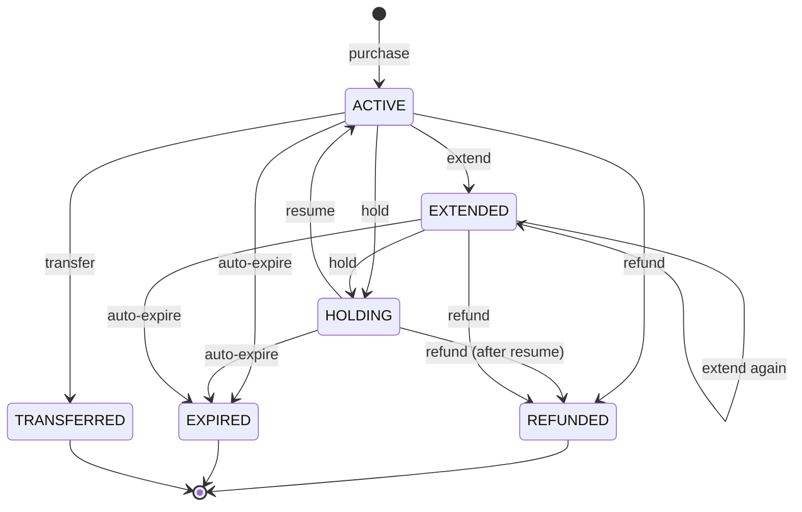
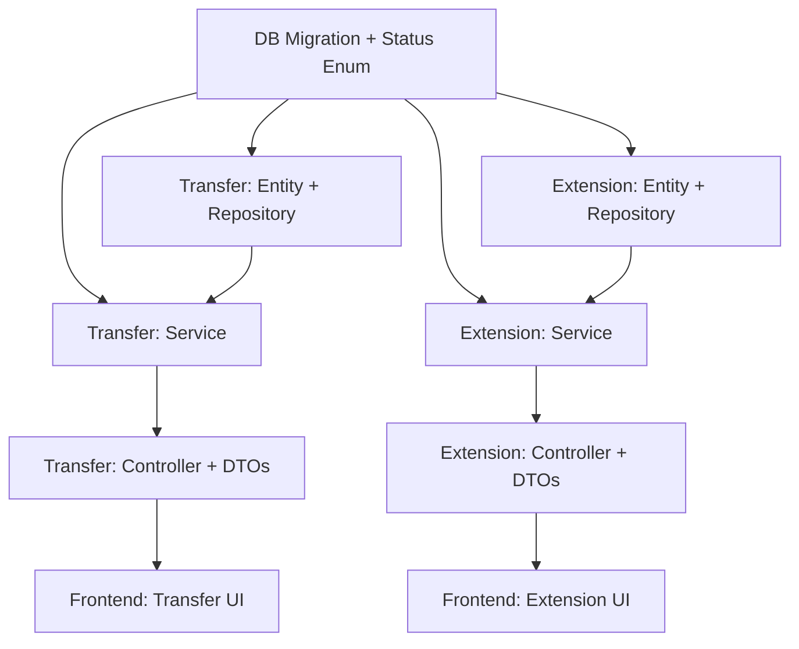

# feat: Add Membership Transfer & Extension (양도/연장)

## Overview

Implement two Must-Have requirements from the requirements analysis document that are currently missing from the codebase:

- **FR-MBR-005 (회원권 양도):** Transfer remaining membership (duration or count) from one member to another, with optional transfer fee, validation of product transfer policy, and notification to both parties.
- **FR-MBR-008 (회원권 연장):** Extend a duration-based membership's end date with additional payment.

Both features follow the existing membership operation patterns (purchase, hold, refund) already established in the codebase.

## Problem Frame

The current system supports membership lifecycle operations: purchase (ACTIVE), hold (HOLDING↔ACTIVE), and refund (REFUNDED). However, two critical business operations are missing:

1. **Transfer:** Members cannot transfer their remaining membership to another person — a common request for relocation, injury, or personal reasons. The product already has `allowTransfer` boolean but no transfer logic exists.
2. **Extension:** Members cannot extend their duration-based membership — they would need to purchase a new membership instead.

Without these features, front desk staff must handle these scenarios manually (offline), leading to revenue leakage and poor member experience.

## Requirements Trace

Carried from origin: `docs/01_요구사항_분석서.md`

- **R1 (FR-MBR-005):** Transfer remaining membership (duration or count) from transferor to transferee member. Transfer fee is configurable. Product's `allowTransfer` policy must be respected.
- **R2 (FR-MBR-005):** Transferor's membership status changes to '양도 완료' (TRANSFERRED). Transferee receives a new membership with the remaining duration/count.
- **R3 (FR-MBR-005):** Transfer fee payment is recorded when applicable. Both parties receive notification (알림톡).
- **R4 (FR-MBR-008):** Extend a duration-based membership's end date by additional period. Additional payment is processed.
- **R5 (FR-MBR-008):** Only ACTIVE duration memberships are eligible for extension. Extended amount and new end date are recorded.
- **R6 (Both):** All operations follow RBAC: 프론트데스크 and 센터 매니저 can execute; 회원 can request hold (but transfer/extend are desk/manager operations per UC-03/FR-MBR-008 actor specification).

## Scope Boundaries

- **In scope:** Backend (controller/service/repository/entity/DTO/migration), frontend (UI for transfer/extend within MembershipsPage)
- **Out of scope:**
  - Mobile/member self-service transfer or extension (FR-MBR-008 actor is 프론트데스크 per requirements; FR-MBR-005 is 프론트데스크 + 센터 매니저)
  - Partial transfer (e.g., transfer only some sessions of a count membership)
  - Cross-center transfer (both members must belong to the same center)
  - Promotion/discount on extension price (FR-PRD-007 is separately scoped)

## Context & Research

### Relevant Code and Patterns

**Existing membership operations (patterns to mirror):**

| Operation | Controller | Service | Entity/Record | Migration |
|-----------|-----------|---------|--------------|-----------|
| Purchase | `MembershipPurchaseController` | `MembershipPurchaseService` | `MemberMembership`, `Payment` | V4 |
| Hold | `MembershipHoldController` | `MembershipHoldService` | `MembershipHold` | V4, V5 |
| Refund | `MembershipRefundController` | `MembershipRefundService` | `MembershipRefund` | V4 |
| Status transitions | — | `MembershipStatusTransitionService` | `MembershipStatus` enum | — |

**Key architectural patterns to follow:**
- Controllers use `assertMembershipBelongsToMember(memberId, membershipId)` guard with `@PreAuthorize(AccessPolicies.PROTOTYPE_OR_MANAGER_OR_DESK)`
- Services use inner record types for request/result (`*Request`, `*Result`, `*Calculation`)
- `MemberMembershipRepository` provides `updateStatus()`, `updateStatusIfCurrent()`, `updateAfterResume()`, `insert()`
- `PaymentRepository.insert()` records financial transactions; `payment_type` CHECK currently allows `PURCHASE`, `REFUND` — needs `TRANSFER_FEE`, `EXTENSION`
- `MembershipStatusTransitionService` uses `ALLOWED_TRANSITIONS` map — needs TRANSFERRED and EXTENDED states
- `CrmMessageSender` interface abstracts Kakao/SMS dispatch; called via `CrmMessageService`

**Institutional learnings:**
- `docs/solutions/database-issues/membership-hold-refund-state-integrity-gymcrm-20260224.md`: State integrity must be enforced at DB level (partial unique index) + service pre-check + UI guard. Never rely on application-level pre-check alone for concurrency safety.
- The repo follows `XxxRepository` + `XxxQueryRepository` split for JPA + QueryDSL. For transfer/extend, the existing `MemberMembershipRepository` methods are sufficient; no new QueryDSL repository is needed unless complex search is added later.

### External References

None needed — codebase has strong, consistent local patterns for all required operations.

## Key Technical Decisions

### Decision 1: New `TRANSFERRED` and `EXTENDED` membership statuses

**Approach:** Add `TRANSFERRED` and `EXTENDED` to `MembershipStatus` enum.
- `TRANSFERRED`: Terminal state (no further transitions). Applied to the transferor's old membership.
- `EXTENDED`: Non-terminal state. Applied to a membership after extension — the membership remains active but is marked as "has been extended" for audit purposes.

**Rationale:** 
- Without `TRANSFERRED`, the old membership would need to be soft-deleted, but the audit trail (payments, holds) would be lost. A terminal status preserves the record.
- `EXTENDED` as a non-terminal state allows further operations (hold, another extension, refund) on the extended membership. The alternative — keeping it as `ACTIVE` — loses the information that an extension occurred, which matters for settlement reporting.

**Rejected alternative:** Reuse `REFUNDED` for transferor's membership. Rejected because refund and transfer have different financial semantics (refund = money returned; transfer = ownership changed).

### Decision 2: Transfer creates a new membership for the transferee

**Approach:** The transferor's membership is set to `TRANSFERRED`. A brand-new `MemberMembership` row is created for the transferee with:
- Same `product_id`, snapshots, and remaining days/count
- `start_date` = today (or requested date), `end_date` recalculated from remaining days
- `purchased_at` = now, `created_by` = actor user ID
- Memo indicating it is a transferred membership

**Rationale:** This is the cleanest approach. The transferee's membership has its own lifecycle independent of the transferor. Alternative of changing `member_id` on the existing row would break audit trails and create confusing history.

### Decision 3: Transfer fee uses the existing Payment table

**Approach:** Add `TRANSFER_FEE` to `payment_type` CHECK constraint. When a transfer fee > 0, create a `Payment` row of type `TRANSFER_FEE` linked to the transferor (who pays the fee). The new membership created for the transferee does not have a separate purchase payment.

**Rationale:** The existing `payments` table already handles all financial flows. Adding a new payment type is cleaner than creating a separate `membership_transfers` financial table. The `membership_transfers` table (new) stores the transfer metadata (transferor, transferee, fee_payment_id, reason).

### Decision 4: Extension uses Payment table with EXTENSION type

**Approach:** Add `EXTENSION` to `payment_type` CHECK. When a member extends, create a `Payment` of type `EXTENSION` with the extension fee amount. Update the membership's `end_date` and set status to `EXTENDED`.

**Rationale:** Consistent with Decision 3. Extension is a financial transaction that needs to be reflected in sales reports.

### Decision 5: `membership_transfers` table for audit trail

**Approach:** Create a new `membership_transfers` table storing:
- `transferor_membership_id` (the old membership that became TRANSFERRED)
- `transferee_membership_id` (the new membership created for the transferee)
- `transferor_member_id`, `transferee_member_id`
- `transfer_fee_payment_id` (FK to payments, nullable)
- `reason`, `memo`
- `transferred_at`, `created_by`

**Rationale:** Both UC-03 and FR-MBR-005 require full audit trail of who transferred to whom, when, and for what reason. A dedicated table is cleaner than embedding this in the membership memo.

### Decision 6: `membership_extensions` table for audit trail

**Approach:** Create a new `membership_extensions` table storing:
- `membership_id` (the extended membership)
- `original_end_date`, `new_end_date`
- `extension_days`, `extension_payment_id` (FK to payments)
- `reason`, `memo`
- `extended_at`, `created_by`

**Rationale:** Same audit rationale as transfers. Extension history should be queryable independently.

## Open Questions

### Resolved During Planning

- **Q: Can count-based memberships be extended?** → No. FR-MBR-008 says "기간제 회원권의 만료일을 연장한다." Only DURATION memberships are eligible for extension.
- **Q: Can a TRANSFERRED membership be further operated on?** → No. `TRANSFERRED` is a terminal state (like `REFUNDED`, `EXPIRED`). No transitions out of it.
- **Q: Can an EXTENDED membership be held/refunded?** → Yes. `EXTENDED` allows transitions to `HOLDING` and `REFUNDED`. Extension is just an end-date change with payment, not a terminal state.
- **Q: Who pays the transfer fee?** → The transferor (existing member) pays the transfer fee. The transferee receives the membership without additional payment (beyond the fee).
- **Q: Does the transferee need to be already registered as a member?** → Yes. Per UC-03, "양수인(Transferee) 회원이 시스템에 등록되어 있다." The transferee must be an existing member.

### Deferred to Implementation

- **Exact transfer fee amount source:** Whether it's a fixed amount from product config, a percentage, or entered manually at the desk. Current product schema has no `transfer_fee_amount` field. Plan: allow manual fee input in the request DTO, with a default of 0 (no fee). A future product enhancement can add configurable fees.
- **CRM notification templates:** The specific Kakao template IDs for transfer and extend notifications. Plan: use the existing `CrmMessageService` with a generic event type; template seeding can be a separate migration.
- **Extension price calculation:** Per-day rate vs. full product price re-application. Plan: calculate pro-rata based on product's `price_amount / validity_days` for the extension period.

<!-- High-Level Technical Design omitted — the approach is straightforward: each feature (transfer, extend) follows the exact same controller → service → repository → entity/DTO → migration pattern as the existing hold/refund operations. The mermaid diagrams below illustrate the state transitions and data flow. -->

## High-Level Technical Design

> *This illustrates the intended approach and is directional guidance for review, not implementation specification. The implementing agent should treat it as context, not code to reproduce.*

### Membership State Machine (after changes)



### Transfer Data Flow

```
POST /members/{memberId}/memberships/{membershipId}/transfer
  │
  ├─ 1. Lookup transferor membership, validate belongs to member
  ├─ 2. Validate: status=ACTIVE, product.allowTransfer=true, no active holds
  ├─ 3. Lookup transferee member, validate same center, active status
  ├─ 4. Calculate remaining days/count from transferor membership
  ├─ 5. Create new MemberMembership for transferee
  ├─ 6. If fee > 0: create Payment(TRANSFER_FEE) for transferor
  ├─ 7. Update transferor membership status → TRANSFERRED
  ├─ 8. Insert membership_transfers audit record
  └─ 9. Send notifications to both parties via CrmMessageService
```

### Extension Data Flow

```
POST /members/{memberId}/memberships/{membershipId}/extend
  │
  ├─ 1. Lookup membership, validate belongs to member
  ├─ 2. Validate: status=ACTIVE or EXTENDED, productType=DURATION
  ├─ 3. Calculate extension fee (pro-rata or custom amount)
  ├─ 4. Create Payment(EXTENSION)
  ├─ 5. Update membership: end_date += extension_days, status → EXTENDED
  ├─ 6. Insert membership_extensions audit record
  └─ 7. Send notification via CrmMessageService
```

## Implementation Units

Dependency graph:



- [ ] **Unit 1: DB Migration + MembershipStatus Enum Update**

**Goal:** Add `TRANSFERRED` and `EXTENDED` to the membership status enum, extend the `payments` table `payment_type` CHECK, and create the `membership_transfers` and `membership_extensions` audit tables.

**Requirements:** R1, R2, R4, R5

**Dependencies:** None

**Files:**
- Create: `backend/src/main/resources/db/migration/V33__add_membership_transfer_extend.sql`
- Modify: `backend/src/main/java/com/gymcrm/membership/enums/MembershipStatus.java`

**Approach:**
- Single Flyway migration that:
  1. Updates `chk_member_memberships_status` CHECK to include `'TRANSFERRED'`, `'EXTENDED'`
  2. Updates `chk_payments_type` CHECK to include `'TRANSFER_FEE'`, `'EXTENSION'`
  3. Creates `membership_transfers` table with FK references to `member_memberships` (both transferor and transferee), `payments` (fee payment, nullable), and `members` (both parties)
  4. Creates `membership_extensions` table with FK reference to `member_memberships` and `payments`
  5. Adds indexes on `membership_transfers(transferee_member_id)`, `membership_extensions(membership_id)`
  6. **Update `SalesSettlementReportRepository` SQL queries** (lines 34-38, 92-96) to include `TRANSFER_FEE` in gross sales alongside `PURCHASE`, and `EXTENSION` in gross sales. Both are revenue and should appear in sales reports. The refund calculation should remain unchanged (only `REFUND` type subtracts).
- Update `MembershipStatus` enum: add `TRANSFERRED`, `EXTENDED`
- Update `MembershipStatusTransitionService.buildAllowedTransitions()`: add transitions from `ACTIVE → TRANSFERRED`, `ACTIVE → EXTENDED`, `EXTENDED → HOLDING`, `EXTENDED → REFUNDED`, `EXTENDED → EXTENDED`, `EXTENDED → EXPIRED`

**Patterns to follow:**
- V5 migration for partial unique index pattern
- V4 migration for table creation with CHECK constraints
- Existing `MembershipStatusTransitionService` transition map structure
- `SalesSettlementReportRepository` existing CASE WHEN pattern (add `OR p.payment_type = 'TRANSFER_FEE'` / `OR p.payment_type = 'EXTENSION'` conditions)

**Files to modify:**
- Create: `backend/src/main/resources/db/migration/V33__add_membership_transfer_extend.sql`
- Modify: `backend/src/main/java/com/gymcrm/membership/enums/MembershipStatus.java`
- Modify: `backend/src/main/java/com/gymcrm/membership/service/MembershipStatusTransitionService.java`
- Modify: `backend/src/main/java/com/gymcrm/settlement/repository/SalesSettlementReportRepository.java`

**Test scenarios:**
- Integration: Flyway migration applies cleanly on clean database (all tables created, constraints valid)
- Happy path: `MembershipStatusTransitionService` allows ACTIVE → TRANSFERRED, ACTIVE → EXTENDED, EXTENDED → EXTENDED, EXTENDED → HOLDING, EXTENDED → REFUNDED
- Error path: `MembershipStatusTransitionService` rejects TRANSFERRED → any state, EXTENDED → ACTIVE (direct reversal not allowed)
- Edge case: Enum `valueOf("TRANSFERRED")` and `valueOf("EXTENDED")` work correctly
- Integration: Sales report query includes `TRANSFER_FEE` in gross sales sum and `EXTENSION` in gross sales sum

**Verification:**
- `flyway_schema_history` shows V33 applied
- `MembershipStatus.values()` includes all 6 statuses
- Status transition map has correct entries for new states
- Sales report SQL queries reference `TRANSFER_FEE` and `EXTENSION` in gross sales CASE WHEN clauses

- [ ] **Unit 2: Transfer Entity + Domain Record + Repository**

**Goal:** Create `MembershipTransfer` entity/domain record and repository layer for persisting transfer audit records.

**Requirements:** R1, R2, R3

**Dependencies:** Unit 1

**Files:**
- Create: `backend/src/main/java/com/gymcrm/membership/entity/MembershipTransfer.java`
- Create: `backend/src/main/java/com/gymcrm/membership/entity/MembershipTransferEntity.java`
- Create: `backend/src/main/java/com/gymcrm/membership/repository/MembershipTransferRepository.java`
- Create: `backend/src/main/java/com/gymcrm/membership/repository/MembershipTransferJpaRepository.java`
- Test: `backend/src/test/java/com/gymcrm/membership/MembershipTransferRepositoryIntegrationTest.java`

**Approach:**
- `MembershipTransfer` record mirrors the DB table: transferor/transferee membership IDs, member IDs, fee payment ID, reason, memo, timestamps
- `MembershipTransferEntity` is the JPA entity with `@Entity`, `@Table`, column mappings
- `MembershipTransferJpaRepository` extends `JpaRepository<MembershipTransferEntity, Long>` with `findByMembershipId(Long)` method
- `MembershipTransferRepository` wraps JPA repo with `insert(MembershipTransferCreateCommand)` method following the same pattern as `MembershipRefundRepository`
- Follow the repo pattern: `JpaRepository` for basic persistence, outer `Repository` for command-based insert

**Patterns to follow:**
- `MembershipRefund` / `MembershipRefundEntity` / `MembershipRefundRepository` structure
- Repository `insert()` method with command record pattern (see `MemberMembershipRepository.insert()`)

**Test scenarios:**
- Happy path: `MembershipTransferRepository.insert()` creates a row and returns domain record with generated ID
- Integration: `findByMembershipId()` returns the transfer record for a given membership
- Edge case: Insert with null `transferFeePaymentId` (no fee charged) works correctly

**Verification:**
- Integration test passes: insert + find round-trip works
- Entity maps correctly to all DB columns

- [ ] **Unit 3: Transfer Service**

**Goal:** Implement `MembershipTransferService` with transfer validation, calculation, and execution logic.

**Requirements:** R1, R2, R3

**Dependencies:** Unit 1, Unit 2

**Files:**
- Create: `backend/src/main/java/com/gymcrm/membership/service/MembershipTransferService.java`
- Test: `backend/src/test/java/com/gymcrm/membership/MembershipTransferServiceTest.java`
- Test: `backend/src/test/java/com/gymcrm/membership/MembershipTransferServiceIntegrationTest.java`

**Approach:**
- **`preview(TransferPreviewRequest)`**: Calculate what would happen — remaining days/count, proposed transferee membership details, transfer fee. Read-only.
- **`transfer(TransferRequest)`**: Full execution:
  1. Get transferor membership, validate eligibility (ACTIVE status, product.allowTransfer=true, same center)
  2. Get transferee member, validate (active status, same center, exists)
  3. Calculate remaining days (for DURATION: endDate - startDate - holdDaysUsed) or remaining count (for COUNT)
  4. Create new `MemberMembership` for transferee via `MemberMembershipRepository.insert()`
  5. If fee > 0: create `Payment(TRANSFER_FEE)` via `PaymentRepository.insert()`
  6. Update transferor membership status to `TRANSFERRED` via `MemberMembershipRepository.updateStatusIfCurrent()`
  7. Insert `MembershipTransfer` audit record
  8. Return `TransferResult` containing both memberships, payment (if any), and transfer record
- Inner records: `TransferPreviewRequest`, `TransferRequest`, `TransferCalculation`, `TransferResult`
- Validation: reject if transferor has active holds, product disallows transfer, membership already terminal

**Execution note:** Implement test-first. Write `MembershipTransferServiceTest` with mocked dependencies before implementation, then `MembershipTransferServiceIntegrationTest` with real DB.

**Patterns to follow:**
- `MembershipRefundService` structure: preview (read-only) + execute (write), inner records for requests/results
- `MembershipPurchaseService` for membership creation pattern
- `MembershipRefundService.calculateRefund()` for remaining-day calculation logic (reuse the day-count approach)

**Test scenarios:**
- Happy path (DURATION): Transfer a 30-day membership with 20 days remaining → transferee gets new membership with 20 remaining days, transferor becomes TRANSFERRED
- Happy path (COUNT): Transfer a PT 10-count membership with 6 remaining → transferee gets 6 remaining, 6 total
- Happy path (with fee): Transfer with fee 50,000 → Payment(TRANSFER_FEE) created for transferor
- Edge case: Transfer with remaining count = 0 → rejected with appropriate error
- Edge case: Transfer with 0 fee → no Payment row created, membership_transfers.fee_payment_id is null
- Error path: Transferor membership is HOLDING → rejected
- Error path: Product allowTransfer = false → rejected
- Error path: Transferor and transferee in different centers → rejected
- Error path: Transferee member is not ACTIVE → rejected
- Error path: Membership already REFUNDED/TRANSFERRED/EXPIRED → rejected
- Integration: Transfer creates both memberships, payment (if fee), and transfer record atomically
- Integration: Concurrent transfer of same membership — only one succeeds (updateStatusIfCurrent pattern)

**Verification:**
- Unit tests cover all validation branches and calculation logic
- Integration test confirms end-to-end: transferor TRANSFERRED, transferee ACTIVE, audit record exists, payment created (if fee)

- [ ] **Unit 4: Transfer Controller + DTOs**

**Goal:** Create REST API endpoints for transfer preview and execution.

**Requirements:** R1, R2, R3

**Dependencies:** Unit 3

**Files:**
- Create: `backend/src/main/java/com/gymcrm/membership/controller/MembershipTransferController.java`
- Create: `backend/src/main/java/com/gymcrm/membership/dto/request/MembershipTransferRequest.java`
- Create: `backend/src/main/java/com/gymcrm/membership/dto/request/MembershipTransferPreviewRequest.java`
- Create: `backend/src/main/java/com/gymcrm/membership/dto/response/MembershipTransferResponse.java`
- Create: `backend/src/main/java/com/gymcrm/membership/dto/response/MembershipTransferPreviewResponse.java`
- Test: `backend/src/test/java/com/gymcrm/membership/MembershipTransferApiIntegrationTest.java`

**Approach:**
- Controller at `/api/v1/members/{memberId}/memberships/{membershipId}/transfer`
- `POST /preview` — returns transfer calculation (remaining days/count, fee)
- `POST /` — executes transfer with request body containing `transfereeMemberId`, `transferFee`, `reason`, `memo`
- `@PreAuthorize(AccessPolicies.PROTOTYPE_OR_MANAGER_OR_DESK)`
- `assertMembershipBelongsToMember()` guard (same pattern as hold/refund controllers)
- DTOs follow existing patterns: request records with `@Valid` annotations, response records with `from()` factory methods

**Patterns to follow:**
- `MembershipHoldController` — exact same structure, annotations, guards
- `MembershipRefundController` — preview + execute pattern

**Test scenarios:**
- Happy path: POST /transfer with valid transferee → 200, returns transfer details
- Happy path: POST /transfer/preview → 200, returns remaining days/count and calculated fee
- Error path: Missing transfereeMemberId → 400 validation error
- Error path: Non-existent transferee → 404
- Error path: Unauthorized role (e.g., trainer) → 403
- Integration: Full API round-trip from request to DB state change

**Verification:**
- API integration test passes: preview + execute creates correct DB state
- Controller endpoints match existing `/api/v1/members/{memberId}/memberships/{membershipId}/` pattern

- [ ] **Unit 5: Extension Entity + Domain Record + Repository**

**Goal:** Create `MembershipExtension` entity/domain record and repository for persisting extension audit records.

**Requirements:** R4, R5

**Dependencies:** Unit 1

**Files:**
- Create: `backend/src/main/java/com/gymcrm/membership/entity/MembershipExtension.java`
- Create: `backend/src/main/java/com/gymcrm/membership/entity/MembershipExtensionEntity.java`
- Create: `backend/src/main/java/com/gymcrm/membership/repository/MembershipExtensionRepository.java`
- Create: `backend/src/main/java/com/gymcrm/membership/repository/MembershipExtensionJpaRepository.java`
- Test: `backend/src/test/java/com/gymcrm/membership/MembershipExtensionRepositoryIntegrationTest.java`

**Approach:**
- Same structure as MembershipTransfer: record + JPA entity + outer repository with insert command
- Fields: membershipId, originalEndDate, newEndDate, extensionDays, extensionPaymentId, reason, memo, timestamps
- Follow `MembershipRefundRepository` pattern exactly

**Patterns to follow:**
- Unit 2 (MembershipTransfer) — identical structure
- `MembershipRefund` / `MembershipRefundRepository`

**Test scenarios:**
- Happy path: Insert extension record with all fields → round-trip retrieval works
- Edge case: Extension record with null reason/memo

**Verification:**
- Integration test passes: insert + find round-trip

- [ ] **Unit 6: Extension Service**

**Goal:** Implement `MembershipExtendService` with extension validation, calculation, and execution logic.

**Requirements:** R4, R5

**Dependencies:** Unit 1, Unit 5

**Files:**
- Create: `backend/src/main/java/com/gymcrm/membership/service/MembershipExtendService.java`
- Test: `backend/src/test/java/com/gymcrm/membership/MembershipExtendServiceTest.java`
- Test: `backend/src/test/java/com/gymcrm/membership/MembershipExtendServiceIntegrationTest.java`

**Approach:**
- **`preview(ExtendPreviewRequest)`**: Calculate extension cost for a given number of days. Pro-rata: `(priceAmount / validityDays) * extensionDays`.
- **`extend(ExtendRequest)`**: Full execution:
  1. Get membership, validate eligibility (ACTIVE or EXTENDED status, DURATION product type)
  2. Calculate extension fee (pro-rata or custom amount from request)
  3. Create `Payment(EXTENSION)` via `PaymentRepository.insert()`
  4. Update membership: `end_date += extensionDays`, status → `EXTENDED` via QueryDSL update (similar to `updateAfterResume`)
  5. Insert `MembershipExtension` audit record
  6. Return `ExtendResult`
- Need a new `updateEndDate()` method in `MemberMembershipRepository` (or reuse `updateAfterResume` pattern with QueryDSL)
- Inner records: `ExtendPreviewRequest`, `ExtendRequest`, `ExtendCalculation`, `ExtendResult`

**Execution note:** Implement test-first.

**Patterns to follow:**
- `MembershipRefundService` structure
- `MemberMembershipRepository.updateAfterResume()` for the QueryDSL update pattern (multiple fields set in one atomic update)

**Test scenarios:**
- Happy path: Extend 30-day membership by 15 days → end_date moves forward 15 days, status = EXTENDED, Payment(EXTENSION) created
- Happy path: Extend already-EXTENDED membership → further extension allowed, new end_date, status stays EXTENDED
- Happy path: Custom extension amount (user specifies amount different from pro-rata)
- Edge case: Extension days = 0 → rejected
- Error path: COUNT product → rejected (extension only for DURATION)
- Error path: HOLDING/REFUNDED/TRANSFERRED/EXPIRED → rejected
- Error path: No purchase payment found (shouldn't happen but guard needed)
- Integration: Extend creates payment, updates membership end_date, creates audit record atomically

**Verification:**
- Unit tests cover calculation and validation
- Integration test confirms: end_date updated correctly, payment created, audit record exists

- [ ] **Unit 7: Extension Controller + DTOs**

**Goal:** Create REST API endpoints for extension preview and execution.

**Requirements:** R4, R5

**Dependencies:** Unit 6

**Files:**
- Create: `backend/src/main/java/com/gymcrm/membership/controller/MembershipExtendController.java`
- Create: `backend/src/main/java/com/gymcrm/membership/dto/request/MembershipExtendRequest.java`
- Create: `backend/src/main/java/com/gymcrm/membership/dto/request/MembershipExtendPreviewRequest.java`
- Create: `backend/src/main/java/com/gymcrm/membership/dto/response/MembershipExtendResponse.java`
- Create: `backend/src/main/java/com/gymcrm/membership/dto/response/MembershipExtendPreviewResponse.java`
- Test: `backend/src/test/java/com/gymcrm/membership/MembershipExtendApiIntegrationTest.java`

**Approach:**
- Controller at `/api/v1/members/{memberId}/memberships/{membershipId}/extend`
- `POST /preview` — returns extension calculation (new end date, fee for given days)
- `POST /` — executes extension with `extensionDays`, `customAmount` (optional), `reason`, `memo`
- Same auth/guard patterns as other membership controllers

**Patterns to follow:**
- `MembershipHoldController`, `MembershipRefundController`

**Test scenarios:**
- Happy path: POST /extend → 200, membership end_date updated, EXTENDED status
- Happy path: POST /extend/preview → 200, returns calculated fee and new end date
- Error path: COUNT product → 400
- Error path: EXPIRED membership → 400

**Verification:**
- API integration test passes

- [ ] **Unit 8: Frontend Transfer UI**

**Goal:** Add transfer action button and modal to the MembershipsPage for eligible memberships.

**Requirements:** R1, R2, R3

**Dependencies:** Unit 4

**Files:**
- Modify: `frontend/src/pages/memberships/MembershipsPage.tsx`
- Modify: `frontend/src/pages/memberships/modules/useMembershipPrototypeState.ts`
- Modify: `frontend/src/pages/memberships/modules/types.ts`
- Test: `frontend/src/pages/memberships/modules/useMembershipPrototypeState.test.tsx`

**Approach:**
- Add "양도" button to membership row actions (visible only for ACTIVE memberships where product allows transfer)
- Transfer modal: search/select transferee member, input reason, memo, transfer fee (default 0)
- Preview call to show remaining days/count before confirming
- On confirm: POST to transfer endpoint, refresh membership list, show success message
- Add TypeScript types for transfer request/response
- Wire mutation in `useMembershipPrototypeState` with `apiPost`

**Patterns to follow:**
- Existing hold/refund modal patterns in `MembershipsPage.tsx` and `useMembershipPrototypeState.ts`
- Member search component used elsewhere in the codebase (for transferee selection)

**Test scenarios:**
- Happy path: Click 양도 → select transferee → confirm → success message, membership list refreshed
- Edge case: 양도 button not shown for HOLDING/REFUNDED/EXPIRED memberships
- Error path: Transferee not found → error message shown

**Verification:**
- Frontend builds without errors (`npm run build`)
- Existing tests still pass

- [ ] **Unit 9: Frontend Extension UI**

**Goal:** Add extension action button and modal to the MembershipsPage for eligible duration memberships.

**Requirements:** R4, R5

**Dependencies:** Unit 7

**Files:**
- Modify: `frontend/src/pages/memberships/MembershipsPage.tsx`
- Modify: `frontend/src/pages/memberships/modules/useMembershipPrototypeState.ts`
- Modify: `frontend/src/pages/memberships/modules/types.ts`
- Test: `frontend/src/pages/memberships/modules/useMembershipPrototypeState.test.tsx`

**Approach:**
- Add "연장" button to membership row actions (visible only for ACTIVE/EXTENDED DURATION memberships)
- Extension modal: input extension days, preview shows new end date and calculated fee
- On confirm: POST to extend endpoint, refresh membership list, show success message
- Add TypeScript types for extension request/response
- Wire mutation in `useMembershipPrototypeState`

**Patterns to follow:**
- Same as Unit 8 (transfer UI) — consistent modal patterns

**Test scenarios:**
- Happy path: Click 연장 → input 30 days → preview shows fee → confirm → success
- Edge case: 연장 button not shown for COUNT memberships
- Edge case: 연장 button not shown for HOLDING/REFUNDED/TRANSFERRED/EXPIRED
- Error path: Extension days = 0 → validation error

**Verification:**
- Frontend builds without errors
- Existing tests still pass

## System-Wide Impact

- **Interaction graph:** 
  - `MembershipStatusTransitionService` — new transition rules affect all membership operations that check status
  - `PaymentRepository` / `payments` table — new payment types (`TRANSFER_FEE`, `EXTENSION`) affect sales settlement reports (FR-SAL-002, FR-SAL-003). **Critical:** `SalesSettlementReportRepository` (lines 34-38, 92-96) explicitly filters `payment_type = 'PURCHASE'` for gross sales and `payment_type = 'REFUND'` for refunds. New payment types will be **silently excluded** from gross sales unless the report SQL is updated. This must be addressed in Unit 1 or as a follow-up.
  - `CrmMessageService` — transfer/extend events should trigger notifications. The `CrmMessageEvent.entityType` field may need new event types.
  - `MemberMembershipRepository.updateStatusIfCurrent()` — used by transfer for atomic status change; same concurrency-safe pattern as hold

- **Error propagation:** Both transfer and extend use the existing `ApiException` + `ErrorCode` pattern. No new error codes needed beyond what's already available (`BUSINESS_RULE`, `VALIDATION_ERROR`, `CONFLICT`, `NOT_FOUND`).

- **State lifecycle risks:**
  - **Transfer:** Atomic operation — if the transferee membership is created but the transferor status update fails (race condition), the transferor could be left in an inconsistent state. Mitigation: use `updateStatusIfCurrent(currentStatus=ACTIVE)` so concurrent requests fail cleanly.
  - **Extension:** Similar — if payment succeeds but membership update fails. Mitigation: both operations are within a single `@Transactional` boundary.

- **API surface parity:** The transfer/extend endpoints follow the same URL pattern as hold/refund (`/members/{memberId}/memberships/{membershipId}/{action}`), maintaining API consistency.

- **Integration coverage:** Unit tests alone will not prove:
  - Transfer creates correct transferee membership with accurate remaining days (needs integration test with real DB date calculations)
  - Settlement reports correctly categorize TRANSFER_FEE and EXTENSION payments
  - CRM notifications are dispatched for transfer/extend events (requires CrmMessageSender integration)

- **Unchanged invariants:**
  - Existing membership operations (purchase, hold, refund) are not modified
  - RBAC policies remain unchanged (same `PROTOTYPE_OR_MANAGER_OR_DESK`)
  - `MemberMembership` core fields are not changed — only new statuses added
  - The `payments` table gains new `payment_type` values but existing types are unaffected

## Risks & Dependencies

| Risk | Likelihood | Impact | Mitigation |
|------|-----------|--------|------------|
| Transfer creates transferee membership but fails to update transferor status (partial state) | Low | High | Single `@Transactional` boundary + `updateStatusIfCurrent()` for atomic status change |
| Settlement reports silently exclude TRANSFER_FEE and EXTENSION from gross sales | **High** | **Medium** | `SalesSettlementReportRepository` uses explicit `payment_type = 'PURCHASE'` filters. Must update SQL to include new types OR explicitly document that transfer fees/extension payments are excluded. Address in Unit 1 or as separate follow-up task. |
| Extension price calculation discrepancy (pro-rata vs. business expectation) | Medium | Low | Defer exact pricing formula to implementation; allow `customAmount` override in request |
| Product `allowTransfer` field exists but was never tested in production | Low | Low | Unit test validates product check; integration test confirms end-to-end |
| CRM notification templates for transfer/extend don't exist yet | High | Low | Feature works without notifications (graceful degradation); template seeding as separate follow-up migration |
| Frontend: transferee member search performance with 5,000+ members | Low | Low | Existing member search already handles this (FR-MBR-002, NFR-004); reuse same component |

## Documentation / Operational Notes

- **API spec update:** `docs/04_API_설계서.md` needs new endpoints for transfer and extend added. Record in Appendix C (부록 C: API 변경 이력).
- **Migration:** V33 is a schema-only migration with no data backfill needed. Safe to deploy before code.
- **Rollout:** Both features are gated behind RBAC. No feature flags needed. Can be deployed and tested by manager/desk roles immediately.
- **CRM templates:** Transfer and extend notification templates need to be created in Kakao AlimTalk and seeded via a follow-up migration (similar to V32 for hold-resume).

## Sources & References

- **Origin document:** `docs/01_요구사항_분석서.md` — FR-MBR-005 (양도), FR-MBR-008 (연장), UC-03 (회원권 양도 유스케이스)
- **Institutional learning:** `docs/solutions/database-issues/membership-hold-refund-state-integrity-gymcrm-20260224.md` — DB constraint + service pre-check + UI guard pattern
- **Related code:**
  - `backend/src/main/java/com/gymcrm/membership/service/MembershipRefundService.java` — pattern for service structure
  - `backend/src/main/java/com/gymcrm/membership/service/MembershipPurchaseService.java` — pattern for membership creation
  - `backend/src/main/java/com/gymcrm/membership/controller/MembershipHoldController.java` — pattern for controller structure
  - `backend/src/main/java/com/gymcrm/membership/service/MembershipStatusTransitionService.java` — status transition rules
  - `backend/src/main/java/com/gymcrm/membership/repository/MemberMembershipRepository.java` — repository update patterns
  - `backend/src/main/resources/db/migration/V4__create_membership_payment_and_history_tables.sql` — base table schema
  - `backend/src/main/java/com/gymcrm/product/entity/Product.java` — `allowTransfer` field already exists
