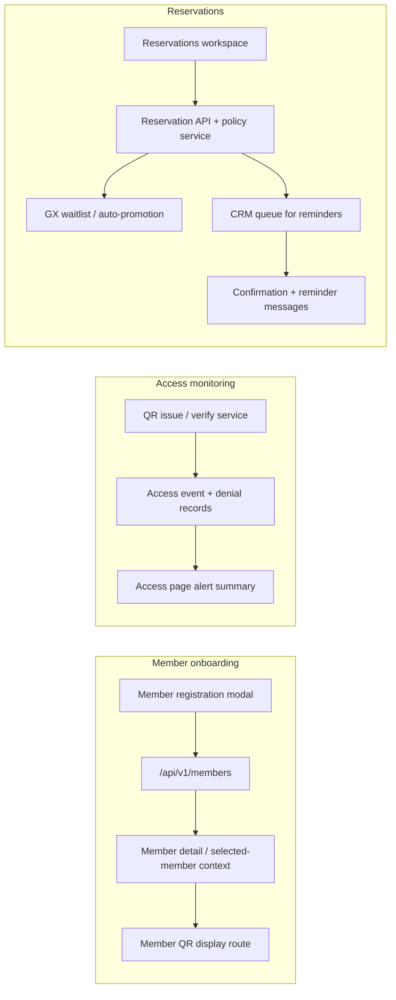

# feat: Sprint 2 Core Ops Flow Alignment

## Overview

Sprint 2 closes the day-to-day operating loop that sits on top of the security and compliance baseline from Sprint 1.

Execution companion:
- `docs/plans/2026-05-08-005-feat-sprint2-core-ops-flow-execution-plan.md`

The remaining work is centered on three user flows:
- member registration completeness
- member-facing QR display and QR-related access handling
- reservation policy alignment for PT/GX, including waitlist, cancellation, deduction timing, and reminders

The plan keeps the work inside the existing admin portal and Spring Boot / React stack, but it adds the smallest missing member-facing surface needed for QR display. It does not expand into locker, product, settlement, or CRM admin redesign.

---

## Problem Frame

The current implementation already has strong skeletons for member management, QR issuance/verification, access monitoring, and reservation operations.

What is still missing is the end-to-end behavior that the requirements document expects:
- member registration still lacks the required emergency-contact capture in the core user flow
- the QR feature exposes a member-facing mobile display path, but the registration response and refresh lifecycle still need to stay aligned with the requirements document
- access monitoring exposes presence/events, but abnormal access needs to be surfaced as an operator-readable workflow, not just a backend count
- reservation behavior is present, but the policy layer around GX waitlist promotion, cancellation cutoff, deduction timing, and reminder dispatch is not yet closed

This sprint aligns those flows with the requirements document and the existing code patterns instead of introducing a new product shape.

---

## Requirements Trace

- R1. `FR-MBR-001` must be implemented as a member registration flow with the required capture fields and duplicate-contact validation.
- R2. `FR-ACC-001`, `FR-ACC-003`, `FR-ACC-004`, and `FR-ACC-005` must be represented as a member QR display path plus an operator-facing access monitoring path.
- R3. `FR-RSV-003`, `FR-RSV-004`, `FR-RSV-005`, `FR-RSV-006`, and `FR-RSV-009` must be represented as explicit reservation policy behavior, not only as raw CRUD actions.
- R4. UC-01, UC-05, UC-06, and UC-07 from `docs/01_요구사항_분석서.md` must remain recognizable in the implementation and verification shape.

**Origin actors:** 프론트데스크 직원, 센터 매니저, 회원, QR게이트 시스템, 시스템, 카카오 알림톡

**Origin flows:** UC-01 회원 등록, UC-05 PT 예약, UC-06 GX 수업 예약, UC-07 QR 출입 인증

---

## Scope Boundaries

- Do not build a full member self-service product beyond the QR display surface needed for this sprint.
- Do not redesign locker, product, settlement, or CRM admin workflows.
- Do not introduce a new notification provider; reuse the current CRM dispatch path for reservation-related reminders and waitlist notifications.
- Do not relax center scoping or method-level role checks while adding these flows.

### Deferred to Follow-Up Work

- Full member-auth/session model for a broader mobile portal
- Full member photo upload/manage flow (`FR-MBR-009`), including storage, retrieval, and replacement UX, which is owned by Sprint 3
- CRM template/admin redesign beyond the reminder and waitlist dispatch needs in this sprint
- Future policy tuning for notification channels if operations later wants more than the current CRM queue supports

---

## Context & Research

### Relevant Code and Patterns

- Member registration flow and shared member state: `backend/src/main/java/com/gymcrm/member/controller/MemberController.java`, `backend/src/main/java/com/gymcrm/member/service/MemberService.java`, `frontend/src/pages/members/modules/useMemberManagementState.ts`, `frontend/src/pages/members/components/MemberListSection.tsx`
- QR issuance/verification flow: `backend/src/main/java/com/gymcrm/access/QrController.java`, `backend/src/main/java/com/gymcrm/access/QrCodeService.java`, `frontend/src/pages/access/AccessPage.tsx`, `frontend/src/pages/access/modules/useAccessQueries.ts`
- Reservation workspace and mutation flow: `backend/src/main/java/com/gymcrm/reservation/controller/ReservationController.java`, `backend/src/main/java/com/gymcrm/reservation/service/ReservationService.java`, `frontend/src/pages/reservations/ReservationsPage.tsx`, `frontend/src/pages/reservations/modules/useSelectedMemberReservationsState.ts`
- CRM dispatch and queue pattern for reminders: `backend/src/main/java/com/gymcrm/crm/controller/CrmMessageController.java`, `backend/src/main/java/com/gymcrm/crm/service/CrmMessageService.java`

### Institutional Learnings

- Reservation state integrity must be modeled with explicit lifecycle and event traces, not just a single mutable row. See `docs/solutions/database-issues/reservation-checkin-noshow-usage-event-integrity-gymcrm-20260225.md`.
- Cross-center scoping and access-control checks must stay aligned across controller, service, and query layers. See `docs/solutions/database-issues/reservation-capacity-and-usage-deduction-integrity-gymcrm-20260225.md`.
- Member-management UI state and selected-member context are already shared across multiple workspaces, so changes there ripple into reservations and access. See `docs/solutions/integration-issues/member-status-filter-not-affecting-results-gymcrm-20260320.md`.

### External References

- None required. The repo already contains direct patterns for the target stack and the work is bounded by local requirements plus existing implementation patterns.

---

## Key Technical Decisions

- Keep the sprint scoped to one coherent operating loop: member onboarding, QR display, access monitoring, and reservation policy.
- Reuse the existing CRM queue and message history model for reminders and waitlist notifications rather than creating a second dispatch system.
- Treat PT reservation deduction timing as an explicit policy choice, with the default behavior preserving current completion-time deduction unless the policy says otherwise.
- Add the member QR surface as a narrow mobile-friendly route instead of broadening the existing admin shell into a full member portal.
- Emit a narrow member-scoped bootstrap path from member registration/detail responses, then use it to issue or refresh QR data without introducing full member login/session management in this sprint.
- Prefer server-side policy values and status flags over hard-coded UI logic for cancellation windows, waitlist promotion, and reminder timing.
- Reservation policy values must come from backend-resolved center-scoped configuration or documented backend defaults; the browser should render resolved values only.

---

## Open Questions

### Resolved During Planning

- Reservation reminders should reuse the existing CRM trigger/queue path rather than adding a separate scheduler subsystem.
- The member QR surface should remain narrow and focused on QR display/refresh, not full account management.
- Access alerts should be surfaced in the operator UI using the existing backend alert summary instead of adding a new alerting service.
- Sprint 2 owns `FR-MBR-001` member registration completeness only; the full member photo upload/manage flow is intentionally deferred to Sprint 3.
- If persisted reservation-policy configuration does not yet exist, Sprint 2 must still return backend-owned center defaults instead of introducing UI-owned constants.

### Deferred to Implementation

- The seeded center-level default values for cancellation lead time and reminder timing if product/config review wants values different from the current operating defaults.

---

## High-Level Technical Design

> This illustrates the intended approach and is directional guidance for review, not implementation specification. The implementing agent should treat it as context, not code to reproduce.

---

## Implementation Units

- [x] U1. **Member Registration Completeness**

**Goal:** Align member registration with the required fields from UC-01, including emergency-contact capture and duplicate-phone validation.

**Requirements:** R1, R4

**Dependencies:** None

**Files:**
- Modify: `backend/src/main/java/com/gymcrm/member/dto/request/MemberCreateRequest.java`
- Modify: `backend/src/main/java/com/gymcrm/member/service/MemberService.java`
- Modify: `backend/src/main/java/com/gymcrm/member/controller/MemberController.java`
- Modify: `frontend/src/pages/members/modules/types.ts`
- Modify: `frontend/src/pages/members/modules/useMemberManagementState.ts`
- Modify: `frontend/src/pages/members/components/MemberListSection.tsx`
- Test: `backend/src/test/java/com/gymcrm/member/MemberServiceTest.java`
- Test: `backend/src/test/java/com/gymcrm/member/MemberSummaryApiIntegrationTest.java`
- Test: `frontend/src/pages/members/modules/useMemberManagementState.test.tsx`
- Test: `frontend/src/pages/members/components/MemberListSection.test.tsx`

**Approach:**
- Keep the existing modal-based member workflow and extend the request/response shape rather than introducing a separate registration screen.
- Preserve the current duplicate-contact validation behavior and make the new fields part of the same create/edit contract.
- Leave the full member photo upload/manage path to Sprint 3 so this sprint stays focused on required registration completeness.

**Execution note:** Start with characterization coverage around the current create/edit member state so the form changes do not regress the existing modal workflow.

**Patterns to follow:**
- `frontend/src/pages/members/modules/useMemberManagementState.ts`
- `frontend/src/pages/members/components/MemberListSection.tsx`
- `backend/src/main/java/com/gymcrm/member/service/MemberService.java`

**Test scenarios:**
- Happy path: creating a member with name, phone, birth date, gender, consent, and memo succeeds and the detail response echoes the saved fields.
- Happy path: the create form accepts the required inputs and keeps the existing selected-member navigation working after save.
- Edge case: empty or whitespace-only required fields still fail before the API call.
- Edge case: duplicate phone numbers still surface the existing duplicate-member warning instead of creating a second record.
- Edge case: emergency contact remains required while existing optional fields continue to round-trip correctly.
- Integration: a successful member create invalidates the member list, updates the selected-member context, and opens the saved detail view.

**Verification:**
- The member registration workflow can capture the required inputs without breaking the existing member list and detail navigation.
- Duplicate-phone behavior stays intact while the new fields are accepted end to end.

- [x] U2. **Member QR Display Flow**

**Goal:** Add the narrow member-facing QR display surface and dynamic refresh behavior required by UC-07, without turning the whole app into a full member portal.

**Requirements:** R2, R4

**Dependencies:** U1

**Files:**
- Modify: `backend/src/main/java/com/gymcrm/access/QrController.java`
- Modify: `backend/src/main/java/com/gymcrm/access/QrCodeService.java`
- Modify: `frontend/src/app/routes.ts`
- Create: `frontend/src/pages/member-qr/MemberQrPage.tsx`
- Create: `frontend/src/pages/member-qr/MemberQrPage.module.css`
- Create: `frontend/src/pages/member-qr/MemberQrPage.test.tsx`
- Test: `backend/src/test/java/com/gymcrm/access/AccessQrApiIntegrationTest.java`
- Test: `backend/src/test/java/com/gymcrm/access/QrCodeServiceTest.java`

**Approach:**
- Reuse the existing QR token service and TTL ceiling, but present the data through a dedicated mobile-friendly route that opens from the auto-generated `memberQrPath` returned by member registration/detail/update.
- Keep the surface focused on token issuance, expiration countdown, and refresh behavior.
- Use a narrow member-scoped bootstrap contract, such as a signed access link or one-time token, so the route can issue/refresh QR data without requiring a broader member session model.

**Execution note:** Use test-first coverage for the QR expiry/refresh behavior because this flow is security-sensitive and easy to regress.

**Patterns to follow:**
- `backend/src/main/java/com/gymcrm/access/QrCodeService.java`
- `backend/src/main/java/com/gymcrm/access/QrController.java`
- `frontend/src/pages/access/AccessPage.tsx`

**Test scenarios:**
- Happy path: the member QR page renders a current token and shows the remaining validity window.
- Happy path: refresh renews the token before it expires and keeps the page usable on a phone-sized viewport.
- Edge case: the page handles a short TTL without showing a stale token as active.
- Error path: invalid or expired token responses surface a clear retry state instead of a blank page.
- Integration: the backend issue endpoint and the new QR page agree on the same TTL and token lifecycle.

**Verification:**
- A member can open the QR view on a mobile-sized screen, see a valid QR, and refresh it before expiry.
- Expired tokens are never presented as valid after the refresh cycle.

- [ ] U3. **Access Monitoring and Alerts**

**Goal:** Surface the existing access presence and denial signals as a readable operator workflow so abnormal access is actionable, not just logged.

**Requirements:** R2, R4

**Dependencies:** None

**Files:**
- Modify: `frontend/src/pages/access/AccessPage.tsx`
- Modify: `frontend/src/pages/access/modules/useAccessQueries.ts`
- Modify: `frontend/src/pages/access/modules/types.ts`
- Test: `frontend/src/pages/access/AccessPage.test.tsx`
- Test: `frontend/src/pages/access/modules/useAccessQueries.test.tsx`

**Approach:**
- Reuse the existing `presence`, `events`, and `alerts` data already available from the backend.
- Add a visible alert summary section with the repeated-denial cues and the “requires immediate attention” state.
- Keep the work in the operator screen rather than introducing a second access dashboard.

**Patterns to follow:**
- `frontend/src/pages/access/AccessPage.tsx`
- `frontend/src/pages/access/modules/useAccessQueries.ts`
- `frontend/src/pages/dashboard/widgets/AccessSummaryWidget.tsx`

**Test scenarios:**
- Happy path: the access page shows current presence, recent events, and a dedicated abnormal-access summary when alert data is present.
- Happy path: repeated denied members are highlighted in the operator view.
- Edge case: no alerts available still leaves the page usable and clearly states that there is nothing urgent.
- Error path: alert fetch failure shows a user-facing message without breaking the rest of the access page.
- Integration: the page keeps the member selector, current session list, and alert summary in sync after a manual refresh.

**Verification:**
- Operators can see at a glance when abnormal access needs attention and which members are repeatedly denied.
- The access screen still works when alert data is empty or temporarily unavailable.

- [ ] U4. **Reservation Policy Engine**

**Goal:** Close the reservation policy gaps for PT/GX by making waitlist promotion, cancellation cutoff, deduction timing, and reminder dispatch explicit server-side behavior.

**Requirements:** R3, R4

**Dependencies:** None

**Files:**
- Modify: `backend/src/main/java/com/gymcrm/reservation/service/ReservationService.java`
- Modify: `backend/src/main/java/com/gymcrm/reservation/controller/ReservationController.java`
- Modify: `backend/src/main/java/com/gymcrm/reservation/gx/service/GxScheduleService.java`
- Modify: `backend/src/main/java/com/gymcrm/crm/service/CrmMessageService.java`
- Create: `backend/src/main/java/com/gymcrm/reservation/service/ReservationPolicyService.java`
- Create: `backend/src/main/java/com/gymcrm/reservation/service/ReservationWaitlistService.java`
- Create: `backend/src/main/java/com/gymcrm/reservation/service/ReservationNotificationService.java`
- Test: `backend/src/test/java/com/gymcrm/reservation/ReservationServiceIntegrationTest.java`
- Test: `backend/src/test/java/com/gymcrm/reservation/ReservationApiIntegrationTest.java`
- Test: `backend/src/test/java/com/gymcrm/reservation/ReservationStatusTransitionServiceTest.java`

**Approach:**
- Keep the current reservation lock and state-machine pattern intact.
- Add policy objects or services so the implementation can choose the correct deduction timing and cancellation behavior without burying those rules inside controller code.
- Reuse the CRM queue path for confirmation and reminder messages instead of adding a second notification worker.
- Model GX waitlist promotion as an explicit state transition so cancellation and auto-confirmation stay deterministic.
- Resolve all policy values on the backend per center and return the resolved values to the UI, whether they come from stored configuration or documented defaults.

**Execution note:** Begin with characterization tests around the current PT completion and GX cancellation behavior so the policy-layer changes are anchored to existing behavior.

**Patterns to follow:**
- `backend/src/main/java/com/gymcrm/reservation/service/ReservationService.java`
- `backend/src/main/java/com/gymcrm/reservation/service/RedissonReservationLockService.java`
- `backend/src/main/java/com/gymcrm/crm/service/CrmMessageService.java`
- `docs/solutions/database-issues/reservation-checkin-noshow-usage-event-integrity-gymcrm-20260225.md`

**Test scenarios:**
- Happy path: a PT reservation uses the configured deduction timing and does not double-deduct when completed.
- Happy path: a GX cancellation promotes the next waitlisted member and enqueues the expected notification.
- Happy path: reservation confirmation creates the reminder dispatch record through the existing CRM queue path.
- Happy path: the API returns the resolved center policy values that the UI uses for cutoff, deduction, and reminder messaging.
- Edge case: cancellation after the configured cutoff follows the policy decision and surfaces the correct user-facing message.
- Edge case: simultaneous reservation or cancellation attempts keep the current lock semantics and do not oversubscribe the schedule.
- Error path: waitlist promotion failure or CRM enqueue failure is surfaced as a controlled reservation-policy error, not as a silent success.
- Integration: reservation state changes, waitlist promotion, and reminder dispatch remain center-scoped and auditable across the service boundary.

**Verification:**
- PT deduction timing matches the selected policy for the center.
- GX waitlist promotion, cancellation handling, and reminder dispatch behave consistently across API, service, and UI expectations.

- [ ] U5. **Reservation Workspace UX Alignment**

**Goal:** Make the reservation workspace reflect the new policy behavior so operators can see deduction timing, waitlist state, cancellation cutoff, and reminder outcomes in the UI.

**Requirements:** R3, R4

**Dependencies:** U4

**Files:**
- Modify: `frontend/src/pages/reservations/ReservationsPage.tsx`
- Modify: `frontend/src/pages/reservations/modules/useSelectedMemberReservationsState.ts`
- Modify: `frontend/src/pages/reservations/modules/types.ts`
- Modify: `frontend/src/pages/reservations/modules/getReservationPanelErrorMessage.ts`
- Test: `frontend/src/pages/reservations/ReservationsPage.test.tsx`
- Test: `frontend/src/pages/reservations/modules/useSelectedMemberReservationsState.test.tsx`
- Test: `frontend/src/pages/reservations/modules/reservableMemberships.test.ts`

**Approach:**
- Reuse the existing member-context and reservation-workbench pattern instead of splitting reservation operations across multiple screens.
- Present the policy state in plain language so desk staff can understand when a reservation is confirmed, waitlisted, canceled, or awaiting reminder dispatch.
- Keep the UI aligned with the backend policy decisions rather than duplicating the policy in the browser.

**Patterns to follow:**
- `frontend/src/pages/reservations/ReservationsPage.tsx`
- `frontend/src/pages/reservations/modules/useSelectedMemberReservationsState.ts`
- `frontend/src/pages/members/components/MemberListSection.tsx`

**Test scenarios:**
- Happy path: the reservation page shows the waitlist-related action/state when a GX class is full.
- Happy path: PT and GX flows continue to work from the member context after the policy labels are added.
- Edge case: cancellation cutoff messaging appears when the reservation is inside the configured window.
- Edge case: policy-related error messages remain readable and do not break the reservation workbench.
- Integration: changes to reservation status or waitlist state refresh the member reservation panel without losing the selected member context.

**Verification:**
- Desk staff can see the current reservation policy state without leaving the reservation workspace.
- The page still supports the existing PT/GX flows while exposing the new policy signals.

---

## System-Wide Impact

- **Interaction graph:** member registration updates feed selected-member state, which in turn feeds reservations and access; QR state feeds access verification; reservation state feeds CRM reminders and waitlist promotion.
- **Error propagation:** member duplicate errors should remain inline; QR errors should stay token-explicit; reservation policy errors should surface as controlled business-rule failures instead of generic server errors.
- **State lifecycle risks:** QR token expiry, waitlist promotion, and reservation cancellation are all stateful and need deterministic transitions to avoid duplicate promotion or stale UI.
- **API surface parity:** member create/detail payloads, QR display payloads, and reservation workspace responses should be kept in sync with `docs/04_API_설계서.md` if any request/response shapes change.
- **Integration coverage:** member create -> detail refresh, QR issue -> mobile view refresh, access denial -> alert summary, reservation cancel -> waitlist promotion -> CRM dispatch all need cross-layer verification.
- **Unchanged invariants:** center scoping, role-based access control, QR TTL ceiling, reservation lock semantics, and the existing CRM queue model should remain intact.

---

## Risks & Dependencies

| Risk | Mitigation |
|------|------------|
| Member QR handoff needs a cleaner identity bootstrap than the current admin auth model provides | Keep the QR view narrow and token-based, and defer a broader member-auth system to follow-up work |
| GX waitlist promotion can race with simultaneous cancel/confirm actions | Reuse the current reservation lock semantics and add deterministic promotion rules plus integration coverage |
| Reminder timing can drift if it is reimplemented outside the CRM queue | Reuse the current CRM trigger/process path and dedupe keys instead of adding a second dispatcher |
| UI policy labels can drift from backend policy values | Keep the browser as a display layer only and drive the policy from server-side fields |

## Entry Criteria for Implementation

- The QR bootstrap contract for the member route is chosen before `U2` begins.
- The backend source of truth for reservation policy values is identified before `U4` begins, whether as persisted center config or documented backend defaults.

---

## Documentation / Operational Notes

- Update `docs/04_API_설계서.md` if the member QR surface or reservation policy work introduces new request/response contracts or endpoint shapes.
- Update the appendix change log in `docs/04_API_설계서.md` if any contract changes are made.
- Update `docs/07_화면_정의서.md` if the new member QR route or reservation workspace states need to be described for handoff.
- Keep `docs/notes/2026-05-08-requirements-gap-tracker.md` aligned with the sprint outcome once implementation lands.

---

## Sources & References

- **Origin document:** `docs/notes/2026-05-08-requirements-gap-tracker.md`
- Related requirements: `docs/01_요구사항_분석서.md`
- Related code: `backend/src/main/java/com/gymcrm/member/controller/MemberController.java`
- Related code: `backend/src/main/java/com/gymcrm/access/QrController.java`
- Related code: `backend/src/main/java/com/gymcrm/access/AccessController.java`
- Related code: `backend/src/main/java/com/gymcrm/reservation/controller/ReservationController.java`
- Related code: `backend/src/main/java/com/gymcrm/crm/controller/CrmMessageController.java`
- Related learning: `docs/solutions/database-issues/reservation-checkin-noshow-usage-event-integrity-gymcrm-20260225.md`
- Related learning: `docs/solutions/database-issues/reservation-capacity-and-usage-deduction-integrity-gymcrm-20260225.md`
- Related learning: `docs/solutions/integration-issues/member-status-filter-not-affecting-results-gymcrm-20260320.md`
