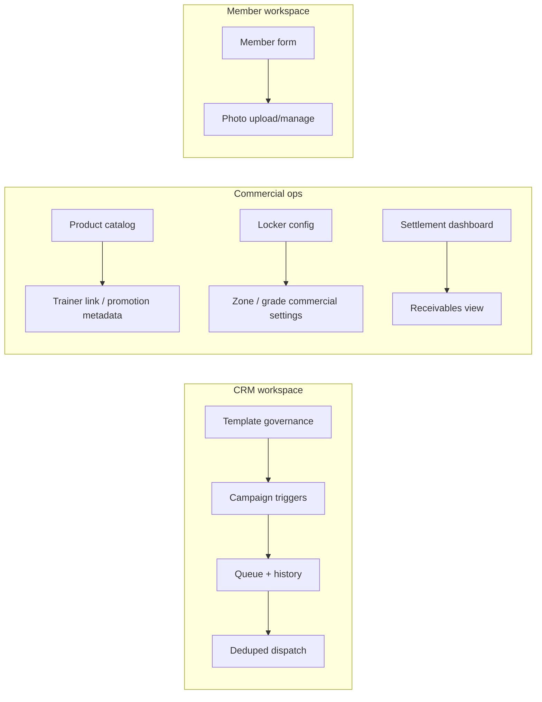

# feat: Sprint 3 Ops Growth Extensions

## Overview

Sprint 3 picks up the remaining should-have operating enhancements after the core security and workflow sprints are in place.

Execution companion:
- `docs/plans/2026-05-08-004-feat-sprint3-ops-growth-execution-plan.md`

This sprint is intentionally additive:
- it extends CRM campaign management and fallback behavior
- it adds commercial configuration to products and lockers
- it introduces a receivables view for unpaid balances
- it finishes the member photo surface required by the member-management requirements

The work should improve operator efficiency without changing the core member, reservation, or access flows that Sprint 1 and Sprint 2 stabilized.

---

## Problem Frame

The current repository already has functional admin pages and backend services for CRM, products, lockers, settlements, and members.

What remains is the operational depth that the requirements document still calls out:
- CRM templates need review-state visibility and the campaign flow needs the long-term inactive / reserved-send cases
- product catalog needs PT trainer linkage and promotional pricing support
- locker management needs zone/grade commercial settings, not just slot assignment
- settlement needs a readable receivables view for unpaid balances and reminders
- member management still lacks the photo upload/manage surface from the registration requirements

The key constraint is scope control: this sprint should harden and extend the existing operational surfaces, not turn them into new products.

---

## Requirements Trace

- R1. `FR-CRM-004`, `FR-CRM-005`, `FR-CRM-006`, `FR-CRM-007`, and `FR-CRM-008` must be represented in the CRM workspace as template governance, history visibility, opt-out filtering, and scheduled / targeted campaign operations.
- R2. `FR-PRD-006` and `FR-PRD-007` must be represented in the product catalog as trainer-linked products and promotion support.
- R3. `FR-LKR-006` must be represented in locker configuration as zone/grade-based operational settings.
- R4. `FR-SAL-007` must be represented as a receivables / unpaid-balance operational view with reminder hooks.
- R5. `FR-MBR-009` must be represented as a member photo upload/manage path in the member workspace.

**Origin actors:** 센터 매니저, 프론트데스크 직원, 시스템, 회원, 카카오 알림톡

---

## Scope Boundaries

- Do not revisit Sprint 1 security policy decisions or Sprint 2 core workflow policy decisions.
- Do not build a new notification provider or replace the existing CRM queue model.
- Do not add locker map or auto-return behavior in this sprint; those belong to the separate locker core backlog.
- Do not turn receivables into a full accounting ledger unless implementation reveals that the current balance model is insufficient.
- Do not introduce a separate member portal; keep the photo work inside the existing member-management experience.

### Deferred to Follow-Up Work

- Full audit-grade accounting ledger for unpaid balances if the lightweight receivables view proves insufficient
- Deep CRM segmentation rules beyond the requested long-term inactive and 예약-related operational flows
- Broader media management or CDN/object-storage abstraction if member photo storage needs more than a feature-local solution

---

## Context & Research

### Relevant Code and Patterns

- CRM template and dispatch flow: `backend/src/main/java/com/gymcrm/crm/controller/CrmMessageTemplateController.java`, `backend/src/main/java/com/gymcrm/crm/controller/CrmMessageController.java`, `backend/src/main/java/com/gymcrm/crm/service/CrmMessageTemplateService.java`, `backend/src/main/java/com/gymcrm/crm/service/CrmMessageService.java`, `frontend/src/pages/crm/CrmPage.tsx`, `frontend/src/pages/crm/modules/useCrmPrototypeState.ts`
- Product catalog workflow: `backend/src/main/java/com/gymcrm/product/controller/ProductController.java`, `backend/src/main/java/com/gymcrm/product/service/ProductService.java`, `frontend/src/pages/products/ProductsPage.tsx`, `frontend/src/pages/products/modules/useProductPrototypeState.ts`
- Locker slot and assignment workflow: `backend/src/main/java/com/gymcrm/locker/LockerController.java`, `backend/src/main/java/com/gymcrm/locker/LockerService.java`, `frontend/src/pages/lockers/LockersPage.tsx`, `frontend/src/pages/lockers/modules/useLockerPrototypeState.ts`
- Settlement dashboard and report flow: `backend/src/main/java/com/gymcrm/settlement/controller/SalesDashboardController.java`, `backend/src/main/java/com/gymcrm/settlement/controller/SalesSettlementReportController.java`, `backend/src/main/java/com/gymcrm/settlement/service/SalesDashboardService.java`, `frontend/src/pages/settlements/SettlementsPage.tsx`, `frontend/src/pages/settlements/modules/useSettlementPrototypeState.ts`
- Member management workflow: `backend/src/main/java/com/gymcrm/member/controller/MemberController.java`, `backend/src/main/java/com/gymcrm/member/service/MemberService.java`, `frontend/src/pages/members/components/MemberListSection.tsx`, `frontend/src/pages/members/modules/useMemberManagementState.ts`

### Institutional Learnings

- CRM queueing should stay idempotent and deduped at the event level. See `docs/solutions/database-issues/pt-availability-based-reservation-integrity-gymcrm-20260327.md` for the existing queue-and-dedup mindset.
- Membership and operational surfaces are already shared through selected-member context, so changes to member data should keep the context refresh contract intact. See `docs/solutions/integration-issues/member-status-filter-not-affecting-results-gymcrm-20260320.md`.
- Operational enhancements should stay local to their feature packages instead of being pushed into a generic common layer unless a shared platform concern is actually discovered.

### External References

- None required. The target surfaces already follow stable local patterns and this sprint is a bounded extension of them.

---

## Key Technical Decisions

- Keep CRM template governance and CRM campaign execution as separate concerns so template review state does not tangle with campaign dispatch logic.
- Only templates in an operator-approved sendable state may be used for campaign dispatch; rejected or inactive templates remain visible for governance/history but are not eligible for sends.
- Reuse the existing CRM queue and history model for long-term inactive and 예약-related sends, with scheduled sends flowing through the same event/history pipeline.
- Treat product trainer linkage and promotional pricing as catalog metadata, not as a separate pricing engine.
- Keep locker zone/grade pricing tied to locker slot configuration and expose it through the current locker workspace.
- Implement receivables as a focused operational view first; only broaden into a deeper ledger if the existing payment/adjustment model cannot support the required reporting.
- Keep receivables reminder hooks as CRM-queue-backed operator actions or eligibility markers, not as a second settlement-specific notification pipeline.
- Add member photo support inside the member module and keep the exact storage sink feature-local until implementation proves a broader storage abstraction is necessary.
- Member photo handling must define basic guardrails up front: accepted file types, file-size ceiling, replacement behavior, and who may read/update the image.

---

## Open Questions

### Resolved During Planning

- CRM should continue to use the existing queue/history model rather than introducing a second notification path.
- The product, locker, settlement, and member-photo additions should remain in their respective feature modules.
- The sprint should not absorb locker map or automatic return behavior from the separate locker backlog.

### Deferred to Implementation

- The exact persistence shape for member photos if the current repository has no existing media-storage abstraction.
- Whether receivables can be fully derived from current payment/adjustment records or need a thin new summary table for performance.
- Whether product promotions need a compact date-range record or a richer promotion object once the first implementation pass starts.
- The exact label set for CRM template review states, as long as sendable vs non-sendable behavior stays explicit.

---

## High-Level Technical Design

> This illustrates the intended approach and is directional guidance for review, not implementation specification. The implementing agent should treat it as context, not code to reproduce.

---

## Implementation Units

- [x] U1. **CRM Template Governance**

**Goal:** Add template review-state visibility and preserve the current SMS fallback behavior for CRM templates and sends.

**Requirements:** R1

**Dependencies:** None

**Files:**
- Modify: `backend/src/main/java/com/gymcrm/crm/controller/CrmMessageTemplateController.java`
- Modify: `backend/src/main/java/com/gymcrm/crm/service/CrmMessageTemplateService.java`
- Modify: `backend/src/main/java/com/gymcrm/crm/entity/CrmMessageTemplate.java`
- Modify: `frontend/src/pages/crm/CrmPage.tsx`
- Modify: `frontend/src/pages/crm/modules/useCrmPrototypeState.ts`
- Modify: `frontend/src/pages/crm/modules/types.ts`
- Test: `backend/src/test/java/com/gymcrm/crm/CrmMessageTemplateServiceIntegrationTest.java`
- Test: `backend/src/test/java/com/gymcrm/crm/CrmMessageServiceTest.java`
- Test: `frontend/src/pages/crm/CrmPage.test.tsx`
- Test: `frontend/src/pages/crm/modules/useCrmPrototypeState.test.tsx`

**Approach:**
- Keep template CRUD inside the existing CRM template controller and service.
- Extend the template model with review/status visibility in the same workspace that already lists templates and send history.
- Preserve the current SMS fallback behavior and expose failure state in a way that operators can read from the existing CRM page.
- Make sendable-vs-non-sendable template eligibility explicit at the service boundary so campaign dispatch cannot bypass governance state.

**Execution note:** Use characterization coverage around the current template create/update/list flow before introducing the review-state change.

**Patterns to follow:**
- `backend/src/main/java/com/gymcrm/crm/controller/CrmMessageTemplateController.java`
- `backend/src/main/java/com/gymcrm/crm/service/CrmMessageTemplateService.java`
- `frontend/src/pages/crm/CrmPage.tsx`

**Test scenarios:**
- Happy path: creating and updating a template preserves the existing template list and history interactions.
- Happy path: the CRM page shows template review/state information alongside the current send history.
- Edge case: rejected or inactive templates remain visible for governance/history but cannot be used for new dispatches.
- Edge case: inactive templates remain visible only where the UI intentionally expects them.
- Error path: invalid channel/type/body input still fails validation before persistence.
- Integration: the CRM page and backend template API stay aligned on the review/status fields.

**Verification:**
- Operators can see template status without leaving the CRM workspace.
- Existing CRM send behavior still works when template governance data is present.

- [x] U2. **CRM Campaign Coverage**

**Goal:** Add the long-term inactive and scheduled-send campaign behavior on top of the existing CRM queue and dispatch model.

**Requirements:** R1

**Dependencies:** None

**Files:**
- Modify: `backend/src/main/java/com/gymcrm/crm/controller/CrmMessageController.java`
- Modify: `backend/src/main/java/com/gymcrm/crm/service/CrmMessageService.java`
- Modify: `backend/src/main/java/com/gymcrm/crm/repository/CrmTargetRepository.java`
- Modify: `backend/src/main/java/com/gymcrm/crm/repository/CrmMessageEventRepository.java`
- Modify: `frontend/src/pages/crm/CrmPage.tsx`
- Modify: `frontend/src/pages/crm/modules/useCrmPrototypeState.ts`
- Modify: `frontend/src/pages/crm/modules/types.ts`
- Test: `backend/src/test/java/com/gymcrm/crm/CrmMessageServiceIntegrationTest.java`
- Test: `backend/src/test/java/com/gymcrm/crm/CrmMessageServiceTest.java`
- Test: `frontend/src/pages/crm/CrmPage.test.tsx`
- Test: `frontend/src/pages/crm/modules/useCrmPrototypeState.test.tsx`

**Approach:**
- Reuse the existing event queue, dedupe keys, and history list.
- Add the long-term inactive target query as another CRM trigger path rather than introducing a separate campaign engine.
- Surface 예약 발송 through the same `scheduledAt` style already used by the CRM trigger flow.
- Require campaign dispatch to use templates that are in a sendable governance state.

**Patterns to follow:**
- `backend/src/main/java/com/gymcrm/crm/service/CrmMessageService.java`
- `backend/src/main/java/com/gymcrm/crm/controller/CrmMessageController.java`
- `backend/src/main/java/com/gymcrm/crm/repository/CrmTargetRepository.java`

**Test scenarios:**
- Happy path: the long-term inactive trigger finds eligible members and enqueues exactly one event per deduped target.
- Happy path: 예약 발송 keeps the event in pending state until its scheduled time.
- Edge case: campaign creation with a non-sendable template is rejected before event creation.
- Edge case: opt-out members are excluded from marketing campaigns but remain eligible for informational flows where the requirements allow it.
- Edge case: duplicate trigger requests do not create duplicate events.
- Integration: campaign creation, queue processing, and history refresh remain consistent on the CRM page.

**Verification:**
- CRM campaign operations can be triggered and replayed without duplicate dispatches.
- Scheduled sends stay visible in the same history model as other CRM messages.

- [x] U3. **Product Catalog Extensions**

**Goal:** Add trainer-linked products and promotional pricing support to the product catalog while keeping the existing product CRUD and list behavior intact.

**Requirements:** R2

**Dependencies:** None

**Files:**
- Modify: `backend/src/main/java/com/gymcrm/product/controller/ProductController.java`
- Modify: `backend/src/main/java/com/gymcrm/product/service/ProductService.java`
- Modify: `backend/src/main/java/com/gymcrm/product/entity/Product.java`
- Modify: `backend/src/main/java/com/gymcrm/product/dto/request/ProductCreateRequest.java`
- Modify: `backend/src/main/java/com/gymcrm/product/dto/request/ProductUpdateRequest.java`
- Modify: `backend/src/main/java/com/gymcrm/product/dto/response/ProductResponse.java`
- Modify: `frontend/src/pages/products/ProductsPage.tsx`
- Modify: `frontend/src/pages/products/modules/types.ts`
- Modify: `frontend/src/pages/products/modules/useProductPrototypeState.ts`
- Test: `backend/src/test/java/com/gymcrm/product/ProductServiceTest.java`
- Test: `backend/src/test/java/com/gymcrm/product/ProductApiIntegrationTest.java`
- Test: `frontend/src/pages/products/ProductsPage.test.tsx`
- Test: `frontend/src/pages/products/modules/useProductPrototypeState.test.tsx`

**Approach:**
- Extend the current product catalog rather than splitting it into a new pricing subsystem.
- Keep trainer linkage and promotion rules as catalog metadata that the product page can edit and list.
- Preserve the current category/type/status filters and add the new fields only where they materially help operators manage the catalog.

**Execution note:** Start with characterization coverage around the current product create/update validation so the new metadata does not loosen the existing catalog rules.

**Patterns to follow:**
- `backend/src/main/java/com/gymcrm/product/controller/ProductController.java`
- `backend/src/main/java/com/gymcrm/product/service/ProductService.java`
- `frontend/src/pages/products/ProductsPage.tsx`

**Test scenarios:**
- Happy path: a product can be created and edited with trainer-link and promotion fields preserved.
- Happy path: product list filters still behave as before while the new fields are displayed.
- Edge case: invalid promotion windows or trainer references are rejected before persistence.
- Edge case: existing product statuses and category filters remain stable when the new fields are blank.
- Integration: the product workspace stays usable for manager and desk roles after the extension.

**Verification:**
- The catalog can represent trainer-specific PT products and promotional pricing without breaking existing product management.

- [x] U4. **Locker Commercial Settings**

**Goal:** Add locker zone/grade-based commercial settings to the locker workspace and keep slot assignment/return behavior intact.

**Requirements:** R3

**Dependencies:** None

**Files:**
- Modify: `backend/src/main/java/com/gymcrm/locker/LockerController.java`
- Modify: `backend/src/main/java/com/gymcrm/locker/LockerService.java`
- Modify: `backend/src/main/java/com/gymcrm/locker/LockerSlot.java`
- Modify: `backend/src/main/java/com/gymcrm/locker/LockerSlotEntity.java`
- Modify: `backend/src/main/java/com/gymcrm/locker/LockerSlotRepository.java`
- Modify: `backend/src/main/java/com/gymcrm/locker/LockerAssignment.java`
- Modify: `frontend/src/pages/lockers/LockersPage.tsx`
- Modify: `frontend/src/pages/lockers/modules/types.ts`
- Modify: `frontend/src/pages/lockers/modules/useLockerPrototypeState.ts`
- Modify: `frontend/src/pages/lockers/modules/useLockerQueries.ts`
- Test: `backend/src/test/java/com/gymcrm/locker/LockerServiceIntegrationTest.java`
- Test: `backend/src/test/java/com/gymcrm/locker/LockerApiIntegrationTest.java`
- Test: `frontend/src/pages/lockers/LockersPage.test.tsx`
- Test: `frontend/src/pages/lockers/modules/useLockerPrototypeState.test.tsx`

**Approach:**
- Keep the existing slot/assignment model and add the commercial settings directly to that feature boundary.
- Make zone and grade part of the operator-facing locker view so pricing logic is visible where the locker is managed.
- Avoid introducing the separate visual map or automatic return machinery from the core locker backlog.

**Patterns to follow:**
- `backend/src/main/java/com/gymcrm/locker/LockerController.java`
- `backend/src/main/java/com/gymcrm/locker/LockerService.java`
- `frontend/src/pages/lockers/LockersPage.tsx`

**Test scenarios:**
- Happy path: lockers can be created and listed with zone/grade pricing metadata visible.
- Happy path: existing assignment and return behavior remains intact after the commercial settings are added.
- Edge case: invalid zone/grade combinations or missing pricing metadata fail validation.
- Edge case: bulk create still deduplicates codes while preserving the new settings.
- Integration: locker filters and assignment actions keep working from the same page after the extension.

**Verification:**
- Operators can see and edit locker commercial settings without losing the current locker lifecycle behavior.

- [x] U5. **Settlement Receivables View**

**Goal:** Add a focused unpaid-balance / receivables view and CRM-backed reminder eligibility hook to the settlement workspace without turning the module into a full accounting ledger.

**Requirements:** R4

**Dependencies:** None

**Files:**
- Modify: `backend/src/main/java/com/gymcrm/settlement/controller/SalesDashboardController.java`
- Modify: `backend/src/main/java/com/gymcrm/settlement/controller/SalesSettlementReportController.java`
- Create: `backend/src/main/java/com/gymcrm/settlement/controller/SalesReceivablesController.java`
- Create: `backend/src/main/java/com/gymcrm/settlement/service/SalesReceivablesService.java`
- Modify: `backend/src/main/java/com/gymcrm/settlement/service/SalesDashboardService.java`
- Modify: `frontend/src/pages/settlements/SettlementsPage.tsx`
- Modify: `frontend/src/pages/settlements/modules/types.ts`
- Modify: `frontend/src/pages/settlements/modules/useSettlementPrototypeState.ts`
- Modify: `frontend/src/pages/settlements/modules/useSettlementRecentAdjustmentsQuery.ts`
- Test: `backend/src/test/java/com/gymcrm/settlement/SalesDashboardServiceTest.java`
- Test: `backend/src/test/java/com/gymcrm/settlement/SalesDashboardServiceIntegrationTest.java`
- Test: `backend/src/test/java/com/gymcrm/settlement/SalesSettlementApiIntegrationTest.java`
- Test: `frontend/src/pages/settlements/SettlementsPage.test.tsx`
- Test: `frontend/src/pages/settlements/modules/useSettlementPrototypeState.test.tsx`

**Approach:**
- Reuse the current settlement dashboard and recent-adjustment patterns as the source of truth for unpaid balances.
- Add a small receivables surface that highlights outstanding balances and reminder eligibility instead of building a full debt subsystem.
- Keep reminder behavior limited to CRM-queue-backed operator actions or visible reminder candidates; do not introduce a settlement-local dispatch engine in this sprint.
- Keep the UI in the existing settlements page and let the new controller/service provide the additional operational slice.

**Execution note:** Characterize the existing sales dashboard and recent-adjustment outputs before adding the new receivables slice so the new summary stays consistent with current reporting.

**Patterns to follow:**
- `backend/src/main/java/com/gymcrm/settlement/controller/SalesDashboardController.java`
- `backend/src/main/java/com/gymcrm/settlement/controller/SalesSettlementReportController.java`
- `frontend/src/pages/settlements/SettlementsPage.tsx`

**Test scenarios:**
- Happy path: the receivables view shows outstanding balances and reminder candidates for the selected center.
- Happy path: the settlements page still shows the existing sales dashboard and report data alongside the new receivables slice.
- Happy path: a reminder-eligible receivable can be handed off to the existing CRM path without creating a second notification model.
- Edge case: no outstanding balances produces a calm empty state rather than an error.
- Error path: receivables query failure does not break the sales dashboard or report sections.
- Integration: receivables data remains consistent with the payment/reporting context already used by settlements.

**Verification:**
- Operators can identify unpaid balances and reminder candidates from the settlements workspace without losing the current reporting flow.

- [x] U6. **Member Photo Upload and Display**

**Goal:** Add the member photo upload/manage path required by the member requirements and surface the current photo state in the member workspace.

**Requirements:** R5

**Dependencies:** None

**Files:**
- Modify: `backend/src/main/java/com/gymcrm/member/controller/MemberController.java`
- Modify: `backend/src/main/java/com/gymcrm/member/service/MemberService.java`
- Modify: `backend/src/main/java/com/gymcrm/member/dto/request/MemberCreateRequest.java`
- Modify: `backend/src/main/java/com/gymcrm/member/dto/request/MemberUpdateRequest.java`
- Modify: `backend/src/main/java/com/gymcrm/member/dto/response/MemberDetailResponse.java`
- Create: `backend/src/main/java/com/gymcrm/member/service/MemberPhotoService.java`
- Create: `frontend/src/pages/members/components/MemberPhotoField.tsx`
- Modify: `frontend/src/pages/members/components/MemberListSection.tsx`
- Modify: `frontend/src/pages/members/modules/types.ts`
- Modify: `frontend/src/pages/members/modules/useMemberManagementState.ts`
- Test: `backend/src/test/java/com/gymcrm/member/MemberServiceTest.java`
- Test: `backend/src/test/java/com/gymcrm/member/MemberSummaryApiIntegrationTest.java`
- Test: `backend/src/test/java/com/gymcrm/member/MemberPhotoApiIntegrationTest.java`
- Test: `frontend/src/pages/members/components/MemberListSection.test.tsx`
- Test: `frontend/src/pages/members/modules/useMemberManagementState.test.tsx`
- Test: `frontend/src/pages/members/components/MemberPhotoField.test.tsx`

**Approach:**
- Keep the photo surface inside the member module so the current member-management experience stays the single entry point.
- Represent the photo as a member-local attachment and let the exact storage sink remain a feature-local concern until implementation confirms the best fit.
- Surface the photo in the member detail/edit flow rather than creating a separate photo management page.
- Define basic upload guardrails at implementation time: accepted MIME/image types, maximum file size, replacement semantics, and role-based read/update access.

**Execution note:** Use test-first coverage around the photo upload and retrieval flow because the repo currently has no broad file-upload pattern to lean on.

**Patterns to follow:**
- `backend/src/main/java/com/gymcrm/member/controller/MemberController.java`
- `backend/src/main/java/com/gymcrm/member/service/MemberService.java`
- `frontend/src/pages/members/components/MemberListSection.tsx`

**Test scenarios:**
- Happy path: a member can be created or updated with a photo attachment and see the current photo state in the detail view.
- Happy path: the member modal shows the photo field without breaking the existing registration form.
- Edge case: missing photo data remains optional where the requirements allow it.
- Edge case: unsupported file type or oversize image is rejected cleanly before persistence.
- Error path: invalid photo input fails validation cleanly before persistence.
- Integration: the member list/detail workflow still works after photo metadata is added.

**Verification:**
- Frontdesk staff can attach and review a member photo from the existing member workspace.
- The member registration/edit flow still works when photo data is absent.
- Photo access and replacement behavior remain consistent with the chosen operator permissions.

---

## System-Wide Impact

- **Interaction graph:** CRM template and campaign changes affect member opt-out handling and queued sends; product and locker metadata changes affect catalog and assignment screens; settlement receivables affect the reporting workspace; member photo affects the member modal and detail view.
- **Error propagation:** CRM failures should remain visible in the CRM page history, product/locker validation should stay inline in their forms, settlement receivables should fail softly without taking down the dashboard, and member photo errors should stay local to the member modal.
- **State lifecycle risks:** queued campaign deduplication, promotion metadata drift, locker commercial metadata drift, and photo attachment lifecycle are the main stateful risks.
- **API surface parity:** if any request/response shapes change, `docs/04_API_설계서.md` and the corresponding frontend DTOs should be updated together.
- **Integration coverage:** CRM trigger/process, product edit/list, locker create/assign/list, settlement dashboard/receivables, and member create/edit/photo all need cross-layer checks.
- **Unchanged invariants:** center scoping, role-based authorization, the existing CRM dispatch queue, the product/locker/admin shell structure, and the member selected-context behavior should remain intact.

---

## Risks & Dependencies

| Risk | Mitigation |
|------|------------|
| Member photo storage may not map cleanly onto the repo's current persistence patterns | Keep the storage sink feature-local and defer a wider media abstraction unless implementation proves it is required |
| CRM campaign additions can duplicate existing queue entries if dedupe keys are inconsistent | Reuse the current event/history dedupe model and cover duplicate-trigger scenarios in tests |
| Product and locker metadata changes may require schema adjustments | Treat schema shape as a follow-up implementation detail and keep the plan focused on the feature boundary |
| Receivables can grow into an accounting project if scoped too broadly | Keep the first pass to a readable operational view tied to existing payment and adjustment records |

---

## Documentation / Operational Notes

- Update `docs/04_API_설계서.md` if any new request/response shapes or endpoints are introduced for CRM, receivables, or member photos.
- Update `docs/07_화면_정의서.md` if the CRM, product, locker, settlement, or member workspace layouts gain new visible controls or states.
- Keep `docs/notes/2026-05-08-requirements-gap-tracker.md` aligned with the sprint outcome once implementation lands.

---

## Sources & References

- **Origin document:** `docs/notes/2026-05-08-requirements-gap-tracker.md`
- Related requirements: `docs/01_요구사항_분석서.md`
- Related code: `backend/src/main/java/com/gymcrm/crm/controller/CrmMessageTemplateController.java`
- Related code: `backend/src/main/java/com/gymcrm/crm/controller/CrmMessageController.java`
- Related code: `backend/src/main/java/com/gymcrm/product/controller/ProductController.java`
- Related code: `backend/src/main/java/com/gymcrm/locker/LockerController.java`
- Related code: `backend/src/main/java/com/gymcrm/settlement/controller/SalesDashboardController.java`
- Related code: `backend/src/main/java/com/gymcrm/member/controller/MemberController.java`
- Related learning: `docs/solutions/database-issues/pt-availability-based-reservation-integrity-gymcrm-20260327.md`
- Related learning: `docs/solutions/database-issues/reservation-checkin-noshow-usage-event-integrity-gymcrm-20260225.md`
- Related learning: `docs/solutions/integration-issues/member-status-filter-not-affecting-results-gymcrm-20260320.md`
